<p align="center">
  
</p>

<p align="center">
  
  
  
  
  
  
</p>

---

## k1s0 とは

k1s0（キソ）は、企業のシステム開発部門を対象とした **ワンストップ開発基盤** です。

対話式CLIまたはデスクトップGUIから、プロジェクトの初期構築・ひな形生成・ビルド・テスト・デプロイまでを一貫して実行できます。クリーンアーキテクチャ・DDD・TDDに基づいたベストプラクティスが最初から組み込まれており、チームの技術力に依存せず高品質なコードベースを維持できます。

### 解決する課題

| 課題                               | k1s0 のアプローチ                                                 |
| ---------------------------------- | ----------------------------------------------------------------- |
| プロジェクト初期構築に数週間かかる | 対話式CLIで数分で完了。認証・可観測性・CI/CD込み                  |
| 新技術の採用ハードルが高い         | ベストプラクティス内蔵のテンプレートで学習コストを最小化          |
| サービスの追加・変更に手間がかかる | マイクロサービス前提の設計で、新サービスをコマンド1つで追加       |
| 可観測性の後付けが困難             | OpenTelemetry・ログ・メトリクスをゼロコンフィグで初期構成に組込み |
| 開発環境のセットアップが属人化     | Dev Container + docker-compose で環境を即時再現                   |

---

## なぜ k1s0 なのか

### 設計ドキュメントが「生きている」

k1s0 のリポジトリには 50 以上の設計ドキュメントが同梱されています。API設計・認証認可・可観測性・メッセージング・サービスメッシュ・Kubernetes・Helm・Terraform――これらはコードと同じリポジトリで管理され、実装と常に同期しています。ドキュメントが形骸化しない仕組みが、チームのオンボーディングと意思決定を加速します。

### コード生成ではなく「アーキテクチャ生成」

一般的なスキャフォールディングツールはファイルを生成して終わりですが、k1s0 が生成するのはアーキテクチャそのものです。クリーンアーキテクチャに基づくレイヤー分離、Repository パターンによるDB抽象化、OpenTelemetry 計装、ヘルスチェックエンドポイント、CI/CD パイプライン、Helm Chart、Dockerfile――本番運用に必要な構成要素が最初から揃った状態でプロジェクトが始まります。

### 言語の壁を越える統一設計

Go と Rust のサーバー、React と Flutter のクライアント。異なる言語・フレームワークを採用しても、ディレクトリ構成・テスト戦略・設定管理・エラーハンドリングのパターンが統一されています。あるサービスで身につけた知識が、別の言語のサービスでもそのまま通用する設計です。

### 独自の3階層で「成長する基盤」

system / business / service の3階層は、組織の成長に合わせて自然にスケールします。最初は system 層の認証と1つの service だけで始め、部門が増えれば business 層を追加し、サービスが増えても依存方向のルールが秩序を保ちます。小さく始めて大きく育てるアーキテクチャです。

### セキュリティとガバナンスが初期構成

Keycloak による認証基盤、Vault によるシークレット管理、Istio の mTLS によるサービス間暗号化、Cosign によるコンテナイメージ署名、Kong のレート制限――エンタープライズに求められるセキュリティ要件が、後から追加するのではなく最初から組み込まれています。

---

## 主な特徴

### CLIによるワンストップ開発

```
$ k1s0

? 操作を選択してください
> プロジェクト初期化
  ひな形生成
  ビルド
  テスト実行
  デプロイ
```

対話式のプロンプトに答えるだけで、サーバー・クライアント・ライブラリ・データベースのひな形を自動生成。技術選択（Go/Rust、React/Flutter、REST/gRPC/GraphQL）も対話的に行えます。

### 3階層アーキテクチャ（Tier Architecture）

```
regions/
├── system/      全プロジェクト共通の基盤（認証・API GW・可観測性）
├── business/    部門・業務領域ごとの共通基盤（経理・FA 等）
└── service/     個別サービスの実装（注文・在庫 等）
```

**system → business → service** の明確な依存方向により、共通基盤の再利用と各サービスの独立性を両立。大規模組織でも統制の取れたサービス開発を実現します。

### ベストプラクティスの内蔵

生成されるコードは以下の設計思想に準拠しています。

- **クリーンアーキテクチャ** — レイヤー分離によるテスタビリティの確保
- **ドメイン駆動設計（DDD）** — ドメインモデルを中心とした設計
- **テスト駆動開発（TDD）** — テストファーストによる品質担保
- **イベント駆動アーキテクチャ** — サービス間の疎結合な連携
- **CQRS / Event Sourcing / Saga** — 必要に応じた段階的導入

### 可観測性のゼロコンフィグ

すべてのサービスに OpenTelemetry ベースの可観測性スタックが初期構成として組み込まれます。

| コンポーネント            | 用途                         |
| ------------------------- | ---------------------------- |
| OpenTelemetry             | テレメトリデータの収集・送信 |
| Jaeger                    | 分散トレーシング             |
| Prometheus + Alertmanager | メトリクス収集・アラート管理 |
| Grafana                   | ダッシュボード・可視化       |
| Loki + Promtail           | ログ集約・収集               |

---

## 技術スタック

### 言語・フレームワーク

| カテゴリ                         | 技術                                              |
| -------------------------------- | ------------------------------------------------- |
| サーバー                         | **Go 1.23** / **Rust 1.82**                       |
| Web クライアント                 | **React** (TanStack Query, Zustand, Tailwind CSS) |
| モバイル・クロスプラットフォーム | **Flutter 3.24** (Riverpod, go_router, freezed)   |
| デスクトップGUI                  | **Tauri 2** + React                               |
| CLI                              | **Rust** (dialoguer, Tera テンプレートエンジン)   |
| E2E テスト                       | **Python 3.12** (pytest)                          |

### API・通信

| 技術                             | 用途                               |
| -------------------------------- | ---------------------------------- |
| REST API + OpenAPI               | 汎用的な HTTP 通信                 |
| gRPC + Protocol Buffers          | サービス間の高速内部通信           |
| GraphQL (gqlgen / async-graphql) | クライアント主導の柔軟なデータ取得 |
| Kafka 3.8 (Strimzi)              | 非同期メッセージング・イベント駆動 |

### インフラ・運用

| 技術                | 用途                                 |
| ------------------- | ------------------------------------ |
| Docker + Kubernetes | コンテナオーケストレーション         |
| Helm                | マニフェストのテンプレート管理       |
| Terraform + Ansible | IaC・プロビジョニング                |
| Istio + Envoy       | サービスメッシュ・mTLS               |
| Kong 3.7            | API ゲートウェイ                     |
| GitHub Actions      | CI/CD パイプライン                   |
| Flagger             | プログレッシブデリバリー（カナリア） |
| Harbor + Cosign     | コンテナレジストリ・イメージ署名     |

### セキュリティ

| 技術                 | 用途                 |
| -------------------- | -------------------- |
| OAuth 2.0 / OIDC     | 認証・ID 連携        |
| JWT                  | トークンベースの認可 |
| Keycloak 26.0 LTS    | ID プロバイダー      |
| HashiCorp Vault 1.17 | シークレット一元管理 |

### データストア

| 技術          | 用途                       |
| ------------- | -------------------------- |
| PostgreSQL 17 | メインの RDBMS             |
| MySQL 8.4     | 互換性が求められる場合     |
| SQLite        | 軽量な組込み用途           |
| Redis 7       | キャッシュ・セッション管理 |

---

## クイックスタート

### 前提条件

- Rust 1.82+
- Docker & Docker Compose
- Go 1.23+（Go サーバー開発時）

### インストールと起動

```bash
# リポジトリのクローン
git clone https://github.com/RyheiKiso/k1s0.git
cd k1s0

# CLI のビルド
cd CLI && cargo build --release

# k1s0 CLI の起動
./target/release/k1s0
```

### Dev Container での開発（推奨）

VS Code + Dev Containers 拡張機能を使えば、開発環境を即時構築できます。

```bash
# VS Code で開く
code .
# → "Reopen in Container" を選択
```

### ローカルインフラの起動

```bash
# PostgreSQL, Redis 等のインフラを起動
docker compose --profile infra up -d
```

---

## プロジェクト構成

```
k1s0/
├── CLI/                 Rust 製の対話式 CLI ツール + Tauri GUI
├── regions/             3 階層のアプリケーション基盤
│   ├── system/            共通基盤（認証・設定管理・テレメトリ）
│   ├── business/          部門固有の共通基盤
│   └── service/           個別サービスの実装
├── api/proto/           共有 Protocol Buffers 定義
├── infra/               IaC（Terraform / Helm / Kong / Istio / Docker）
├── e2e/                 E2E テスト（Python + pytest）
├── docs/                設計ドキュメント（50+ ファイル）
└── docker-compose.yaml  ローカル開発環境
```

---

## ドキュメント

設計の全体像と各コンポーネントの詳細は `docs/` 配下に整備されています。

| ドキュメント                                     | 内容                                       |
| ------------------------------------------------ | ------------------------------------------ |
| [コンセプト](docs/コンセプト.md)                 | プロジェクトの目的・技術スタック・設計思想 |
| [Tier Architecture](docs/tier-architecture.md)   | 3階層アーキテクチャの設計と依存ルール      |
| [ディレクトリ構成図](docs/ディレクトリ構成図.md) | モノリポのディレクトリ設計                 |
| [CLIフロー](docs/CLIフロー.md)                   | CLI の対話フローと操作手順                 |
| [API設計](docs/API設計.md)                       | REST / gRPC / GraphQL の設計方針           |
| [認証認可設計](docs/認証認可設計.md)             | OAuth 2.0・JWT・Keycloak・Vault            |
| [可観測性設計](docs/可観測性設計.md)             | 監視・アラート・SLO/SLA・構造化ログ        |
| [kubernetes設計](docs/kubernetes設計.md)         | Kubernetes リソース設計                    |
| [CI-CD設計](docs/CI-CD設計.md)                   | GitHub Actions パイプライン                |
| [コーディング規約](docs/コーディング規約.md)     | 言語横断のコーディング規約・命名規則       |

---

## 導入の流れ

```
1. k1s0 CLI でプロジェクトを初期化
   → モノリポ構成・CI/CD・Dev Container が即座に生成される

2. 対話式プロンプトで最初のサービスを追加
   → クリーンアーキテクチャ準拠のサーバー + DB マイグレーション + テスト + Helm Chart

3. docker compose up で開発開始
   → PostgreSQL・Redis・Kafka・Prometheus・Grafana がローカルで起動

4. コードを書いて push
   → GitHub Actions が自動でリント・テスト・ビルド・イメージ署名・デプロイ
```

チームメンバーの追加も簡単です。Dev Container を開くだけで、全員が同じ開発環境を手に入れられます。sparse-checkout を使えば、担当する階層のコードだけをチェックアウトすることも可能です。

---

## 開発への参加

### ブランチ戦略

- `main` — 安定版
- `work` — 開発ブランチ

### テストの実行

```bash
# Rust テスト
cargo test --workspace

# Go テスト
go test ./...

# E2E テスト
cd e2e && pytest
```

### リント

```bash
# Rust
cargo clippy --all-targets
cargo fmt --check

# Go
golangci-lint run ./...
```
