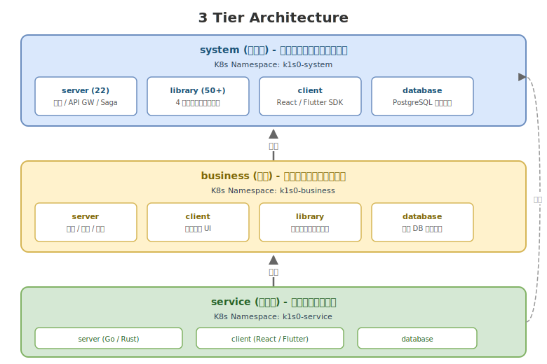

<p align="center">
  
</p>

<p align="center">
  
  
  
  
  
  
</p>

---

**k1s0（キソ）** — CLI 一つでマイクロサービスの構築から運用まで完結する、エンタープライズ向け開発基盤。

> **貢献・開発参加について**: [CONTRIBUTING.md](CONTRIBUTING.md) | [オンボーディングガイド](docs/onboarding/README.md) | [Day 1 クイックスタート](docs/onboarding/quickstart.md)

Go / Rust / TypeScript / Dart の 4 言語に対応し、クリーンアーキテクチャ・DDD・TDD に沿った設計を初期構成に組み込みます。対話式 CLI と Tauri デスクトップ GUI で、ひな形生成・ビルド・テスト・デプロイまで開発者体験を統一します。

---

## 目次

- [3 ティアアーキテクチャ](#3-ティアアーキテクチャ)
- [技術スタック](#技術スタック)
- [ディレクトリ構成](#ディレクトリ構成)
- [System サーバー](#system-サーバー)
- [マルチ言語ライブラリ（50+）](#マルチ言語ライブラリ50)
- [CLI / GUI](#cli--gui)
- [インフラ構成](#インフラ構成)
- [クイックスタート](#クイックスタート)
  - [Docker Compose 構成](#docker-compose-構成)
- [アーキテクチャ図](#アーキテクチャ図)
- [ドキュメント](#ドキュメント)

---

## 3 ティアアーキテクチャ

<p align="center">
  
</p>

| Tier | 役割 | K8s Namespace |
|------|------|---------------|
| **system** | 全プロジェクト共通の基盤サービス・ライブラリ | `k1s0-system` |
| **business** | 業務領域ごとの共有基盤 | `k1s0-business` |
| **service** | 個別業務サービス（エンドユーザー向け） | `k1s0-service` |

依存は **下位 → 上位の一方向のみ**（service → business → system）。逆方向の依存は禁止です。

---

## 技術スタック

### 言語・フレームワーク

| 言語 | バージョン | 用途 | フレームワーク |
|------|-----------|------|--------------|
| Rust | 1.93 | サーバー・CLI・デスクトップ GUI | axum / tonic / Tauri |
| Go | 1.26.1 | BFF プロキシ・ライブラリ | Gin / gRPC |
| TypeScript | Node 22 | React クライアント | TanStack Query / Zustand |
| Dart | 3.5 | Flutter モバイルアプリ | Riverpod / go_router |

### インフラ・ミドルウェア

| カテゴリ | 技術 |
|----------|------|
| API | REST (8080) / gRPC (50051) / GraphQL |
| 認証 | Keycloak 26.0 LTS / OAuth 2.0 OIDC PKCE / JWT RS256 |
| シークレット | HashiCorp Vault 1.17 (Raft HA) |
| メッセージング | Kafka 3.8 (Strimzi / KRaft) / Schema Registry |
| 可観測性 | OpenTelemetry / Prometheus / Grafana / Loki / Jaeger |
| サービスメッシュ | Istio 1.24 / Envoy sidecar / mTLS STRICT |
| データベース | PostgreSQL 17 / Redis 7 / OpenSearch |
| コンテナ | Kubernetes (kubeadm) / Helm 3.16 / Harbor |
| IaC | Terraform (Consul backend) / Ansible |
| CI/CD | GitHub Actions / Flagger (Canary deploy) |
| ネットワーク | Calico CNI / MetalLB / Nginx Ingress / cert-manager |
| ストレージ | Ceph (RBD / CephFS / RGW) |

---

## ディレクトリ構成

```
k1s0/
├── CLI/                          # Rust 製 CLI + Tauri GUI
│   └── crates/
│       ├── k1s0-core/            #   共有ライブラリ
│       └── k1s0-cli/             #   CLI バイナリ
├── regions/                      # 3 ティア構成
│   ├── system/
│   │   ├── server/
│   │   │   ├── rust/             #   Rust サーバー群
│   │   │   └── go/bff-proxy/     #   Go BFF プロキシ
│   │   ├── client/
│   │   │   ├── react/            #   React SDK
│   │   │   └── flutter/          #   Flutter SDK
│   │   ├── library/
│   │   │   ├── go/               #   Go ライブラリ群
│   │   │   ├── rust/             #   Rust ライブラリ群
│   │   │   ├── typescript/       #   TypeScript ライブラリ群
│   │   │   └── dart/             #   Dart ライブラリ群
│   │   └── database/             #   DB スキーマ
│   ├── business/{領域}/          # 業務領域別
│   └── service/{サービス}/       # 個別サービス別
├── api/
│   ├── proto/                    # Protocol Buffers
│   └── graphql/                  # GraphQL スキーマ
├── infra/                        # Terraform / Ansible
├── docs/                         # 設計書・仕様書
├── .devcontainer/                # Dev Container
├── .github/workflows/            # CI/CD
└── docker-compose.yaml           # ローカル開発環境
```

---

## System サーバー

大部分のサーバーは REST (8080) + gRPC (50051) のデュアルプロトコルに対応しています。一部のサーバー（graphql-gateway, bff-proxy, dlq-manager 等）は REST のみ、AI 系サーバーは実験段階です。

### 認証・セキュリティ

| サーバー | 言語 | 機能 |
|----------|------|------|
| **auth** | Rust | JWT 検証・ユーザー管理・RBAC・監査ログ・API キー |
| **vault** | Rust | シークレット管理・証明書ローテーション |
| **session** | Rust | セッション管理・トークンリフレッシュ |
| **bff-proxy** | Go | BFF プロキシ・Cookie/CSRF/CORS 統一処理 |

### API ゲートウェイ・ルーティング

| サーバー | 言語 | 機能 |
|----------|------|------|
| **graphql-gateway** | Rust | GraphQL API 集約・リゾルバー統合 |
| **api-registry** | Rust | API スキーマ管理・バージョニング |
| **navigation** | Rust | UI ナビゲーション構造・メニュー定義 (SDUI) |
| **ratelimit** | Rust | レート制限（スライディングウィンドウ/トークンバケット） |

### データ管理・設定

| サーバー | 言語 | 機能 |
|----------|------|------|
| **config** | Rust | 環境別設定・YAML 管理・動的リロード |
| **featureflag** | Rust | フィーチャーフラグ・A/B テスト |
| **master-maintenance** | Rust | マスターデータ CRUD・バリデーション |
| **tenant** | Rust | マルチテナント管理・プロビジョニング |
| **quota** | Rust | リソースクォータ・使用量追跡 |
| **policy** | Rust | ポリシー定義・アクセス制御ルール |

### メッセージング・ワークフロー

| サーバー | 言語 | 機能 |
|----------|------|------|
| **event-store** | Rust | イベントソーシング・Append-only ストア |
| **saga** | Rust | 分散トランザクション (Saga パターン) |
| **workflow** | Rust | ワークフロー実行・状態遷移管理 |
| **dlq-manager** | Rust | Dead Letter Queue 管理・メッセージ再処理 |
| **notification** | Rust | メール・SMS・Push 通知・テンプレート管理 |
| **scheduler** | Rust | ジョブスケジューリング・cron 実行 |

### 検索・ファイル

| サーバー | 言語 | 機能 |
|----------|------|------|
| **search** | Rust | 全文検索 (OpenSearch)・集約クエリ |
| **file** | Rust | ファイル管理・S3/Ceph/GCS 対応 |

### サービス管理・運用

| サーバー | 言語 | 機能 |
|----------|------|------|
| **app-registry** | Rust | アプリケーション登録・ライフサイクル管理 |
| **service-catalog** | Rust | サービスカタログ・依存関係管理 |
| **event-monitor** | Rust | イベント監視・異常検知 |
| **rule-engine** | Rust | ビジネスルール定義・実行エンジン |

### AI（実験段階）

> **注意**: 以下のサーバーは実験段階です。CI では `continue-on-error` で扱われ、API は変更される可能性があります。

| サーバー | 言語 | 機能 | 成熟度 |
|----------|------|------|--------|
| **ai-gateway** | Rust | AI モデルルーティング・プロキシ | 実験 |
| **ai-agent** | Rust | AI エージェント実行・ワークフロー | 実験 |

---

## マルチ言語ライブラリ（50+）

Go / Rust / TypeScript / Dart の 4 言語で同一コンセプトのライブラリを提供します。

| カテゴリ | ライブラリ | 機能 |
|----------|-----------|------|
| **認証** | authlib | JWT 検証・OAuth2 PKCE トークン管理 |
| | serviceauth | サービス間 Client Credentials 認証 |
| | encryption | AES-GCM・RSA・Argon2id ハッシュ |
| **設定** | config | YAML 設定・環境別オーバーライド |
| | featureflag | フィーチャーフラグ・動的機能制御 |
| **データ** | pagination | カーソル/オフセットベースページング |
| | migration | DB マイグレーション・ロールバック |
| | cache | Redis 分散キャッシュ・分散ロック |
| **メッセージング** | k1s0-messaging | Kafka イベント発行・購読抽象化 |
| | k1s0-outbox | トランザクショナルアウトボックス |
| **耐障害性** | retry | 指数バックオフリトライ |
| | circuit-breaker | サーキットブレーカーパターン |
| | idempotency | API 冪等性保証 (Idempotency-Key) |
| **可観測性** | telemetry | OpenTelemetry 初期化・構造化ログ |
| | tracing | W3C TraceContext 伝播 |
| | health | liveness / readiness / startup プローブ |
| **テスト** | test-helper | テストユーティリティ・モックビルダー |
| | validation | 宣言的バリデーションルール |

---

## CLI / GUI

### 対話式 CLI（Rust 製）

```bash
$ k1s0
? メインメニュー
  > プロジェクト初期化
  > ひな形生成
  > テンプレートマイグレーション
  > 設定スキーマ型生成
  > ナビゲーション型生成
  > ビルド
  > テスト実行
  > デプロイ
```

| 機能 | 説明 |
|------|------|
| プロジェクト初期化 | モノリポセットアップ・sparse-checkout・Tier 選択 |
| ひな形生成 | サーバー・クライアント・ライブラリ・DB マイグレーション生成 |
| 型生成 | 設定スキーマ / ナビゲーション構造の 4 言語型定義自動生成 |
| ビルド・テスト | 言語別ビルドツール自動選択（cargo / go / npm / flutter） |
| デプロイ | Kubernetes ローリングデプロイ・Flagger Canary デリバリー |

### Tauri デスクトップ GUI（計画中・実装未着手）

> **注記（ADR-0046）**: Tauri GUI の実装は現時点では延期されています。コアサーバー群の安定化を優先するため、実装は計画段階のみです。詳細は [`docs/architecture/adr/0046-tauri-gui-deferral.md`](docs/architecture/adr/0046-tauri-gui-deferral.md) および [`docs/cli/gui/TauriGUI設計.md`](docs/cli/gui/TauriGUI設計.md) を参照してください。

CLI と同等の全機能をウィザード形式で提供。Windows / macOS / Linux 対応（実装完了後）。

---

## インフラ構成

### 環境構成（オンプレミス Kubernetes）

| 環境 | Master | Worker | HPA |
|------|--------|--------|-----|
| dev | 1 台 | 2 台 | min=1 / max=2 |
| staging | 1 台 | 3 台 | min=2 / max=5 |
| prod | 3 台 (HA) | 5+ 台 | min=3 / max=10 |

### Kubernetes Namespace（9 個）

```
k1s0-system       system サービス群 + Kong + Keycloak + PostgreSQL + Redis
k1s0-business     業務領域サービス群
k1s0-service      個別業務 BFF 群
observability     Prometheus / Grafana / Loki / Jaeger / Alertmanager / OpenSearch
messaging         Kafka Brokers (Strimzi) / Schema Registry
service-mesh      istiod / Kiali / Flagger
cert-manager      内部 CA (ECDSA P-256) / ClusterIssuer
harbor            コンテナレジストリ / Trivy 脆弱性スキャン
ingress           Nginx Ingress Controller
```

### セキュリティ設定ファイルの注意事項

#### encryption-config.yaml（M-01 監査対応）

`infra/kubernetes/security/encryption-config.yaml` には Kubernetes の etcd 暗号化設定が含まれます。このファイルには**プレースホルダー**が埋め込まれており、そのままでは使用できません。

| 項目 | 内容 |
|------|------|
| **本番適用** | CI/CD パイプライン（Vault）で自動生成・注入が必要 |
| **プレースホルダー検出** | `just security-infra` コマンドで未解決のプレースホルダーを検出可能 |
| **手動更新禁止** | 実際の暗号化キーをファイルに直書きしないこと（Vault からの動的注入のみ許可） |

### バックアップ戦略

| 対象 | 頻度 | 保持期間 |
|------|------|----------|
| etcd snapshot | 毎日 | 30 日 |
| PostgreSQL dump (12 DB) | 毎日 | 30 日 |
| Ceph RBD snapshot | 毎日 | 14 日 |
| Vault Raft snapshot | 毎日 | 30 日 |
| Consul snapshot | 毎日 | 7 世代 |
| Harbor DB | 週次 | 90 日 |

---

## クイックスタート

### ⚠️ Windowsユーザーへの注意（クローン前に必須）

Windowsでクローンする前に、以下のコマンドを実行して改行コードの自動変換を無効にしてください。`.gitattributes` で `eol=lf` を設定済みですが、`core.autocrlf` がデフォルトのままだと競合が発生します。

```bash
git config --global core.autocrlf input
```

### Windows 開発者向けセットアップ

Windows では以下の3つの方法で開発環境を構築できます。詳細は [`docs/infrastructure/devenv/windows-quickstart.md`](docs/infrastructure/devenv/windows-quickstart.md) を参照してください。

| 方法 | 対象 | 所要時間 | セットアップ |
|------|------|----------|------------|
| **A: devcontainer（推奨）** | 全機能（Rust/Go/TS/Dart/サーバー開発） | 約10〜20分 | Docker Desktop + VS Code + Dev Containers拡張のみ |
| **B: WSL2 ネイティブ** | 全機能 | 約30分 | `bash scripts/setup-wsl.sh` |
| **C: Windows ネイティブ** | CLI・TS・Dart 開発のみ | 約10分 | `.\scripts\setup-windows.ps1` → Rust インストール |

```powershell
# C: Windows ネイティブの初期設定（PowerShell で実行）
.\scripts\setup-windows.ps1
```

> **Note**: サーバー開発・統合テスト・Docker Compose 操作は rdkafka/zen-engine の制約により A または B が必要です。

---

### 前提条件

- **Bash 環境**（WSL2 または Git Bash **必須**）— justfile・スクリプトは全て Bash 前提のため、PowerShell / cmd.exe では動作しません（CLI専用の `just cli-*` レシピを除く）
- **just**（justfile 実行に必要）
- **Docker / Docker Compose** v2（必須）
- **Rust 1.93+**（CLI ビルド・サーバー開発時）
- Go 1.26.1+ / Node.js 22+ / Dart 3.5+（各言語で開発する場合）
- `sqlx-cli`（任意）: `cargo install sqlx-cli --no-default-features --features native-tls,postgres` — C-01 対応により各サービスは起動時に自動マイグレーションを実行するため、明示的な実行は不要。ただし CI/pre-deploy 検証用途には引き続き使用可。sqlx-cli が未インストールの場合は `just migrate-all-docker` を使用してください（C-03 監査対応）。

### Dev Container セットアップ

VSCode Dev Containers を使用すると、必要なツールチェイン（Rust 1.93, Go 1.26.1, Node.js 22, Flutter 3.24, Helm 3.16, buf 等）が事前構成された開発環境を即座に利用できます。

#### 必要なもの

| ソフトウェア | 備考 |
|-------------|------|
| **Docker Desktop** | WSL2 バックエンド推奨（Windows）。または WSL2 + Docker Engine CE |
| **VSCode** | [Dev Containers 拡張機能](https://marketplace.visualstudio.com/items?itemName=ms-vscode-remote.remote-containers) が必要 |

#### セットアップ手順

1. VSCode でリポジトリを開く
2. コマンドパレット（`F1`）→ `Dev Containers: Reopen in Container` を選択
3. 初回起動時に Docker イメージのビルドと `post-create.sh` の実行が自動で行われる（約10〜20分）
4. devcontainer 起動後、インフラ（PostgreSQL, Redis, Kafka, Keycloak 等）が自動起動する

#### Windows 固有の注意事項

| 項目 | 対応 |
|------|------|
| **改行コード** | `.gitattributes` で `* text=auto eol=lf` を設定済み。Git の `core.autocrlf` は `input` を推奨 |
| **パスの長さ制限** | Windows のデフォルト 260 文字制限に注意。`git config --system core.longpaths true` で回避可能 |
| **ファイル監視** | WSL2 ファイルシステム上にクローンすると `inotify` による変更検知が高速に動作する |
| **Docker リソース** | Docker Desktop の Settings → Resources で メモリ 8GB 以上、CPU 4 コア以上を推奨 |
| **master-maintenance** | `zen-engine` (rquickjs-sys) は Windows ネイティブ未対応。devcontainer 内でビルドすること |

### ネイティブビルド依存関係

一部のサービスは追加のネイティブライブラリを必要とします:

| サービス/機能 | 依存関係 | インストール方法 (Ubuntu/Debian) |
|-------------|---------|-------------------------------|
| `master-maintenance` | `patch` コマンド | `apt-get install patch` |
| business/service tier Rust サーバー | `zlib` 開発ライブラリ | `apt-get install libz-dev` |
| Kafka 接続 (rdkafka) | `libsasl2`, `openssl` | `apt-get install libsasl2-dev libssl-dev` |
| Windows の場合 | cmake, openssl, patch | [vcpkg](https://vcpkg.io/) 推奨 |

### Docker Compose 構成

> **リソース要件**: 構成によって必要なリソースが異なります。
> | 起動構成 | 必要メモリ | 推奨CPU |
> |---------|----------|---------|
> | インフラのみ (infra profile) | 4GB 以上 | 4コア以上 |
> | infra + system ビルド済み起動 | **8GB 以上** | 4コア以上 |
> | 全サービス新規ビルド（`--build`）| **16GB 以上** | 8コア以上 |
>
> ⚠️ **CRIT-004**: 20 以上の Rust サービスを `--build` で同時ビルドすると Docker Desktop の Linux VM が OOM クラッシュします。
> 全サービスをビルドする場合は必ず `just docker-build-safe`（`--parallel 2`）を使用してください。
>
> ```bash
> # 安全なビルド方法（OOM 防止）
> just docker-build-safe   # --parallel 2 で並列数を制限
>
> # 危険: 直接 docker compose up --build は20以上の Rust ビルドで VM クラッシュの恐れ
> # docker compose --profile infra --profile system up -d --build  # ← 使用しないこと
> ```
>
> **WSL2 / Docker Desktop の推奨設定**: `C:\Users\<user>\.wslconfig` に以下を追加することを推奨:
> ```ini
> [wsl2]
> memory=16GB
> processors=8
> swap=8GB
> ```
>
> **注意**: `.env.dev` の `COMPOSE_PARALLEL_LIMIT=4` は `docker compose up` の依存解決並列数のみに有効です。
> `docker compose build` の並列数は制限されません。ビルド並列数の制限は `just docker-build-safe` を使用してください。

> ⚠️ **ローカル開発では必ず `docker-compose.dev.yaml` を併用してください（MED-6 監査対応）。**
> `docker-compose.yaml` のみでは DATABASE_URL 等の環境変数が未解決になりサービスがクラッシュします。
> **`just local-up` コマンドが `.env.dev` と `docker-compose.dev.yaml` を自動的に適用します（推奨）。**

Docker Compose の設定は安全なベース設定と開発用オーバーライドに分離されています。

| ファイル | 用途 |
|----------|------|
| `docker-compose.yaml` | 安全なベース設定（認証バイパスなし、Kong Admin API はローカルホストのみ） |
| `docker-compose.dev.yaml` | **ローカル開発必須**のオーバーライド（認証バイパス有効化、DATABASE_URL 設定） |
| `.env.dev` | **ローカル開発必須**の環境変数定義（`--env-file .env.dev` で指定） |

```bash
# 推奨: just local-up が .env.dev と docker-compose.dev.yaml を自動適用する
just local-up

# 手動起動する場合は必ず以下の形式を使用すること（dev.yaml と .env.dev が必須）
docker compose --env-file .env.dev \
  -f docker-compose.yaml -f docker-compose.dev.yaml \
  --profile infra --profile system up -d

# 本番/CI のみ: ベース設定のみ使用（認証バイパスなし）
docker compose --profile infra --profile system up -d
```

### 段階的起動（リソース節約）

全サービスを一度に起動するのではなく、必要なサービスだけを起動できます。

| 構成 | コマンド | 目安メモリ |
|------|---------|-----------|
| インフラのみ (DB/Kafka/Redis/Keycloak/Vault) | `docker compose --profile infra up -d` | ~2GB |
| System Tier サービス追加 | `docker compose --profile infra --profile system up -d` | ~4GB |
| 全サービス | `docker compose --profile infra --profile system --profile business up -d` | ~5GB+ |

> **推奨**: 開発中のサービスに関連するprofileのみ起動してください。

### 開発環境セットアップ

H-001 監査対応: 機密値を含む `.env.dev` はリポジトリに直接コミットせず、テンプレートから生成すること。

1. 設定ファイルを作成:
   ```bash
   cp .env.dev.example .env.dev
   ```

2. セキュリティキーを生成:
   ```bash
   # SESSION_ENCRYPTION_KEY, API_KEY_PEPPER, VAULT_MASTER_KEY の値として使用
   openssl rand -hex 32
   ```

3. `.env.dev` の各値を適切な値に変更してください。
   - `<change-me>` と記載された項目は任意の安全なパスワードに変更してください。
   - `<generate: openssl rand -hex 32 の出力を使用すること>` と記載された項目は上記コマンドの出力値で置き換えてください。

> **M-001 監査対応**: `VAULT_MASTER_KEY` は Vault dev モードでシークレットを永続化するために必要です。
> 未設定の場合、Vault を再起動するたびにシークレットが消失します。
> `openssl rand -hex 32` で生成した値を `.env.dev` に設定してください。

---

### 1. クローン & インフラ起動

```bash
git clone https://github.com/k1s0/k1s0.git
cd k1s0

# 推奨: just local-up が全設定を自動適用する
just local-up

# または手動（infra のみ）
docker compose --env-file .env.dev -f docker-compose.yaml -f docker-compose.dev.yaml \
  --profile infra up -d

# 起動確認（全て healthy になるまで待機）
docker compose --profile infra ps
```

Keycloak 管理コンソール: http://localhost:8180 （admin / dev）

### 1.5. DBマイグレーション実行（初回セットアップ必須）

インフラが起動したら、システムサービスを起動する前に DB マイグレーションを実行してください（HIGH-3 監査対応）。

```bash
# 全システム DB のマイグレーションを一括実行する
just migrate-all

# sqlx-cli が未インストールの場合は Docker 経由で実行する（C-03 監査対応）
just migrate-all-docker

# 個別に実行する場合（例: auth-db）
just migrate regions/system/database/auth-db
```

> **注意**: ビジネス/サービス層（task-rust, board-rust 等）は起動時に自動マイグレーションを実行するため手動実行不要です。
>
> **⚠ 警告 (HIGH-4)**: ビジネス/サービス層のマイグレーションを手動で `dev` ユーザーとして実行しないでください。テーブルの所有者が `dev` になり、サービスが `k1s0` ユーザーで起動した際に `must be owner of table` エラーが発生します。もし誤って実行した場合は、対象データベースを削除して再起動することで解消できます。

### 2. System サーバー起動

```bash
# system プロファイルのサービスを一括起動（初回はビルドが必要）
# CRIT-004: 20+ Rust サービスの同時ビルドはVM OOM クラッシュの原因となるため、
#   先に just docker-build-safe でビルドしてから up すること
just docker-build-safe   # 初回または Dockerfile 変更時

docker compose --env-file .env.dev -f docker-compose.yaml -f docker-compose.dev.yaml \
  --profile infra --profile system up -d

# 全サーバーの起動確認
docker compose --profile infra --profile system ps

# 個別ヘルスチェック例
curl http://localhost:8083/healthz   # auth
curl http://localhost:8084/healthz   # config
curl http://localhost:8092/healthz   # graphql-gateway
```

### 3. JWT 認証の動作確認

```bash
# Keycloak からアクセストークンを取得（service-to-service）
TOKEN=$(curl -s -X POST "http://localhost:8180/realms/k1s0/protocol/openid-connect/token" \
  -d "grant_type=client_credentials" \
  -d "client_id=k1s0-service" \
  -d "client_secret=dev-service-secret" | jq -r '.access_token')

# JWT introspect（RFC 7662 準拠: public endpoint）
curl -s -X POST http://localhost:8083/api/v1/auth/token/introspect \
  -H "Content-Type: application/json" \
  -d "{\"token\":\"${TOKEN}\"}" | jq

# 無効トークン → active: false
curl -s -X POST http://localhost:8083/api/v1/auth/token/introspect \
  -H "Content-Type: application/json" \
  -d '{"token":"invalid-token"}' | jq

# JWT validate
curl -s -X POST http://localhost:8083/api/v1/auth/token/validate \
  -H "Content-Type: application/json" \
  -d "{\"token\":\"${TOKEN}\"}" | jq
```

### 4. Business Tier（taskmanagement）の起動

```bash
# taskmanagement project-master を追加起動
docker compose --profile infra --profile system --profile business up -d

# CRUD API の動作確認（JWT 認証 + RBAC）
curl -s -H "Authorization: Bearer ${TOKEN}" \
  http://localhost:8210/api/v1/project-types | jq
```

### 5. CLI でサーバーひな形を生成

```bash
cd CLI
cargo build --release
./target/release/k1s0

# 対話メニュー:
#   「ひな形生成」→ サーバー → business → Rust → サーバー名入力
#   → regions/business/{領域}/server/rust/{名前}/ に自動生成
#
# 生成されたコードは即座に cargo build が通ります
```

### ローカル開発ポート一覧

| サービス | REST | gRPC | Profile |
|----------|------|------|---------|
| PostgreSQL | 5432 | — | infra |
| Redis | 6379 | — | infra |
| Kafka | 9092 | — | infra |
| Keycloak | 8180 | — | infra |
| auth | 8083 | 50052 | system |
| config | 8084 | 50054 | system |
| saga | 8085 | 50055 | system |
| dlq-manager | 8086 | — | system |
| featureflag | 8087 | 50056 | system |
| ratelimit | 8088 | 50057 | system |
| tenant | 8089 | 50058 | system |
| vault | 8091 | 50059 | system |
| graphql-gateway | 8092 | — | system |
| bff-proxy | 8082 | — | system |
| project-master | 8210 | 9210 | business |

---

## アーキテクチャ図

`docs/diagrams/` に draw.io 形式の詳細図を格納しています。

| 図 | 内容 |
|----|------|
| [architecture.drawio](docs/diagrams/architecture.drawio) | 全体アーキテクチャ（3 ティア・インフラ・依存関係） |
| [infrastructure-topology.drawio](docs/diagrams/infrastructure-topology.drawio) | K8s インフラトポロジ（3 環境・9 NS・ストレージ・IaC） |
| [kafka-event-flows.drawio](docs/diagrams/kafka-event-flows.drawio) | Kafka トピック・Producer/Consumer マッピング |
| [auth-login-flow.drawio](docs/diagrams/auth-login-flow.drawio) | 認証フロー（OIDC PKCE・RBAC・JWKS・Device Code） |
| [system-internal-dependencies.drawio](docs/diagrams/system-internal-dependencies.drawio) | System サービス群の内部依存グラフ |
| [developer-workflow.drawio](docs/diagrams/developer-workflow.drawio) | 開発者ワークフロー（Proto・CLI・SDUI・CI/CD） |
| [saga-task-flow.drawio](docs/diagrams/saga-task-flow.drawio) | タスク割り当て Saga フロー（補償トランザクション） |
| [observability-data-flow.drawio](docs/diagrams/observability-data-flow.drawio) | 可観測性データパイプライン |
| [security-architecture.drawio](docs/diagrams/security-architecture.drawio) | セキュリティアーキテクチャ（TLS・Vault・RBAC） |
| [database-ownership.drawio](docs/diagrams/database-ownership.drawio) | データベース所有権マッピング |

---

## ドキュメント

### 開発者向けガイド

| ガイド | パス | 内容 |
|--------|------|------|
| オンボーディング | [`docs/onboarding/README.md`](docs/onboarding/README.md) | 開発参加のスタートガイド（Tier別） |
| 貢献ガイド | [`CONTRIBUTING.md`](CONTRIBUTING.md) | ブランチ戦略・コミット規約・PRプロセス |
| 開発環境セットアップ | [`docs/infrastructure/devenv/windows-quickstart.md`](docs/infrastructure/devenv/windows-quickstart.md) | Windows・WSL2・devcontainer のセットアップ |

### 設計・仕様ドキュメント

| カテゴリ | パス | 内容 |
|----------|------|------|
| アーキテクチャ | `docs/architecture/` | 全体設計・規約・認証・API・メッセージング・可観測性 |
| サーバー設計書 | `docs/servers/` | 31 サーバーの API 仕様・DB スキーマ・デプロイ設定（System 28 + Business 1 + Service 3）|
| ライブラリ設計書 | `docs/libraries/` | 50+ ライブラリの設計・インターフェース仕様 |
| インフラ設計 | `docs/infrastructure/` | Kubernetes・ネットワーク・ストレージ・IaC・監視 |
| CLI 仕様 | `docs/cli/` | CLI フロー・設定・テンプレート仕様 |
| テンプレート | `docs/templates/` | コード生成テンプレート仕様 |

---

## ライセンス

Private Repository - All Rights Reserved
