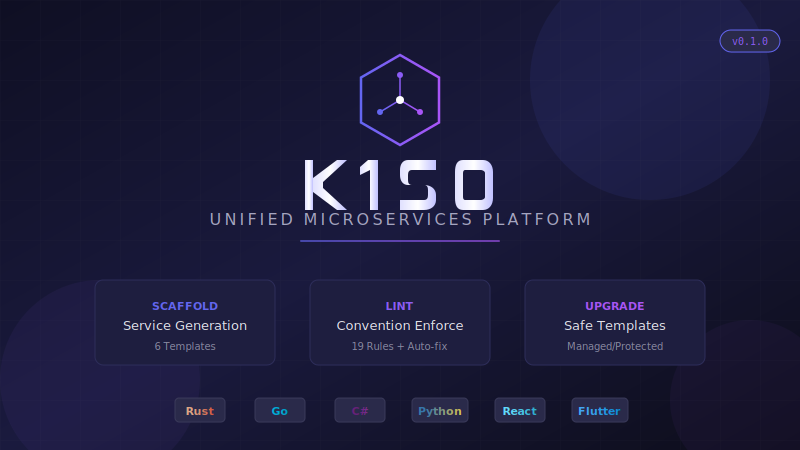
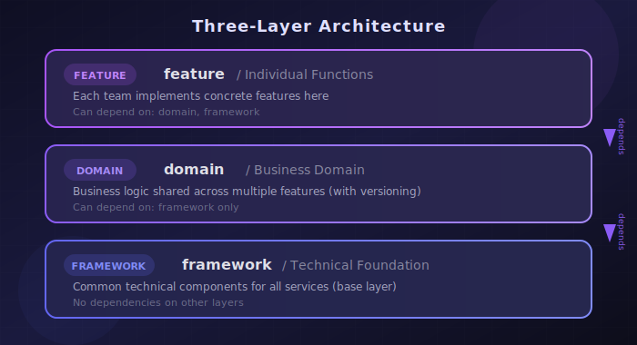

# k1s0

<p align="center">
  
</p>

高速な開発サイクルを実現する統合開発基盤。Framework / Templates / CLI を含むモノレポ。

## 概要

k1s0 は以下の 3 つのコア機能を提供します：

- **サービス雛形の自動生成**: テンプレートから一貫したディレクトリ構造を生成
- **開発規約の自動チェック**: 26 個のルールで規約違反を検出・自動修正
- **テンプレート更新の安全な管理**: managed/protected 領域の分離で破壊的変更を回避

### 3層アーキテクチャ

k1s0 は **framework → domain → feature** の3層構造を採用しています：

<p align="center">
  
</p>

詳細は [3層アーキテクチャ ADR](docs/adr/ADR-0006-three-layer-architecture.md) を参照してください。

## ディレクトリ構成

```
k1s0/
├── CLI/                    # 雛形生成・導入・アップグレード CLI（Rust）
│   ├── crates/             # CLI を構成する Rust crate 群
│   │   ├── k1s0-cli/       # 実行 CLI（clap ベース）
│   │   ├── k1s0-generator/ # テンプレ展開・差分適用・Lint エンジン
│   │   └── k1s0-lsp/       # LSP サーバ（補完・ホバー）
│   └── templates/          # 生成テンプレ群
│       ├── backend-rust/
│       ├── backend-go/
│       ├── backend-csharp/
│       ├── backend-python/
│       ├── backend-kotlin/
│       ├── frontend-react/
│       ├── frontend-flutter/
│       ├── frontend-android/
│       └── playground/        # playground テンプレ群
├── framework/              # 技術基盤層（共通部品・共通サービス）
│   ├── backend/
│   │   ├── rust/
│   │   │   ├── crates/     # 共通 crate 群
│   │   │   └── services/   # 共通マイクロサービス
│   │   ├── go/
│   │   ├── csharp/          # C# NuGet パッケージ
│   │   ├── python/          # Python パッケージ（uv）
│   │   └── kotlin/          # Kotlin パッケージ（Gradle）
│   ├── frontend/
│   │   ├── react/
│   │   ├── flutter/
│   │   └── android/         # Android パッケージ
│   └── database/
│       └── table/          # 共通テーブル定義（DDL 正本）
├── domain/                 # 業務領域共通層（複数 feature で共有）
│   ├── backend/
│   │   ├── rust/           # Rust domain ライブラリ
│   │   ├── go/             # Go domain モジュール
│   │   ├── csharp/         # C# domain プロジェクト
│   │   ├── python/         # Python domain パッケージ
│   │   └── kotlin/         # Kotlin domain モジュール
│   └── frontend/
│       ├── react/          # React domain パッケージ
│       ├── flutter/        # Flutter domain パッケージ
│       └── android/        # Android domain モジュール
├── feature/                # 個別機能層（各チームのサービス実装）
│   ├── backend/
│   │   ├── rust/
│   │   ├── go/
│   │   ├── csharp/
│   │   ├── python/
│   │   └── kotlin/
│   ├── frontend/
│   │   ├── react/
│   │   ├── flutter/
│   │   └── android/
│   └── database/
├── observability/          # 可観測性基盤（OTEL Collector + Jaeger + Loki + Prometheus + Grafana）
├── bff/                    # フロントエンド向け集約 API 層（任意）
├── docs/                   # ドキュメント
│   ├── adr/                # Architecture Decision Records
│   ├── architecture/       # アーキテクチャ設計
│   ├── design/             # 設計書
│   ├── conventions/        # 規約
│   ├── guides/             # 開発ガイド
│   └── operations/         # 運用
└── work/                   # 検討中の草案
```

## クイックスタート

```bash
# リポジトリ初期化
k1s0 init

# 新規 domain の作成（業務領域共通ライブラリ）
k1s0 new-domain --type backend-rust --name manufacturing

# 新規バックエンドサービスの生成（domain に紐付け可能）
k1s0 new-feature --type backend-rust --name work-order --domain manufacturing

# 新規フロントエンド画面の生成
k1s0 new-screen --type frontend-react --name dashboard

# domain 一覧の確認
k1s0 domain-list

# 規約チェック
k1s0 lint

# 規約違反の自動修正
k1s0 lint --fix

# テンプレート更新の確認
k1s0 upgrade --check

# テンプレート更新の適用
k1s0 upgrade
```

### 対話モード

引数なしで `k1s0` を実行すると、サブコマンドを対話形式で選択できます：

```bash
# 対話形式でコマンドを選択
k1s0
# → 実行したいコマンドを選択するプロンプトが表示される

# 対話形式で feature を作成
k1s0 new-feature

# 強制的に対話モードを起動
k1s0 new-feature -i

# 一部引数を指定して残りを対話で入力
k1s0 new-feature --type backend-rust
```

詳細は [Getting Started](docs/GETTING_STARTED.md) を参照してください。

## CLI コマンド

| コマンド | 説明 |
|---------|------|
| `k1s0 init` | リポジトリ初期化（`.k1s0/` ディレクトリ作成） |
| `k1s0 new-feature` | 新規サービス雛形生成（`--domain` で domain 紐付け可能） |
| `k1s0 new-domain` | 新規 domain 雛形生成 |
| `k1s0 new-screen` | 画面（フロントエンド）雛形生成 |
| `k1s0 lint` | 規約違反検査 |
| `k1s0 upgrade` | テンプレート更新 |
| `k1s0 completions` | シェル補完スクリプト生成 |
| `k1s0 domain-list` | 全 domain の一覧表示 |
| `k1s0 domain-version` | domain バージョンの表示・更新 |
| `k1s0 domain-dependents` | domain に依存する feature の一覧表示 |
| `k1s0 domain-impact` | domain バージョンアップの影響分析 |
| `k1s0 domain-catalog` | domain カタログ（依存状況付き）の表示 |
| `k1s0 domain-graph` | domain 依存グラフ出力（Mermaid/DOT） |
| `k1s0 doctor` | 開発環境の健全性チェック |
| `k1s0 docker build` | Docker イメージをビルド |
| `k1s0 docker compose up` | docker compose サービスを起動 |
| `k1s0 docker compose down` | docker compose サービスを停止 |
| `k1s0 docker compose logs` | docker compose ログを表示 |
| `k1s0 docker status` | コンテナ状態を表示 |
| `k1s0 playground start` | サンプル付き playground 環境を起動 |
| `k1s0 playground stop` | playground 環境を停止 |
| `k1s0 playground status` | playground 環境の状態を表示 |
| `k1s0 playground list` | 利用可能なテンプレートを一覧表示 |
| `k1s0 migrate analyze` | 既存プロジェクトの k1s0 準拠状況を分析 |
| `k1s0 migrate plan` | 移行計画を生成 |
| `k1s0 migrate apply` | 移行計画を適用 |
| `k1s0 migrate status` | 移行の進捗状況を表示 |
| `k1s0 feature-update-domain` | feature の domain 依存を更新 |
| `k1s0 registry` | テンプレートレジストリ操作 |
| `k1s0 log` | Git コミット履歴を表示 |
| `k1s0 diff` | Git diff を表示 |

### 共通オプション

```bash
-v, --verbose      # 詳細出力
-i, --interactive  # 対話モードを強制起動
-y, --yes          # 確認プロンプトをスキップ
--skip-doctor      # 環境診断をスキップ
--no-color         # カラー出力無効化
--json             # JSON 形式出力
```

## Lint 機能

26 個のルールで開発規約を自動検査します。

### マニフェスト・構造ルール（K001-K011）

| ID | 重要度 | 説明 | 自動修正 |
|----|--------|------|:--------:|
| K001 | Error | manifest.json が存在しない | - |
| K002 | Error | manifest.json の必須キーが不足 | - |
| K003 | Error | manifest.json の値が不正 | - |
| K010 | Error | 必須ディレクトリが存在しない | ✓ |
| K011 | Error | 必須ファイルが存在しない | ✓ |

### コード品質ルール（K020-K029）

| ID | 重要度 | 説明 | 自動修正 |
|----|--------|------|:--------:|
| K020 | Error | 環境変数参照の禁止 | - |
| K021 | Error | config YAML への機密直書き禁止 | - |
| K022 | Error | Clean Architecture 依存方向違反 | - |
| K025 | Error | 設定ファイル命名規約違反（default/dev/stg/prod のみ） | - |
| K026 | Error | Domain 層でのプロトコル型使用（HTTP/gRPC 依存） | - |
| K028 | Warning | manifest.json の未使用 domain 依存宣言 | - |
| K029 | Error | 本番コードでの panic/unwrap/expect（テスト・エントリーポイント除外） | - |

### セキュリティルール（K050-K053）

| ID | 重要度 | 説明 | 自動修正 |
|----|--------|------|:--------:|
| K050 | Error | 文字列補間による SQL インジェクションリスク | - |
| K053 | Warning | 機密データのログ出力（password, token, secret 等） | - |

### インフラルール（K060）

| ID | 重要度 | 説明 | 自動修正 |
|----|--------|------|:--------:|
| K060 | Warning | Dockerfile のベースイメージ未固定（:latest またはタグなし） | - |

### gRPC リトライルール（K030-K032）

| ID | 重要度 | 説明 | 自動修正 |
|----|--------|------|:--------:|
| K030 | Warning | gRPC リトライ設定の検出 | - |
| K031 | Warning | リトライ設定に ADR 参照なし | - |
| K032 | Warning | リトライ設定が不完全 | - |

### 層間依存ルール（K040-K047）

| ID | 重要度 | 説明 | 自動修正 |
|----|--------|------|:--------:|
| K040 | Error | 層間依存違反（例: framework が domain に依存） | - |
| K041 | Error | 参照された domain が見つからない | - |
| K042 | Error | domain バージョン制約を満たしていない | - |
| K043 | Error | domain 間の循環依存を検出 | - |
| K044 | Warning | 非推奨 domain への依存 | - |
| K045 | Warning | min_framework_version を満たしていない | - |
| K046 | Warning | 破壊的変更の影響を検出 | - |
| K047 | Error | domain 層に version フィールドがない | - |

```bash
# 特定ルールのみ実行
k1s0 lint --rules K001,K002

# 特定ルールを除外
k1s0 lint --exclude-rules K030,K031

# 警告もエラーとして扱う
k1s0 lint --strict
```

詳細は [Lint 設計書](docs/design/lint/) を参照してください。

## テンプレート

8 種類のサービステンプレートと playground テンプレートを提供します。サービステンプレートは feature 層と domain 層の両方に対応しています。

| テンプレート | サブテンプレート | 出力先 |
|-------------|-----------------|--------|
| backend-rust | feature, domain | `feature/backend/rust/{name}/`, `domain/backend/rust/{name}/` |
| backend-go | feature, domain | `feature/backend/go/{name}/`, `domain/backend/go/{name}/` |
| backend-csharp | feature, domain | `feature/backend/csharp/{name}/`, `domain/backend/csharp/{name}/` |
| backend-python | feature, domain | `feature/backend/python/{name}/`, `domain/backend/python/{name}/` |
| backend-kotlin | feature, domain | `feature/backend/kotlin/{name}/`, `domain/backend/kotlin/{name}/` |
| frontend-react | feature, domain, screen | `feature/frontend/react/{name}/`, `domain/frontend/react/{name}/` |
| frontend-flutter | feature, domain, screen | `feature/frontend/flutter/{name}/`, `domain/frontend/flutter/{name}/` |
| frontend-android | feature, domain, screen | `feature/frontend/android/{name}/`, `domain/frontend/android/{name}/` |

詳細は [テンプレート設計書](docs/design/template/) を参照してください。

## ドキュメント

### 入門

- [Getting Started](docs/GETTING_STARTED.md): 環境セットアップと基本操作

### 設計書

- [CLI 設計書](docs/design/cli/): k1s0-cli の設計
- [Generator 設計書](docs/design/generator.md): k1s0-generator の設計
- [Lint 設計書](docs/design/lint/): Lint 機能の詳細設計
- [テンプレート設計書](docs/design/template/): テンプレートシステム設計
- [Framework 設計書](docs/design/framework.md): 共通ライブラリ設計
- [Domain 設計書](docs/design/domain.md): 業務領域共通層の設計

### ガイド

- [Domain 開発ガイド](docs/guides/domain-development.md): domain 層の開発方法
- [Domain バージョン管理ガイド](docs/guides/domain-versioning.md): バージョン管理と互換性
- [3層構造移行ガイド](docs/guides/migration-to-three-tier.md): 2層から3層への移行

### 規約・方針

- [ADR](docs/adr/README.md): Architecture Decision Records
- [規約](docs/conventions/README.md): 開発規約
- [Domain 境界ガイドライン](docs/conventions/domain-boundaries.md): domain 層の境界判断基準
- [非推奨化ポリシー](docs/conventions/deprecation-policy.md): domain の非推奨化プロセス

## Framework パッケージ

### Backend（Rust）

12 個の共通 crate を提供します。

| Crate | 説明 | Tier |
|-------|------|------|
| k1s0-error | エラー表現の統一 | 1 |
| k1s0-config | 設定読み込み | 1 |
| k1s0-validation | 入力バリデーション | 1 |
| k1s0-observability | ログ/トレース/メトリクス | 2 |
| k1s0-grpc-server | gRPC サーバ共通基盤 | 2 |
| k1s0-grpc-client | gRPC クライアント共通 | 2 |
| k1s0-resilience | レジリエンスパターン | 2 |
| k1s0-health | ヘルスチェック | 2 |
| k1s0-db | DB 接続・トランザクション | 2 |
| k1s0-cache | Redis キャッシュ | 2 |
| k1s0-domain-event | ドメインイベント発行/購読/Outbox | 2 |
| k1s0-auth | 認証・認可 | 3 |

### Backend（Go）

12 個の共通モジュールを提供します。

| Module | 説明 | Tier |
|--------|------|------|
| k1s0-error | エラー表現の統一 | 1 |
| k1s0-config | 設定読み込み | 1 |
| k1s0-validation | 入力バリデーション | 1 |
| k1s0-observability | ログ/トレース/メトリクス | 2 |
| k1s0-grpc-server | gRPC サーバ共通基盤 | 2 |
| k1s0-grpc-client | gRPC クライアント共通 | 2 |
| k1s0-resilience | レジリエンスパターン | 2 |
| k1s0-health | ヘルスチェック | 2 |
| k1s0-db | DB 接続・トランザクション | 2 |
| k1s0-cache | Redis キャッシュ | 2 |
| k1s0-domain-event | ドメインイベント発行/購読/Outbox | 2 |
| k1s0-auth | 認証・認可 | 3 |

### Backend（C#）

12 個の NuGet パッケージを提供します。

| Package | 説明 | Tier |
|---------|------|------|
| K1s0.Error | エラー表現の統一 | 1 |
| K1s0.Config | 設定読み込み | 1 |
| K1s0.Validation | 入力バリデーション | 1 |
| K1s0.Observability | ログ/トレース/メトリクス | 2 |
| K1s0.Grpc.Server | gRPC サーバ共通基盤 | 2 |
| K1s0.Grpc.Client | gRPC クライアント共通 | 2 |
| K1s0.Health | ヘルスチェック | 2 |
| K1s0.Db | DB 接続・トランザクション（EF Core） | 2 |
| K1s0.DomainEvent | ドメインイベント発行/購読/Outbox | 2 |
| K1s0.Resilience | レジリエンスパターン | 2 |
| K1s0.Cache | Redis キャッシュ（StackExchange.Redis） | 2 |
| K1s0.Auth | 認証・認可 | 3 |

### Backend（Python）

12 個の共通パッケージを提供します。

| Package | 説明 | Tier |
|---------|------|------|
| k1s0-error | エラー表現の統一 | 1 |
| k1s0-config | 設定読み込み（YAML） | 1 |
| k1s0-validation | 入力バリデーション（Pydantic） | 1 |
| k1s0-observability | ログ/トレース/メトリクス（OpenTelemetry） | 2 |
| k1s0-grpc-server | gRPC サーバ共通基盤（grpcio） | 2 |
| k1s0-grpc-client | gRPC クライアント共通 | 2 |
| k1s0-health | ヘルスチェック（FastAPI） | 2 |
| k1s0-db | DB 接続・トランザクション（SQLAlchemy + asyncpg） | 2 |
| k1s0-domain-event | ドメインイベント発行/購読/Outbox | 2 |
| k1s0-resilience | レジリエンスパターン | 2 |
| k1s0-cache | Redis キャッシュ | 2 |
| k1s0-auth | 認証・認可 | 3 |

### Backend（Kotlin）

12 個の共通パッケージを提供します。

| Package | 説明 | Tier |
|---------|------|------|
| k1s0-error | エラー表現の統一 | 1 |
| k1s0-config | 設定読み込み（YAML） | 1 |
| k1s0-validation | 入力バリデーション | 1 |
| k1s0-observability | ログ/トレース/メトリクス（OpenTelemetry） | 2 |
| k1s0-grpc-server | gRPC サーバ共通基盤（grpc-kotlin） | 2 |
| k1s0-grpc-client | gRPC クライアント共通 | 2 |
| k1s0-health | ヘルスチェック（Ktor） | 2 |
| k1s0-db | DB（Exposed + HikariCP） | 2 |
| k1s0-domain-event | ドメインイベント発行/購読/Outbox | 2 |
| k1s0-resilience | レジリエンスパターン | 2 |
| k1s0-cache | Redis キャッシュ（Lettuce） | 2 |
| k1s0-auth | 認証・認可（nimbus-jose-jwt） | 3 |

### Frontend（React）

10 個の共通パッケージを提供します。

| Package | 説明 |
|---------|------|
| @k1s0/navigation | 設定駆動ナビゲーション |
| @k1s0/config | YAML 設定管理 |
| @k1s0/api-client | API 通信クライアント |
| @k1s0/ui | Design System（Material-UI）、DataTable、Form Generator |
| @k1s0/shell | AppShell（Header/Sidebar/Footer） |
| @k1s0/auth-client | クライアントサイド認証 |
| @k1s0/observability | フロントエンドログ/分析 |
| @k1s0/realtime | WebSocket/SSE クライアント（再接続・ハートビート・オフラインキュー） |
| eslint-config-k1s0 | ESLint ルール |
| tsconfig-k1s0 | 共有 TypeScript 設定 |

### Frontend（Flutter）

8 個の共通パッケージを提供します。

| Package | 説明 |
|---------|------|
| k1s0_navigation | 設定駆動ルーティング（go_router） |
| k1s0_config | YAML 設定管理 |
| k1s0_http | HTTP クライアント（Dio） |
| k1s0_ui | Design System（Material 3）、DataTable、Form Generator |
| k1s0_auth | 認証クライアント（JWT/OIDC） |
| k1s0_observability | 構造化ログ・トレーシング |
| k1s0_state | Riverpod 状態管理ユーティリティ |
| k1s0_realtime | WebSocket/SSE クライアント（再接続・ハートビート・オフラインキュー） |

### Frontend（Android）

8 個の共通パッケージを提供します。

| Package | 説明 |
|---------|------|
| k1s0-navigation | Navigation Compose ルーティング |
| k1s0-config | YAML 設定管理 |
| k1s0-http | Ktor Client HTTP |
| k1s0-ui | Material 3 デザインシステム |
| k1s0-auth | JWT 認証クライアント |
| k1s0-observability | ログ・トレーシング |
| k1s0-state | ViewModel + StateFlow ユーティリティ |
| k1s0-realtime | WebSocket/SSE クライアント |

詳細は [Framework 設計書](docs/design/framework.md) を参照してください。

## 技術スタック

| レイヤー | 技術 |
|---------|------|
| **バックエンド** | Rust (axum + tokio), Go, C# (ASP.NET Core 8.0), Python (FastAPI), Kotlin (Ktor 3.x) |
| **フロントエンド** | React (Material-UI, Zod, TypeScript 5.5), Flutter, Android (Jetpack Compose, Material 3) |
| **CLI** | Rust 1.85+ (clap 4.5, Tera 1.19, tokio) |
| **データベース** | PostgreSQL |
| **キャッシュ** | Redis |
| **観測性** | OpenTelemetry |
| **API** | gRPC (内部), REST/OpenAPI (外部) |
| **契約管理** | buf (proto), Spectral (OpenAPI) |

## 守るべき重要ルール

- **環境変数は使わない**: 設定ファイル（`config/*.yaml`）経由で取得
- **機密情報は直書きしない**: `*_file` サフィックスで外部参照
- **Clean Architecture に従う**: 依存方向を厳密に守る
- **3層構造を守る**: framework → domain → feature の依存方向を厳守
- **リトライ設定は文書化**: ADR で設計決定を記録

## ライセンス

MIT
