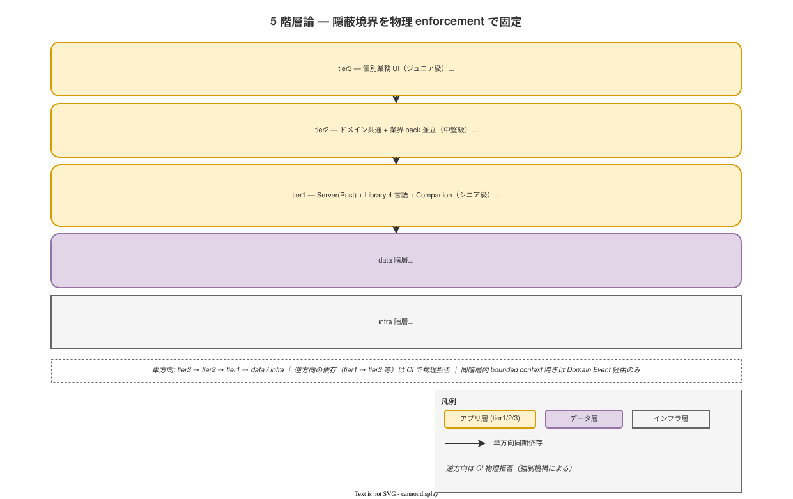

# k1s0

> ## **Keep It Simple, 0 Vendor Lock-in.**
> 業務不変条件を、文章運用ではなく物理機構で守りきる業務プラットフォーム。
> 5 階層論 × 19 軸同型構造 × 6 層 defense-in-depth × 5 proof_class を、製造業 1.0.0 完璧主義で ship する。

### このタグラインの意味

- **Keep It Simple** — 業務エンジニア（tier3 ジュニア級）から見た **API / メンタルモデルは終始シンプル**。業務語彙だけで開発でき、業務不変条件・整合性境界・セキュリティ制御を意識しない。複雑さはすべて tier1 / tier2 / infra / formal の「至高路線」に閉じ込め、外には漏らさない。
- **0 Vendor Lock-in** — クラウド非依存（任意 K8s クラスタで完結） + OSS 中立な L3 / L2\* 抽象 + **L1+ 単一深耕 OSS には必ず paired migration toolchain** を持つ。SaaS / proprietary wire / 商用 BaaS に lock-in する経路ゼロ。`v1_inhouse_authoritative` 区画は Apache 2.0 で公開、いつでも fork 可能。

---

## なぜこのプラットフォームが面白いか

エンジニアにとってのフックは「**書いてあるから守られる**」を一切信じないこと。
SLO / 監査 / 認可 / テナント分離 / OSS 移行 / 形式検証 — そのすべてを、人間の規律ではなく **CI / lint / Kyverno / HSM / 外部公証 + formal proof** の多重防御で *物理* に enforce する。

| 設計原則 | 何が物理 enforce されるか |
|---|---|
| **L1+ 単一深耕 + 移行コミットメント**（**0 Vendor Lock-in** の物理担保） | 単一 OSS の全機能を使い切る代わりに、必ず paired migration toolchain を持つ。`dry_run.lock.yaml` の `last_green_at` が 365 日以内で release_gate を通過 |
| **19 軸同型構造** | tier1 / tier2 / tier3 / infra / data / security / ops / client / test / formal + meta-axis + 13 cross-cutting。全軸が同じ形（class bundle / dimension override 禁止 / dead spec 殺し / build artifact 化 / 5 層 defense-in-depth） |
| **dimension override 禁止** | 軸の class bundle が他 dimension を一意に導出。個別 override 経路なし |
| **dead spec を CI で殺す** | 参照消失で CI fail。`lock.yaml` は build script の生成物で、手書き drift を物理拒否 |
| **defense-in-depth 6 層** | A: compile / B: lint / C: integration test / D: runtime / E: 物理 / F: 数学的。**任意の単層が破れても他層が必ず止める** |
| **5⁴ = 625 cell threat catalog** | 5 actor × 5 capability × 5 surface × 5 asset。各 cell に 5 mitigation_class が必ず bind、unreachable は `explicit_unreachable=true` |
| **95 cell formal proof** | 19 軸 × 5 proof_class。1.0.0 で `verified` or `accepted_with_assumption` が AND-gate |
| **業界 pack 並立 day-1** | 命名禁則 / 依存方向 / 第二業界 stub conformance の **3 種機械的担保** で業界横断層の汚染を物理拒否 |

> 哲学: **「至高を目指す判断」。** 運用コスト度外視、1.0.0 完璧主義、段階的 release 禁止、機能削減なし、production / development 区別なし。[CLAUDE.md](CLAUDE.md)。

---

## アーキテクチャ概観

### 5 階層 — 隠蔽境界を物理 enforcement で固定

逆方向の依存（tier1 → tier3 等）は CI で物理拒否。隠蔽境界の bypass は強制機構で物理拒否。同階層内 bounded context 跨ぎは **Domain Event 経由のみ**。編集ソース: [`img/architecture_five_tier_layers.drawio`](img/architecture_five_tier_layers.drawio)

---

## 19 軸 matrix

| 軸 | 種別 | 担当 | 主要適合仕様 |
|---|---|---|---|
| **tier1** | 階層 | シニア 5–8 名 | Bidi / 移行 Pair / 観測 / 認証 / 鍵管理 / スキーマ進化 / SLO / OSS lifecycle / テナント容量 |
| **tier2** | 階層 | 中堅 5–10 名 | テナント分離（4 テーブル class × session_context 4 GUC × transaction_unit） |
| **tier3** | 階層 | ジュニア | クライアント状態（4 layer × 5 conflict event × 4 BusinessConflict subtype） |
| **infra** | 階層 | シニア 3–5 名 | クラスタ位相 / 時刻整合 |
| **data** | 階層 | シニア 3–5 名 | データ保全 |
| **security** | 横断 | シニア | 脅威モデル（**5⁴ = 625 cell**）/ build_provenance（5 build_provenance_class） |
| **ops** | 横断 | シニア | 運用ループ |
| **client** | 横断 | シニア | クライアント SDK 配布（9 言語 lockstep） |
| **test** | 横断 | シニア | 検証規律（**18 axis × 5 verification_class = 90 cell**） |
| **formal** | meta-meta | シニア | 形式検証（**19 axis × 5 proof_class = 95 cell**） |
| **meta-axis** | 軸登録 | overview | `00_軸登録適合仕様` が軸の追加削除を物理 enforce（cap v1 = 20、現 19、残 1） |

### cross-cutting 適合仕様 13 件

| # | 名称 | 一文要約 |
|---|---|---|
| 01 | HTTP/2 enforcement | tier1 ingress HTTP/2 強制、per-tab 同時 subscription **上限 16**（v1_legacy_http11 のみ 6） |
| 02 | KEK Shamir 分散 | KEK を Shamir Secret Sharing で分散保管、**M-of-N 閾値 ceremony** で region 単独復元を物理拒否 |
| 03 | Apicurio GitOps SoT | Apicurio Registry GitOps 管理、git が単一の真、Registry は物理 cache |
| 04 | protoc-gen-go FSM | Go の sum type / sealed class 不在を **typestate via nominal types** で補完。自製 `protoc-gen-k1s0-go-fsm` |
| 05 | SLO protection layers | 共有 Pod / DB の SLO 保護 4 階層 + 自動昇格 trigger で multi-tenant 波及隔離 |
| 06 | BFF auth-edge | httpOnly cookie / Authorization header 自動付与 / silent renew を技術閉鎖 |
| 07 | Tauri Companion sidecar | 全 SPA に **Tauri sidecar exe MDM 必須配布** で WebUSB / Bluetooth / Serial 達成 |
| 08 | PII 専用クラスタ | PII 専用 PostgreSQL cluster、WAL chain 別分離で backup / restore 物理分離 |
| 09 | audit_ingest_gap_monitor | audit_event hash chain 改竄検知 + ingest gap heartbeat の二重防御 |
| 10 | ops-edge cluster | target cluster outage 時にも escalation 物理発火する独立 K8s クラスタ（SPOF 対策） |
| 11 | Companion OTel 拡張 | .NET Framework 4 stack（WCF / HttpWebRequest / WebClient / HttpClient）に OTel attribute 注入 |
| 12 | UA-aware adapter | Connect-RPC の UA 別 fetch full-duplex 実装差を SDK 内部で自動吸収 |
| 13 | .NET 8 Connect-RPC 自製 | `k1s0.Connect.NetCore`（Apache 2.0、Connect Conformance Suite 全 case green） |

---

## defense-in-depth 6 層

任意の単層が破れても他層が必ず止める。文章運用に依存しない（人間が忘れても止まる）。

| 層 | 名称 | 具体機構 |
|---|---|---|
| **A** | compile | protoc + Buf 単一 codegen / phantom type / sealed trait / branded type / **typestate via nominal types** / method annotation 必須化（buf lint）/ generated と git の差分検出 |
| **B** | lint | cargo-deny / Roslyn analyzer / depguard / ESLint / **公開 API snapshot drift** / L3 / L2\* シグネチャに OSS 型出現で fail / 依存方向検査（業界横断 → 業界 pack 禁止 / tier3 → tier1 直接 import 禁止） |
| **C** | integration / contract | **Pact** provider / consumer / **Testcontainers**（tier1 Server + Companion Mock + tier2 atomic 三表書込 + Outbox + Keycloak + OpenBao）/ **Playwright** E2E / **Litmus** chaos drill / cross-tenant test / conformance scenario corpus |
| **D** | runtime | **PostgreSQL Row Level Security FORCE** / pgaudit / WebCrypto / OS keychain / DPAPI / 24h Idempotency-Key TTL / retry budget sliding window / circuit breaker / Capability Negotiation / Envoy `jwt_authn` filter + Keycloak token introspection + DPoP / atomic 三表書込 |
| **E** | 物理 | **Cosign signed package のみ install 可能**（Harbor admission policy で unsigned reject）/ Kyverno 25+ policy / **HSM PKCS#11 destroy で KEK Shamir share zeroize** / **RFC 3161 trusted timestamp + Sigstore transparency log** / WebCrypto non-extractable CryptoKey / OS keychain user 認証 / Browser CSP `default 'self'` / Envoy 業務 listener が HTTP/2 + HTTP/3 のみ accept、ALPN h2 必須 |
| **F** | 数学的 | TLA+ + Apalache / Stainless / Dafny / Lean 4 + mathlib / Kani / CBMC で 5 proof_class × 19 軸 = **95 cell coverage** |

---

## 形式検証 — 5 proof_class × 95 cell

| proof_class | tool | 対象 | cell 数 |
|---|---|---|---|
| `v1_temporal_safety_proof` | TLA+ + Apalache | safety property（テナント越境ゼロ / atomic 三表書込 P1–P4 / KEK shamir M-of-N threshold / Bidi conformance class invariant） | 19 |
| `v1_temporal_liveness_proof` | TLA+ + Apalache | liveness property（pending queue resume completion / restore_drill RTO 内収束 / failover 完了 / Workflow 完了率） | 12 |
| `v1_refinement_proof` | TLA+ / Stainless | refinement relation（spec→impl 意味論等価性 / dual-write / migration pair 旧↔新 / Connect-RPC ↔ paired_post_sse 等価性） | 35 pair |
| `v1_program_correctness_proof` | Stainless / Dafny / **Lean 4 + mathlib** | Hoare logic / refinement type（KEK Shamir threshold algebra / HLC happens-before / Library API contract） | 19 |
| `v1_runtime_modelcheck_proof` | Kani（Rust） / CBMC（C/C++） | bounded model checking（Rust memory / concurrency / overflow / kernel module / eBPF / HSM driver / PTP daemon） | 14 |

**counter-example 物理 closure**: 4 close_kind（`fixed_in_code` / `fixed_in_spec` / `accepted_as_bug` / `scope_narrowed`）× severity 別 close_due_at（high 14d / medium 30d / low 90d）× `regression_corpus.lock.yaml` への双方向 lock。`accepted_as_bug` cap ≤ 10 件（cap 越えは破壊的変更扱い）。

**reviewer dual sign-off**: proof artifact は **dual cosign signature AND-gate + 外部公証 attestation** で物理 enforce。

---

## 4 primary pair — L1+ 移行コミットメント = **0 Vendor Lock-in** の物理担保

L1+ カテゴリで「単一 OSS の全機能を使い切る」代わりに、各々に **L2\* paired** を持ち、5 phase の dry-run を **365 日以内に必ず green** に保つ。SaaS / 商用 BaaS / vendor 独自 wire には絶対に依存しない。

| カテゴリ | primary | paired |
|---|---|---|
| Relational Store | **PostgreSQL（CloudNativePG）+ PgBouncer + pg_partman** | StackGres |
| Messaging / EventBus | **Apache Kafka（Strimzi）+ Debezium** | RedPanda |
| Workflow / Long-running Saga | **Temporal** | Cadence |
| Rule Engine | **ZEN Engine** | 自製 DSL backend（Rust、`v1_inhouse_authoritative`） |

5 phase: `schema_diff` → `state_replicate` → `dual_write_ramp` → `cutover` → `rollback`、各々 Testcontainers で物理検証。

**OSS lifecycle 8 signal**: license_change / eol_announced / cve_backlog / maintainer_turnover / fork_event / conformance_drift / major_up / spec_drift。いずれか発火で移行 trigger。

---

## 脅威モデル — 5⁴ = 625 cell threat catalog

5 actor × 5 capability × 5 surface × 5 asset の cross-product。各 cell に 5 mitigation_class のいずれか必ず bind、unreachable は `explicit_unreachable=true` marking。

**5 actor**:
1. `v1_external_unauth`（red_team_table_top / external_pen_test）
2. `v1_external_auth`（red_team_table_top）
3. `v1_insider_application`（red_team_live / chaos_failure_drill）
4. `v1_insider_operator`（red_team_live / secret_compromise_drill）
5. `v1_supply_chain`（supply_chain_drill / external_pen_test）

**管掌 artifact**: `classes.yaml`（5 enum 軸宣言）+ `threat_model.lock.yaml`（625 cell row + mitigation pointer）+ `mitigation_bindings.lock.yaml`（mitigation pointer ↔ 物理 artifact 双方向 lock）。すべて build artifact、CI fail 対象。

---

## クライアント — 4 layer state × HLC × atomic 三表書込

### Hybrid Logical Clock（自製 `k1s0_hlc_lib`, Apache 2.0）

- **言語別 wrapper**: Rust / Go / .NET / TypeScript
- **wire 上 deadline**: sender-issued HLC tuple（`tier1.clock.hlc_physical_ms` / `hlc_logical_counter` / `hlc_node_id`）+ receiver-side HLC compare、**wall-clock subtraction 禁止**
- **TTL / deadline 実装**: `CLOCK_MONOTONIC_RAW` 必須。Rust では `#[deny]` lint で `SystemTime::now()` を idempotency に使う path を reject

### atomic 三表書込（State change + Outbox + Audit）

| Property | 内容 |
|---|---|
| P1 | 状態変更時に Outbox + Audit が **同一 DB トランザクション** |
| P2 | Outbox 投入失敗時 rollback |
| P3 | PII 含有時 Apicurio Avro `field_pii` annotation で Outbox redact |
| P4 | **単一経路 emit**（必ず atomic 三表書込）。Domain Event subscribe 失敗で audit 欠落の事故を構造的に不可能化 |

property test で全 cell green 必須。

### BusinessConflict subtype 4 種

| subtype | 検出 | client recovery UX |
|---|---|---|
| **stale_write** | version / timestamp 比較 | field-level rebase + auto resend |
| **lost_update** | transaction isolation / optimistic lock | 3-way merge UI |
| **supersede** | aggregate state machine | silent toast |
| **concurrent_edit** | CRDT / operational transformation | presence indicator + user choice |

tier2 API 設計規約で 4 種すべて必須実装、client 側 4 layer state（Server Truth / Optimistic Local / Pending Queue / Draft）と連動。

---

## 業界 pack 並立 — 3 種機械的担保

「day-1 で並走しない、ライフサイクルイベント時に確実に移行できる」哲学を、3 種の機械検査で物理 enforce。

1. **命名禁則の機械検査**: 業界横断層に業界固有語（Manufacturing / Factory / Lot / Inspection 等）が出現したら **CI fail**
2. **依存方向の機械検査**: 業界横断層 → 業界 pack の依存ゼロを CI で物理 enforce
3. **第二業界 stub conformance**: サービス業を想定した最小 stub pack を CI 専用で保持、業界横断層 API が stub からも消費可能であることを **merge 条件**

**1.0.0 ship**: 製造業 pack のみ。
業務語彙（設備 / ロット / 品目 / 拠点 / BOM / 検査結果 / 不良票 / 生産指示 / 進捗実績 / 発注 / 検収 / 仕入先 / 図面 / SCADA / 計量装置）/ 業界規制（ISO 9001 / 医薬品 GMP / 食品 HACCP / 環境 ISO 14001）。

### 製造業 pack 9 stress test（1.0.0 ship blocker）

1. 設備リモート操作（`v1_interactive`, bidi 双方向）
2. ライン稼働監視 live tile（`v1_live_snapshot`, latest-wins）
3. 品質検査結果配信（`v1_event_feed`, 順序 + replay）
4. SCADA テレメトリ収集（`v1_bulk_upload`, at-least-once）
5. 図面 collaborative review（`v1_interactive`, 双方向 presence）
6. 在庫最新値表示（`v1_live_snapshot`）
7. 受注 sub（基幹 → 製造管理、`v1_event_feed`）
8. 警報配信（`v1_alert`, 低 lag + replay）
9. 計量装置連続データ（`v1_bulk_upload`, continuous push）

---

## SLO / 容量 — 6 SLO class × 5 quota_class

### 6 SLO class

| class | target | window |
|---|---|---|
| `v1_request_availability` | 99.9% | 30d |
| `v1_request_latency_p99` | p99 ≤ class.target | 30d |
| `v1_request_latency_p99_cross_region` | p99 ≤ **1500ms**（典型） | 30d |
| `v1_event_freshness` | p95 ≤ class.target | 7d |
| `v1_workflow_completion` | 99.5% | 30d |
| `v1_data_durability` | **11 nines** + freeze_on_any_loss | 365d |

### 5 quota_class の 4 階層 enforcement

| 階層 | 機構 |
|---|---|
| 1. ingress | **Envoy Gateway Local Rate Limit filter** |
| 2. Library | in-process token bucket |
| 3. OSS native quota | Temporal namespace quota / KEDA / pgvector workload pool |
| 4. storage / broker | Rook+Ceph namespace quota / CloudNativePG / ClickHouse / Kafka |

**noisy neighbor isolation chaos test**: 波及確率 **≤ 5%** + 自動昇格 **5 min 以内**。

### subscription 上限

- 業務 listener: per-tab **16 subscription**（HTTP/2 multiplex）
- v1_legacy_http11 listener: per-tab **6 subscription**（HTTP/1.1 物理上限）

---

## 技術スタック

### 言語

| 用途 | 言語 |
|---|---|
| tier1 Server | **Rust** stable |
| Operator / Controller | **Go 1.22** + controller-runtime / kubebuilder |
| tier1 Library / tier2 / tier3 | **Rust / C# (.NET 8+) / Go / TypeScript** の **4 言語等価強度**（compile-time 不正遷移防止） |
| Web SPA | TypeScript + React |
| デスクトップ | C# (.NET 8+) または Rust + **Tauri** |
| レガシー | **.NET Framework 4.6.2+** + WinForms / WPF + Companion |
| SDK 配布（9 言語 lockstep） | .NET 8 LTS / .NET Framework 4.6.2+ / Java 21 LTS / Node.js 20 LTS / Browser TS / Tauri / Rust / Python 3.12 / Ruby 3.3 / Go 1.22（**MAJOR.MINOR skew = 0**） |

### Schema / Codegen

protobuf + **Buf**（lint / breaking change check）/ **Apicurio Registry**（primary） / Karapace（L2* pair）/ **OpenTelemetry Weaver** / **sqlx-cli**

### データ / インフラ

PostgreSQL（**CloudNativePG**, RLS FORCE + pgaudit）+ PgBouncer + pg_partman + **pgvector** / **Kafka（Strimzi）+ Debezium** / **ClickHouse** / Valkey / Apicurio / **Rook+Ceph** + Longhorn / **Temporal** / ZEN Engine / **Kubernetes + Envoy Gateway + Istio + Argo CD + Tekton** / Kyverno **25+ admission policy**

### 形式検証

**TLA+ + Apalache** / **Stainless** / **Dafny** / **Lean 4 + mathlib**（KEK Shamir threshold algebra）/ **Kani** / **CBMC**

### セキュリティ / supply chain

**Cosign signed + SBOM（Syft）+ SLSA L3+ + Witness multi-attestation chain** / **in-toto attestation** / **WebCrypto non-extractable CryptoKey** / **HSM PKCS#11 zeroize** / **KEK Shamir M-of-N** / **RFC 3161 trusted timestamp + Sigstore transparency log** / **WORM Object Lock** / 8 secret class lifecycle / **SPIRE**

### 認証

**Keycloak** + **Envoy `jwt_authn` filter** + token introspection + **DPoP** / **WebAuthn step_up** / federated exchange / break-glass emergency step_up + 強制 audit emit / **OpenBao**

### 観測

5 signal class（logs / metrics / traces / **profiles** / **audit**）× 4 dimension layer / **OpenTelemetry**（SemConv は Weaver 管理）/ **Perses** dashboard / Prometheus + alertmanager / **Parca**（Continuous Profiling、v2 候補）

---

## 詳細設計 — 20 適合仕様 / 10 強制機構 / 8 運用 UI / 5 lock.yaml 体系

### 20 適合仕様（一文要約）

| # | 仕様 | 一文 |
|---|---|---|
| 01 | Bidi | 5 conformance_class × 5 dimension の cross-product を 9 scenario × N adapter で CI 全数検査 |
| 02 | 移行 Pair | L1+ 4 カテゴリ × 1 primary pair × 5 phase で Testcontainers 検証 |
| 03 | 観測 | 5 signal class × 4 dimension layer で cross-signal cross-tier 相関契約 |
| 04 | 認証 | 5 auth_class × 5 dimension で Envoy + Keycloak + DPoP / mTLS の 5 層 |
| 05 | 鍵管理 | 5 key_class × 5 dimension で KeyHandle 抽象 + HSM PKCS#11 + SPIRE + OpenBao + 外部公証 |
| 06 | スキーマ進化 | 6 schema_class × 5 dimension で proto / Avro / DDL / yaml / SemConv 4+1 軸 |
| 07 | SLO | 6 slo_class × 5 dimension で Prometheus + alertmanager + Perses + Litmus + error budget 物理 freeze |
| 08 | OSS ライフサイクル | 6 lifecycle_class × 4 dimension で 8 signal による移行 trigger 発火 |
| 09 | テナント容量 | 5 quota_class × 4 dimension で 4 階層 enforcement + noisy neighbor isolation chaos test |
| 10 | テナント分離 | 4 テーブル class × session_context 4 GUC × transaction_unit で Repository + sqlx-cli + RLS + pgaudit 5 層 |
| 11 | クライアント状態 | 4 layer × 5 conflict event × 4 BusinessConflict subtype の 5 層 enforce |
| 12 | クラスタ位相 | 5 topology_class × 5 failover orchestrator + Litmus + Kyverno failover_drill |
| 13 | 時刻整合 | 5 clock_integrity_class + Litmus + eBPF probe + Kyverno clock_drill |
| 14 | データ保全 | preservation_class 別 backup / restore / replication + 4 層保全 + restore_drill RTO |
| 15 | 脅威モデル | 5⁴ = 625 cell × 5 mitigation_class × 13 軸 defense-in-depth 層 D/E bind |
| 16 | build_provenance | 5 build_provenance_class × 5 phase × 5 enforcement orchestrator |
| 17 | 運用ループ | ops_loop / budget_action binding / alert_catalog / runbook_catalog / ownership_table |
| 18 | クライアント SDK 配布 | 4 言語 × capability matrix × conformance を lock.yaml で CI 全数検査 |
| 19 | 検証規律 | 18 axis × 5 verification_class = 90 cell coverage matrix |
| 20 | 形式検証 | 19 axis × 5 proof_class = 95 cell の verified or accepted_with_assumption |

### 10 強制機構（軸別、層数）

| 軸 | 層数 | 主機構 |
|---|---|---|
| tier1 | **6 層** | CI / lint / API snapshot / 内部 registry / Kyverno / Cosign |
| tier2 | **8 層** | + テナント識別子強制注入 + Domain Event emit 必須 + cross-tenant テスト + RLS + pgaudit |
| tier3 | **13 層** | OSS / tier1 / 業務管理 API 直接利用禁止 + PII 保管禁止 etc. |
| infra | 2 段 | PR 段 Conftest（OPA Rego、Required Status Check）+ deploy 段 Kyverno admission |
| data | 4 種 | Kyverno + DB engine 物理機構 + sqlx-cli prepare + Apicurio compatibility rule |
| security | 多層 | Kyverno + cross-axis bind + cosign signed AND-gate + audit chain cryptographic verification |
| ops | 6 種 | Kyverno + Argo Rollouts AnalysisTemplate + Argo CD sync wave + cosign signed + ops_event hash chain |
| client | 5 種 | CI / lint / contract test / property test / supply chain attestation |
| test | 7 種 | Kyverno + Tekton + Argo CD + Pact Broker + Litmus + cosign signed + test_event hash chain |
| formal | 7 種 | + cosign signed proof artifact AND-gate + Object Lock retention + proof_event hash chain + dual reviewer cosign |

### 8 運用 UI

| # | UI | 構成 |
|---|---|---|
| 01 | infra | Headlamp + Kubeshark + Backstage + Apache Superset、state 変更全て GitOps |
| 02 | data | infra Backstage 薄層 + Testcontainers + sqlx prepare + Apicurio CLI、GUI write 禁止 |
| 03 | security | Backstage + Perses（audit query / SLO / drill）+ threat_model coverage heatmap |
| 04 | ops | Backstage + Perses + 自製 escalation engine（Argo Workflows + Mattermost）+ ChatOps |
| 05 | client | Tilt + k1s0 Companion Mock + Backstage TechDocs + Perses（SDK metrics） |
| 06 | test | Backstage TechDocs + GitHub PR machine-readable check + test ownership UI + ChatOps slash command の 4 経路のみ |
| 07 | formal | Perses（proof matrix 19×5 cell color coding）+ ChatOps bot + IDE plugin（VS Code / IntelliJ）+ Tekton preview |
| 08 | DX 統合 | 全軸 Tilt + dev container + Testcontainers で inner loop 共有、pre-commit hook で local CI 同等化 |

### lock.yaml catalog

`capabilities.lock.yaml` / `dry_run.lock.yaml` / `idp_capabilities.lock.yaml` / `backends.lock.yaml` / `registries.lock.yaml` / `instruments.lock.yaml` / `oss_inventory.lock.yaml` / `enforcement_points.lock.yaml`（tier1） / `migration.lock.yaml`（tier2） / `conflict_tree.lock.yaml`（tier3） / `sdk_inventory.lock.yaml` / `capability_matrix.lock.yaml` / `sdk_conformance.lock.yaml`（client） / `proof_inventory.lock.yaml` / `proof_status.lock.yaml` / `counter_example.lock.yaml` / `proof_review.lock.yaml` / `proof_matrix.lock.yaml` / `assumption.lock.yaml` / `mathlib_pin.lock.yaml` / `tla_apalache_pin.lock.yaml` / `kani_cbmc_pin.lock.yaml`（formal） / `release_gate.lock.yaml`（meta-axis）

すべて build artifact、**手書き drift は build script で物理拒否**。

---

## docs/ ナビゲーション

機械可読な単一の真がすべて `docs/` に固定されている。各 markdown は frontmatter（`id` / `axis` / `phase` / `depends_on` / `covered_by`）を持ち、軸間整合は build script で検証される。

| Phase | ディレクトリ | 役割 |
|---|---|---|
| 0 | [docs/00_format/](docs/00_format/) | テンプレート / 規約 / frontmatter schema / lint 規約 |
| 1 | [docs/01_企画/](docs/01_企画/README.md) | 背景 / 価値 / 競合 / 法務 / ターゲット / OSS 公開 / 業界 pack 戦略 / 開発体制 / 用語集 |
| 2 | [docs/02_要件定義/](docs/02_要件定義/README.md) | スコープ / 機能要件 / 非機能要件 / 技術選定 / 開発体制 / 制約と前提 |
| 3 | [docs/03_概要設計/](docs/03_概要設計/README.md) | 5 視点アーキテクチャ概観 + 10 軸別設計方針 + クロスカッティング 8 機構 |
| 4 | [docs/04_詳細設計/](docs/04_詳細設計/README.md) | 20 適合仕様 + 10 強制機構 + 13 cross-cutting + 8 運用 UI + 5 lock.yaml 体系 |
| - | [docs/90_knowledge/](docs/90_knowledge/) | 技術学習用 reference |

### よく読まれる入口

- **設計思想を 1 ファイルで掴む**: [03_概要設計/01_アーキテクチャ概観/](docs/03_概要設計/01_アーキテクチャ概観/README.md)
  └─ [5 階層論](docs/03_概要設計/01_アーキテクチャ概観/01_5階層論.md) / [19 軸論](docs/03_概要設計/01_アーキテクチャ概観/02_19軸論.md) / [defense-in-depth](docs/03_概要設計/01_アーキテクチャ概観/03_defense_in_depth.md) / [5 proof_class 論](docs/03_概要設計/01_アーキテクチャ概観/04_5proof_class論.md) / [軸間依存図](docs/03_概要設計/01_アーキテクチャ概観/05_軸間依存図.md)
- **形式検証どうするか**: [20_形式検証適合仕様](docs/04_詳細設計/01_適合仕様/20_形式検証適合仕様.md) / [11_formal 設計方針](docs/03_概要設計/11_formal設計方針/README.md)
- **OSS をどう選ぶか / どう乗り換えるか**: [04_技術選定](docs/02_要件定義/04_技術選定/) / [08_OSS ライフサイクル適合仕様](docs/04_詳細設計/01_適合仕様/08_OSSライフサイクル適合仕様.md)
- **クライアント状態とコンフリクト**: [11_クライアント状態適合仕様](docs/04_詳細設計/01_適合仕様/11_クライアント状態適合仕様.md)
- **lock.yaml 体系**: [05_lock_yaml 体系](docs/04_詳細設計/05_lock_yaml体系/README.md)
- **数学的 enforcement**: [12_クロスカッティング設計/08_数学的 enforcement](docs/03_概要設計/12_クロスカッティング設計/08_数学的enforcement.md)
- **用語集**: [01_企画/09_用語集](docs/01_企画/09_用語集/README.md)

---

## 1.0.0 ship blocker

`release_gate.lock.yaml` は **AND-gate**。次のすべてが green でなければ tag が切れない。

- 全 19 軸の `release_gate.lock.yaml` cell が green
- 4 primary pair の `dry_run.lock.yaml` の `last_green_at` が **365 日以内**
- formal proof **95 cell** が `verified` or `accepted_with_assumption`（`accepted_as_bug` cap ≤ 10 件）
- 製造業 pack **9 stress test** 全 green
- `cosign signed tag` が **物理 prerequisite**

### 1.0.0 で ship するもの

- **クラウド非依存**: 任意の Kubernetes クラスタで完結（SaaS / マネージドサービス前提なし、**0 Vendor Lock-in**）
- 業界 pack: 製造業のみ（業界並立構造は day-1 から有効）
- アプリ形態: Web SPA / デスクトップ exe / レガシー .NET Framework 4.6.2+ の 3 形態
- **25h オフライン best-effort**（4 layer state + IndexedDB encrypted）+ Idempotency-Key TTL 超過時の user 確認 + 新 key resend
- 9 言語 SDK lockstep release（MAJOR.MINOR skew = 0）
- i18n day-1: 日本語 / 英語
- a11y: **WCAG 2.1 AA**（axe-core で merge 阻止）/ Web Vitals（Lighthouse CI で merge 阻止）

### v1.0.0 出荷後の拡張（v2 候補）

業界 pack 追加（金融業 / サービス業 / 医療業）/ iOS Swift / Android Kotlin（tier1 / tier2 言語追加が先行） / HTTP/3 + WebTransport の standard 追従 / Continuous Profiling client-side（Parca v2）/ post-quantum 暗号

### 採用しないもの

- 機能数 / 統合 OSS 数 / 価格 / 即座に release での競争
- 文章運用のみの保証（必ず class bundle + lock artifact + 物理 enforcement）
- LLM 単独 sign-off / 公開前 security review なしの公開
- 「dev mode で runtime check を緩める」経路（production / development 区別なし）
- 「機能削減での MVP ship」（1.0.0 は 19 軸全完成）

---

## OSS 公開

`v1_inhouse_authoritative` 区画を **Apache 2.0** で公開。配布は **Cosign signed + SBOM + SLSA L3+ + in-toto attestation**。コミュニティ contribution は **DCO + CLA + 4 reviewer dual sign-off**（LLM 単独 sign-off 禁止）。

| 公開 OSS | 役割 |
|---|---|
| `k1s0.Connect.NetCore` | .NET 8 LTS 向け Connect-RPC 自製実装（Connect Conformance Suite 全 case green） |
| `k1s0_apicurio_additive_controller` | Apicurio Operator が CR で表現できない rule 形を補完 |
| `k1s0_hlc_lib` | HLC（Hybrid Logical Clock）言語別 wrapper（Rust / Go / .NET / TypeScript） |
| `protoc-gen-k1s0-go-fsm` | Go の typestate via nominal types codegen plugin |
| `k1s0 Companion Mock` | SDK 開発者の local mock backend |
| `Tauri Companion sidecar` | WebUSB / Web Bluetooth / Web Serial の Firefox / Safari bridge |
| `k1s0.Companion.NetFx.OTelExt` | signalfx/splunk-otel-dotnet fork + k1s0 processor |
| 自製 DSL backend | ZEN Engine 互換 Rust 実装 |

配布: GitHub Release + Harbor mirror + 各言語 official registry（NuGet / npm / cargo / Maven Central / RubyGems）。

upstream 寄稿: Apicurio Operator / OpenTelemetry Weaver / protobuf-go FSM。

詳細: [01_企画/06_OSS 公開戦略](docs/01_企画/06_OSS公開戦略/README.md)

---

## 開発体制

| 役職 | 階層 | 人数 | スキル |
|---|---|---|---|
| infra エンジニア | infra | シニア 3–5 | Kubernetes / Argo CD / Istio / Envoy / OpenBao / Cosign / Litmus |
| data エンジニア | data | シニア 3–5 | PostgreSQL / CloudNativePG / Kafka / ClickHouse / Apicurio / Ceph |
| tier1 エンジニア | tier1 | シニア 5–8 | Rust / Go（Operator） / proto / Buf / OSS lifecycle |
| tier2 エンジニア | tier2 | 中堅 5–10 | 4 言語 + ドメイン業務（業界 pack ごと増減） |
| tier3 エンジニア | tier3 | ジュニア | TypeScript + React / C# WPF / .NET Framework |
| security エンジニア | 横断 | シニア | threat model / SPIFFE / audit / incident response |
| ops エンジニア | 横断 | シニア | SLO / alert / incident management / chaos engineering |
| test エンジニア | 横断 | シニア | coverage matrix / property test / Pact contract / Litmus |
| formal エンジニア | 横断 | シニア | TLA+ / Apalache / Stainless / Dafny / Lean 4 / Kani / CBMC |

**inner loop**: Tilt + dev container + Testcontainers で全軸共有、pre-commit hook で local CI 同等化。
**Backstage Software Template**: tier1 / tier2 / tier3 service scaffolding + 同族 OSS（Apicurio ↔ Karapace、flagd ↔ GFF 等）の capability descriptor 自動生成。

---

## プロジェクト状態

- 現在は **設計フェーズ**。`docs/` の全 frontmatter は `status: draft`。
- ソース実装（`src/`）は未着手。`tools/` に `docs_lint` / `lock_yaml_generator` の骨格のみ。
- 設計は **完成度 first**。「文章で書いた」を「物理で守る」に置き換える作業を、コードに先んじてやりきる方針。

---

## License

[Apache License 2.0](LICENSE)。

---

<strong>Keep It Simple, 0 Vendor Lock-in.</strong>

業務語彙だけで開発できる体験を、L1+ 単一深耕 + 移行コミットメント + 物理 enforcement で支える。

