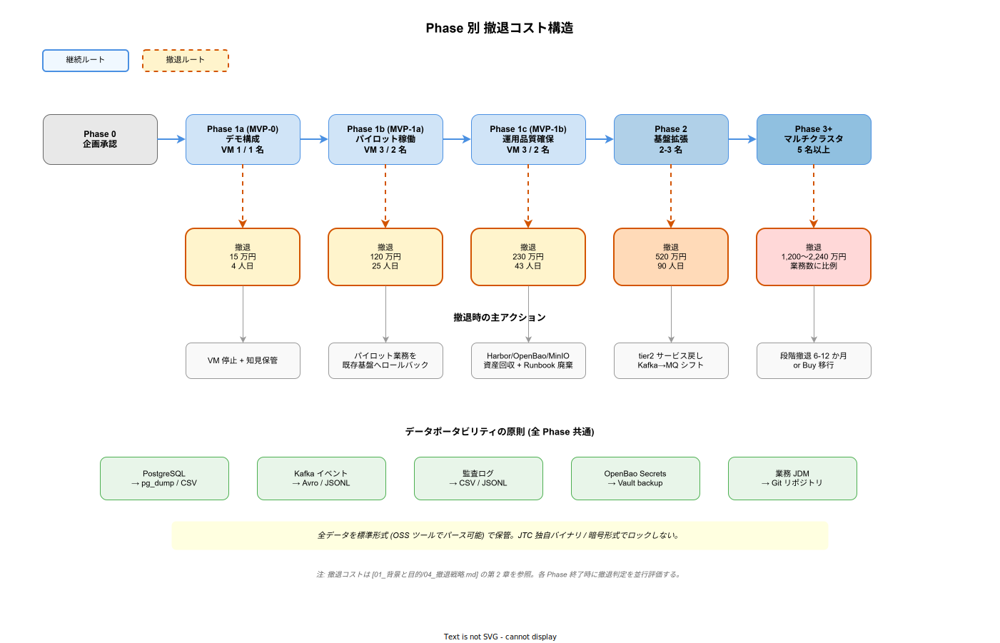

# 撤退戦略

## 目的

k1s0 プラットフォームが **頓挫** あるいは **役目を終えた** 場合に、どのように既存システムへロールバックし、運用を引き継ぎ、データを保護し、ライセンス・契約を整理するかを定める。「Build 選択 = 後戻りできない」という決裁者の直感的な懸念に対し、**どの時点で撤退しても損害を最小化できる構造**を示すことで、Build 選択のリスクを構造的に下げる。

本資料は [`03_新技術導入リスクへの回答.md`](./03_新技術導入リスクへの回答.md) が OSS 個別のリスクへの回答であるのに対し、**プラットフォーム全体が不要になった場合** の出口戦略を扱う。[`../../02_構想設計/03_技術選定/01_俯瞰/17_OSS長期戦略.md`](../../02_構想設計/03_技術選定/01_俯瞰/17_OSS長期戦略.md) が「個別 OSS を差し替える」戦略であるのに対し、本資料は「k1s0 プラットフォーム全体を畳む」戦略を扱う。

---

## 1. 撤退が必要となるシナリオ

k1s0 の撤退を迫る要因は以下に分類できる。要因によって必要な撤退手順が大きく異なる。

### 1.1 技術的頓挫シナリオ

| シナリオ | 具体例 | 発生可能性 |
|---|---|---|
| (a) Phase 1a で MVP-0 が動かない | kubeadm + Dapr の基本構成が JTC 環境で動作しない | 低 (公開事例豊富) |
| (b) Phase 1b で協力者を確保できない | JTC 組織内で 2 人目の担当者がアサインされない | 中 |
| (c) Phase 1c 以降で運用が破綻 | 障害対応が起案者単独に依存する状態から脱却できない | 中 |
| (d) Phase 2 以降で OSS が複数同時に有償化 / メンテ停止 | Redis 型のライセンス変更が基盤 OSS 複数で同時発生 | 極めて低 |

### 1.2 組織的判断シナリオ

| シナリオ | 具体例 | 発生可能性 |
|---|---|---|
| (e) 経営判断で内製方針が覆される | 経営層交代で「全面商用製品」方針へ転換 | 中 |
| (f) 会社統合・分社で組織構造が変わる | グループ再編で情シス部門が吸収 / 分離 | 低〜中 |
| (g) 予算削減で保守費が捻出できない | 業績悪化で運用 FTE の維持が不可能 | 中 |
| (h) 役目を終える (成功シナリオ) | 業務全てが k1s0 で安定稼働、さらなる投資対効果がない | 低 (Phase 5 以降) |

### 1.3 外部要因シナリオ

| シナリオ | 具体例 | 発生可能性 |
|---|---|---|
| (i) 規制変更により社内 SaaS 運営が不可能 | 個人情報保護法の強化で自社運用が過重に | 低 |
| (j) クラウド必須の法規制 | 業界監督機関がクラウド移行を強制 | 極めて低 |

---

## 2. Phase 別の撤退コスト

撤退シナリオの影響は、**撤退時点で k1s0 がどの Phase にあるか** に強く依存する。早期の撤退ほど損害が小さい構造を Phase 設計時点で織り込んでいる。

上図は、各 Phase の継続ルート (青) と、その時点で撤退を選択した場合の撤退ルート (橙破線) を並置したものである。横軸は Phase 0 (企画承認) から Phase 3 以降 (大規模稼働) まで段階的に累積する投資を、縦軸 (下段) は撤退時点のコストを表す。読者は「自分が承認したいフェーズで撤退した場合のコスト」を 1 枚で把握できる。

### 2.1 Phase 1a (MVP-0) 時点での撤退

**状態**: VM 1 台で動作するデモ構成。業務稼働なし。起案者単独。

| 作業項目 | 工数 | 費用 |
|---|---|---|
| VM 停止 / 回収 | 1 人日 | 0 円 (既存 VM 流用のため) |
| ドキュメント整理 (知見の保管) | 3 人日 | 約 15 万円 |
| 起案者の次業務へのアサイン | — | 0 円 |
| **合計** | **4 人日** | **15 万円** |

**本質**: Phase 1a 撤退は実質的に「企画段階で止める」のと同等。既存の開発 VM で試作する前提のため、追加ハードウェア調達もなく、回収すべき資産が発生していない。この低コスト性が **Phase 1a を必ず通す** フェーズ設計の根拠でもある。

### 2.2 Phase 1b (MVP-1a) 時点での撤退

**状態**: VM 3 台で kubeadm HA + パイロット業務 1 本稼働中。2 名体制。

| 作業項目 | 工数 | 費用 |
|---|---|---|
| パイロット業務の既存基盤 (Excel / .NET Framework 等) へのロールバック | 10 人日 | 約 58 万円 |
| パイロット業務の利用データのエクスポート (CSV 形式) | 3 人日 | 約 17 万円 |
| VM 3 台の再初期化 / 他業務への転用 | 2 人日 | 0 円 (内部転用) |
| k1s0 関連の認証情報 / Secret の削除 | 2 人日 | 0 円 |
| 利用者への告知 / 代替案内 | 3 人日 | 約 17 万円 |
| ドキュメント整理 | 5 人日 | 約 29 万円 |
| **合計** | **25 人日 ≈ 1.1 人月** | **約 121 万円** |

**本質**: Phase 1b 撤退時に残る課題は「パイロット業務 1 本を既存基盤に戻す」こと。パイロット業務の選定段階 ([`../03_ロードマップと体制/01_MVPスコープ.md`](../03_ロードマップと体制/01_MVPスコープ.md)) で **既存基盤への戻りやすさ** を選定基準に含めることで、撤退コストを事前に抑制する。

### 2.3 Phase 1c (MVP-1b) 時点での撤退

**状態**: 運用品質を確保した 3 ノード構成。パイロット業務 1〜2 本稼働。2 名体制。

| 作業項目 | 工数 | 費用 |
|---|---|---|
| 稼働中パイロット業務 1〜2 本の既存基盤へのロールバック | 20 人日 | 約 115 万円 |
| データエクスポート (PostgreSQL → CSV / JSON) | 5 人日 | 約 29 万円 |
| 監査ログの長期保管先への移管 | 3 人日 | 約 17 万円 |
| Harbor / OpenBao / MinIO の資産回収 | 5 人日 | 約 29 万円 |
| VM / ストレージの回収 | 3 人日 | 0 円 |
| ドキュメント整理 + Runbook の廃棄手順書化 | 7 人日 | 約 40 万円 |
| **合計** | **43 人日 ≈ 2 人月** | **約 230 万円** |

### 2.4 Phase 2 時点での撤退

**状態**: Istio / Kafka / Backstage / Temporal / tier1 Rust 稼働。tier2 サンプル数本。2〜3 名体制。稼働業務 2〜3 本。

| 作業項目 | 工数 | 費用 |
|---|---|---|
| 稼働中の tier2 サービス数本の既存基盤への戻し or Kafka → メッセージキューへのシフト | 45 人日 | 約 258 万円 |
| ZEN Engine / JDM の業務ルール抽出とドキュメント化 | 10 人日 | 約 58 万円 |
| OpenBao / Vault 管理中のシークレットの返却 | 5 人日 | 約 29 万円 |
| Feature Flag の切り戻し | 3 人日 | 約 17 万円 |
| Kafka イベント履歴のアーカイブ | 7 人日 | 約 40 万円 |
| 監査ログの長期保管への移管 | 5 人日 | 約 29 万円 |
| クラスタ廃棄 + k8s リソースの整理 | 5 人日 | 約 29 万円 |
| ドキュメント整理 | 10 人日 | 約 58 万円 |
| **合計** | **90 人日 ≈ 4 人月** | **約 518 万円** |

### 2.5 Phase 3 以降での撤退

**状態**: マルチクラスタ化 + ネイティブインストーラ配信 + ZEN Engine 本格運用。5 名以上体制。稼働業務 5〜15 本。

| 作業項目 | 工数 | 費用 |
|---|---|---|
| 稼働中業務 5〜15 本の既存基盤へのロールバック | 120〜300 人日 | 690〜1,725 万円 |
| マルチクラスタ間のデータ統合 + エクスポート | 20 人日 | 約 115 万円 |
| エンドユーザーの端末環境変更 (MSIX 配信停止) | 20 人日 | 約 115 万円 |
| 全業務のデータマイグレーション | 40 人日 | 約 230 万円 |
| クラスタ回収 + 契約整理 | 10 人日 | 約 58 万円 |
| **合計** | **210〜390 人日 ≈ 10〜18 人月** | **1,200〜2,240 万円** |

---

## 3. データポータビリティの設計原則

撤退コストの主成分は「データの取り出し」である。Build 段階から以下の原則を守ることで、撤退時のデータ救済コストを最小化する。

### 3.1 標準形式でのエクスポート可能性

k1s0 が保持するデータは以下の標準形式でエクスポート可能な状態を常に維持する。

| データ種別 | 保存先 | エクスポート形式 |
|---|---|---|
| 業務マスタデータ | PostgreSQL | CSV / JSON / `pg_dump` |
| Kafka イベント履歴 | Kafka + MinIO アーカイブ | Avro / JSON Lines (Apicurio Registry に準拠) |
| 監査ログ | PostgreSQL + Loki + MinIO | CSV / JSONL |
| Secret / 認証情報 | OpenBao | バックアップファイル形式 (Vault 互換) |
| 設定 / 業務ルール JDM | Git リポジトリ | JSON (JDM 標準形式) |
| ドキュメント | Git リポジトリ + Backstage TechDocs | Markdown + OpenAPI / AsyncAPI |

**原則**: JTC 独自のバイナリ形式・暗号形式で **データをロックしない**。全てのデータは OSS ツールでパースできる標準形式で保管する。

### 3.2 エクスポート自動化

Phase 1c 以降、以下のエクスポートを定期自動実行する。

| 種別 | 頻度 | 実行方法 |
|---|---|---|
| PostgreSQL フルダンプ | 日次 | CloudNativePG の Backup CR |
| Kafka トピックのアーカイブ | リアルタイム | Kafka Connect → MinIO |
| 監査ログのアーカイブ | 日次 | Loki → MinIO (エクスポートジョブ) |
| JDM ルールのスナップショット | Git コミット毎 | Argo Events の git-sync |

撤退時には「直前のエクスポートから再開」するだけで、データ取り出しに追加の実装工数が発生しない構造を作る。

### 3.3 公開 API 仕様の汎用性

tier1 公開 API (`k1s0.Log` / `k1s0.State` / `k1s0.PubSub` 等) は、Dapr の building block 仕様 + OpenFeature 仕様 + OpenTelemetry 仕様という **業界標準の延長線上** で設計されている ([`../../02_構想設計/03_技術選定/02_中核OSS/01_実行基盤中核OSS.md`](../../02_構想設計/03_技術選定/02_中核OSS/01_実行基盤中核OSS.md))。この設計の帰結として、k1s0 を使っていたコードを以下に移植する場合のコストが低い。

| 移植先 | 移植のしやすさ |
|---|---|
| Dapr + 各クラウドマネージドサービス | 高 (Dapr 仕様のまま) |
| Kubernetes + OSS 組み合わせ (k1s0 なし) | 高 (OpenFeature / OpenTelemetry 仕様のまま) |
| OpenShift / Tanzu (商用 IDP) | 中 (一部書き換え) |
| VM 直上 / Excel + RPA (撤退シナリオ) | 低〜中 (業務ロジックの単純化で再実装) |

---

## 4. 既存システムへのロールバックパス

撤退シナリオ別に、既存システムへの戻し方を具体的に設計する。

### 4.1 パイロット業務の戻し方 (Phase 1b / 1c 撤退)

パイロット業務の選定段階で「既存基盤への戻りやすさ」を選定基準に入れる。具体的には以下のタイプの業務を優先する。

- 既存基盤 (Excel / .NET Framework 業務アプリ) に **現役** の代替が存在する業務
- 業務データ量が 100 万件以下で CSV 1 ファイルに収まる業務
- 業務プロセスが 1 フェーズ (単純申請) で完結する業務

**戻しの手順**:

1. 業務責任者への告知 + 猶予期間 (2 週間) の確保
2. k1s0 側の業務データを CSV エクスポート
3. 既存基盤への CSV インポート or 手動登録
4. 利用者への新窓口 (既存基盤) の案内
5. k1s0 側のエンドポイントを Read-Only モードに切替 (書き込み不可、参照のみ可能)
6. 2 週間後に k1s0 側のエンドポイントを停止

### 4.2 tier2 サービスの戻し方 (Phase 2 撤退)

tier2 サービスは tier1 公開 API に依存するため、直接的な戻しは難しい。以下の段階を経る。

1. **適応レイヤの実装**: tier1 公開 API の呼び出しを、既存基盤の直接呼び出しに置き換えるアダプタを実装 (サービス 1 本あたり 10〜30 人日)
2. **Kafka → メッセージキューへの切替**: Kafka 経由のイベントを既存のメッセージキュー (例: IBM MQ) に付け替え (業務 1 本あたり 5〜15 人日)
3. **認証経路の切替**: Keycloak → AD 直接認証への切替 (全業務共通、5 人日)

Phase 2 時点で稼働業務が 2〜3 本なら 45 人日、5 本なら 75 人日を想定。

### 4.3 大規模稼働後の戻し方 (Phase 3 以降撤退)

Phase 3 以降では稼働業務数が 5〜15 本となり、全業務を同時にロールバックすることは現実的でない。以下の段階的撤退を推奨する。

1. **撤退宣言 + ロードマップ公開**: 6〜12 か月の撤退期間を設定、対象業務責任者への告知
2. **新規業務の k1s0 投入停止**: 新規は最初から既存基盤 / 商用製品で構築
3. **既存業務の段階的ロールバック**: 四半期ごとに 2〜3 業務ずつ既存基盤 / 商用製品に移行
4. **k1s0 クラスタの段階的縮退**: 業務が抜けたサービスを停止、ノード数を減らす
5. **最終停止**: 最後の業務が移行完了後にクラスタ全廃

この段階撤退の総工数は業務数 × 30〜50 人日 + 共通工数 100 人日。稼働業務 10 本の場合、400〜600 人日 (18〜30 人月)。

---

## 5. 商用製品への切り替えシナリオ

「Build 撤退 → Buy 移行」を選択する場合のシナリオ。

### 5.1 k1s0 から OpenShift への移行

移行しやすい部分とそうでない部分の峻別。

| 要素 | OpenShift で代替 | 内製必要 |
|---|---|---|
| k8s 基盤 | ○ OpenShift が提供 | — |
| Istio | ○ OpenShift Service Mesh | — |
| Argo CD | ○ OpenShift GitOps | — |
| Dapr + tier1 ファサード | × | 移行版 tier1 を OpenShift 上で継続運用 |
| ZEN Engine / 監査 / PII | × | 移行版 tier1 を OpenShift 上で継続運用 |
| アプリ配信ポータル | × | OpenShift 上で継続運用 |

OpenShift への移行は「k1s0 の infra 層を OpenShift に置き換える」形となる。tier1 自作領域はそのまま移設可能 ([`../02_競合と差別化/01_主要製品別評価.md`](../02_競合と差別化/01_主要製品別評価.md) 参照)。

### 5.2 移行コスト試算

| 作業 | 工数 |
|---|---|
| OpenShift クラスタ構築 | 30 人日 |
| k1s0 自作コードの OpenShift 互換確認 | 20 人日 |
| tier1 リプレイス / 再ビルド | 40 人日 |
| データ移行 | 30 人日 |
| 総合テスト | 20 人日 |
| **合計** | **140 人日 ≈ 6.5 人月 ≈ 750 万円** |

加えて OpenShift ライセンス費が発生 (中規模 5 年で 1.2 億円)。TCO 試算 ([`../04_定量試算/01_TCO5年試算.md`](../04_定量試算/01_TCO5年試算.md)) では k1s0 が 5 年 TCO で Build 優位となるため、**移行コストと OpenShift ライセンス費の両方を回収することは困難**な点を認識する必要がある。

---

## 6. 契約・ライセンスの整理

撤退時に整理すべき契約関連を列挙する。

### 6.1 ハードウェア契約

- オンプレ VM / サーバの償却処理 (5 年償却途中での処分は減価償却損計上)
- ラック利用料の契約終了 or 他用途への転用
- ネットワーク回線 (専用線) の契約変更

### 6.2 OSS ライセンス

全採用 OSS は OSI 承認ライセンスであり、撤退時にライセンス料の返金 / 追加支払いは発生しない。以下のみ整理する。

- 採用 OSS の利用終了通知 (法的義務なし、自主的な記録のみ)
- SBOM の最終スナップショット保管 (監査対応)
- Grafana / MinIO 等 AGPL OSS の利用終了記録

### 6.3 業務委託契約

- 開発 / 運用の業務委託契約の解除 (通常は 3 か月前告知)
- 委託業者へのコード返却 / 削除要請 ([`../../02_構想設計/05_法務とコンプライアンス/01_内製知財戦略.md`](../../02_構想設計/05_法務とコンプライアンス/01_内製知財戦略.md) セクション 3.2)
- 秘密保持義務の継続期間確認

### 6.4 商用製品契約 (Buy 移行時)

- Buy 移行先の商用製品との契約締結
- 移行期間中の並行稼働ライセンスの取り扱い

---

## 7. 知財の扱い

k1s0 が生成した知財 ([`../../02_構想設計/05_法務とコンプライアンス/01_内製知財戦略.md`](../../02_構想設計/05_法務とコンプライアンス/01_内製知財戦略.md)) は、撤退シナリオによって以下のように扱う。

| 撤退シナリオ | 知財の扱い |
|---|---|
| (a) 技術的頓挫 | 全知財を JTC 内の「プロジェクト終了資料」として保管、再挑戦時の参考資料 |
| (b) 組織判断で Buy 移行 | 基盤コードは停止、ドキュメント・設計資産は継続活用 |
| (c) 会社統合で吸収 | 統合先の判断に従う (通常は全知財を統合先に譲渡) |
| (d) 成功後の役目終了 (Phase 5+) | OSS 化の最終判断、または業界への公開プレゼンテーション |

いずれのシナリオでも、**業務ロジックの JDM / Runbook / 運用ノウハウ** は JTC の無形資産として継続保管する。これらは将来別の基盤で再活用可能。

---

## 8. 撤退判定の意思決定フレーム

撤退を検討すべき状況と、判定プロセス。

### 8.1 Phase 移行時の撤退判定

[`../03_ロードマップと体制/00_フェーズ計画.md`](../03_ロードマップと体制/00_フェーズ計画.md) 第 3 章のフェーズ移行判断基準に加え、以下を各 Phase 移行時の判定項目とする。

| 判定項目 | 閾値 (これ以下なら撤退検討) |
|---|---|
| バス係数 | Phase 1b 完了時点で 2 未満 |
| 稼働業務の利用者満足度 | エンドユーザー調査で 40% 以下 |
| 障害対応時間の改善 | Phase 1c 完了後 3 か月以内に起案者不在で障害対応不可 |
| 運用 FTE の維持可能性 | Phase 2 計画時に 2 名以下しか確保できない |
| 決裁者承認の継続 | Phase 遷移時の稟議で否決 |

1 つでも該当する場合は撤退オプションを並行検討する。

### 8.2 撤退判定プロセス

1. **状況分析**: tier1 チームが判定項目を評価、技術的撤退可否を判断
2. **経営層への相談**: 判定項目に該当する場合は経営層に状況を報告
3. **撤退シナリオ策定**: 本資料の Phase 別撤退コストを参照して工数・費用を試算
4. **代替案比較**: 撤退 vs 継続 vs Buy 移行の 3 案を並行評価
5. **決裁**: 経営層・決裁者による最終判断
6. **撤退実行**: 本資料 第 4 章のロールバックパスを実行

---

## 9. 決裁者向け答弁

決裁者が「Build 選択は後戻りできないのか」と問うた際の回答構成。

> **早期撤退なら損害は限定的です**。Phase 1a 撤退なら 15 万円、Phase 1b 撤退なら 120 万円、Phase 1c 撤退なら 230 万円で、いずれも単独案件の 1 週間〜数週間分の工数に相当します。Phase 2 以降の撤退でも稼働業務数に比例して増加する構造で、**業務数が少ない早期段階ほど撤退コストが低い**設計になっています。加えて、k1s0 が保存するデータは PostgreSQL / CSV / Avro / JSON など標準形式で常にエクスポート可能な状態を維持しており、撤退時にデータが取り出せない懸念はありません。Buy 移行を選ぶ場合でも tier1 自作領域はそのまま OpenShift 等に移設できます。つまり「試してみて、うまくいかなければ早い段階で止める」判断が十分に可能な設計になっています。

---

## 10. 本資料の更新計画

撤退戦略は Phase の進行に応じて実効性を検証する。以下のタイミングで本資料を更新する。

| タイミング | 更新内容 |
|---|---|
| Phase 1b 完了時 | パイロット業務の戻しコスト実測値の反映 |
| Phase 1c 完了時 | データエクスポート自動化の実績反映 |
| Phase 2 完了時 | 稼働業務数ベースの撤退コストの実測値反映 |
| 半期ごと | 契約・ライセンス状況の更新 |

---

## 関連ドキュメント

- [`03_新技術導入リスクへの回答.md`](./03_新技術導入リスクへの回答.md) — OSS 個別リスクへの回答
- [`../../02_構想設計/03_技術選定/01_俯瞰/17_OSS長期戦略.md`](../../02_構想設計/03_技術選定/01_俯瞰/17_OSS長期戦略.md) — OSS 個別の出口戦略
- [`../03_ロードマップと体制/00_フェーズ計画.md`](../03_ロードマップと体制/00_フェーズ計画.md) — Phase 定義と移行判断基準
- [`../03_ロードマップと体制/01_MVPスコープ.md`](../03_ロードマップと体制/01_MVPスコープ.md) — パイロット業務選定基準
- [`../04_定量試算/01_TCO5年試算.md`](../04_定量試算/01_TCO5年試算.md) — Buy 移行時のコスト比較
- [`../02_競合と差別化/01_主要製品別評価.md`](../02_競合と差別化/01_主要製品別評価.md) — 商用製品の評価
- [`../../02_構想設計/05_法務とコンプライアンス/01_内製知財戦略.md`](../../02_構想設計/05_法務とコンプライアンス/01_内製知財戦略.md) — 撤退時の知財処理
