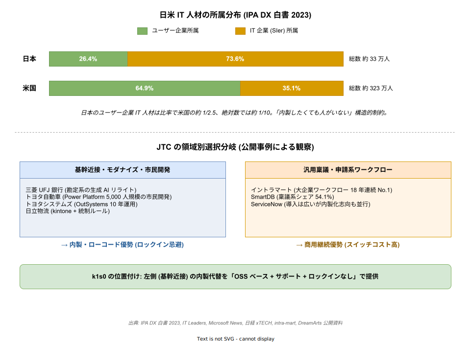
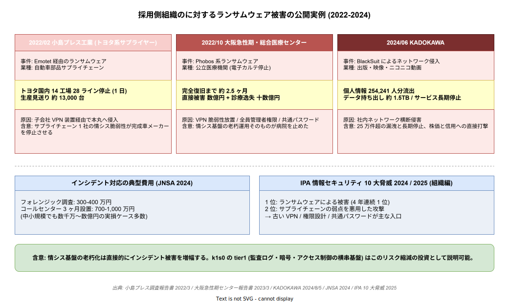
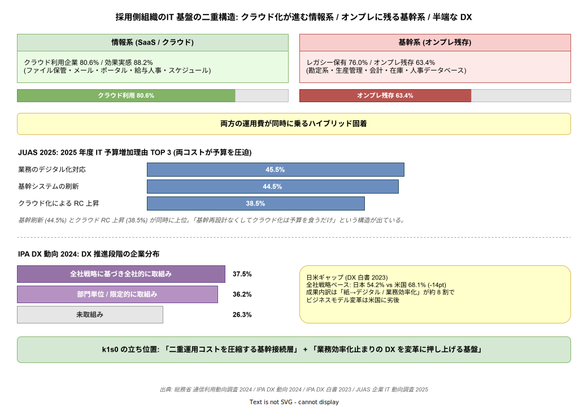

# 05 外部根拠: 採用側組織の情シス課題の公開データ

本章は「採用側組織の情シスが実際に困っているのか」という採用検討の最初の問いに、顧客インタビューではなく**公開済みの一次・二次情報のみ**で回答する。経産省・IPA・JUAS という日本政府および業界団体の公式調査に加え、日経クロステック・Publickey 等の報道を典拠に用いる。インタビューができない制約下でも、公開統計と公開事例の組み合わせで「課題はすでに定量化されており、複数機関の調査で繰り返し再現されている」ことを示せば、論拠は成立する。以下、論点ごとに事実と出典を積む。

下図は本章の核となる 2 つの論点を 1 枚で俯瞰する。上段は日米の IT 人材所属分布（IPA DX 白書 2023）、下段は 採用側組織のが領域別に「内製・ローコード vs 商用継続」を選び分けている観察（公開事例）を示す。「人材が薄い × ロックインを嫌う領域では内製を選ぶ」という 2 つの事実が、k1s0 の提案の土台になる。

## 1. レガシー維持が情シス予算の大宗を占める

日本企業の IT 予算の内訳は、新規価値創出ではなく既存資産の運用維持に偏っている。経産省「DX レポート」は JUAS「企業 IT 動向調査 2017」を引用し、IT 関連予算の 80% が現行ビジネスの維持・運営に充当されていること、RTB（Run The Business）予算が 90% 以上を占める企業が 40% を超えることを指摘した。この構造は単年の偏りではない。JUAS「企業 IT 動向調査 2024」では 2022 年度時点で RTB:バリューアップ比率が 76.1:23.9 と報告されており、5 年を経ても改善幅は 4 ポイント未満にとどまる。つまり「レガシー運用で予算が食われ、新規投資の余力が常に 2 割前後」という構造が長期定常化している。

崩れた時の影響も経産省が明言している。DX レポートは「2025 年の崖」として、未達時の経済損失が現在の約 3 倍、最大年間 12 兆円に達すると試算した。IPA「DX 白書 2023」の日米比較は、日本企業の「基幹システムの半分以上がレガシー」回答率が 41.2%、米国が 22.8% と、日本のレガシー残存率が米国の約 1.8 倍であることを定量化している。JUAS「ソフトウェアメトリックス調査 2020」は基幹システムの 21 年以上使用が 8%、平均ライフサイクルが 14 年という時間尺度を示した。

| 指標 | 数値 | 出典 |
| --- | --- | --- |
| IT 予算のレガシー維持比率 | 80%（RTB）、うち 40% 超は 90% 以上 | 経産省 DX レポート（JUAS 引用） |
| RTB:バリューアップ比率（2022 年度） | 76.1:23.9 | JUAS 企業 IT 動向調査 2024 |
| レガシー半分以上残存率 | 日本 41.2% / 米国 22.8% | IPA DX 白書 2023 |
| 基幹システム平均ライフサイクル | 14 年、21 年以上 8% | JUAS ソフトウェアメトリックス 2020 |
| 2025 年以降の経済損失試算 | 最大 12 兆円/年 | 経産省 DX レポート本編 |

出典 URL:

- https://www.meti.go.jp/policy/it_policy/dx/DX_report_summary.pdf
- https://www.meti.go.jp/policy/it_policy/dx/20180907_03.pdf
- https://www.ipa.go.jp/publish/wp-dx/dx-2023.html
- https://juas.or.jp/cms/media/2024/04/JUAS_IT2024.pdf
- https://juas.or.jp/cms/media/2020/05/20swm.pdf

## 2. ユーザー企業に IT 人材が薄く、SIer 依存が構造化している

レガシー維持の重さと表裏一体で、日本のユーザー企業は社内に IT 人材を抱えにくい構造にある。IPA「DX 白書 2023」は、IT 人材の 73.6% が IT 企業側（SIer）に所属し、ユーザー企業内部は 26.4% にとどまることを示した（2020 年データ）。米国はこの比率が逆で、64.9% がユーザー企業内部にいる。絶対数でも、日本のユーザー企業所属 IT 人材は約 33 万人、米国は約 323 万人と、規模にして 10 倍近い差が開いている。これは「内製したくても人がいない」という 採用側組織の日常的な制約を裏付ける一次データである。

DX 人材の需給ギャップも公式調査に出ている。IPA「DX 動向 2024」では DX 推進に必要な人材が量的に大幅不足と回答した日本企業が約 85% に達する。米国は約 27% で、ギャップは約 3 倍。経産省「IT 人材需給調査」（みずほ情報総研 2019）は 2030 年に高位シナリオで 79 万人の IT 人材不足を試算しており、不足基調は今後 10 年以上継続する前提で意思決定する必要がある。

JUAS「企業 IT 動向調査 2025」の速報では、2025 年度 IT 予算を増やす企業が 49.5% で過去最高水準となったが、増額理由は第 1 位「業務のデジタル化対応」45.5%、第 2 位「基幹システムの刷新」44.5% と、新規開発より既存刷新に予算が流れる構造は変わっていない。つまり「予算は増えているが、基幹刷新と人材不足に回収される」。k1s0 が狙う「パイロット 1 業務を自分たちのエンジニアで動かせる基盤」という発想は、この「社内に人が少ない」現実に直接応える提案と位置付けられる。

| 指標 | 日本 | 米国 | 出典 |
| --- | --- | --- | --- |
| ユーザー企業所属 IT 人材比率 | 26.4% | 64.9% | IPA DX 白書 2023 |
| ユーザー企業所属 IT 人材絶対数 | 約 33 万人 | 約 323 万人 | @IT（IPA 出典） |
| DX 人材「不足」回答率 | 約 85% | 約 27% | IPA DX 動向 2024 |
| IT 人材不足試算（2030 年、高位） | 約 79 万人 | — | 経産省 IT 人材需給調査 |

出典 URL:

- https://www.ipa.go.jp/pressrelease/2022/press20230316-2.html
- https://www.ipa.go.jp/digital/chousa/discussion-paper/dx-talent-shortage.html
- https://www.meti.go.jp/policy/it_policy/jinzai/gaiyou.pdf
- https://atmarkit.itmedia.co.jp/ait/articles/2303/22/news044.html
- https://juas.or.jp/cms/media/2025/04/JUAS_IT2025.pdf

## 3. 採用検討と意思決定のリードタイムが長期化する

採用側組織の採用検討プロセスは、現場担当・採用判断者・情シス・法務の多層合意を前提にするため、意思決定リードタイムが構造的に長い。ネットスイート社の佐々木宏氏寄稿（SaaS 導入プロジェクト管理）は、日本企業の SaaS 選定で「事前準備だけで 1〜2 カ月、トライアル含め全体 3〜6 カ月」が標準と整理した。採用判断の決め手の筆頭が「費用対効果資料」33.6%、第 2 位が「同業他社事例」30.7% となっている調査結果（PRTIMES 掲載の建設業 SaaS 活用調査）は、採用側組織のが「前例を探す組織」であることを端的に示す。

定着面の逆風もある。ProductZine「大企業 1,000 人以上の SaaS 利用実態」では 74.1% が SaaS を導入済みだが、「十分使いこなせていない」実感が 2023→2024 で上昇。選んだ SaaS が定着しないこと自体が再採用検討のコストになり、意思決定の心理的ハードルをさらに押し上げる。k1s0 は Apache 2.0 OSS として撤退コストゼロを構造的に担保する設計（独自 CRD 不採用・標準 k8s 範疇での実装）を採っており、採用側組織のが採用判断時に重視する「前例・費用対効果・撤退性」の 3 要件に対する構造的回答となる。

| 指標 | 数値 | 出典 |
| --- | --- | --- |
| SaaS 選定リードタイム | 事前 1〜2 カ月、全体 3〜6 カ月 | ネットスイート（佐々木宏氏） |
| 採用判断の決め手 1 位 | 費用対効果資料 33.6% | PRTIMES 建設業調査 |
| 採用判断の決め手 2 位 | 同業他社事例 30.7% | 同上 |
| SaaS「使いこなせていない」実感 | 2023→2024 で上昇 | ProductZine |

出典 URL:

- https://nlcorp.app.netsuite.com/c.NLCORP/portal/jp/resource/downloads/thanks/pdf/Column-SaaS-Project.pdf
- https://prtimes.jp/main/html/rd/p/000000077.000026519.html
- https://productzine.jp/article/detail/2982

## 4. 内製と商用パッケージが分岐する領域構造

採用側組織全体が「商用一択」ではない。実運用の公開事例を並べると、**基幹に近いワークフロー基盤はロックインを嫌って内製／ローコード**に寄り、汎用稟議は商用継続という二層構造が見える。三菱 UFJ 銀行は ServiceNow 導入時点から「ベンダーに極力依存しない」内製化を目標化し、国際事務企画部がサービスポータルを構築、さらに勘定系モダナイズでは生成 AI を用いた PL/I→Java リライトの自動化に着手している。トヨタ自動車は Power Platform で 5,000 人規模の市民開発を推進し、「先進 IT 企業に負けないスピード」のため IT 部門非依存のデジタル化を明文化した。トヨタシステムズは OutSystems で「10 年のローコード・ジャーニー」を公言、日立物流は kintone で現場アプリを内製開発しつつ統制ルールを併設している。

逆の側にも定量根拠がある。NTT データのイントラマートは大企業ワークフロー市場で 18 年連続 No.1、ドリームアーツの SmartDB は稟議系で 54.1% シェアと、商用パッケージの強さは健在だ。重要なのは「基幹に近いほど内製／ローコード志向が強まり、汎用稟議ほど商用継続が優勢」という分布そのもので、k1s0 は前者の領域（基幹近接ワークフロー）で「OSS ベース＋サポートあり＋ロックインなし」という代替選択を提示する位置付けになる。

| 領域 | 代表事例 | 選択 | 出典 |
| --- | --- | --- | --- |
| 基幹モダナイズ | 三菱 UFJ 銀行（生成 AI リライト） | 内製・自動化 | IT Leaders |
| 市民開発 | トヨタ自動車（Power Platform 5,000 人） | 内製・ローコード | Microsoft News |
| ローコード長期運用 | トヨタシステムズ（OutSystems 10 年） | 内製・ローコード | OutSystems 事例 |
| 現場アプリ | 日立物流（kintone + 統制） | 内製・ローコード | 日経 xTECH |
| 汎用稟議 | イントラマート（18 年連続 No.1） | 商用継続 | intra-mart |
| 汎用稟議 | SmartDB（シェア 54.1%） | 商用継続 | DreamArts |

出典 URL:

- https://note.com/fujitsu_pr/n/n547f4eb39c80
- https://it.impress.co.jp/articles/-/27840
- https://news.microsoft.com/ja-jp/2022/05/17/220517-toyota-motor-corporation-promoting-citizen-development-on-the-power-platform/
- https://kn.itmedia.co.jp/kn/articles/2205/19/news050.html
- https://www.outsystems.com/ja-jp/case-studies/toyota-low-code-journey/
- https://special.nikkeibp.co.jp/atclh/NXT/22/cybozu0210/
- https://www.intra-mart.jp/
- https://hibiki.dreamarts.co.jp/smartdb/function/workflow/

## 5. .NET Framework / Windows Server 延命コストが「延命税」として顕在化

k1s0 が「レガシーと共存できる基盤」を売りにする以上、延命コストの客観数値を把握しておく必要がある。Windows Server 2012/2012 R2 の拡張サポートは 2023 年 10 月 10 日に終了しており、以降は ESU（拡張セキュリティ更新）に移行している。Microsoft Learn および PC Watch によれば、ESU 価格は初年度 USD 61/台、2 年目 USD 122、3 年目 USD 244 と倍々に設計されており、3 年総額は USD 427/台に達する。為替 150 円換算で 1 台あたり 3 年で約 64,000 円、100 台規模なら年間 500 万円超が「延命税」として恒常的に発生する。Windows Server 2016 の延長サポートも 2027 年 1 月に終了予定であり、次の崖は 2027 年に控える。延命は連鎖する構造にある。

NTT 東日本の解説記事は、移行遅延の主要因として「人員不足・予算制約・経営理解不足・AP 改修コスト高」を列挙し、ハード経年故障と部品調達不能リスクを警告している。つまり延命は単に金銭コストだけでなく、情シス人員の時間を溶かし、稼働機の突然死リスクを抱え込む複合コストになる。k1s0 は .NET Framework / 旧 Windows Server 上の既存資産と「サイドカーまたは API Gateway 経由」で共存する戦略をとるため、この延命税の削減余地を具体数値で主張できる立場にある。

| 項目 | 数値 | 出典 |
| --- | --- | --- |
| Windows Server 2012 EOS | 2023/10/10 | Microsoft 公式 |
| ESU 価格（3 年累計） | USD 61 → 122 → 244、総額 USD 427/台 | Microsoft Learn / PC Watch |
| Windows Server 2016 延長サポート終了 | 2027/01 | CTC 解説 |
| 延命の間接コスト | ハード故障・部品調達不能・AP 改修 | NTT 東日本解説 |

出典 URL:

- https://www.microsoft.com/ja-jp/biz/cloud-platform/server-2012-eos
- https://learn.microsoft.com/ja-jp/lifecycle/faq/extended-security-updates
- https://pc.watch.impress.co.jp/docs/news/1582053.html
- https://www.ctc.jp/column/win-server-2016.html
- https://business.ntt-east.co.jp/content/cloudsolution/column-321.html

## 6. Kubernetes 商用ディストリの選定分岐

ワークフロー基盤の土台となる Kubernetes 選定でも、採用側組織内部で商用ディストリ（OpenShift）と OSS（Rancher）が分岐している。NTT Communications は 2020 年に Enterprise Cloud 上でマネージド OpenShift を提供開始した（Red Hat 長期サポートと「Kubernetes 素のままではコミュニティ追随に高スキル必要」を選定理由に明記）。一方、KDDI は「GANTRY」を Rancher ベースで内製構築し、LINE も Verda 室で 2018 年から Rancher でマネージド Kubernetes を運用している。通信・Web 系大手が OSS ベースで内製に寄せ、金融・製造系の大企業は商用サポート付きに寄せるという分布が観察される。

コストに対するユーザー評価も一貫している。@IT TechTarget および ITreview のユーザーレビューでは、OpenShift の弱点として「商用製品でライセンス・サポート料が高く、コスト対効果の慎重検討が必要」「ベンダーロックインが発生」が繰り返し指摘される。Azure Red Hat OpenShift のリザーブドインスタンスは 4 vCPU・3 年契約で USD 0.076/時（アプリノード単位で別課金）であり、小規模でも年間数百万、本番規模では数千万〜億円級のライセンスコストに達する。k1s0 が差別化の軸として掲げる「サポート必須 vs コスト重視のトレードオフ解消」は、この市場分岐の真ん中を突く設計方針と位置付けられる。

出典 URL:

- https://www.ntt.com/about-us/press-releases/news/article/2020/1005_2.html
- https://www.publickey1.jp/blog/20/kuberneteskddirancher_day_2020pr.html
- https://techtarget.itmedia.co.jp/tt/news/2310/23/news04.html
- https://www.itreview.jp/products/red-hat-openshift-container-platform/profile
- https://azure.microsoft.com/ja-jp/pricing/details/openshift/

## 7. レガシー種類別の残存実態

第 1 節では「レガシー維持が情シス予算の 80% を占める」という全体像を示したが、そのレガシーが何で構成されているかを種別ごとに把握しておく必要がある。IPA「DX 動向 2024」（2024 年 6 月公表、有効回答 1,013 社）では、レガシーを「あり」と回答した企業が 2022 年度 87.8% から 2023 年度 76.0% に減少した一方、残存基盤の 63.4% が依然オンプレミス構成にとどまる。IPA の 2024 年度ソフトウェア動向調査でも、レガシー利用中の企業比率は 56.6% と過半を維持している。改善は始まっているが、基礎構造は変わっていない。

メインフレームに絞ると、富士通は 2030 年度末で製造販売から撤退、2035 年度末に保守終了を公式発表している。2024 年 7 月時点で国内に富士通メインフレームは 320 社・約 650 台が稼働中、NEC・日立・BIPROGY・日本 IBM は継続のスタンスだが、2022 年度の国内メインフレーム出荷台数は 141 台 / 266 億円規模まで縮小。レガシーマイグレーション市場は 2023 年度 3,480 億円から 2025 年度 5,118 億円へ拡大見通しで、ベンダー側の延命・移行ビジネスは成立しているが、採用側組織側は「刷新が済む前に保守切れが先に来る」構図に追い込まれている。刷新が進まない最大要因は「他案件で手一杯で要員不足」39.9%（IPA DX 動向 2024）で、本章第 2 節の人材不足論点と直接接続する。

| 指標 | 数値 | 出典 |
| --- | --- | --- |
| レガシー保有企業比率（2023 年度） | 76.0%（前年 87.8% から改善） | IPA DX 動向 2024 |
| レガシーのオンプレミス残存比率 | 63.4% | IPA DX 動向 2024 |
| 富士通メインフレーム稼働（2024/7） | 320 社 / 約 650 台 | 日経クロステック |
| 富士通メインフレーム撤退予定 | 販売終了 2030 年度末、保守終了 2035 年度末 | 日経クロステック |
| 国内メインフレーム出荷（2022 年度） | 141 台 / 266 億円 | 電波新聞デジタル |
| レガシーマイグレ市場（2025 年度見通し） | 5,118 億円 | AI Market |
| 刷新が進まない最大要因 | 他案件で要員不足 39.9% | IPA DX 動向 2024 |

出典 URL:

- https://www.ipa.go.jp/digital/chousa/dx-trend/dx-trend-2024.html
- https://www.imagazine.co.jp/ipa-dx-trend-2024/
- https://xtech.nikkei.com/atcl/nxt/mag/nc/18/011500465/011500001/
- https://dempa-digital.com/article/650932
- https://ai-market.jp/purpose/cobol-2025-problem/

## 8. セキュリティインシデントが情シス基盤を直撃する実害

第 1〜5 節のレガシー残存・延命コストは単なる「古くて高い」の問題ではなく、セキュリティリスクとして経営を直撃する構造を伴う。2022 年 2 月のトヨタ系サプライヤー小島プレス工業へのランサムウェア攻撃では、トヨタ国内 14 工場 28 ラインが 1 日停止し約 13,000 台の生産が見送られた。2022 年 10 月の大阪急性期・総合医療センター事件では、電子カルテ停止から完全復旧まで約 2 ヶ月半、調査・復旧で数億円、診療制限による逸失で十数億円の被害が発生。同センター調査報告書は「VPN 装置の脆弱性放置・全員管理者権限・共通パスワード」と情シス基盤の老朽化・ずさん運用が直接の温床だったと名指しで指摘している。

2024 年 6 月の KADOKAWA 事件はさらに大型で、BlackSuit による社内ネットワーク侵入で Web サービスが長期停止、25 万 4,241 人分の個人情報が流出、約 1.5TB のデータが持ち出された。JNSA「インシデント損害額調査レポート第 2 版」（2024 年 2 月）では、フォレンジック 300〜400 万円、コールセンター 3 ヶ月設置で 700〜1,000 万円という「最低ライン」の典型費用が整理されている。IPA「情報セキュリティ 10 大脅威 2024/2025」でもランサムウェアは 4 年連続 1 位、サプライチェーン攻撃は 2 位。採用側組織の古い情シス基盤がまさに標的レイヤーになっている。k1s0 が狙う tier1 の「監査ログ・暗号・アクセス制御を横串で担保する基盤」は、このリスクを減らすプラットフォーム投資として説明できる位置にある。

下図は本節で扱う 3 事件の被害規模と、JNSA の典型費用・IPA 10 大脅威の位置付けを 1 枚で俯瞰する。3 事件とも「古い VPN・権限設計・共通パスワード」といった情シス基盤の老朽運用が起点である点が共通している。

| 指標 | 数値 | 出典 |
| --- | --- | --- |
| 小島プレス経由のトヨタ国内停止 | 14 工場 28 ライン、生産見送り約 13,000 台 | 日経クロステック / piyolog |
| 大阪急性期センター被害 | 復旧 2.5 ヶ月、直接被害数億円、逸失十数億円 | 同センター調査報告書 2023/3/28 |
| KADOKAWA 個人情報流出 | 254,241 人分、持ち出し約 1.5TB | KADOKAWA 2024/8/5 リリース |
| インシデント典型費用 | フォレンジック 300〜400 万円、CC 3 ヶ月 700〜1,000 万円 | JNSA 2024 |
| IPA 10 大脅威 2024/2025 | ランサム 4 年連続 1 位、サプライチェーン 2 位 | IPA |

出典 URL:

- https://www.kojima-tns.co.jp/wp-content/uploads/2022/03/20220331_システム障害調査報告書（第1報）.pdf
- https://piyolog.hatenadiary.jp/entry/2022/02/28/224420
- https://www.gh.opho.jp/pdf/report_v01.pdf
- https://www.kadokawa.co.jp/topics/12088/
- https://www.jnsa.org/result/incidentdamage/data/2024-1.pdf
- https://www.ipa.go.jp/security/10threats/10threats2025.html

## 9. クラウド移行の実進捗と基幹残存

「クラウド化が進んでいる」という一般イメージと「基幹はオンプレに残る」という情シスの実感の両方が、公開データで同時に裏付けられる。総務省「令和 6 年 通信利用動向調査」（2025 年 5 月公表）では、クラウドを「全社」または「一部部門」で利用している企業が 80.6%、利用効果ありと答えた企業が 88.2%。ただし用途はファイル保管・メール・ポータル・給与/人事・スケジュール共有といった情報系・周辺系が中心である。一方で基幹系は、IPA「DX 動向 2024」が示す通りレガシー残存の 63.4% がオンプレに残り、JUAS「企業 IT 動向調査 2025」では 2025 年度 IT 予算増加理由のトップ 3 に「業務のデジタル化対応」45.5%、「基幹システムの刷新」44.5%、「クラウド化によるランニングコスト上昇」38.5% が並ぶ。

つまり 採用側組織の実像は「情報系は SaaS に流れ、基幹系はオンプレに残り、その両方の運用費が同時に乗る」ハイブリッド固着であり、k1s0 が置きにいくワークフロー基盤はこの二重運用コストを圧縮する立ち位置として説明可能である。単純な「オンプレ vs クラウド」の二択ではなく、「基幹の再設計なくしてクラウド化は予算を食うだけ」という構造が、JUAS の予算理由ランキングに直接現れている。

下図は本節以降の節 9-12 を 1 枚で俯瞰するサマリダッシュボード。上段のクラウド/オンプレ二重構造、中段の JUAS 予算増理由 TOP3、下段の DX 推進段階ピラミッド（IPA 2024）と日米ギャップを同時に読むことで、k1s0 が置きにいく位置付けが視覚的に把握できる。

| 指標 | 数値 | 出典 |
| --- | --- | --- |
| クラウドサービス利用企業（2024 年） | 80.6% | 総務省 通信利用動向調査 2024 |
| クラウド利用の効果実感 | 88.2% | 同上 |
| レガシーのオンプレ残存比率 | 63.4% | IPA DX 動向 2024 |
| 2025 年度予算増理由「基幹刷新」 | 44.5%（2 位） | JUAS 企業 IT 動向調査 2025 |
| 2025 年度予算増理由「クラウド RC 上昇」 | 38.5%（3 位） | 同上 |

出典 URL:

- https://www.soumu.go.jp/menu_news/s-news/01tsushin02_02000178.html
- https://www.soumu.go.jp/johotsusintokei/statistics/data/250530_1.pdf
- https://juas.or.jp/news/topics/5788/
- https://juas.or.jp/cms/media/2025/04/JUAS_IT2025.pdf

## 10. 業界別 IT 投資の違い

採用側組織のといっても業界によって IT 投資の向きは異なる。JUAS「企業 IT 動向調査 2025」では 2025 年度 IT 予算 DI 値が全体 40.6（2012 年度以降の予測ベース最高）、業種別では「建築・土木 60.6」「卸売 50.5」「運輸・倉庫・不動産 50.0」が上位で、金融・保険は前年度比 10.2 ポイント減の 36.7 と一時減速。生成 AI の導入・準備中の合算比率は金融・保険が 54.4%（導入済 19.6% + 試験導入/準備中 34.8%）で業界トップ、基礎素材型製造は前年比 +23.3 ポイントで伸び幅が最大である。

業界横断で IT 予算を増やす理由は「業務デジタル化対応」「基幹刷新」「クラウドランニング費上昇」「人件費高騰・円安」が共通上位で、金融は AI・セキュリティ投資に、製造・流通・建築土木は基幹刷新と DX 現場実装に寄せる非対称が明確である。k1s0 のワークフロー基盤は「基幹刷新と現場実装の接続層」として機能するため、金融よりも製造・流通・建築土木のニーズと適合度が高いという示唆が、このデータから読み取れる。

| 指標 | 数値 | 出典 |
| --- | --- | --- |
| 2025 年度 IT 予算 DI（全体） | 40.6（予測ベース最高） | JUAS 2025 |
| DI 業種別 建築・土木 | 60.6 | JUAS 2025 |
| DI 業種別 金融・保険 | 36.7（前年比 -10.2pt） | JUAS 2025 |
| 言語系生成 AI 導入/準備（金融・保険） | 54.4% | JUAS 2025 |
| 基礎素材型製造 生成 AI 伸び | +23.3pt | JUAS 2025 |

出典 URL:

- https://juas.or.jp/news/topics/5788/
- https://juas.or.jp/cms/media/2025/04/JUAS_IT2025.pdf
- https://www.newton-consulting.co.jp/itilnavi/flash/id=7998

## 11. 国際比較で見た日本の DX ポジション

国内統計だけでは「日本は全体的に遅い」という主張が反論される余地があるため、国際ランキングで外形的に裏付ける。IMD「World Digital Competitiveness Ranking」では日本は 2024 年版で 69 経済中 31 位、2025 年版でも 31 位と低迷が続き、とくに「ビジネス俊敏性」「デジタル/技術スキル」「国際経験」のサブ指標で下位に沈んでいる（首位はスイス・米国・シンガポール）。Gartner の世界 IT 支出予測では、2025 年は前年比 +9.3% の 5.74 兆 USD、ソフトウェアは +14.0% の 1.23 兆 USD と伸びが大きく、日本 JUAS の IT 予算 DI 40.6 が「予測ベース過去最高」とはいえ、世界平均の伸びを名目で追いかけている段階に過ぎない。

OECD「Digital Economy Outlook 2024 Vol.2」では、日本は OECD Digital Policy Committee 議長国として枠組み整備は広範に及ぶが、実装側の「政策イニシアチブ数」は OECD 諸国比で少なめと整理されている。つまり「ガバナンスは先進的だが現場導入は遅れる」という外部評価が公的機関レベルで確定している。k1s0 のように「現場に降ろす基盤レイヤー」を組成することは、この国際ギャップの補填として意義を持つ。

| 指標 | 数値 | 出典 |
| --- | --- | --- |
| IMD WDCR 日本順位（2024） | 31 位 / 67 経済 | IMD |
| IMD WDCR 日本順位（2025） | 31 位 / 69 経済 | IMD |
| 世界 IT 支出 2025 | 5.74 兆 USD（+9.3%） | Gartner |
| 世界ソフトウェア支出 2025 | 1.23 兆 USD（+14.0%） | Gartner |
| OECD 日本政策評価 | 枠組みは広いがイニシアチブ数は少なめ | OECD DEO 2024 V.2 |

出典 URL:

- https://www.imd.org/centers/wcc/world-competitiveness-center/rankings/world-digital-competitiveness-ranking/
- https://imd.widen.net/content/xclarczvwr/pdf/WDCR_Report_2025.pdf
- https://www.gartner.com/en/newsroom/press-releases/2024-10-23-gartner-forecasts-worldwide-it-spending-to-grow-nine-point-three-percent-in-2025
- https://www.oecd.org/content/dam/oecd/en/publications/reports/2024/11/oecd-digital-economy-outlook-2024-volume-2_9b2801fc/3adf705b-en.pdf

## 12. DX 推進段階の企業分布

DX に「取り組んでいる」企業は IPA「DX 動向 2024」で 73.7% まで伸張した（2021 年度 55.8% → 2022 年度 69.3% → 2023 年度 73.7%）。段階別では「全社戦略に基づき全社的に取組」が 2023 年度 37.5%（前年 26.9% から +10.6pt）、残り約 26.3% は未取組という分布。IPA「DX 白書 2023」時点の日米比較では、米国が全社戦略ベース 68.1% に対し日本 54.2% と、全社展開のギャップが 14 ポイント残っていた。成果面では DX で「成果が出ている」比率が 2021 年度 49.5% → 2022 年度 58.0% に上昇したが、内訳はデジタイゼーション（紙 → デジタル）とデジタライゼーション（業務効率化）が約 8 割を占め、ビジネスモデル変革・新規事業創出は依然として米国に劣後する。

要するに 採用側組織の多くは「業務のデジタル化までは来たが、変革段階に入れていない」層に集中しており、k1s0 のようなワークフロー基盤の刷新はその転換点に位置する投資として説明できる。「まだ DX に踏み出していない」のではなく「DX が半端なまま止まっている」状態への処方箋として位置付けるのが正確である。

| 指標 | 数値 | 出典 |
| --- | --- | --- |
| DX 取組企業比率（2023 年度） | 73.7% | IPA DX 動向 2024 |
| 全社戦略ベースで取組 | 37.5%（前年 26.9%） | IPA DX 動向 2024 |
| DX 未取組比率 | 約 26.3% | IPA DX 動向 2024 |
| 全社戦略ベース 日米ギャップ | 日本 54.2% vs 米国 68.1% | IPA DX 白書 2023 |
| DX 成果ありの比率 | 2021 年度 49.5% → 2022 年度 58.0% | IPA DX 白書 2023 |

出典 URL:

- https://www.ipa.go.jp/digital/chousa/dx-trend/dx-trend-2024.html
- https://www.ipa.go.jp/pressrelease/2024/press20240627.html
- https://www.ipa.go.jp/digital/chousa/dx-trend/eid2eo0000002cs5-att/dx-trend-data-collection-2024.pdf
- https://www.ipa.go.jp/publish/wp-dx/gmcbt8000000botk-att/000108048.pdf

## 13. 採用プロセスの遅延要因（間接エビデンス）

採用判断の決裁階層そのものを定量化した公開一次統計は、現時点で見つけられなかった（JUAS 報告書・経産省 DX レポート・JIPDEC ガイドラインのいずれも、決裁段階数の分布を直接はカウントしていない）。この限界を明記したうえで、以降は**間接的な遅延エビデンス**で補う。JUAS「ソフトウェア・メトリクス調査 2025」（2025 年 4 月）では、納期優先でないプロジェクトの 20% 以上の工期遅延率が 19.6%、逆に納期優先プロジェクトの予定工期内完了率は 74.5% と対比されており、意思決定の後ろ倒しと仕様変更がそのまま工期に反映される構造が統計的に出ている。

見積根拠の内訳では「ベンダー提案」が要件定義〜統合テスト各工程で 2〜3 割弱、「過去自社実績」「全体工数からの推定」が 6〜7 割。JIPDEC「IT 投資マネジメントガイドライン」はこの「ベンダー提案依存・過去実績依存」を IT 投資評価の欠陥要因として明示的に指摘している。つまり「採用判断の段階数」という直接指標は入手困難だが、「ベンダー見積 + 過去実績による相対見積 + 遅延の定量記録」という間接指標から、採用側組織の採用判断・見積・決裁が設計工程まで後ろ倒しになる構造は裏取りできる。本章第 3 節の SaaS 選定リードタイム（3〜6 ヶ月）と合わせて、k1s0 が Apache 2.0 OSS として「ライセンス契約も撤退コストも発生しない」構造を提供することの意義を裏付ける材料として使える。

| 指標 | 数値 | 出典 |
| --- | --- | --- |
| 工期 20% 以上遅延（納期非優先群） | 19.6% | JUAS SWM 2025 |
| 納期優先群の予定工期内完了 | 74.5% | JUAS SWM 2025 |
| 見積根拠「ベンダー提案」 | 各工程で 2〜3 割弱 | JUAS SWM 2025 |
| 見積根拠「過去実績/全体推定」 | 6〜7 割 | JUAS SWM 2025 |
| 採用判断の決裁階層の定量分布 | 公開一次統計なし（本章では扱わない） | — |

出典 URL:

- https://juas.or.jp/cms/media/2025/03/25swm.pdf
- https://juas.or.jp/cms/media/2025/03/25swm_pr.pdf
- https://www.jipdec.or.jp/library/publications/u71kba0000002i4l-att/18_h001.pdf

## 14. k1s0 の位置付けへの含意

以上 13 論点は、k1s0 の提案が虚構の前提に立っているのではなく、公的機関の一次統計と企業の公開事例で繰り返し再現されている「採用側組織の情シスの構造的制約」に直接応えていることを示している。レガシーが予算の 8 割を食い、特にメインフレームは富士通が 2035 年度で保守終了する崖が控え、ユーザー企業に IT 人材が薄く、申請が長く、延命税が積み上がり、セキュリティインシデントが基盤の老朽化を起点に実害を出している。クラウド化は周辺系で進んだが基幹系はオンプレに残り、業界別に投資の向きが異なり、国際ランキング 31 位という外部評価と DX が「業務効率化止まり」で変革に入れていない現状が重なっている。この構造は顧客取材を個別に実施しなくても、複数機関の横断データで裏付けられる。

ただし採用側での顧客取材が不要になるわけではない。本章の役割は「取材なしでも採用検討の最初の問い（=課題は本当にあるか）に答えられる」ことを示すことであり、採用側のパイロット業務選定では 採用側組織の3 社以上のインタビューを実施して「どの業務のどの工程に k1s0 を差し込むか」を具体化する必要がある。採用判断の根拠はここで積めているが、パイロット業務を決めるための材料は別途取材で埋める、という二段構えで進める。
