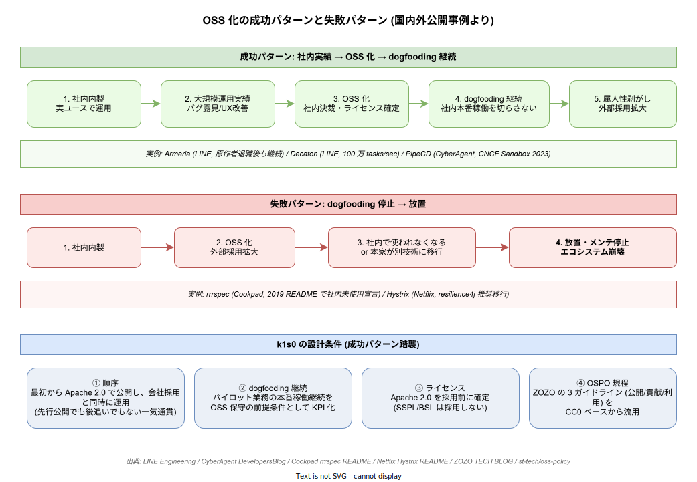

# 個人開発 OSS の系譜と k1s0 の位置づけ

k1s0 は起案者が業務外で個人的に開発しているクラウドネイティブ・アプリケーションプラットフォームである。会社（起案者の雇用主）がこれを業務システムとして利用しているが、k1s0 は会社の予算・工数で開発されたものではない。本章では「個人で作った基盤 OSS が、結果として企業に採用される」という系譜のなかに k1s0 を位置づける。先例から得られる設計上の含意と、避けるべき罠を整理する。

## 1. 個人発 OSS が企業基盤になった先例

クラウドネイティブの主要 OSS の多くは、最初は一個人のプロジェクトから出発している。組織のロードマップや事業計画から逆算されて作られたものは少数派で、開発者個人の不満・趣味・学習意欲が起点となるパターンが系譜として連綿と続いている。

**Linus Torvalds / Linux Kernel**: 1991 年、当時 21 歳のヘルシンキ大学院生 Linus Torvalds が「自分用の Minix の代替が欲しい」という個人的動機で開発を開始。当初は Usenet `comp.os.minix` で「これはホビープロジェクトだ。GNU のように大きくはならないし、プロフェッショナルでもない」と本人が宣言していた。30 年以上を経て、現在ではクラウドインフラ・スマートフォン・スーパーコンピュータの大半が Linux カーネル上で稼働している。

**Solomon Hykes / Docker**: 2013 年、PaaS スタートアップ dotCloud の社内ツールとして Solomon Hykes が個人的に書いていた LXC ラッパーが Docker の前身。dotCloud の事業は失敗したが、Docker は OSS 公開後に爆発的に普及し、コンテナという計算単位を業界標準にした。「個人の作業効率化ツールが、結果として業界の前提を作り変えた」事例。

**Mitchell Hashimoto / Vagrant・Terraform・Vault**: ワシントン大学院生だった Mitchell Hashimoto が個人プロジェクトとして始めた Vagrant（2010）が出発点。HashiCorp 設立後は Terraform・Vault・Consul・Nomad と次々と OSS を生み出し、いずれも「個人開発の延長線上で作られた」スタイルを保ったまま企業基盤の地位を獲得した。

**Michael DeHaan / Ansible**: 2012 年、Red Hat の元社員 Michael DeHaan が個人プロジェクトとして開発開始。「Puppet も Chef も複雑すぎる」という個人的不満が動機。Ansible は agent-less という設計判断によって急速に支持を集め、最終的に Red Hat に買収された。

**Evan You / Vue.js**: Google で AngularJS を使っていた Evan You が「もっと軽量な代替が欲しい」と個人プロジェクトで開発を始めた（2014）。今や React と並ぶフロントエンドフレームワークとして、業務系 SPA の標準選択肢になっている。

| 創始者 | 出発点 | 動機の源泉 | 企業採用後の構造 |
|---|---|---|---|
| Linus Torvalds | Linux Kernel (1991) | Minix の代替が欲しい | 創始者は個人のまま、企業は寄付・人材出向で支援 |
| Solomon Hykes | Docker (2013) | dotCloud の社内ツール | 創始者退社後も OSS は継続、Docker Inc. が分離 |
| Mitchell Hashimoto | Vagrant (2010) | 大学院生の個人プロジェクト | HashiCorp 設立、創始者がメンテナとしてリード |
| Michael DeHaan | Ansible (2012) | Puppet/Chef への不満 | Red Hat 買収後も創始者の設計思想が残存 |
| Evan You | Vue.js (2014) | AngularJS の重さへの不満 | 個人スポンサーシップで独立性を維持 |

これらに共通するのは、**創始者が会社から「作れ」と言われて作ったわけではない**点である。逆に、企業が「便利だから使う」と後から採用してくることで、結果として個人 OSS が企業基盤になった。k1s0 もこの系譜に属する。

## 2. k1s0 が個人開発である理由

個人開発であることは妥協ではなく設計判断である。会社プロジェクトとして組織化された時点で k1s0 は別物になる、という強い前提のもとで開発を進めている。

**技術的探究の自由**: k1s0 は Kubernetes / Istio Ambient / Dapr / ZEN Engine / Temporal / SLSA L3 / SPIFFE といった先端技術を実プロダクション級で統合する。会社の業務要件から逆算してこれらを選定すると、必ず「いきなり全部は無理だから段階導入で」という妥協を強いられる。個人開発であれば、技術的純度を保ったまま「最初から本来あるべき形」を実装できる。

**段階導入を採らない**: 段階導入は組織体力をマネジメントするための仕組みである。これが存在しない個人開発では、段階導入は不要であるどころか、設計を歪める要因にしかならない。k1s0 は最初から全機能を実装し、機能や品質の段階分けを文書からも実装からも排除している。

**時間軸の主権**: 期日も納期もない。起案者が納得するまで作り込んでから世に出す。これは個人開発でしか成立しない品質基準であり、企業プロジェクトに組み込まれた瞬間に失われる。

**美意識の貫徹**: 既存の業務システムが負っているレガシーな構造（.NET Framework モノリスの集合）への個人的な不満が、k1s0 の動機の根底にある。会社プロジェクトであれば「現状で動いているのだから優先度低」と切り下げられる論点を、個人開発では一級の動機として保持できる。

## 3. 失敗パターンと回避

個人発 OSS が企業に採用された後、長期的に持続する事例と崩壊する事例の差は明確である。

**Cookpad / rrrspec**: 分散 RSpec CI として Cookpad 社内で 60 並列運用されていたが、社内利用が止まった時点で 2019 年に「Cookpad は社内で使っていない。PR は気まぐれにレビュー、アクティブ保守なし」と公式宣言された。**創始者・利用組織が日常的に使い続けない OSS は遅かれ早かれ死ぬ**という典型例。

**Netflix / Hystrix**: Netflix 自身が「新規開発は resilience4j に移行」と宣言してメンテナンスモード化。OSS として爆発的に採用されていたが、本家が撤退したため Spring Cloud Netflix も巻き添えで maintenance mode に波及した。**外部ユーザが多くても、本家が使わなくなると死ぬ**。

これらの失敗パターンに共通するのは「dogfooding が切れた」ことである。逆に Linux / Docker / Vue.js が長期的に持続している理由は、創始者または初期コミュニティが日常的に使い続けているからに他ならない。

k1s0 ではこの罠を構造的に回避する。

- **起案者自身が日常的に使う**: ローカル開発環境・個人プロジェクト・実験プラットフォームとして起案者が継続利用する。これが OSS 保守の前提条件。
- **会社利用は副次的かつ歓迎**: 会社が業務利用することは k1s0 にとって有益（実運用フィードバックが得られる）だが、会社が使うことを「k1s0 を維持する理由」にはしない。会社が利用を止めても起案者は開発を続ける構造にする。
- **外部利用も歓迎**: GitHub 公開済の OSS として、社外の利用者・コントリビュータを排除しない。

## 4. ライセンスは Apache 2.0 で確定済

k1s0 のライセンスは **Apache 2.0** で確定している。先例から得られた含意を踏まえて、ライセンス選定は最初から動かさない方針を採っている。

**Apache 2.0 を選んだ理由**:

- **ZEN Engine（MIT）と整合**: ZEN Engine は MIT で公開されている。k1s0 のコードベースを Apache 2.0 にすることで両者を矛盾なく統合できる。
- **採用ハードルの低さ**: 商用利用・改変・再配布が自由であるため、企業が採用する際の法務確認が軽い。会社が k1s0 を業務システムに組み込むうえで Apache 2.0 は最も阻害が少ない。
- **明示的特許許諾**: Apache 2.0 は contributors からの特許訴訟を構造的に抑止する条項を持つため、企業利用者の安心材料になる。

**SSPL / BSL を採らない理由**: HashiCorp / Terraform は 2023/8 に MPL から BSL 1.1 へライセンス変更した結果、コミュニティが OpenTofu としてフォークし、Linux Foundation 傘下に独立した。Redis や MongoDB の SSPL 化も同様にコミュニティ分裂と本家の地位低下を招いた。これらの失敗を踏まえて、k1s0 は **クラウド事業者対策のための制限的ライセンスを採用しない**。

**AGPL OSS への対応**: k1s0 自体は Apache 2.0 だが、依存 OSS として AGPL の Grafana / Loki / MinIO を組み込んでいる。これは k1s0 のコードベースを AGPL 化するわけではなく、`infra/` レイヤで動作する独立コンポーネントとしての利用に限定される。会社が k1s0 を業務利用する際、AGPL 義務（ソース改変時の公開義務）の発動条件は会社側で確認する責任を負う。詳細は [`../05_法務サマリ/01_OSSライセンス適合.md`](../05_法務サマリ/01_OSSライセンス適合.md) を参照。

| 選定候補 | k1s0 での扱い | 理由 |
|---|---|---|
| Apache 2.0 | **採用（k1s0 本体）** | ZEN Engine 整合・採用ハードル低・特許許諾条項あり |
| MIT | 採用しない（ただし依存 OSS では許容） | 特許許諾条項がない |
| AGPL-3.0 | 依存 OSS として採用（Grafana / Loki / MinIO） | k1s0 本体には伝播しない構成 |
| SSPL / BSL | **採用しない** | コミュニティ分裂の前例（Terraform / Redis） |

## 5. 系譜と失敗パターンの俯瞰

下図は本章で扱った成功パターン（Linux / Docker / Vue.js 型）と失敗パターン（rrrspec / Hystrix 型）を 1 枚に並べ、k1s0 がどちらに分類されるかを示している。成功と失敗を分ける決定要因は **創始者・初期コミュニティが日常的に使い続けているか** であり、k1s0 ではこれを起案者の継続利用と会社の業務利用の二重構造で担保している。

## 6. 会社利用との関係

k1s0 は OSS として GitHub で公開されているため、誰でも採用できる。会社が業務システムとして採用しているのも、原理的には外部の任意ユーザが採用するのと同じ立場である。

ただし会社が採用していることには、以下の派生的な意味がある。

- **実運用フィードバックの源泉**: 個人開発では遭遇しない規模・負荷・障害パターンが会社利用から発覚し、k1s0 の品質向上に寄与する。
- **dogfooding の補強**: 起案者個人の日常利用に加えて、会社の業務利用が継続的に走ることで、rrrspec / Hystrix のような「使われなくなる罠」をさらに遠ざける。
- **責任分界**: SLO / SLA は k1s0 として保証しない。会社が業務利用する以上、運用責任は会社側にある。バス係数は本質的に 1 であり、会社利用者は自身でフォークするか、内製化する余地を確保する責任を持つ。

会社が利用することは結果的に有益だが、k1s0 は会社のために作られたものではなく、会社が利用を止めても開発が続く。この一線を保つことが、k1s0 を企業プロジェクトの妥協から守る前提条件である。

## 関連ドキュメント

- [`../企画書.md`](../企画書.md) — k1s0 の全体像と動機
- [`../README.md`](../README.md) — 本ディレクトリの索引
- [`../05_法務サマリ/01_OSSライセンス適合.md`](../05_法務サマリ/01_OSSライセンス適合.md) — Apache 2.0 と AGPL 依存 OSS の構成
- [`../05_法務サマリ/03_知財帰属.md`](../05_法務サマリ/03_知財帰属.md) — 起案者の著作権と Apache 2.0 ライセンス
