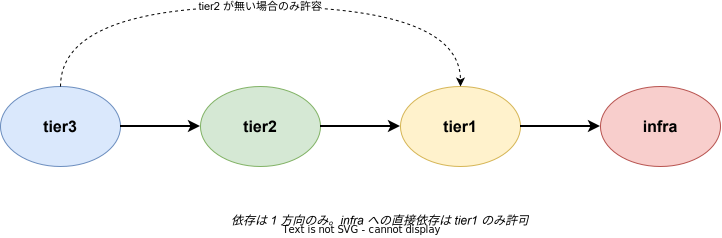

# 依存ルールと通信経路

## 目的

k1s0 における tier 間の依存関係の制約と、実際のサービス間通信がどのように行われるかを整理する。レイヤの責務は [`01_レイヤ構成と責務.md`](../01_基礎/01_レイヤ構成と責務.md) を参照。

---

## 1. 依存ルール (静的制約)

### 基本原則

- tier 間の依存は **1 方向のみ**。上位層は下位層を参照できるが、逆は禁止する
- tier3 は原則 tier2 を経由して tier1 を利用する
- tier2 が存在しない場合に限り、tier3 は tier1 を直接利用できる
- **infra 層への直接依存は tier1 のみに許可する**。tier2 / tier3 は tier1 経由でのみ infra 機能を利用する
- **tier2 / tier3 は tier1 公開 API (多言語クライアントライブラリ) のみを利用する**。Dapr SDK / Dapr API / infra コンポーネント (Kafka クライアント等) を直接 import / 呼び出してはならない

### 禁則事項 (tier2 / tier3 コードに現れてはならないもの)

| 禁止対象 | 例 |
|---|---|
| Dapr SDK の import | `using Dapr.Client;` / `import "github.com/dapr/go-sdk"` |
| Dapr annotation を手書き | `dapr.io/enabled: "true"` を YAML に追記 |
| Dapr Component YAML の編集 | `apiVersion: dapr.io/v1alpha1` を扱う |
| Kafka / Redis クライアントの直接利用 | `confluent-kafka-go` / `StackExchange.Redis` 等 |
| infra コンポーネントの URL ハードコード | `http://loki.infra.svc.cluster.local:3100` |
| `HttpClient` によるサービス間直接通信 | `k1s0.Service.Invoke` を経由しない HTTP 呼び出し |
| OSS ライブラリの直接利用 | tier1 がラップしていない OSS パッケージの import (有償化・メンテ停止リスクを tier1 に閉じ込めるため) |

これらの違反は tier1 チームが提供する CI ガード (Roslyn analyzer / `golangci-lint` / YAML lint) で機械的に検出する。詳細は [`../../03_tier1設計/02_API契約/03_API設計原則.md`](../../03_tier1設計/02_API契約/03_API設計原則.md) を参照。

### 依存ルールがもたらす利点

- tier1 が infra と Dapr の抽象化層として機能する
- 将来的な infra 置換 (Kafka → NATS、Loki → Tempo 等) や Dapr のバージョン更新・互換性破壊の影響を **tier1 内に閉じ込められる**
- OSS の有償化・メンテナンス停止時にも、ラッパーの内部実装を差し替えるだけで tier2 / tier3 への影響をゼロにできる
- tier2 / tier3 のコードは「Dapr を知らない」「OSS の存在を知らない」まま長期保守できる

---

## 2. 通信経路 (動的フロー)

### 2.1 外部 → サービス

| 経路 | 役割 |
|---|---|
| クライアント → Envoy Gateway | オンプレ / VPN 越しの外部クライアントからの入口 |
| Envoy Gateway → Istio サービスメッシュ | k8s Gateway API 経由でルーティング。mTLS は Istio が担保 |
| Istio → tier2 / tier3 サービス | Envoy サイドカーが最終宛先に転送 |

Envoy Gateway と Istio はいずれも Envoy をデータプレーンとしており、プロキシ層が統一される。ゲートウェイとメッシュのログ・メトリクス・デバッグ手順を一貫化できる。

### 2.2 サービス間同期通信

- tier2 / tier3 のサービス間同期通信は Istio 経由で gRPC / HTTP を利用する
- mTLS は Istio サイドカーが自動で付与するため、アプリ側の実装は不要
- リトライ / サーキットブレーカー / タイムアウトは `k1s0.Service.Invoke` (tier1 公開 API) が吸収する

### 2.3 サービス間非同期通信 (イベント)

- Apache Kafka によるイベント配信・イベントソーシング
- tier1 公開 API `k1s0.PubSub` 経由でのみ利用する
- 内部実装は tier1 Go サービスが Dapr Pub/Sub building block を呼ぶ
- Kafka クライアントの直接利用は禁止

### 2.4 分散トランザクション

- tier1 の Workflow API (`k1s0.Workflow`) が Saga オーケストレーションを行う
- 内部実装は Dapr Workflow を利用する
- 単発の決定評価 (分岐条件 / 承認者決定) は ZEN Engine を呼び出す決定 API (`k1s0.Decision`) に分離される

Workflow と決定エンジンの役割分担は [`../../04_技術選定/02_中核OSS/03_ルールエンジン.md`](../../04_技術選定/02_中核OSS/03_ルールエンジン.md) を参照。

### 2.5 可観測性の経路

| 信号 | 経路 |
|---|---|
| 分散トレース | 全サービスが OpenTelemetry で計装 → OTel Collector → Grafana Tempo |
| ログ | 標準出力 → Fluent Bit → Loki |
| メトリクス | Prometheus が各サービスをスクレイプ |
| 可視化 | Grafana で統合表示 |

これらはすべて tier1 公開 API の上位で統一されており、tier2 / tier3 の開発者は各バックエンド (Grafana Tempo / Loki / Prometheus) を意識しない。

---

## 3. 依存ルール違反の検出

依存ルールはドキュメントに書くだけでは守られない。k1s0 では以下の多層防御で強制する。

| 段 | 施策 | 効果 |
|---|---|---|
| ① | 雛形生成 CLI でゼロから書かせない | 初期状態で依存ルールが満たされる |
| ② | Opinionated API で選択肢を減らす | 迷って逸脱する余地を無くす |
| ③ | CI ガード (禁止 import 検出) | 違反時に自動でビルド失敗 |
| ④ | リファレンス実装を提供 | 「真似る」が正解になる |
| ⑤ | PR チェックリスト | 人によるレビューの最終防波堤 |
| ⑥ | Kyverno Admission ポリシー | k8s API サーバーレベルで違反リソースの投入を拒否 |

①〜⑤ はソースコードの世界での防御であり、`kubectl apply` による手動適用はすり抜ける。⑥ の Kyverno は k8s クラスタへのリソース投入時点で拒否する最終防衛線として機能する。Dapr annotation パターンの検証、イメージソース制限、必須ラベル・リソース制限の強制を Admission レベルで担保する。

詳細は [`../../03_tier1設計/02_API契約/03_API設計原則.md`](../../03_tier1設計/02_API契約/03_API設計原則.md) を参照。

---

## 関連ドキュメント

- [`00_概念アーキテクチャ.md`](../01_基礎/00_概念アーキテクチャ.md) — 全体俯瞰
- [`01_レイヤ構成と責務.md`](../01_基礎/01_レイヤ構成と責務.md) — 各レイヤの責務
- [`09_データアーキテクチャ.md`](../04_非機能とデータ/02_データアーキテクチャ.md) — データオーナーシップとサービス間データ参照ルール
- [`../../03_tier1設計/01_設計の核/01_Dapr隠蔽方針.md`](../../03_tier1設計/01_設計の核/01_Dapr隠蔽方針.md) — Dapr を隠蔽する具体的な仕組み
- [`../../03_tier1設計/02_API契約/03_API設計原則.md`](../../03_tier1設計/02_API契約/03_API設計原則.md) — CI ガードなど多層防御の詳細
