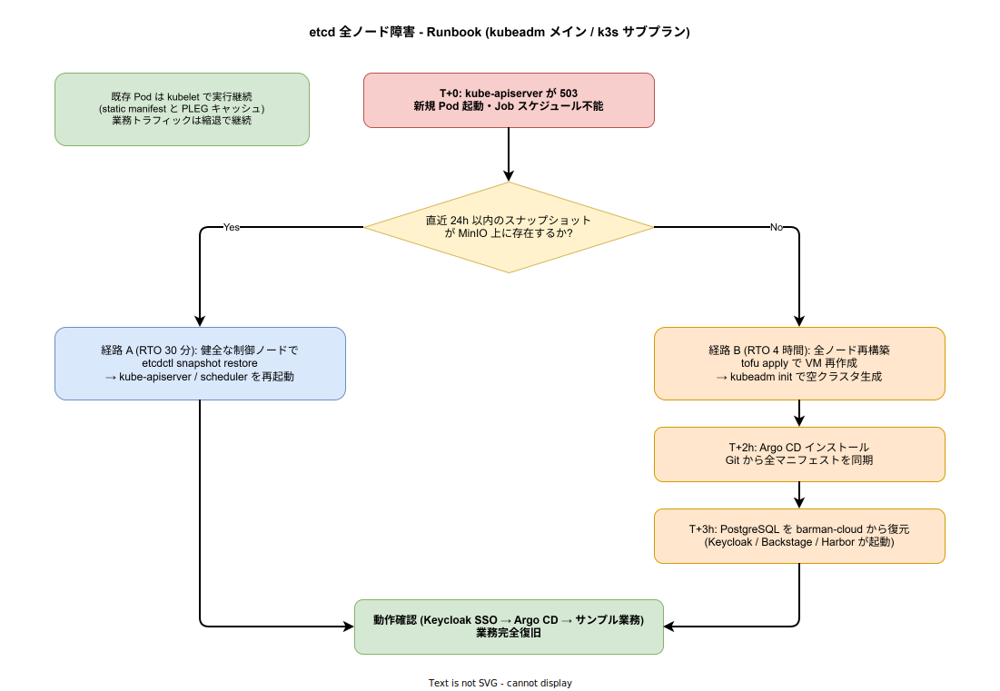

# etcd 全ノード障害シナリオ

## 想定する事象

kubeadm セルフマネージドクラスタの etcd 3 ノード (Control Plane と同居) が、ストレージ破損・ファイルシステム障害・人為的な誤操作 (`etcdctl del --prefix=""` 等) により短時間で全停止する。クォーラム喪失により kube-apiserver が 503 を返す状態を本章の対象とする。1 ノード障害は etcd の Raft プロトコルで自動復旧する ([`../../02_可用性と信頼性/01_障害復旧とバックアップ.md`](../../02_可用性と信頼性/01_障害復旧とバックアップ.md) 4.1 参照) ため、本章の対象外である。

この事象が稟議で問われる理由は、etcd が **k8s クラスタの全状態を保持する単一神経中枢** だからである。「etcd が消えた瞬間にクラスタ全体が即死し、業務が完全停止する」と誤解されることが多い。本章はその誤解を解き、**「etcd 全停止でも既存業務は kubelet で動き続ける」** ことを明示する。

## 業務影響の範囲

etcd 全停止が引き起こす実際の症状は、以下の 2 つに整理できる。

### 即座に止まること

- 新規 Pod の作成・スケジュール (kube-scheduler が etcd に書き込めない)
- 既存 Pod の Pod-level 設定変更 (kubectl edit / apply が反応しない)
- ConfigMap / Secret の更新反映 (kube-apiserver 経由なので不可)
- HorizontalPodAutoscaler によるスケール (Metrics 取得自体は可能だが etcd 書き込み不可)
- Job / CronJob の新規実行
- Service の Endpoint 更新 (kube-proxy が古い情報のまま動作)

### 動き続けること

- **既存 Pod の実行**。kubelet は PLEG (Pod Lifecycle Event Generator) のローカルキャッシュで Pod 状態を把握しており、kube-apiserver と通信できなくても Pod を再起動 (CrashLoopBackOff のリスタート含む) する
- **既存 Pod のネットワーク通信**。CNI (Cilium / Calico) は eBPF / iptables ルールをノード上に書き込み済みで、kube-apiserver なしでも動く
- **Service 内のロードバランス**。kube-proxy が古い Endpoint 情報のまま動作するため、Pod 構成が変わらない限り動き続ける
- **Istio Envoy データプレーン**。istiod から最後に受け取った xDS 設定で動き続ける ([`03_Istio破損.md`](./03_Istio破損.md) 参照)
- **PostgreSQL / Kafka / Valkey 等のステートフルワークロード**。Pod 自体が停止しなければ業務は継続する
- **既存 mTLS 証明書の有効期限内通信**。Istio のワークロード証明書はデフォルト 24h、cert-manager 発行の証明書は 90 日

つまり、etcd 全停止の瞬間に「業務が止まる」のではなく、**「クラスタが凍結する」** が正確な表現である。既存 Pod は動き続け、新規ワークロードの追加・更新ができない状態に陥る。この性質を理解しておくことは重要で、復旧の優先順位を「業務即時復旧」ではなく「Control Plane の整然とした再構築」に置くことができる。

## フェイルセーフ機構

### kubelet PLEG キャッシュによる既存ワークロード継続

上述のとおり、kubelet は kube-apiserver なしでも既存 Pod を継続実行できる。この動作は k8s の標準仕様であり、k1s0 が追加実装する必要はない。**設計上の判断は「ステートフルワークロードを kubelet 継続実行で持ちこたえさせる」ことを期待値として明示する** 点にある。

具体的には、tier1 のクライアントライブラリは「kube-apiserver 死亡時にも kubelet 経由で Pod がメッセージを受信し続ける」ことを前提に縮退戦略を組む。Service Discovery が更新されないため新規 Pod 起動はできないが、既存 Pod 同士の通信は CNI の eBPF / iptables ルールで継続する。これは `08_グレースフルデグラデーション.md` 4.3 のバルクヘッド設計と整合する。

### etcd スナップショットによる短経路復旧

CronJob で日次に `etcdctl snapshot save` を実行し、MinIO に保存している ([`../../02_可用性と信頼性/01_障害復旧とバックアップ.md`](../../02_可用性と信頼性/01_障害復旧とバックアップ.md) 2.2 参照)。スナップショットがあれば、新規 VM 構築なしで etcd だけ巻き戻して kube-apiserver を再起動するだけで Control Plane が復旧する。

この経路 (経路 A) は **RTO 30 分** で完了する。スナップショットが直近 24h 以内であれば、etcd には kube-apiserver の最終状態のみが必要なため、データ損失の影響は「障害後 24h 以内に作成された Job 実行履歴・Event ログの一部」に限定される。業務データそのものは PostgreSQL / Kafka / Valkey に永続化されているため、etcd データ損失は業務継続性に影響しない。

### Git + IaC + Argo CD による完全再構築

スナップショットが破損または存在しない場合 (経路 B)、`tofu apply` で VM 3 台を再構築し、`kubeadm init` で空クラスタを生成、Argo CD をインストールして Git から全マニフェストを同期する。これは `05_障害復旧とバックアップ.md` 4.2 の「クラスタ全壊時の復旧手順」と同一の経路である。

この経路は **RTO 4 時間** だが、復旧後のクラスタは Git 上のマニフェストと完全一致するため、復旧前との差分 (手作業で `kubectl apply` した変更) はすべて失われる。本番運用において手作業の `kubectl apply` を禁止し、すべて Git 経由で適用する規律を維持することで、この経路でも整合性のあるクラスタが復旧できる。

## 復旧 Runbook

復旧は「直近 24h 以内の etcd スナップショットがあるか」で経路が分岐する。

### 経路 A: スナップショットあり (RTO 30 分)

1. **T+0 検知**: kube-apiserver の `/healthz` エンドポイントが 503 を返却。Prometheus Blackbox Exporter が異常を検知し Alertmanager 通知
2. **T+5min**: オペレーターが MinIO 上の最新 etcd スナップショットを確認 (`mc ls minio/k1s0-backups/etcd/`)
3. **T+10min**: 健全な Control Plane ノード 1 台を選定し、`etcdctl snapshot restore` を実行。スナップショットから新しいデータディレクトリを生成
4. **T+15min**: kube-apiserver / kube-controller-manager / kube-scheduler を再起動 (static Pod のため kubelet が自動再起動)
5. **T+25min**: 残り 2 ノードの etcd メンバーを追加し、Raft クォーラムを再構築
6. **T+30min**: `kubectl get nodes` で全ノード Ready を確認、業務動作確認

### 経路 B: スナップショットなし or 破損 (RTO 4 時間)

1. **T+0 検知**: 同上
2. **T+10min**: スナップショット復元を試みるも破損または存在しない判定
3. **T+30min**: `tofu apply -target=module.k8s_control_plane` で Control Plane VM 3 台を再構築
4. **T+1h**: `kubeadm init` で空クラスタを生成、追加 2 ノードを `kubeadm join`
5. **T+2h**: Argo CD をブートストラップインストール、Git リポを登録
6. **T+2h30min**: Argo CD が全マニフェストを順次同期 (Strimzi → CloudNativePG → Keycloak → tier1 → tier2 の順)
7. **T+3h**: PostgreSQL を `barman-cloud restore` で最新 WAL までリストア
8. **T+3h30min**: Keycloak / Backstage / Harbor が PostgreSQL から起動
9. **T+4h**: Keycloak SSO → Argo CD → サンプル業務サービスの動作確認、業務復旧完了

経路 B は手順が長いため、Phase 1 完了時に TechDocs として整備し、起案者以外でも実行できるよう各ステップの正確なコマンドと期待出力を明記する。

## RTO / RPO の根拠

| 指標 | 経路 A | 経路 B | 根拠 |
|---|---|---|---|
| **RTO** | 30 分 | 4 時間 | 経路 A は etcd スナップショット復元 + Control Plane プロセス再起動の積算。経路 B は VM 再構築 (30 分) + k8s 再構築 (1.5 時間) + Argo CD 同期 (1 時間) + PostgreSQL リストア (1 時間) の積算 |
| **RPO (etcd 自体)** | 24 時間 | データ全損 | 日次スナップショット間隔。経路 B は etcd データを失うが業務データには影響しない |
| **RPO (業務データ)** | 数秒 | 数秒 | PostgreSQL の WAL アーカイブが MinIO に継続的に保存されるため、業務データの RPO は etcd 障害と独立 |
| **業務継続率 (障害中)** | 100% (既存ワークロード) | 100% → 0% (経路 B 中の VM 再構築時に既存 Pod も停止) | 経路 A は kubelet 継続実行で業務継続。経路 B は OS 再インストールが入るため既存 Pod も停止 |

経路 A と B の業務継続率の差は重要である。スナップショットの有無で「業務無停止で Control Plane を巻き戻す」か「業務も含めて全停止して再構築する」かが分かれる。スナップショットの取得失敗は Critical アラート対象とし、24h 以内に必ず最新スナップショットが存在する状態を維持する。

## 検証方針

### Litmus による継続検証

| 試験名 | 内容 | 期待される動作 |
|---|---|---|
| `etcd-leader-pod-kill` | etcd リーダーを Pod 削除 | Raft が新リーダーを選出。30 秒以内に kube-apiserver が応答再開 |
| `etcd-quorum-loss` (Phase 3) | etcd Pod 2 台を同時停止 (クォーラム喪失) | kube-apiserver が 503。既存 Pod は動作継続。etcdctl による経路 A 復旧手順を検証 |
| `etcd-data-corrupt` (Phase 3) | 検証クラスタで etcd データを意図的に破壊 | 経路 A の `etcdctl snapshot restore` 手順が機能することを検証 |
| `control-plane-vm-destroy` (Phase 3) | 検証クラスタで Control Plane VM を全停止 | 経路 B の `tofu apply` + `kubeadm init` + Argo CD の全シーケンスを検証。RTO 4 時間以内 |

経路 B の試験は本番影響が大きいため、必ず分離された検証クラスタで実施する。

### バックアップ検証

スナップショットが存在しても破損していれば経路 B に転落する。Phase 2 から月次で「最新スナップショットを別 etcd に restore してデータ整合性を確認する」ジョブを CronJob で自動実行し、結果を Prometheus メトリクスに記録する。失敗時は Critical アラート。

## 関連ドキュメント

- [`00_概要.md`](./00_概要.md) — 壊滅的障害シナリオ全体の俯瞰
- [`../../02_可用性と信頼性/01_障害復旧とバックアップ.md`](../../02_可用性と信頼性/01_障害復旧とバックアップ.md) — etcd バックアップ戦略 (2.2 節) と全壊復旧手順 (4.2 節)
- [`../../02_可用性と信頼性/03_グレースフルデグラデーション.md`](../../02_可用性と信頼性/03_グレースフルデグラデーション.md) — Control Plane 障害時の縮退動作 (4.1 節)
- [`../../01_基礎/03_配置形態.md`](../../01_基礎/03_配置形態.md) — kubeadm セルフマネージド構成
- [`../../../04_技術選定/03_周辺OSS/05_IaC.md`](../../../04_技術選定/03_周辺OSS/05_IaC.md) — OpenTofu による VM 再構築
- [`../../../04_技術選定/03_周辺OSS/02_周辺OSS.md`](../../../04_技術選定/03_周辺OSS/02_周辺OSS.md) — CloudNativePG / barman-cloud / Litmus
