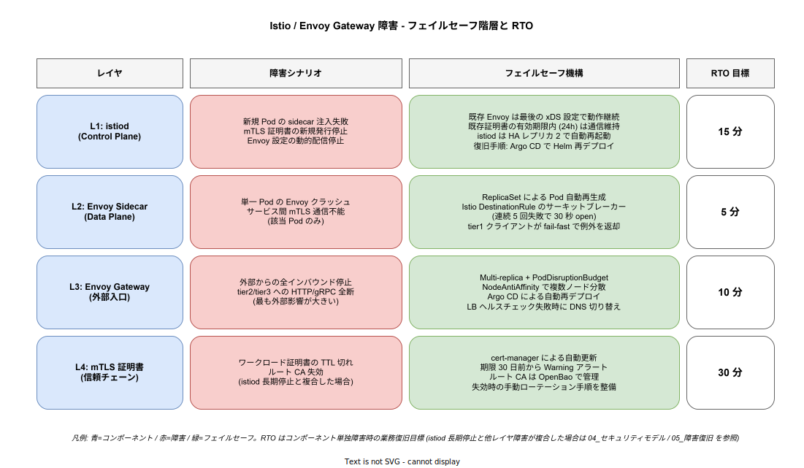

# Istio / Envoy Gateway 破損シナリオ

## 想定する事象

サービスメッシュとして採用している Istio (Control Plane: istiod / Data Plane: Envoy Sidecar) と、外部入口の Envoy Gateway が、設定ミス・バージョンアップ失敗・証明書失効・Pod 全停止のいずれかで破損する。本章は単一原因による障害ではなく、**4 つのレイヤごとに「何が起きたら何が止まるのか」「何分の猶予があるのか」「どう復旧するのか」** を整理する。

この事象が稟議で問われる理由は、Istio が **「設定が複雑で運用負荷が高い」** という業界的な評判を持つからである。「Istio を導入した瞬間にメッシュ自体が単一障害点になり、業務が常に止まるリスクを抱える」という懸念に対し、本章は **「データプレーン (Envoy) は Control Plane 障害でも動き続ける xDS アーキテクチャである」** ことを根拠に反論する。

## 業務影響の範囲とレイヤ分割

Istio / Envoy Gateway の障害は、影響範囲と猶予時間が大きく異なる 4 つのレイヤに分解できる。一律に「Istio が落ちた」と扱うのは設計を誤らせる。

### L1: istiod (Control Plane) 障害

istiod は Envoy への xDS (Discovery Service) 配信、mTLS 証明書発行、Sidecar 自動注入を担う。istiod が倒れた場合、**「新規」のイベントが全て止まる** が、**既存の通信は継続する**。

- 新規 Pod の sidecar 注入失敗 (Mutating Webhook が応答しない)
- Envoy への新規 xDS 設定配信停止 (新規 VirtualService / DestinationRule が反映されない)
- ワークロード mTLS 証明書の新規発行停止

しかし既存 Envoy は **最後に受信した xDS 設定で動き続ける**。これは Envoy の設計上の標準動作であり、k1s0 が追加実装する必要はない。既存証明書の有効期限内 (デフォルト 24h) は通信が継続する。

istiod は HA レプリカ 2 で稼働させるため、単一 Pod 障害は ReplicaSet が自動復旧する。両 Pod 同時障害でも上述の通り猶予 24h があるため、Argo CD で Helm 再デプロイすれば 15 分で復旧できる。

### L2: Envoy Sidecar (Data Plane) 障害

個別 Pod の Envoy Sidecar が異常終了する。影響は **その Pod 1 つだけ** に閉じる。サービス間 mTLS 通信が該当 Pod のみ不能となる。

ReplicaSet が Pod 全体を再生成し、新 Pod の Sidecar が istiod から最新の xDS 設定を受信して稼働する。Istio DestinationRule のサーキットブレーカー (連続 5 回失敗で 30 秒 open) が他 Pod への雪崩を防ぐ。tier1 クライアントライブラリは fail-fast で `K1s0ServiceUnavailableException` を返却し、呼び出し元が業務要件に応じた縮退に分岐する (`08_グレースフルデグラデーション.md` 2.3 参照)。

全 Sidecar 一斉障害は istiod 障害と同義であり、L1 の対応に集約される。L2 単独の障害は ReplicaSet の自動復旧 (5 分) で完了する。

### L3: Envoy Gateway (外部入口) 障害

Envoy Gateway が外部からの全インバウンドを処理する。ここが倒れると、**外部からのアクセスが全て停止** する。tier2/tier3 への HTTP/gRPC トラフィック全断となり、最も外部影響が大きいレイヤである。

フェイルセーフは「障害を起こさないこと」を最優先に設計する。

- Multi-replica (3 Pod 以上) で水平冗長化
- PodDisruptionBudget で同時停止可能数を 1 に制限
- NodeAntiAffinity で複数ノードに分散配置
- 外部 LB のヘルスチェックで失敗 Pod を即座に切り離し
- 完全停止時は Argo CD による自動再デプロイ + DNS 切り替え (LB ヘルスチェック失敗を契機に)

これにより RTO 10 分以内を目標とする。ただし、内部のサービス間通信 (Sidecar 経由) は L3 障害の影響を受けないため、外部公開していない業務処理は継続する。

### L4: mTLS 証明書 (信頼チェーン) の失効

Istio のワークロード証明書 TTL (デフォルト 24h) を超えると、サービス間 mTLS が機能しなくなる。これは L1 (istiod) が長時間倒れたままだった場合に複合的に発生するシナリオである。

- ワークロード証明書: istiod が継続的に発行・更新するため、istiod が 24h 以内に復旧すれば問題なし
- ルート CA: cert-manager が自動更新。期限 30 日前から Warning アラート。ルート CA は OpenBao で管理し、失効時の手動ローテーション手順を整備
- Envoy Gateway 用の TLS 証明書 (外部 HTTPS): cert-manager + Let's Encrypt または社内 PKI

L4 単独の障害 (cert-manager 故障による証明書未更新) は、cert-manager が `cert-manager.io/v1` の Certificate リソースを継続監視するため、Operator 自体の障害さえなければ自動更新される。Operator 障害は L1 と同じ Argo CD 再デプロイで復旧する。

## フェイルセーフ機構

### 階層化の設計判断

Istio の障害を 4 レイヤに分解した理由は、**「最悪ケースの全体停止」を避け、「レイヤごとの独立復旧」を可能にする** ためである。istiod 障害でも Envoy が動き、Envoy Gateway 障害でも内部通信が動き、証明書失効までは数時間〜数日の猶予がある。これらを混同して扱うと「Istio = 単一障害点」という誤った評価につながる。

### 「設定変更の即時反映」を捨てる選択

istiod 障害時に新規 VirtualService / DestinationRule の反映が止まることは、**設計上許容する** 判断を取る。「常に最新設定が即座に反映されないと業務が回らない」というユースケースは、k1s0 のターゲット (JTC 情シス部門) では稀であり、設定変更のロールアウトは Argo CD 経由で計画的に行うことを前提としている。

これにより、istiod の HA を 2 レプリカ程度で十分とし、3 レプリカ以上の冗長性に投資する必要がなくなる。リソース効率と運用シンプルさを優先する判断である。

### 既存接続のドレイン

L3 (Envoy Gateway) で Pod を入れ替える際、`preStop` フックで `sleep 30` を入れ、SIGTERM 受信から 30 秒間は新規接続を受け付けず既存接続を完了させるドレイン処理を実装する。これは Istio / Envoy Gateway 共通のベストプラクティスであり、Helm Chart のデフォルト設定として組み込む。

## 復旧 Runbook

### L1: istiod 障害復旧

1. **T+0 検知**: istiod の `/ready` エンドポイントが 503 / Pod が CrashLoopBackOff
2. **T+1min**: ReplicaSet が自動再起動を試行
3. **T+5min**: 自動復旧失敗を検知 (連続 3 回 CrashLoopBackOff)。オペレーター介入
4. **T+10min**: Argo CD で istiod Helm Chart を再デプロイ。Git 上の最新マニフェストから完全再構築
5. **T+15min**: istiod が xDS 配信を再開、新規 Pod の sidecar 注入が再開。復旧完了

この間、既存 Envoy は最後の xDS で動作継続するため、業務影響は新規 Pod 起動と新規証明書発行のみに限定される。

### L2: Envoy Sidecar 障害復旧

ReplicaSet による自動復旧。手動介入は不要。発生頻度が高い場合 (週次で複数回) は Sidecar の `proxyMetadata` 設定や Envoy バージョンの問題を調査する。

### L3: Envoy Gateway 障害復旧

1. **T+0 検知**: 外部 LB のヘルスチェックが 100% 失敗 / Prometheus が `envoy_gateway_request_total{status_code="5xx"}` の急上昇を検知
2. **T+1min**: 外部 LB が異常 Pod を切り離し、健全 Pod にトラフィックを集中
3. **T+5min**: 全 Pod 異常の場合、Argo CD で Envoy Gateway Helm Chart を再デプロイ
4. **T+10min**: 復旧完了

### L4: mTLS 証明書失効復旧

1. **T+0 検知**: ワークロード間通信のエラー率急上昇 / cert-manager の `Certificate` リソースが `Ready=False`
2. **T+5min**: cert-manager の `kubectl describe certificate` でエラー原因を特定
3. **T+15min**: 原因が cert-manager 自体の障害であれば Argo CD で再デプロイ。原因がルート CA 失効であれば OpenBao からの手動ローテーション手順を実施
4. **T+30min**: 全証明書が `Ready=True` になり、復旧完了

ルート CA 失効は事前のアラート (期限 30 日前) で防ぐ設計のため、本シナリオの実発生頻度は極めて低い。

## RTO / RPO の根拠

| レイヤ | RTO | 根拠 |
|---|---|---|
| L1: istiod | 15 分 | Argo CD による Helm Chart 再デプロイの所要時間。既存 Envoy が動作継続するため、業務影響は新規 Pod 起動のみ |
| L2: Envoy Sidecar | 5 分 | ReplicaSet 自動復旧の標準的な所要時間 (Pod 削除 → 新 Pod 起動 → Readiness probe 成功) |
| L3: Envoy Gateway | 10 分 | LB ヘルスチェックによる切り離し (1 分) + Argo CD 再デプロイ (5 分) + Readiness 確認 (4 分) の積算 |
| L4: mTLS 証明書 | 30 分 | cert-manager 障害復旧 (Argo CD 再デプロイ 15 分) + 全証明書再発行・配布 (15 分) の積算 |

RPO はすべて 0 である。Istio / Envoy はステートフルではなく、設定はすべて k8s リソース (Git 管理) として保持されるため、データ損失の概念がない。

## 検証方針

### Litmus による継続検証

| 試験名 | 対象レイヤ | 内容 | 期待される動作 |
|---|---|---|---|
| `istiod-pod-kill` | L1 | istiod Pod を 1 台削除 | HA レプリカで業務影響なし。30 秒以内に新 Pod 起動 |
| `istiod-all-pod-kill` | L1 | istiod 全 Pod を削除 | 既存 Envoy が動作継続。新規 sidecar 注入が一時停止するのみ。Argo CD 再デプロイで復旧 |
| `envoy-sidecar-pod-kill` | L2 | ランダム Pod の Sidecar を停止 | サーキットブレーカーが発動。tier1 が fail-fast 例外。ReplicaSet で 5 分以内に復旧 |
| `envoy-gateway-pod-kill` | L3 | Envoy Gateway 1 Pod を削除 | LB ヘルスチェックで切り離し、他 Pod に集中。業務影響なし |
| `envoy-gateway-all-pod-kill` | L3 | Envoy Gateway 全 Pod を削除 | 外部入口が一時停止。Argo CD 再デプロイで 10 分以内に復旧 |
| `cert-manager-pod-kill` | L4 | cert-manager Pod を停止 | 既存証明書は有効期限内継続。新規発行・更新が一時停止 |

これらの試験を Phase 2 以降、週次の CronChaosEngine で自動実行する。

### 復旧訓練

Phase 2 から半期に 1 回、検証環境で本章の各 Runbook を実施し、所要時間と詰まりポイントを TechDocs に記録する。

## 関連ドキュメント

- [`00_概要.md`](./00_概要.md) — 壊滅的障害シナリオ全体の俯瞰
- [`../04_セキュリティモデル.md`](../04_セキュリティモデル.md) — Istio mTLS による Zero Trust 設計
- [`../08_グレースフルデグラデーション.md`](../08_グレースフルデグラデーション.md) — Istio Control Plane 障害時の縮退動作 (4.1 節)
- [`../14_脅威モデル詳細.md`](../14_脅威モデル詳細.md) — 信頼境界と脅威分析
- [`../../04_技術選定/01_実行基盤中核OSS.md`](../../04_技術選定/01_実行基盤中核OSS.md) — Istio / Envoy Gateway 採用根拠
- [`../../04_技術選定/02_周辺OSS.md`](../../04_技術選定/02_周辺OSS.md) — cert-manager / Litmus
- [`../../04_技術選定/08_シークレット管理.md`](../../04_技術選定/08_シークレット管理.md) — OpenBao によるルート CA 管理
