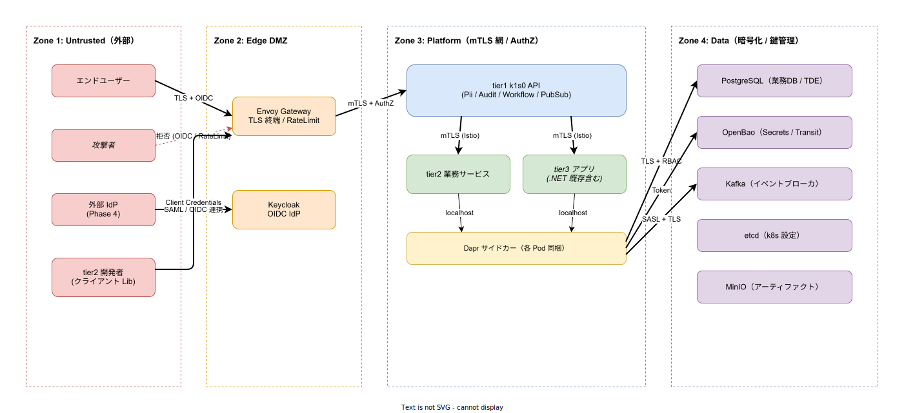

# 脅威モデル詳細

## 目的

本ファイルは、[`04_セキュリティモデル.md`](../03_セキュリティ/01_セキュリティモデル.md) で示した STRIDE 概観を、**信頼境界の定義**と**主要データフロー単位での脅威列挙**まで掘り下げて詳述する章である。k1s0 は AGPL ライセンスの OSS を 6 本採用しており（Keycloak / OpenBao / Harbor / Istio / Kafka / ZEN Engine。詳細は [`../../09_法務とコンプライアンス/00_OSS法務対応.md`](../../09_法務とコンプライアンス/00_OSS法務対応.md)）、稟議を通す相手が「最悪系のシナリオ」を想定していることを前提に、攻撃者視点での記述を意図的に盛り込んでいる。

概観章が「何を守るか」を語るのに対し、本章は「**どこを越境する時に何を検証するか**」と「**どのデータの流れに何の脅威が潜むか**」を語る。稟議の場で法務・情報システム・経営が必ず問う 3 つの質問 — "信頼境界はどこですか" / "データ資産ごとの漏洩シナリオは？" / "緩和できない残余リスクは？" — に対し、紙で即答できる水準に引き上げるのが本章の責務である。

---

## 1. 信頼境界の定義

k1s0 は 4 つの信頼ゾーンに分割される。ゾーン境界は物理ネットワークではなく、**越境時に行う検証**によって定義する。外から内へ進むほど信頼度が上がるのではなく、**越境ごとに異なる種類の検証を重ねる多層防御**として機能する。

### 1.1 各ゾーンの性格

**Zone 1（Untrusted）** は外部空間である。エンドユーザー・tier2 開発者・外部 IdP・攻撃者が同居しており、ネットワーク的な正当性は一切仮定できない。ここから内側に届く通信は全て認証・認可・レート制限の対象となる。tier2 開発者がこのゾーンに属する理由は、クライアントライブラリがビルド時に取り込まれた後は他社環境から k1s0 API を叩くため、発行元のサービスアカウント以外の信頼情報を保持しないためである。

**Zone 2（Edge DMZ）** は Envoy Gateway と Keycloak の同居領域である。ここは「Zone 1 から届いた通信を Zone 3 に渡す前に、プラットフォームの約束事に合致するか検証する場所」であり、仮にこのゾーンが侵害されても Zone 3 への昇格は mTLS と AuthorizationPolicy で阻まれる設計を取る。

**Zone 3（Platform Trust Zone）** は tier1/tier2/tier3 が動作する Service Mesh 内部である。全 Pod 間は Istio mTLS で暗号化され、ServiceAccount 単位の認可が適用される。注意すべき点は、**tier3 に .NET レガシーが共存する場合はこのゾーン内でも信頼粒度が均一ではない**ことである（詳細は [`15_レガシー共存パターン.md`](../05_接続と共存/02_レガシー共存パターン.md) を参照）。レガシー由来の脆弱性が Zone 3 内側から発火するシナリオは、後段の DF6 で詳述する。

**Zone 4（Data Plane）** は PostgreSQL・OpenBao・Kafka・etcd・MinIO といった状態保持層である。保存時暗号化・最小権限 DB ロール・OpenBao 動的シークレットによる「盗まれても復号できない・最長でも短期で失効する」前提を敷く。

### 1.2 境界越境時に行う検証

各境界を越える際に**何を検証するか**を以下に列挙する。これは「越境時に 1 つでも省略するとゾーン分割の意味が崩壊する」最低ラインとして扱う。

- **Zone 1 → Zone 2**: TLS 終端（cert-manager が発行）／ OIDC トークン検証（Keycloak 発行、JWT 署名検証）／ Rate Limit（Envoy Gateway の Local RateLimit）／ 将来的に WAF ルール（Phase 3 以降）。
- **Zone 2 → Zone 3**: Istio mTLS 確立（証明書は Istio CA 管理）／ AuthorizationPolicy（送信元 ServiceAccount のホワイトリスト）／ k8s NetworkPolicy（L3/L4 の deny by default）。
- **Zone 3 内部（tier 間）**: tier 依存ルール（tier3 → tier2 → tier1 → infra の一方向）／ tier3 から tier1 への直接アクセスは tier2 未経由時に限定して許可。
- **Zone 3 → Zone 4**: 最小権限 DB ロール（tier2 は自 namespace の DB のみ）／ OpenBao Transit Engine による暗号化／復号委譲／ PostgreSQL TDE・etcd EncryptionConfiguration による保存時暗号化。

---

## 2. 主要データフロー別の脅威列挙

ここからは、攻撃者が価値を得られる可能性の高い 5 本のデータフローを取り上げ、STRIDE カテゴリごとに脅威と対処を記述する。全フローを網羅することは本章の目的ではない（それは個別サービス設計ドキュメントの責務）。**「稟議で最悪系を問われた時に紙で答えられる水準」を目標とする**。

### DF1: 外部クライアント → Envoy Gateway → tier1 API

エンドユーザー／tier2 開発者が k1s0 の公開 API を呼び出す最短経路である。OIDC トークンを持って Envoy に到達し、tier1 API の該当エンドポイントに転送される。攻撃者にとって最も価値のあるフローであり、全 STRIDE カテゴリが現実的な脅威となる。

- **Spoofing**: 盗難済みアクセストークンによる正規ユーザー成りすまし。対処は Keycloak の短寿命アクセストークン（デフォルト 5 分）+ リフレッシュトークンローテーション。Phase 3 で MFA と条件付きアクセスポリシーを追加。
- **Tampering**: リクエストボディの改ざん（中間プロキシ / マルウェア）。対処は Zone 1 → 2 間の TLS 終端までは完全暗号化。tier1 API 側で Protobuf スキーマ検証（buf validate）を実施し、形式不正は即拒否。
- **Repudiation**: API 操作の否認。対処は tier1 Audit による全 API 呼び出しのハッシュチェーン記録。Keycloak の認証イベントログと相互照合可能。
- **Information Disclosure**: 応答ペイロードから PII 漏洩。対処は tier1 Pii API のマスキング経由を必須化（コードレビューと API Gateway ポリシーで強制）。
- **Denial of Service**: API 過負荷攻撃。対処は Envoy Gateway の Local RateLimit（テナント別・ユーザー別）+ Istio Circuit Breaker。Phase 2 で Global RateLimit（Redis バックエンド）を追加。
- **Elevation of Privilege**: 認可ロジックの欠陥を突いた権限昇格。対処は OPA / Istio AuthorizationPolicy を tier1 API 単位で適用、権限境界の静的検証を CI に組み込む（Phase 2）。

### DF2: tier1 API → OpenBao / PostgreSQL（秘匿 + 業務データアクセス）

tier1 が OpenBao から動的シークレットを取得し、それを用いて PostgreSQL に接続するフローである。ここの侵害は「**鍵管理の全滅**」に直結するため、特に Spoofing と Information Disclosure が致命傷となる。

- **Spoofing**: 偽の OpenBao トークンによる秘匿データ取得。対処は Dapr Secret Store → OpenBao の間を ServiceAccount token（k8s SA JWT）で認証し、OpenBao Auth Method を k8s に固定。人間のログインは MFA 必須。
- **Tampering**: OpenBao 内のシークレット改ざん。対処は OpenBao の監査ログ（全操作が syslog / file 出力）+ ハッシュチェーンの二重化。ログ書き込み失敗時は操作自体を失敗させる。
- **Information Disclosure**: PostgreSQL バックアップ経由の業務データ漏洩。対処は Velero スナップショットの暗号化（KMS 鍵で）+ バックアップストレージへのアクセス分離。OpenBao 自体のシール状態監視。
- **Denial of Service**: OpenBao 落ちによる全 tier1 API 停止（クリティカルパス）。対処は HA 構成（Raft 3 ノード）+ Auto-unseal（Phase 3 で AWS KMS / Azure Key Vault と連携）+ Dapr Secret Store 側のキャッシュ TTL 設計。
- **Elevation of Privilege**: OpenBao の Root Token 流出による全シークレット奪取。対処は Root Token を封印（Unseal Key 分散）し、通常運用では Short-lived Periodic Token のみ使用。Root 利用は監査イベント必須。

### DF3: tier1 Audit → PostgreSQL（監査ログ書き込み）

監査ログは「事後追跡の根拠」であり、攻撃者にとって最も隠蔽したいデータである。Repudiation と Tampering に集中して対処する。

- **Tampering**: ログの事後改ざん。対処はハッシュチェーン（前ログの SHA-256 を次ログに含める）+ 定期的な外部ストレージ（MinIO WORM モード、Phase 2）への write-only コピー。
- **Repudiation**: 攻撃者が自分の操作ログを削除。対処は PostgreSQL の該当テーブルに DELETE 権限を付与しない（INSERT only ロール）。集約クエリ専用の読み取りロールは別途発行。
- **Denial of Service**: ログ書き込み側への攻撃で監査を停止させ、その間に侵入。対処は書き込み非同期化 + キュー詰まり時のフェイルクローズ（書けなければ API 側で操作を失敗させる）。Phase 3 で対応。

### DF4: tier2 / tier3 → Dapr サイドカー → バックエンド（Pub/Sub / State / Binding）

Dapr サイドカー経由でバックエンド（Kafka / PostgreSQL / OpenBao）を叩くフローである。tier1 隠蔽の中核であり、**サイドカーの侵害 = 同 Pod の業務ロジックの侵害**である点に注意。

- **Tampering**: Dapr Component 設定（YAML）の改ざんで接続先を攻撃者の偽バックエンドに差し替え。対処は GitOps（Argo CD）経由の変更のみ許可し、kubectl apply を禁止する Kyverno ポリシー。
- **Information Disclosure**: Dapr サイドカーのログに秘匿値が漏れる（デバッグログレベル運用）。対処は Dapr のログレベルを本番で info 固定し、Debug を禁止する Kyverno ポリシー。
- **Elevation of Privilege**: Pod 内部から Dapr Control API を叩いて他サービスを呼び出す（ネットワーク分離迂回）。対処は Dapr の access control policy（mTLS 前提 + action 単位の allowlist）を全 Component に適用。

### DF5: CI/CD → Harbor → k8s（イメージ配信パイプライン）

サプライチェーン攻撃の中核である。[`04_セキュリティモデル.md`](../03_セキュリティ/01_セキュリティモデル.md) §7 と重複するが、脅威視点での再整理を行う。

- **Tampering**: ビルド成果物の改ざん。対処は Phase 2 で Cosign 署名 + Kyverno 未署名拒否を必須化。
- **Information Disclosure**: Harbor 内の プライベートイメージ漏洩。対処は Harbor プロジェクト単位の RBAC + OIDC 認証（Keycloak 経由）。
- **Elevation of Privilege**: ビルドパイプライン（GitHub Actions）からの横展開。対処は OIDC Federation でパイプラインから k8s への認証を短期トークン化し、長期クレデンシャルを保管しない。

---

## 3. AGPL 6 本を抱える前提での脅威上の配慮

[`../../09_法務とコンプライアンス/00_OSS法務対応.md`](../../09_法務とコンプライアンス/00_OSS法務対応.md) で列挙している AGPL の 6 本（Keycloak / OpenBao / Harbor / Istio / Kafka / ZEN Engine）は、**いずれもセキュリティ上クリティカルな位置に置かれている**。攻撃者視点では、これらの脆弱性公表から修正パッチ適用までのウィンドウが最も狙われる期間である。したがって本章の脅威列挙に加え、運用上は以下を徹底する。

- **CVE 即応プロセス**: これら 6 本の CVE 公表から 48 時間以内にパッチ適用判定を行う。判定窓口はセキュリティチームとし、Phase 2 までに SLA 化する。
- **ライセンス改変の追跡**: AGPL 条項が将来変更された場合（BSL 化など）、差し替え先の事前評価を [`../../04_技術選定/17_OSS長期戦略.md`](../../04_技術選定/17_OSS長期戦略.md) と連動して維持する。
- **監査証跡の最上流**: Keycloak / OpenBao / Harbor のイベントログは、これら自身が改ざんされる前提で**外部 WORM ストレージに write-only レプリケート**する（Phase 3）。

---

## 4. 残余リスク（緩和不能領域）

完全に排除できない脅威を明示することは、稟議の誠実性のために必須である。以下は本設計で**残余リスクとして受容する**ものであり、運用上の監視でカバーする方針を取る。

- **Zone 2 の Envoy Gateway が 0-day を踏んだ場合の影響**: mTLS で Zone 3 への直接昇格は阻めるが、認証済みユーザーのリクエストに偽の応答を返す Man-in-the-Middle は完全排除できない。対処は Envoy の脆弱性監視と Phase 3 でのマルチリージョン Envoy（片系降格）。
- **OpenBao の暗号鍵派生アルゴリズムの将来的陳腐化**: 量子コンピューティング進展に伴う非対称鍵の危殆化。対処は Phase 4 以降の耐量子暗号（PQC）対応ロードマップを [`12_SLOとエラーバジェット.md`](../02_可用性と信頼性/05_SLOとエラーバジェット.md) と並行して管理。
- **.NET レガシー起点の Zone 3 内部侵害**: tier3 に残るレガシー資産は CVE 対応が遅れる傾向があり、Zone 3 内部からの横展開リスクを抱える。対処は [`15_レガシー共存パターン.md`](../05_接続と共存/02_レガシー共存パターン.md) の「段階的リライト」パターンで削減。当面は Istio AuthorizationPolicy による tier3 アウトバウンドの最小化で封じ込める。
- **内部犯行（管理者権限を持つ者による不正）**: 技術対策では完全排除不能。対処は監査ログの多重化（tier1 Audit + Keycloak イベント + PostgreSQL 監査拡張）と職務分離（本番 apply と承認者の分離）。

---

## 関連ドキュメント

- [`04_セキュリティモデル.md`](../03_セキュリティ/01_セキュリティモデル.md) — 本章の親ドキュメント（STRIDE 概観）
- [`02_依存ルールと通信経路.md`](../01_基礎/02_依存ルールと通信経路.md) — ゾーン間の通信経路
- [`03_配置形態.md`](../01_基礎/03_配置形態.md) — namespace 配置（ゾーン実装）
- [`15_レガシー共存パターン.md`](../05_接続と共存/02_レガシー共存パターン.md) — tier3 レガシーに由来する脅威の緩和
- [`../../04_技術選定/08_シークレット管理.md`](../../04_技術選定/08_シークレット管理.md) — OpenBao の採用根拠
- [`../../04_技術選定/17_OSS長期戦略.md`](../../04_技術選定/17_OSS長期戦略.md) — AGPL リスクと差し替えシナリオ
- [`../../09_法務とコンプライアンス/00_OSS法務対応.md`](../../09_法務とコンプライアンス/00_OSS法務対応.md) — AGPL 6 本の利用形態
