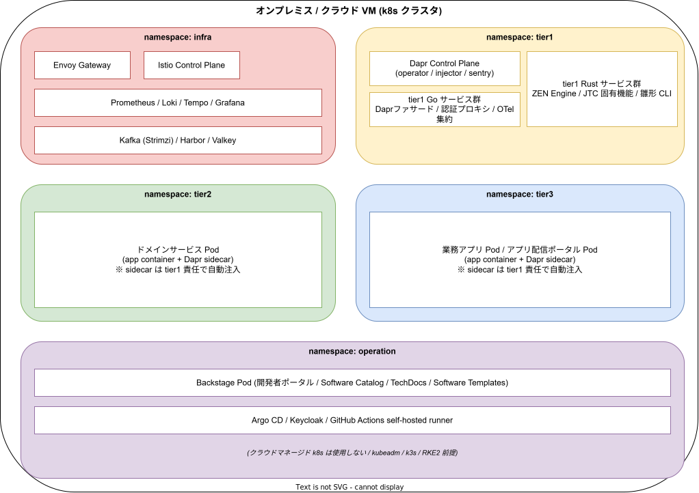

# 配置形態

## 目的

k1s0 の各レイヤが k8s クラスタ上でどの namespace にどのように配置されるかを整理する。各レイヤの責務は [`01_レイヤ構成と責務.md`](./01_レイヤ構成と責務.md) を参照。

---

## 1. namespace 配置

### namespace 一覧

| namespace | 配置するもの |
|---|---|
| `infra` | Envoy Gateway / Istio Control Plane / Prometheus / Loki / Jaeger / Grafana / OTel Collector (DaemonSet) / Kafka (Strimzi) / Harbor / Valkey / CloudNativePG + PostgreSQL / PgBouncer (CloudNativePG Pooler) / Kyverno / cert-manager / MinIO / Longhorn / OpenBao / MetalLB |
| `tier1` | Dapr Control Plane (operator / sidecar-injector / sentry) / tier1 Go サービス群 / tier1 Rust サービス群 |
| `tier2` | ドメインサービスの Pod (app container + Dapr sidecar) |
| `tier3` | 業務アプリ / アプリ配信ポータルの Pod (app container + Dapr sidecar) |
| `operation` | Backstage / Argo CD / Keycloak / GitHub Actions self-hosted runner / Renovate (GHA runner 内で実行) / Argo Events (Phase 2) |

Dapr sidecar の注入は tier2 / tier3 の Pod で発生するが、**管理責任は tier1 チームにある**。開発者が Dapr annotation を手書きすることは想定しない (雛形生成 CLI が自動付与する)。

---

## 2. 実行基盤の前提

| 項目 | 方針 |
|---|---|
| k8s 実装 | セルフマ��ージド (`kubeadm` がメインプラン、`k3s` がサブプラン) |
| クラウドマネージド k8s (EKS / AKS / GKE) | 採用しない |
| 実行環境 | オンプレミスまたは VM (VMware / クラウド VM) |
| Control Plane VIP | kube-vip (static Pod)。API Server の高可用性 VIP を提供 |
| ベアメタル LB | MetalLB (L2 モード)。Service type=LoadBalancer を実現 |
| ネットワーク | 閉域ネットワーク想定 (外部 CDN / SaaS API に依存しない) |
| ストレージ | Longhorn (CNCF Incubating)。3 ノ��ドレプリケーションでデータ保護。CloudNativePG / MinIO の PV ��管理。kubeadm / k3s いずれの構成でも動作 |

クラウドマネージドを採用しない理由は「稟議のハードルを下げる」「ベンダーロックイン回避」という k1s0 のコア原則に由来する。詳細は [`../01_背景と目的/02_解決する価値.md`](../01_背景と目的/02_解決する価値.md) を参照。

---

## 3. Dapr の配置形態

| 要素 | 配置 |
|---|---|
| Dapr Control Plane | `tier1` namespace (operator / sidecar-injector / sentry / placement) |
| Dapr sidecar | tier2 / tier3 Pod 内に自動注入 (sidecar 方式が標準) |
| Dapr Shared (将来検討) | `tier1` namespace に DaemonSet または Deployment で配置 |

MVP はサイドカー方式で開始する。リソース消費が問題となった時点で Dapr Shared (DaemonSet / Deployment モード) への切替を検討する。この切替は tier1 チーム内の判断で完結し、tier2 / tier3 への影響はない。

---

## 4. ネットワーク境界と通信

### 4.1 外部 → クラスタ

- MetalLB (L2 モード) が Service type=LoadBalancer に VIP を払い出す
- Envoy Gateway が k8s Gateway API 経由で外部トラフィックを受ける (MetalLB の VIP を割り当て)
- TLS 終端は Envoy Gateway が担当
- クライアント認証は OIDC (Keycloak) を ext_authz サーバー経由で利用

### 4.2 クラスタ内通信

- tier2 / tier3 の Pod 間通信は Istio サイドカー経由 (mTLS)
- tier1 内部の Go ↔ Rust サービス間通信は Protobuf gRPC が必須
- Dapr building block への呼び出しは tier1 Go ファサードがサイドカーに投げる

### 4.3 テレメトリ経路

- 各 Pod は OTel SDK 経由で OTel Collector Agent (同一ノードの DaemonSet) に OTLP で送信
- OTel Collector が Prometheus / Loki / Jaeger にテレメトリを転送
- バックエンド追加・変更時にサービス Pod の再デプロイは不要

### 4.4 monitoring サブネット

- Prometheus / Loki / Jaeger / Grafana / OTel Collector は `infra` namespace に配置
- `operation` namespace の Backstage からはサービスアカウント経由で参照
- ポータルへのアクセスは Envoy Gateway 経由の OIDC SSO で統一

---

## 5. セキュリティ境界

| 境界 | 実装 |
|---|---|
| Pod 間 mTLS | Istio が自動付与 |
| TLS 証明書管理 | cert-manager が Envoy Gateway / Harbor / Keycloak 等の証明書を自動発行・更新 |
| 秘密情報 | `k1s0.Secrets` 経由 (内部は Dapr Secrets Component → OpenBao)。動的シークレット / 自動ローテーション / 全アクセス監査 |
| Pod 権限 | Kyverno ClusterPolicy (PSS Restricted 相当 + k1s0 固有ルール) |
| イメージ制御 | Kyverno ポリシーで Harbor レジストリ以外からの pull を拒否 |
| イメージ署名 | Cosign (Phase 2) + Kyverno 未署名拒否 |

MVP-1a で cert-manager / MetalLB / kube-vip / OTel Collector を導入し、TLS 証明書の自動管理・ベアメタル LB・Control Plane HA VIP・テレメトリパイプラインを確立する。MVP-1b で Kyverno を導入し Pod セキュリティとイメージ制御を Admission レベルで強制する。Phase 2 で Cosign 署名検証ポリシーを追加する。

---

## 6. 非採用の方式と理由

| 非採用方式 | 理由 |
|---|---|
| EKS / AKS / GKE | クラウドマネージド依存 + 閉域ネットワークと整合しない |
| サーバレス (Cloud Run / Lambda) | オンプレ前提に反する |
| 独自 runtime (Cloud Foundry 系) | k8s エコシステムから離れる + 将来の移行余地が狭い |
| シングルノード k8s (開発用以外) | HA 要件を満たせない |

---

## 関連ドキュメント

- [`00_概念アーキテクチャ.md`](./00_概念アーキテクチャ.md) — 全体俯瞰
- [`01_レイヤ構成と責務.md`](./01_レイヤ構成と責務.md) — 各レイヤの責務
- [`02_依存ルールと通信経路.md`](./02_依存ルールと通信経路.md) — レイヤ間の制約と通信フロー
- [`../04_技術選定/01_実行基盤中核OSS.md`](../04_技術選定/01_実行基盤中核OSS.md) — 採用 OSS の選定根拠
- [`../04_技術選定/09_ネットワークとテレメトリ基盤.md`](../04_技術選定/09_ネットワークとテレメトリ基盤.md) — MetalLB / kube-vip / OTel Collector の選定根拠
