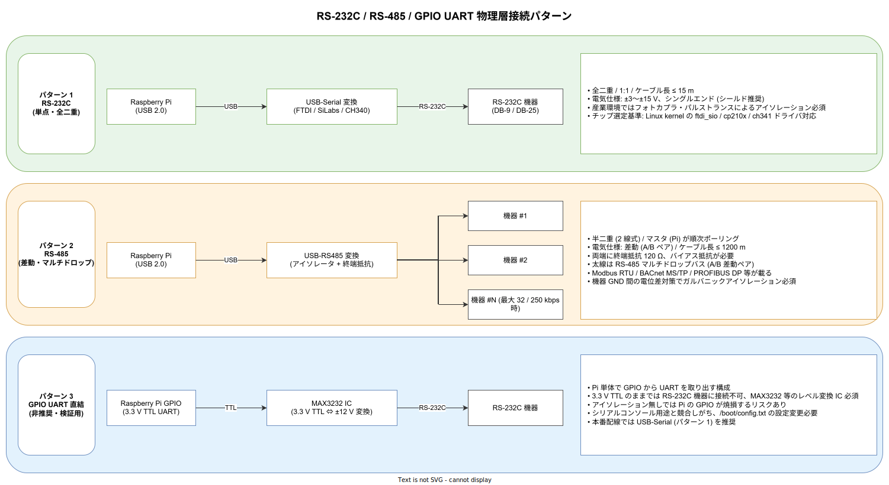

# 物理層とハードウェア選定

## 目的

ラズパイで RS-232C 機器を収容するにあたり、物理層 (電気仕様・配線・アイソレーション)、Raspberry Pi 本体の産業利用上の制約、代替ボードの選択肢、USB-Serial チップの選定、電源計算、EMC 対策までを整理する。ソフトウェア層は [`02_エッジソフトウェアと通信設計.md`](./02_エッジソフトウェアと通信設計.md)、セキュリティは [`03_セキュリティと認証.md`](./03_セキュリティと認証.md)、定量モデルは [`07_定量モデル.md`](./07_定量モデル.md) を参照。

---

## 1. 物理層の 3 パターン

現場で想定される物理層は RS-232C、RS-485 (場合により RS-422)、そして Pi の GPIO UART 直結の 3 パターンがある。工場・プラントの計測機器では実際には RS-485 (Modbus RTU) が主流で、旧型機器や実験系で RS-232C が残っているケースが多い。ユーザー機器の実機型番が分かった時点で本書を改訂する前提で、各パターンの注意点を下図と以降の節にまとめる。



### 1.1 RS-232C (パターン 1)

RS-232C は全二重・シングルエンド・1 対 1 の物理層で、1962 年に制定された古い規格 (TIA-232-F / EIA-232-E)。現代の産業機器でも残っている理由は「既存資産の保守が続いている」ことに尽き、新規導入で選ぶべき物理層ではない。信号電圧は ±3〜±15 V、実装上は ±12 V が多い。論理 0 (SPACE) が +3〜+15 V、論理 1 (MARK) が -3〜-15 V の負論理。ケーブル長は規格上 15 m、実用上 10 m 以下。

コネクタは DB-9 (DE-9) が最も一般的で、旧計測器では DB-25 も残っている。ピンアサインは DTE (Data Terminal Equipment, PC 側) と DCE (Data Circuit-terminating Equipment, モデム側) で異なり、機器によってはストレートケーブルとクロスケーブル (ヌルモデム) を使い分ける必要がある。Pi 側は USB-Serial 変換器が常に DTE として振る舞うため、機器が DTE の場合はヌルモデム変換が必要になる。

ピンアサイン (DE-9 DTE 側) の概要を示す。多くの簡易計測器は TxD / RxD / GND の 3 線 (いわゆる「3 線式」) のみで動き、RTS/CTS フロー制御は使わない。

| ピン | 信号名 | 方向 (DTE 視点) | 用途 |
|---|---|---|---|
| 2 | RxD | 入力 | 受信データ |
| 3 | TxD | 出力 | 送信データ |
| 5 | GND | — | 信号グラウンド |
| 7 | RTS | 出力 | 送信要求 (フロー制御) |
| 8 | CTS | 入力 | 送信可 (フロー制御) |
| 1 | DCD | 入力 | キャリア検出 (モデム用、多くは未接続) |
| 4 | DTR | 出力 | 端末レディ |
| 6 | DSR | 入力 | データセットレディ |
| 9 | RI | 入力 | 着信表示 (多くは未接続) |

Pi 側には RS-232C を直接扱える端子が存在しないため、**USB-Serial 変換器を必ず介在させる**。変換チップは FTDI FT232RL、Silicon Labs CP2102 / CP2104、WCH CH340 / CH341 あたりが選択肢となる。いずれも Linux kernel (`ftdi_sio` / `cp210x` / `ch341`) でメインラインサポートされているが、WCH CH340 系は産業用途での長期安定性に疑問符が付く実績があり、本番では FTDI または Silicon Labs を推奨する。

産業現場では **ガルバニックアイソレーション** (フォトカプラまたは磁気結合) 付きの変換器を選ぶことが重要で、これがないと機器側と Pi 側の GND 電位差でノイズが乗る、最悪の場合に Pi の USB コントローラが焼損する。Moxa の UPort 1100 シリーズや Sunix 製の産業グレード変換器は 2.5 kV 絶縁仕様が標準で、民生品の 2,000 円アダプタとは耐久性が段違いとなる。

### 1.2 RS-485 (パターン 2)

RS-485 (TIA-485-A) は差動・半二重・マルチドロップ (1 本のバスに最大 32 台、高インピーダンストランシーバで 128 台まで拡張可) の物理層で、産業 IoT で実質的にデファクトになっている。上に Modbus RTU、BACnet MS/TP、PROFIBUS DP などのプロトコルが載る。差動信号 (A ライン / B ライン、電位差 ±1.5〜±6 V) のためノイズ耐性が高く、ケーブル長は最大 1200 m (93.75 kbps 以下)、1 Mbps でも 40 m 程度は問題なく走る。

#### 1.2.1 終端・バイアス

Pi 側の扱いは RS-232C と同様で USB-RS485 変換器を介在させるが、**終端抵抗 (120 Ω) とバイアス抵抗**の有無が安定性に直結する。バスの両端には必ず 120 Ω 終端が必要で、バイアス抵抗 (典型値 560 Ω 〜 1 kΩ) は bus idle 時の信号レベルを確定させる目的で片端に配置する。これらを内蔵した変換器 (例: USR-TCP232-304、Moxa UPort 1130I、FTDI USB-RS485-WE) を選ぶのが安全。

バスの中間 (内部) ノードには終端を入れない。3 ヶ所以上に 120 Ω を並列投入すると線負荷が下がりすぎて信号波形が崩れる。現場トラブルで「最後に増設した機器の近くに誤って終端を入れて通信不能」というパターンが頻発するため、配線時の確認項目として施工手順書に含める。

#### 1.2.2 ポーリング性能の算出

RS-485 マルチドロップの場合、**マスタは 1 台しか存在できない**。Pi をマスタとしてポーリングで順次機器にアクセスする形になり、機器数が増えるとサイクルタイムが伸びる。Modbus RTU (RTU = バイナリフレーム、ASCII = 文字フレーム) の 1 トランザクション (Request + Response) 所要時間は概ね以下で算出する。

```
T_char = 11 bits / Baud             (Start 1 + Data 8 + Parity 1 + Stop 1 = 11)
T_frame_req  = (8 bytes) × T_char   (1 機器レジスタ読み要求の代表サイズ)
T_frame_resp = (9 bytes) × T_char   (4 レジスタ読み応答の代表サイズ)
T_silent     = 3.5 × T_char         (フレーム間必要ギャップ、規格要件)
T_device     = 5 ms 〜 50 ms        (機器ファームウェアの応答処理時間)
T_cycle_per_device = T_frame_req + T_silent + T_device + T_frame_resp + T_silent
```

9600 bps・1 機器・1 レジスタ読み要求 (FC=03) の例:

```
T_char       = 11 / 9600     = 約 1.15 ms
T_frame_req  = 8  × 1.15 ms  = 約 9.2 ms
T_frame_resp = 9  × 1.15 ms  = 約 10.4 ms
T_silent     = 3.5 × 1.15 ms = 約 4.0 ms
T_device     = 15 ms (典型値)
T_cycle      = 9.2 + 4.0 + 15 + 10.4 + 4.0 = 約 42.6 ms
```

100 台のバスでは **1 周 = 4.3 秒**。ポーリング周期の目標が 1 秒以下であれば、(1) バスを物理分割 (USB-RS485 変換器を複数) / (2) ボーレートを 19.2 / 38.4 / 115.2 kbps へ引き上げ (ケーブル長とのトレードオフ) / (3) 優先度の高い機器のみ高頻度、他は低頻度、の 3 択を採る。

詳細なワークシートは [`07_定量モデル.md`](./07_定量モデル.md) の 2 節に掲載する。

#### 1.2.3 ケーブル選定

RS-485 ケーブルは **インピーダンス 120 Ω のツイストペア + シールド** を使う。具体製品としては Belden 9841 / 9842、3M MS-485、昭和電線 KNPEV-S など。STP (Shielded Twisted Pair) で、シールドはバス片端のみに接地する (両端接地はグラウンドループを作りノイズ源となる)。

盤内配線と屋外配線を混在させる場合、屋外区間には **耐雷サージ対策** (SPD: Surge Protective Device, 例: Phoenix Contact PT-IQ-PB 等) を入れる。雷害事故が発生すると機器側まで巻き込まれ、保険対応で数百万円規模の損害になる前例がある。

### 1.3 GPIO UART 直結 (パターン 3)

Pi の GPIO にも UART (PL011, `ttyAMA0`) と mini UART (`ttyS0`) が出ている。3.3 V TTL レベルのため、そのままでは RS-232C 機器に接続できず、MAX3232 等の **レベル変換 IC** を挟む必要がある。さらにアイソレーションがないため、機器側のサージで GPIO が焼損するリスクがある。GPIO UART は Pi の boot log やシリアルコンソールと競合するため、`/boot/config.txt` の以下の設定変更が必要。

```
# シリアルコンソール用の自動割当を無効化
enable_uart=1
dtoverlay=disable-bt      # Pi 4 で Bluetooth を無効化し PL011 を GPIO に割当
```

加えて `/boot/cmdline.txt` から `console=serial0,115200` を削除する。これを忘れると kernel が起動時に GPIO に向けて log を吐き出し、接続先機器を誤動作させる。

本番用途では選ぶ理由がない。PoC や社内検証での一時利用にとどめ、本番は USB-Serial 変換器 (パターン 1) を採用する。

---

## 2. Raspberry Pi のハードウェア制約

Raspberry Pi は民生品として設計されており、産業現場に直接置くと以下の制約が顕在化する。PoC では無視できても、長期運用では必ず対策が必要になる項目を列挙する。

### 2.1 動作温度範囲

Raspberry Pi 財団の公式仕様は **0°C 〜 50°C** (Pi 4) で、産業機器の一般的な要求 (-20°C 〜 60°C、一部 -40°C 〜 85°C) を満たさない。無空調の工場・屋外設置・冬季の寒冷地では動作保証外になる。Pi 4 は 80°C で自動でクロック制限、85°C でスロットリングが始まる。Pi 5 は同様の制御閾値が 85°C / 90°C。

対策:

- **放熱**: アルミヒートシンク + 筐体ファン (FLEX CPU ファン系) で 10°C 程度は下げられる。
- **筐体ヒータ**: 寒冷地向けに自己調節ヒータ (PTC) を組み合わせる。起動温度 -5°C 以下で稼働、+15°C で停止。
- **産業用代替ボード**: -40〜85°C 対応の Moxa UC / Siemens IOT2050 等に置換 (3 節)。
- **ケース選定**: DIN レール用アルミダイキャスト筐体 (Hammond 1455 シリーズ等) は筐体全体が放熱器として機能。

### 2.2 SD カード寿命

Pi の rootfs は標準で SD カードに載るが、SD は **TLC/QLC NAND で wear leveling が貧弱**なため、ログや etcd 書き込みが多いワークロードで数ヶ月〜1 年で寿命を迎える。書き込み耐久は JEDEC JESD218 規格で class E (1x per day) から class F (10x per day) まで定義され、民生品の Class 10 は実質 E 相当。

対策:

- **read-only rootfs** + `overlayroot` で書き込みを tmpfs に逃がす (OS 更新時のみ RW)。詳細は [`02_エッジソフトウェアと通信設計.md`](./02_エッジソフトウェアと通信設計.md) の 3 節。
- **ログは Fluent Bit で中央転送** し、ローカルディスクには残さない。
- **USB 接続の産業用 SSD** (Transcend 230I、Kingston DC600M、Western Digital IX SN530) に rootfs を逃がす。書き込み耐久は DWPD 0.3〜1.0 で SD の 50 倍以上。
- **産業用 microSD** (Transcend 230I、SanDisk Industrial、Swissbit S-56u) を使う。pSLC モードで TBW 50 TB クラス、民生品の 10〜20 倍。
- 案 C (k3s) の場合、etcd は **NVMe SSD** 必須。SD では etcd の wal 書き込みで 3 ヶ月持たない。

### 2.3 電源

Pi 4 Model B は 5V / 3A (15W)、Pi 5 は 5V / 5A (25W) を要求する。これに USB 周辺機器 (USB-Serial ×1 で 〜1W)、HAT (PoE HAT 〜1W、UPS HAT 〜2W)、冷却ファン (〜1W) を加えると **実消費は 18〜30 W** になる。

産業現場では 24V DC 電源が標準のため、DC-DC コンバータ (入力 24V / 出力 5V / 5A 以上) が必要。具体製品は Mean Well IRM-30-5ST (DIN レール搭載型 30W / 絶縁型) あたりが定番。安価な非絶縁型は GND ループ問題を起こすため産業用途では推奨しない。

**PoE HAT** (Raspberry Pi PoE+ HAT、Waveshare PoE HAT 等) を使うと LAN ケーブル 1 本で給電でき、配線が減る。PoE+ (IEEE 802.3at) は 25.5W 給電なので Pi 5 でも動くが、Pi 5 + HAT + ファン + USB 周辺の合計 30W を超えると電流制限で落ちる場合がある。**PoE++ (802.3bt, 60W)** スイッチを使うと余裕がある。

さらに **UPS HAT** (PiJuice、Waveshare UPS HAT (C)、InPiCam 等) で電源断耐性を持たせると、不意な電源断による SD 破損を防げる。バッテリ容量は 2000 mAh 程度が主流で、**Pi 4 なら 10〜20 分、Pi 5 なら 6〜10 分** の持続が目安。計画停電対応には不足だが、瞬断や数秒の電圧降下に対しては十分。

電源計算のワークシート例 (Pi 4 + USB-Serial + UPS HAT + ファン):

```
Pi 4 本体 (ピーク)        = 6.4  W
USB-Serial 1 台           = 0.5  W
UPS HAT (充電時)          = 2.5  W
冷却ファン (5V/0.2A)      = 1.0  W
余裕 20%                  = 2.1  W
---
合計                      = 12.5 W   → 5V 2.5 A 以上の電源が必要
```

案 C (3 台構成) では 37.5W × 1.2 = 約 45W を見込む。

### 2.4 Hardware Watchdog

BCM2711 / BCM2712 には内蔵の watchdog タイマがあり、systemd の `RuntimeWatchdogSec` と組み合わせて、カーネルハング時の自動再起動を仕込める。本番では必ず有効化する。

```
# /etc/systemd/system.conf に追加
RuntimeWatchdogSec=30s
ShutdownWatchdogSec=10min
```

これにより、カーネルから 30 秒以上 watchdog リフレッシュがなければハードウェアが強制再起動する。

### 2.5 クロック同期

Pi にはハードウェアクロック (RTC) が搭載されていない (Pi 5 からはオプションで搭載可能)。電源断後は時刻が飛ぶため、起動直後は `chrony` の NTP 同期完了まで時刻が不正確になる。時刻依存の業務 (タイムスタンプ付与) がある場合、**RTC 付きバッテリ HAT** (PiJuice、Waveshare RTC HAT 等) を追加する。

### 2.6 物理セキュリティ

Pi は SD カードが筐体外から抜ける構造のため、物理アクセスがある環境では改竄リスクがある。対策は筐体施錠に加え、[`03_セキュリティと認証.md`](./03_セキュリティと認証.md) の LUKS 暗号化と Secure Boot (Pi 5 以降) で対応する。

---

## 3. 産業用互換ボードと代替選択肢

Pi の民生品制約を回避する手段として、以下の代替ボードを検討しておくと拡張時のスイッチが効く。いずれも Linux が動き、多くは Pi 互換ピン配置を持つため、案 A のエージェントバイナリはそのまま動作する見込み。

### 3.1 比較表

| ボード | CPU / RAM | ストレージ | シリアル標準 | 温度範囲 | 電源 | 保守期間 | 国内代理店 | 参考単価 (2026-04) |
|---|---|---|---|---|---|---|---|---|
| Raspberry Pi 4 Model B (4 GB) | BCM2711 / Cortex-A72 × 4 / 4 GB | microSD | なし (USB 追加) | 0〜50°C | 5V / 3A | 2030 まで | KSY, Switch Science | 1.0 万 |
| Raspberry Pi 5 (8 GB) | BCM2712 / Cortex-A76 × 4 / 8 GB | microSD + NVMe (HAT) | なし | 0〜50°C | 5V / 5A | 2035 まで | KSY, Switch Science | 1.6 万 |
| Raspberry Pi CM4 + Waveshare CM4-IO-BASE-A | BCM2711 / 4 GB | eMMC 32GB | なし | -20〜60°C | 12V | 2028 まで | Switch Science | 3.5 万 |
| Seeed reTerminal DM | BCM2711 / 4 GB | eMMC 32GB + タッチ液晶 | RS-232/485 × 2 | -20〜60°C | PoE / 24V | 2028 まで | Seeed 国内 | 8.0 万 |
| Moxa UC-2100 シリーズ | TI AM335x / Cortex-A8 / 512 MB | microSD + eMMC | RS-232/485 × 2 | -40〜70°C | 12-48V | 10 年 | Moxa 国内 | 15〜25 万 |
| Moxa UC-8200 シリーズ | Intel Atom x5-E3930 / 4 GB | microSD + mSATA | RS-232/485 × 4 | -40〜70°C | 12-48V | 10 年 | Moxa 国内 | 35〜60 万 |
| Siemens SIMATIC IOT2050 | TI AM6548 / Cortex-A53 × 4 / 1 GB | microSD | RS-232/485 × 2 | -20〜60°C | 24V | 10 年 | Siemens 国内 | 20〜30 万 |
| Advantech UNO-220 | TI AM3352 / Cortex-A8 / 512 MB | eMMC 4GB | RS-232/485 × 2 | -20〜70°C | 24V | 7 年 | Advantech 国内 | 25 万 |
| Advantech UNO-137 | Intel i3 / 8 GB | NVMe | RS-232/485 × 2 + USB | -20〜60°C | 12-24V | 7 年 | Advantech 国内 | 40〜60 万 |
| CONTEC BX-T320 | TI AM6528 / 1 GB | microSD + eMMC | RS-232/485 × 2 | -40〜60°C | 12-24V | 7 年 | CONTEC 国内 | 25〜40 万 |
| Fujitsu INTELLIEDGE G700 | ARM Cortex-A53 × 4 / 2 GB | eMMC | RS-232/485 × 2 | -25〜70°C | PoE+ / 24V | 7 年 | 富士通 | 要問合せ |

本表は 2026-04 時点の目安であり、販売代理店経由での見積もりで変動する。Pi と比べると 1 桁高いが、**耐久性・保証・長期供給** が付く。

### 3.2 選定指針

- **PoC と少数拠点 (〜5 拠点)**: Raspberry Pi 4 Model B / Pi 5。安く速く試せる。
- **多数拠点 (5〜20) ・常温常湿環境**: Raspberry Pi CM4 + 産業用キャリア。保証は薄いがコストは抑えられる。
- **工場内配置・温度環境が厳しい**: Moxa UC-2100 / Siemens IOT2050。10 年保守があるため長期リプレース計画を立てやすい。
- **既存 OT 環境との親和性が最優先**: Siemens 機器を多用しているなら IOT2050、Mitsubishi 系なら CONTEC BX-T 系。
- **x86 バイナリ資産がある**: Advantech UNO-137 / UNO-2372G。Intel Atom / i3 系で既存 Windows アプリの移植も一部可能。

**Pi でスタートして、顧客拠点ごとの要求に応じて段階的に産業用へ置換する** 方針が現実的。案 A のエージェントバイナリは Go/Rust の静的リンクで ARM64 / x86_64 両対応にしておけば、ボード差し替えが容易。

### 3.3 供給継続リスク

Pi 財団は公式に「Pi 4 / 5 は 2030 年まで製造継続」を宣言しているが、戦略物資不足や地政学リスクで供給が数ヶ月止まった実績もある (2021〜2023)。調達リスクを 1 ベンダに寄せないよう、以下のセカンドソースを評価しておく。

- **Radxa ROCK 5 Model B**: Pi 5 互換形状、RK3588 / 8 GB RAM / NVMe 対応。価格帯 1.5 万円。
- **Orange Pi 5 Plus**: RK3588 / 16 GB RAM。価格帯 2 万円。
- **BananaPi BPI-M6**: ARM Cortex-A73 × 4 / 4 GB。
- **ODROID-M1**: RK3568 / 8 GB RAM。

いずれも主流 Linux ディストリビューションがある程度動くが、**メインライン kernel サポートの熟度が Pi より低い** ことが多い。PoC 段階で動作確認しておき、本命切替時に短期で対応できる体制を作る。

---

## 4. USB-Serial チップの選定基準

USB-Serial 変換器は外観上は同じように見えて、チップによって挙動が大きく異なる。選定時に確認すべき観点を列挙する。

### 4.1 観点

- **Linux kernel ドライバのメインライン取り込み状況**。FTDI (`ftdi_sio`) と SiLabs (`cp210x`) はメインラインで安定しており、カーネル更新に追従できる。WCH CH340 系はメインライン入りしているものの、一部の挙動が不安定 (バッファリングの差、半二重切替の応答遅延)。
- **最大ボーレート**。FTDI FT232RL は 3 Mbps、CP2102N は 3 Mbps、CH340 は 2 Mbps。産業機器の Modbus RTU は 115.2 kbps 以下が多いため実用上の差は小さいが、バーストで高速化する計測器では要確認。
- **絶縁耐圧**。2.5 kV 以上が産業用の一般要件 (IEC 60747-17 相当)。民生品の 500 円アダプタは絶縁ゼロ。
- **USB Vendor ID / Product ID の udev ルール**。複数台同時接続時にシリアル番号で `/dev/ttyUSB_xxx` にマッピングする udev ルールを書けるチップを選ぶこと。FTDI は FTDI 固有シリアルが確実、CH340 はシリアル番号がチップに焼かれていない個体があり識別困難。
- **長期供給**。FTDI は歴史的に偽造チップが多く、正規ルート (RS Components、Digi-Key、チップワンストップ、マルツ) での調達を徹底する。

### 4.2 VID / PID 一覧 (主要)

udev ルール設計のために頻出する VID/PID を列挙する。Linux kernel の `drivers/usb/serial/*.c` で一次情報を確認する。

| チップ | VID | 代表 PID | Linux ドライバ | 備考 |
|---|---|---|---|---|
| FTDI FT232RL | `0403` | `6001` | `ftdi_sio` | 最も一般的。偽造品多く注意 |
| FTDI FT232H | `0403` | `6014` | `ftdi_sio` | ハイスピード |
| FTDI FT2232H | `0403` | `6010` | `ftdi_sio` | 2 ch 独立、MPSSE 対応 |
| FTDI FT4232H | `0403` | `6011` | `ftdi_sio` | 4 ch 独立 |
| Silicon Labs CP2102 | `10c4` | `ea60` | `cp210x` | 安価で安定 |
| Silicon Labs CP2102N | `10c4` | `ea60` / `ea63` | `cp210x` | 高速版 |
| Silicon Labs CP2104 | `10c4` | `ea70` | `cp210x` | 4 ピン GPIO 付き |
| WCH CH340 | `1a86` | `7523` | `ch341` | 安価、産業用は避ける |
| WCH CH341 | `1a86` | `5523` | `ch341` | 同上 |
| Prolific PL2303 | `067b` | `2303` | `pl2303` | 偽造品で Windows ドライバ問題あり |

### 4.3 udev ルール例

複数の USB-Serial を同時接続したとき、`/dev/ttyUSB0` が起動順で変わる問題を解消するため、**シリアル番号ベースで固定名**を付ける。以下は Pi 側 `/etc/udev/rules.d/99-usb-serial.rules` の例。

```udev
# FTDI FT232RL (シリアル FT5XYZ01 を持つ個体) → /dev/ttyUSB_meter_A
SUBSYSTEM=="tty", ATTRS{idVendor}=="0403", ATTRS{idProduct}=="6001", \
    ATTRS{serial}=="FT5XYZ01", SYMLINK+="ttyUSB_meter_A", \
    MODE="0660", GROUP="dialout"

# FTDI FT232RL (シリアル FT5XYZ02 を持つ個体) → /dev/ttyUSB_meter_B
SUBSYSTEM=="tty", ATTRS{idVendor}=="0403", ATTRS{idProduct}=="6001", \
    ATTRS{serial}=="FT5XYZ02", SYMLINK+="ttyUSB_meter_B", \
    MODE="0660", GROUP="dialout"

# SiLabs CP2102 (シリアル不明な場合は USB ポート位置で固定)
SUBSYSTEM=="tty", ATTRS{idVendor}=="10c4", ATTRS{idProduct}=="ea60", \
    KERNELS=="1-1.2:1.0", SYMLINK+="ttyUSB_plc", \
    MODE="0660", GROUP="dialout"
```

`ATTRS{serial}` の値はチップ個体のシリアル番号で、`udevadm info -a -n /dev/ttyUSB0` で確認できる。WCH CH340 はシリアルが焼かれていない個体が多く、この手法が使えない。代替策として `KERNELS=="1-1.2:1.0"` のように USB ポート位置で固定する。

エージェント側は `/dev/ttyUSB_meter_A` のような**役割ベースのシンボリック名**で開く設計にし、機器の物理交換や USB ハブ構成変更に対する耐性を確保する。

### 4.4 推奨製品 (2026-04 時点)

PoC / 開発段階:

- FTDI 純正 USB-RS485-WE (絶縁型 RS-485 USB ケーブル、約 4 千円)
- FTDI 純正 US232R-10 (絶縁非搭載 RS-232C USB ケーブル、約 3 千円)
- Sanwa USB-CVRS9 (絶縁なし、約 2 千円、PoC 限定)

本番産業用 (絶縁 2.5 kV 以上):

- Moxa UPort 1110 (RS-232C × 1, 約 1.5 万円)
- Moxa UPort 1130I (RS-485 絶縁型 × 1, 約 2.0 万円)
- Moxa UPort 1450I (RS-232/422/485 × 4 絶縁型, 約 6 万円)
- Sunix DPKM01H00 (DIN レール搭載、絶縁型、約 3 万円)
- B+B SmartWorx USOPTL4 (絶縁型、約 2.5 万円)

---

## 5. 産業用筐体と配線実装

### 5.1 筐体選定

| 項目 | 要件 | 具体例 |
|---|---|---|
| IP 等級 | IP40 (一般室内) / IP65 (粉塵・水滴) / IP67 (浸水) | Hammond 1554 / 日東工業 SCF / Fibox MNX |
| 取付方式 | DIN レール / 壁掛け / 19 インチラック | Phoenix Contact BC シリーズ, Bopla UCS |
| 材質 | アルミ (放熱)、ステンレス (耐腐食)、プラ (安価) | Hammond 1455 (アルミ押出)、タカチ EXH |
| 放熱 | 自然空冷 / ファン強制空冷 / ペルチェ | Hammond 1455 + ファン HAT |
| 電源引込 | M12 / AC コード / 端子台 | Phoenix Contact SACC-M12 |
| 信号引込 | DB-9 / M12 5pin / 端子台 | M12 はねじ込み式で振動に強い |

DIN レール設置を前提とした定番は **Hammond 1455** 系 (アルミ押出、IP54、120〜300mm 幅) または **タカチ EXH** 系 (アルミ、IP65)。いずれも放熱性が高く Pi の 50°C 上限を守りやすい。

### 5.2 配線実装のチェックリスト

- RS-485 差動線は **撚り合わせを保ったまま配線**。端子台直前で撚りをほどく区間を 50 mm 以下に。
- シールド線は片端接地 (信号源側)。両端接地は禁止 (グラウンドループ)。
- 電源線と信号線は **最低 10 cm 離す**。交差する場合は直角に。
- フェライトコア (0Ω 抵抗見え、コモンモードノイズ抑制) を USB ケーブル両端に装着。
- EMI が強い環境 (インバータ・溶接機近傍) では **光ファイバ変換** (例: Moxa TCF-142) で電気的隔離を入れる。

---

## 6. EMC / 環境規格と試験レベル

### 6.1 関連規格

産業現場で電子機器を設置するには以下の規格適合を意識する。Raspberry Pi 単体は試験対象外だが、完成品 (Pi + 筐体 + 変換器) としてはユーザー側で適合性評価が必要になる場合がある。

| 規格 | 対象 | 代表試験 |
|---|---|---|
| IEC 61000-4-2 | ESD (静電気放電) | 接触 ±4 kV / 気中 ±8 kV |
| IEC 61000-4-3 | RS (放射イミュニティ) | 3〜10 V/m, 80 MHz 〜 6 GHz |
| IEC 61000-4-4 | EFT/B (高速過渡バースト) | 電源 ±2 kV / 信号 ±1 kV |
| IEC 61000-4-5 | サージ | 電源 L-L ±1 kV / L-GND ±2 kV |
| IEC 61000-4-6 | CS (伝導イミュニティ) | 3 V (0.15〜80 MHz) |
| IEC 61000-4-8 | 電源周波数磁界 | 30 A/m |
| IEC 61000-4-11 | 電圧ディップ・瞬停 | 0% / 10 ms, 40% / 200 ms, 70% / 500 ms |
| IEC 61000-6-2 | 産業環境イミュニティ一般 | 上記を統合 |
| VCCI-CISPR 32 Class A | 工業用エミッション (日本) | 放射 / 伝導ノイズ |
| FCC Part 15 Subpart B | 工業用エミッション (米) | 同上 |
| CE マーク (EMC 指令 2014/30/EU) | EU 販売 | EN 61000-6-2 + EN 61000-6-4 |

### 6.2 実務上の勘所

- **Pi 単体は FCC Class B を取得**している (Pi 4 / Pi 5 とも)。ただし産業現場 (Class A) での使用は自己責任。
- **産業代替ボード (Moxa / Siemens 等) は IEC 61000-6-2 相当を標準**取得。要求が厳しい案件ではこちらを選ぶ。
- **サージ対策 (IEC 61000-4-5)** は電源ラインの SPD 追加で対応。Phoenix Contact PT シリーズが定番。
- **EFT/B 対策** はフェライトコア + シールドケーブル + 絶縁型変換器で概ね ±1 kV は耐える。
- 雷害対応は別枠で **IEC 62305** の適合評価が必要。大型プラントでは専業メーカー (音羽電機、日本高圧電気) の避雷器設計が推奨。

### 6.3 日本国内の法規

- **電波法 (技適)**: Pi の Wi-Fi / Bluetooth モジュールは技適取得済み。単体使用であれば問題ないが、2.4 GHz 帯を業務用途で常時使う場合は工事設計認証の再確認が望ましい。
- **PSE (電気用品安全法)**: Pi 本体は PSE 対象外だが、5V AC アダプタ (菱形 PSE) / DC-DC コンバータ (丸形 PSE) は対象。認証品を選ぶ。
- **消防法**: 産業筐体の樹脂材料は UL 94 V-0 (難燃) 以上が望ましい。
- **廃棄物処理法**: Pi は小型家電リサイクル法の対象、バッテリ HAT は含まれる場合あり。企業廃棄は産廃としての扱い。

---

## 7. コスト概算 (1 拠点あたり)

以下は 2026-04 時点の目安。消費税・送料・筐体加工費・現地工事費は含まない。詳細な TCO 試算は [`05_3案の深掘り評価.md`](./05_3案の深掘り評価.md)、ワークシートは [`07_定量モデル.md`](./07_定量モデル.md)。

| 項目 | 案 A / 案 B | 案 C |
|---|---|---|
| Raspberry Pi 4 8GB 本体 | 1 台 約 1.2 万円 | 3 台 約 3.6 万円 |
| USB-Serial 変換器 (産業用、絶縁型) | 1 台 約 1.5 万円 (Moxa UPort 1130I) | 3 台 約 4.5 万円 |
| 産業用 microSD (32 GB, SLC, Transcend 230I) | 1 枚 約 3 千円 | 3 枚 約 9 千円 |
| NVMe SSD (128 GB, 案 C の etcd 用) | — | 3 台 約 1.8 万円 |
| NVMe HAT (Pi 5 用) | — | 3 個 約 1.2 万円 |
| 産業用筐体 (IP65 / DIN レール, Hammond 1455) | 1 個 約 1.5 万円 | 1 個 約 3 万円 (3 台収容) |
| DC-DC コンバータ (Mean Well IRM-30-5ST) | 1 個 約 5 千円 | 1 個 約 1 万円 |
| PoE+ HAT (Raspberry Pi PoE+ HAT) | 1 個 約 5 千円 | 3 個 約 1.5 万円 |
| UPS HAT (Waveshare UPS HAT (C)) | 1 個 約 8 千円 | 3 個 約 2.4 万円 |
| 配線材 (Belden 9841 等 50m + 端子台) | 約 5 千円 | 約 1 万円 |
| フェライトコア・SPD・アクセサリ | 約 5 千円 | 約 1.5 万円 |
| 小計 (ハード初期費) | **約 6.8 万円** | **約 19.5 万円** |
| (参考) 従来の通信専用 PC | 約 10 〜 20 万円 | — |

案 A / 案 B の 1 拠点 7 万円前後は通信専用 PC (10 万円超) と比較して概ね半額、案 C は一見高いが冗長性・GitOps 配信込みであることを考慮すると納得範囲。ただし案 C は **拠点数が少ない場合の単拠点単価が悪化** するため、複数拠点で分散コストを薄める前提で採用する。

初期コストに加え、**3 年運用コスト**の概算は [`05_3案の深掘り評価.md`](./05_3案の深掘り評価.md) の TCO 節、電力コスト試算は [`07_定量モデル.md`](./07_定量モデル.md) の 4 節を参照。

---

## 8. 調達リードタイムと保守

### 8.1 リードタイム

- Raspberry Pi 4 / 5: 国内在庫品は 1〜2 週間、大量発注 (100 台以上) は 1〜2 ヶ月。Pi 財団に直接問合せで 1〜3 ヶ月。
- Moxa UC / Siemens IOT2050: 代理店在庫があれば 2〜4 週間、受注生産で 2〜3 ヶ月。
- USB-Serial 変換器 (Moxa UPort): 通常在庫 1〜2 週間。
- 産業筐体: 加工仕様で 2〜6 週間。
- microSD / NVMe: 国内流通品 1 週間。

### 8.2 保守契約

- Moxa / Siemens / CONTEC / Advantech / Fujitsu: 年額保守契約で代替機先出し・基盤修理が可能。大規模拠点なら推奨。
- Raspberry Pi: 財団レベルの保守契約はない。代理店 (KSY 等) の初期不良交換のみ。

### 8.3 予備機在庫

本番運用で **最低 1 拠点あたり 1 予備** (ホットスペア相当) を備蓄する。交換頻度見込みは 3〜5 年に 1 回 (SD 寿命) + 不意な故障年 5% 前後。100 拠点なら 10 台予備在庫で回る計算。

---

## 9. 未確定事項

採用判断を下す前にユーザーヒアリングで確認すべき項目を下記に挙げる。詳細な確認質問は [`08_ヒアリングシート.md`](./08_ヒアリングシート.md) に構造化して掲載する。

- 対象機器のメーカー型番・プロトコル仕様・物理層 (RS-232C / 422 / 485) の内訳。Modbus RTU なら機器の Unit ID、レジスタマップ。
- 現場の環境条件: 温度範囲 (夏冬の最高/最低)、粉塵・湿度、EMI (インバータ・溶接機の有無)、電源品質 (停電頻度・瞬停・ノイズ)。
- 筐体設置場所: DIN レール / 19 インチラック / 壁掛け / 屋外、設置スペースの寸法制約 (奥行 200 mm 制限等)。
- 電源仕様: AC 100V / 24V DC / PoE、UPS 要否、停電時の挙動要件 (再起動で復帰 / 手動対応)。
- ネットワーク: 既存 LAN / 工場内 VLAN / 無線 / LTE / 5G、到達性と帯域、NAT の有無、ファイアウォール越え手段。
- 通信頻度: 1 機器あたりのポーリング周期、1 日あたりの電文数、バースト発生頻度。
- 調達制約: 指定ベンダ、納期要求、スペアパーツ在庫方針、保守契約レベル。
- 規格適合要件: 社内基準 (IEC 61000-6-2 要求 / IP 等級 / 材質難燃)、輸出対象国の認証 (CE / FCC / UKCA)。
- 物理セキュリティ: 改竄検知要否、筐体施錠方式、入室管理区分。
- 既存資産連携: SCADA / MES / Historian (PI System / GE Proficy) との接続要否、OPC UA 対応機器の有無。

これらが揃えば、本ドキュメントの推奨ボード・変換器・筐体候補を具体型番まで絞り込み、ADR 化する。
