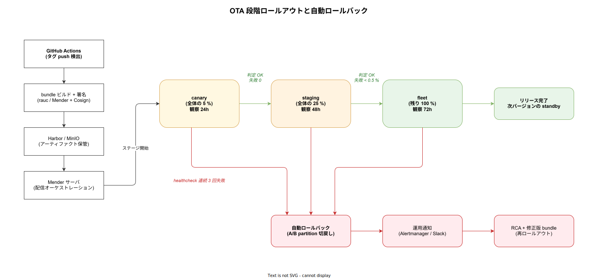

# 運用ライフサイクルと観測性

## 目的

数台〜数百台規模のラズパイを複数拠点に展開するときに、(1) OS / アプリの配信更新、(2) 死活・パフォーマンスの観測、(3) 障害検知と自動復旧、(4) 長期運用 (SD 寿命・EoL) を維持する方法を整理する。ここで選ぶ fleet 管理系の選定が、3 案の実質的な運用コストを決定する。本章は SLO/SLI の具体値、Mender サーバー構成、Prometheus remote-write の設計、ランブック 20 件、カオステストシナリオまで踏み込み、PoC 完了後そのまま本番運用設計の下敷きになる粒度を狙う。

---

## 1. 3 案ごとの配信系の骨格

どの案でも「エッジを遠隔で安全に更新する仕組み」は不可欠。案によって採用できる配信系が変わる。

| 観点 | 案 A (エージェント) | 案 B (Dapr サイドカー) | 案 C (k3s) |
|---|---|---|---|
| 配信対象 | OS bundle + エージェントバイナリ | 同左 + Dapr Component YAML | k3s 上の Pod (コンテナイメージ) + Helm Chart |
| 第一候補の配信系 | **Mender.io** or **rauc + hawkBit** | Mender + Dapr 設定の別配信 | **Argo CD ApplicationSet** |
| ロールバック | A/B partition 自動 | A/B partition 自動 | Argo CD sync 履歴からロールバック |
| GitOps 統合 | 別系統 (CI で bundle 生成 → Mender push) | 別系統 + Dapr 設定リポジトリ | k1s0 本体と完全統合 |
| 中央管理 UI | Mender Web UI | Mender Web UI | Backstage + Argo CD UI (k1s0 本体) |

案 A / B では **Mender.io** を第一候補とする。Hosted 版を使わず OSS 版を自前運用できる (Apache 2.0 OSS コアと有償 Enterprise がある)。案 C は k1s0 本体の Argo CD に統合できるのが最大の利点。

---

## 2. Mender.io / rauc / balena の比較

エッジ OTA 系の主要 OSS を比較する。いずれも A/B partition + 署名検証 + ロールバックの基本機能を持つ。

### 2.1 Mender.io

- Apache 2.0 ライセンス (OSS 版) と Enterprise 版の dual license。
- サーバー + クライアント (`mender-client`) の完全セット。Debian パッケージあり、Raspberry Pi OS / Ubuntu 即導入可。
- Web UI でデバイスインベントリ、段階的ロールアウト (canary)、healthcheck を統合管理。
- デバイス数が数百〜数千の中規模に最適。
- Docker ベースの自前ホスト、または hosted SaaS (同社) 選択可。閉域要件なら自前ホスト。

### 2.2 rauc + hawkBit

- rauc は OTA 基盤、hawkBit (Eclipse) は配信オーケストレーション。
- 組み合わせで自由度高いが、初期構築コストが Mender より大きい。
- メーカー固有 bundle format を柔軟に設計したい場合に有利。
- MB 単位の差分更新 (`casync`) が使え、帯域削減に効く。

### 2.3 balenaCloud / balenaOS

- balena は OS (balenaOS, Yocto ベース) + プラットフォームで一体化した「フルスタック IoT 管理」。
- **コンテナベース** の更新モデル (Docker イメージ push)。開発者体験が良い。
- Hosted と openBalena (OSS 版) あり。openBalena は機能限定。
- balenaOS は Pi 公式ではないため、 Pi 財団のカーネル更新に若干のラグがある。コンテナ前提のため案 C との相性が良いが、k3s とは競合する。

### 2.4 判断

- 案 A / 案 B: **Mender OSS 自前ホスト** を第一候補。Debian パッケージ化が素直で、短期で立ち上げ可能。
- 案 C: **Argo CD + k3s** に一本化。Mender は使わず、OS 層の更新は Ubuntu の unattended-upgrades + 計画的な手動 rollout で吸収。
- balena は **PoC 限定** または将来のコンテナ化エッジ戦略で再評価。

### 2.5 Mender サーバーの最小構成 (Docker Compose)

OSS 版 Mender サーバーを自前ホストする最小構成。フロント (`api-gateway` + `gui`) + バックエンド (`device-auth`, `inventory`, `deployments`, `useradm`, `deviceconfig`, `deviceconnect`, `iot-manager`) + 外部依存 (MongoDB / NATS / S3 互換ストレージ) の構成。

```yaml
# docker-compose.yml : Mender OSS サーバー (検証規模、k1s0 本体に組み込む際は k8s manifest に書き換え)
services:
  api-gateway:
    image: mendersoftware/api-gateway:mender-3.7.4
    ports: ["443:443"]
    depends_on: [device-auth, useradm, inventory, deployments, deviceconfig, gui]
    environment:
      - MENDER_SERVER_DOMAIN=mender.k1s0.internal
    volumes:
      - ./certs:/var/www/mendersoftware/cert:ro
  device-auth:
    image: mendersoftware/deviceauth:mender-3.7.4
    environment:
      - DEVICEAUTH_MONGO=mongodb://mongo:27017
      - DEVICEAUTH_JWT_PRIVATE_KEY_PATH=/etc/deviceauth/rsa/private.pem
    volumes:
      - ./jwt:/etc/deviceauth/rsa:ro
  useradm:
    image: mendersoftware/useradm:mender-3.7.4
    environment:
      - USERADM_MONGO=mongodb://mongo:27017
  inventory:
    image: mendersoftware/inventory:mender-3.7.4
    environment:
      - INVENTORY_MONGO=mongodb://mongo:27017
  deployments:
    image: mendersoftware/deployments:mender-3.7.4
    environment:
      - DEPLOYMENTS_MONGO=mongodb://mongo:27017
      - DEPLOYMENTS_AWS_URI=http://minio:9000
      - DEPLOYMENTS_AWS_AUTH_KEY=mender
      - DEPLOYMENTS_AWS_AUTH_SECRET=...redacted...
      - DEPLOYMENTS_STORAGE_BUCKET=mender-artifacts
  deviceconfig:
    image: mendersoftware/deviceconfig:mender-3.7.4
    environment:
      - DEVICECONFIG_MONGO=mongodb://mongo:27017
  deviceconnect:
    image: mendersoftware/deviceconnect:mender-3.7.4
    environment:
      - DEVICECONNECT_MONGO=mongodb://mongo:27017
      - DEVICECONNECT_NATS_URI=nats://nats:4222
  iot-manager:
    image: mendersoftware/iot-manager:mender-3.7.4
    environment:
      - IOT_MANAGER_MONGO_URL=mongodb://mongo:27017
  gui:
    image: mendersoftware/gui:mender-3.7.4
  mongo:
    image: mongo:6
    volumes: ["mongo-data:/data/db"]
  nats:
    image: nats:2-alpine
  minio:
    image: minio/minio:latest
    command: server /data --console-address ":9001"
    environment:
      - MINIO_ROOT_USER=mender
      - MINIO_ROOT_PASSWORD=...redacted...
    volumes: ["minio-data:/data"]

volumes:
  mongo-data:
  minio-data:
```

本番では k1s0 クラスタの `infra` namespace に Helm chart で配置し、MongoDB は CloudNativePG ではなく **専用 MongoDB Operator** (例: Percona) を使う (Mender は MongoDB 必須)。S3 互換は k1s0 既存の MinIO に統合可能。

---

## 3. OTA 更新フロー

OS / エージェントの更新は以下のシーケンスに乗せる。案 A / 案 B の場合。

1. **CI パイプライン** (GitHub Actions) がタグ push を検出、クロスコンパイルで ARM64 バイナリを生成。
2. **イメージビルド** で rauc / Mender 形式の bundle を生成し、署名 (GPG または Cosign)。
3. **アーティファクト保管**: bundle を Harbor / S3 互換ストレージへ push。
4. **Mender サーバー**に bundle を登録し、対象グループ (地域 / 拠点 / 機種) に段階的ロールアウト開始。
5. **エッジ** が次回 poll サイクルで bundle をダウンロードし、standby (B) パーティションに展開。
6. **再起動** して B で起動、`mender-client` の healthcheck (エージェントの `/healthz` + network reachability) を実施。
7. **成功**: B が active に固定化、A は次回更新の standby に。
8. **失敗**: 自動で A に戻す。Mender サーバーに失敗ステータスが報告され、運用者に通知。

案 C の場合は (5)〜(8) が Argo CD の sync → healthcheck → rollback に置き換わる。コンテナイメージ単位の差分更新になるため、bundle サイズが小さくて済む。

段階的ロールアウトは **canary (5%) → staging (25%) → fleet (100%)** の 3 段階を基本にし、各段階で 24〜72 時間の観察期間を置く。



### 3.1 GitHub Actions のジョブ例

```yaml
# .github/workflows/edge-release.yaml
name: edge-release
on:
  push:
    tags: ["edge-v*"]
permissions:
  contents: read
  id-token: write           # Cosign keyless 署名
jobs:
  build-and-publish:
    runs-on: [self-hosted, k1s0, arm64]
    steps:
      - uses: actions/checkout@v4
      - name: Build agent (Rust, ARM64)
        run: |
          cargo build --release --target aarch64-unknown-linux-gnu
      - name: Build mender artifact
        run: |
          mender-artifact write rootfs-image \
            --device-type raspberrypi4 \
            --artifact-name "edge-${GITHUB_REF_NAME}" \
            --file out/rootfs.ext4 \
            --output-path out/edge-${GITHUB_REF_NAME}.mender
      - name: Cosign sign
        uses: sigstore/cosign-installer@v3
      - run: cosign sign-blob --yes out/edge-${GITHUB_REF_NAME}.mender > out/edge.sig
      - name: Upload to Mender
        env:
          MENDER_TOKEN: ${{ secrets.MENDER_TOKEN }}
        run: |
          mender-cli artifacts upload \
            --server https://mender.k1s0.internal \
            --token "$MENDER_TOKEN" \
            out/edge-${GITHUB_REF_NAME}.mender
      - name: Trigger canary deployment
        run: |
          mender-cli deployments create \
            --artifact-name "edge-${GITHUB_REF_NAME}" \
            --device-group canary
```

### 3.2 段階ロールアウト判定基準

| ステージ | 範囲 | 観察期間 | 次段階に進む条件 |
|---|---|---|---|
| canary | 5 % (各拠点 1 台) | 24h | 失敗 0、SLO 違反 0 |
| staging | 25 % | 48h | 失敗 < 0.5 %、SLO 違反 < 1 イベント |
| fleet | 100 % | 72h 観察 | 同上 |
| rollback | (失敗時) | 即時 | healthcheck 連続 3 回失敗 |

各段階で `mender-client` の telemetry (deployment_status) を Prometheus に取り込み、Grafana ダッシュボードで可視化する。

---

## 4. 観測性

エッジから tier1 への観測データは、以下 3 系統を整備する。これは k1s0 本体の観測性設計 ([`../../02_可用性と信頼性/02_プラットフォーム自己監視.md`](../../02_可用性と信頼性/02_プラットフォーム自己監視.md)) と整合する。

### 4.1 メトリクス

- **Prometheus node_exporter**: CPU / メモリ / ディスク I/O / ネットワーク。
- **カスタムメトリクス**: エージェントから OTel SDK で publish 回数 / queue 滞留数 / RS-232C 通信エラー率 / 前回 PUBACK からの経過時間。
- **SD カード寿命関連**: `smartctl` (USB SSD の場合) / `mmc-utils` の wear-level 情報を定期収集。閾値超過で警告。
- **プル/プッシュ**: エッジは閉域 VPN 内にあるため、**VictoriaMetrics remote-write** または Prometheus pushgateway で push 方式が現実的。tier1 側の Prometheus が pull しに行く構成は NAT 越えが難しい。

エッジから tier1 に push する代表メトリクス。

| メトリクス名 | 型 | ラベル | 用途 |
|---|---|---|---|
| `edge_publish_total` | counter | edge_id, topic, result | publish 成功/失敗回数 |
| `edge_publish_latency_seconds` | histogram | edge_id, topic | 観測 → tier1 ack までの秒 |
| `edge_queue_pending` | gauge | edge_id | SQLite outbox の滞留件数 |
| `edge_queue_disk_bytes` | gauge | edge_id | `/data/queue.sqlite3` のサイズ |
| `edge_serial_errors_total` | counter | edge_id, device_id, kind | CRC error / timeout |
| `edge_modbus_request_seconds` | histogram | edge_id, device_id, fc | Modbus 1 サイクル所要時間 |
| `edge_disk_used_pct` | gauge | edge_id, mount | `/data` 使用率 |
| `edge_clock_offset_seconds` | gauge | edge_id | chrony NTP offset |
| `edge_temp_celsius` | gauge | edge_id, sensor | SoC / 筐体温度 |
| `edge_uptime_seconds` | gauge | edge_id | 起動からの経過 |
| `edge_cert_expiry_seconds` | gauge | edge_id | クライアント証明書の残存秒 |

### 4.2 Prometheus remote-write 設定

エッジ側で `prometheus` agent モードを動かし、tier1 の Mimir / VictoriaMetrics に remote-write する。`prometheus.yml` の例:

```yaml
global:
  scrape_interval: 30s
  external_labels:
    edge_id: ${EDGE_ID}
    site: ${SITE}
scrape_configs:
  - job_name: node
    static_configs:
      - targets: ["127.0.0.1:9100"]
  - job_name: agent
    static_configs:
      - targets: ["127.0.0.1:9091"]
remote_write:
  - url: https://mimir.k1s0.internal/api/v1/push
    queue_config:
      max_samples_per_send: 1000
      capacity: 10000
      max_shards: 4
      min_backoff: 1s
      max_backoff: 30s
    write_relabel_configs:
      - source_labels: [__name__]
        regex: 'go_.*|process_.*'
        action: drop
    tls_config:
      ca_file: /etc/k1s0-agent/ca.pem
      cert_file: /etc/k1s0-agent/client.pem
      key_file: /etc/k1s0-agent/client-key.pem
```

カーディナリティ抑制のため Go ランタイム系メトリクスは drop。1 台 30 メトリクス × 30 秒間隔として 100 台規模で 100 sample/s 程度に収まる試算。

### 4.3 ログ

- **Fluent Bit** を各エッジに常駐させ、tier1 の Loki へ転送 (詳細設定は [`03_セキュリティと認証.md`](./03_セキュリティと認証.md) 6.2 節)。
- エージェントは **構造化 JSON** で stdout に出す (systemd-journal 経由で Fluent Bit が拾う)。
- ディスクには **直近 24 時間のみ** バッファし、恒久保管は tier1 側で行う (SD 寿命保護)。

### 4.4 トレース

- エージェント内部の `parse → enqueue → publish` を OTel Tracing でスパン化。
- tier1 側の pub/sub 購読者まで W3C Trace Context 伝播 (MQTT 5 User Property `traceparent`)。
- Grafana Tempo で可視化。

サンプリングは tail-based ではなくエッジ側で 1/100 head sampling とする (帯域制約)。エラーパスは常時サンプリング。

---

## 5. SLO / SLI

エッジ運用の合意ライン。tier1 と契約する SLO ではなく、**エッジ運用チーム内部のターゲット**として置く。違反時は次サイクルで施策を打つ。

| SLI | 定義 | SLO (目標) | 計測 |
|---|---|---|---|
| エッジ可用性 | LWT online を維持している時間比率 (拠点 NW 健全時) | 99.5 % / 月 | broker 側 LWT トラッキング |
| publish 成功率 (上り telemetry) | `success / total publish attempts` | 99.9 % / 日 | `edge_publish_total` |
| 観測 → tier1 RTT (p95) | 観測時刻から tier1 ack までの p95 | 200 ms (LAN), 1.5 s (VPN) | `edge_publish_latency_seconds` |
| 観測 → tier1 RTT (p99) | 同 p99 | 1 s (LAN), 5 s (VPN) | 同上 |
| command 成功率 (下り) | `acked_ok / total_commands_dispatched` (signature_mismatch / timeout を除く) | 99.5 % / 日 | `edge_command_total{status="acked_ok"}` / 同上全体 |
| command RTT (p95) | tier2 発行時刻から ack 受信までの p95 | 500 ms (LAN), 2.5 s (VPN) | `edge_command_latency_seconds` |
| command 拒否率 (改竄検知) | `signature_mismatch / total` | 0 % / 日 (異常 = 即インシデント) | `edge_command_total{status="signature_mismatch"}` |
| command timeout 率 | `timeout / total` | < 0.5 % / 日 | `edge_command_total{status="timeout"}` |
| 通信断耐性 | 60 分の断絶後、滞留電文をすべて 30 分以内に消化 | 100 % | カオステスト + 実運用観測 |
| OTA 成功率 | 1 デプロイ単位の成功率 | 99 % | Mender deployment_status |
| 平均復旧時間 | 障害検知 → 自動復旧完了 | 5 分 | アラート + Mender event |
| クロックずれ | NTP offset 絶対値 | < 100 ms / 99 % time | `edge_clock_offset_seconds` |
| 証明書失効未然防止 | 残存 < 4 時間で発火するアラートが解消する率 | 100 % | `edge_cert_expiry_seconds` |
| ディスク余裕 | `/data` 使用率 < 70 % | 99 % time | `edge_disk_used_pct` |

### 5.1 アラートルール例 (PromQL)

```yaml
# /etc/alertmanager/edge.rules.yaml
groups:
  - name: edge.k1s0
    interval: 30s
    rules:
      - alert: EdgeOffline
        expr: max_over_time(up{job="agent"}[5m]) == 0
        for: 5m
        labels: { severity: critical }
        annotations:
          summary: "edge {{ $labels.edge_id }} offline"
      - alert: EdgePublishFailureBurst
        expr: sum(rate(edge_publish_total{result="failure"}[5m])) by (edge_id) > 0.1
        for: 10m
        labels: { severity: warn }
      - alert: EdgeQueueGrowth
        expr: edge_queue_pending > 5000
        for: 15m
        labels: { severity: warn }
      - alert: EdgeDiskNearFull
        expr: edge_disk_used_pct{mount="/data"} > 80
        for: 10m
        labels: { severity: warn }
      - alert: EdgeCertExpiringSoon
        expr: edge_cert_expiry_seconds < 14400
        for: 5m
        labels: { severity: critical }
        annotations:
          summary: "client cert expires < 4h on {{ $labels.edge_id }}"
      - alert: EdgeClockDrift
        expr: abs(edge_clock_offset_seconds) > 1
        for: 15m
        labels: { severity: warn }
      - alert: EdgeOTAFailure
        expr: increase(mender_deployment_status_failure_total[1h]) > 0
        for: 5m
        labels: { severity: critical }
```

---

## 6. 死活監視

エッジ死活は **MQTT LWT (Last Will Testament)** を第一系として使う。Pi が予期せず切断された瞬間に、broker が LWT メッセージを配信し、tier1 側が即座に offline 判定する。これに加えて以下を併用する。

- **Heartbeat topic**: 60 秒ごとに retained で `alive` を publish。一定期間未更新で alert。
- **逆方向 ping**: tier1 側から MQTT/Dapr pub/sub で「respond」コマンドを投げ、返信の有無で reachability 確認。
- **Mender / Argo CD の inventory 更新**: 一定期間チェックインがなければ offline 扱い。

**偽陽性対策**として、ネットワーク不安定時の false offline を減らすため、LWT + heartbeat + inventory の 2 系統失効で判定する。3 重の failed でエスカレーション。

判定マトリクス:

| LWT | Heartbeat | Inventory | 判定 |
|---|---|---|---|
| online | < 90 s | < 1h | healthy |
| online | > 90 s | < 1h | warning (heartbeat 遅延) |
| offline | — | < 1h | warning (短時間 NW 切断疑い) |
| offline | > 5 min | > 1h | critical (要介入) |

---

## 7. SD / ストレージ寿命管理

長期運用で最も顕在化する故障は SD カード寿命。以下を組み込む。

- **wear-level メトリクス**: Industrial microSD (Transcend / SanDisk Industrial) は S.M.A.R.T 相当のコマンドで残り寿命を取得可能。閾値 (80%) で警告、90% で Mender 経由の計画交換を予告。
- **書き込み削減**: ログは中央転送、エージェントの Local Queue (SQLite) は **別デバイス (USB SSD)** に逃がす。Pi の rootfs は read-only 化。
- **SD 寿命前交換の運用**: 計画交換を 2 年 〜 3 年スパンで仕込み、Mender で交換 bundle を事前配信することで、現地作業を最小化する。
- **NVMe / eMMC への移行**: 案 C の etcd は必須、案 A / B も書き込み量が多い機器に対しては USB SSD / CM4 eMMC への昇格を検討する。

`mmc-utils` での寿命取得例:

```bash
# eMMC の寿命情報 (EXT_CSD レジスタ)
mmc extcsd read /dev/mmcblk0 | grep -E "PRE_EOL_INFO|LIFE_TIME_EST"
# 期待出力例 :
# eMMC Life Time Estimation A [LIFE_TIME_EST_TYP_A: 0x01]   ← 0x01 = 0-10 % 消耗
# eMMC Life Time Estimation B [LIFE_TIME_EST_TYP_B: 0x01]
# eMMC Pre EOL Information [PRE_EOL_INFO: 0x01]             ← 0x01 = Normal
```

textfile collector で Prometheus に出す:

```bash
# /usr/local/sbin/emmc-wear-export.sh (cron で 1 時間毎に実行)
WEAR=$(mmc extcsd read /dev/mmcblk0 | awk '/LIFE_TIME_EST_TYP_A/ {print $NF}')
WEAR_DEC=$((16#${WEAR#0x} * 10))
cat > /var/lib/node_exporter/textfile/emmc.prom <<EOF
# HELP edge_emmc_wear_pct eMMC wear-level estimation (%)
# TYPE edge_emmc_wear_pct gauge
edge_emmc_wear_pct $WEAR_DEC
EOF
```

---

## 8. 拠点スケーリング

拠点数が N に増えたときのボトルネックと対策。

| N | 主要ボトルネック | 対策 |
|---|---|---|
| 〜 5 拠点 | 手運用で吸収可 | Mender 無しでも Ansible で足りる |
| 5 〜 30 拠点 | 手運用が崩壊 | Mender / Argo CD 必須、地域グループ化 |
| 30 〜 100 拠点 | 帯域・Mender サーバー負荷 | 地域ミラー、段階ロールアウト |
| 100 〜 拠点 | 組織体制 | 拠点運用者ロール定義、24/7 オンコール |

**初期から fleet 管理を導入しておく** のが絶対条件。5 拠点までの間に導入する経験を積めば、50 拠点へのスケールで事故を起こさない。

帯域試算 (1 拠点 1 台 30 メトリクス × 30 秒間隔、カスタムログ 100 events/h、OTA bundle 80 MB / 月):

| 項目 | 1 台あたり / 日 | 100 台 / 月 |
|---|---|---|
| メトリクス (remote-write) | 約 5 MB | 15 GB |
| ログ (Loki) | 約 20 MB | 60 GB |
| トレース (1/100 sampling) | 約 2 MB | 6 GB |
| OTA 配信 (月 1 回) | — | 8 GB |
| 合計 | 27 MB | 89 GB |

100 台規模なら 1 拠点あたり実効 5 Mbps の上り帯域があれば余裕を持って吸収できる試算。これを超えるサイズになる場合は地域ミラーを検討する。

---

## 9. ロールバック・障害対応

### 9.1 自動ロールバック

A/B partition 更新の healthcheck 失敗、または Argo CD の sync 失敗で自動に戻る。この動作を **月 1 回のカオステスト** (わざと壊れたバンドルを canary に流す) で検証し、運用が形骸化しないようにする。

### 9.2 手動ロールバック

Mender / Argo CD の UI から旧バージョンを再送で実施。ロールバック手順は Runbook として Backstage に格納 ([`../../../05_CICDと配信/`](../../../05_CICDと配信/))。

### 9.3 ブリック復旧

万一両パーティション破損で起動不能になった場合 (Secure Boot 絡みが典型)、現地での **SD カード入替** が必要になる。事前に以下を準備する。

- **Recovery SD image** を拠点ごとに備蓄 (物理郵送)。
- **仮エンロールトークン** で初期セットアップを自動化。Pi を交換すると自動で Mender / Argo CD に登録される。
- 現地作業者向けの **復旧手順 (写真入り)** を A4 1 枚で。

---

## 10. ランブック (20 件)

代表シナリオの初動を Backstage の TechDocs に格納する。各エントリは「症状」「即時アクション」「恒久対策」の 3 点で構成。ここでは見出しのみ列挙する。

| # | タイトル | カテゴリ |
|---|---|---|
| RB-01 | エッジが LWT で offline 通知を送ってきた | 死活 |
| RB-02 | Heartbeat 途絶だが LWT は online のまま | 死活 |
| RB-03 | publish 成功率が 99.9 % を割った | 通信 |
| RB-04 | publish RTT p99 が 5 秒を超えた | 通信 |
| RB-05 | キュー滞留が 5,000 件を超えた | 通信 |
| RB-06 | `/data` 使用率が 80 % に達した | ストレージ |
| RB-07 | eMMC wear が 80 % を超えた | ストレージ |
| RB-08 | NTP offset が 1 秒を超えた | 時刻 |
| RB-09 | 客先 NW が断絶している | 通信 |
| RB-10 | Modbus CRC error が急増 | 機器 |
| RB-11 | Modbus timeout が急増 | 機器 |
| RB-12 | mTLS handshake error が出ている | 認証 |
| RB-13 | 証明書が 4 時間以内に切れる | 認証 |
| RB-14 | 筐体 tamper を検知した | セキュリティ |
| RB-15 | sshd login failed が連続発火 | セキュリティ |
| RB-16 | OTA deployment が失敗した | OTA |
| RB-17 | OTA でロールバックされた | OTA |
| RB-18 | A/B 両パーティション破損 (ブリック) | 復旧 |
| RB-19 | UPS バッテリー残量 20 % | 電源 |
| RB-20 | SoC 温度が 80 ℃ を超えた | 環境 |

各 Runbook は 1 ページ以内、初動 5 分で意思決定できる粒度を維持する。

---

## 11. カオステスト

OTA / 通信断 / 電源断 / ディスクフル / 時刻喪失の 5 系統を月次で実施する。カオス対象は staging 拠点 1 台に限定し、本番フリート影響なし。

| シナリオ | 注入手段 | 期待動作 | 合格基準 |
|---|---|---|---|
| 通信断 30 分 | nftables で broker 宛 drop | キューに滞留 → 復旧時に全送信 | 欠落 0、重複は idempotency で排除 |
| 通信断 24 時間 | 同上 | WAL が `journal_size_limit` 内 | キュー破損 0、warning メトリクスが上がる |
| 電源断 (USB ハブ抜き) | 物理 | 復旧後に欠落 0 | tier1 で観測欠落 0 |
| ディスクフル | `fallocate -l 11G /data/junk` | 段階退避ポリシー発動 | high 優先度のみ保持 |
| NTP 喪失 24h | NTP サーバ宛 drop | offset アラート発火 | エージェント継続動作、復旧後 5 分以内に再同期 |
| 不正 OTA bundle | 故意に SHA 不一致 bundle | 配信拒否 | エッジ側が install 前に拒否 |
| 健全性失敗 OTA | `/healthz` を 500 にした bundle | 再起動後 healthcheck 失敗で rollback | A/B 自動切り戻し成功 |
| 鍵期限切れ | 証明書を期限切れに | 自動更新 → 失敗時 alert | 4 時間前に WARN、1 時間前に CRITICAL |
| broker フェイルオーバ | broker primary を停止 | secondary に接続切替 | publish 中断 < 30 秒 |
| Pi 4 → 5 機器混在 | OTA bundle を Pi 5 専用に | 機器型番ガードで拒否 | 不適合機器は no-op |
| 改竄 command | 正規 cmd を途中で書き換え Pi に流す | Pi 側の ed25519 検証で拒否 | Modbus WRITE 未発生、ack status=`signature_mismatch`、監査ログに記録 |
| command timeout | Modbus 応答遅延を人為的に `timeout_ms` 超に | Pi が timeout ack を返し tier2 側で compensation 起動 | ack status=`timeout` 受信、tier2 補償処理が Audit に記録 |
| command 二重投入 | 同一 `idempotency_key` を 10 回再送 | Pi は Modbus WRITE を 1 回のみ実行 | `command_total{status=acked_ok}` の増加 1、ack は 10 件 |
| command 突発バースト | UI から 100 機器へ一括 setpoint 変更 | Dispatcher の rate limit で平準化し broker は過負荷にならない | p99 RTT 劣化 < 2 倍、broker CPU < 80 % |

各シナリオは [Litmus](https://litmuschaos.io/) や [Chaos Mesh](https://chaos-mesh.org/) ではなく、エッジでは shell スクリプト + ansible で十分。tier1 側 Pod は Litmus を使う。

---

## 12. EoL (End-of-Life) 計画

5 年スパンでの EoL 計画。ハードウェア・OS・アプリで EoL タイミングが揃わないため、計画的に置き換える。

| 要素 | 想定 EoL | 置換戦略 |
|---|---|---|
| Pi 4 | Pi 財団がサポート終了発表時 (現状 2034 まで継続予定) | Pi 5 / CM5 へ世代交代 (筐体・配線維持) |
| Pi 5 | 同上 | 次世代 Pi または産業用ボード |
| Ubuntu 24.04 LTS | 2029-04 (ESM 2034) | 26.04 LTS への in-place upgrade を OTA で配信 |
| エージェント Rust toolchain | Edition 2024 ベース、2 年毎に更新 | OTA で同梱再配布 |
| Mender OSS | 半年毎の minor 更新 | サーバ側を quarter で更新、クライアントは年 1 回 |
| TLS 証明書 | 24h〜7d で自動 | 失効リスクは monitoring で吸収 |
| LUKS 鍵 | ATECC608B 寿命 (10 年程度) | ハードウェア交換時に更新 |
| Industrial SD | TBW 50TB / 約 3 年 (1 GB/日 書込み想定) | 計画交換 (Mender で予告) |

---

## 13. 未確定事項

- Fleet 管理系 (Mender / balena / Argo CD) の最終採用判定。PoC で 2 系並行評価するかどうか。
- Prometheus remote-write / pushgateway の中央受け構成 (Mimir / VictoriaMetrics の選定)。
- SD カード寿命監視のメトリクス粒度と閾値。
- 拠点数の 3 年予測と地域分散の方針。
- ブリック復旧の物理ロジスティクス (交換 SD 備蓄・配送) を誰が負うか。
- SLO の業務合意レベル (内部目標 vs ユーザー契約 SLA)。
- OTA メンテナンス窓 (深夜・休日・連続稼働の業界差)。
- カオステストの本番混入リスクと組織合意。

これらの確定後、運用 Runbook と fleet 管理 ADR を起草する。
