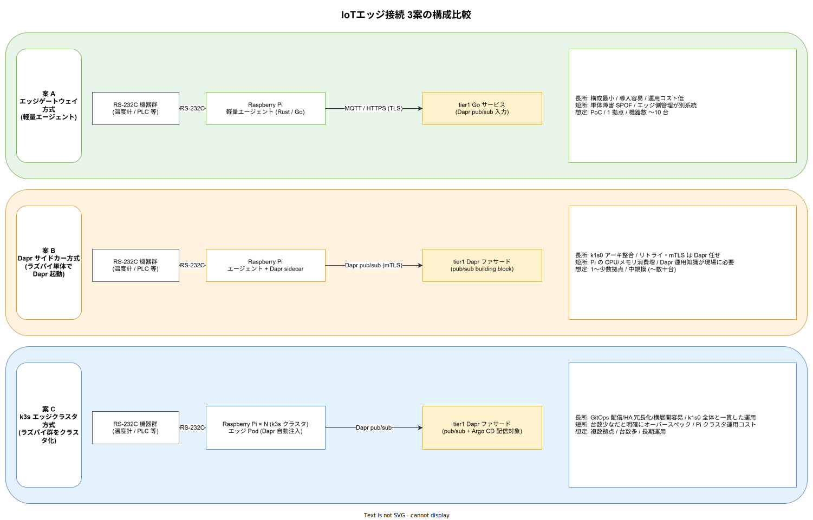
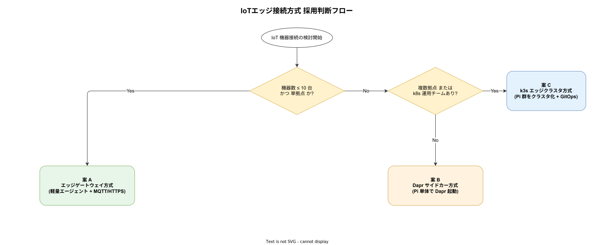

# IoT エッジ接続方式

## 目的

RS-232C で外部機器 (温度計・PLC・計測器等) と通信する業務要件を、ユーザー現場に通信専用 PC を置かずに実現するための接続方式を整理する。Raspberry Pi を通信ゲートウェイとして用いる 3 案を比較し、採用判断フローと深掘り領域への索引を示す。

本ドキュメントは企画段階の検討であり、採用確定時点で [`docs/02_infra/00_ADR/`](../../../../02_infra/00_ADR/) に ADR として別途記録する。

---

## 読み方

初読は以下の順で読むと全体像が掴みやすい。

1. 本ファイル (総論・3 案比較・採用判断)
2. [`01_物理層とハードウェア.md`](./01_物理層とハードウェア.md) — RS-232C/422/485 の差異、レベル変換、Pi モデル選定、産業用代替ボード比較
3. [`02_エッジソフトウェアと通信設計.md`](./02_エッジソフトウェアと通信設計.md) — OS・イメージ管理・ストア&フォワード・プロトコル・Rust/Go 実装スケルトン
4. [`03_セキュリティと認証.md`](./03_セキュリティと認証.md) — Secure Boot・TPM・mTLS・OT 境界・IEC 62443 SL2 マッピング
5. [`04_運用ライフサイクルと観測性.md`](./04_運用ライフサイクルと観測性.md) — Mender 構成・SLO/SLI・ランブック 20 件・カオステスト
6. [`05_3案の深掘り評価.md`](./05_3案の深掘り評価.md) — 上記を踏まえた 3 案の再評価・TCO 試算・撤退判断点
7. [`06_PoC計画.md`](./06_PoC計画.md) — Go/No-Go 基準・予算・体制・成果物
8. [`07_定量モデル.md`](./07_定量モデル.md) — Modbus サイクル・MQTT RTT・帯域・電力・SD 寿命のワークシート
9. [`08_ヒアリングシート.md`](./08_ヒアリングシート.md) — ユーザー確認すべき情報の構造化質問票

ヒアリング → 定量モデル → 3 案評価 → PoC 計画、の順で逆引きすると意思決定の流れが掴める。

---

## 前提と制約

採用判断の前提として以下を置く。ユーザーヒアリングで補強する余地があり、数値が変わる場合は本ドキュメントを更新する。

- 機器側は RS-232C を基本とし、現場によっては RS-422 / RS-485 の可能性あり。電文はテキストまたはバイナリのメーカー固有プロトコル (多くは Modbus RTU または独自)。詳細は [`01_物理層とハードウェア.md`](./01_物理層とハードウェア.md)。
- 1 機器あたりの通信頻度は秒オーダー〜分オーダー。映像やバルクデータ転送は想定しない。
- ラズパイ (Raspberry Pi 4 / 5) または互換ボードを現場筐体に設置する。Pi の民生品としての制約 (温度範囲・SD 寿命・EMI) は産業現場で問題になるため、[`01_物理層とハードウェア.md`](./01_物理層とハードウェア.md) で代替ボード (CM4 + 産業用キャリア・Moxa UC・Siemens IOT2050 等) も検討する。
- ラズパイ↔k1s0 クラスタ間は、ユーザー拠点の既存閉域ネットワーク経由で到達可能とする。インターネット経由 SaaS は使用しない ([`../../01_基礎/03_配置形態.md`](../../01_基礎/03_配置形態.md) のネットワーク方針に準拠)。
- tier1 側の入口/出口は Dapr pub/sub を軸とする facade に統一し、エッジ固有の通信プロトコル・Kafka トピック・EMQX の存在は tier2 / tier3 から完全に隠蔽する ([`../../../03_tier1設計/`](../../../03_tier1設計/) の隠蔽方針に準拠)。具体的には以下の 2 ワーカー + 4 トピックを tier1 内部実装として持ち、外部に公開する接点は `k1s0.PubSub.Subscribe("edge.device.measurement|alarm|heartbeat")` と `k1s0.PubSub.Publish("edge.device.command", cmd)` / `Subscribe("edge.device.command.ack")` のみに限定する (案 C 採用時の構成図は [`../../../img/全体構成図.svg`](../../../img/全体構成図.svg) を参照)。
  - `k1s0.Edge.Ingress` (Rust, tier1 内部): EMQX からの上り (telemetry) を受け、CN allowlist / schema 検証 / 単位正規化 / 重複排除を経て Dapr PubSub で Kafka へ投入。
  - `k1s0.Edge.Dispatcher` (Rust, tier1 内部): tier2 が publish した下り command トピックを subscribe し、ACL / rate limit を検証のうえ EMQX に MQTT Publish。エッジでの実行結果は `.ack` トピックに返る。
  - tier3 UI から機器を制御する場合は、tier2 の操業制御 Service へ `k1s0.Service.Invoke` で要求を投げ、tier2 が認可・監査・冪等化を確定させた上で facade の Publish を呼ぶ。UI は facade を直叩きしない。

---

## 3 案の構成比較

3 案はいずれも「ラズパイを現場に配置し RS-232C を収容する」点で共通し、差異は **ラズパイ上の実行形態** と **ラズパイ↔tier1 間の通信方式** にある。案 A は最小構成、案 B は k1s0 既存の Dapr 機構を現場に拡張、案 C は現場をフルに k8s エッジクラスタ化する構成で、運用コストと得られる堅牢性のバランスが段階的に変化する。

以降の節で各案の要点をまとめる。詳細な技術的評価は [`05_3案の深掘り評価.md`](./05_3案の深掘り評価.md) を参照。

---

## 案 A: エッジゲートウェイ方式 (軽量エージェント)

### 概要

ラズパイ上で単一の常駐プロセス (Rust または Go の軽量エージェント) を動かし、USB-Serial から取得した電文を MQTT または HTTPS 経由で tier1 に送信する。ラズパイ自体は Raspberry Pi OS Lite (または Ubuntu Server for ARM) + systemd サービスで構成し、k8s は介在しない。tier1 側では Dapr pub/sub 入力 (MQTT Broker Component または Envoy Gateway 経由 HTTPS) でメッセージを受け取り、以降は tier2 ドメインサービスへ流す。

### メリット

- 構成が最小で、現場での導入と再現が容易。Pi OS イメージ + エージェントバイナリ + systemd Unit ファイルで立ち上がり、初期構築は 1 拠点 1 時間程度が目安。
- 障害要素が少ないため、現場対応(再起動・SD カード交換)を非技術担当に任せられる。
- 将来、機器台数が増えた際に案 B / 案 C へ段階移行しやすい。tier1 側の受け口を Dapr pub/sub に揃えておけば、エッジ側の実装差し替えで移行が吸収される。

### デメリット

- ラズパイ 1 台が SPOF になる。二重化する場合はラズパイを 2 台並置し、エージェント側で active-standby または**デュアルリード + クラスタ側重複排除**を実装する必要があり、案 B / 案 C のようにフレームワーク任せにできない。
- エッジ側の構成配信・ログ収集・アップデートが k1s0 本体の GitOps から外れ、Ansible や Mender / balena 等の fleet 管理系を別途整備する必要がある ([`04_運用ライフサイクルと観測性.md`](./04_運用ライフサイクルと観測性.md))。
- mTLS やリトライ・指数バックオフなどの信頼性プリミティブをエージェント側に自前で実装する必要があり、案 B で Dapr が提供する機能と重複開発になる。
- ストア&フォワード(通信途絶時のローカル滞留)を自前で設計する必要がある。SQLite/RocksDB によるキュー、idempotency key、重複排除などは [`02_エッジソフトウェアと通信設計.md`](./02_エッジソフトウェアと通信設計.md) を参照。

### 想定シナリオ

PoC、単一拠点、機器数 10 台以下、現場運用チームは非技術者中心、というユースケースに最適。k1s0 本体の MVP-0 と同時期に導入するには、エッジ側の学習コストを極小化する必要があり、本案が最有力となる。

---

## 案 B: Dapr サイドカー方式 (Pi 単体で Dapr 起動)

### 概要

ラズパイ上に Dapr ランタイムを直接インストール (Dapr standalone mode) し、エージェント本体と Dapr sidecar (`daprd`) の 2 プロセス構成で動かす。エージェントは RS-232C から電文を取り出して Dapr HTTP/gRPC API (localhost) に投げ、Dapr sidecar が Kafka または MQTT Broker に配信する。tier1 側はクラスタ内で動く他の Dapr アプリと同じ pub/sub 購読者として受ける。

### メリット

- tier1 以降と同じ Dapr pub/sub / state / secret 抽象で書けるため、エッジ・クラスタ間で **実装スタイルが一貫** する。ドメインサービスの書き方をエッジに流用でき、学習コストが分散する。
- mTLS、リトライ、サーキットブレーカー、分散トレーシング (OTel) などがフレームワーク側で提供される。自前実装が減る。
- 将来、エッジ側のロジックが膨らんだ場合 (フィルタ・集約・ローカルキャッシュ等)、Dapr の building block を順次追加すればよく、アーキテクチャ変更を伴わない。

### デメリット

- ラズパイ 1 台で 2 プロセス常駐するため CPU / メモリ消費が増える。Raspberry Pi 4 (4GB) で Dapr standalone を動かす PoC 実績はあるものの、本番で長期稼働させた検証はチーム内にない。実測が必要 ([`05_3案の深掘り評価.md`](./05_3案の深掘り評価.md) の TCO 試算節)。
- Dapr の運用 (バージョン追随・証明書更新・設定変更) を現場にも展開する責任が発生する。tier1 チームがエッジ側の Dapr も管理する体制を敷かないと維持困難。
- エッジ単体では「クラスタに属さない Dapr」の位置付けになり、クラスタ内 Dapr のコントロールプレーン (sentry / placement) とは切り離された運用になる。証明書ローテーションは Dapr standalone のメカニズムで独自に回す必要があり、案 C のように k3s に入れてしまった方が管理が揃う。
- Dapr Components (Kafka / MQTT / Redis 等) の定義ファイルを現場に配布する経路の設計が必要。エッジ固有の認証情報を OpenBao から取り出す機構は [`03_セキュリティと認証.md`](./03_セキュリティと認証.md) を参照。

### 想定シナリオ

1 〜 少数拠点、機器数は数台〜数十台、tier1 チームがエッジまで一括管理する体制が取れる場合。「案 A よりは堅牢に」「案 C ほど大掛かりでなく」という中間帯として有効。ただし、デメリットに挙げた運用負荷が案 C とさほど変わらず、中間案としての存在意義が薄くなる場面もある。

---

## 案 C: k3s エッジクラスタ方式 (Pi 群をクラスタ化 + GitOps)

### 概要

現場にラズパイを 3 台以上配備し、[`k3s`](https://k3s.io/) でエッジ k8s クラスタを構成する。エッジアプリ (RS-232C 収容エージェント) は Pod として配信され、Dapr sidecar は k1s0 本体と同じ自動注入機構で付与される。Argo CD によりクラスタ配信も GitOps で統一する。k1s0 の [`../../../04_技術選定/`](../../../04_技術選定/) で k3s がサブプランとして採用されており、アーキテクチャ上の齟齬は小さい。

### メリット

- HA 冗長化、ローリングアップデート、GitOps 配信、テレメトリ収集が **k8s エコシステムでそのまま機能** する。案 A / 案 B で自前整備が必要だった領域が消える。
- 拠点数が増えた際の横展開が速い。ラズパイ 3 台 + k3s のインストールスクリプトで拠点を追加でき、Argo CD の ApplicationSet でアプリ配信を自動化できる。
- 現場運用も k1s0 本体と同じ Backstage / Argo CD / Grafana 画面で完結する。オンコール体制が一本化できる。

### デメリット

- 機器数が少ない拠点では明確にオーバースペック。1 拠点 1 機器のような構成では、ラズパイ 3 台 + k3s 運用コストが正当化できない。
- k8s の基礎知識を現場近くの運用担当まで展開する必要がある。現場 IT に k8s 運用経験がない場合、障害時の一次対応が tier1 チーム頼みになり、現場応答性が下がる。
- ラズパイ 3 台化により、電源・LAN ポート・ラック実装など物理要件が増える。設置スペースが限られる拠点では導入できない場合がある。また etcd の SD カード書き込み負荷によって SD 寿命が短くなる既知問題があり、etcd 用ディスクは産業用 NVMe や USB SSD に逃がす必要がある ([`01_物理層とハードウェア.md`](./01_物理層とハードウェア.md))。
- RS-232C 自体はケーブル一本でしか接続できないため、k3s 側で HA を組んでも機器↔Pi 間の単一ポイントは残る。冗長化の限界を正しく理解する必要がある。

### 想定シナリオ

複数拠点 (2 拠点以上)、各拠点で機器数が多い (数十台規模)、または長期運用を前提に最初から冗長化と GitOps 配信を揃えたい場合。k1s0 全体の運用思想と完全に整合するため、中長期的な総保有コストは案 B よりも低くなる可能性が高い。

---

## 採用判断

3 案の中からどれを取るかは、機器台数・拠点数・運用体制という 3 つの軸で概ね決まる。以下のフローで判定する。

段階移行の推奨経路は「MVP-0 で案 A → 機器数 / 拠点数が増えた時点で案 C」である。案 B は案 A から案 C への過渡期に位置する選択肢で、現場に k8s 運用リソースを持ち込めない場合の代替として保持する。tier1 側の受け口はいずれの案でも Dapr pub/sub を使うため、**エッジ側の実装を差し替えても tier2 / tier3 側のコード変更は発生しない**。この前提が崩れないよう、tier1 入口の API 設計段階で案 A / 案 B / 案 C すべてを通せる抽象を確保しておく必要がある。

---

## 案の簡易比較

以下は本編の要約であり、判断は各節の散文と深掘りドキュメントを読んだ上で行うこと。セルの内容は本編の主張を短縮した参照用で、これだけで結論を出すためのものではない。

| 観点 | 案 A | 案 B | 案 C |
|---|---|---|---|
| エッジ実行形態 | systemd 上の単一プロセス | Dapr standalone + エージェント | k3s クラスタ上の Pod |
| ラズパイ台数 / 拠点 | 1 台 (冗長時 2 台) | 1 台 | 3 台以上 |
| エッジ HA | 自前 active-standby | Dapr リトライに依存 | k8s / Argo CD で標準提供 |
| GitOps 配信 | 別系統 (Ansible / Mender 等) | 別系統 (Dapr 設定のみ部分整合) | 本体 Argo CD に統一 |
| mTLS / リトライ | エージェントで自前実装 | Dapr が提供 | Dapr が提供 |
| ストア&フォワード | 自前 (SQLite/RocksDB) | 自前 + Dapr Resiliency | k8s PV + 自前ロジック |
| CPU / メモリ消費 | 最小 (数十 MB RSS) | 中 (200〜400 MB RSS) | 大 (k3s 500 MB + Dapr + App) |
| 想定規模 | 〜 10 台 / 1 拠点 | 〜 数十台 / 少数拠点 | 数十台以上 / 複数拠点 |
| 初期工数 | 小 | 中 | 大 |
| 長期運用コスト | 小(拡張時に再設計) | 中 | 中〜小 (規模が出れば単価下降) |
| k1s0 アーキ整合度 | 低 (エッジは別系統) | 中 | 高 (k3s は [`../../../04_技術選定/`](../../../04_技術選定/) 採用済) |
| 1 拠点あたりハード初期費 | 約 2 〜 4 万円 | 約 2 〜 4 万円 | 約 8 〜 15 万円 |

ハード費の内訳と TCO 試算は [`05_3案の深掘り評価.md`](./05_3案の深掘り評価.md) を参照。

---

## 未確定事項

採用確定前にユーザーと確認すべき事項を以下に挙げる。

- RS-232C 機器のメーカー固有プロトコル仕様 (電文フォーマット・ポーリング可否・多重化の可否・同時接続可能台数)。
- 1 拠点あたりの機器台数と拠点数、3 年後の想定台数。
- RS-232C / 422 / 485 の物理構成、ケーブル長、多点接続の有無。
- 現場設置スペース、電源 (AC 100V / 24V DC / PoE)、LAN 配線の制約。
- 現場運用担当の技術レベル (k8s / Linux / 産業ネットワークの運用経験の有無)。
- 通信途絶時のビジネス影響 (秒・分・時間のどの粒度で許容されるか)。
- ラズパイ調達経路、保守契約、供給継続リスクへの対応 (Pi 代替ボード移行の準備要否)。
- 物理環境 (温度・粉塵・振動・EMI) と産業用筐体の要否。
- 既存 SCADA / HMI / MES との接続の有無、OPC UA 変換の要否。

これらが埋まった段階で、本ドキュメント群を改訂し ADR に移行する。

---

## 関連ドキュメント

- [`../../01_基礎/03_配置形態.md`](../../01_基礎/03_配置形態.md) — クラスタ側の namespace 配置とネットワーク方針
- [`../../01_基礎/02_依存ルールと通信経路.md`](../../01_基礎/02_依存ルールと通信経路.md) — tier 間の通信経路
- [`../../../03_tier1設計/`](../../../03_tier1設計/) — tier1 が担う Dapr 隠蔽とファサード設計
- [`../../../04_技術選定/01_実行基盤中核OSS.md`](../../../04_技術選定/01_実行基盤中核OSS.md) — k3s を含む実行基盤 OSS の選定根拠
- [`../../../07_ロードマップと体制/`](../../../07_ロードマップと体制/) — MVP-0 / MVP-1 のフェーズ計画
