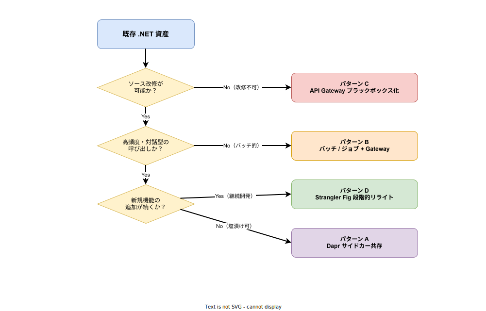
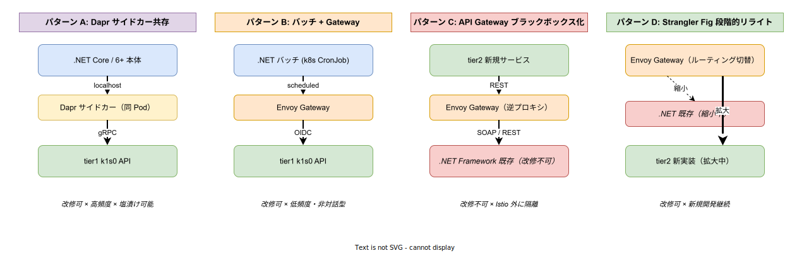

# レガシー共存パターン

## 目的

k1s0 プロジェクトが企画段階で最も強く掲げた痛みは「レガシー .NET Framework 資産を捨てられない組織でも新規プラットフォームに乗れること」である（[`../../01_背景と目的/00_背景と課題.md`](../../01_背景と目的/00_背景と課題.md) 参照）。にもかかわらず、02 章のアーキテクチャには**この痛みに直接答える設計パターン**が文書化されていなかった。本ファイルはその欠落を埋めるために新設する。

対象読者は「既存 .NET 資産を抱えたままプラットフォーム刷新を検討しているシステム基盤リード」である。本章は tier3 レイヤ上でレガシー .NET 資産をどう吸収するかを、**資産の特性ごとに 4 つの共存パターン**として提示する。同時に、01 章で描いた痛みが本章のどのパターンで解消されるかの対応関係を明示し、企画から設計への接続を可視化する。

---

## 1. 01 章の痛み → 本章の設計対応

企画段階の痛み定義と、本章のパターンがどう応答するかを先に示す。この接続が切れていると「痛みは語ったが設計がない」状態になり、稟議で必ず問われる。

- **痛み 1「.NET Framework 資産が動き続けている。捨てるに捨てられず、新規開発の足を引っ張る」** → パターン C（ブラックボックス化）で短期的に現状維持を可能にし、パターン D（Strangler Fig）で段階的に置換する。新規 tier2 の開発速度は既存 .NET に引きずられない。
- **痛み 2「.NET Framework 歴 20 年のエンジニアが k8s / Linux を未経験」（ペルソナ記述より）** → パターン A（Dapr サイドカー共存）では .NET Core 6+ に移行済みの資産を最小改修で tier3 に載せる。サイドカーにより分散処理の複雑性は隠蔽され、アプリケーションコードは既存スタイルのまま残せる。
- **痛み 3「横断関心事（認証・ログ・イベント）が各アプリに散らばって保守コストが膨らむ」** → 全パターンで、横断関心事は tier1 が引き受ける。パターン C の既存 .NET でさえ、Envoy Gateway が OIDC 検証・Rate Limit を代行するため、レガシー側に手を入れない。
- **痛み 4「端末配布（MSI / ClickOnce）に苦しんでいる」** → これは Web 化を前提とした [`../../05_CICDと配信/02_アプリ配信ポータル.md`](../../05_CICDと配信/02_アプリ配信ポータル.md) の守備範囲であり、本章の対象外。本章のパターンはサーバ側資産にのみ適用する。

---

## 2. 対象となる .NET 資産の分類

本章で扱う「レガシー .NET 資産」を、共存パターン選択の前提として分類する。k1s0 はこれらを排除せず、**分類ごとに適切な共存パターンを割り当てる**ことで、組織の過去投資を毀損せずに刷新を進める。

- **分類 I（.NET Core 3.1 / 5 / 6+ で動く既存アプリ）**: Linux コンテナ化が可能で、Dapr サイドカーと同居できる。本章パターン A / B / D の候補。
- **分類 II（.NET Framework 4.x の業務アプリ）**: Windows コンテナ化は理論上可能だが、Istio / Dapr との相性が悪く、Linux 中心の k8s クラスタ上では外部化が妥当。本章パターン C / D の候補。
- **分類 III（.NET Framework + COM / 独自 DLL 依存）**: コンテナ化自体が困難。VM 上での稼働継続を前提とし、Envoy Gateway から逆プロキシする。本章パターン C のみ。
- **分類 IV（VB6 / 古典 ASP 等の .NET 以前の資産）**: 本プラットフォームの直接共存対象外。ネットワーク到達可能であれば分類 III と同じパターン C で扱うが、長期的には段階廃止を前提とする。

分類の判定は「改修可能性」「呼び出し頻度」「新規開発継続性」の 3 軸で行う。この 3 軸がパターン選択の意思決定フローに直接対応する。

---

## 3. パターン選択の意思決定フロー

資産の特性を 3 つの質問で絞り、A / B / C / D の 4 パターンに割り当てる。フローは下図のとおりである。

このフローは「理想の設計を押し付ける」のではなく「**現実の資産を受け入れる**」ために設計されている。ソース改修が不可能な資産でも、パターン C で受け皿を用意することで k1s0 への段階参加が可能になる。この包容力こそが企画段階のコア主張であり、本章はその実装ガイドである。

---

## 4. 各パターンの詳細

4 パターンの構造的な違いを下図に示す。配置・通信・信頼境界の扱いが異なり、資産特性に応じた使い分けが必要である。

### パターン A: Dapr サイドカー共存

.NET Core 6+ 以上の資産を tier3 として吸収する最短路である。.NET 本体はビジネスロジックのみ担当し、State / Pub-Sub / Binding / Secrets は Dapr サイドカーに委譲する。アプリ側の変更は「Dapr SDK for .NET の導入」と「接続先を localhost の Dapr に向ける」のみで済み、既存コードの大半は温存される。

- **適用条件**: 改修可 × 高頻度呼び出し × 新規機能追加は停止していても可。
- **引き受けるもの**: 横断関心事の全て（tier1 API 経由 + Dapr Component 経由）。
- **引き受けないもの**: ビジネスロジックの書き換え。
- **落とし穴**: Dapr サイドカーの起動順序に依存するため、アプリ側のリトライを丁寧に実装する必要がある。tier1 [`../../03_tier1設計/04_診断と補償/08_診断機能設計.md`](../../03_tier1設計/04_診断と補償/08_診断機能設計.md) の診断機能で起動順序不整合を検知できるようにする。

### パターン B: バッチ / ジョブ + Gateway

夜間バッチ・定期レポート・データ連携ジョブといった「対話型でない」.NET 資産に適用する。k8s CronJob として起動し、実行時に Envoy Gateway 経由で tier1 API を叩く。Dapr サイドカーは常駐させないため、サイドカーコストが分母に効くバッチワークロードに向く。

- **適用条件**: 改修可 × 低頻度 / バッチ型。
- **引き受けるもの**: スケジューリング（k8s CronJob）、認証（OIDC Client Credentials）、失敗時リトライ（Argo Workflows 併用時）。
- **引き受けないもの**: 常駐 Service Mesh（必要時のみ Envoy 経由）。
- **落とし穴**: バッチ途中失敗時の冪等性担保。分類 II の長時間 Windows バッチはここでなく C / D を検討する。

### パターン C: API Gateway ブラックボックス化

**ソース改修が不可能な資産**を現状維持で取り込むためのパターンである。既存 .NET Framework を Windows VM / Hyper-V で動かし続け、Envoy Gateway の逆プロキシ経由でネットワーク到達だけ確保する。Istio メッシュには入れない。tier2 新規サービスから見ると「ただの REST / SOAP エンドポイント」である。

- **適用条件**: 改修不可（ソース紛失・契約上不可・COM 依存等）。
- **引き受けるもの**: プラットフォーム境界での認証（Envoy の ext-authz で OIDC 検証）、Rate Limit、ログ集約（アクセスログのみ）。
- **引き受けないもの**: 内部モニタリング、分散トレーシング、秘匿鍵ローテーション。
- **脅威上の注意**: このパターンは [`14_脅威モデル詳細.md`](../03_セキュリティ/02_脅威モデル詳細.md) の残余リスクで明示したとおり、「Zone 3 内部からの横展開」の温床となる。AuthorizationPolicy でレガシー領域からの outbound を最小化し、封じ込めを設計する。

### パターン D: Strangler Fig による段階的リライト

Martin Fowler の Strangler Fig 戦略を k1s0 文脈に適用したパターンである。Envoy Gateway のルーティングルールで、URI パス単位にリクエストを .NET 既存 / tier2 新実装に振り分け、**新実装のカバー範囲を時間をかけて拡大する**。新実装の準備が整った endpoint から順にルーティングを切り替え、最終的にレガシーを停止する。

- **適用条件**: 改修可（既存に当面は手を入れる）× 新規機能の継続的追加あり。
- **引き受けるもの**: 段階的移行の導線、切替期間中の両系並走、問題時のロールバック（ルーティングを戻すだけ）。
- **引き受けないもの**: データ層の二重書き込み整合性（これは業務側の設計責任）。
- **落とし穴**: 切替期間中にデータスキーマが両系で分岐するリスク。Phase 2 で CDC（Change Data Capture）パターンを追加採用し、レガシー DB → 新 DB への片方向レプリケーションを用意する（[`09_データアーキテクチャ.md`](../04_非機能とデータ/02_データアーキテクチャ.md) 参照）。

---

## 5. 脅威・セキュリティ上の配慮

レガシー共存はセキュリティ境界を複雑化させる副作用を持つ。本章と [`14_脅威モデル詳細.md`](../03_セキュリティ/02_脅威モデル詳細.md) は以下の点で連動する。

- **Zone 3 内部の信頼粒度の不均一**: パターン A / D の .NET は Istio mTLS 網に入るが、パターン C は Istio 外部に置かれる。Zone 3 を「均一な信頼ゾーン」とみなすと誤る。AuthorizationPolicy で tier3 の通信経路を明示的に制限する。
- **CVE 追従の遅延**: .NET Framework は Microsoft のサポート終息スケジュールに依存する。サポート切れ後の延命はパターン C のみを想定し、そのリスクは決裁者に明示する。
- **ログ・監査の分離**: パターン C のレガシーは tier1 Audit に記録を流せないケースが多い。これは残余リスクとして受容し、Envoy Gateway のアクセスログを代替とする。ハッシュチェーン改ざん防止は適用できない。

---

## 6. 移行経路（Phase 別）

- **Phase 1 (MVP)**: パターン A / B / C を利用可能にする。C は特に Windows VM 外部化の導線を含め、新規 .NET 資産を受けられる状態にする。
- **Phase 2**: パターン D の Strangler Fig ルーティング機構を tier1 API Gateway に追加実装。CDC ベースのデータレプリケーションを OSS（Debezium 等）で評価。
- **Phase 3**: 分類 III の Windows VM を MicroVM（Firecracker 等）に寄せ、運用負担を低減。段階的な Linux コンテナ化を支援する移行テンプレートを提供。
- **Phase 4+**: .NET Framework サポート終息の実態に合わせ、パターン C 適用資産の「延命判断 / 置換判断」ゲートを稟議プロセス化する。

---

## 関連ドキュメント

- [`00_概念アーキテクチャ.md`](../01_基礎/00_概念アーキテクチャ.md) — 全体俯瞰
- [`01_レイヤ構成と責務.md`](../01_基礎/01_レイヤ構成と責務.md) — tier3 の位置付け
- [`02_依存ルールと通信経路.md`](../01_基礎/02_依存ルールと通信経路.md) — tier3 から tier1 への通信ルール
- [`04_セキュリティモデル.md`](../03_セキュリティ/01_セキュリティモデル.md) — セキュリティ概観
- [`14_脅威モデル詳細.md`](../03_セキュリティ/02_脅威モデル詳細.md) — レガシー起点の脅威と残余リスク
- [`../../01_背景と目的/00_背景と課題.md`](../../01_背景と目的/00_背景と課題.md) — 企画段階の痛み定義
- [`../../01_背景と目的/01_ペルソナ.md`](../../01_背景と目的/01_ペルソナ.md) — .NET ベテランペルソナ
- [`../../03_tier1設計/03_開発者体験/14_tier3開発者体験設計.md`](../../03_tier1設計/03_開発者体験/14_tier3開発者体験設計.md) — tier3 開発者向け DX
- [`../../05_CICDと配信/02_アプリ配信ポータル.md`](../../05_CICDと配信/02_アプリ配信ポータル.md) — 端末配信痛みへの応答
