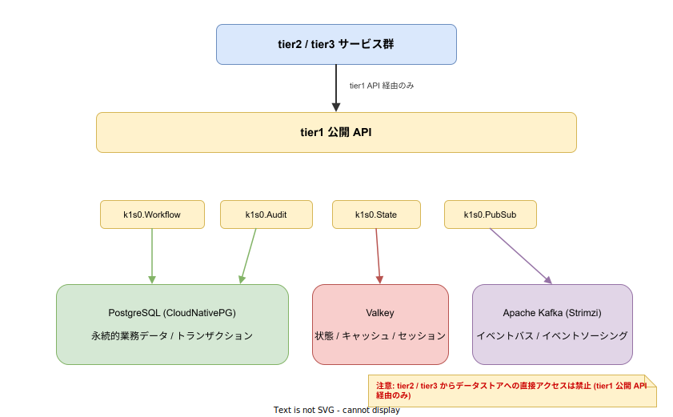

# データアーキテクチャ

## 目的

k1s0 におけるデータの保存先選定・プロビジョニングモデル・オーナーシップ・イベント設計・スキーマ進化・ライフサイクル管理の指針を定義する。ストレージ技術の選定根拠は [`../04_技術選定/`](../04_技術選定/) を、バックアップ・復旧は [`05_障害復旧とバックアップ.md`](./05_障害復旧とバックアップ.md) を、データ分類・暗号化は [`04_セキュリティモデル.md`](./04_セキュリティモデル.md) をそれぞれ参照。

---

## 1. データストアの役割と使い分け

k1s0 は 3 種類のデータストアを持つ。tier2 / tier3 はいずれも tier1 公開 API 経由でのみアクセスする。

### 1.1 各データストアの位置付け

| データストア | 担当する tier1 API | 用途 | データの性質 |
|---|---|---|---|
| PostgreSQL (CloudNativePG) | `k1s0.Workflow`, `k1s0.Audit`, tier2 業務データ | 永続的な業務データ・トランザクション | 強整合性・リレーショナル |
| Valkey | `k1s0.State`, `k1s0.Settings` | 状態管理・キャッシュ・セッション | 高速読み書き・揮発許容 |
| Apache Kafka | `k1s0.PubSub` | イベント配信・イベントソーシング・監査イベント | 追記専用・時系列・リプレイ可能 |

### 1.2 使い分けの判断基準

| 判断軸 | PostgreSQL | Valkey | Kafka |
|---|---|---|---|
| トランザクション (ACID) が必要 | 採用 | 不適 | 不適 |
| リレーション (JOIN) が必要 | 採用 | 不適 | 不適 |
| 高頻度の読み書き (< 1ms) | キャッシュ併用 | 採用 | 不適 |
| セッション / 一時状態 | 不適 | 採用 | 不適 |
| イベント配信 / 購読 | 不適 | 不適 | 採用 |
| 監査証跡 (改ざん防止) | 長期保存先 | 不適 | 一次記録先 |
| 障害時のデータ損失許容度 | 損失不可 | 一部損失許容 | レプリカで保護 |

**原則**: 迷ったら PostgreSQL を選ぶ。Valkey はパフォーマンス要件が明確な場合にのみ採用する。Kafka はイベント駆動が必要な場合にのみ採用する。

---

## 2. データベースプロビジョニングモデル

### 2.1 共有クラスタ・データベース分離

k1s0 は **1 つの CloudNativePG クラスタ** に複数のデータベースを論理分離して収容する。[`../04_技術選定/02_周辺OSS.md`](../04_技術選定/02_周辺OSS.md) で言及されていた「スキーマ分離」の具体的な方式として、本資料では **データベース分離 (1 サービス = 1 DB)** を選択する。

| 分離単位 | 理由 |
|---|---|
| データベース単位 (採用) | サービスごとの独立した接続制限・バックアップ・リストアが可能。RBAC を PostgreSQL の `GRANT` レベルで強制できる |
| スキーマ単位 (不採用) | 同一 DB 内のスキーマ間アクセスを PostgreSQL の権限だけでは完全に防げない。サービス境界の侵食リスクが高い |

### 2.2 データベース一覧

| データベース名 | オーナー | 用途 | 作成時期 |
|---|---|---|---|
| `keycloak` | operation | 認証基盤 | Phase 1 |
| `backstage` | operation | 開発者ポータル | Phase 1 |
| `argocd` | operation | GitOps | Phase 1 |
| `harbor` | operation | コンテナレジストリ | Phase 1 |
| `k1s0_audit` | tier1 | 監査ログ永続化 | Phase 1 |
| `k1s0_workflow` | tier1 | Dapr Workflow 状態 | Phase 2 |
| `apicurio` | tier1 | イベントスキーマレジストリ | Phase 2 |
| `{service_name}` | tier2 | 業務サービス固有データ | Phase 2 以降 |

### 2.3 プロビジョニングの責務

| 作業 | 責任者 | 手段 |
|---|---|---|
| CloudNativePG クラスタの構築・HA 構成 | インフラチーム | OpenTofu + CloudNativePG CRD |
| プラットフォーム DB の作成 (keycloak 等) | インフラチーム | CloudNativePG の `managed` database |
| tier1 DB の作成 (audit / workflow) | システム基盤チーム | マイグレーション CLI |
| tier2 業務 DB の作成 | システム基盤チーム (申請ベース) | 雛形生成 CLI がマイグレーション設定を自動生成 |
| スキーマ定義・マイグレーション実行 | 各サービスの開発チーム | 後述のマイグレーションツール |

**tier2 / tier3 は自分で DB を作成しない**。DB の作成はシステム基盤チームが申請ベースで実施し、接続情報は Dapr Secret Store 経由で提供する。

---

## 3. データオーナーシップ

### 3.1 原則

各データには唯一のオーナーサービスが存在する。他のサービスがそのデータを必要とする場合は、オーナーの公開 API またはイベント経由でのみ取得する。

| ルール | 説明 |
|---|---|
| **1 データ 1 オーナー** | あるテーブル / State キー / トピックに書き込めるサービスは 1 つだけ |
| **他サービスの DB 直接参照禁止** | 同じ tier2 サービス同士であっても、他サービスの DB に SQL を発行してはならない |
| **読み取りはイベント or API** | 他サービスのデータが必要な場合は、そのサービスの公開 API を呼ぶか、公開イベントを購読して自サービス内にリードモデルを構築する |
| **tier3 は永続データを持たない (原則)** | tier3 はユーザー固有の一時状態 (Valkey) のみ。永続的な業務データは tier2 が管理する |

### 3.2 CI ガードによる強制

他サービスの DB 接続文字列をコード内にハードコードすること、および他サービス名を含む Dapr State Store 名を使用することを CI で検出する。これは既存の依存ルール違反検出 ([`02_依存ルールと通信経路.md`](./02_依存ルールと通信経路.md)) の拡張として実装する。

---

## 4. イベント設計

### 4.1 イベントエンベロープ

k1s0 のイベントは CloudEvents v1.0 仕様に準拠する。Dapr Pub/Sub は CloudEvents を標準サポートしている。

| フィールド | 値の例 | 説明 |
|---|---|---|
| `specversion` | `1.0` | CloudEvents 仕様バージョン |
| `type` | `k1s0.order.created.v1` | イベント種別 (命名規則は後述) |
| `source` | `/tier2/order-service` | イベント発生元 |
| `id` | UUID v7 | イベントの一意識別子 |
| `time` | RFC 3339 | イベント発生日時 |
| `datacontenttype` | `application/json` | ペイロード形式 |
| `data` | `{...}` | イベント本体 |

### 4.2 トピック命名規則

| 構成要素 | 説明 | 例 |
|---|---|---|
| `{tier}` | `tier1` / `tier2` | `tier2` |
| `{bounded-context}` | 境界づけられたコンテキスト名 | `order` |
| `{aggregate}` | 集約ルート名 | `order` |
| 末尾 | 常に `events` | `events` |
| 完成形 | `{tier}.{bounded-context}.{aggregate}.events` | `tier2.order.order.events` |

tier3 はイベントを発行しない (tier2 に委譲する)。

### 4.3 イベント型のバージョニング

イベントの `type` フィールドに `v1`, `v2` のようなメジャーバージョンを含める。

| 変更の種類 | バージョン更新 | 移行期間 |
|---|---|---|
| フィールド追加 (後方互換) | 不要 | - |
| フィールド削除・型変更 | `v1` → `v2` に変更 | 旧バージョンを 3 ヶ月間並行発行 |
| イベント廃止 | `deprecated` フラグ | 3 ヶ月後に発行停止 |

### 4.4 スキーマレジストリによる契約検証

イベントスキーマの互換性を機械的に検証するため、Apicurio Registry を tier1 内部に導入する。詳細は [`../04_技術選定/06_イベントスキーマレジストリ.md`](../04_技術選定/06_イベントスキーマレジストリ.md) を参照。

| 検証タイミング | 動作 |
|---|---|
| CI (PR 時) | `schemas/` 内の JSON Schema を Apicurio REST API に送信し、`BACKWARD` 互換性を自動検証。違反時は PR ブロック |
| ランタイム (発行時) | `k1s0.PubSub.Publish()` 内で Go ファサードがスキーマバリデーションを実行 |

tier2 / tier3 はスキーマレジストリの存在を意識しない (Dapr 隠蔽と同じ原則)。

### 4.5 リテンション

| トピック種別 | リテンション | 根拠 |
|---|---|---|
| ドメインイベント | 7 日 | 障害時のリプレイ猶予 |
| 監査イベント | 90 日 | PostgreSQL への永続化完了を保証する猶予 |
| Saga コマンド | 7 日 | Workflow 完了後は不要 |
| デッドレターキュー | 30 日 | 調査猶予 |

---

## 5. スキーマ進化戦略

### 5.1 マイグレーションツール

| 対象 | ツール | 理由 |
|---|---|---|
| tier1 (Go サービス) | golang-migrate | Go エコシステム標準。SQL ベースで宣言的 |
| tier1 (Rust サービス) | sqlx-cli | Rust エコシステム標準。コンパイル時 SQL 検証 |
| tier2 (C#) | Entity Framework Migrations | .NET 標準。JTC 開発者に馴染みがある |
| tier2 (Go) | golang-migrate | tier1 と統一 |

雛形生成 CLI がサービス初期化時にマイグレーション設定とディレクトリ構造を自動生成する。

### 5.2 後方互換ルール

デプロイ中に新旧バージョンが同時稼働することを前提とし、以下のルールを適用する。

| 操作 | 許可 | 条件 |
|---|---|---|
| カラム追加 (NULL 許容 / デフォルト値あり) | 許可 | 旧コードが無視できる |
| カラム追加 (NOT NULL, デフォルトなし) | 禁止 | 旧コードの INSERT が失敗する |
| カラム名変更 | 禁止 | 旧コードが参照できなくなる |
| カラム削除 | 2 段階 | (1) 旧コードから参照を削除しデプロイ (2) カラム削除 |
| テーブル削除 | 2 段階 | 同上 |
| 型変更 | 2 段階 | 新カラム追加 → データ移行 → 旧カラム削除 |

### 5.3 CI によるマイグレーション検証

- マイグレーション SQL は CI で空の DB に対して実行し、構文エラーを検出する
- `down` マイグレーション (ロールバック) の存在を強制する
- 本番適用前に staging 環境 (Phase 3 以降) で検証する

---

## 6. データライフサイクルと個人情報保護

### 6.1 データ分類別の保持期間

データ分類は [`04_セキュリティモデル.md`](./04_セキュリティモデル.md) の定義に従う。

| 分類 | 保持期間 | アーカイブ先 | 削除方式 |
|---|---|---|---|
| 監査ログ | 7 年 | オフラインストレージ (Phase 3) | 期限到来後に自動削除 |
| 業務データ | サービスごとに定義 | PostgreSQL の別テーブルスペース (Phase 3) | 論理削除 + 物理削除の 2 段階 |
| セッション / キャッシュ | TTL ベース (最大 24 時間) | なし | Valkey の TTL で自動消去 |
| イベント | 前述のリテンション参照 | なし | Kafka のログセグメント削除 |

### 6.2 個人情報の取り扱い

k1s0 は JTC 情シス部門で運用されるため、社員の個人情報 (氏名・社員番号・連絡先等) を扱う可能性が高い。

| 原則 | 実装 |
|---|---|
| 最小収集 | 業務に必要な最小限の個人情報のみを保存する。設計レビューで妥当性を確認する |
| 目的外利用の禁止 | 個人情報を含むカラムに `pii` タグをスキーマ定義内で付与し、目的外クエリを tier1 監査ログで追跡する |
| マスキング | tier1 `k1s0.Pii` API でログ・トレースに個人情報が混入しないよう出力時にマスキングする |
| 削除要求への対応 | 退職者の個人情報は削除フロー (後述) で対応する |
| 暗号化 | 個人情報を含むカラムは pgcrypto またはアプリケーション層暗号化を適用する |

### 6.3 削除フロー

退職者や削除要求に対応するため、個人情報の削除を以下の手順で実施する。

1. **削除対象の特定** — Keycloak のユーザー無効化をトリガーに、tier1 が対象ユーザー ID に紐づくデータの一覧を返す
2. **業務データの論理削除** — 各 tier2 サービスに削除イベント (`k1s0.user.deactivated.v1`) を配信し、各サービスは自 DB 内で論理削除を実行する
3. **猶予期間** (30 日) — 誤操作対応のため論理削除状態を保持する
4. **物理削除** — 猶予期間経過後に物理削除を実行する。Kafka イベント内の個人情報はリテンション期限で自然消滅する
5. **監査ログの個人情報** — 監査ログ内の個人情報はマスキング済みのため、ログ自体の削除は不要

---

## 7. サービス間データ整合性

### 7.1 結果整合性の原則

tier2 サービス間のデータ整合性は **結果整合性 (eventual consistency)** を原則とする。分散トランザクション (2PC) は採用しない。

| パターン | 使いどころ | tier1 API |
|---|---|---|
| Saga (オーケストレーション) | 複数サービスにまたがる業務トランザクション | `k1s0.Workflow` |
| イベント駆動 | サービス間の非同期データ同期 | `k1s0.PubSub` |
| リードモデル構築 | 他サービスのデータ参照が高頻度 | `k1s0.PubSub` + `k1s0.State` |

### 7.2 冪等性の保証

ネットワーク障害やリトライにより同一イベント / API 呼び出しが重複する可能性がある。全ての書き込み操作に冪等性を保証する。

| 手段 | 説明 |
|---|---|
| 冪等キー | イベントの `id` (UUID v7) を冪等キーとして使用し、重複処理を排除する |
| Upsert パターン | INSERT と UPDATE を統合し、同一キーの再実行が副作用を起こさないようにする |
| Outbox パターン | DB への書き込みとイベント発行を単一トランザクションで行い、データとイベントの不整合を防ぐ (Phase 2 以降) |

---

## 8. Phase 別ロードマップ

| Phase | データアーキテクチャの成果物 |
|---|---|
| Phase 1 (MVP) | PostgreSQL クラスタ構築 (プラットフォーム DB 4 つ + audit DB)。Valkey セットアップ。Kafka セットアップ。データベース分離モデルの確立 |
| Phase 2 | tier2 業務サービス DB プロビジョニング開始。イベント設計標準の適用。マイグレーション CI 検証。Outbox パターン導入。Apicurio Registry 導入 (イベントスキーマの互換性検証) |
| Phase 3 | 監査ログアーカイブ。個人情報削除フローの自動化。スキーマ進化の staging 検証 |
| Phase 4 | リードモデル構築パターンの標準化。データ保持期間の自動適用 |
| Phase 5 | マルチクラスタ間のデータレプリケーション。DR サイトへのデータ同期 |

---

## 関連ドキュメント

- [`00_概念アーキテクチャ.md`](./00_概念アーキテクチャ.md) — 全体俯瞰
- [`02_依存ルールと通信経路.md`](./02_依存ルールと通信経路.md) — tier 間アクセス制約
- [`04_セキュリティモデル.md`](./04_セキュリティモデル.md) — データ分類・暗号化
- [`05_障害復旧とバックアップ.md`](./05_障害復旧とバックアップ.md) — バックアップ RPO / RTO
- [`08_グレースフルデグラデーション.md`](./08_グレースフルデグラデーション.md) — Valkey / Kafka 障害時の振る舞い
- [`../03_tier1設計/04_APIバージョニング戦略.md`](../03_tier1設計/04_APIバージョニング戦略.md) — API バージョニングとの整合
- [`../04_技術選定/02_周辺OSS.md`](../04_技術選定/02_周辺OSS.md) — PostgreSQL / Valkey の選定根拠
- [`../04_技術選定/06_イベントスキーマレジストリ.md`](../04_技術選定/06_イベントスキーマレジストリ.md) — Apicurio Registry の採用根拠
