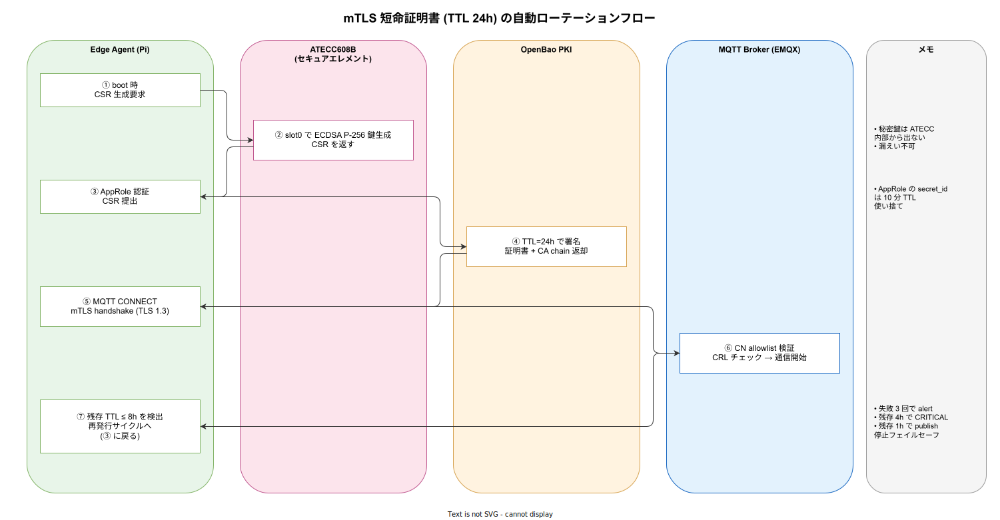
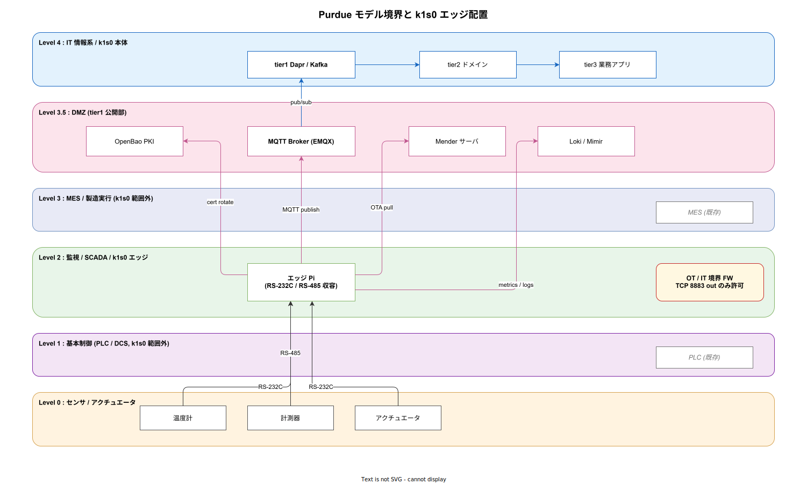

# セキュリティと認証

## 目的

ラズパイを現場に配置して IoT 機器と通信する構成では、OT (Operational Technology) 境界に相当するネットワークセグメントに k1s0 アセットが置かれる。ここでは物理・ネットワーク・ソフトウェアの各レイヤで守るべきコントロールと、tier1 との相互認証 (mTLS + 鍵管理) の設計原則を整理する。本章は IEC 62443-3-3 SL2 相当を到達目標として、各管理策を具体的なコンフィグ・YAML・回路接続レベルまで落として記述する。

本ドキュメントは企画段階の方針であり、実装詳細は ADR に移行して確定する。

---

## 1. 脅威モデル

典型的な脅威を先に明示する。すべてを本ドキュメントで吸収するのではなく、各脅威に対する一次防衛策と検出策を**どのレイヤで**実装するかを決めることが目的。

| 脅威 | 想定される攻撃者 | 一次防衛 | 検出 |
|---|---|---|---|
| 筐体を開けて SD カードを抜き、改竄または窃取 | 現場作業員・侵入者 | LUKS 暗号化 + Secure Boot + 筐体施錠 | 筐体開封センサ、起動時 measurement 検証 |
| USB 経由の不正デバイス挿入 | 現場作業員 | `USBGuard` で allowlist 運用 | auditd ログ |
| ネットワーク経由で Pi の SSH / エージェントに侵入 | 内部・外部攻撃者 | 鍵のみ SSH、iptables deny-by-default、mTLS | auditd + Fluent Bit 集約 |
| エッジエージェントの脆弱性を突かれ、RCE | 外部攻撃者 | 言語選定 (Rust / Go)、依存更新自動化、最小権限 | 既知 CVE スキャン (Trivy 等) |
| 鍵漏えいによるなりすまし | 盗難・転売された Pi | 短命証明書 + 自動ローテ、デバイス失効 | tier1 側の失効リスト (CRL) |
| 中間者攻撃による電文改竄 | ネットワーク盗聴者 | mTLS + 電文 HMAC | tier1 側の署名検証 |
| 平文保存のシークレット露出 | 内部犯行・静的解析 | 起動時に OpenBao から取得、ディスク非永続 | 監査ログ |
| サプライチェーン汚染 (依存ライブラリ・ファームウェア) | 上流 OSS / 配布チャネル攻撃者 | Cosign 署名検証 + SBOM + Renovate | tier1 SBOM レジストリと差分監視 |
| 物理ポート (UART / JTAG) からのデバッグ侵入 | 現場アクセス可能な攻撃者 | 抵抗で物理切断 / `/boot/config.txt` 無効化 | 筐体開封センサ |
| MQTT broker 側からの逆侵入 | broker 侵害 | エッジ側 publish-only ACL、CRL | broker ↔ エッジ方向のパケット監視 |

各項の具体策を以下で展開する。STRIDE で再分類すると、Spoofing → 4 節 mTLS、Tampering → 3 節 Secure Boot + LUKS、Repudiation → 6 節 監査、Information disclosure → 4.2 節 鍵保管、DoS → 5 節 ネットワーク制御、Elevation of privilege → 3.4 節 最小権限、で対応が一通り入る構造になる。

---

## 2. 物理セキュリティ

### 2.1 筐体施錠と開封検知

エッジ筐体は鍵付き、理想的には **改竄検知センサ** (リードスイッチ / フォトセンサ) を組み込み、開封時に tier1 へ通知を飛ばす。Pi の GPIO に入力ピンとして接続し、エージェントの監視スレッドがイベントを拾う。検知時はローカルログに記録し MQTT (retained) で tier1 へ「tamper detected」を送信、同時に鍵を自動失効させる。

具体的な配線例 (リードスイッチ NC タイプ、開封で OPEN):

| 信号 | Pi GPIO | 周辺回路 |
|---|---|---|
| TAMPER_IN | GPIO 17 (pin 11) | 10 kΩ プルアップ to 3.3V、リードスイッチ → GND |
| TAMPER_PWR | 3.3V (pin 1) | スイッチ電源 |
| GND | GND (pin 9) | 共通 GND |

Pi 側のソフト検出は `gpiod` (libgpiod v2) で edge-detect、もしくは `udev` ルール経由で systemd path unit を起動する方式。両者ともサンプリング間隔は 100 ms 以内とし、瞬間開封でも検知できるようにする。

### 2.2 SD カード / USB の取り外し対策

Pi は SD スロットが外部露出しているため、**SD カード抜き出し対策** が必要。実運用では (1) SD カードを接着剤で物理固定、(2) 産業用筐体 (SD アクセス口なし) への組込、(3) eMMC 版 CM4 への移行、のいずれかで対処する。

USB ポートは `USBGuard` で許可リスト運用とする。`/etc/usbguard/rules.conf` の例:

```text
# 既知の管理用 USB シリアル変換のみ許可、それ以外はすべて拒否
allow id 0403:6001 serial "FT5XYZ01" name "FTDI USB Serial"
allow id 10c4:ea60 serial "0001"     name "CP210x Console"
block id *:*
reject id *:* with-interface 03:00:00   # 不正な HID をブロック
```

USBGuard は systemd で常駐させ、IPC ソケット権限を root + `usbgroup` のみに限定する。

### 2.3 電源断対策

PoE HAT + UPS HAT (PiJuice 等) で数分〜数十分の電源保持を実現し、安全シャットダウンを可能にする。電源断頻発は SD 破損を誘発するため、read-only rootfs ([`02_エッジソフトウェアと通信設計.md`](./02_エッジソフトウェアと通信設計.md)) と併せて必ず対応する。UPS HAT は I2C で残量を取得できる製品を選び、20 % 以下で safe shutdown、50 % 以下で警告を tier1 に送る。

### 2.4 物理デバッグポートの無効化

Pi の HDMI / カメラポートは利用しない場合 `/boot/firmware/config.txt` で無効化し、UART は kernel cmdline から `console=serial0` を外す。JTAG は標準 GPIO に割り当てられないため通常は心配無用だが、評価ボード使用時は jumper 位置を固定する。

---

## 3. ブート・OS レベルのセキュリティ

### 3.1 Secure Boot (Pi 5 以降)

Raspberry Pi 5 は EEPROM での Secure Boot をサポートし、OS イメージの署名検証が可能。Pi 4 は非対応のため、**本番で Secure Boot を要求するなら Pi 5 または CM4 で Secure Boot 対応キャリアボード** を選ぶ。本番投入後に鍵をロックし、以後は財団のマスタ鍵と運用側の鍵でのみ OS 更新が可能な状態にする。

Pi 5 の Secure Boot 設定の流れは以下の通り。

1. EEPROM を最新に更新 (`rpi-eeprom-update -a`)。
2. `rpi-eeprom-config --edit` で `SIGNED_BOOT=1` を有効化。
3. 4096-bit RSA 鍵を生成して `rpi-eeprom-digest` で OS イメージに署名。
4. `rpi-eeprom-config --apply` で公開鍵を EEPROM に書き込み、再起動。
5. 動作確認後、`SIGNED_BOOT_LOCK=1` でロック (以降、鍵差し替え不可)。

ロック後の運用ミスは復旧不可となるため、**鍵管理手順書と鍵バックアップ (HSM) を必ず先に整備** する。

### 3.2 LUKS dm-crypt による SD / eMMC 暗号化

root パーティションを LUKS で暗号化する。鍵は (1) TPM 相当のセキュアエレメント (ATECC608B 外付け) に保持するか、(2) ネットワーク経由で OpenBao からオンデマンド取得する tang/clevis 構成とするか、(3) 起動時に手動入力、のいずれか。現場無人運用なら (1) か (2) が現実解。

具体構成パターン:

| 方式 | 解錠タイミング | 必要部品 | 通信断耐性 | 推奨度 |
|---|---|---|---|---|
| ATECC608B + initramfs hook | ローカル | I2C HAT + 鍵プロビジョニング | ◎ (オフラインで起動可) | ◎ |
| clevis + tang + network-bound disk encryption | tang サーバ (拠点 LAN) 到達時 | tang (OpenBao 連携) | × (拠点孤立で起動不可) | ○ |
| OpenBao API + transit unwrap | OpenBao 到達時 | 仮トークン配布 | × | △ |
| 手動パスフレーズ入力 | 起動時の人介在 | — | ◎ | × (無人運用不可) |

Pi には **TPM が内蔵されていない** ため、ここは設計上の弱点になる。ATECC608B / OPTIGA TPM SLB9670 を I2C 接続する HAT (例: LetsTrust TPM、Microchip CryptoAuth Trust Platform) を追加する構成を推奨する。

ATECC608B の I2C 配線:

| 信号 | Pi 側 | ATECC608B 側 |
|---|---|---|
| VCC | 3.3V (pin 1) | VCC |
| GND | GND (pin 6) | GND |
| SDA | GPIO 2 / SDA1 (pin 3) | SDA (4.7 kΩ プルアップ) |
| SCL | GPIO 3 / SCL1 (pin 5) | SCL (4.7 kΩ プルアップ) |

I2C アドレスは出荷時 `0xC0` (R/W ビット込み) でユニーク。`i2cdetect -y 1` で `0x60` として観測される。

LUKS のヘッダ設定 (推奨パラメータ):

```bash
# ヘッダだけは別パーティションに退避 (eMMC 故障時のリカバリ用)
cryptsetup luksFormat /dev/mmcblk0p2 \
  --type luks2 \
  --cipher aes-xts-plain64 \
  --key-size 512 \
  --hash sha256 \
  --pbkdf argon2id \
  --pbkdf-memory 262144 \
  --pbkdf-parallel 4 \
  --pbkdf-force-iterations 4 \
  --header /boot/firmware/luks-header.img
# ATECC608B から鍵を unwrap して LUKS スロットに登録
cryptsetup luksAddKey /dev/mmcblk0p2 \
  --header /boot/firmware/luks-header.img \
  --key-file <(atecc-tool unwrap --slot 1)
```

### 3.3 read-only rootfs

[`02_エッジソフトウェアと通信設計.md`](./02_エッジソフトウェアと通信設計.md) の 3 節参照。セキュリティ観点では「実行中に書き込まれた悪意ファイルが再起動で消える」効果があり、フォレンジック後の復旧も容易。`/data` のみ rw とし、ここに置くファイルは SQLite WAL とログのみに限定する。実行可能ファイルは `/data` から起動できないように `noexec,nosuid,nodev` を付与する。

### 3.4 最小構成 OS

Raspberry Pi OS Lite / Ubuntu Server from scratch から不要パッケージを削除し、**Pi 上で走る systemd unit は 10 個以下** を目安とする。snapd / cloud-init / 各種ヘルパーサービスで不要なものは無効化。`systemd-analyze blame` で起動時に走るサービスを把握し、監査対象を最小化する。

許可する unit のホワイトリスト例:

```text
chronyd.service
nftables.service
ssh.service           # 管理セグメントからのみ到達可
systemd-journald.service
systemd-networkd.service
usbguard.service
fluent-bit.service
node-exporter.service
otel-collector.service
k1s0-edge-agent.service
```

10 個に絞れば cron / postfix / rsyslog / unattended-upgrades / multipathd 等は削除候補。`apt purge` してパッケージそのものを除去する。

---

## 4. 認証と鍵管理

エッジ ↔ tier1 の相互認証はクライアント証明書ベースの mTLS で統一する。設計要点は以下。

エッジから tier1 までの mTLS 短命証明書ローテーションの全体フローを以下に示す。エッジ起動時に ATECC608B で鍵生成 → OpenBao で署名 → MQTT broker で検証、TTL 8h を切ったら再発行に戻る、というループ構造になる。



### 4.1 X.509 クライアント証明書

- **発行**: tier1 の内部 CA (cert-manager + OpenBao PKI エンジン) で Pi ごとに個別発行。CN に device ID (例: `edge-pi-tokyo-001`)、SAN に追加メタデータ。
- **有効期限**: **24 時間〜7 日の短命証明書**。短ければ漏えい時の被害窓が小さく、**自動ローテ**が前提となるため実装上の甘えが発生しにくい。
- **配布**: Pi の初期化時に仮トークンで OpenBao にアクセスし、証明書を取得。以降の更新はクライアント自身が有効期限 2/3 時点で自動更新。
- **失効**: tier1 側で CRL / OCSP を運用。筐体改竄検知・紛失通知時に即時失効。

OpenBao PKI の設定 YAML (Terraform / OpenBao CLI で投入):

```hcl
# 中間 CA をエッジ用に切り出す
resource "vault_mount" "edge_pki" {
  path                      = "pki_edge"
  type                      = "pki"
  default_lease_ttl_seconds = 86400        # 24h 既定
  max_lease_ttl_seconds     = 604800       # 7d 上限
}

# エッジ専用ロール
resource "vault_pki_secret_backend_role" "edge" {
  backend           = vault_mount.edge_pki.path
  name              = "edge-device"
  allowed_domains   = ["edge.k1s0.internal"]
  allow_subdomains  = true
  enforce_hostnames = false
  client_flag       = true
  server_flag       = false
  key_type          = "ec"
  key_bits          = 256
  ttl               = "86400"     # 24h
  max_ttl           = "604800"
  use_csr_common_name = true
  generate_lease    = true
  no_store          = false
  require_cn        = true
  ou                = ["k1s0-edge"]
}

# AppRole 認証 (Pi が起動時に role_id + secret_id で認証)
resource "vault_approle_auth_backend_role" "edge_bootstrap" {
  role_name        = "edge-bootstrap"
  token_policies   = ["edge-pki-issue"]
  secret_id_ttl    = 600         # 10 分以内に消費
  secret_id_num_uses = 1
  token_ttl        = 3600
  token_max_ttl    = 7200
  bind_secret_id   = true
}
```

ローテーション動作:

- エージェント起動時に AppRole 認証 → tier1 OpenBao から証明書を取得。
- 取得した証明書を `/run/k1s0/agent/cert.pem` (tmpfs) に配置。
- 残存 TTL が 1/3 以下になったタイミングで再発行 → MQTT クライアントに reload シグナル。
- 連続失敗 3 回で alert → tier1 のオンコールが介入。

### 4.2 秘密鍵の保管

理想は **セキュアエレメント (ATECC608B / OPTIGA TPM)** で秘密鍵を生成し、外に出さない運用。Pi にこれを追加できない場合、LUKS 暗号化ディスクに保存し、アクセス権は `0600` + 専用 UID。平文で保持しない。

ATECC608B 利用時の鍵保持パターン:

| スロット | 用途 | 設定 |
|---|---|---|
| 0 | デバイスアイデンティティ用 ECDSA P-256 鍵 | private, never_extractable |
| 1 | LUKS unwrap 用 AES-256 鍵 | private, no_export |
| 2 | TLS クライアント証明書用 ECDSA P-256 鍵 | private, never_extractable |
| 3〜7 | 予備 / 将来拡張 | — |

ATECC608B の `slot.config` は工場出荷時に設定し、その後はロックする (再変更不可)。鍵生成は ATECC 内部のハードウェア乱数生成器を使う。

### 4.3 MQTT broker 側の検証

EMQX などの MQTT broker 側で (1) CN による allowlist、(2) 発行 CA の検証、(3) CRL チェック、(4) ACL (クライアント ID ごとの publish/subscribe 権限) を設定。Pi が不正 topic に publish しようとしたら拒否される設計。

EMQX の ACL 設定例 (HOCON フォーマット):

```hocon
# emqx-acl.conf : CN ベースの publish-only ACL
{ allow, { client, { cn_match, "edge-pi-.*" } }, publish,   ["k1s0/+/+/${clientid}/data",  "k1s0/+/+/${clientid}/state"] }
{ allow, { client, { cn_match, "edge-pi-.*" } }, subscribe, ["k1s0/+/+/${clientid}/cmd"] }
{ allow, { client, { cn_match, "edge-pi-.*" } }, publish,   ["k1s0/+/+/${clientid}/$LWT"] }
{ deny,  all }
```

CRL は EMQX の `ssl.verify` に `verify_peer + crl_check`、`crl_url` を OpenBao の CRL エンドポイントに向ける。失効反映までの最大時間は 5 分 (EMQX キャッシュ有効期間) を目安にする。

### 4.4 シークレット取得 (Dapr Secrets / OpenBao)

Dapr を使う場合は Dapr Secrets building block 経由で OpenBao から取得、Pod 環境変数・ボリューム共に平文ファイルを持たない。Dapr を使わない案 A では、エージェント起動時に直接 OpenBao API をコールし、メモリ上にのみ保持する。

```yaml
# Dapr Secret Component (OpenBao)
apiVersion: dapr.io/v1alpha1
kind: Component
metadata:
  name: openbao-secrets
spec:
  type: secretstores.hashicorp.vault
  version: v1
  metadata:
    - name: vaultAddr
      value: https://openbao.k1s0.internal:8200
    - name: enginePath
      value: kv-edge
    - name: vaultTokenMountPath
      value: /run/k1s0/agent/vault-token  # AppRole で取得済み
    - name: tlsServerName
      value: openbao.k1s0.internal
    - name: caCert
      value: /etc/k1s0-agent/openbao-ca.pem
```

---

## 5. ネットワーク分離

### 5.1 OT / IT セグメント境界

工場 LAN (OT) と情報系 LAN (IT) は Purdue モデル Level 2/3 境界で分離するのが業界標準。ラズパイは Level 2 (制御システム) に置き、tier1 (Level 3.5 DMZ または Level 4 IT) とは **明示的な許可ルール** のみで通信する。境界のファイアウォールで Pi → tier1 の MQTT/HTTPS ポートのみ開放する。



| Purdue Level | 役割 | k1s0 配置 |
|---|---|---|
| 0 | センサ・アクチュエータ | RS-232C / RS-485 機器 |
| 1 | 基本制御 (PLC) | (k1s0 範囲外) |
| 2 | 監視・SCADA | **エッジ Pi** ← ここに配置 |
| 3 | MES / 製造実行 | 既存基幹 |
| 3.5 | DMZ | tier1 broker / OpenBao を一部公開 |
| 4 | IT 情報系 | k1s0 本体クラスタ |

エッジ → tier1 は Level 2 → Level 3.5 越境で、ファイアウォールで TCP/8883 (MQTT TLS) のみ open。逆方向はすべて deny。

### 5.2 Pi ローカル nftables

Pi 上でも `nftables` で deny-by-default を敷く。許可するフローは (1) 出力: tier1 broker、NTP、OpenBao、Fleet 管理サーバー、(2) 入力: SSH (管理セグメントから)、ヘルスチェック (ローカルループバック)。

```nft
# /etc/nftables.conf : エッジ Pi のデフォルト deny ルールセット
table inet k1s0 {
    set tier1_endpoints {
        type ipv4_addr
        elements = { 10.20.0.10, 10.20.0.11 }   # MQTT broker
    }
    set mgmt_subnets {
        type ipv4_addr; flags interval
        elements = { 10.99.0.0/24 }             # 管理踏み台 NW
    }
    chain input {
        type filter hook input priority 0; policy drop;
        iif lo accept
        ct state established,related accept
        ip saddr @mgmt_subnets tcp dport 22 accept comment "ssh from mgmt only"
        ip protocol icmp icmp type echo-request accept
        log prefix "nft-drop-in: " level warn limit rate 5/minute
    }
    chain output {
        type filter hook output priority 0; policy drop;
        oif lo accept
        ct state established,related accept
        ip daddr @tier1_endpoints tcp dport 8883 accept comment "mqtt tls"
        udp dport 123 accept comment "ntp"
        tcp dport 8200 ip daddr 10.20.0.20 accept comment "openbao"
        tcp dport 9000 ip daddr 10.20.0.30 accept comment "mender"
        udp dport 53 accept comment "dns"
        log prefix "nft-drop-out: " level warn limit rate 5/minute
    }
    chain forward {
        type filter hook forward priority 0; policy drop;
    }
}
```

deny ログは 5/minute に rate-limit して journald にだけ流し、Fluent Bit 側で集約・送信する。

### 5.3 管理アクセス

SSH は **公開鍵のみ**、パスワード認証は禁止。管理用踏み台は Tailscale / Cloudflare Tunnel / WireGuard 等で接続。現場作業員向けの USB シリアルコンソールを追加する場合は別途セッション記録を仕込む。

`/etc/ssh/sshd_config.d/00-k1s0.conf`:

```text
PasswordAuthentication no
KbdInteractiveAuthentication no
PermitRootLogin no
PubkeyAuthentication yes
AuthorizedKeysFile /etc/ssh/authorized_keys/%u
AllowGroups ops
ClientAliveInterval 60
ClientAliveCountMax 3
MaxAuthTries 3
LoginGraceTime 30
X11Forwarding no
AllowTcpForwarding no
PermitTunnel no
HostKeyAlgorithms ssh-ed25519,rsa-sha2-512
KexAlgorithms curve25519-sha256@libssh.org,curve25519-sha256
Ciphers chacha20-poly1305@openssh.com,aes256-gcm@openssh.com
MACs hmac-sha2-512-etm@openssh.com
```

OpenBao SSH CA を運用すれば、踏み台側で短期 (1 時間) の SSH 証明書を発行 → エッジは AuthorizedPrincipals で受ける構成にできる。これにより authorized_keys を機器ごとに撒く運用が消える。

### 5.4 産業プロトコルの暗号化

Modbus RTU は **暗号化されない** ため、Pi ↔ 機器のセグメントは物理的に分離する (同一 LAN に IT 端末を混ぜない)。必要に応じて Modbus TCP over TLS (Modbus/TCP Security, IEC 62443-3-3) の機器への段階移行も検討する。

### 5.5 NTP のセキュリティ

NTP 自体は UDP/123 で平文。改竄に弱いため、可能であれば NTS (Network Time Security, RFC 8915) 対応の上位 NTP サーバを使う。chrony は v4.0+ で NTS をサポート。閉域では拠点内 NTP サーバ (PTP grand master 兼) を信頼ルートにする。

---

## 6. 監査と検出

エッジから tier1 へ **auditd + Fluent Bit** で以下のイベントを集約する。

- sshd ログ (接続成功/失敗)
- sudo / su 実行
- systemd-journal (エージェント) のエラーログ
- USB デバイス挿入 (`udev` / USBGuard)
- 筐体改竄センサのイベント
- LUKS のアンロック失敗
- エージェント内部の config reload / 鍵ローテ
- nftables drop ログ (rate-limited)

tier1 側では Loki + Grafana で検索可能にし、特定パターン (複数回ログイン失敗 / 筐体 tamper / 証明書エラー) を Alertmanager 経由で通知する。

### 6.1 監査ログの共通スキーマ

エッジ → tier1 で送る監査イベントは以下の JSON 形式で統一する。ログから直接インシデント分析できる粒度を確保する。

```json
{
  "ts": "2026-04-15T03:21:18.412Z",
  "edge_id": "edge-pi-saitama-001",
  "site": "saitama",
  "category": "auth | access | tamper | crypto | network | agent | system",
  "severity": "info | warn | error | critical",
  "event": "ssh_login_failed",
  "source": {
    "process": "sshd",
    "pid": 1234
  },
  "actor": {
    "user": "ops",
    "remote_addr": "10.99.0.55",
    "auth_method": "publickey"
  },
  "target": {
    "host": "edge-pi-saitama-001"
  },
  "outcome": "denied",
  "details": {
    "fingerprint": "SHA256:....",
    "reason": "key_not_in_authorized_keys"
  },
  "trace_id": "...optional...",
  "schema_version": "1"
}
```

主要イベントの `event` 値:

| category | event | severity |
|---|---|---|
| auth | ssh_login_succeeded / ssh_login_failed | info / warn |
| auth | sudo_executed | info |
| access | usb_inserted_allowed / usb_inserted_blocked | info / warn |
| tamper | enclosure_opened / enclosure_closed | critical / info |
| crypto | luks_unlock_failed | critical |
| crypto | cert_rotation_succeeded / cert_rotation_failed | info / error |
| network | nftables_drop_burst | warn |
| network | mqtt_tls_handshake_failed | warn |
| agent | config_reloaded / config_reload_failed | info / error |
| agent | publish_rate_exceeded | warn |
| system | reboot / shutdown / kernel_panic | info / critical |

### 6.2 Fluent Bit パイプライン

Fluent Bit を systemd journal → tier1 Loki への送信に使う。設定例:

```ini
# /etc/fluent-bit/fluent-bit.conf
[SERVICE]
    Flush         5
    Daemon        Off
    Log_Level     warn
    Parsers_File  parsers.conf
    HTTP_Server   On
    HTTP_Listen   127.0.0.1
    HTTP_Port     2020

[INPUT]
    Name              systemd
    Tag               host.*
    Systemd_Filter    _SYSTEMD_UNIT=k1s0-edge-agent.service
    Systemd_Filter    _SYSTEMD_UNIT=ssh.service
    Systemd_Filter    _SYSTEMD_UNIT=usbguard.service
    Read_From_Tail    On
    DB                /data/fluent-bit-systemd.db

[INPUT]
    Name              tail
    Path              /var/log/audit/audit.log
    Parser            audit
    Tag               audit.*
    DB                /data/fluent-bit-audit.db

[FILTER]
    Name              modify
    Match             *
    Add               edge_id   ${EDGE_ID}
    Add               site      ${SITE}

[OUTPUT]
    Name              loki
    Match             *
    Host              loki.k1s0.internal
    Port              3100
    Tls               On
    Tls.verify        On
    Tls.ca_file       /etc/k1s0-agent/ca.pem
    Tls.crt_file      /etc/k1s0-agent/client.pem
    Tls.key_file      /etc/k1s0-agent/client-key.pem
    Labels            edge_id=$edge_id,site=$site,unit=$_SYSTEMD_UNIT
    Auto_Kubernetes_Labels off
    Line_Format       json
```

ローカルバッファは `/data/fluent-bit-*.db` に持たせ、NW 断時にも欠損しない構成。

### 6.3 監査ログ保管期間

保管期間と場所のデフォルト:

| データ種別 | エッジ保持 | tier1 保持 | 根拠 |
|---|---|---|---|
| 認証ログ (sshd, sudo) | 7 日 (循環) | 1 年 (Loki + S3 ティア) | インシデント調査の標準窓 |
| 改竄検知イベント | 30 日 (循環) | 7 年 (S3 cold) | 物的証拠としての保全 |
| エージェント運用ログ | 3 日 (循環) | 90 日 (Loki) | 障害解析窓 |
| メトリクス (Prometheus) | 3 日 (循環) | 1 年 (Mimir) | キャパ計画 |

業界規制 (PCI-DSS / SOX / 改正電子帳簿保存法) で異なる要件が出る場合は別途調整。

---

## 7. インシデント対応

- **鍵漏えい疑義**: 対象 device ID の証明書を CRL 登録、EMQX の ACL から除外、Pi に rauc で緊急ファームウェアを push して鍵再生成。手順書を事前整備。
- **Pi 紛失**: 同上 + SIM/ネットワーク経由で無効化。LUKS + 短命証明書で被害窓を最小化。
- **OS 脆弱性**: 依存 OSS を Renovate で自動更新、重大 CVE は fleet 管理経由で緊急配信 ([`04_運用ライフサイクルと観測性.md`](./04_運用ライフサイクルと観測性.md))。
- **不審挙動検出**: Agent 内に **送信レート異常** 検知 (指定閾値を超えた publish 回数) を入れ、tier1 側で別経路の警告を飛ばす。

### 7.1 標準対応プレイブック (要旨)

| インシデント | 検出 | 初動 (15 分以内) | 復旧 | 事後 |
|---|---|---|---|---|
| 鍵漏えい疑義 | 証明書失効申請 / 異常 publish | CRL 登録 + ACL 除外 | rauc 緊急 push で鍵再生成 | フォレンジック + RCA |
| Pi 物理盗難 | tamper 検知 + LWT offline | CRL 登録 + ネットワーク無効化 | 代替機キッティング | 物理運用見直し |
| 重大 CVE | Trivy / GitHub Advisory | 影響評価 → MAINT 期間 push | rauc rollout (canary 10 % → 全台) | SBOM 更新 |
| ネットワーク遅延 | RTT p99 アラート | toxic シナリオ識別 | 該当拠点ネットワーク調査 | キャパ調整 |
| ディスクフル | `/data` > 90 % | 古い WAL を強制 truncate | replay スループット調整 | TTL ポリシー見直し |

### 7.2 RACI

| 役割 | 鍵漏えい | Pi 盗難 | OS 脆弱性 |
|---|---|---|---|
| エッジ運用チーム | A, R | A, R | C |
| tier1 運用チーム | C | C | A, R |
| セキュリティ統括 | C | C | C |
| ユーザー側現場担当 | I | I | I |

(R: 責任実行、A: 説明責任、C: 協議、I: 報告)

---

## 8. 適合可能性のあるコンプライアンス

ユーザー業界や契約により以下の枠組みへの整合が求められる場合がある。設計段階で先に意識しておくと後戻りが少ない。

- **IEC 62443-3-3 / 4-2**: 産業オートメーション制御システムのセキュリティ。k1s0 エッジは SL2 相当を目標とするのが現実的。
- **ISO/IEC 27001**: 情報セキュリティマネジメント。tier1 側監査証跡と合わせて運用。
- **NIST SP 800-82 r3**: OT セキュリティガイド。Purdue モデルの採用、補償統制の指針として参照。
- **CRA (Cyber Resilience Act, EU)**: 2027 年以降の EU 市場向け IoT デバイスで SBOM・脆弱性対応義務。国内展開のみでも SBOM 整備は推奨。

### 8.1 IEC 62443-3-3 SL2 マッピング

主要要件 (Foundational Requirement, FR) と本ドキュメントの該当節の対応。

| FR | SL2 要件 | 本章の対応 |
|---|---|---|
| FR1 (Identification & Authentication Control) | ヒト・機器の識別 / 認証 | 4.1 mTLS, 5.3 SSH 鍵 |
| FR2 (Use Control) | 認可 / 権限制御 | 4.3 ACL, 5.2 nftables |
| FR3 (System Integrity) | 改竄防止 / 検知 | 2.1 tamper, 3.1 Secure Boot, 3.2 LUKS |
| FR4 (Data Confidentiality) | 通信・保管時の暗号化 | 3.2 LUKS, 4 mTLS, 6.2 Loki TLS |
| FR5 (Restricted Data Flow) | セグメント境界 | 5.1 Purdue, 5.2 nftables |
| FR6 (Timely Response to Events) | 監査・検出・通知 | 6 監査, 7 インシデント |
| FR7 (Resource Availability) | 可用性 / DoS 耐性 | 2.3 UPS, [`02`](./02_エッジソフトウェアと通信設計.md) ストア&フォワード |

SL2 にはこれら FR で「悪意のあるカジュアル攻撃者を低リソースで阻止」できる水準を要求される。本章の管理策で原則カバーできるが、FR3 は Pi 4 で Secure Boot が無いため**機器選定段階で SL2 達成可否が分岐**する。

### 8.2 SBOM (CRA / NTIA Minimum Elements)

エージェントのバイナリと依存ライブラリは SBOM (CycloneDX 形式) を CI で生成し、tier1 SBOM レジストリに登録する。`syft` / `cargo cyclonedx` / `cyclonedx-gomod` で生成。Trivy で日次スキャン、`vex` で誤検知を抑止する。

---

## 9. 未確定事項

- ユーザー環境の OT/IT 境界構成 (ファイアウォール製品、VLAN 構成)。
- Pi にセキュアエレメント (TPM/ATECC) を追加する前提で良いか、鍵管理の簡略化で妥協するか。
- 筐体改竄検知の物理設計 (センサ種別、配線)。
- SSH 管理経路 (踏み台・Tailscale 等) の選定。
- 監査ログの保管期間と保管場所の法規上の要件。
- 契約上の適合性要件 (IEC 62443 / ISO 27001 等) の有無。
- Secure Boot 要件 (Pi 4 で妥協できるか / Pi 5 必須か)。
- 短命証明書 TTL の業務妥協点 (24h / 7d) と更新失敗時の業務影響許容度。

これらを埋めた上で、脅威モデルの表を具体型に落とし ADR 化する。
