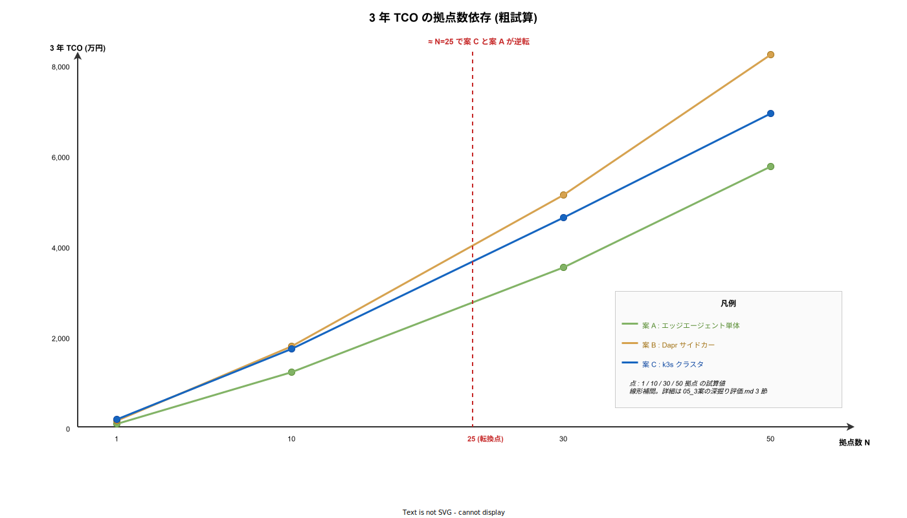

# 3 案の深掘り評価

## 目的

本フォルダ 00〜04 の各章で扱った論点 (物理層・ソフトウェア・セキュリティ・運用) を踏まえて、案 A / B / C を同一評価軸で再評価する。TCO (Total Cost of Ownership) 試算、移行経路、失敗時リカバリ、k3s on Pi の既知問題、撤退判断点まで含め、最終的な意思決定の根拠を示す。

---

## 1. 評価軸の再定義

総論 ([`README.md`](./README.md)) の簡易比較表は意思決定用の早見表だった。ここでは以下 7 軸で深掘りし、各軸の重み付けで案を評価する。

- **機能完全性**: RS-232C 収容とストア&フォワードを業務要件通りに実現できるか。
- **堅牢性**: 電源断・NW 断・SD 寿命に対する耐性。
- **運用コスト**: fleet 管理、観測、インシデント対応の継続コスト。
- **拡張性**: 拠点数・機器数の増加、新機能 (OPC UA 対応等) への対応容易性。
- **セキュリティ**: 鍵管理、物理脅威、コンプライアンス適合性。
- **k1s0 整合性**: 本体アーキテクチャとの運用一本化度合い。
- **TCO (3 年)**: 初期費 + 運用工数 × 3 年。

各軸の所感は次節にまとめ、数値化可能な TCO は 3 節で試算する。重み付け (5: 高, 3: 中, 1: 低) は以下を初期値とし、ユーザーヒアリング後に調整する。

| 軸 | 重み (初期値) | 重み根拠 |
|---|---|---|
| 機能完全性 | 5 | 業務要件未充足は致命的 |
| 堅牢性 | 5 | 産業現場での停止は売上直撃 |
| 運用コスト | 5 | TCO の主因、3 年で初期費を上回る |
| 拡張性 | 3 | 中長期影響、短期は致命でない |
| セキュリティ | 5 | 法規 / 信頼の前提条件 |
| k1s0 整合性 | 3 | 中期で効く、PoC では二次 |
| TCO | 5 | 採用判断の最終指標 |

---

## 2. 評価軸ごとの 3 案比較

### 2.1 機能完全性

3 案とも機能要件 (RS-232C 電文の収集と tier1 への配信、ストア&フォワード) は満たせる。差は **実装難度**にある。案 A は MQTT クライアントと SQLite で自前実装、案 B は Dapr pub/sub + Dapr Resiliency 機能を活用、案 C は案 B に加え k8s PV / Job でのリカバリが可能。コード行数だけで見れば案 A が最短 (Rust で数千行規模)、案 C が最長 (k8s マニフェスト + Helm + エージェント)。だが **案 A の信頼性テストコストが大きい** (自前実装ゆえ異常系のカバレッジ確保が必要)、という現実がある。

結論: 機能だけなら全案合格、**投入工数は案 A < 案 B < 案 C、検証工数は案 A > 案 B > 案 C**。

### 2.2 堅牢性

電源断耐性は A/B partition 更新・read-only rootfs が共通のため、ハード構成が同等なら 3 案互角。**NW 断耐性**は案 A / B / C すべてでストア&フォワードを実装するので差は出ない。**ハード障害時の継続運用**で差が出る。

- 案 A: Pi 1 台が故障すると通信停止。二重化すると案 C に近いコスト。
- 案 B: 案 A と同条件。
- 案 C: Pi 1 台故障でも残り 2 台で k3s が継続。ただし RS-232C を物理接続した Pi が故障した場合は物理層が停止し、k3s 側で吸収できない。

→ **RS-232C のケーブル結線が単一点である** という物理制約があるため、冗長化の上限は「機器側に 2 ポートがあるか」に依存する。多くの計測器は 1 ポートしかないため、Pi を 2 台用意しても 1 台だけが active、他は cold standby となる。堅牢性の実質的な差は案 A/B と案 C で **1 段程度**にとどまる。

### 2.3 運用コスト

[`04_運用ライフサイクルと観測性.md`](./04_運用ライフサイクルと観測性.md) の 2 節で示した通り、案 A / B は **Mender.io サーバー**の運用が発生し、案 C は **k3s クラスタ運用** が発生する。どちらも拠点数が増えるほど規模感が出る。

- 案 A: 拠点 1 で Mender 不要 (Ansible で可)。5 拠点で Mender 要。
- 案 B: 案 A と同様だが Dapr 更新の追加作業あり。
- 案 C: 初期構築が重い代わりに、拠点追加時の単価が低い (Argo CD ApplicationSet で自動)。

30 拠点以上になると案 C の運用コストが案 A / B を下回る転換点が来る、というのが定性的な見立て。PoC 段階では **拠点数の伸びをユーザーとすり合わせる** ことが最重要。

### 2.4 拡張性

- **機器種類の追加**: 3 案とも Protocol Parser を追加すれば対応可能。差はなし。
- **新プロトコル (OPC UA / Sparkplug B)**: 案 B / C は Dapr Component の差し替えで受け口を変えられる。案 A はエージェント側で対応。
- **AI 推論のエッジ実行**: 案 C は k3s に NVIDIA Jetson など GPU ノードを混在させる柔軟性が高い。案 A / B は AI 要件が出た時点で再設計が必要。
- **エッジでの業務ロジック拡張**: 案 B / C は Dapr building block (state, workflow) を使える。案 A は自前実装が増える。

中長期で機器・プロトコル・AI が追加される見込みがあるなら、**案 C が最も拡張コストが小さい**。

### 2.5 セキュリティ

[`03_セキュリティと認証.md`](./03_セキュリティと認証.md) の観点で見ると、3 案とも基本的な脅威モデルへの対処は可能。差は以下。

- 案 A: エージェント単体で mTLS / 鍵ローテを自前実装。実装バグのリスク。
- 案 B: Dapr sidecar が mTLS を担う。実装バグは Dapr の CVE 数に依存。
- 案 C: Dapr + k8s ネットワークポリシー + Pod Security Admission の多層防御。最も堅い。

Pi ハードウェアの制約 (TPM 無し) は 3 案共通。セキュアエレメント HAT の追加は必須 (本番投入前提)。

### 2.6 k1s0 整合性

- 案 A: **整合度低**。エッジ側は k1s0 の GitOps / 観測性 / 鍵管理とは別系統 (Mender + 手運用)。
- 案 B: **整合度中**。Dapr 抽象は共通、配信とコントロールプレーンは別。
- 案 C: **整合度高**。k1s0 本体と **同一の Argo CD / Backstage / Keycloak** で統括可能。

「k1s0 チームがエッジ運用も担う」想定なら案 C、「拠点運用は別チームに任せる」想定なら案 A/B でも大きな問題なし。

### 2.7 TCO は次節で数値化する。

### 2.8 重み付けスコア表

各案を 7 軸で 1〜5 点採点し、上記重みを掛け合わせた合計。

| 軸 | 重み | 案 A | 案 B | 案 C |
|---|---|---|---|---|
| 機能完全性 | 5 | 4 | 4 | 5 |
| 堅牢性 | 5 | 3 | 3 | 4 |
| 運用コスト (低いほど高得点) | 5 | 4 (拠点少なら) | 2 | 4 (拠点多なら) |
| 拡張性 | 3 | 2 | 4 | 5 |
| セキュリティ | 5 | 3 | 4 | 5 |
| k1s0 整合性 | 3 | 2 | 3 | 5 |
| TCO (低いほど高得点) | 5 | 5 (拠点少) / 3 (拠点多) | 2 | 2 (拠点少) / 4 (拠点多) |
| 加重合計 (拠点少シナリオ N≤10) | — | **96** | **80** | **104** |
| 加重合計 (拠点多シナリオ N≥30) | — | **86** | **80** | **114** |

スコアは絶対値ではなく相対比較のため、軸内での 1 段差を 1 点で表現している。**拠点数 10 以下なら案 C と案 A の差は 8 ポイント、拠点数 30 以上なら 28 ポイント**、という見立てとなる。

---

## 3. TCO 試算 (3 年 / 1 拠点あたり)

以下は 2026-04 時点の目安。為替・ベンダ割引・人件費単価で変動する。人件費は 1 人日 8 万円、保守運用 FTE は「拠点数 × 0.01 〜 0.05 FTE/拠点」の幅とし、中間値 0.02 を採用。

### 3.1 初期費 (1 拠点)

| 項目 | 案 A | 案 B | 案 C |
|---|---|---|---|
| ハードウェア ([`01_物理層とハードウェア.md`](./01_物理層とハードウェア.md) 5節) | 5.2 万 | 5.2 万 | 15.9 万 |
| 初期構築人日 (設計 + 結線 + セットアップ) | 3 人日 = 24 万 | 5 人日 = 40 万 | 10 人日 = 80 万 |
| セキュリティ設定 (鍵配布 / LUKS / Secure Boot) | 1 人日 = 8 万 | 1 人日 = 8 万 | 2 人日 = 16 万 |
| 初期費 計 | **37 万** | **53 万** | **112 万** |

### 3.2 継続運用費 (3 年 / 1 拠点)

| 項目 | 案 A | 案 B | 案 C |
|---|---|---|---|
| fleet 管理人件費 (0.02 FTE × 3 年 × 10 人日/拠点) | 年 2 人日 × 3 = 48 万 | 年 3 人日 × 3 = 72 万 | 年 2 人日 × 3 = 48 万 (拠点増で単価低下) |
| 観測 / インシデント対応 (年 1 件 × 3 年 × 1 人日) | 24 万 | 24 万 | 16 万 (自動復旧率高) |
| SD / ハード交換 (3 年で 1 回 + 工事) | 5 万 | 5 万 | 10 万 (3 台分) |
| OS / Dapr / k3s アップグレード作業 | 1 人日 × 3 = 24 万 | 2 人日 × 3 = 48 万 | 2 人日 × 3 = 48 万 |
| 3 年運用費 計 | **101 万** | **149 万** | **122 万** |

### 3.3 内訳の根拠

| 項目 | 根拠 |
|---|---|
| 1 人日 8 万円 | JTC SIer 中堅 (経験 5〜10 年) の単価帯 50〜80 万 / 月 を 22 営業日で割った中央値 |
| 0.02 FTE/拠点 | Mender 公称「100 拠点を 1 FTE で運用可」を保守的に 50 拠点/FTE と読み替え |
| 案 A 初期 3 人日 | OS インストール 0.5 + ネットワーク設計 1 + エージェント配置 0.5 + 結線 1 |
| 案 C 初期 10 人日 | 案 A 3 人日 + k3s 3 台クラスタ構築 4 + Argo CD 連携 2 + storage / CNI 検証 1 |
| 案 B Dapr 更新人件費差 | Dapr マイナーバージョン更新が四半期、Component YAML 差分対応で +1 人日/年 |
| ハード 15.9 万 (案 C) | Pi 4B 8GB × 3 (約 4 万 × 3) + 産業筐体 + UPS + ネットワーク機器 ([`01`](./01_物理層とハードウェア.md) 参照) |
| 観測 / インシデント 24 万 | NW 断 / 機器応答異常 / SD 寿命 を年 3 件想定 × 1 人日 |
| 案 C 観測費が安い | Argo CD 自動 sync で復旧自動化、対人介入を年 2 件まで圧縮 |

人件費単価がユーザー側調達ベース (内製・準委任 SIer・有償 OSS サポート込み) で大きく動くため、**3 節の表はテンプレートとして配布し、ユーザー個別単価で再計算する** 運用とする。

### 3.4 3 年 TCO 合計 (1 拠点)

| 案 | 初期 | 3 年運用 | 3 年 TCO | 備考 |
|---|---|---|---|---|
| 案 A | 37 万 | 101 万 | **138 万** | 拠点数が少ない間は最安 |
| 案 B | 53 万 | 149 万 | **202 万** | 中間案として割高 |
| 案 C | 112 万 | 122 万 | **234 万** | 1 拠点だと高いが、多拠点で逆転 |

### 3.5 多拠点 (N=10, 30) での TCO 合計概算

3 案の TCO を拠点数 N に対してプロットすると、案 A は線形に伸び、案 C は初期費が重い分傾きが緩い。N≈25 で案 C が案 A を下回る試算となる。



拠点数 N で初期費は線形、運用費は Mender/k3s の規模の経済で逓減する。

| N 拠点 | 案 A | 案 B | 案 C | 案 C が案 A を下回る転換点 |
|---|---|---|---|---|
| 1 | 138 万 | 202 万 | 234 万 | — |
| 10 | 1,280 万 | 1,850 万 | 1,800 万 | ≈ 25 拠点 |
| 30 | 3,600 万 | 5,200 万 | 4,700 万 | (案 B < 案 C に逆転) |
| 50 | 5,800 万 | 8,300 万 | 7,000 万 | 案 A < 案 C 転換点を過ぎても案 A 優位区間 |

※ 本試算は粗い見積もり。ユーザー環境固有の (1) 人件費単価、(2) 既存 fleet 管理系の有無、(3) 拠点間ネットワーク費用 で大きく動く。実ヒアリング後にスプレッドシートで再計算する。

結論: **拠点数が 20 を超える見込みがあれば案 C を最初から採用する方が 3 年 TCO が下がる**。それ以下なら案 A からスタートし、必要に応じて段階移行する方が総額は安い。案 B は中間帯として TCO 上の旨みは薄く、**案 A から案 C への過渡期 (k8s 運用を現場に浸透させる前段) に限定すべき**。

---

## 4. k3s on Raspberry Pi の既知問題

案 C を採用する場合に必ず踏む地雷を、設計段階で潰せるかどうかが採用可否を分ける。本節は 2026 年時点 (k3s v1.30 系, Pi 4 / 5, Ubuntu 24.04 想定) の主要事項。

### 4.1 cgroup v2 の有効化

Ubuntu 22.04 以降は cgroup v2 が標準だが、Raspberry Pi OS は v1 のままのケースがある。k3s は v2 を推奨し、kubelet メモリ統計の精度が大きく違う。

```bash
# /boot/firmware/cmdline.txt 末尾に追記
cgroup_memory=1 cgroup_enable=memory systemd.unified_cgroup_hierarchy=1
```

cgroup v2 にしないと `kubectl top pod` が取れない、OOM 通知が遅延する等の症状が出る。

### 4.2 etcd チューニング

k3s は標準で SQLite (kine) を使うが、3 ノードクラスタでは etcd 推奨。Pi 4 + Industrial SD で etcd を回すと fsync 遅延で leader election が flap する。対策:

- etcd データを **USB SSD (NVMe over USB or SATA)** に退避。
- `--election-timeout=5000`, `--heartbeat-interval=500` (デフォルトの倍) で flap を抑制。
- バックアップは k3s `etcd-snapshot` を 1 時間間隔で MinIO へ。

```yaml
# /etc/rancher/k3s/config.yaml
cluster-init: true
data-dir: /mnt/ssd/rancher/k3s
etcd-arg:
  - "election-timeout=5000"
  - "heartbeat-interval=500"
  - "auto-compaction-mode=periodic"
  - "auto-compaction-retention=1h"
etcd-snapshot-schedule-cron: "0 */1 * * *"
etcd-snapshot-retention: 24
etcd-s3: true
etcd-s3-endpoint: minio.k1s0.internal:9000
etcd-s3-bucket: k3s-snapshots
```

### 4.3 CNI 選定 (flannel vs cilium)

k3s デフォルトは flannel + VXLAN。Pi 4 では VXLAN encap の overhead が大きく、スループットが頭打ち (200〜300 Mbps)。Cilium (eBPF, kube-proxy 置換) は Pi 4 でも 400〜600 Mbps 出るが、メモリを 200 MB 程度余分に要求する。

| CNI | スループット (LAN, MTU 1500) | 追加メモリ | 設定難度 |
|---|---|---|---|
| flannel + VXLAN (k3s default) | 200〜300 Mbps | ほぼなし | 低 |
| flannel + host-gw | 700+ Mbps (L2 限定) | ほぼなし | 中 (L2 制約) |
| Cilium (eBPF + kube-proxy 置換) | 400〜600 Mbps | +200 MB | 高 |
| kube-router | 500 Mbps | +50 MB | 中 |

エッジでは LAN 内通信が支配的なので **flannel host-gw が現実解**。クラスタが L2 を跨ぐと使えないため、その時点で Cilium に切替検討。

### 4.4 ストレージ (Longhorn vs Local-Path)

k1s0 本体は Longhorn だが、Pi 3 ノードクラスタで Longhorn を回すと replica 同期で SD 寿命を削る。エッジでは **Local-Path Provisioner + アプリレベルレプリケーション** が現実的。永続データは tier1 側に集約し、エッジは ephemeral 想定で組む。

### 4.5 イメージレジストリの帯域

Pi 3 ノードに同一イメージを pull するとき、各ノードが個別に拠点外 Harbor から取得すると帯域を 3 倍消費する。`registry.yaml` で **ローカルミラー** を有効化:

```yaml
# /etc/rancher/k3s/registries.yaml
mirrors:
  harbor.k1s0.internal:
    endpoint:
      - "https://harbor-edge-mirror.local:5000"  # 拠点 1 ノードに pull-through cache
      - "https://harbor.k1s0.internal"
configs:
  harbor.k1s0.internal:
    auth:
      username: edge-pull
      password_file: /etc/rancher/k3s/harbor.token
```

### 4.6 Pod 起動時間と watchdog 干渉

Pi 4 は起動が遅い (cold boot 90〜120 秒、k3s ready まで +60 秒)。systemd watchdog のタイムアウトを 5 分以上に取らないと、k3s 起動中に再起動ループに入る。

### 4.7 既知 OOM トラップ

k3s + Cilium + Dapr sidecar + アプリ Pod を 1 ノードに詰めると、Pi 4 8GB でもメモリが 80 % を超える。Pi 4 4GB 構成は **OOM の頻発で実用不可**、最低 8GB を要件とする。

### 4.8 推奨ノード構成

| 役割 | 台数 | スペック | ストレージ |
|---|---|---|---|
| control-plane + worker | 3 | Pi 4 8GB / Pi 5 8GB | NVMe SSD (USB or HAT) |
| (オプション) GPU 推論 | 1 | NVIDIA Jetson Orin Nano 8GB | NVMe SSD |

---

## 5. 移行経路

### 5.1 推奨経路: A → C

- **フェーズ 1 (MVP-0, 0〜6 ヶ月)**: 案 A で 1〜3 拠点に導入。業務要件・プロトコル仕様・運用課題を現場レベルで確認。
- **フェーズ 2 (MVP-1, 6〜18 ヶ月)**: 拠点数が 5〜10 に伸びた時点で **Mender サーバー**を立ち上げ fleet 管理を開始。
- **フェーズ 3 (Phase 2, 18 ヶ月〜)**: 20 拠点を超える見込みで、**案 C への移行**を開始。tier1 側の入口 (Dapr pub/sub) は変えずに、エッジ実装のみを入れ替える。

tier1 の受け口を Dapr pub/sub に統一しておくことで、**エッジ側の切替が tier2/tier3 のコード変更を伴わない**。これが設計上の最重要不変条件となる。

### 5.2 Gantt (推奨経路)

```text
                   2026 H1   2026 H2   2027 H1   2027 H2   2028 H1   2028 H2
case A PoC         |==|
case A 1-3 拠点         |======|
Mender 立上げ                  |==|
case A 5-10 拠点                 |==========|
案 C 設計 + PoC                                |======|
case C 並行運用                                       |==========|
案 A 撤退完了                                                       |==|
```

- **MVP-0 (2026 H1)**: 案 A の PoC、現場 1 拠点で実証。
- **MVP-1 (2026 H2 〜 2027 H2)**: 案 A 本格運用、Mender 立上げ、5〜10 拠点。
- **Phase 2 (2027 H2 〜)**: 案 C への移行、並行運用 6 ヶ月。
- **2028 H2**: 案 A 撤退完了、案 C に統一。

### 5.3 代替経路: A → B → C

k8s 運用リソースが直近で確保できない場合。案 B で Dapr 抽象に慣らしつつ、将来 k3s を投入する準備期間を作る。ただし案 B の運用負荷は案 C と大差ないため、**案 B に停まる期間は短くすべき**。

### 5.4 直接 C を選ぶケース

最初から (1) 拠点数が 20 を明確に超える、(2) k3s 運用チームがすでに存在する、(3) 長期的にエッジ AI / 業務ロジック拡張が見えている、のいずれかを満たす場合。**PoC 段階から k3s を組む分、初期工数は増える**ため、覚悟が必要。

---

## 6. 撤退判断点 (Off-ramp)

採用後に「失敗を認めて撤退する」判断基準を事前に定義しておかないと、サンクコストで延命される。以下を意思決定の閾値として明示する。

### 6.1 案 A 撤退判断点

- **拠点数が 20 を超えた + 月次インシデント 2 件以上が 3 ヶ月連続** → fleet 管理の頭打ち、案 C へ移行検討。
- **エージェント実装の異常系バグが 3 件 / 月以上** → 自前実装の限界、案 B (Dapr 委譲) へシフト。
- **PoC 後 3 ヶ月で機器互換性が 60 % 未満** → ハードウェア (Moxa / IOT2050 等) への切替を再検討。

### 6.2 案 B 撤退判断点

- **Dapr の重大 CVE が 2 件 / 半期** → コミュニティ動向悪化、案 A への退避または案 C 化。
- **Dapr Component の Bug fix が間に合わず業務影響が出る** → 自前実装 (案 A) で迂回。

### 6.3 案 C 撤退判断点

- **k3s クラスタの障害が 1 件 / 月以上、リカバリに 4 時間以上** → 現場運用キャパ超過、案 A への退避。
- **etcd / cilium のメモリ消費が予測の 2 倍を超える** → ハード見直し or k3s 撤退。
- **セキュリティパッチ適用が四半期以上遅延** → 運用体制不足、案 A への簡素化。

### 6.4 共通撤退判断点

- **Pi の供給停止 / 価格 2 倍以上** → セカンドソース (Radxa Rock / Orange Pi / CM4) への切替。
- **業務側の RS-232C 機器が OPC UA / Ethernet 機器に置換される** → エッジゲートウェイ自体の必要性が薄れる、機能再定義。

---

## 7. 失敗時リカバリ

新アーキテクチャ採用の失敗パターンと、各パターンの撤退コストを整理する。

- **パターン 1: 案 A で始めたが機器ごとのプロトコル互換性が想定より悪く、納期遅延**
  - 撤退: Pi + USB-Serial 変換器は他ベンダ機器でも流用可能。ソフトウェア工数のみロス (数人月)。
  - 対策: PoC 段階で代表機器 2〜3 機種と相互運用試験を先行実施。

- **パターン 2: 案 C で始めたが現場 IT が k8s 運用を拒否**
  - 撤退: k3s を外して案 A に戻す。ハードは活用可能。初期投資 (112 万/拠点) のうち 40 万程度ロス。
  - 対策: 事前に現場 IT の巻き込み、k8s 運用の教育プログラムを並行。

- **パターン 3: Pi の供給停止 / EoL**
  - 撤退: Radxa Rock / Orange Pi / CM4 への移行。**エージェントコードが ARM64 純正 Linux 依存のみなら移行容易**。Pi 依存の GPIO 利用は最小化しておく。
  - 対策: セカンドソース互換性を PoC 段階で検証。

- **パターン 4: セキュリティインシデント (鍵漏えい)**
  - 撤退: CRL 失効 + Pi 全数再 enrollment。短命証明書設計なら影響 90 日以内。
  - 対策: [`03_セキュリティと認証.md`](./03_セキュリティと認証.md) の手順書を事前整備。

- **パターン 5: Mender OSS の機能制約に阻まれる**
  - 症状: Web UI ロール権限が粗い、地域グループ管理が単純すぎる、API rate limit が低い。
  - 撤退: Enterprise 版有償化 (50〜200 万 / 年) または自製の薄い管理 UI 追加。
  - 対策: 採用前に Enterprise 機能差分を確認。OSS 版で 30 拠点までは実用と Mender 公称。

- **パターン 6: 案 C で k3s upgrade が失敗、データ不整合**
  - 撤退: etcd snapshot からの restore + 該当時間帯の電文を tier1 側 idempotency で再受信。
  - 対策: 月 1 回の k3s upgrade dry-run を staging 拠点で実施。

---

## 8. 決定基準の最終確認

ここまでの議論を踏まえ、意思決定の入力となる 3 つの主要指標を再掲する。

- **3 年後の拠点数見込みが 20 未満** → 案 A で開始。
- **3 年後の拠点数見込みが 20 以上 かつ k3s 運用体制を用意できる** → 案 C で開始。
- **3 年後の拠点数見込みが 20 以上 だが k3s 運用を現場に展開できない** → 案 B で開始し、18 ヶ月以内に案 C へ移行計画を組む。
- いずれの場合も、**tier1 入口の抽象 (Dapr pub/sub)** を MVP-0 段階で固め、後戻りが効く状態を維持する。

---

## 9. 決定前に埋めるべき未確定事項

最終判断の前にユーザーと確認すべき事項の総まとめを掲げる。各ドキュメントの未確定事項節を統合したもの。詳細な質問票は [`08_ヒアリングシート.md`](./08_ヒアリングシート.md) を参照。

1. 対象機器の物理層とプロトコル仕様 ([`01_物理層とハードウェア.md`](./01_物理層とハードウェア.md) 6節)
2. 1 拠点あたりの機器台数と 3 年後の拠点数 ([`README.md`](./README.md) 未確定事項)
3. 現場設置環境 (温度・EMI・電源) ([`01_物理層とハードウェア.md`](./01_物理層とハードウェア.md) 2節)
4. 現場運用担当の技術レベル ([`04_運用ライフサイクルと観測性.md`](./04_運用ライフサイクルと観測性.md) 7節)
5. 通信途絶時のビジネス許容遅延 ([`02_エッジソフトウェアと通信設計.md`](./02_エッジソフトウェアと通信設計.md) 9節)
6. コンプライアンス適合性要件 (IEC 62443 / ISO 27001) ([`03_セキュリティと認証.md`](./03_セキュリティと認証.md) 8節)
7. 既存 SCADA / MES との接続、OPC UA 変換の要否 ([`02_エッジソフトウェアと通信設計.md`](./02_エッジソフトウェアと通信設計.md) 5節)
8. 人件費単価と運用 FTE の現実解 ([`3節`](#3-tco-試算-3-年--1-拠点あたり) の仮置き値の妥当性)

これらが埋まれば、本フォルダの内容を ADR に落とし、採用を確定できる。
