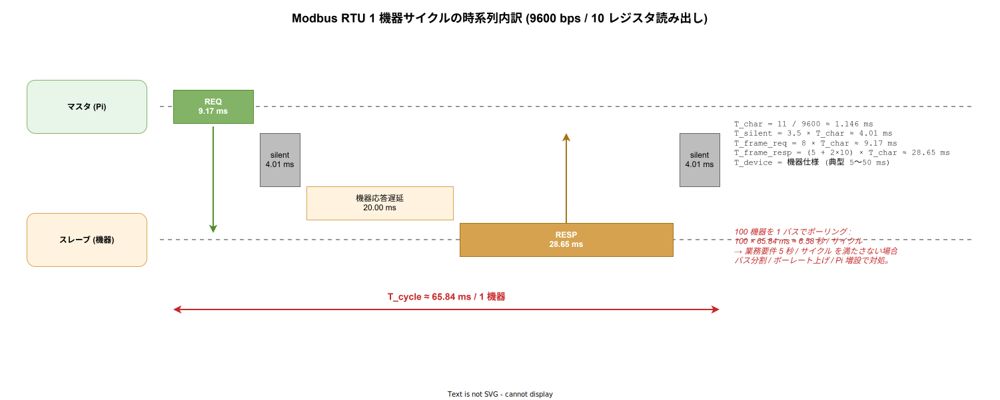

# 定量モデル

## 目的

エッジ構成の設計判断を「定性的な比較」ではなく「数式と実測値で裏付けた数値」で行うためのワークシート集。Modbus RTU のサイクル計算、MQTT RTT バジェット、帯域試算、電力計算、SD 寿命試算をまとめる。各モデルは Excel / Google Sheets に転記しやすい構造で記述しており、PoC で実測値が出た時点で仮置き値を上書きすることを想定している。

本ドキュメントの前提変数 (機器台数、ポーリング周期、payload サイズ等) はあくまで標準値で、ユーザー環境に合わせて [`08_ヒアリングシート.md`](./08_ヒアリングシート.md) で確認した値に差し替える。

---

## 1. Modbus RTU サイクル時間

### 1.1 基本式

Modbus RTU はマスタが順次ポーリングする半二重プロトコル。1 機器の 1 リクエスト → レスポンスサイクル時間は次式で求まる。

```text
T_char  = 11 / Baud                                     [秒/文字, スタート1+データ8+パリティ1+ストップ1]
T_silent = max(3.5 * T_char, 1.75 ms)                  [3.5 文字時間の silent interval]
T_frame_req  = N_req  * T_char                          [リクエストフレーム送信時間]
T_frame_resp = N_resp * T_char                          [レスポンスフレーム送信時間]
T_device     = 機器応答遅延 (機器仕様、典型 5〜50 ms)

T_cycle_per_device = T_frame_req + T_silent + T_device + T_frame_resp + T_silent
```

リクエストフレーム長 N_req は FC 03/04 で **8 バイト** (アドレス1+FC1+先頭2+数2+CRC2)、レスポンス長 N_resp は **5 + 2*N** バイト (アドレス1+FC1+バイト数1+データ2N+CRC2)。

時系列で内訳を可視化すると、半二重バスを REQ → silent → 機器応答 → RESP → silent の 5 区間が順に占有する構造が見える。



### 1.2 計算例

9600 bps (`baud=9600`)、レジスタ 10 個読み出し (FC 03)、機器応答 20 ms。

```text
T_char       = 11 / 9600                  ≈ 1.146 ms
T_silent     = 3.5 * 1.146 ms             ≈ 4.01 ms
T_frame_req  = 8 * 1.146 ms               ≈ 9.17 ms
T_frame_resp = (5 + 20) * 1.146 ms        ≈ 28.65 ms
T_device     = 20 ms
T_cycle      = 9.17 + 4.01 + 20 + 28.65 + 4.01
             ≈ 65.84 ms
```

100 台を 1 バスでポーリングするなら 100 × 65.84 ms ≈ **6.58 秒/サイクル**。業務要件のポーリング周期 (例: 5 秒) を満たせない場合、(1) ボーレートを上げる、(2) バスを分割、(3) 機器ごとに別バスを引く、で対処する。

### 1.3 サイクル時間早見表

レジスタ 10 個読み出し / 機器応答 20 ms 想定 / 1 機器あたり [ms]。

| ボーレート | 1 機器サイクル | 100 機器バス | 周期 5s 限界台数 | 周期 1s 限界台数 |
|---|---|---|---|---|
| 9600 | 65.8 ms | 6.6 s | 約 76 台 | 約 15 台 |
| 19200 | 42.9 ms | 4.3 s | 約 116 台 | 約 23 台 |
| 38400 | 31.5 ms | 3.2 s | 約 159 台 | 約 31 台 |
| 57600 | 27.7 ms | 2.8 s | 約 181 台 | 約 36 台 |
| 115200 | 23.8 ms | 2.4 s | 約 210 台 | 約 42 台 |

注: 高速ボーレート時は機器側応答遅延 (T_device) が支配的になり、頭打ち現象が出る。実際は機器の半分が古い 9600 bps 固定であることが多く、設計時には **最遅機器を律速ボトルネック**として扱う。

### 1.4 サイクル時間が足りない場合の打開策

| 打開策 | 効果 | コスト | 注意点 |
|---|---|---|---|
| ボーレート上げ | 1〜2 倍 | ほぼ無 | 機器対応上限がある |
| バス分割 (USB-RS485 を増設) | 線形 | USB-RS485 1 本 ¥5,000〜 | Pi USB ポート数の制限 |
| Pi 増設 (機器を物理分散) | 線形 | Pi 1 台 + 配線 | 物理スペース、初期費 |
| OPC UA 機器に置換 | 桁違い | 機器更新費 | 業務側予算が必要 |
| 機器応答遅延の最適化 | 微 | 機器設定変更 | メーカー協議が必要 |

---

## 2. MQTT RTT バジェット

エッジ → tier1 broker → tier1 アプリの 1 publish の所要時間を積み上げる。SLO ([`04`](./04_運用ライフサイクルと観測性.md) 5 節) 設定の根拠。

### 2.1 内訳

| 区間 | 典型値 (LAN) | 典型値 (拠点 VPN) | 備考 |
|---|---|---|---|
| Modbus 取得 (上記 1.2) | 65 ms | 65 ms | 機器側遅延込み |
| エージェント内 enqueue (SQLite WAL) | 0.3 ms | 0.3 ms | NORMAL fsync |
| エージェント → broker TLS handshake | 0 ms (常時接続) | 0 ms | TLS 1.3 0-RTT は使わない |
| publish パケット送信 | 0.5 ms | 5 ms | RTT/2 |
| broker 内処理 | 1 ms | 1 ms | EMQX 標準性能 |
| broker → tier1 アプリ配信 | 0.5 ms | 0.5 ms | k1s0 内部 LAN |
| tier1 アプリ処理 + ack 経路 | 5 ms | 5 ms | アプリ依存 |
| ack 戻り | 0.5 ms | 5 ms | 半 RTT |
| **合計 (publish RTT)** | **約 7.8 ms** | **約 17 ms** | |
| **end-to-end (Modbus 観測 → tier1 ack)** | **約 73 ms** | **約 82 ms** | |

### 2.2 SLO との関係

| SLO 項目 | 値 | 上記内訳との余裕 |
|---|---|---|
| publish RTT p95 (LAN) | 200 ms | 余裕 25 倍、十分 |
| publish RTT p95 (VPN) | 1.5 s | 余裕 88 倍、十分 |
| publish RTT p99 (LAN) | 1 s | 余裕 128 倍 |
| publish RTT p99 (VPN) | 5 s | 余裕 294 倍 |

p95/p99 の余裕は大きいが、これは **broker 過負荷時** や **NW ジッタ** が支配的になった瞬間に消える。常時負荷率 50 % 以下、ジッタ 100 ms 以下を維持できる構成にしておく必要がある。

---

## 3. 帯域試算

### 3.1 1 電文あたりの転送量

MQTT 5 over TLS 1.3 で 1 電文を送る場合の overhead。

| レイヤ | サイズ |
|---|---|
| アプリ payload (JSON envelope, 上記 [`02`](./02_エッジソフトウェアと通信設計.md) 4.2) | 200〜400 B |
| MQTT publish header (topic, packet id, properties) | 50〜100 B |
| TLS record overhead | 30 B |
| TCP/IP header (IPv4) | 40 B |
| イーサネット frame overhead | 26 B |
| **合計 / 1 publish** | **約 350〜600 B** |

### 3.2 拠点あたり帯域

100 台の機器を 5 秒周期でポーリング → 20 publish/s。帯域:

```text
20 publish/s × 500 B × 8 bit/B = 80 kbps (= 0.08 Mbps)
```

100 拠点合計でも 8 Mbps。拠点 LAN が 1 Gbps なら 0.01 % の使用率に過ぎない。**通常運用ではほぼ無視できる帯域**。

### 3.3 NW 復旧時の replay バースト

24 時間断絶 → 復旧。滞留:

```text
20 publish/s × 86400 s = 1,728,000 件
1.7M 件 × 500 B = 850 MB
```

token bucket でレート制御 (例: 200 publish/s) すれば消化に 2.4 時間。**この時間中の broker 帯域は 80 kbps の 10 倍**。30 拠点が同時復旧すると broker 入口で 24 Mbps、これは EMQX の標準キャパ内 (1 ノード 数十万 publish/s) で問題ない。

### 3.4 帯域の総合早見表

1 拠点 100 機器 / 5 秒周期 / payload 500 B 想定。

| シナリオ | 帯域 | 1 日 | 1 ヶ月 | 100 拠点 / 月 |
|---|---|---|---|---|
| 通常運用 | 0.08 Mbps | 約 0.9 GB | 約 27 GB | 約 2.7 TB |
| ログ (Loki) | 0.05 Mbps | 約 0.5 GB | 約 15 GB | 約 1.5 TB |
| メトリクス (remote-write) | 0.02 Mbps | 約 0.2 GB | 約 6 GB | 約 600 GB |
| トレース (1/100 sampling) | 0.005 Mbps | 約 0.05 GB | 約 1.5 GB | 約 150 GB |
| OTA (月 1 回 80 MB) | — | — | 80 MB / 拠点 | 約 8 GB |
| **拠点合計 (定常)** | **0.16 Mbps** | **約 1.6 GB** | **約 50 GB** | **約 5 TB** |

拠点回線が 10 Mbps 確保できるなら定常運用は十分。OTA 配信が複数拠点同時に走るときは 100 台同時 pull で 8 GB × 100 = 800 GB の瞬発が出るので、地域ミラーまたは段階配信で平準化する。

---

## 4. 電力消費

### 4.1 電力モデル

各 Pi + 周辺機器の消費電力。最大値は突入電流ピーク、定常は 5 分平均。

| デバイス | 定常 [W] | 最大 [W] |
|---|---|---|
| Pi 4B 8GB (アイドル) | 3.4 | — |
| Pi 4B 8GB (CPU 50 % + USB Wifi) | 5.0 | 8.0 |
| Pi 5 8GB (CPU 50 %) | 6.0 | 12.0 |
| USB-RS485 変換 (FTDI) | 0.5 | 0.8 |
| USB-RS232 変換 | 0.4 | 0.6 |
| UPS HAT (充電中) | 2.0 | 5.0 |
| ATECC608B HAT | 0.05 | 0.1 |
| LAN port (PoE 給電時) | 0.5 | 1.0 |

### 4.2 構成別の電力試算

| 構成 | 定常 | 最大 | 月間 (定常 × 720 h) | 年間電気代 (¥27/kWh) |
|---|---|---|---|---|
| 案 A (Pi 4 + USB-RS485 + UPS) | 7.5 W | 13.8 W | 約 5.4 kWh | 約 ¥1,750 |
| 案 B (Pi 4 + Dapr sidecar) | 8.5 W | 14.5 W | 約 6.1 kWh | 約 ¥1,980 |
| 案 C (Pi 4 × 3 + USB-SSD × 3 + L2 SW) | 28 W | 50 W | 約 20 kWh | 約 ¥6,500 |

### 4.3 UPS 容量設計

UPS HAT (PiJuice 等、容量 1300 mAh @ 3.7 V = 4.8 Wh、変換効率 80 %) の保持時間。

| 構成 | 消費 | 保持時間 |
|---|---|---|
| 案 A | 7.5 W | 4.8 × 0.8 / 7.5 ≈ 31 分 |
| 案 C (L2 SW を別 UPS) | 18 W (Pi × 3) | 4.8 × 0.8 / 18 ≈ 13 分 |

これは **シャットダウン猶予** に十分。30 分以上の停電に備えるには外部 UPS (APC 1500VA 等) を追加し、停電時間に応じた SLA を再定義する。

### 4.4 発熱と冷却

定常 8 W の Pi 4 を密閉筐体に入れると内部温度上昇は外気 +15〜25 ℃。SoC は 80 ℃ で thermal throttling、85 ℃ で停止。屋内 25 ℃ 環境なら問題ないが、屋外 / 産業現場で外気 40 ℃ ありうる場合は **筐体内ファン** または **ヒートシンク強化** が必須。

---

## 5. SD カード / eMMC 寿命試算

### 5.1 書き込み量モデル

定常運用での 1 日書き込み量 (案 A 想定):

| 書込み元 | サイズ / 日 |
|---|---|
| SQLite WAL (定常) | 2 publish/s × 86400 s × 200 B = 約 35 MB → 実 WAL は 3〜5 倍 = 約 150 MB |
| systemd-journal (rotate 込) | 約 50 MB |
| Prometheus textfile collector | 約 5 MB |
| Mender artifact 一時展開 (月 1) | 80 MB / 月 → 平均 3 MB / 日 |
| **合計** | **約 210 MB / 日** |

### 5.2 SD 寿命の試算

Industrial microSD (Transcend 230I 32GB, TBW 公称 50 TB)。

```text
寿命日数 = TBW (50 TB = 50,000 GB = 51,200,000 MB) / 1 日書込み (210 MB)
       = 約 244,000 日
       = 約 668 年
```

理論上は十分余裕。ただし TBW は **均等書き込み前提**。SQLite WAL は同一セクタへの集中書込みになりがちで、実寿命は 1/10 〜 1/30 と見積もるのが現実的。

```text
実寿命 = 668 年 / 20 = 約 33 年
```

それでも 3 年で交換するという [`04`](./04_運用ライフサイクルと観測性.md) 7 節の運用方針なら十分。**書込み集中対策** として:

- WAL ファイルを `/data` (別パーティション、可能なら USB SSD) に置く。
- `wal_autocheckpoint` を適切に。
- ログは中央集約してローカル保存しない。
- swap 無効化。

### 5.3 USB SSD への退避効果

USB SSD (例: WD SN550 NVMe + 変換アダプタ、TBW 200 TB) なら寿命は 100 倍以上。書き込み集中の影響も wear-leveling が効くため実寿命は 10 年超。**Local Queue を SSD に逃がす設計** が長期運用の必須事項。

---

## 6. キュー溢れシミュレーション

NW 断絶時間とディスク容量の関係。

### 6.1 モデル

- 1 publish = 200 B (payload) + 100 B (SQLite overhead) + 50 B (idempotency 等) = 350 B
- 100 機器 × 5 秒周期 = 20 publish/s = 7,000 B/s = 約 600 MB / 日
- `/data` パーティション容量 12 GB (うちログ等で 4 GB 消費、キュー使用可 8 GB)

### 6.2 限界時間

```text
限界 = 8 GB / 600 MB/日 = 約 13.6 日
```

13 日の NW 断は通常想定外だが、**[`04`](./04_運用ライフサイクルと観測性.md) 7 節のディスク段階退避ポリシー**で:

| 経過時間 | アクション |
|---|---|
| 0〜2 日 | 通常蓄積 |
| 2〜6 日 | bulk 優先度の電文を破棄開始 |
| 6〜10 日 | normal 優先度も破棄 |
| 10 日以降 | high 優先度のみ保持 + 機器ポーリング間隔延長 |
| 13 日以降 | 緊急停止、tier1 / 現場運用に通知 |

### 6.3 復旧時の消化時間

token bucket レート制限 200 publish/s で 8 GB (約 24M 件) を消化:

```text
消化時間 = 24M / 200 publish/s = 120,000 s = 約 33 時間
```

**24h 断絶後の消化が 33 時間**。SLO ([`04`](./04_運用ライフサイクルと観測性.md) 5 節) では「60 分断絶後 30 分以内消化」を掲げているため、24h 断絶は SLO 範囲外として運用設計し、**手動介入 + tier1 帯域臨時拡張** で対処する旨を明示しておく。

---

## 7. ノード故障と冗長化の効果

### 7.1 案 A の MTBF

Pi 4B + Industrial SD の MTBF (公称値ベース):

| 部品 | MTBF | 障害 / 年 (1 台) |
|---|---|---|
| Pi 4B SoC | 約 100 万時間 | 0.0088 |
| Industrial SD (Transcend) | 約 200 万時間 | 0.0044 |
| 電源 (官公製 Switching) | 約 50 万時間 | 0.0175 |
| FTDI USB-Serial | 約 100 万時間 | 0.0088 |
| **合計 (直列)** | — | **約 0.04 障害 / 年** |

100 拠点 × 1 台で年間 4 件のハード障害。MTTR (平均復旧時間) を 4 時間とすれば年間ダウンタイム 16 時間 = 0.18 %。可用性 99.82 %。

### 7.2 案 C の冗長化効果

3 ノード k3s で 1 ノード障害なら継続運用可。ただし RS-232C 物理接続は冗長化不可 (1 機器 1 ポート)。

| シナリオ | 案 A 影響 | 案 C 影響 |
|---|---|---|
| Pi 故障 (RS-232C 接続なし) | (該当なし) | 自動退避、影響 0 |
| Pi 故障 (RS-232C 接続あり) | 全停止 | 物理層停止、論理層は他 Pi で代替不可 |
| 電源故障 | UPS で 30 分猶予 | 同上 |
| SD 故障 | 全停止 | 該当 Pi のみ停止、他 2 台で論理層は維持 |

→ 案 C の真価は「k3s コントロールプレーンと観測パイプラインが落ちないこと」であり、物理層の冗長化ではない。

---

## 8. 関連ドキュメント

- [`01_物理層とハードウェア.md`](./01_物理層とハードウェア.md) — Modbus サイクルの根拠、電源計算
- [`02_エッジソフトウェアと通信設計.md`](./02_エッジソフトウェアと通信設計.md) — SQLite WAL pragma、MQTT topic 設計
- [`04_運用ライフサイクルと観測性.md`](./04_運用ライフサイクルと観測性.md) — SLO、帯域、ディスク段階退避
- [`05_3案の深掘り評価.md`](./05_3案の深掘り評価.md) — TCO の前提値
- [`06_PoC計画.md`](./06_PoC計画.md) — 実測値で本ドキュメントを更新する手順
- [`08_ヒアリングシート.md`](./08_ヒアリングシート.md) — モデル変数の値をユーザーから取得
