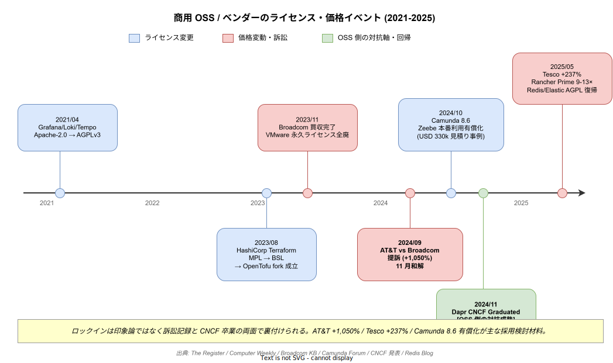

# 04 外部根拠: 商用製品の実売価格・ロックイン訴訟・OSS 採用実績

本章は「商用製品（OpenShift / Tanzu / Rancher Prime / Temporal Cloud / Camunda 8 / IBM BPM）が高すぎる・ロックインで困る」「OSS 基盤（Temporal / Dapr / ZEN Engine）は本番で回っている」という主張を、公開済みの一次情報で裏付ける。印象論ではなく、価格表・訴訟記録・CNCF 採択・ベンダー公式発表を典拠にする。通貨は USD 表示を 1 USD = 150 円で換算する。

## 1. 商用ワークフロー／Kubernetes ディストリの実売価格

商用製品の価格は「公式価格表」と「公開された見積もり事例」の両輪でしか把握できない。各製品の公開価格を以下に整理する。

Red Hat OpenShift は Self-Managed のプレミアムサポート付き Core-Pair（4 vCPU）サブスクリプションが年 €2,000〜€5,000（約 32〜80 万円）、100 vCPU 規模で 1,000〜2,000 万円/年が現実的レンジとされる。ROSA on AWS は 4 vCPU あたり USD 0.171/時で、時間課金ながら年間ではやはり数百万〜数千万円の幅に入る。

SUSE Rancher Prime は 2025 年に料金体系を刷新した。従来 1 ノード USD 200/年相当 → CPU/vCPU 課金へ切替わり、16 コア VM（32 vCPU）の年額が USD 2,000 → USD 19,200（標準）/ USD 25,600（Priority）へ跳ねた。**9〜13 倍の値上げ**は Portainer の公開ブログで定量化されている。ベアメタル 2 ソケット 64 コアでは USD 7,300〜9,800/年、「Suite」版は USD 9,800〜13,100/年/サーバ。

Temporal Cloud は Action 単価を旧 USD 25/100 万 → **新 USD 50/100 万（倍増）**に変更。プランは Essentials / Business / Enterprise / Mission Critical の 4 段構成で、「基本料金または利用料金の一定%」の高い方が請求される仕様。短期的には安く見えても、スケールすると想定外の課金が発生する構造にある。

Camunda 8 は 2024 年 10 月の 8.6 リリース以降、Zeebe の本番利用に Enterprise License を必須化した。コミュニティフォーラムでは AWS 自己ホスト想定で**年 約 USD 330,000（約 5,000 万円）**の見積もり事例が公表されている。「OSS だと思って採用したら本番で課金される」典型であり、採用側組織の調達担当への訴求効果が高い。

IBM BPM は Authorized User 課金で **USD 600/ユーザ/月（年 USD 7,200 = 約 108 万円）**。1,000 ユーザ超の大口でも月 USD 150（年 USD 1,800 = 27 万円）を下限とする価格帯。PVU 併用の中間層ミドルウェアが別建てで必要になる。

VMware Tanzu は Broadcom 買収後の SKU 整理で、Tanzu Basic / Tanzu Mission Control の旧 SKU は **2024/5/6 で EOA（End of Availability）**、さらに Tanzu Platform SaaS も **2025/5/1 で EOA** となった。後継バンドル VCF への移行が実質強制されている。

| 製品 | 代表価格 | 出典 |
| --- | --- | --- |
| OpenShift Self-Managed | Core-Pair 年 €2,000〜€5,000、100 vCPU で 1,000〜2,000 万円/年 | Medium PlanB. |
| ROSA on AWS | USD 0.171/時（4 vCPU） | AWS 公式 |
| Rancher Prime（2025 新価格） | 32 vCPU 年 USD 19,200〜25,600（旧比 9〜13 倍） | Portainer |
| Temporal Cloud | Action USD 50/100 万（旧の 2 倍） | Temporal 公式 |
| Camunda 8（8.6 以降） | Zeebe 本番利用に Enterprise 必須、年 USD 330,000 事例 | Camunda Forum |
| IBM BPM | Authorized User USD 600/人/月、年 USD 7,200 | ITQlick |
| VMware Tanzu Basic/MC | 2024/5/6 EOA、Platform SaaS も 2025/5/1 EOA | Broadcom KB |

出典 URL:

- <https://medium.com/@PlanB./discover-the-true-price-of-openshift-success-estimating-costs-for-your-enterprise-sla-in-2025-e9bbc817c6d7>
- <https://aws.amazon.com/rosa/pricing/>
- <https://www.portainer.io/blog/suse-rancher-price-hike-why-enterprises-are-searching-for-alternatives-in-2025>
- <https://docs.temporal.io/cloud/pricing>
- <https://temporal.io/blog/temporal-cloud-pricing-update>
- <https://docs.camunda.io/docs/reference/licenses/>
- <https://forum.camunda.io/t/camunda-8-pricing-questions/60998>
- <https://www.itqlick.com/ibm-business-process-management/pricing>
- <https://knowledge.broadcom.com/external/article/368947/end-of-availability-notification-for-exi.html>
- <https://knowledge.broadcom.com/external/article/399145/end-of-availability-eoa-for-tanzu-platfo.html>

## 2. Broadcom / Red Hat のロックイン事例は訴訟記録に残っている

「ロックインで困る」は印象論ではなく、複数の訴訟と公的抗議で既に記録されている事実である。下図は 2021-2025 年の主要イベントを時系列で俯瞰したもので、ライセンス変更（青）・価格/訴訟（赤）・OSS 側の対抗軸（緑）が 4 年半の間に連続して発生していることがわかる。採用検討で「値上げ・ロックインは散発的な事件ではなく連鎖的な構造」であることを示す際の一枚画として使える。

**AT&T vs Broadcom**: AT&T は Broadcom 買収後、VMware の請求額が **1,050%（約 11 倍）**に跳ね上がる提示を受け、2024 年に提訴。11 月に和解した。この 1,050% という数値は一次訴訟記録に紐づくため、採用検討の場での反証が極めて困難である。

**Tesco vs Broadcom**: Tesco は **237% 値上げ**を受け、£100M（約 180 億円）を超える訴訟を起こしている。Computer Weekly が詳細を報じている。

**CISPE（欧州クラウド事業者団体）報告**: 会員企業から報告された Broadcom 買収後の VMware 関連価格上昇は **800〜1,500%** のレンジ。Siemens は VMware から著作権侵害で**逆提訴**される事態（2025/3）に発展し、ライセンス更新交渉の決裂が直接訴訟に至る構図が常態化した。

**永久ライセンスの一方的廃止**: Broadcom は買収完了（2023/11）直後、vSphere / NSX を含む**永久ライセンス購入を全廃**しサブスクリプションのみに集約した。既存資産の延命が不可になり移行が強要される構造になった。

**Red Hat の RHEL ソースコード公開制限（2023/6）**: CentOS Stream のみを公開リポジトリとし、RHEL ソースは顧客ポータル（契約者限定）に移動。契約書でサブスク維持を再配布の条件に紐づけたため、AlmaLinux / Rocky Linux は「1:1 互換」から「ABI 互換」に格下げを余儀なくされた。GPL の精神を契約法で迂回する手法として、OSS コミュニティに「上流ベンダーの一存で下流が破綻する」実例を残した。

| 事例 | 数値 | 出典 |
| --- | --- | --- |
| AT&T vs Broadcom | VMware 請求額 +1,050% | The Register |
| Tesco vs Broadcom | +237%、£100M 訴訟 | Computer Weekly |
| CISPE 報告 | 欧州 +800〜1,500% | The Register / Network World |
| Siemens 逆提訴 | 2025/3、著作権侵害 | Network World Timeline |
| Broadcom 永久ライセンス廃止 | 2023/11 全廃 | VMware Cloud Foundation Blog |
| Red Hat RHEL ソース制限 | 2023/6 顧客ポータル限定 | The Register / LWN |

出典 URL:

- <https://www.theregister.com/2024/10/01/att_broadcom_filings_update/>
- <https://www.networkworld.com/article/4019734/a-timeline-of-broadcom-vmware-and-siemens-licensing-dispute.html>
- <https://www.computerweekly.com/news/366637500/The-impact-of-Tesco-versus-Broadcom-lawsuit-on-software-procurement>
- <https://www.theregister.com/2025/05/22/euro_cloud_body_ecco_says_broadcom_licensing_unfair/>
- <https://www.networkworld.com/article/3994107/vmware-customers-in-europe-face-up-to-1500-price-increases-under-broadcom-ownership.html>
- <https://blogs.vmware.com/cloud-foundation/2024/01/22/vmware-end-of-availability-of-perpetual-licensing-and-saas-services/>
- <https://www.theregister.com/2023/06/23/red_hat_centos_move/>
- <https://lwn.net/Articles/935592/>

## 3. OSS 側の本番採用実績は「大規模で」成立している

「OSS で本番が回るのか」への回答は、すでに CNCF 採択と大規模事例で決着している。

**Dapr**: **2024/11/12 に CNCF Graduated に昇格**し、Kubernetes / Istio / Prometheus と同格の成熟度評価を得た。本番採用企業には Alibaba Cloud、Zeiss、Grafana Labs、FICO、HDFC Bank、Bosch、Tencent が並ぶ。Zeiss Vision Care はグローバル眼鏡レンズ受注の分散ワークフロー（Azure 上）に Dapr Actor を採用している。「State of Dapr 2025 Report」では **40,000 社以上が利用、開発者の 96% が時間節約、60% は 30% 以上の生産性向上**と報告されている。

**Temporal**: Netflix（全社 CI/CD の基盤）、Stripe（決済クリティカル）、Coinbase（取引フローの SAGA 置換）、Snap の本番採用が Temporal 公式でケーススタディ化されている。日本では UPSIDER が請求ワークフロー基盤に採用し、2025/4 に技術ブログで公開した。

**ZEN Engine（GoRules）**: Rust 製の OSS ビジネスルールエンジンで、Node.js / Python / Go / Java / C# / Kotlin / Swift のネイティブバインディングを持つ。GoRules JDM（JSON Decision Model）標準に基づき、ライセンスは MIT。エンジン本体はベンダー契約を伴わず k1s0 に同梱可能。ただし **DMN そのものではなく JDM ベース**である点は採用検討時に明示すべきリスクとして併記する必要がある。

**Camunda → Temporal 乗り換えの市場**: Temporal Community フォーラムに「Long-time BPMN/Camunda user considering the leap to Temporal」のスレッドが存在し、乗り換え検討の存在が公開情報で確認できる。

| 製品 | 本番採用の強い証拠 | 出典 |
| --- | --- | --- |
| Dapr | CNCF Graduated、40,000 社、Alibaba/Zeiss 採用 | CNCF 発表、Dapr Testimonials |
| Temporal | Netflix / Stripe / Coinbase / Snap / UPSIDER | Temporal Case Studies |
| ZEN Engine | Rust 製、MIT、JDM ベース（DMN ではない） | GitHub gorules/zen |
| Camunda → Temporal | 乗り換え検討スレッド公開 | Temporal Community |

出典 URL:

- <https://www.cncf.io/announcements/2024/11/12/cloud-native-computing-foundation-announces-dapr-graduation/>
- <https://www.cncf.io/announcements/2025/04/01/cloud-native-computing-foundation-releases-2025-state-of-dapr-report-highlighting-adoption-trends-and-ai-innovations/>
- <https://dapr.io/testimonials/>
- <https://www.diagrid.io/case-studies/diagrid-conductor-is-life-insurance-for-zeiss-microservice-based-order-fulfilment-app>
- <https://temporal.io/resources/on-demand/netflix>
- <https://temporal.io/resources/case-studies/coinbase>
- <https://tech.up-sider.com/entry/20250428_temporal>
- <https://github.com/gorules/zen>
- <https://community.temporal.io/t/long-time-bpmn-camunda-user-considering-the-leap-to-temporal/10308>

## 4. OSS への移行は効果も公開されている

商用ディストリから OSS に移行した際の効果も、ベンダー公式・コンサル事例で数値化されている。

amazee.io は OpenShift から Rancher に移行し、**クラスタ構築・運用工数を 80% 削減、コストを 50% 削減**したと SUSE が公開した。OpenShift は Operator やコンポーネントが重く「追加ツールの複雑性」がコスト要因と同事例で指摘されている。Palark の技術移行ガイドは OpenShift → Vanilla Kubernetes 移行でライセンス料削減と SaaS 経費削減が主動機になることを示し、AWS も公式に OpenShift → EKS 移行ツールキット（aws-samples リポジトリ）を公開している。Tanzu 側では Fairwinds / SORINT.lab などコンサル系が 2024〜2025 にかけて Tanzu ユーザへ移行推奨を公開し、「Rancher は vanilla Kubernetes 寄りで将来の乗り換え容易性が最大のメリット」と明示している。

| 移行事例 | 効果 | 出典 |
| --- | --- | --- |
| OpenShift → Rancher（amazee.io） | 構築・運用工数 -80%、コスト -50% | SUSE 公式 |
| OpenShift → Vanilla k8s | ライセンス料・SaaS 経費削減 | Palark |
| OpenShift → EKS | AWS 公式ツールキット提供 | aws-samples |
| Tanzu → Rancher / 素 k8s | 乗り換え容易性重視 | Fairwinds / SORINT |

出典 URL:

- <https://www.suse.com/c/rancher_blog/achieving-major-efficiencies-through-migration-from-openshift-to-rancher/>
- <https://palark.com/blog/migrating-from-openshift-to-vanilla-kubernetes/>
- <https://github.com/aws-samples/RedHat-Openshift-to-AWS-EKS-migration>
- <https://www.fairwinds.com/blog/using-vmware-tanzu-time-to-migrate>
- <https://blog.sorint.com/en/four-ways-to-find-the-right-way-to-kubernetes-among-openshift-tanzu-and-rancher/>

## 5. 採用検討での使い分け指針

以上の材料は、採用検討の場で以下の 3 点セットに分けて使うのが最も効く。

「値上げで困る」論は **AT&T 1,050% / Tesco 237% / CISPE 800〜1,500%** の 3 点で裏付ける。いずれも訴訟または公的団体の抗議記録であり、反証が困難である。

「ロックイン」論は **Broadcom の永久ライセンス一方的廃止** と **Red Hat の GPL 契約迂回** の二段構えにする。単なる値上げではなく「選択肢を奪われる」構造が問題であることを示せる。

「OSS で本番が回る」論は **Dapr = CNCF Graduated + Alibaba/Zeiss + 40,000 社** と **Temporal = Netflix/Stripe/Coinbase + 国内 UPSIDER** を明示する。CNCF 卒業と大企業採用の両方を挙げることで「実験段階ではない」ことを示せる。

追加で **Camunda 8.6 からの有償化強制** は「OSS だと思って採用したが本番で課金される」事例として 採用側組織の調達担当に特に効く。k1s0 が ZEN Engine（MIT）を採用し、ライセンス変更リスクを最小化する設計方針を取っている点と対照できる。

本章は「何が起きた」を一次情報で裏付ける章である。Build vs Buy のリスク構造比較は [`03_BuildVsBuy.md`](./03_BuildVsBuy.md) で扱い、両章を合わせて読むことで、ロックインの事実（本章）と採用判断のリスク構造（03 章）が立体的に見える構造にしている。
