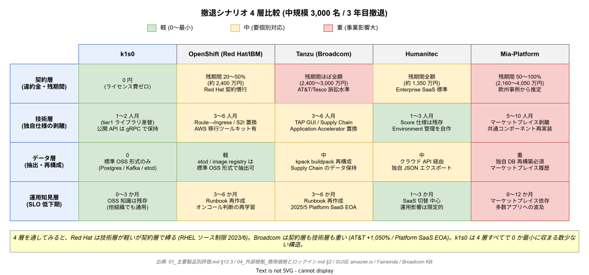

<!-- 本ファイルは k1s0 を含む主要プラットフォーム製品の撤退シナリオを、契約・技術・データ・運用知見の 4 層で分解し、稟議で「本当に撤退できるか」を詰められた際に即答できるだけの粒度で整理する散文資料である。 -->

# 05 撤退シナリオ比較

## 本章で解決する問い

稟議の場で最も刺さる質問は「ベンダーロックインがあると言うが、本当に撤退容易性で差があるのか」である。`04_外部根拠_商用価格とロックイン.md` で価格と訴訟記録は裏付けたが、**「3 年目に方針転換した時、具体的に何が起きるのか」** を製品横断で説明する章が本企画群に欠けていた。

本章はその欠落を埋める。各競合製品（OpenShift / Tanzu / Humanitec / Mia-Platform）と k1s0 について、撤退を **契約層・技術層・データ層・運用知見層の 4 層** に分解し、層ごとに「何が障壁になるか」「剥がすのに何カ月かかるか」「剥がし中に業務アプリが動かなくなるリスクはあるか」を散文で展開する。稟議で「Broadcom 買収後の Tanzu と比べて本当に撤退容易か」と Red Hat 支持派から詰められた際、`01_主要製品別評価.md §12.3` のコスト表だけでは答弁が薄い。本章がその答弁の底上げを担う。

## 1. 撤退を 4 層に分解する

撤退コストは金額で丸められがちだが、実際は性質の異なる 4 層が同時に発生する。層ごとに主役も緩和策も異なるため、**「総額 X 円」だけで判断すると、実務で撤退が止まる場所を見誤る**。

**契約層** はベンダーとの SKU 契約・違約金・残サブスクリプション期間で構成される。財務部主導で、交渉と紙の作業が中心。Broadcom のように契約満了まで厳格に請求するベンダーでは、残期間全額が請求される事例が 2024 年以降増えている（`04_外部根拠 §2` の AT&T / Tesco 訴訟）。

**技術層** は独自 CRD・独自 API・独自 UI・独自ビルドパックなど、アプリ側コードがベンダー固有仕様に依存している部分の剥離である。情シスと開発チーム双方が稼働し、既に稼働中の業務アプリを止めずに入れ替える必要があるため、**4 層の中で最も事故率が高い**。

**データ層** は etcd / イメージレジストリ / マーケットプレイスメタデータ / ユーザ設定などを次プラットフォームで読める形式に抽出する作業である。標準 k8s 形式ならほぼ 0 工数、独自バイナリ形式なら抽出ツールの自作が必要になる。

**運用知見層** は最も軽視されるが回復に最も時間がかかる。運用チームが習得してきた障害対応手順・Runbook・オンコール判断基準は、次プラットフォームではほぼゼロから再学習になる。**3〜6 か月の SLO 低下期** が撤退後に必ず到来する。

## 2. 製品別撤退シナリオ

### 2.1 OpenShift (Red Hat / IBM)

OpenShift からの撤退は「プラットフォーム自体の剥離」よりも **「OpenShift が前提として乗せた独自構成要素の剥離」** で大部分の工数が決まる。OpenShift は vanilla k8s に対し Routes / Service Mesh / Operator Hub / OpenShift GitOps / Source-to-Image ビルダを上乗せしており、これらは標準 k8s では動かない。移行先が vanilla k8s / EKS / Rancher だった場合、アプリ側で `Route` を `Ingress` に、`BuildConfig` を外部 CI に書き換える作業が Namespace 単位で発生する。

`aws-samples/RedHat-Openshift-to-AWS-EKS-migration` が AWS 公式で提供されている事実は、**逆に「自動化ツールが必要なほど剥離作業が大きい」ことの傍証** でもある。amazee.io の SUSE 公式事例では移行後の運用工数が 80% 減、コストが 50% 減となっているが、**移行プロジェクト自体は 6〜12 か月規模**。中規模（80 コア / 50 サービス）想定で、技術層 3〜6 人月 + 契約違約金（残期間の 20〜50%）+ 運用再学習 3〜6 か月が現実値。

撤退中の業務影響は中程度。Routes → Ingress 書き換えで一時的に外部疎通が止まる可能性があり、段階移行 Runbook を事前に整備する必要がある。

### 2.2 VMware Tanzu (Broadcom)

Tanzu からの撤退は **2024-2025 年に最も条件が悪化した経路** である。Broadcom 買収後、Tanzu Basic / Mission Control の旧 SKU は 2024/5/6 で EOA、Tanzu Platform SaaS も 2025/5/1 で EOA となり、後継 VCF への **移行が実質強制** されている（`04_外部根拠 §1`）。つまり「現状維持」という選択肢が契約層で既に閉じている。

契約層の違約金は AT&T 訴訟で明るみに出た通り **残契約期間のほぼ全額請求** が Broadcom の標準姿勢で、和解事例でも満額に近い金額が支払われている。Tesco の £100M 訴訟も同構造。技術層では TAP の Supply Chain Choreographer / TAP GUI / Application Accelerator が独自仕様で、置換には 3〜6 人月。データ層では Tanzu Build Service (kpack 由来) の buildpack を自前で再構成する必要がある。

**「Tanzu ユーザは今すぐ動け」という論調が 2024 年以降業界で強まっている**。Fairwinds の `using vmware tanzu time to migrate` 記事や SORINT の移行比較記事（`04_外部根拠 §4`）が典型。この状況は、**稟議で「なぜ今 k1s0 なのか」と問われた際に「Tanzu を避けるには今 OSS を選ぶしかない」という回答の強い支えになる**。

### 2.3 Humanitec

Humanitec 撤退は 4 製品の中で最も技術層の軽さが特徴である。Humanitec の中核は **Score 仕様**（Workload specification の OSS 標準）であり、Score 自体は撤退後も独立して使える。Humanitec SaaS から離脱しても、Score YAML をそのまま別 CI/CD に載せれば大部分は動く。技術層は 1〜3 人月程度。

ただし **データ層に独自 JSON 形式のエクスポートが残る**。Humanitec のプラットフォームが管理する Environment / Deployment Target / Resource Definition はクラウド API 経由でしか取り出せず、そのエクスポート形式は標準化されていない。移行先が Score 対応の別 IDP（Backstage + Score、Nitric など）ならかなり楽だが、vanilla k8s への移行では Environment 管理を自作する必要がある。

契約層は Enterprise SaaS の標準で、残契約期間全額請求。**SaaS 前提の設計のためオンプレ完結 JTC ではそもそも候補から外れることが多く**、撤退論点として稟議で詰められる頻度は相対的に低い。

### 2.4 Mia-Platform

Mia-Platform 撤退は **4 製品の中で最も技術層の重量が大きい**。Mia-Platform は「マーケットプレイス + Dev Console + 独自テンプレート + 独自 API Gateway」をフルスタックで提供するため、各層に Mia 固有仕様が深く埋め込まれる。

マーケットプレイスで配布された共通コンポーネント（認証、ログ収集、通知など）を各アプリが参照している場合、それらを剥がすには**共通コンポーネントの再実装 or 代替探索**が必要で、5〜10 人月に膨らむ。独自 UI の Dev Console から Backstage などへ移行するには、カスタマイズ内容の棚卸しと再設計が伴う。データ層も独自 DB（マーケットプレイスの購入履歴・テンプレート差分）があり、単純なエクスポートでは再構築できない。

JTC 情シスが Mia-Platform を稟議で挙げる頻度は低いが、**「Mia-Platform の OSS 版」という k1s0 のポジショニング** を提示した際に「じゃあ Mia を買えば済むのでは」と返される場面があり得る。その際に「Mia 撤退は 5〜10 人月かかり、マーケットプレイス依存で戻れなくなる」という本節の事実が防御になる。

### 2.5 k1s0

k1s0 の撤退設計は **「そもそも撤退不要な構造」** を指向する。採用 OSS はすべて CNCF 準拠か標準 k8s の範疇で、独自 CRD を導入しない。tier1 が公開する `k1s0.State.*` / `k1s0.PubSub.*` などの API は Dapr building block を隠蔽しているが、Dapr を外して直接 Redis / Kafka などに接続する実装に差し替え可能な形で設計されている（`../../02_構想設計/02_tier1設計/01_設計の核/01_Dapr隠蔽方針.md`）。

撤退が発生するとすれば「k1s0 プロジェクトを解散し、採用 OSS のうち数本を社内で個別運用する」経路になる。契約層はライセンス費ゼロのため違約金ゼロ。技術層は tier1 ライブラリを外す書き換えが発生するが、**tier1 の公開 API は gRPC + Protobuf で定義されており、tier2 / tier3 から見える契約は移行先でも再現可能**。データ層は標準 k8s / Postgres / Kafka のみで構成されるため抽出は 0 工数。運用知見層は OSS 個別運用に戻るので再学習は必要だが、採用 OSS の知識は他組織でも通用する。

稟議答弁としては「**撤退時に失われるのは k1s0 固有の統合作業の工数であって、採用 OSS への投資はそのまま残る**」という資産保全の構造を強調する。

## 3. 「Broadcom と Red Hat、本当に撤退容易性で差があるのか」

この問いは稟議で Red Hat 支持派から出る定番質問である。両社とも OSS を基盤とする商用ベンダーであり、表面的には「OSS を買っているだけなので撤退可能」と見える。しかし **契約層と運用層で構造的な差** がある。

契約層では、Red Hat は 2023/6 の RHEL ソースコード公開制限で「契約書でサブスク維持を再配布の条件に紐付ける」手法を採った（`04_外部根拠 §2`）。これは値上げではなく「GPL の精神を契約法で迂回する」設計で、AlmaLinux / Rocky が 1:1 互換を維持できなくなった。Broadcom は永久ライセンスの一方的廃止（2023/11）と AT&T +1,050% / Tesco +237% の値上げで **短期で選択肢を奪う** 設計。両者の違いは「じわじわ契約に縛る」か「急激に価格で縛る」かで、どちらも撤退容易性を下げる方向で働く。

技術層では Red Hat のほうが vanilla k8s に近い分だけ剥離作業は軽い（OpenShift Routes → Ingress などで済む）。Broadcom Tanzu は独自 Supply Chain / TAP GUI を持ち、剥離量が多い。つまり **「Broadcom のほうが技術層は重く、Red Hat のほうが契約法の縛りが巧妙」** という非対称性がある。「Red Hat なら撤退容易」は技術層の 1 観点にすぎず、契約層を含めれば Broadcom と同程度のロックインは成立する。

稟議での答弁は「Red Hat は技術層は軽めだが契約層で縛り、Broadcom は契約層も技術層も重い。どちらも `04_外部根拠` の訴訟記録に残るほど撤退容易性で差は実質ない」と返すのが正解である。

## 4. 撤退シナリオ比較表（4 層 × 5 製品）

前節までの散文を、4 層で 1 行ずつ数値化したのが以下。中規模 (3,000 名 / 80 コア / 50 サービス) で 3 年目撤退を想定。まず 1 枚で俯瞰できる図を示し、続いて詳細表を掲載する。

| 層 | k1s0 | OpenShift | Tanzu | Humanitec | Mia-Platform |
|---|---|---|---|---|---|
| 契約層（違約金 / 残期間請求） | 0 円 | 残期間 20〜50%（約 2,400 万） | 残期間ほぼ全額（約 2,400〜3,000 万、AT&T/Tesco 水準） | 残期間全額（約 1,350 万） | 残期間 50〜100%（約 2,160〜4,050 万） |
| 技術層（独自仕様の剥離工数） | 1〜2 人月（tier1 差し替え） | 3〜6 人月（Routes/Mesh/S2I） | 3〜6 人月（TAP GUI/Supply Chain） | 1〜3 人月（Score は残る） | 5〜10 人月（マーケットプレイス依存） |
| データ層（抽出・再構成） | 0（標準 OSS 形式） | 軽（etcd / registry 標準） | 中（kpack buildpack 再構成） | 中（独自 JSON エクスポート） | 重（独自 DB 再構築必須） |
| 運用知見層（SLO 低下期） | 0〜3 か月（OSS 知識は残存） | 3〜6 か月 | 3〜6 か月 | 1〜3 か月 | 6〜12 か月 |
| 撤退中の業務影響 | 小（契約的制約なし） | 中（Routes→Ingress で一時疎通断の恐れ） | 中〜大（Supply Chain 書き換えでビルド停止の恐れ） | 小（SaaS 切替） | 大（共通コンポーネント剥がし中にアプリ多数が影響） |
| 外部根拠 | 本章 2.5 | SUSE amazee.io 事例 / AWS 公式移行ツール | AT&T 訴訟 / Fairwinds 移行推奨 | Humanitec 公開契約条件 | Mia-Platform 欧州事例 |

本表で注目すべきは **k1s0 だけが全 4 層で「0 または最小」に並ぶ** 点ではなく、**Tanzu と Mia-Platform が全層で高い** 点である。Red Hat 支持派が「Broadcom よりマシ」と主張したい時、技術層だけ見れば OpenShift のほうが軽いが、契約層では `04_外部根拠 §2` の Red Hat ソースコード制限事例があり、**4 層全体で見れば OpenShift も中重量クラスに留まる**。

## 5. 稟議答弁用スクリプト

> 「Broadcom が問題なのは分かったが、OpenShift なら撤退容易ではないか」という論点は、技術層の 1 観点に偏った見方です。撤退は契約・技術・データ・運用知見の 4 層で起きます。OpenShift は技術層こそ vanilla k8s に近いため 3〜6 人月で剥離できますが、契約層では Red Hat の 2023 年 RHEL ソース制限（契約でサブスクリプション維持を再配布の条件にする手法）で **GPL の精神を契約法で迂回するロックインが成立しています**。
>
> Broadcom は契約層と技術層の両方が重く、AT&T +1,050% と Tesco +237% の訴訟記録が裏付けとなっています。Tanzu Platform SaaS は 2025/5/1 で EOA となり、**「現状維持」の選択肢が既に閉じられています**。
>
> 一方、k1s0 は採用 OSS がすべて標準 k8s の範疇で、独自 CRD も独自 UI も持ちません。撤退時に残るのは OSS への技術投資であり、契約違約金もデータ再構築もゼロです。これは稟議通過後の 5 年間、**経営判断が縛られない構造** を意味します。

## 関連ドキュメント

- [`01_主要製品別評価.md`](./01_主要製品別評価.md) — §12.3 で撤退コストの金額サマリ
- [`04_外部根拠_商用価格とロックイン.md`](./04_外部根拠_商用価格とロックイン.md) — AT&T / Tesco 訴訟、Red Hat ソース制限などの一次情報
- [`03_BuildVsBuy.md`](./03_BuildVsBuy.md) — Build vs Buy のリスク構造（撤退容易性は Build 側の優位項目として参照される）
- [`../01_背景と目的/04_撤退戦略.md`](../01_背景と目的/04_撤退戦略.md) — k1s0 自体を撤退する場合の手順
- [`../04_定量試算/01_TCO5年試算.md`](../04_定量試算/01_TCO5年試算.md) — 5 年 TCO の一次ソース（撤退コストを含む総額比較）
