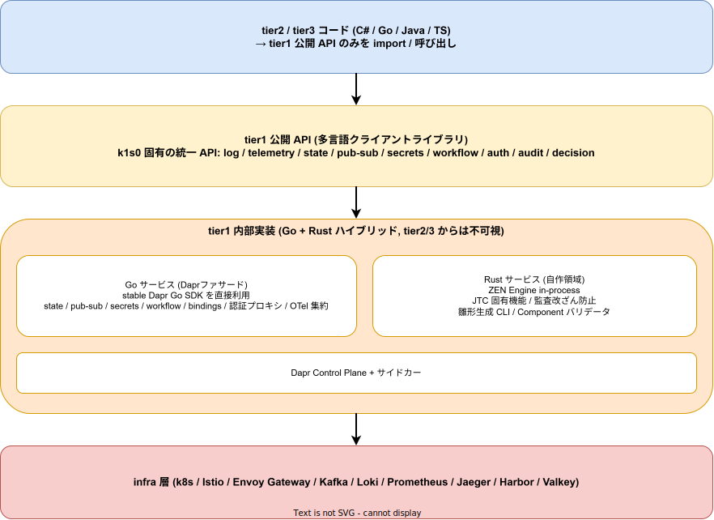

# Dapr 隠蔽方針

## 目的

tier1 が Dapr を採用しつつ tier2 / tier3 から完全に隠蔽するための、設計判断と実現手段を明文化する。tier1 のスコープ全体は [`00_tier1のスコープ.md`](./00_tier1のスコープ.md) を参照。

---

## 1. 基本方針

> **「Dapr を基本、足りない箇所を tier1 自前実装で補完する。tier2 / tier3 は Dapr を一切意識しない」**

この方針は以下の 3 つの目的を同時に達成する。

1. Dapr の機能的恩恵 (building blocks / Workflow / Component 切替等) を享受する
2. Dapr に縛られずに長期保守性を確保する
3. JTC 固有要件 (ログ標準化 / 監査改ざん防止 / 個人情報マスキング) に対応する

---

## 2. tier1 と Dapr の目的別比較 (方針の根拠)

tier1 が担う 3 つの目的について Dapr と機能レベルで比較し、どちらに寄せるかの判断を下した。

| 目的 | tier1 単独 | Dapr 単独 | tier1 + Dapr 併用 | 結論 |
|---|---|---|---|---|
| インフラ層アクセス統一 (state / pub-sub / secrets 等) | ○ (実装コスト高) | **◎** (Component で宣言的切替、言語非依存) | ○ | **Dapr に寄せる** |
| ログ標準化 (構造化ログ形式統一、JTC 監査要件) | **◎** (アプリ内部ログを強制統一) | △ (アプリ内部ログは対象外) | ◎ | **tier1 が必須** |
| OTel 標準化 (計装方法・コンテキスト伝搬) | ○ (アプリ内部のみ) | ○ (サービス境界のみ) | **◎** (補完関係) | **両方必要** |

### 軸別の詳細比較

**(1) インフラ層アクセス統一**

| 観点 | tier1 (k1s0) | Dapr |
|---|---|---|
| 統一の単位 | tier1 が提供する API (各言語クライアントライブラリ) | Dapr HTTP / gRPC API (言語非依存) |
| 抽象の粒度 | k1s0 固有の業務要件に最適化可能 | 業界標準の抽象 (state / pub-sub / secrets / bindings) |
| バックエンド切替 | 設定ファイルで切替可能に設計する必要あり | **Component で宣言的に切替可能、アプリコード変更不要** |
| 言語サポート | tier1 が提供する各言語クライアントに依存 | **言語非依存** (HTTP / gRPC で呼ぶだけ) |
| 実装コスト | **高** (ゼロから実装) | **低** (既存実装を利用) |
| JTC 固有要件 | 自由にカスタマイズ可能 | カスタムコンポーネントとして拡張可能だが学習コストあり |

→ **Dapr が機能面で優位**。tier1 自前実装の合理性は JTC 固有要件への最適化が必要な範囲に限定。

**(2) ログ標準化**

| 観点 | tier1 (k1s0) | Dapr |
|---|---|---|
| ログ形式の強制力 | **tier1 ライブラリを使う限り形式が統一される** | **アプリ内部ログ形式はアプリ任せ** (Dapr は関与しない) |
| 構造化フィールド | tier1 が service\_name / trace\_id / user\_id 等を自動注入 | アプリが自前で構造化する必要あり |
| tracing コンテキスト埋め込み | tier1 ログライブラリが trace\_id / span\_id を自動注入 | アプリ側ログへの trace\_id 伝搬は別途実装が必要 |
| JTC 監査要件 | 自由にカスタマイズ可能 (個人情報マスキング / 監査フォーマット / 改ざん防止) | カスタマイズ余地は限定的 |

→ **tier1 が明確に優位**。Dapr はサービス間通信の抽象化が本質であり、アプリ内部ログまでは強制しない。

**(3) OTel 標準化**

| 観点 | tier1 (k1s0) | Dapr |
|---|---|---|
| 計装範囲 | **アプリケーション内部** (span 生成 / カスタム属性) | **サービス境界** (サイドカー通過時の自動計装) |
| カスタム属性付与 | tier1 が標準属性 (tenant\_id / user\_id 等) を自動注入 | アプリ実装に依存 |
| メトリクス | tier1 メトリクスライブラリ経由で Prometheus に公開 | Dapr 自身のメトリクスを自動公開、アプリメトリクスは別途 |

→ **棲み分け可能だが両方必要**。両方の計装結果を同じ OTel Collector → Jaeger に流すことでエンドツーエンドのトレースが一本化される。

### スコープ再定義の経緯

この比較結果を踏まえ、tier1 のスコープを当初の「インフラ抽象化 + 共通機能の全自前実装」から再定義した。

| 観点 | 従来案 (tier1 全自前実装) | 採用案 (tier1 + Dapr 併用) |
|---|---|---|
| 初期開発コスト | **大** | 中 |
| Dapr への依存 | なし | あり |
| Rust 統一性 | 高 | 中 |
| 業界標準への適合 | 弱 | **強** |
| MVP の現実性 | やや困難 | **現実的** |

tier1 の実装規模が劇的に縮小し、Kafka / state store / secret store クライアント等の自前実装が不要になる。MVP スコープが現実的な範囲に収まり、k1s0 の「車輪の再発明を避ける」原則と整合する。

---

## 3. 3 層構造による隠蔽

### 各層の役割

| 層 | 役割 | 言語 |
|---|---|---|
| tier2 / tier3 コード | 業務ロジック / UI / API | C# / Go / TS 等 |
| tier1 公開 API (多言語クライアントライブラリ) | tier2 / tier3 との唯一の接点。薄いラッパー | 対象言語に合わせる |
| tier1 内部実装 | Dapr Control Plane + Go ファサード + Rust 自作サービス | Go + Rust ハイブリッド |

### 内部実装の判断フロー

tier1 公開 API の実装担当者は、機能を Dapr に寄せるか自前実装するかを以下で判断する。

1. その機能が Dapr の building block で賄えるか
   - Yes → tier1 内部の Go サービスが stable Dapr Go SDK を呼ぶ
   - No → 次の判断へ
2. ZEN Engine / 監査改ざん防止 / 個人情報マスキング / 単一バイナリ CLI など Rust の優位性が出るか
   - Yes → Rust サービスを呼ぶ
   - No → Go (既定) で自前実装

tier2 / tier3 開発者は **この判断に一切関与しない**。

---

## 4. tier1 公開 API の機能マッピング

| カテゴリ | 公開 API | 内部実装 |
|---|---|---|
| Service invocation | `k1s0.Service.Invoke*` | Go ファサード → Dapr Go SDK |
| State management | `k1s0.State.*` | Go ファサード → Dapr Go SDK |
| Pub / Sub | `k1s0.PubSub.*` | Go ファサード → Dapr Go SDK |
| Secrets | `k1s0.Secrets.*` | Go ファサード → Dapr Go SDK → OpenBao (MVP-1b 以降) |
| Bindings | `k1s0.Binding.*` | Go ファサード → Dapr Go SDK |
| Actors | `k1s0.Actor.*` (必要に応じて) | Go ファサード → Dapr Go SDK |
| Workflow (Saga) | `k1s0.Workflow.*` | Go ファサード → Dapr Workflow |
| Configuration | `k1s0.Config.*` | Go ファサード → Dapr Go SDK |
| Distributed lock | `k1s0.Lock.*` | Go ファサード → Dapr Go SDK |
| ログ標準化 | `k1s0.Log.*` | tier1 各言語ライブラリで構造化ログ実装 |
| OTel 計装 (アプリ内部) | `k1s0.Telemetry.*` | tier1 各言語ライブラリで OTel SDK をラップ |
| 決定エンジン (BRE) | `k1s0.Decision.*` | tier1 Rust サービス + ZEN Engine in-process |
| JTC 固有機能 (監査改ざん防止 / PII マスキング) | `k1s0.Audit.*` / `k1s0.Pii.*` | tier1 Rust サービス |
| Dapr Component 構成管理 | (tier2 / tier3 には見えない) | tier1 Rust CLI / バリデータ + tier1 チーム集中管理 |
| 設定同期 (端末横断) | `k1s0.Settings.*` | Go ファサード → Dapr State / Configuration |
| 雛形生成 | (CLI として提供) | tier1 Rust ツール (Go / Rust 両方の雛形を出力) |

---

## 5. 隠蔽の徹底: 表に出してはならないもの

| 隠蔽対象 | tier2 / tier3 に現れてはならない | 吸収する場所 |
|---|---|---|
| Dapr SDK の import | `using Dapr.Client;` 等 | tier1 公開ライブラリ内部 |
| Pod annotation | `dapr.io/enabled: "true"` 等 | 雛形生成 CLI が自動付与 |
| Dapr Component YAML | `apiVersion: dapr.io/v1alpha1` | tier1 チームが `src/tier1/` で集中管理 |
| Dapr のエラーメッセージ | `dapr client timeout` 等の文字列 | tier1 ライブラリが k1s0 固有例外に変換 |
| ログ / トレース属性 | `dapr.io/*` 属性 | tier1 ライブラリが `k1s0.*` 属性に正規化 |
| 設定ファイルのキー | `DAPR_GRPC_PORT` 等 | tier1 ライブラリが k1s0 固有キーに変換 |

これらの違反は CI ガード (Roslyn analyzer / `golangci-lint` / YAML lint) で検出する。詳細は [`03_API設計原則.md`](./03_API設計原則.md) を参照。

---

## 6. Dapr の階層配置

| 観点 | 判断 |
|---|---|
| Dapr Control Plane の配置 | `tier1` namespace |
| Dapr は infra か tier1 か | **tier1 の構成要素** |
| その理由 | Dapr が提供する機能はまさに「tier1 が提供すべき共通基盤サービス」そのもの |
| tier2 / tier3 が Dapr API を呼ぶこと | 概念上は「tier1 を呼ぶ」の一形態とみなす (物理的には tier1 公開 API 経由) |

この階層付けにより「infra 層への直接依存は tier1 のみ」という依存ルール ([`../02_アーキテクチャ/02_依存ルールと通信経路.md`](../02_アーキテクチャ/02_依存ルールと通信経路.md)) を維持できる。

---

## 7. 受け入れるリスクと対処

| リスク | 対処 |
|---|---|
| Dapr の方向転換 / 互換性破壊 | 雛形生成 CLI が Dapr API 利用を間接化。破壊的変更時は CLI 出力の更新で吸収 |
| Dapr Control Plane の運用コスト | tier1 チームが Dapr 運用を担当。MVP 段階で運用手順書を整備 |
| Dapr Rust SDK が Alpha | Daprファサードは Go で実装し stable Go SDK を直接利用。Rust は Dapr 非依存の自作領域に限定 |
| 2 系統 (Dapr / 自前) の判断基準の曖昧さ | 「Dapr で賄えるならまず Dapr」という原則を明文化。迷う事例は tier1 チームでレビュー |
| サイドカー方式のリソース消費 | 必要に応じて Dapr Shared (DaemonSet / Deployment 方式) への切替を tier1 内で判断 |

---

## 8. 将来の見直し条件

以下のいずれかが成立した場合、本方針を再評価する。

1. Dapr Rust SDK が Stable に到達 → Daprファサードを Rust に統一する選択肢が現実的に
2. Dapr の代替となる OSS building blocks が CNCF 標準化 → 差し替え検討
3. JTC 固有要件が Dapr Component で完全に吸収できるようになった → 自前実装部分の縮小

見直しは各 Phase 終了時のレトロスペクティブで定量的にチェックする。

---

## 関連ドキュメント

- [`00_tier1のスコープ.md`](./00_tier1のスコープ.md) — tier1 全体のスコープ
- [`02_内部言語ハイブリッド.md`](./02_内部言語ハイブリッド.md) — Go + Rust の使い分け
- [`03_API設計原則.md`](./03_API設計原則.md) — Dapr 隠蔽を強制する CI ガード
- [`../02_アーキテクチャ/02_依存ルールと通信経路.md`](../02_アーキテクチャ/02_依存ルールと通信経路.md) — 依存ルールと通信
- [`../04_技術選定/01_実行基盤中核OSS.md`](../04_技術選定/01_実行基盤中核OSS.md) — Dapr の選定根拠
- [`../06_競合と差別化/01_主要製品別評価.md`](../06_競合と差別化/01_主要製品別評価.md) — Dapr との重複と棲み分け
