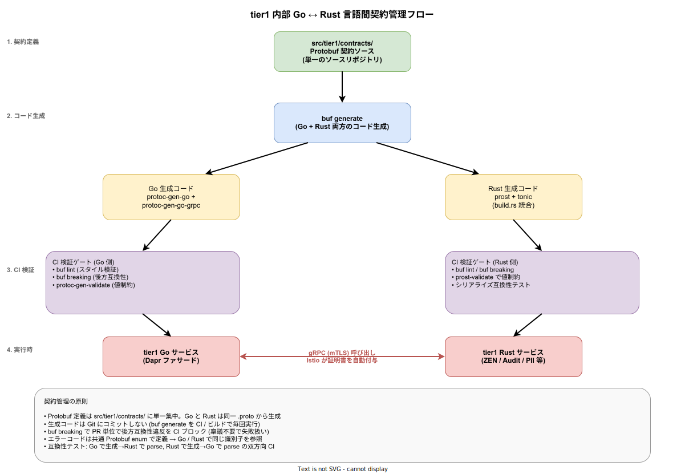

# 言語間契約管理 (Go ↔ Rust)

## 目的

tier1 内部が Go と Rust のハイブリッド構成 ([`02_内部言語ハイブリッド.md`](./02_内部言語ハイブリッド.md)) である以上、Go サービスと Rust サービス間の **gRPC 契約の整合性** を構造的に担保する仕組みが必須となる。本資料は Protobuf スキーマの集中管理・後方互換性検証・CI ガード・テスト戦略を定義し、「型不整合バグを構造的に防止する」([`02_内部言語ハイブリッド.md`](./02_内部言語ハイブリッド.md) 第 6 章) を具体化する。

[`04_APIバージョニング戦略.md`](./04_APIバージョニング戦略.md) が **tier2 / tier3 に公開される API** のバージョニングを扱うのに対し、本資料は **tier1 内部の Go ↔ Rust 間** の契約管理に特化する。両者は Protobuf / `buf` を共通基盤として使うが、管理粒度と互換性要件が異なる。



上図は、Protobuf 契約を起点に Go 生成コード・Rust 生成コードがどの経路で CI 検証を通過し、最終的に gRPC (mTLS) 通信に供されるかを縦方向に描画している。左端のステップ番号 (契約定義 → コード生成 → CI 検証 → 実行時) は、本資料の章構成 (2 章: スキーマ管理、3 章: 互換性検証、4 章: 制約検証、7 章: 実行時) と対応する。

---

## 1. 設計原則

### 1.1 3 つの基本原則

| 原則 | 内容 |
|---|---|
| 契約は Protobuf に集中 | Go / Rust が共有する `.proto` ファイルを唯一の正の定義とする |
| 手書き生成コード禁止 | `buf generate` による自動生成のみを許可、手書きは CI で検出・ブロック |
| 破壊的変更は CI で拒否 | `buf breaking` による後方互換性の自動検証 |

これらは [`02_内部言語ハイブリッド.md`](./02_内部言語ハイブリッド.md) 第 3 章の「言語境界の規約」を技術的に実装する。

### 1.2 契約の集中管理

tier1 が管理する Protobuf 契約は 2 系統に分ける。本資料は後者を対象とする。

| 系統 | 配置 | 管理対象 |
|---|---|---|
| 公開 API 契約 | `src/tier1/contracts/api/v1/` | tier2 / tier3 向け `k1s0.*` API |
| 内部契約 | `src/tier1/contracts/internal/v1/` | tier1 Go サービス ↔ Rust サービス間 |

内部契約は tier2 / tier3 に公開しないため、MAJOR バージョン変更の制約が緩い。ただし Go と Rust の両サービスが同時リリースされるとは限らないため、後方互換性は確保する。

---

## 2. Protobuf スキーマ管理

### 2.1 ディレクトリ構成

```
src/tier1/contracts/
├── api/
│   └── v1/
│       ├── log.proto
│       ├── state.proto
│       ├── pubsub.proto
│       └── ...
├── internal/
│   └── v1/
│       ├── decision.proto       # k1s0.Decision (Rust サービス) 内部契約
│       ├── audit.proto          # k1s0.Audit (Rust サービス) 内部契約
│       ├── pii.proto            # k1s0.Pii (Rust サービス) 内部契約
│       └── ...
├── common/
│   └── v1/
│       ├── error_codes.proto    # 全 tier1 サービス共通のエラーコード
│       └── observability.proto  # OTel 属性などの共通型
└── buf.yaml
```

`common/v1/` は Go / Rust 双方がインポートする共通型。エラーコードの enum は tier1 内部で統一され、[`02_内部言語ハイブリッド.md`](./02_内部言語ハイブリッド.md) 第 3 章の「エラーコード体系を言語横断で同一にする」を実現する。

### 2.2 スキーマ設計規約

| 規約 | 理由 |
|---|---|
| フィールド番号は一度使ったら削除しても再利用しない | `reserved` 宣言で明示。互換性バグの最大要因 |
| 必須フィールドを使わない (proto3 では概念なし、custom validation で代替) | 将来の後方互換性のため |
| enum の 0 値は `UNKNOWN` または `UNSPECIFIED` に予約 | proto3 のデフォルト値が 0 のため |
| メッセージの削除禁止 (非推奨化のみ) | 並行稼働期間中に必要 |
| フィールドの型変更禁止 | 破壊的変更の定義 ([`04_APIバージョニング戦略.md`](./04_APIバージョニング戦略.md) 第 2.1 節) |

### 2.3 CODEOWNERS 設定

`src/tier1/contracts/` 配下の変更は tier1 チームの必須レビューとする。GitHub の CODEOWNERS を以下で設定する。

```
# .github/CODEOWNERS
/src/tier1/contracts/**  @k1s0-org/tier1-team
/src/tier1/contracts/api/**  @k1s0-org/tier1-team @k1s0-org/architecture-team
/src/tier1/contracts/internal/**  @k1s0-org/tier1-team
```

API 契約 (公開 API) はアーキテクチャチームのレビューも必須、内部契約は tier1 チームだけで完結。2 チームレビューで時間がかからない構造とする。

---

## 3. 後方互換性の自動検証

### 3.1 buf breaking の導入

[Buf](https://buf.build/) は Protobuf スキーマの lint / 後方互換性検証の事実上の標準ツール ([`../04_技術選定/10_Protobufとロールアウト.md`](../04_技術選定/10_Protobufとロールアウト.md) で採用済み)。本資料では `buf breaking` を CI に組み込んで破壊的変更を機械的に検出する。

### 3.2 buf.yaml 設定

```yaml
# src/tier1/contracts/buf.yaml
version: v2
modules:
  - path: api/v1
  - path: internal/v1
  - path: common/v1
lint:
  use:
    - STANDARD
  except:
    - PACKAGE_VERSION_SUFFIX  # 旧スタイルの v1 ディレクトリ命名
breaking:
  use:
    - FILE  # ファイル単位で変更検出
```

### 3.3 CI での実行

PR 作成時に以下を実行する。

| ステップ | コマンド | 期待結果 |
|---|---|---|
| Lint | `buf lint` | スタイル違反ゼロ |
| 破壊的変更検出 | `buf breaking --against .git#branch=main` | 破壊的変更あれば PR ブロック |
| 生成コード検証 | `buf generate && git diff --exit-code` | 手書き修正あれば検出 |

`buf breaking` は以下のような変更を検出する。

- フィールドの削除 (reserved 宣言なし)
- フィールド番号の変更
- フィールドの型変更
- message の削除
- service の削除
- RPC メソッドの削除

### 3.4 破壊的変更が必要な場合の手順

内部契約でも破壊的変更が必要な場合は以下の手順で行う。

1. **RFC 起票**: tier1 チーム内で RFC (Request for Comments) を起票
2. **並行提供**: 新メッセージ `DecisionRequestV2` を追加し、旧 `DecisionRequest` を `[deprecated = true]` で 1 Minor バージョン以上並行提供
3. **両サービスの対応**: Go / Rust の両サービスが新メッセージを処理できる状態にする
4. **呼び出し側の移行**: 全呼び出し側 (tier1 内部) が新メッセージに移行したことを確認
5. **削除**: 旧メッセージを `reserved` で封印して削除

並行提供期間は tier1 内部では **最低 2 週間**、tier2 / tier3 への影響がある場合は公開 API のバージョニング ([`04_APIバージョニング戦略.md`](./04_APIバージョニング戦略.md)) に従う。

---

## 4. メッセージレベルの制約検証

### 4.1 protoc-gen-validate の導入

Protobuf の型チェックだけでは「文字列長さ制限」「数値範囲制限」「UUID 形式」などのビジネス制約を表現できない。これを補う [protoc-gen-validate (PGV)](https://github.com/bufbuild/protoc-gen-validate) (現在は `protovalidate` に移行中) を利用する。

### 4.2 制約の記述例

```protobuf
// src/tier1/contracts/internal/v1/decision.proto
syntax = "proto3";
package k1s0.tier1.internal.v1;

import "buf/validate/validate.proto";

// 決定エンジン評価リクエスト
message DecisionRequest {
  // 評価対象の JDM ID (UUID 形式必須)
  string jdm_id = 1 [(buf.validate.field).string.uuid = true];
  // 評価コンテキスト (非空必須、最大 64KB)
  bytes context = 2 [(buf.validate.field).bytes = {
    min_len: 1
    max_len: 65536
  }];
  // リクエスト元の tier1 サービス名
  string source_service = 3 [(buf.validate.field).string = {
    min_len: 1
    max_len: 64
    pattern: "^[a-z][a-z0-9-]*$"
  }];
}
```

### 4.3 Go / Rust 双方での検証実行

- Go: `protoc-gen-validate-go` で `Validate()` メソッドを生成、ハンドラ入口で呼び出す
- Rust: `protovalidate-rust` で `Validate` trait を生成、ハンドラ入口で呼び出す

両言語で **同一の制約** が適用され、Go サービスが受け付けるリクエストと Rust サービスが受け付けるリクエストの正規表現・長さ制限が一致する。これにより「Go ではパスするが Rust で落ちる」といった不整合を構造的に防止する。

---

## 5. コード生成の自動化

### 5.1 buf generate の実行

`src/tier1/contracts/buf.gen.yaml` で Go / Rust 両言語のコード生成を定義する。

```yaml
version: v2
plugins:
  # Go
  - remote: buf.build/protocolbuffers/go
    out: src/tier1/gen/go
  - remote: buf.build/grpc/go
    out: src/tier1/gen/go
    opt: paths=source_relative
  - remote: buf.build/bufbuild/validate-go
    out: src/tier1/gen/go
  # Rust (tonic)
  - local: protoc-gen-tonic
    out: src/tier1/gen/rust
  - local: protoc-gen-prost
    out: src/tier1/gen/rust
  - local: protoc-gen-prost-validate
    out: src/tier1/gen/rust
```

### 5.2 生成コードの扱い

| 項目 | 方針 |
|---|---|
| 生成先 | `src/tier1/gen/{go,rust}/` (ソースツリー内) |
| Git 管理 | **生成コードを Git に含める** (再現性とビルド速度を優先) |
| 手書き編集 | **禁止**。CI が `git diff --exit-code` で検出 |
| 更新タイミング | `.proto` 変更時に `buf generate` を実行し PR に含める |

生成コードを Git に含めるか否かは議論があるが、k1s0 は以下の理由で含める方針を採用する。

1. PR レビュー時に Go / Rust 両言語のインタフェース変更を diff で確認できる
2. CI のビルド時間短縮 (再生成をスキップ可能)
3. IDE の補完・リファクタリングが開発環境で即座に動く

### 5.3 CI での diff 検証

PR に生成コードが含まれない場合を検出するため、CI で以下を実行する。

```bash
# .github/workflows/proto.yml の一部
- name: Regenerate protobuf code
  run: buf generate
- name: Verify no diff
  run: git diff --exit-code src/tier1/gen/
```

差分があれば「生成コードの更新忘れ」として PR をブロックする。

---

## 6. テスト戦略

### 6.1 3 層のテスト

| レイヤ | 目的 | 実装 |
|---|---|---|
| Schema テスト | Protobuf スキーマ自体の正当性 | `buf lint` / `buf breaking` |
| シリアライズ互換性テスト | 同一メッセージを Go / Rust 双方でシリアライズ / デシリアライズ可能か | `cargo test` + `go test` の両方で実行 |
| gRPC E2E テスト | Go サーバ ↔ Rust クライアント / 逆パターン | Testcontainers + grpcurl |

### 6.2 シリアライズ互換性テストの実装例

Rust 側と Go 側の両方に、以下のテストをペアで実装する。

```go
// src/tier1/gen/go/decision_test.go
func TestDecisionRequestRoundTrip(t *testing.T) {
    original := &DecisionRequest{
        JdmId: "550e8400-e29b-41d4-a716-446655440000",
        Context: []byte(`{"user_id": "u001"}`),
        SourceService: "k1s0-workflow",
    }
    bytes, err := proto.Marshal(original)
    require.NoError(t, err)
    // Rust が生成したテストデータを読み込んで同じ結果になるか検証
    rustBytes, err := os.ReadFile("testdata/decision_request_from_rust.bin")
    require.NoError(t, err)
    require.Equal(t, rustBytes, bytes)
}
```

```rust
// src/tier1/gen/rust/decision_test.rs
#[test]
fn decision_request_matches_go_serialization() {
    let req = DecisionRequest {
        jdm_id: "550e8400-e29b-41d4-a716-446655440000".to_string(),
        context: br#"{"user_id": "u001"}"#.to_vec(),
        source_service: "k1s0-workflow".to_string(),
    };
    let bytes = req.encode_to_vec();
    let go_bytes = std::fs::read("testdata/decision_request_from_go.bin").unwrap();
    assert_eq!(bytes, go_bytes);
}
```

これにより、フィールドのエンコード順序・Varint 表現・ゼロ値の扱いが両言語で一致することを構造的に担保する。

### 6.3 gRPC E2E テストの実装

Testcontainers を用いて以下を実行する ([`../04_技術選定/07_ストレージと運用補助.md#P`](../04_技術選定/07_ストレージと運用補助.md))。

| テスト対象 | 実装 |
|---|---|
| Go クライアント → Rust サーバ | Rust サーバを Testcontainers で起動、Go クライアントが呼び出し成功を検証 |
| Rust クライアント → Go サーバ | Go サーバを Testcontainers で起動、Rust クライアントが呼び出し成功を検証 |
| 異常系 (不正なリクエスト) | 両言語で PGV 制約違反リクエストを送り、同一のエラーコードが返ることを検証 |

### 6.4 カオステスト

Phase 2 以降、Litmus ([`../04_技術選定/07_ストレージと運用補助.md`](../04_技術選定/07_ストレージと運用補助.md)) で以下を検証する。

- Rust サービス停止時に Go サービスが適切にフォールバック / 再試行する
- ネットワーク遅延注入下でも gRPC タイムアウトが機能する
- Rust サービスのメモリ不足時に Go サービスが適切にエラーハンドリングする

---

## 7. リリースフロー

### 7.1 スキーマ変更から本番デプロイまで

```
(1) .proto を編集
    ↓
(2) buf generate で Go / Rust 両言語のコードを再生成
    ↓
(3) 生成コード込みで PR を作成
    ↓
(4) CI: buf lint / buf breaking / diff チェック / Go 側ユニットテスト / Rust 側ユニットテスト / シリアライズ互換性テスト
    ↓
(5) PR レビュー (CODEOWNERS = tier1 team)
    ↓
(6) マージ後: Go サービス / Rust サービスのイメージを並行ビルド
    ↓
(7) Argo CD で両サービスを同時デプロイ (並行デプロイ)
```

両サービスの同時デプロイは、後方互換な変更であれば片方だけ先行デプロイしても動作するが、**不測の事故を防ぐため同時デプロイを原則**とする。Argo Rollouts でカナリアリリースし、同時デプロイ後の擬似トラフィックで両サービスの互換性を確認する。

### 7.2 ロールバック手順

以下のいずれかが発生した場合はロールバックを実行する。

- カナリアリリース中にエラーレートが閾値超過
- シリアライズ互換性テストが本番で失敗
- gRPC コールの成功率低下

ロールバックは Argo Rollouts の `rollback` コマンドで両サービスを同時に旧バージョンに戻す。

---

## 8. 段階的導入計画

本資料の全施策を Phase 1a から完全導入するのは現実的でない。以下の段階で導入する。

| Phase | 導入施策 |
|---|---|
| Phase 1a (MVP-0) | Protobuf 集中管理 (`src/tier1/contracts/`) + buf lint のみ |
| Phase 1b (MVP-1a) | buf breaking + 生成コードの diff 検証 + CODEOWNERS |
| Phase 1c (MVP-1b) | シリアライズ互換性テスト + gRPC E2E テスト |
| Phase 2 | protoc-gen-validate 導入 + カオステスト |
| Phase 3 以降 | Rust / Go 双方の analyzer 強化 ([`03_API設計原則.md`](./03_API設計原則.md) 第 7 項) |

Phase 1b 時点で CI の後方互換性検証が機能し、「知らぬ間に破壊的変更が混入」する事態を防止する。

---

## 9. 障害時のデバッグ支援

Go ↔ Rust 境界で発生した問題を迅速に切り分けるため、以下を標準化する。

| 項目 | 標準化内容 |
|---|---|
| 構造化ログ | `service.name` / `service.language` / `trace_id` / `span_id` を必須属性として OTel で付与 |
| エラーコード | Protobuf enum (`common/v1/error_codes.proto`) を全サービスで共有 |
| エラーメッセージ | 日本語 (JTC 運用者向け) + 英語 (開発者向け) の 2 言語併記 |
| スタックトレース | Rust は `tracing` クレート、Go は `runtime/debug` を使い同一フォーマットで出力 |

これにより「Rust サービスが返したエラーコードを Go サービスが解釈」する際の曖昧性がなくなり、障害調査の初手が言語非依存になる。

---

## 10. 決裁者向け答弁

決裁者が「Go と Rust の 2 言語で管理が破綻しないのか」と問うた際の回答。

> 言語境界の型不整合は、Protobuf による契約集中管理と `buf breaking` の自動検証で **CI の段階で拒否** されます。Go サービスと Rust サービスは同じ `.proto` ファイルから自動生成されたコードを使うため、手作業で整合を取る必要はありません。加えて、`protoc-gen-validate` で両言語に同一のバリデーション制約を適用するため「Go では通るが Rust で落ちる」といった不整合は構造的に起きません。5 年運用中の契約管理コストは、初期の仕組み構築 (3 人月) と年間 2 〜 3 人月の保守で収まる設計になっています。

---

## 11. 関連ドキュメント

- [`02_内部言語ハイブリッド.md`](./02_内部言語ハイブリッド.md) — ハイブリッド方針の設計根拠
- [`03_API設計原則.md`](./03_API設計原則.md) — tier1 公開 API の設計原則と analyzer
- [`04_APIバージョニング戦略.md`](./04_APIバージョニング戦略.md) — tier2 / tier3 向け公開 API のバージョニング
- [`../04_技術選定/10_Protobufとロールアウト.md`](../04_技術選定/10_Protobufとロールアウト.md) — Buf の採用根拠
- [`../04_技術選定/18_言語選定の定量分析.md`](../04_技術選定/18_言語選定の定量分析.md) — Go / Rust 選定の定量根拠
- [`../05_CICDと配信/00_CICDパイプライン.md`](../05_CICDと配信/00_CICDパイプライン.md) — CI での契約検証の統合
