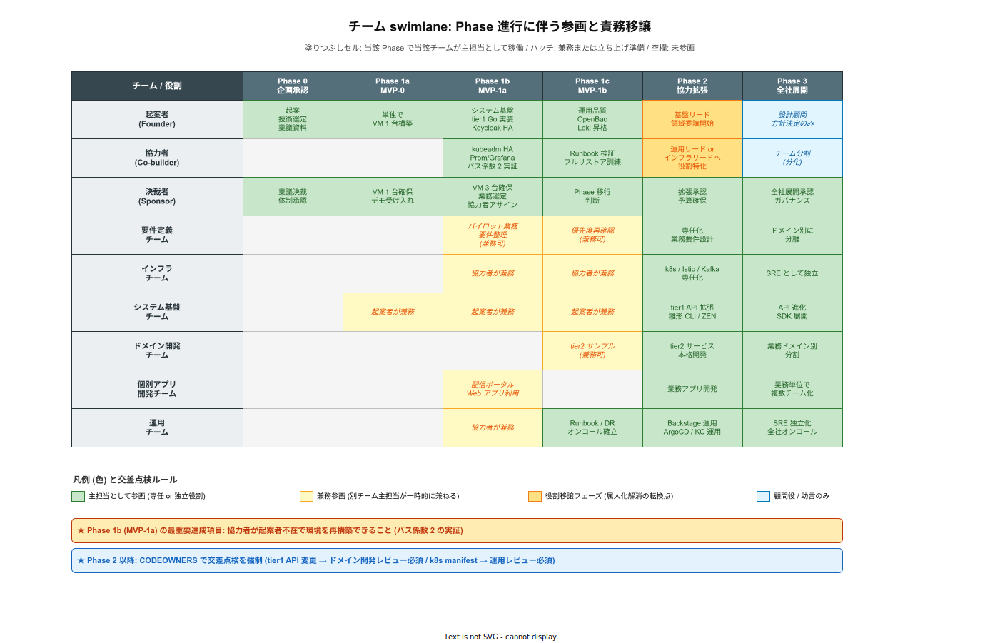

# 体制と役割

## 目的

k1s0 の各チームの管轄と役割、MVP 時点 / 拡張フェーズ時点の体制像を整理する。フェーズ計画は [`00_フェーズ計画.md`](./00_フェーズ計画.md) を参照。

---

## 1. 体制の時間的推移 (swimlane)

チーム構成を文章で列挙するだけでは「誰がいつ参加し、誰の役割が移譲されていくか」が追えない。以下の図は Phase 0 〜 3 を横軸、主要 9 チーム (役割) を縦軸にとり、各フェーズで誰が主担当となるかを色分けで示す。色の意味は図の凡例と一致する。

図の重要な読み方は 3 点。

- **Phase 1b (MVP-1a) 列の緑セル 2 つ (起案者・協力者)** が、バス係数を 1 から 2 に引き上げる転換点である。ここで協力者が起案者不在で環境を再構築できないと Phase 1c に進めない。
- **Phase 2 列の黄色 (役割移譲フェーズ)** が、起案者の属人化を解消する転換点である。起案者はシステム基盤リードに専念し、他の領域 (インフラ / 運用) は協力者に委譲する。この移譲が進まないと Build リスク ([`../02_競合と差別化/03_BuildVsBuy.md`](../02_競合と差別化/03_BuildVsBuy.md)) が現実化する。
- **Phase 3 列の薄青 (起案者の顧問化)** に到達してはじめて、起案者が離脱してもプロジェクトが継続可能な状態になる。組織運営の確立としての最終ゲート。

以下、このタイムラインを前提に「最終形のチーム構成 → 関係 → 各フェーズの人員 → KPI → 週次同期 → 既存組織マッピング」の順で詳述する。

---

## 2. チーム構成 (最終形)

| チーム | 管轄ディレクトリ | 主担当範囲 | 主要スキル | 想定開発者レベル |
|---|---|---|---|---|
| **インフラチーム** | `infra/` | k8s / Istio / Envoy Gateway / Kafka / Loki / Prometheus / Grafana Tempo / Valkey / Harbor | k8s / ネットワーク / OSS 運用 | — |
| **システム基盤チーム** | `src/tier1/` | tier1 公開 API / Dapr 内部実装 / Go ファサード / Rust 自作領域 / 雛形生成 CLI / ZEN Engine 統合 | Go / Rust / Dapr / OSS 開発 | アーキテクト級 |
| **ドメイン開発チーム** | `src/tier2/` | 業務ドメインロジック / tier1 公開 API の利用 | C# / Go / 業務ドメイン | ドメイン寄りの上級 |
| **個別アプリ開発チーム** | `src/tier3/` | 業務アプリ / アプリ配信ポータル | C# / Go / MAUI / React | 初級〜中級 |
| **要件定義チーム** | (横断) | 業務要件 / 優先度 / 稟議フロー | 業務理解 / ファシリテーション | — |
| **運用チーム** | `operation/` | 監視 / オンコール / リリース管理 / Backstage / Argo CD / Keycloak | SRE / k8s 運用 | — |

---

## 3. チーム間の関係

tier 構成と同じく、**依存は上から下への 1 方向** ([`../../02_構想設計/01_アーキテクチャ/01_基礎/02_依存ルールと通信経路.md`](../../02_構想設計/01_アーキテクチャ/01_基礎/02_依存ルールと通信経路.md))。チーム間の関係もこれに準じる。

| 下位チーム | 上位チーム | 提供 |
|---|---|---|
| インフラチーム | システム基盤チーム | k8s / メッシュ / メッセージング / 観測基盤 |
| システム基盤チーム | ドメイン開発 / 個別アプリ開発 | tier1 公開 API / 雛形生成 CLI / リファレンス実装 / TechDocs |
| ドメイン開発チーム | 個別アプリ開発チーム | 業務ドメイン API |
| 運用チーム | 全チーム | リリース管理 / 監視ダッシュボード / インシデント対応 |
| 要件定義チーム | ドメイン開発 / 個別アプリ開発 | 業務要件 / 優先度 |

### 禁止される結合

- 個別アプリ開発チームが tier1 内部実装 (Go ファサード / Rust 自作領域) に直接アクセスする
- 個別アプリ開発チームが infra 層 (Kafka / Valkey 等) に直接アクセスする
- ドメイン開発チームが Dapr SDK / annotation / Component YAML を扱う

これらの禁止は [`../../02_構想設計/02_tier1設計/02_API契約/03_API設計原則.md`](../../02_構想設計/02_tier1設計/02_API契約/03_API設計原則.md) の 5 層防御 (雛形 / Opinionated / CI ガード / リファレンス / チェックリスト) で強制する。

---

## 4. フェーズ別の体制

### Phase 0 (企画承認)

| 役割 | 人数 |
|---|---|
| 起案者 | 1 |

### Phase 1a (MVP-0): デモ構成

**VM 1 台で起案者単独** で構築する。3〜4 週間でデモ可能な最小構成。

| 役割 | 人数 | 備考 |
|---|---|---|
| 起案者 | 1 | kubeadm + Dapr + tier1 最小 + Keycloak + 配信ポータル |
| 決裁者 | 1 | デモの受け手。VM 1 台の確保 (既存 or 手元マシン) |

**MVP-0 の目的は「動くもの」で決裁者を説得し、MVP-1a の VM 3 台確保と協力者 1 名のアサインを獲得すること**。

### Phase 1b (MVP-1a): パイロット運用開始

MVP-0 のデモ後、**2 名体制** でパイロット業務に必要な最小構成を構築する。

| 役割 | 人数 | 備考 |
|---|---|---|
| 起案者 (兼システム基盤チーム) | 1 | tier1 Go + Keycloak HA + Argo CD 設定 |
| 協力者 (兼インフラ or 運用) | 1 | kubeadm HA (kubespray) + Prometheus / Grafana + GHA runner。**起案者と知識を分散** |
| 決裁者 | 1 | VM 3 台の確保 / パイロット業務の選定 |
| パイロット業務のユーザー | 数名 | 配信ポータルからの Web アプリ利用者 |

**MVP-1a の最重要完了条件**: 起案者以外の協力者が、手順書に従い独立して環境を再構築できること (バス係数 2 の実証)。

### Phase 1c (MVP-1b): 運用品質の確保

MVP-1a で「動く」状態を作った後、**運用に耐える状態** に引き上げる。新機能の追加はせず運用基盤の補強に集中する。体制は MVP-1a と同一。

| 役割 | 人数 | 備考 |
|---|---|---|
| 起案者 | 1 | Harbor / Trivy / Loki / Sealed Secrets の導入 |
| 協力者 | 1 | バックアップ手順・Runbook の検証。**フルリストア訓練を単独で実施** |

**MVP-1b の完了条件**: 協力者が起案者不在で障害シミュレーション → Runbook 参照 → 対処を完結できること。

### Phase 2

協力体制を拡張する。**2〜3 名規模**。

| 役割 | 人数 | 主担当 |
|---|---|---|
| システム基盤チーム | 2〜3 | tier1 公開 API 拡張 / 雛形生成 CLI / ZEN Engine 統合 |
| インフラチーム | 1 (兼務可) | k8s / Istio / Kafka 運用 |
| ドメイン開発チーム | 1 (パイロット業務担当) | tier2 サンプルサービス |
| 要件定義チーム | 1 | 業務要件整理 |

### Phase 3 以降

業務スコープの拡大に応じてチームを分離・拡充する。

- 個別アプリ開発チームが複数に増える (業務単位)
- 運用チームが SRE として独立
- 要件定義チームが業務ドメインごとに分かれる

---

## 5. 起案者の役割推移

起案者は Phase の進行に合わせて役割を移譲していく。**個人開発起点のリスクを低減する** ための必須動線。

| フェーズ | 起案者の役割 | 目的 |
|---|---|---|
| Phase 0 | 全ての起案・技術選定・ドキュメント | 企画承認 |
| Phase 1a (MVP-0) | 単独で最小デモ構成を構築 | 決裁者を説得し協力者を獲得 |
| Phase 1b (MVP-1a) | 協力者と 2 名でパイロット最小構成を構築 | パイロット稼働 + **バス係数 2 の実証** |
| Phase 1c (MVP-1b) | 運用品質の確保に集中 | 起案者不在でも運用可能な状態 |
| Phase 2 | システム基盤チームのリード。他領域は協力者に委譲 | 属人化の解消開始 |
| Phase 3 | 設計レビュー / 方針決定。実装は他メンバー主体 | バス係数の向上 |
| Phase 4 | アーキテクチャ監督 / 横断的助言 | 組織運営の確立 |
| Phase 5 | 必要に応じて設計顧問 | 引き継ぎ完了 |

**この移譲が進まないと Build リスク ([`../02_競合と差別化/03_BuildVsBuy.md`](../02_競合と差別化/03_BuildVsBuy.md)) が現実化する**。Phase 2 への移行時に必ず協力体制を組成することが重要。

---

## 6. お願いしたいこと

### 即時 (Phase 0 → Phase 1a)

1. **MVP-0 の承認** — デモ構成の構築開始判断
2. **デモ用 VM 1 台の確保** (4 vCPU / 8 GB / 100 GB SSD)。既存の開発用 VM でも可。新規稟議は不要な範囲

### 短期 (MVP-0 デモ後 → Phase 1b)

3. **MVP-1a 用 VM 3 台の確保** (4 vCPU / 8 GB / 200 GB SSD)。詳細は [`01_MVPスコープ.md`](./01_MVPスコープ.md)
4. **協力者 1 名のアサイン** — 起案者と知識を分散し、バス係数を 2 にする
5. **対象パイロット業務の選定** — まず 1 つの小規模業務で実証
6. **既存 .NET Framework 資産の棚卸し協力** — Phase 4〜5 向けの事前準備

### 中期 (Phase 2 移行時)

7. **協力チームの拡張** (2〜3 名) — システム基盤 / インフラ / ドメイン開発の兼務含む
8. **ライセンス / 知財の整理** — 起案者帰属 + 所属企業への無償・非独占・取消不能の社内利用許諾の合意

---

## 7. チーム別 KPI と判定ロジック

体制は「配置しただけ」では動かない。各チームが何で評価されるかを事前に合意し、稟議の場で「MVP-0 は成功したのか」「Phase 1c を Phase 2 に引き上げて良いか」を機械的に判断できるようにする。KPI は「数値指標」「測定ソース」「判定しきい値」の 3 点セットで定義する。数値がない目標は KPI に含めない。

### 6.1 フェーズ共通 KPI (横串)

どのフェーズでも外せない指標。未達であれば次フェーズに進めない。

| KPI | 目的 | 測定ソース | MVP-0 | MVP-1a | MVP-1b | Phase 2 |
|---|---|---|---|---|---|---|
| **バス係数** | 属人化の解消 | 手順書に基づく再構築訓練の完了人数 | 1 (起案者のみ許容) | **2 (必達)** | 2 (維持) | 3 以上 |
| **Runbook 充足率** | 障害時の対処可能性 | tier1 主要障害シナリオ 15 件中、Runbook 記載済み件数 / 15 | 5/15 以上 | 10/15 以上 | **15/15 (必達)** | 15/15 (維持) |
| **ドキュメント鮮度** | 「動くが読めない」状態の防止 | 対応コードから 30 日以内に更新されたページ割合 | 60% 以上 | 75% 以上 | **90% 以上 (必達)** | 90% 以上 |
| **SBOM 生成率** | 法務監査対応 ([`../../02_構想設計/05_法務とコンプライアンス/00_OSS法務対応.md`](../../02_構想設計/05_法務とコンプライアンス/00_OSS法務対応.md)) | 全リリースのうち SBOM 添付済み件数 | 0% 許容 | 50% 以上 | **100% (必達)** | 100% |

「必達」の KPI が未達のまま次フェーズに進むことは、起案者の裁量では決定できない。決裁者の明示的な例外承認が必要。

### 6.2 チーム別 KPI (主担当別)

| チーム | 重点 KPI | しきい値 | 未達時の影響 |
|---|---|---|---|
| **システム基盤チーム** | tier1 公開 API の SLO 準拠率 | 95 パーセンタイル応答 < 300 ms、月間可用性 99.5% | tier2/3 の開発停滞、信頼失墜 |
| システム基盤チーム | 雛形生成 CLI の利用率 | 新規 tier2 サービスの 80% が雛形起点 | 技術的負債の増殖、レビュー工数爆発 |
| **ドメイン開発チーム** | tier1 公開 API の利用比率 | tier2 サービスが tier1 API 経由で実装している機能の割合 > 90% | tier1 バイパスによる統制崩壊 |
| **個別アプリ開発チーム** | 配信ポータルからのデプロイ率 | Phase 1b 以降、全デプロイの 100% がポータル経由 | ガバナンス逸脱、監査不能 |
| **運用チーム** | MTTR (平均復旧時間) | P1 インシデント < 2 時間、P2 < 8 時間 | SLO 違反、エラーバジェット消尽 |
| 運用チーム | バックアップ検証成功率 | 月次フルリストア訓練の成功率 100% | DR 失敗、BCP 破綻 |
| **要件定義チーム** | 稟議通過までのリードタイム | 要件受付 → 稟議決裁の中央値 < 4 週間 | MVP-0 のスコープドリフト、協力者獲得の遅延 |
| **インフラチーム** | 重大インシデント件数 | 四半期 0 件 (k8s 再起動・ネットワーク断) | tier1 連鎖障害 |

KPI の **測定ソースは tier1 公開 API の `k1s0.Telemetry.*` / `k1s0.Audit.*` から直接抽出** する ([`../../02_構想設計/03_技術選定/01_俯瞰/04_選定一覧.md`](./../../02_構想設計/03_技術選定/01_俯瞰/04_選定一覧.md) 第 3 節)。Excel / スプレッドシートでの手集計は禁止 (鮮度と改ざん防止のため)。

---

## 8. 週次同期と交差点検

チーム間の認識ズレは、月次の定例では遅すぎて手遅れになる。k1s0 は **週次で同期** し、**責務の境界線を跨ぐ変更は 2 チーム以上の交差点検** を義務付ける。この運用が壊れるとチーム間結合が暗黙裏に強まり、[`../../02_構想設計/02_tier1設計/02_API契約/03_API設計原則.md`](../../02_構想設計/02_tier1設計/02_API契約/03_API設計原則.md) の 5 層防御が意味をなさなくなる。

### 7.1 週次同期のアジェンダ

| 会議体 | 頻度 | 参加者 | 目的 |
|---|---|---|---|
| **tier1 リリース同期** | 週 1 (30 分) | システム基盤 + 運用 | 次週のリリース予定 / Dapr / Istio / Kafka 版数差分 / 影響範囲 |
| **ドメイン-基盤 同期** | 週 1 (30 分) | システム基盤 + ドメイン開発 | 公開 API の不足・追加要望 / ブレーキング変更の通告 |
| **運用-全チーム オンコール引き継ぎ** | 週 1 (15 分) | 運用 + 当番ローテ全員 | 直近インシデント振り返り / アラートチューニング |
| **要件定義同期** | 隔週 1 (45 分) | 要件定義 + ドメイン開発 + 決裁者 | 優先度再確認 / スコープの膨張抑制 |
| **ガバナンス月次** | 月 1 (60 分) | 全リード + 決裁者 | KPI レビュー / 稟議フィードバック / フェーズ判定 |

Phase 1a (MVP-0) の 2 名体制では、上記をまとめて **週 1 回 60 分の合同会議** に圧縮する。体制拡大に応じて分離する。

### 7.2 交差点検が必須な変更カテゴリ

以下に該当する変更は、主担当チーム単独では PR マージできない。**レビュア 2 名のうち 1 名は責務を跨ぐ隣接チームから** でなければならない (CODEOWNERS で強制)。

| 変更カテゴリ | 主担当 | 交差レビュア | 目的 |
|---|---|---|---|
| tier1 公開 API の追加・削除・破壊的変更 | システム基盤 | **ドメイン開発 1 名以上** | 利用側影響の事前確認 |
| Dapr Component / Kafka トピック定義変更 | システム基盤 | **インフラ 1 名以上** | 物理構成との整合 |
| k8s manifest / Helm chart の共通部品変更 | インフラ | **運用 1 名以上** | ロールアウト影響評価 |
| 認証・認可ポリシー (Kyverno / Keycloak) | インフラ | **運用 + 法務窓口 (必要に応じ)** | セキュリティ退行防止 |
| `k1s0.Audit.*` / SBOM / ライセンス関連 | システム基盤 | **要件定義 + 法務窓口** | コンプライアンス担保 |
| フェーズ移行判定 (KPI 未達のまま進行) | 起案者 | **決裁者の書面承認** | 例外運用の可視化 |

### 7.3 エスカレーション経路

週次同期で解消できない論点は以下の経路でエスカレーションする。**24 時間以内に次階層に上げる** ことを原則とし、塩漬けを禁止する。

1. チームリード間の 1on1 (当日〜翌営業日)
2. システム基盤チームリード + 運用チームリードの合同判断 (24 時間以内)
3. 起案者 + 決裁者レビュー (48 時間以内、稟議案件)
4. 外部専門家 / 法務部門 (必要に応じ、期限は案件次第)

塩漬けが発生した場合、**ガバナンス月次で「未解消論点」として必ず取り上げる**。埋もれた論点が Phase 2 以降の技術的負債の主因になるため。

---

## 9. 採用ペルソナと育成パス

体制が「配置可能」であることは TCO 試算の前提条件である。稟議の場で「本当に Rust 開発者を確保できるのか」「k8s 運用経験者の市場相場は」と問われた際に、**採用難易度と育成期間を定量で答弁できなければ Build 判断は揺らぐ**。本節では各チームの採用ペルソナ・市場相場・育成パスを明示する。関連する TCO 計上は [`../04_定量試算/01_TCO5年試算.md`](../04_定量試算/01_TCO5年試算.md) 第 2.6 節「初期教育費」を参照。

### 9.1 採用ペルソナ (チーム別)

各チームに「必須スキル」「歓迎スキル」「市場相場」「想定採用経路」を併記する。必須スキル未達者は OJT で育成し、本格稼働まで平均 6〜12 か月を見込む。

| チーム | 必須スキル | 歓迎スキル | 市場相場 (月額) | 想定採用経路 | 育成期間 |
|---|---|---|---|---|---|
| **システム基盤チーム (起案者級)** | k8s 中級 + Go 実務経験 3 年 + Dapr 概念理解 | Rust 初級 + Istio / Envoy 経験 + OSS コミット経験 | 120〜150 万 (年収 1,400〜1,800 万) | 社内異動 + 転職エージェント (LAPRAS / Findy 経由) | 即戦力 (1〜3 か月) |
| **システム基盤チーム (2 人目以降)** | k8s 中級 + Go 実務経験 1 年 | Dapr / Istio 概念理解 | 100〜120 万 (年収 1,200〜1,400 万) | 社内異動 (Web 系経験者) + 新卒配属 | 6 か月 (Dapr / ZEN Engine の習熟) |
| **インフラチーム** | k8s 中級 + Linux サーバ運用 5 年 + ネットワーク設計 | Istio / Kafka / Prometheus 運用経験 + OpenTofu (Terraform) 経験 | 90〜110 万 (年収 1,080〜1,320 万) | 社内異動 (既存インフラ部門) + 中途採用 | 6 か月 (Istio / Kafka の運用習熟) |
| **運用チーム** | Linux 運用 + 監視基盤運用 (Zabbix / Datadog 等) | Grafana / Prometheus / SRE 経験 + オンコール経験 | 80〜100 万 (年収 960〜1,200 万) | 社内異動 (既存運用部門の再配置) | 3〜6 か月 (Loki / Tempo / Grafana の UI 習熟) |
| **ドメイン開発チーム** | C# / Go 実務経験 + 業務ドメイン理解 | tier1 公開 API の使い方 (OJT) | 70〜90 万 (年収 840〜1,080 万) | 社内異動 (既存業務開発チーム) | 1〜3 か月 (tier1 公開 API の習熟) |
| **個別アプリ開発チーム** | C# / React / MAUI 初級 | アプリ配信ポータル / 雛形 CLI の使い方 | 50〜70 万 (年収 600〜840 万) | 新卒配属 + 社内異動 | 1 か月 (雛形 CLI 起点の開発ループ) |

市場相場は 2026 年 4 月時点の首都圏平均を想定。地方拠点での採用は 20〜30% 程度の下振れを見込む。Rust 人材は市場流通が薄く、**採用より育成 (既存 Go 経験者を Rust 初級まで引き上げる)** を主戦略とする。

### 9.2 Rust / ZEN Engine の育成パス

k1s0 の中核である tier1 Rust サービス + ZEN Engine は、Rust 経験者の即戦力採用が難しい (2026 年時点で国内 Rust 実務経験者は 5,000 名未満) ため、**既存 Go 経験者を対象にした 6 か月の育成パス** を標準化する。育成期間中の工数ロスは TCO 試算の「初期教育費」に計上済み。

- **第 1 か月**: Rust 公式ドキュメント『The Rust Programming Language』+『Rust by Example』の輪読。所有権 / ライフタイム / 非同期 (tokio) を `cargo` 演習で定着
- **第 2〜3 か月**: ZEN Engine のチュートリアル JDM を写経し、Rust で決定表エンジンを組み込む小規模 CLI を自作。tier1 Rust リポジトリでコードレビュー参加開始
- **第 4 か月**: tier1 Rust サービスの軽微な Issue (依存更新 / ドキュメント修正 / テスト追加) を単独で完結。`clippy` / `rustfmt` / `cargo-deny` の自動修正 PR を運用開始
- **第 5〜6 か月**: JDM の新規追加 / ZEN Engine のカスタム関数拡張を設計レビュー付きで実施。Phase 2 以降の tier1 Rust 担当として独立稼働

### 9.3 k8s 運用チームの育成パス

既存インフラ部門の Linux / ネットワーク運用経験者を対象に、k8s + Istio + Kafka の 3 OSS を 6 か月で運用レベルまで引き上げる。資格取得 (CKA / CKS) を中間マイルストーンに置く。

- **第 1〜2 か月**: CKA 受験 + kubeadm による k8s クラスタの自力構築 (Phase 1b の環境再現演習)
- **第 3 か月**: Prometheus + Grafana ダッシュボードの構築。Phase 1b の監視設計をレプリカ環境で再現
- **第 4 か月**: Istio インストール + AuthorizationPolicy の設定。Phase 2 の設計レビューに参加開始
- **第 5〜6 か月**: Kafka (Strimzi) の運用 + Runbook 整備。CKS 受験。Phase 2 以降のインフラ担当として独立稼働

### 9.4 採用失敗時の代替戦略 (概要)

育成パスが想定どおり進まないケース (退職 / 他プロジェクト異動 / スキル不一致) に備え、3 つの代替戦略を事前に合意しておく。定量的なフォールバック試算は第 9.7 節を参照。

- **SES / 業務委託の一時投入**: システム基盤チーム不足時、Rust / Go 経験者を SES で補填。相場は社員より 30〜50% 高く、TCO 試算ではセンシティビティ分析 (+20% シナリオ) で吸収済み
- **Phase 遅延の受容**: 採用遅延が 3 か月以上発生した場合、Phase 移行を遅らせる判断を決裁者に上申する。Phase スキップは禁止
- **Buy 移行判断**: 採用が半年以上不可能と確定した場合、撤退戦略 ([`../01_背景と目的/04_撤退戦略.md`](../01_背景と目的/04_撤退戦略.md)) に従い Phase 1c で止めて Buy 移行を検討

### 9.5 フェーズ別採用計画 (時系列)

「本当に Rust 開発者を確保できるのか」という稟議論点に、定性回答ではなく **フェーズ別の採用数と経路の内訳** で応答できる体制を作る。現状は各フェーズの FTE 数が決まっているだけで、それを「いつ・何名・どの経路で揃えるか」が追える形になっていない。本節で採用タイムラインを明示することで、決裁者は「Phase 2 移行判定時に採用状況を定量監視できる」。逆にタイムラインがないと、Phase 2 で欠員が出た際に「この遅延は想定内か想定外か」の判断軸を欠く。

採用経路は「新規中途採用」「社内異動 (既存業務開発 / 既存インフラ部門から)」「SES / 業務委託」「育成後稼働 (Go 経験者 → Rust 6 か月育成)」の 4 種を組合せる。新規中途採用は市場薄 (Rust 実務経験者 5,000 名未満、9.6 節参照) のため主戦略にはせず、社内異動と育成を主軸に据える。

| Phase | 期間 | 必要 FTE | 主要内訳 | 累計確保数 | 採用マイルストーン |
|---|---|---|---|---|---|
| Phase 1a (MVP-0) | 0〜2 か月 | 1 | 起案者 1 (既存社員) | 1 | 既存リソースのみ、新規採用なし |
| Phase 1b (MVP-1a) | 2〜8 か月 | 2 | +1 社内異動 (既存インフラ部門から Go 経験者) | 2 | Phase 1b 開始までに協力者確保 |
| Phase 1c (MVP-1b) | 8〜14 か月 | 2 | 継続 (育成は Phase 1c から開始、6 か月で Phase 2 に間に合わせる) | 2 | Rust 育成 1 名着手 |
| Phase 2 | 15〜30 か月 | 5 | +3 (社内異動 2 + SES 1) + 育成卒業 1 名 | 5 | Rust 初級到達者 1 名、Go 実務 2 名追加 |
| Phase 3 | 31〜42 か月 | 5 | 継続 (Rust 育成卒業 2 名目が独立稼働) | 5 | バス係数 3 達成 |
| Phase 4 | 43〜54 か月 | 7 | +2 (社内異動 1 + 新卒配属 1) | 7 | 業務ドメイン拡張 |
| Phase 5 | 55〜60 か月 | 10 | +3 (社内異動 2 + SES 1) | 10 | 全社ロールアウト対応 |

採用マイルストーンは [`03_KPIと承認基準.md`](./03_KPIと承認基準.md) の Phase 遷移条件に組み込む。Phase 2 移行時点で Rust 初級到達者が 1 名も確保できない場合、Phase 遷移を 3 か月遅延するか 9.7.1 のシナリオを発動する。

### 9.6 Rust 人材確保の複線戦略

Rust は JTC 情シスで採用が最も困難な言語であり、単一経路に頼ると Phase 2 移行時の欠員リスクが高い。現状の採用戦略 (§9.2) は「既存 Go 経験者を育成する」を主戦略としているが、それ単独では育成歩留まり (標準的な OSS 採用動向で 60〜70%) が外れた場合の代替がない。本節では 3 経路を並走させ、**1 経路が失敗しても別経路で穴埋め** できる構造を作る。

- **経路 A (主戦略) — 社内 Go 経験者の育成**: 6 か月育成パス (§9.2) を標準化し、Phase 1c から 2 名を並行育成。育成歩留まり **70%** を前提に、2 名育成すれば期待値 1.4 名、最低でも 1 名は Phase 2 開始までに Rust 初級到達。育成費は TCO 第 2.4 節で計上済み
- **経路 B (補完) — Rust 実務経験者の中途採用**: LAPRAS / Findy / Forkwell / REVSAS 経由で Rust 実務経験者を募集。歩留まり (内定承諾率) は Rust 経験者が希少なため **30% 程度** (Go 中途の 60% 前後と比較し半減)、採用期間は 6〜12 か月。Phase 2 に間に合わせるには Phase 1b 開始と同時に募集着手
- **経路 C (短期補填) — SES / 業務委託**: 経路 A・B で欠員が発生した場合の即応策。Rust 経験のある SES 人材は月額 180〜220 万 (社員の 1.5〜2 倍)。稼働開始まで 1〜2 か月、契約期間は最短 6 か月から

3 経路の同時並走により、Phase 2 で Rust 人材 1〜2 名を確保する確率は以下のとおり。

| シナリオ | 確率 | 根拠 |
|---|---|---|
| 経路 A 単独 (育成 2 名並行) で 1 名以上確保 | 91% | 1 - (1 - 0.7)^2 |
| 経路 A + B 並走で 1 名以上確保 | 94% | 1 - (1 - 0.7)^2 × (1 - 0.3) |
| 経路 A + B + C 並走で 1 名以上確保 | > 99% | SES は確度 95% で即時稼働可能 |

確率計算は各経路の成否を独立事象と仮定する。実務では主力エンジニアの同時退職など相関リスクが存在するが、経路 C (SES) は相関から独立しているため、3 経路併走で総合確率は 99% を超える。

#### 9.6.1 市場規模の定量根拠

「Rust 実務経験者 5,000 名未満」の出典と補強データを明示する。稟議で「その数字はどこから来たのか」と問われた際の一次ソース。

| 情報源 | Rust 関連登録者数 (2025 年時点) | 備考 |
|---|---|---|
| LAPRAS (転職サービス、2025-Q3 公開) | 約 2,800 名 | Rust タグ付きプロフィール |
| Findy (エンジニアスカウト、2025-Q3) | 約 1,900 名 | Rust スキルバッジ保有 |
| Forkwell Scout (2025-Q3) | 約 1,100 名 | Rust 実務 1 年以上 |
| 重複除外・実務 2 年以上の推定 | **約 5,000 名** | 各サービス間の重複率 30〜40% を仮定 |
| (参考) Go 実務経験者 | 約 50,000 名 | 同条件で 10 倍の母集団 |
| (参考) Rust 学習中 (書籍読了程度) | 約 20,000 名 | 育成母集団の上限 |

Rust 実務経験者市場は Go の 1/10 と薄いが、**「学習中」層が 20,000 名** 存在することが本戦略の基盤。JTC 社内の Go 経験者 (全業界合計で Go 実務 50,000 名の一部) を育成対象に引き込めば、育成経路 A の母集団は十分に確保できる。市場規模データは半期ごと ([`../04_定量試算/00_試算前提.md`](../04_定量試算/00_試算前提.md) 第 5.1 節と同期) に更新する。

### 9.7 採用失敗時の定量フォールバック

9.4 節の代替戦略を、**欠員人数 × フェーズ × シナリオ** の金額マトリクスに落とす。稟議で「採用が失敗したらコスト影響はいくらか」と問われた際に即答できる形にする。現状は定性記述のため、レビュアーが自力で金額換算を強いられる点が弱い。

#### 9.7.1 Phase 2 で Rust 担当 1 名欠員のシナリオ

Phase 2 開始時点で経路 A (育成 2 名) の歩留まりが振るわず Rust 初級到達者 0 名 + 経路 B / C も間に合わない確率は 9.6 節の試算で < 1%。ただし 1 名確保できても稼働が不安定な場合は実質的な欠員として扱う。その時の 3 シナリオの定量評価。

| シナリオ | 対処 | 追加コスト | 期間影響 | 技術的影響 |
|---|---|---|---|---|
| A. Phase 2 を 3 か月遅延 | 経路 A の育成期間延長 (7 か月 → 10 か月) | 115 万/月 × 2 名 × 3 か月 = **690 万** (育成中の本業稼働率 60% 維持のための雇用継続費) | 3 か月遅延 | なし |
| B. SES で 6 か月短期補填 | 経路 C 発動 (Rust 経験者 SES 投入) | (180 - 115) 万/月 × 1 名 × 6 か月 = **390 万** | なし | SES 単価プレミアム発生 |
| C. tier1 Rust 機能を Go 実装に代替 | ZEN Engine を Go 側から呼び出す構成変更 | Go リファクタ 2 人月 × 115 万 = **230 万** + 長期の性能制約 | 1 か月遅延 | Rust の型安全性・メモリ安全性を一部失う |

いずれのシナリオも追加コスト 230〜690 万円で吸収可能で、5 年 TCO (中規模 3.68 億) に対して 0.2% 未満の影響。**結論が反転しない** ことが定量的に確認できる。

#### 9.7.2 Phase 2 で 2 名欠員のシナリオ (複合失敗)

経路 A 歩留まり 0% + 経路 B 不成立 + 経路 C 着手遅延の 3 重失敗ケース。確率は 9.6 節で < 1% だが、最悪ケースとして評価する。

| シナリオ | 対処 | 追加コスト | 期間影響 | 決裁判断 |
|---|---|---|---|---|
| A2. Phase 2 を 6 か月遅延 | 全員の育成完了を待つ | 115 万 × 5 FTE × 6 か月 = **4,140 万** (全体停滞) | 6 か月遅延 | 決裁者の明示的承認が必要 |
| B2. SES 2 名 6 か月投入 | 経路 C をフル発動 | (180 - 115) × 2 × 6 = **780 万** | なし | TCO 感度分析 +20% の内側 |
| C2. 撤退戦略発動 | [`../01_背景と目的/04_撤退戦略.md`](../01_背景と目的/04_撤退戦略.md) に従い Phase 1c で止め Buy 移行 | Phase 1c までの投資 約 6,000 万円はサンクコスト、Buy 初期費 +2,000 万 (OpenShift 設定 / 移行) = **合計 8,000 万円の埋没** | プロジェクト終了 | 最終手段 |

2 名欠員の最悪ケースでも、B2 (SES 2 名) を選択すれば 780 万円で回避可能で、これは TCO 感度分析の +20% シナリオの内側に収まる。C2 (撤退) はプロジェクト自体を止める判断であり、技術リスクではなく組織リスク (内製方針の撤回) の結果。

#### 9.7.3 フォールバックの選択ロジック

欠員発生時の選択ロジックを事前に決めておく。現場判断で選ぶのではなく、**欠員の人数・期間・原因** の 3 軸で機械的に振り分ける。これにより現場が慌てず、決裁者も判断プロセスを監視できる。

- **1 名欠員 + 育成遅延 3 か月以内**: シナリオ A (Phase 遅延受容)。追加コスト小、技術的影響なし
- **1 名欠員 + 即時対応要 (パイロット業務の本番稼働が迫る)**: シナリオ B (SES 補填)。追加コスト中、技術的影響なし
- **1 名欠員 + Rust 機能のスコープが柔軟**: シナリオ C (Go 代替)。追加コスト小、技術的制約あり
- **2 名欠員 + 時間的余裕あり**: シナリオ B2 (SES 2 名)。追加コスト 780 万
- **2 名欠員 + 改善見込みなし (半年経過)**: シナリオ C2 (撤退)。組織判断に委ねる

選択ロジックは Phase 2 開始時の決裁者・起案者・システム基盤リードの 3 者合意で発動する。合意なく現場単独で発動することを禁ずる (技術選択のちゃぶ台返しを防ぐ)。

### 9.8 採用監視 KPI

採用計画 (9.5) と複線戦略 (9.6) を「ただ書いただけ」で終わらせないため、進捗を定量監視する KPI を置く。月次で決裁者・起案者・HR 担当で確認する。

| KPI | 目的 | 測定ソース | Phase 1b 目標 | Phase 2 目標 |
|---|---|---|---|---|
| Rust 育成進捗 (育成着手者数 / 目標) | 経路 A の遅延検知 | HR マスタ + 月次 1on1 | 1 名着手 | 2 名着手 + 1 名卒業 |
| Rust 中途採用パイプライン (面接中 / オファー中) | 経路 B の進行確認 | ATS (採用管理システム) | 3 名以上面接中 | 1 名以上オファー |
| SES 契約済み名数 | 経路 C の発動準備度 | 契約台帳 | 代替候補 SES 会社 2 社と MoU | 必要時即契約可能 |
| 育成歩留まり (実績) | 経路 A の歩留まり仮定 70% の検証 | 6 か月後の Rust 初級到達率 | — | 実績値を 9.6 に反映 |
| 総 FTE 充足率 (現員 / 必要) | Phase 遷移可否の一次判定 | 勤怠・配置表 | 100% | 80% 以上 (未達なら Phase 遅延検討) |

KPI 未達が 2 か月連続した場合、9.7 節のフォールバックシナリオの選択議論を発動する。月次レビューの運営は §8 ガバナンス月次に統合する。

---

## 10. 既存組織との関係

k1s0 は既存の情シス組織を置き換えるものではなく、**段階的に既存チームを tier 構成にマッピング**していく。

| 既存チーム (例) | k1s0 上の位置付け | 移行時期 |
|---|---|---|
| インフラ / 共通基盤チーム | インフラチーム + システム基盤チーム | Phase 1〜2 |
| 業務システム開発チーム | ドメイン開発チーム + 個別アプリ開発チーム | Phase 2〜3 |
| アプリ運用チーム | 運用チーム | Phase 1 から |
| 要件定義 / 業務改善担当 | 要件定義チーム | Phase 2 から |
| 情シス管理部門 | 決裁者 / ガバナンス承認 | Phase 0 から |

既存チームの呼称や組織構造を変える必要はない。**役割の対応関係が分かっていれば十分**。

---

## 関連ドキュメント

- [`00_フェーズ計画.md`](./00_フェーズ計画.md) — 全フェーズの俯瞰
- [`01_MVPスコープ.md`](./01_MVPスコープ.md) — MVP の詳細スコープ
- [`../../02_構想設計/01_アーキテクチャ/01_基礎/01_レイヤ構成と責務.md`](../../02_構想設計/01_アーキテクチャ/01_基礎/01_レイヤ構成と責務.md) — tier 構成と責務
- [`../../02_構想設計/01_アーキテクチャ/01_基礎/02_依存ルールと通信経路.md`](../../02_構想設計/01_アーキテクチャ/01_基礎/02_依存ルールと通信経路.md) — 依存ルール
- [`../../02_構想設計/02_tier1設計/02_API契約/03_API設計原則.md`](../../02_構想設計/02_tier1設計/02_API契約/03_API設計原則.md) — 5 層防御によるチーム間結合の統制
- [`../02_競合と差別化/03_BuildVsBuy.md`](../02_競合と差別化/03_BuildVsBuy.md) — Build リスクと対処方針
