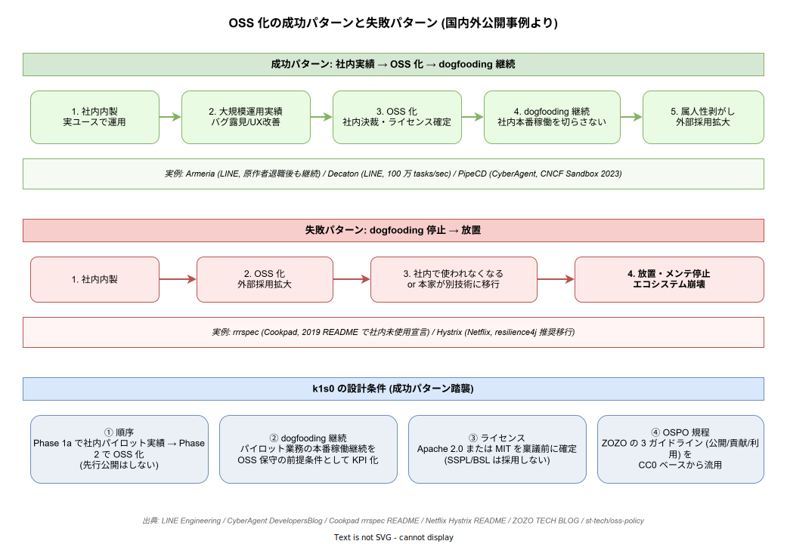

# 04 OSS 化戦略の先例

本章は k1s0 が「社内内製しながら OSS 化する」戦略を取る妥当性を、日本企業の公開事例で裏付ける。OSS 化は「採用ブランディング・外部コントリビューション・社内保守継続性」の 3 つの効果が期待される一方、rrrspec や Hystrix のように「社内で使わなくなって放置」の失敗事例もある。成功事例から引くべき設計パターンと、失敗事例から避けるべき罠を整理し、ライセンス選定・公開プロセス・dogfooding の 3 軸で k1s0 の戦略を具体化する。

## 1. 日本企業発の基盤 OSS 成功事例

国内大手テック企業は内製基盤の OSS 化で一定の実績を積んでいる。k1s0 が参照すべき代表事例を整理する。

**LINE / Armeria**: Netty の作者 Trustin Lee らが LINE 在籍時に開発した非同期 HTTP/2・gRPC・Thrift 統合マイクロサービスフレームワーク。2015 年頃 OSS 化し、現在も LINE 本番で稼働しつつ外部採用が拡大している。原作者が LINE を退職してもプロジェクトが継続している点が重要で、「社内で育てて OSS 化し、OSS 化後に属人性を剥がす」パターンの成功例になっている。

**LINE / Decaton**: Kafka ベースの非同期ジョブキューライブラリ。社内で 1 ストリームあたり 100 万タスク/秒超を処理する実績を OSS 化（2020/3、Apache 2.0）。実運用実績を踏まえた OSS 化の典型例で、メンテナ複数化で特定個人依存を回避している。

**CyberAgent / PipeCD**: 社内 3,000 以上のアプリで使う GitOps 型 CD 基盤。2020 年 OSS 公開、**2023/5 に CNCF Sandbox 採択**（国内初の CD プロダクト採択）。ABEMA が最大ユーザーで、CyberAgent 自身が「外部コミュニティのフィードバックが品質向上に寄与」と公式に言明している。

**CyberAgent / myshoes**: GitHub Actions self-hosted runner 管理 OSS。公開後に社内他事業（メディア・ゲーム・AI）へ横展開したパターン。

**メルカリ / tfnotify, KubeTempura**: Microservices Platform Team が Terraform 運用中に生まれた補助ツールを OSS 化。

**ZOZO / Shift15M, Open Bandit Pipeline**: 1,500 万件超のファッションデータとバンディット評価基盤を公開。加えて「**OSS ポリシー自体を OSS 化**」（CC0 で `st-tech/oss-policy` 公開）という他社導入を促す手法を採用しており、k1s0 も同手法を流用できる。

**NTT / Ryu, Lagopus**: NTT ソフトウェアイノベーションセンタが Ryu SDN Framework（2012）と Lagopus SDN スイッチ（2014）を OSS 公開し、大学・他企業の参加で機能拡張、国際的 SDN エコシステムに接続した。

| 企業 | 代表 OSS | ポイント |
| --- | --- | --- |
| LINE | Armeria | 原作者退職後も継続、属人性剥がし |
| LINE | Decaton | 100 万 tasks/sec 実績、メンテナ複数化 |
| CyberAgent | PipeCD | CNCF Sandbox 採択（国内初 CD） |
| CyberAgent | myshoes | 社内横展開 |
| メルカリ | tfnotify 他 | プラットフォームチーム発 |
| ZOZO | Shift15M、oss-policy | ポリシー自体を OSS 化 |
| NTT | Ryu、Lagopus | SDN エコシステム接続 |

出典 URL:

- https://github.com/line/armeria
- https://github.com/line/decaton
- https://engineering.linecorp.com/en/blog/kafka-based-job-queue-library-decaton-examples/
- https://www.cyberagent.co.jp/news/detail/id=28906
- https://developers.cyberagent.co.jp/blog/archives/42448/
- https://www.cncf.io/projects/pipecd/
- https://event.cloudnativedays.jp/cicd2021/talks/1180
- https://engineering.mercari.com/blog/entry/2018-04-09-110000/
- https://techblog.zozo.com/entry/oss-policy
- https://github.com/st-tech/oss-policy
- http://www.ntt.co.jp/news2014/1406/140606a.html

## 2. OSS 化のメリット実績

OSS 化の効果は 3 軸で計測される。

**品質向上（外部コントリビューション）**: PipeCD は CNCF Sandbox 採択により「コミュニティのアイデアと貢献でロードマップ達成が加速」と CyberAgent 自身が公式表明している。外部の視点がソフトウェア信頼性を高めるという定性的評価が公開資料に残っている。

**採用ブランディング**: ZOZO は GitHub 上の OSS 公開活動を人材採用の核に据え、GitHub × ZOZOTOWN コラボで可視化している。DeNA もエンジニア採用ページで OSS 貢献を前面に押し出している。k1s0 を OSS 化することで、Rust / Go エンジニアの採用難度緩和に寄与する可能性がある（03_運用工数試算 で仮定した採用計画の補強材料）。

**社内保守継続性**: Armeria は Netty 作者が LINE を退職後もプロジェクト継続、Decaton もメンテナ複数化で特定個人依存を回避した。OSS 化によりコードの属人化を剥がし、退職・異動への耐性を上げた典型事例である。これは k1s0 の「バス係数 2 実証」目標と直結する。

| 効果 | 事例 | 定量・定性証拠 |
| --- | --- | --- |
| 外部コントリビューションで品質向上 | PipeCD | CyberAgent 公式言明 |
| 採用ブランディング | ZOZO、DeNA | GitHub 採用連動、採用ページ訴求 |
| 属人性剥がし（保守継続性） | Armeria、Decaton | 原作者退職後も継続 |

出典 URL:

- https://www.cyberagent.co.jp/way/list/detail/id=30032
- https://github.co.jp/customer-stories/zozo
- https://engineering.dena.com/output/oss/
- https://github.com/line/decaton/graphs/contributors

## 3. 失敗事例と回避パターン

OSS 化の失敗事例は「社内で使わなくなる」パターンが主因で、k1s0 も同じ罠にはまる可能性がある。

**Cookpad / rrrspec**: 分散 RSpec CI。社内で 60 並列で運用されたが、**2019/2 に公式 README で「Cookpad は社内で使っていない。PR は気まぐれにレビュー、アクティブ保守なし」と宣言**された。社内要件変化に OSS ライフサイクルが追従しなかった典型事例。

**Netflix / Hystrix**: Netflix 自身が「新規開発は resilience4j に移行、他者にも推奨」と宣言しメンテナンスモード化した。OSS として爆発的に採用されたが、**本家が撤退したため Spring Cloud Netflix も maintenance mode に波及**した。「外部ユーザが多くても、本家が使わなくなると死ぬ」という教訓を残した。

回避策は明確で、**dogfooding（自社で使い続ける）を OSS 化の前提条件として組み込む**ことに尽きる。k1s0 の場合、これは「パイロット業務での本番運用を継続し、OSS 化以後も社内利用を切らさない」という運用規約として明文化する必要がある。

| 失敗事例 | 原因 | 回避策 |
| --- | --- | --- |
| rrrspec | 社内で使われなくなった | dogfooding 継続を設計条件に |
| Hystrix | 本家が移行した | 本家が使う限りコミットする規約 |

出典 URL:

- https://github.com/cookpad/rrrspec/blob/master/README.md
- https://github.com/cookpad/rrrspec/pull/80
- https://github.com/Netflix/Hystrix
- https://cloud.spring.io/spring-cloud-netflix/multi/multi__modules_in_maintenance_mode.html

## 4. 知財・法務プロセス（ZOZO 型を流用、帰属スキームは k1s0 独自）

OSS 化には著作権帰属と特許・営業秘密の整理が必須である。

**知財帰属と公開権限の整理**: 日本企業の OSS 公開事例は法人帰属を前提とするものが多い。NEC の公開資料も「著作権が会社に帰属することを前提に、会社が OSS ライセンスで利用許諾する」流れを説明している。一方、k1s0 は **起案者帰属 + 所属企業への無償・非独占・取消不能の社内利用許諾** を採用する。そのため参考にするのは「公開審査フロー」「特許レビュー」「OSS ポリシー整備」であり、**帰属そのものは起案者-所属企業間契約で明示する**。

**特許との切り分け**: 日本弁理士会資料が「OSS ライセンスの特許条項（Apache 2.0 の明示的特許許諾等）と社内特許ポートフォリオをどう整合させるか」を整理している。公開前に対象コードが関連特許をカバーしないかのチェックが必要である。

**社内ポリシー整備（流用可能な先例）**: **ZOZO は「OSS ポリシー策定委員会」を CTO 室主導で設置し、公開・コントリビュート・利用の 3 ガイドラインを整備、ポリシー自体を CC0 で公開**した（`st-tech/oss-policy`）。k1s0 は同手法を模倣可能で、ZOZO のポリシーをベースに微修正する形で初動を高速化できる。

| プロセス | 参照先 | k1s0 への取り込み |
| --- | --- | --- |
| 知財帰属と公開権限の整理 | NEC 公開資料 | 起案者-所属企業間契約 + 公開審査フロー |
| 特許切り分け | 弁理士会資料 | 公開前レビュー必須化 |
| OSS ポリシー | ZOZO `st-tech/oss-policy`（CC0） | 3 ガイドライン（公開・貢献・利用）を流用 |

出典 URL:

- https://jpn.nec.com/oss/osslc/doc/PointOfOSSlicenseAndCopyrightLaw.pdf
- https://jpaa-patent.info/patents_files_old/200606/jpaapatent200606_045-068.pdf
- https://www.jpo.go.jp/resources/report/takoku/document/zaisanken_kouhyou/2019_06_1.pdf
- https://techblog.zozo.com/entry/oss-policy
- https://github.com/st-tech/oss-policy

## 5. dogfooding を設計条件に組み込む

OSS 化と内製化の両立に成功している事例はすべて dogfooding を実践している。GitLab が GitLab.com を GitLab で回す、PostHog が自社サービスに PostHog を組み込む、という類型である。自社で使う OSS は実運用で露見するバグ・UX 問題を公開前に検出でき、採用の正当性と品質の両立を可能にする。

ただし警鐘もある。HeroCoders / PostHog の記事は「社内ユーザーだけが使う OSS は insider 最適化に陥る」と明示しており、k1s0 でも外部ユースケースを意図的に集める仕組みが必要になる。社内パイロット業務の成功は必要条件であって十分条件ではない、という認識を持つ必要がある。

k1s0 に組み込むべき具体策は以下の 3 つになる。

- **dogfooding の継続を KPI に組み込む**: 「パイロット業務が本番稼働を継続していること」を OSS 保守継続の前提条件として明記。
- **外部ユースケースを毎 Phase で 1 件以上獲得する**: insider 最適化を回避するために、社外利用の声を Phase ごとに集める。
- **社内運用で発見したバグ・改善を OSS 本体にバックポートする**: 社内 fork と OSS 本体の乖離を避ける運用規約。

出典 URL:

- https://www.herocoders.com/blog/dogfooding-in-software-development-eat-your-own-code
- https://posthog.com/product-engineers/dogfooding

## 6. ライセンス選定の原則（後から変更しない）

ライセンス選定は初動で決め、後から変更しないのが鉄則である。公開後のライセンス変更はコミュニティの信頼を大きく毀損する。

**HashiCorp / Terraform**: 2023/8 に MPL → BSL 1.1 へ変更（事前議論なし）。10 日後に OpenTF マニフェスト公開、25 日後に OpenTofu フォーク発表、**1 か月で star 33,000・140 社以上がフォーク支持表明**、9/20 に Linux Foundation 傘下に。コミュニティを失うリスクの典型例。

**Grafana Labs**: 2021/4 に Apache 2.0 → AGPLv3 へ変更。CEO Raj Dutt は「SSPL のような OSI 非承認ライセンスは避け、OSS コミュニティとの関係維持のため AGPL を選択」と公式表明。**「open core + AGPL」は CNCF エコシステムと共存できるモデル**として参考になる。

**SSPL 系の失敗と復帰**: MongoDB（2018）→ Elastic（2021）→ Redis（2024）と続いた SSPL 化は OSI 非承認で Debian・Red Hat が配布停止、AWS・Linux Foundation による OpenSearch・Valkey フォークを誘発した。Elastic は 2024 年 AGPL へ戻し、Redis も 2025/5 に AGPLv3 併用へ回帰。「クラウド事業者対策としての SSPL」は結果的にコミュニティ分裂と本家の地位低下を招いた、というのが業界の共通認識になっている。

k1s0 の選定指針は以下の通り整理できる。

- **ZEN Engine が MIT ライセンスであること**から、互換性の高い **Apache 2.0 または MIT** を第一候補とする
- クラウド事業者に対する copyleft 強度が必要な場合のみ、最初から **AGPLv3** を採用する（後からの変更は禁止）
- **SSPL / BSL は採用しない**（HashiCorp / Redis の失敗を繰り返さない）
- ライセンス選定は**稟議通過前に確定**し、以後変更しない規約として明文化する

| 選定候補 | 採用条件 | リスク |
| --- | --- | --- |
| Apache 2.0 / MIT | 第一候補（ZEN Engine との互換性） | クラウド事業者に copyleft が及ばない |
| AGPLv3 | クラウド copyleft 必要時、最初から採用 | 周囲の忌避感、ただし業界で復権中 |
| SSPL / BSL | **採用しない** | コミュニティ分裂、OSI 非承認 |

出典 URL:

- https://opentofu.org/blog/opentofu-announces-fork-of-terraform/
- https://spacelift.io/blog/terraform-license-change
- https://grafana.com/blog/2021/04/20/grafana-loki-tempo-relicensing-to-agplv3/
- https://grafana.com/blog/2021/04/20/qa-with-our-ceo-on-relicensing/
- https://en.wikipedia.org/wiki/Server_Side_Public_License
- https://redis.io/blog/agplv3/
- https://www.infoq.com/news/2024/03/redis-license-open-source/

## 7. k1s0 の OSS 化戦略への含意

下図は本章の成功パターン（LINE/CyberAgent 型）と失敗パターン（Cookpad/Netflix 型）を 1 枚に並べ、k1s0 が成功パターンを踏襲するために組み込むべき 4 条件を示したものである。成功と失敗を分ける決定要因は「dogfooding を継続しているか」であり、k1s0 ではこれを Phase 1a 以降の本番稼働 KPI と連動させて明文化する。

以上から、k1s0 の OSS 化戦略は以下 4 点を設計条件に組み込む必要がある。

1. **順序**: 社内内製 → 大規模運用実績を積む → OSS 化、の順を守る（Armeria / Decaton / PipeCD パターン）。いきなり OSS 公開先行はしない。
2. **dogfooding の継続**: パイロット業務の本番稼働継続を OSS 保守の前提条件とする（rrrspec / Hystrix の失敗回避）。
3. **ライセンス選定**: ZEN Engine との互換性から Apache 2.0 または MIT を第一候補とし、稟議通過前に確定する。後から変更しない。
4. **法務プロセス**: ZOZO の 3 ガイドライン（公開・貢献・利用）を CC0 ベースから流用し、起案者-所属企業間の利用許諾契約と特許切り分けの運用規程を整備する。

この 4 点を組み込めば、OSS 化戦略は先例に裏付けられた合理的選択として稟議で説明可能になる。
