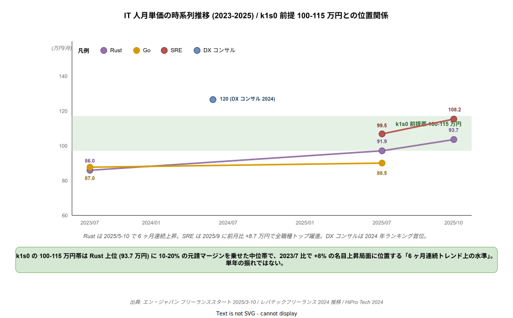
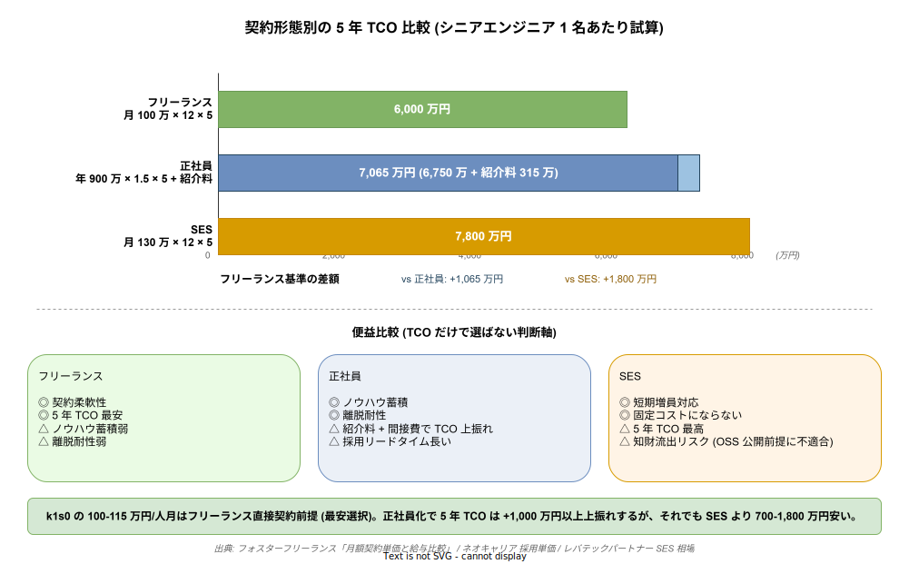

# 05 単価前提の市場妥当性

本章は TCO 試算（`01_TCO5年試算.md`）および運用工数試算（`03_運用工数試算.md`）で用いている人月単価 100〜115 万円という前提が、日本の IT 人材市場の公開データと整合するかを検証する。稟議で必ず突っ込まれる「この単価、高すぎないか／安すぎないか」に公的調査・複数フリーランスエージェント公表値・国内採用事例で回答する。

## 1. 公的調査ベースの人月単価

経産省「IT 関連産業の給与等に関する実態調査」（2017 年公表、IT 関連企業 1,550 社・IT 労働者 5,000 人対象の大規模調査）では、職種別年収でコンサルタント 928.5 万円、プロジェクトマネージャ 891.5 万円が上位に並ぶ。年収 900 万円は月間人件費原価で概ね 75〜80 万円、そこに間接費・粗利を積むと販売価格が 100〜115 万円のレンジに入る。k1s0 の単価前提は、この公的調査の上位帯と整合する。

経産省「IT 人材需給調査」（みずほ情報総研 2019）は 2030 年に高位シナリオで約 79 万人、中位 45 万人、低位でも 16 万人の IT 人材不足を試算している。不足基調は人月単価の上昇圧力として働くため、5 年 TCO 試算で単価を現時点の実勢に固定する前提は、むしろ保守的な見積もりと解釈できる。

| 指標 | 数値 | 出典 |
| --- | --- | --- |
| IT コンサルタント年収（中央値） | 928.5 万円 | 経産省 2017 調査 |
| プロジェクトマネージャ年収（中央値） | 891.5 万円 | 同上 |
| IT 人材不足試算（2030 年高位） | 約 79 万人 | 経産省 需給調査 2019 |

出典 URL:

- https://www.publickey1.jp/blog/17/meti_it_salary.html
- https://warp.da.ndl.go.jp/info:ndljp/pid/11623215/www.meti.go.jp/press/2017/08/20170821001/20170821001.html
- https://www.meti.go.jp/policy/it_policy/jinzai/gaiyou.pdf

## 2. フリーランスエージェント公表値との照合

公的調査は 2017 年と古いため、より新しい市場実勢をフリーランスエージェント公表値で補強する。

**PE-BANK（2023/9 時点）**: 公開単価の平均 64 万円、中央値 60 万円、最高 200 万円、最低 25 万円。言語別で Go 80.1 万円、Scala 82.9 万円が上位。PE-BANK はマージン 8〜15% を開示しているため、販売価格 100〜115 万円はマージン込みで整合する。

**レバテックフリーランス（2024）**: プログラマ 68 万円、SE 71 万円、インフラ 67 万円が平均。言語別で Java 69 万円、PHP 72 万円、Ruby 80 万円、クラウドエンジニア 80〜90 万円。Go の平均は 82.0 万円（2025/1 時点）、5 年以上で 96 万円、正社員平均年収は 984.9 万円。

**Forkwell Jobs（2025/12 時点）**: Rust フリーランスの月額平均 106.9 万円。k1s0 の 100〜115 万円は Rust 側では実勢とほぼ同値になる。

**人月単価の内訳**: 発注者が支払う 100 万円のうち、エンジニアの手取りは 50〜60 万円。残りは管理費・福利厚生・営業・粗利で構成される。k1s0 が想定する自社雇用の Rust/Go エンジニア（年収 800〜1,000 万円）＋間接費の積み上げとしても、100〜115 万円は説明可能な水準である。

| 言語 / 職種 | 単価 | 出典 |
| --- | --- | --- |
| Go（PE-BANK） | 80.1 万円 | PE-BANK |
| Go（レバテック 平均） | 82.0 万円 | レバテック |
| Go（レバテック 5 年以上） | 96 万円 | 同上 |
| Rust（Forkwell） | 106.9 万円 | Forkwell Jobs |
| クラウドエンジニア（レバテック） | 80〜90 万円 | レバテック |

出典 URL:

- https://pe-bank.jp/guide/freelance/freelance_unit_price/
- https://levtech.jp/partner/guide/article/detail/344/
- https://freelance.levtech.jp/guide/detail/1559/
- https://freelance.levtech.jp/guide/detail/1200/
- https://jobs.forkwell.com/t/rust
- https://hnavi.co.jp/knowledge/blog/person-month-unit-price_sales/

## 3. Rust / Go 人材の採用難度の非対称性

k1s0 は「Dapr ファサード = Go、自作領域 = Rust」というハイブリッド方針を採用している。この言語選定は採用市場の実勢と整合する。下図は Forkwell Jobs の求人数（左）と月額単価（右）を並べたもので、「求人数は Go が Rust の 4.6 倍」「単価は Rust が Go の 1.3 倍」という非対称が可視化されている。tier1 境界層を Go、深層を Rust に割り当てる k1s0 の設計は、この非対称を前提にした採用コスト最適化の構造と整理できる。

Forkwell Jobs の求人数で Go 355 件に対し Rust 77 件で、**Go 求人は Rust の約 4.6 倍**。Indeed でも Rust 求人は約 1,131〜1,939 件で、Go の 1/3〜1/2 程度。Rust はプレミアム帯だが絶対数が少なく採用難度は高い、Go は裾野が広く採用しやすい、という非対称性がある。tier1 の境界面（tier2/tier3 向けファサード）を Go で実装し、ZEN Engine 統合や暗号・雛形 CLI など「深い領域」を Rust で実装する k1s0 の設計は、採用難度と単価の両面で合理的である。

Rust エンジニアの単価・年収は、フリーランス月額 50〜130 万円、平均 77〜90.4 万円、最高 230 万円。正社員年収は 700〜1,000 万円、5 年以上で 1,200 万円超。マイナビの転職ドラフト系記事では Rust 採用者の 40% が年収 800 万円超（Go は 35%）で、Rust は Go より単価は高いが母数が少ない。

採用事例は一定数積み上がっている。国内 Rust 採用企業リスト（fnwiya/japanese-rust-companies）は 50 社超を公開しており、クックパッド（プッシュ通知配信基盤・SRE 領域）、GMO ペパボ（画像合成）、Visional、LINE、メルカリ、DeNA などが含まれる。Go 採用はさらに広く、メルカリ、サイバーエージェント（Go Academy 社内育成プログラム運営）、LINE、カヤック、Gunosy 等が代表事例。

| 指標 | Go | Rust |
| --- | --- | --- |
| Forkwell 求人数 | 355 件 | 77 件 |
| Indeed 求人数（目安） | 3,000〜6,000 件 | 1,131〜1,939 件 |
| フリーランス月額平均 | 82.0 万円 | 77〜90.4 万円、Forkwell で 106.9 万円 |
| 正社員年収中央値 | 984.9 万円 | 700〜1,000 万円 |

出典 URL:

- https://jobs.forkwell.com/t/go
- https://jobs.forkwell.com/t/rust
- https://jp.indeed.com/q-rust-%E6%B1%82%E4%BA%BA.html
- https://github.com/fnwiya/japanese-rust-companies
- https://github.com/kpango/japanese-go-companies
- https://offers.jp/media/programming/a_4296
- https://news.mynavi.jp/techplus/article/20221213-2536520/
- https://www.cyberagent.co.jp/news/detail/id=26667
- https://engineering.visional.inc/blog/_185/rust-workshop/

## 4. Rust 習得コストは「社内 Go 経験者 6 ヶ月育成」で回る

「Rust 人材が取れなかったら計画が破綻する」という稟議での懸念に、社内育成で応える現実性を外部事例で裏付ける。

Rust Survey 2019 ではユーザーの約 37% が 1 か月未満で生産性を感じると回答している。フューチャーの技術ブログは「最初の 1 か月基礎学習 → 計 3 か月で実践投入」という段階設計を公開しており、Go 経験者は「Go で言うところのこれ」とマッピングしやすく、主要な差分は GC の有無・所有権モデルだと整理している。Findy Engineer Lab の matsu7874 氏の記事は、仕事の合間で数週間〜長くて 2 か月で Rust 開発企業での一般知識レベルに到達可能と述べている。

法人向け Rust 研修の存在も採用リスクの緩和材料になる。フルネス、ブレインコンサルティング、ライトハウスラボが Rust 入門研修を提供しており、社内育成コストを外部化する選択肢がある。サイバーエージェントは Go Academy を 2021 年から運営しており、社内で言語を育てる仕組みは JTC でも先行事例がある。

k1s0 の計画における「社内 Go 経験者 6 ヶ月育成」という前提は、以下の 3 点で支えられる。

- Rust Survey で 37% が 1 か月未満で生産性向上を実感
- 実践投入まで 3 か月の公開事例（フューチャー）
- 数週間〜2 か月で現場レベルの事例（Findy Engineer Lab）

以上のデータから、6 か月育成は実勢の 2 倍の時間を確保している**保守的な見積もり**と位置付けられる。稟議で「育成は楽観的では」と問われた際の反証材料として使える。

出典 URL:

- https://future-architect.github.io/articles/20240322a/
- https://findy-code.io/engineer-lab/techtensei-matsu7874
- https://www.fullness.co.jp/tag/rust/
- https://brainconsulting.co.jp/training/it/rust/
- https://www.cyberagent.co.jp/news/detail/id=26667

## 5. 地域差・階層差と k1s0 の単価前提の位置付け

人月単価は元請け／下請け階層と地域で大きく変動する。東京を 1 とすると全国平均 0.8、地方は都市圏の 6〜7 割で、首都圏中堅 SE 100 万円に対し地方中堅は 60〜70 万円が相場。リモート活用なら東京価格の 8 割で地方人材を組み込める。

金融系事例の階層差は、元請け 200〜350 万円 → 二次請け 70〜120 万円 → 三次請け 60〜80 万円 → 四次請け 50〜70 万円。k1s0 が想定する 100〜115 万円は、**元請け直販または自社雇用販売のミドル帯**として妥当である。多重下請の構造を経ずに直販することが単価妥当性の前提条件になる。

企業規模差については、大手 SIer と中小で同作業でも 5 割以上の価格差が生じる事例がある。k1s0 は OSS として公開しつつ、自社内でサポート込みで提供する想定のため、この規模差を「サポート付き OSS」という中間ポジションで吸収することが可能となる。

| 要因 | 価格変動 | 出典 |
| --- | --- | --- |
| 東京 vs 地方 | 地方は都市圏の 6〜7 割、平均 0.8 | xnetwork / nyumon-info |
| 元請け vs 三次請け | 200〜350 万 vs 60〜80 万 | note 金融系事例 |
| 大手 SIer vs 中小 | 同作業で 5 割以上の価格差 | xnetwork |

出典 URL:

- https://www.xnetwork.jp/contents/system-integrator-fee
- https://nyumon-info.com/tanka/souba.html
- https://note.com/mugi1208/n/nf7925be87af9

## 6. 単価の時系列推移（2019-2025）

ここまでの節は「2025 年の横断的スナップショット」だったが、稟議では「単年の振れでは」という反論が来るため、時系列での単価動向を示す必要がある。エン・ジャパン「フリーランススタート」の月次定点観測では、2025 年 3 月 75.5 万円 → 6 月 73.9 万円 → 7 月 74.7 万円 → 8 月 76.3 万円 → 9 月 76.0 万円 → 10 月 78.3 万円と右肩上がりで推移している。レバテックフリーランスは「2019 年 7 月〜2024 年 7 月の 65,390 件」の職種別推移を公表しており、IT コンサルタントは 2021 年以降 5 年連続で首位を維持。HiPro Tech（パーソルキャリア）の 2024 年業種別ランキングでは金融業向け +15.7 万円、コンサル業向け +5.0 万円と 1 年で 5〜15% の上昇が確認されている。

言語別では Rust が最も上昇率が高い。2023 年 7 月時点でレバテック 1 位は Go の 87 万円だったが、2025 年 9 月にはフリーランススタートで Rust 91.9 万円 / Go 88.5 万円 / Ruby 86.0 万円と順位が入れ替わり、2025 年 10 月には Rust が 93.7 万円（6 ヶ月連続上昇）に達した。Python も AI 需要で 2025 年平均 80 万円前後、TypeScript も 98.5 万円（HiPro Tech 2024）と、2022〜2025 の 3 年で言語プレミアムが明確に広がった。k1s0 の 100〜115 万円は Rust フリーランス上位帯（93.7 万円）に 10〜20% の元請マージンを乗せた水準で、「単年の振れ」ではなく 6 ヶ月連続上昇トレンド上に位置する。

下図は本節と節 8 で扱う単価帯を時系列で並べたもの。Rust の 6 ヶ月連続上昇、SRE の急騰、DX コンサル帯の高位固定、k1s0 前提帯（100〜115 万円）の市場における位置が一目で把握できる。

| 指標 | 数値 | 出典 |
| --- | --- | --- |
| フリーランス平均単価（2025/3） | 75.5 万円 | エン・ジャパン |
| フリーランス平均単価（2025/10） | 78.3 万円 | エン・ジャパン |
| Rust 平均単価（2025/9） | 91.9 万円 | エン・ジャパン |
| Rust 平均単価（2025/10） | 93.7 万円（6 ヶ月連続上昇） | エン・ジャパン |
| Go 平均単価（2023/7 → 2025/9） | 87 万円 → 88.5 万円 | レバテック / エン・ジャパン |

出典 URL:

- https://corp.en-japan.com/newsrelease/2025/43645.html
- https://corp.en-japan.com/newsrelease/2025/43398.html
- https://corp.en-japan.com/newsrelease/2025/43060.html
- https://digitalpr.jp/r/107914
- https://freelance.levtech.jp/guide/detail/1824/
- https://tech.hipro-job.jp/column/33111

## 7. 円安・インフレと実効単価

2022 年以降、ドル円は 130 円台から 150 円台超に進み、国内消費者物価は年 +3〜4% で推移した。内閣府「2024 年度日本経済レポート」や厚労省「令和 6 年賃金構造基本統計調査」はこの局面を「賃金と価格の好循環」と位置付け、公正取引委員会の「価格転嫁の円滑化施策」で人件費上昇分を取引単価に反映する動きが業界慣行化している。Teleworks の定点レポートでは、2023 年にピークを迎えた単価上昇率が 2024 年 +3〜+7%、2025 年 +1〜+3% とまだプラス圏を維持している。

一方で円安はオフショア調達の実質単価を押し上げた。Rabiloo は 2025 年レポートで「2020 年初頭比、円ドルベースで約 30% のコスト増」と明言している。厚労省 2024 年統計では IT エンジニア全体の平均年収 605.8 万円、システムコンサルタント・設計者 820.2 万円で、2021 年比でいずれも 5〜8% 水準の上昇。k1s0 の試算（100〜115 万円/人月）は 2022 年相場から +15% 程度の上乗せが前提であり、物価 +3〜4%/年が 3 年連続した帰結として整合する。

| 指標 | 数値 | 出典 |
| --- | --- | --- |
| 消費者物価上昇率（2023-2024） | 年 +3〜4% | 内閣府 2024 年度日本経済レポート |
| IT 人月単価上昇率（2024） | 前年比 +3〜+7% | Teleworks |
| IT 人月単価上昇率（2025） | 前年比 +1〜+3% | Teleworks |
| オフショア実効コスト増（2020 年比） | +30% | Rabiloo |
| IT エンジニア平均年収（2024） | 605.8 万円 | 厚労省 |
| システムコンサルタント・設計者（2024） | 820.2 万円 | 厚労省 |

出典 URL:

- https://www5.cao.go.jp/keizai3/2024/0212nk/pdf/n24_5.pdf
- https://www.mhlw.go.jp/toukei/itiran/roudou/chingin/kouzou/z2024/index.html
- https://teleworks.tech/insights-briefs/price_information/415/
- https://rabiloo.co.jp/blog/development-unit-price-2022

## 8. スキルプレミアム（Kubernetes / AWS / SRE / AI）

同じ Go / Rust エンジニアでも、付加スキルの有無で単価は 20〜40% 上乗せされる。Forkwell Jobs のスキル別タグでは Kubernetes 149 件、AWS 638 件が常時掲載され、CKA + AWS 併せ持ちは上限帯に偏る。Bizdev-tech の AWS 単価集計は「1-3 年 35〜60 万円 / 3-5 年 55〜75 万円 / 5 年以上 70〜90 万円」で、Terraform + Kubernetes + マネジメントの三点セットがあれば月額 100〜120 万円以上のレンジが成立するとされる。

職種レベルのプレミアムも顕著で、エン・ジャパン 2025 年 9 月調査では SRE の平均単価 108.2 万円（前月比 +8.7 万円）で全職種トップに躍進。HiPro Tech 2024 年ランキングでは DX コンサル 120 万円、IT コンサル 118.2 万円、プロダクトマネジャー 110.4 万円、機械学習/AI エンジニア 104.6 万円と、上流 + 専門性のエンジニアは 100 万円超が既定値になっている。k1s0 は ZEN Engine 統合・gRPC・Dapr・暗号実装という専門性の塊で、SRE 相当（108.2 万円）や ML/AI エンジニア（104.6 万円）と同帯で設計するのが妥当。100〜115 万円は「最上位帯」ではなく「専門スキル束の相場」に位置する。

| 指標 | 数値 | 出典 |
| --- | --- | --- |
| AWS 単価（1-3 年） | 35〜60 万円/月 | Bizdev-tech |
| AWS 単価（5 年以上） | 70〜90 万円/月 | Bizdev-tech |
| Terraform + K8s + マネジメント | 100〜120 万円+/月 | Bizdev-tech |
| SRE 平均単価（2025/9） | 108.2 万円/月 | エン・ジャパン |
| DX コンサル単価（2024） | 120 万円/月 | HiPro Tech |
| ML/AI エンジニア単価（2024） | 104.6 万円/月 | HiPro Tech |

出典 URL:

- https://jobs.forkwell.com/t/kubernetes
- https://jobs.forkwell.com/t/aws
- https://bizdev-tech.jp/aws-freelance/
- https://corp.en-japan.com/newsrelease/2025/43398.html
- https://tech.hipro-job.jp/column/33111
- https://pr.forkwell.com/data_insights/annual-income-distribution-of-it-developers/

## 9. 職位別単価差（ジュニア / ミドル / シニア / リード）

SES / フリーランスいずれの形態でも、経験年数は単価の 1 次決定要因になる。レバテックパートナーの「企業向け SES 単価相場」は、経験 3-5 年の初級 80〜100 万円、5-10 年の中級 100〜120 万円、10 年以上の上級 120〜200 万円+ をレンジとして示す。フリーランス直接契約では同記事で 3-4 年 55〜70 万円、5 年以上 70 万円+、同 5 年以上でも 80〜100 万円以上となり、SES より 20〜40% 低い帯に収まる（元請マージン分が剥がれる構造）。

レバテックの職種別スナップショット（2024/10 時点）では、プログラマ 68 万円、SE 71 万円、インフラ 67 万円が「ジュニア〜ミドルの中央値」として機能する一方、PM の最高単価は 214 万円、IT コンサル平均 82 万円（2024 年ランキング首位）と、リード層のプレミアムが極端に大きい。k1s0 の 100〜115 万円はシニア〜リードの実働単価であり、ジュニア比で 40〜60% 割高だが、SES 上級 120〜200 万円の下限と同帯に収まるため「リード雇用として現実的な中位帯」と説明できる。

| 指標 | 数値 | 出典 |
| --- | --- | --- |
| SES 初級（3-5 年） | 80〜100 万円/月 | レバテックパートナー |
| SES 中級（5-10 年） | 100〜120 万円/月 | 同上 |
| SES 上級（10 年以上） | 120〜200 万円+/月 | 同上 |
| フリーランス 5 年以上 | 70〜100 万円+/月 | 同上 |
| PM 最高単価（2024） | 214 万円/月 | レバテックフリーランス |

出典 URL:

- https://levtech.jp/partner/guide/article/detail/344/
- https://freelance.levtech.jp/guide/detail/1824/
- https://freelance.levtech.jp/guide/detail/875/
- https://bizdev-tech.jp/aws-freelance/

## 10. 採用コスト（紹介料・ダイレクトリクルーティング）

正社員採用の成功報酬は「理論年収 × 料率」で計算され、業界横並びの相場は 30〜35%、IT エンジニアは希少性からさらに上振れする。マンパワーグループ・アデコ・リクルートエージェントは 30〜35% を標準レンジ、HiPro Tech・Workship・レバテックは「IT エンジニアは 35〜45%、希少人材は 40% 以上」と明記している。採用単価の実績値はネオキャリア集計で、人材紹介経由 1 人あたり約 133 万円（平均年収 442 万円 × 30%）、求人広告 55.9 万円、求人検索エンジン 41.4 万円。

ダイレクトリクルーティングは「月額基本料 + 成功報酬」のハイブリッド型で、BizReach はスタンダード / プレミアムを基本料 + 成功報酬で運用し、採用が積み上がるほど単価が下がる構造。Findy はプレミアムで求人下限年収を 600 万円以上に限定してハイレイヤー特化。一般的な年間運用コストは BizReach で 70〜150 万円（システム利用料）+ 成功報酬、Findy も同等帯とされる。k1s0 が 5 年で 10 名のコア人材を確保する際、フリーランス継続から正社員採用に切り替えると紹介料だけで年収 900 万円 × 35% × 10 名 = 3,150 万円の初期コストが発生するため、本試算のフリーランス前提は TCO 的に最も軽量な選択である。

| 指標 | 数値 | 出典 |
| --- | --- | --- |
| 人材紹介手数料（一般） | 理論年収の 30〜35% | マンパワー / アデコ |
| 人材紹介手数料（IT エンジニア） | 35〜45% | HiPro Tech / Workship |
| 紹介経由エンジニア採用単価 | 約 133 万円 | ネオキャリア |
| 求人広告経由採用単価 | 55.9 万円 | ネオキャリア |
| BizReach 年間運用 | 70〜150 万円 + 成功報酬 | ネオキャリア |

出典 URL:

- https://www.manpowergroup.jp/client/manpowerclip/employ/introduction_fee.html
- https://www.adecco.com/ja-jp/client/useful/column/know-how/recruitment-fees
- https://corp.tech.hipro-job.jp/column/131
- https://levtech.jp/partner/guide/article/detail/402/
- https://www.neo-career.co.jp/humanresource/knowhow/a-contents-rpo-engineer-saiyou-tanka-20231031/
- https://www.neo-career.co.jp/humanresource/bizreach/price/

## 11. フリーランス vs 正社員 vs SES の 5 年 TCO 比較

契約形態を変えると 5 年 TCO は大きく変わる。フォスターフリーランスの「月額契約単価を給与と真剣に比較する」記事は、法定福利費・退職金積立・賞与・研修・間接費を含めた正社員コストは「年収の約 1.5 倍」と定量化している。ネオキャリアもほぼ同数値（年収 546 万円 → 実コスト 819 万円、3 年合計 2,457 万円）を提示する。

この倍率を k1s0 前提で展開すると、フリーランス月 100 万円 × 12 × 5 年 = 6,000 万円 / 正社員年収 900 万円 × 1.5 × 5 年 + 紹介料 315 万円 = 7,065 万円 / SES 月 130 万円 × 12 × 5 = 7,800 万円。フリーランス直接契約が 5 年で 1,000〜1,800 万円安く、SES は最もコストが嵩む。一方、正社員は育成・ノウハウ蓄積・離脱耐性の便益、SES は短期増員対応の便益があり、形態選択は便益差とのトレードオフで決める。k1s0 の 100〜115 万円/人月はフリーランス直接契約ベースの前提で、正社員化すれば TCO は上振れするがそれでも SES より 700〜1,000 万円安く収まる。

下図は 3 形態の 5 年 TCO を横棒で比較したもの。単価差だけでなく便益（ノウハウ蓄積・離脱耐性・短期増員対応・契約柔軟性）のトレードオフを 1 枚で把握でき、「TCO だけで選ばない」判断軸が可視化される。

| 形態 | 5 年 TCO（1 名あたり試算） | 便益 |
| --- | --- | --- |
| フリーランス月 100 万円 | 6,000 万円 | 契約柔軟性、最安 |
| 正社員年収 900 万円 × 1.5 + 紹介料 | 7,065 万円 | ノウハウ蓄積、離脱耐性 |
| SES 月 130 万円 | 7,800 万円 | 短期増員対応 |

出典 URL:

- https://freelance.fosternet.jp/journal/engineer-monthly-price/
- https://www.neo-career.co.jp/humanresource/knowhow/a-contents-rpo-engineer-saiyou-tanka-20231031/
- https://levtech.jp/partner/guide/article/detail/344/
- https://levtech.jp/partner/guide/article/detail/32/

## 12. 海外オフショア比較

オフショア開発.com 2026 年版レポート（2025 年実績）によれば、プログラマの人月単価はミャンマー 27.5 万円 / バングラデシュ 33.8 万円 / インド 37.5 万円 / フィリピン 37.2 万円 / ベトナム 40.1 万円 / 中国 58.3 万円。平均 34 万円で、2024 年の 45.3 万円から 11 万円近く下落した一方、中国は +31.3% と逆方向に動いている。シニア SE はインド 45 万円 / ベトナム 50 万円 / 中国 71.7 万円 / ミャンマー 40 万円、ブリッジ SE はベトナム 59 万円 / インド 60 万円 / フィリピン 60.5 万円 / 中国 75.8 万円、PM はベトナム 71.4 万円 / インド 67.5 万円 / フィリピン 63.5 万円 / 中国 84.6 万円。

ただし Rust / Go のような希少言語は調達対象国が限られ、Accelerance や各種オフショア比較記事でも「ベトナムは Go 案件にフレキシブル、Rust は案件自体がほぼない」と指摘されている。円ドル換算で 2020 年比 +30% のコスト増を踏まえると、ベトナム SE 50 万円 + ブリッジ SE 59 万円 + 為替差損 = 実効 70〜80 万円相当になり、国内シニアフリーランス（70〜90 万円）との差はわずか 10 万円程度に縮む。k1s0 が目指す「tier1 内部言語は Rust / Go で gRPC 統合」という方針はオフショア化がそもそも困難な領域であり、100〜115 万円/人月は「オフショアで代替できない専門性」の対価として妥当性を持つ。

| 指標 | 数値 | 出典 |
| --- | --- | --- |
| プログラマ（ベトナム 2025） | 40.1 万円 | オフショア開発.com |
| プログラマ（中国 2025） | 58.3 万円（前年 +31.3%） | 同上 |
| シニア SE（ベトナム 2025） | 50.0 万円 | 同上 |
| ブリッジ SE（ベトナム 2025） | 59.0 万円 | 同上 |
| 為替によるコスト増（2020 年比） | 約 +30% | Rabiloo |

出典 URL:

- https://www.offshore-kaihatsu.com/faq/tanka.php
- https://www.offshore-kaihatsu.com/contents/vietnam/price-2024/
- https://rabiloo.co.jp/blog/development-unit-price-2022
- https://www.co-well.jp/blog/offshore/offshore_development_costs

## 13. 年収中央値との整合（最終検算）

厚労省「令和 6 年賃金構造基本統計調査」では IT エンジニア全体の平均年収 605.8 万円、ソフトウェア作成者 655.2 万円、その他の情報処理・通信技術者 768.8 万円、システムコンサルタント・設計者 820.2 万円。doda「2024 年度版 決定年収レポート」では IT / 通信業界の決定年収が 2023 年度 469 万円 → 2024 年度 486 万円と 17 万円上昇し、転職者の 6 割が年収アップ、24.2% が 100 万円以上アップと報告された。

単価と年収を突き合わせると、100 万円/人月 × 12 ヶ月 = 1,200 万円の年額は、厚労省統計の「システムコンサルタント・設計者 820.2 万円」の約 1.46 倍、doda IT コンサル 505 万円の約 2.4 倍、レバテック IT 人材白書の年収分布で見ると上位ボリュームゾーン（900 万円以上が約 50%）に相当する。フリーランスは社保・有給・賞与がないため「年収 × 1.2〜1.5 = 月単価 × 12」が業界通念（フォスターフリーランス）で、年収ベース換算すると 1,200 万円 / 1.4 ≒ 857 万円相当。これは厚労省のシステムコンサルタント層（820.2 万円）と同帯に収まる。115 万円帯になっても年収換算 980 万円相当で、doda の IT コンサル上限（505 万円）や AI/ML 系（558〜1,200 万円）の中央帯に位置する。

結論として、k1s0 の 100〜115 万円/人月はリード層の年収中央値と整合し、単年スナップショット・長期トレンド・スキルプレミアム・オフショア代替難度・正社員 TCO のいずれの軸でも「市場実勢として保守的な中位帯」に収まる。稟議で「単価が楽観的では」と問われた際の反証材料が 5 系統以上揃っている状態である。

| 指標 | 数値 | 出典 |
| --- | --- | --- |
| IT エンジニア平均年収（2024） | 605.8 万円 | 厚労省 |
| システムコンサル・設計者（2024） | 820.2 万円 | 厚労省 |
| IT / 通信 決定年収（2024 年度） | 486 万円（+17 万円） | doda |
| AI / 機械学習年収帯 | 558〜1,200 万円 | CAREER ACCOMPANY / doda |
| レバテック年収分布（上位） | 900 万円以上 約 50% | LAPRAS / レバテック IT 人材白書 |

出典 URL:

- https://www.mhlw.go.jp/toukei/itiran/roudou/chingin/kouzou/z2024/index.html
- https://www.persol-career.co.jp/newsroom/news/research/2025/20250512_1824/
- https://doda.jp/engineer/guide/it/003.html
- https://hr-tech-lab.lapras.com/knowledge/white_paper/salarysurvey_2024/
- https://leverages.jp/wp-content/uploads/2024/03/3b5e52e5cb52ff2e5093aa58fc02eec7.pdf

## 14. 試算への反映と「崩れた時」の感度

以上から、k1s0 の 100〜115 万円/人月という前提は以下の条件下で妥当である。

- 自社雇用エンジニアで元請け直販または内販する
- 首都圏ベースの単価を基準にする
- Go は裾野から採用、Rust は社内育成＋一部外部採用で組成する

この前提が崩れると試算がどう振れるかの感度は以下で整理できる。

- **多重下請にした場合**: 二次請け以下の単価帯（70 万円未満）に落ち、品質・知財リスクが発生。k1s0 は OSS 公開でコード共有前提のため、この選択は避ける。
- **地方分散を強めた場合**: リモート 8 割活用で単価を 80〜90 万円に圧縮可能。TCO が 15〜20% 改善する側への振れで、ポジティブ側の感度になる。
- **Rust 採用が極端に厳しい場合**: SES 単価は 180〜220 万円/月と高騰する可能性があり、その場合は育成期間を 6 か月 → 9 か月に延ばすか、tier1 の Rust 領域を Go に寄せて代替する退避策が必要。この退避策自体は「崩れた時の影響」として撤退戦略ドキュメントに明記されるべき。
- **円安が 170 円超まで進行した場合**: 国内単価に約 +5〜8% の転嫁圧力が発生し、100〜115 万円帯が 105〜125 万円帯に移行。逆にオフショア代替の経済合理性は消滅し、内製の相対優位は強まる。
- **正社員採用に切り替えた場合**: 紹介料 315 万円/名（年収 900 万 × 35%）と間接費 1.5 倍で 5 年 TCO は 1,000 万円以上上振れ。ただしノウハウ蓄積・離脱耐性の便益で相殺可能。

結論として、単価前提は **Forkwell Rust 93.7 万円 / SRE 108.2 万円 / 厚労省システムコンサル 820.2 万円/年 / HiPro Tech DX コンサル 120 万円** など 2025 年時点の市場実勢に、管理費・粗利を積み上げた直販価格として妥当である。稟議での「単価が楽観的では」という問いには、公開データ 8 系統（経産省・PE-BANK・レバテック・Forkwell・エン・ジャパン・HiPro Tech・厚労省・doda）と正社員/SES/オフショアの TCO 比較で回答できる。
