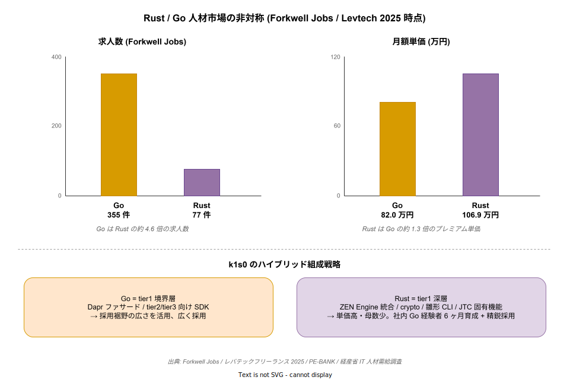

# 05 単価前提の市場妥当性

本章は TCO 試算（`01_TCO5年試算.md`）および運用工数試算（`03_運用工数試算.md`）で用いている人月単価 100〜115 万円という前提が、日本の IT 人材市場の公開データと整合するかを検証する。稟議で必ず突っ込まれる「この単価、高すぎないか／安すぎないか」に公的調査・複数フリーランスエージェント公表値・国内採用事例で回答する。

## 1. 公的調査ベースの人月単価

経産省「IT 関連産業の給与等に関する実態調査」（2017 年公表、IT 関連企業 1,550 社・IT 労働者 5,000 人対象の大規模調査）では、職種別年収でコンサルタント 928.5 万円、プロジェクトマネージャ 891.5 万円が上位に並ぶ。年収 900 万円は月間人件費原価で概ね 75〜80 万円、そこに間接費・粗利を積むと販売価格が 100〜115 万円のレンジに入る。k1s0 の単価前提は、この公的調査の上位帯と整合する。

経産省「IT 人材需給調査」（みずほ情報総研 2019）は 2030 年に高位シナリオで約 79 万人、中位 45 万人、低位でも 16 万人の IT 人材不足を試算している。不足基調は人月単価の上昇圧力として働くため、5 年 TCO 試算で単価を現時点の実勢に固定する前提は、むしろ保守的な見積もりと解釈できる。

| 指標 | 数値 | 出典 |
| --- | --- | --- |
| IT コンサルタント年収（中央値） | 928.5 万円 | 経産省 2017 調査 |
| プロジェクトマネージャ年収（中央値） | 891.5 万円 | 同上 |
| IT 人材不足試算（2030 年高位） | 約 79 万人 | 経産省 需給調査 2019 |

出典 URL:

- https://www.publickey1.jp/blog/17/meti_it_salary.html
- https://warp.da.ndl.go.jp/info:ndljp/pid/11623215/www.meti.go.jp/press/2017/08/20170821001/20170821001.html
- https://www.meti.go.jp/policy/it_policy/jinzai/gaiyou.pdf

## 2. フリーランスエージェント公表値との照合

公的調査は 2017 年と古いため、より新しい市場実勢をフリーランスエージェント公表値で補強する。

**PE-BANK（2023/9 時点）**: 公開単価の平均 64 万円、中央値 60 万円、最高 200 万円、最低 25 万円。言語別で Go 80.1 万円、Scala 82.9 万円が上位。PE-BANK はマージン 8〜15% を開示しているため、販売価格 100〜115 万円はマージン込みで整合する。

**レバテックフリーランス（2024）**: プログラマ 68 万円、SE 71 万円、インフラ 67 万円が平均。言語別で Java 69 万円、PHP 72 万円、Ruby 80 万円、クラウドエンジニア 80〜90 万円。Go の平均は 82.0 万円（2025/1 時点）、5 年以上で 96 万円、正社員平均年収は 984.9 万円。

**Forkwell Jobs（2025/12 時点）**: Rust フリーランスの月額平均 106.9 万円。k1s0 の 100〜115 万円は Rust 側では実勢とほぼ同値になる。

**人月単価の内訳**: 発注者が支払う 100 万円のうち、エンジニアの手取りは 50〜60 万円。残りは管理費・福利厚生・営業・粗利で構成される。k1s0 が想定する自社雇用の Rust/Go エンジニア（年収 800〜1,000 万円）＋間接費の積み上げとしても、100〜115 万円は説明可能な水準である。

| 言語 / 職種 | 単価 | 出典 |
| --- | --- | --- |
| Go（PE-BANK） | 80.1 万円 | PE-BANK |
| Go（レバテック 平均） | 82.0 万円 | レバテック |
| Go（レバテック 5 年以上） | 96 万円 | 同上 |
| Rust（Forkwell） | 106.9 万円 | Forkwell Jobs |
| クラウドエンジニア（レバテック） | 80〜90 万円 | レバテック |

出典 URL:

- https://pe-bank.jp/guide/freelance/freelance_unit_price/
- https://levtech.jp/partner/guide/article/detail/344/
- https://freelance.levtech.jp/guide/detail/1559/
- https://freelance.levtech.jp/guide/detail/1200/
- https://jobs.forkwell.com/t/rust
- https://hnavi.co.jp/knowledge/blog/person-month-unit-price_sales/

## 3. Rust / Go 人材の採用難度の非対称性

k1s0 は「Dapr ファサード = Go、自作領域 = Rust」というハイブリッド方針を採用している。この言語選定は採用市場の実勢と整合する。下図は Forkwell Jobs の求人数（左）と月額単価（右）を並べたもので、「求人数は Go が Rust の 4.6 倍」「単価は Rust が Go の 1.3 倍」という非対称が可視化されている。tier1 境界層を Go、深層を Rust に割り当てる k1s0 の設計は、この非対称を前提にした採用コスト最適化の構造と整理できる。

Forkwell Jobs の求人数で Go 355 件に対し Rust 77 件で、**Go 求人は Rust の約 4.6 倍**。Indeed でも Rust 求人は約 1,131〜1,939 件で、Go の 1/3〜1/2 程度。Rust はプレミアム帯だが絶対数が少なく採用難度は高い、Go は裾野が広く採用しやすい、という非対称性がある。tier1 の境界面（tier2/tier3 向けファサード）を Go で実装し、ZEN Engine 統合や暗号・雛形 CLI など「深い領域」を Rust で実装する k1s0 の設計は、採用難度と単価の両面で合理的である。

Rust エンジニアの単価・年収は、フリーランス月額 50〜130 万円、平均 77〜90.4 万円、最高 230 万円。正社員年収は 700〜1,000 万円、5 年以上で 1,200 万円超。マイナビの転職ドラフト系記事では Rust 採用者の 40% が年収 800 万円超（Go は 35%）で、Rust は Go より単価は高いが母数が少ない。

採用事例は一定数積み上がっている。国内 Rust 採用企業リスト（fnwiya/japanese-rust-companies）は 50 社超を公開しており、クックパッド（プッシュ通知配信基盤・SRE 領域）、GMO ペパボ（画像合成）、Visional、LINE、メルカリ、DeNA などが含まれる。Go 採用はさらに広く、メルカリ、サイバーエージェント（Go Academy 社内育成プログラム運営）、LINE、カヤック、Gunosy 等が代表事例。

| 指標 | Go | Rust |
| --- | --- | --- |
| Forkwell 求人数 | 355 件 | 77 件 |
| Indeed 求人数（目安） | 3,000〜6,000 件 | 1,131〜1,939 件 |
| フリーランス月額平均 | 82.0 万円 | 77〜90.4 万円、Forkwell で 106.9 万円 |
| 正社員年収中央値 | 984.9 万円 | 700〜1,000 万円 |

出典 URL:

- https://jobs.forkwell.com/t/go
- https://jobs.forkwell.com/t/rust
- https://jp.indeed.com/q-rust-%E6%B1%82%E4%BA%BA.html
- https://github.com/fnwiya/japanese-rust-companies
- https://github.com/kpango/japanese-go-companies
- https://offers.jp/media/programming/a_4296
- https://news.mynavi.jp/techplus/article/20221213-2536520/
- https://www.cyberagent.co.jp/news/detail/id=26667
- https://engineering.visional.inc/blog/_185/rust-workshop/

## 4. Rust 習得コストは「社内 Go 経験者 6 ヶ月育成」で回る

「Rust 人材が取れなかったら計画が破綻する」という稟議での懸念に、社内育成で応える現実性を外部事例で裏付ける。

Rust Survey 2019 ではユーザーの約 37% が 1 か月未満で生産性を感じると回答している。フューチャーの技術ブログは「最初の 1 か月基礎学習 → 計 3 か月で実践投入」という段階設計を公開しており、Go 経験者は「Go で言うところのこれ」とマッピングしやすく、主要な差分は GC の有無・所有権モデルだと整理している。Findy Engineer Lab の matsu7874 氏の記事は、仕事の合間で数週間〜長くて 2 か月で Rust 開発企業での一般知識レベルに到達可能と述べている。

法人向け Rust 研修の存在も採用リスクの緩和材料になる。フルネス、ブレインコンサルティング、ライトハウスラボが Rust 入門研修を提供しており、社内育成コストを外部化する選択肢がある。サイバーエージェントは Go Academy を 2021 年から運営しており、社内で言語を育てる仕組みは JTC でも先行事例がある。

k1s0 の計画における「社内 Go 経験者 6 ヶ月育成」という前提は、以下の 3 点で支えられる。

- Rust Survey で 37% が 1 か月未満で生産性向上を実感
- 実践投入まで 3 か月の公開事例（フューチャー）
- 数週間〜2 か月で現場レベルの事例（Findy Engineer Lab）

以上のデータから、6 か月育成は実勢の 2 倍の時間を確保している**保守的な見積もり**と位置付けられる。稟議で「育成は楽観的では」と問われた際の反証材料として使える。

出典 URL:

- https://future-architect.github.io/articles/20240322a/
- https://findy-code.io/engineer-lab/techtensei-matsu7874
- https://www.fullness.co.jp/tag/rust/
- https://brainconsulting.co.jp/training/it/rust/
- https://www.cyberagent.co.jp/news/detail/id=26667

## 5. 地域差・階層差と k1s0 の単価前提の位置付け

人月単価は元請け／下請け階層と地域で大きく変動する。東京を 1 とすると全国平均 0.8、地方は都市圏の 6〜7 割で、首都圏中堅 SE 100 万円に対し地方中堅は 60〜70 万円が相場。リモート活用なら東京価格の 8 割で地方人材を組み込める。

金融系事例の階層差は、元請け 200〜350 万円 → 二次請け 70〜120 万円 → 三次請け 60〜80 万円 → 四次請け 50〜70 万円。k1s0 が想定する 100〜115 万円は、**元請け直販または自社雇用販売のミドル帯**として妥当である。多重下請の構造を経ずに直販することが単価妥当性の前提条件になる。

企業規模差については、大手 SIer と中小で同作業でも 5 割以上の価格差が生じる事例がある。k1s0 は OSS として公開しつつ、自社内でサポート込みで提供する想定のため、この規模差を「サポート付き OSS」という中間ポジションで吸収することが可能となる。

| 要因 | 価格変動 | 出典 |
| --- | --- | --- |
| 東京 vs 地方 | 地方は都市圏の 6〜7 割、平均 0.8 | xnetwork / nyumon-info |
| 元請け vs 三次請け | 200〜350 万 vs 60〜80 万 | note 金融系事例 |
| 大手 SIer vs 中小 | 同作業で 5 割以上の価格差 | xnetwork |

出典 URL:

- https://www.xnetwork.jp/contents/system-integrator-fee
- https://nyumon-info.com/tanka/souba.html
- https://note.com/mugi1208/n/nf7925be87af9

## 6. 試算への反映と「崩れた時」の感度

以上から、k1s0 の 100〜115 万円/人月という前提は以下の条件下で妥当である。

- 自社雇用エンジニアで元請け直販または内販する
- 首都圏ベースの単価を基準にする
- Go は裾野から採用、Rust は社内育成＋一部外部採用で組成する

この前提が崩れると試算がどう振れるかの感度は以下で整理できる。

- **多重下請にした場合**: 二次請け以下の単価帯（70 万円未満）に落ち、品質・知財リスクが発生。k1s0 は OSS 公開でコード共有前提のため、この選択は避ける。
- **地方分散を強めた場合**: リモート 8 割活用で単価を 80〜90 万円に圧縮可能。TCO が 15〜20% 改善する側への振れで、ポジティブ側の感度になる。
- **Rust 採用が極端に厳しい場合**: SES 単価は 180〜220 万円/月と高騰する可能性があり、その場合は育成期間を 6 か月 → 9 か月に延ばすか、tier1 の Rust 領域を Go に寄せて代替する退避策が必要。この退避策自体は「崩れた時の影響」として撤退戦略ドキュメントに明記されるべき。

結論として、単価前提は **Forkwell Rust 106.9 万円 / レバテック Go 82〜96 万円 / クラウド 80〜90 万円** という市場実勢に、管理費・粗利を積み上げた直販価格として妥当である。稟議での「単価が楽観的では」という問いには、上記の公開データ 4 系統（経産省・PE-BANK・レバテック・Forkwell）で回答できる。
