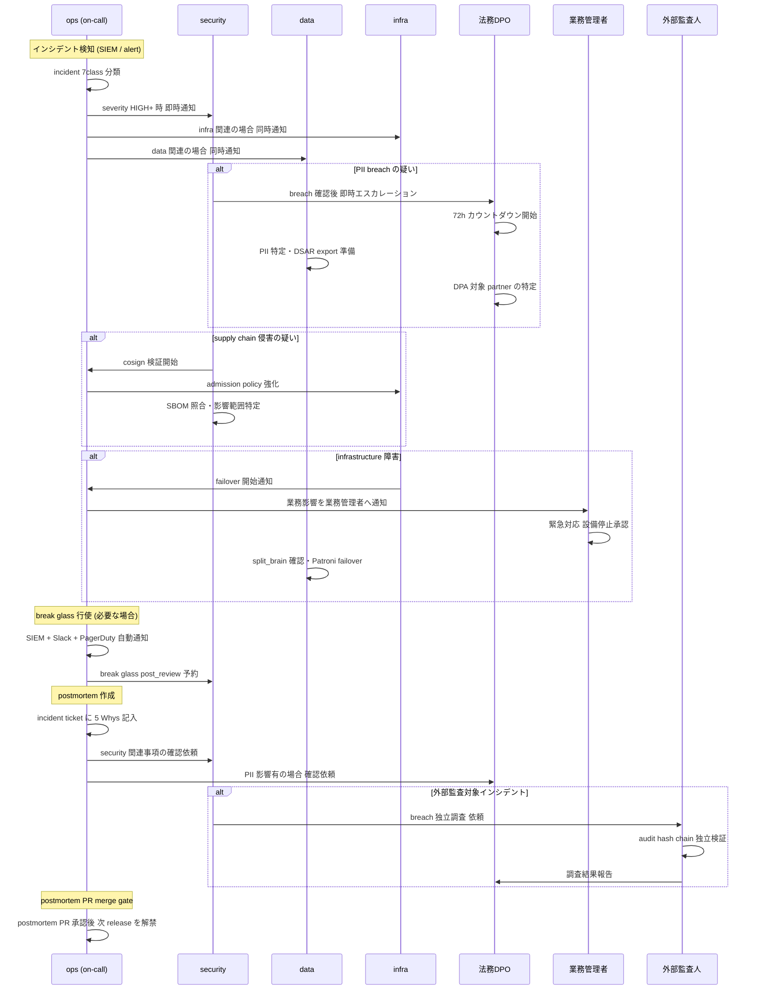

# 24h 時間軸俯瞰 (handover)

## 24 時間軸 × 11 担当者 活動概要

| 時刻 | tier1 | tier2 | tier3 | infra | data | security | ops | 業務担当者 | 業務管理者 | 外部監査人 | 法務DPO |
|---|---|---|---|---|---|---|---|---|---|---|---|
| 00:00 | — | — | — | on-call 監視 | backup batch | SIEM 監視 | on-call (夜間) | — | — | — | — |
| 01:00 | — | — | — | alert 対応 | WAL archiving | alert 対応 | SLO monitoring | — | — | — | — |
| 02:00 | — | — | — | node health check | replication 監視 | log analysis | — | — | — | — | — |
| 03:00 | — | — | — | — | backup 検証 | — | — | — | — | — | — |
| 04:00 | — | — | — | — | — | — | — | — | — | — | — |
| 05:00 | — | — | — | — | — | — | — | — | — | — | — |
| 06:00 | — | — | — | cluster health 確認 | — | — | — | — | — | — | — |
| 07:00 | — | — | — | — | — | — | on-call 引継ぎ準備 | 出社・設備確認 | — | — | — |
| **08:00** | 朝会 | 朝会 | 朝会 | **handover** (夜→朝) | 朝会 | 朝会 | **handover** (夜→朝) | 朝礼・ライン確認 | 朝会・スケジュール確認 | — | — |
| 09:00 | OSS 評価 / PR review | ドメイン設計 | UI 実装 | infra 変更作業 | migration 計画 | threat model review | runbook 更新 | 検査結果入力 | マスタ更新承認 | 監査作業 | 法務相談対応 |
| 10:00 | proto review | BoundedContext 設計 | a11y 対応 | Kyverno policy 調整 | schema review | SBOM トリアージ | SLO 確認 | 業務作業 | パートナー調整 | — | DSAR 確認 |
| 11:00 | SBOM 確認 | tenant override 実装 | E2E テスト | secret rotation | restore 検証 | CVE 確認 | capacity 確認 | 業務エラー対応 | 業務エラー集計 | — | — |
| 12:00 | 昼休み | 昼休み | 昼休み | 昼休み | 昼休み | 昼休み | 昼休み | 昼休み | 昼休み | 昼休み | 昼休み |
| 13:00 | supply chain 確認 | Emergency Override 検討 | smoke test | progressive delivery | PII クラスタ確認 | red team 準備 | incident review | 業務作業 | スケジュール編集 | 証跡確認 | パートナー DPA 確認 |
| 14:00 | proto schema 進化 | 決定表更新 | WebAuthn 実装 | chaos drill 分析 | Kafka 監視 | admission 確認 | toil 削減作業 | 発注承認 (step_up) | テナント管理 | — | 規制対応準備 |
| 15:00 | Library release 準備 | Projector 追加 | i18n 対応 | network 変更計画 | DEK rotation 確認 | break glass post_review | postmortem 作業 | 設備リモート操作 | 業界規制 確認 | — | — |
| **16:00** | — | — | — | **handover** (朝→夕) | — | — | **handover** (朝→夕) | — | — | — | — |
| 17:00 | PR review / 終業 | PR review / 終業 | 終業 | — | — | — | SLO burn rate 確認 | 帰宅前 未送信確認 | 終業 | — | 終業 |
| 18:00 | — | — | — | alert 対応 | ClickHouse tiered 処理 | — | on-call 対応 | — | — | — | — |
| 19:00 | — | — | — | — | archive batch | SIEM 確認 | — | — | — | — | — |
| 20:00 | — | — | — | node lifecycle | — | — | incident 対応 | — | — | — | — |
| 21:00 | — | — | — | — | — | — | — | — | — | — | — |
| 22:00 | — | — | — | — | backup 開始 | — | — | — | — | — | — |
| 23:00 | — | — | — | cluster 監視 | — | — | on-call 引継ぎ準備 | — | — | — | — |
| **24:00 (=00:00)** | — | — | — | **handover** (夕→夜) | — | — | **handover** (夕→夜) | — | — | — | — |

---

## on-call handover タイミング

| handover | 時刻 | 引継ぎ者 | 主な確認事項 |
|---|---|---|---|
| 夜 → 朝 | 08:00 | ops + infra | 夜間 alert 記録 / SLO 消費状況 / 未解決 incident / 進行中 batch |
| 朝 → 夕 | 16:00 | ops + infra | 日中変更作業 / progressive delivery 状況 / 夕方 maintenance 予定 |
| 夕 → 夜 | 24:00 | ops + infra | 夕方以降の変更 / backup 起動確認 / 夜間 batch 予定 |

### handover 必須確認事項 (Backstage フォーム)

1. 未解決 incident の件数・severity
2. SLO 消費率 (現在の error budget 残量)
3. 進行中の deployment / progressive delivery の状態
4. 夜間 batch / backup の状態
5. circuit breaker の open/close 状態
6. 重要変更の予定 (scheduled maintenance)
7. escalation 先の連絡先確認

---

## 緊急インシデント発生時の cross-axis handover フロー

---

## 業務時間外のインシデント escalation パス

| 時間帯 | 最初の通知先 | 次の escalation 先 | 備考 |
|---|---|---|---|
| 08:00-16:00 | ops on-call | security / infra / data | 通常業務時間 |
| 16:00-24:00 | ops on-call (夕番) | 夜番 ops + security on-call | 夕番開始時に handover 完了が前提 |
| 00:00-08:00 | ops on-call (夜番) | security on-call + infra on-call | PII breach は法務 DPO を 1h 以内に叩き起こす |
| 随時 (PII breach) | ops → security → 法務DPO | 経営層 | 72h カウント開始から 1h 以内に法務 DPO に連絡 |
| 随時 (supply chain) | security | tier1 + ops | cosign 検証・admission 強化を並行実施 |
