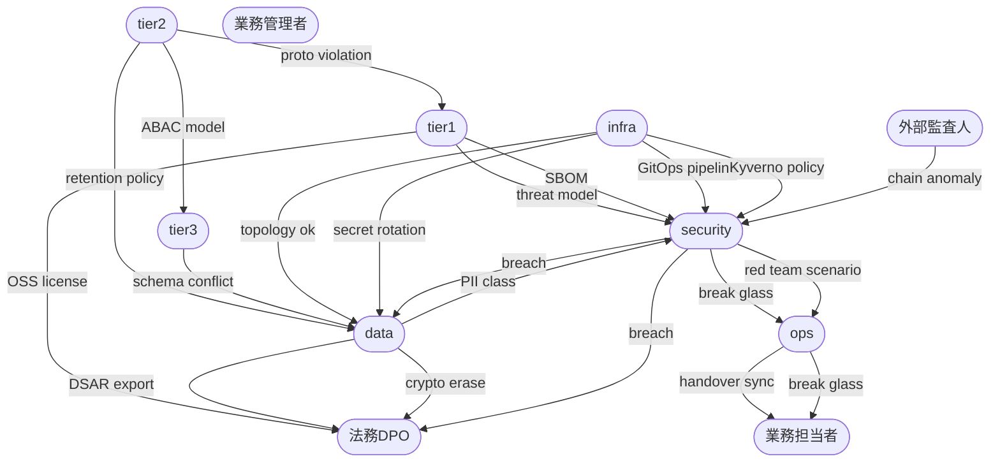

# cross_axis 依存マトリクス

## 依存関係の説明

### 既存 6 軸間の主要依存パス (15 本)

1. **security-06 KEK shamir → data-05 DEK rotation**: KEK shamir ceremony で KEK を再発行した後、data-05 の DEK rotation シナリオが連鎖的に実行される。KEK が変わらない限り DEK rotation は完結しない。

2. **tier1-09 supply_chain障害対応 → security-02 SBOM CVE トリアージ**: supply chain 障害発生時、影響範囲を特定するために SBOM の CVE トリアージが必須前提となる。

3. **tier1-01 新規OSS採用評価 → security-01 threat model 625cell 月次レビュー**: 新規 OSS 採用は threat model の 625cell マトリクスへの記入義務を発生させ、次回月次レビューで照合される。

4. **tier2-05 業界中立性違反検出是正 → tier1-03 proto二層化スキーマ進化**: 業界中立性違反が proto 定義で検出された場合、tier1 担当者による二層化スキーマ再設計が必要となる。

5. **infra-04 Kyverno admission policy追加 → security-08 cosign supply_chain admission拒否対応**: Kyverno policy 変更は cosign 検証ルールに直接影響し、admission 拒否の誤検知・過検知リスクを発生させる。

6. **data-01 schema migration → tier2-04 Domain Event Workflow 決定表追加**: スキーマ変更が既存の Domain Event 構造に影響する場合、決定表の更新が連動する。

7. **infra-02 topology drill failover → data-14 DR cross region実failover**: infra 層の topology drill が合格しない限り、data 層の cross region failover 本番訓練を実施できない。

8. **security-14 data breach privacy incident → data-15 PII DSAR export対応**: breach 発生時に PII 特定が必要となり、data 軸の DSAR export 機能の即時稼働が求められる。

9. **tier2-14 retention crypto_shred → data-04 crypto erase archive**: tier2 の retention policy 変更が data 層の crypto erase 手順を直接指定する。

10. **tier1-10 SBOM CVE 月次トリアージ → security-02 SBOM CVE supply chain 月次トリアージ**: tier1 と security の両担当者が SBOM トリアージを独立に実施し、差分を突き合わせる二重確認構造となっている。

11. **infra-08 secret rotation → data-05 暗号化変更 KEK/DEK rotation**: infra の secret rotation が完了した後、data の KEK/DEK rotation を安全に実施できるシーケンスが確立されている。

12. **tier3-07 WebAuthn step_up federation → tier2-11 権限モデル変更 ABAC delegation**: フロントエンドの WebAuthn step_up 実装は tier2 の ABAC delegation モデルに依存し、権限モデル変更時は tier3 の再テストが必要となる。

13. **security-10 break glass post_review → tier2-12 Emergency Override実行**: break glass 行使後の post_review で発覚した逸脱は tier2 の Emergency Override 手順書の改訂につながる。

14. **data-07 PII専用クラスタ運用 → security-11 PII種別追加 5 PII class運用変更**: PII クラスタの運用実態が security 側の PII class 定義変更の入力情報となる。

15. **infra-05 GitOps配信 progressive delivery → security-13 build provenance class追加**: GitOps pipeline 構成変更は build provenance の記録対象・フェーズに影響し、security 側の enforcement 変更を誘発する。

### 新規 5 軸との依存パス (10 本)

1. **security-14 data breach → 法務DPO-01 GDPR 72h breach通知**: breach 確定から 72 時間以内に DPA へ通知する義務が発生し、security 軸から法務 DPO 軸への即時エスカレーションが必須となる。

2. **security-14 data breach → 法務DPO-02 個人情報保護法 30d報告**: 国内規制対応として、breach 発生から 30 日以内に個人情報保護委員会へ報告する義務が security 確認後に法務 DPO 軸へ引き継がれる。

3. **data-15 PII DSAR export → 法務DPO-03 DSAR対応最終承認**: data 軸が export データを生成した後、法務 DPO が内容を確認して最終承認する二段構造となっている。

4. **data-04 crypto erase → 法務DPO-04 right to be forgotten KEK destroy承認**: crypto erase 実施前に法務 DPO が KEK destroy を法的観点から承認する必要がある。

5. **tier1-01 新規OSS採用評価 → 法務DPO-05 OSSライセンス階層 新規採用承認**: tier1 担当者が OSS のライセンス tier を評価した結果を法務 DPO が承認するまで採用を確定できない。

6. **ops-01 on_call rotation handover → 業務担当者-11 帰宅前 未送信件数確認**: ops の handover タイミング (8h/16h/24h) と業務担当者の帰宅前確認タイミングが同期しており、未送信件数ゼロを handover 条件に含める運用となっている。

7. **ops-07 break glass execution → 業務担当者-13 break_glass発火時の現場対応**: ops が break glass を行使した際、現場の業務担当者が設備停止/継続の最終判断を行う権限を持つ。

8. **security-03 red team table top → ops-09 incident response 7class主導**: red team table top の想定シナリオは ops の incident response 7class 分類の訓練材料として直接使用される。

9. **業務担当者-03 25h オフライン業務記録 → data-01 schema migration**: 長時間オフライン後の sync 処理が既存スキーマと衝突した場合、data 軸の emergency migration が必要となる。

10. **外部監査人-01 audit hash chain独立検証 → security-09 audit hash chain改竄検知**: 外部監査人が独立検証で異常を検出した場合、security 担当者の改竄検知・外部公証シナリオが即時発動する。

---

## 軸依存関係 (mermaid)

---

## 11×11 依存マトリクス (件数)

| → 被依存 ↓ 依存元 | tier1 | tier2 | tier3 | infra | data | security | ops | 業務担当 | 業務管理 | 外部監査 | 法務DPO |
|---|---|---|---|---|---|---|---|---|---|---|---|
| **tier1** | — | 1 | 0 | 0 | 0 | 2 | 0 | 0 | 0 | 0 | 1 |
| **tier2** | 1 | — | 1 | 0 | 1 | 0 | 0 | 0 | 0 | 0 | 0 |
| **tier3** | 0 | 1 | — | 0 | 1 | 0 | 0 | 0 | 0 | 0 | 0 |
| **infra** | 0 | 0 | 0 | — | 2 | 2 | 0 | 0 | 0 | 0 | 0 |
| **data** | 0 | 1 | 0 | 1 | — | 1 | 0 | 0 | 0 | 0 | 2 |
| **security** | 1 | 0 | 0 | 1 | 1 | — | 1 | 0 | 0 | 0 | 2 |
| **ops** | 0 | 0 | 0 | 0 | 0 | 1 | — | 2 | 0 | 0 | 0 |
| **業務担当** | 0 | 0 | 0 | 0 | 1 | 0 | 1 | — | 0 | 0 | 0 |
| **業務管理** | 0 | 0 | 0 | 0 | 0 | 0 | 0 | 0 | — | 0 | 0 |
| **外部監査** | 0 | 0 | 0 | 0 | 0 | 1 | 0 | 0 | 0 | — | 0 |
| **法務DPO** | 0 | 0 | 0 | 0 | 0 | 0 | 0 | 0 | 0 | 0 | — |
