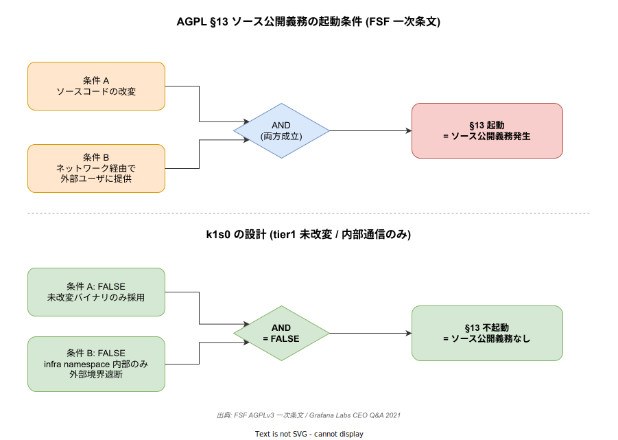

# 05 AGPL 内部利用の公開根拠

本章は「k1s0 が tier1 で Grafana / Loki / Tempo 等の AGPL OSS を内部利用する設計は、ソース公開義務（AGPL §13）を起動しない」という法務サマリ本体の主張を、FSF の一次情報・ベンダー公式見解・類似ライセンス（SSPL/ELv2）の動向・日本法の実務解説で補強する。稟議で「本当に AGPL は問題にならないのか、監査で突っ込まれたらどう答えるのか」と問われた際に、引用元を即提示できる状態を作る。

## 1. AGPL §13 の一次解釈

AGPLv3 §13 は「if you modify the Program, your modified version must prominently offer all users interacting with it remotely through a computer network an opportunity to receive the Corresponding Source」と規定する。つまりトリガーは**「改変」×「ネットワーク越しの外部ユーザとのインタラクション」の両方が成立したとき**である。未改変バイナリを内部利用するだけでは §13 は起動しない。これは FSF の公式条文と Bulletin 解説で一貫して述べられている。

下図は §13 の起動条件（上段）と、k1s0 の設計が両条件を共に満たさないため §13 不起動になる論理構造（下段）を 1 枚で示したものである。稟議や監査で「なぜ公開義務が発生しないのか」を問われた際、この AND 論理を 1 秒で提示できる。

判例蓄積は限定的である。§13 のネットワーク条項を直接解釈した米国連邦判例は実質的に存在しない。イタリアの Globaleaks 事件は 2020 年に和解で終結した。米国の Neo4j, Inc. v. PureThink（N.D. Cal., 2024/07/22）は 597,000 USD の損害賠償を命じたが、判断対象は AGPL 本体ではなく Commons Clause 改変と DMCA／商標に関する争点である。判決自体は AGPL にではなく「AGPL に付加条項を足せるか」に関するものだが、控訴中であり、FSF と SFC が「AGPL の射程を侵食する」として警鐘を鳴らしている状態にある。

| 事項 | 内容 | 出典 |
| --- | --- | --- |
| §13 の起動条件 | 改変 × ネットワーク経由の外部ユーザ提供 | AGPLv3 一次条文 |
| FSF 公式解説 | 未改変利用は影響なし | FSF Bulletin 2021/Fall |
| Globaleaks 事件 | 2020 年和解で終結 | FOSDEM 2021 |
| Neo4j v. PureThink | 597,000 USD 賠償、控訴中 | SFC / The Register |

出典 URL:

- https://www.gnu.org/licenses/agpl-3.0.en.html
- https://www.fsf.org/bulletin/2021/fall/the-fundamentals-of-the-agplv3
- https://opensource.com/article/17/1/providing-corresponding-source-agplv3-license
- https://sfconservancy.org/blog/2022/mar/30/neo4j-v-purethink-open-source-affero-gpl/
- https://www.fsf.org/news/fsf-submits-amicus-brief-in-neo4j-v-suhy
- https://www.theregister.com/2025/02/27/adverse_appeals_court_ruling_could/
- https://archive.fosdem.org/2021/schedule/event/agplcompliance/

## 2. Grafana Labs 公式見解（未改変利用は影響なし）

k1s0 が実際に内部利用する Grafana / Loki / Tempo については、発行元が公式に立場を明らかにしている。Grafana Labs は 2021/04/20 にこの 3 製品を Apache-2.0 から AGPLv3 へ再ライセンスした。公式ブログおよび CEO Raj Dutt の Q&A で、「**改変を配布もしくはネットワーク越しに外部提供しない限り、ソース公開義務は発生しない**」「**未改変利用は何ら影響を受けない**」と明言している。改変版をサービス提供したくない組織には、Grafana Enterprise（プロプライエタリ無償バイナリ）と商用ライセンスの逃げ道を用意している。

つまり「Grafana Labs 自身が、k1s0 の利用形態（未改変・内部利用・外部境界遮断）にはライセンス義務が発生しないと公言している」という引用が可能である。監査対応では一次引用として最も強い根拠になる。

| 事項 | 内容 | 出典 |
| --- | --- | --- |
| Grafana/Loki/Tempo 再ライセンス | 2021/04/20 Apache-2.0 → AGPLv3 | Grafana 公式 |
| 未改変利用の扱い | 影響なしと明言 | CEO Q&A |
| 改変版提供したくない場合の逃げ道 | Grafana Enterprise（無償バイナリ）＋商用 | Licensing ページ |

出典 URL:

- https://grafana.com/blog/2021/04/20/grafana-loki-tempo-relicensing-to-agplv3/
- https://grafana.com/blog/2021/04/20/qa-with-our-ceo-on-relicensing/
- https://grafana.com/licensing/
- https://www.infoq.com/news/2021/04/grafana-licence-agpl/

## 3. SSPL / ELv2 との射程比較（AGPL は境界限定的）

稟議で「AGPL は SSPL と同じく危険ではないか」と問われた際に、両者の射程が本質的に異なることを示す必要がある。MongoDB は 2018/10 に AGPLv3 から SSPL へ移行、OSI 承認を求めたが 2019/03 に自主取下げた。OSI が非承認とした主因は **§13 を超えて「運用インフラ全体（管理ツール、UI、監視等）」まで SSPL 化を要求する**点が OSD §6（field-of-endeavor 差別禁止）に抵触するためだった。

Elastic も 2021/01 に Apache-2.0 から SSPL + ELv2 へ移行し、AWS は同年 4 月に Elasticsearch 7.10.2 から OpenSearch を fork した。注目すべきは 2024 年に Elasticsearch が AGPLv3 を追加し、実質「オープンソース復帰」した点である。これは**「SSPL は業界に拒絶されたが、AGPL は受容されている」**という事実の証拠になる。

この対比から言えるのは、AGPL（§13 = ネットワーク経由の改変提供時のみ）と SSPL（§13 + 運用インフラ全体）では copyleft の射程が本質的に異なり、AGPL は「境界限定的で扱える」ライセンスだということである。k1s0 の法務整理はこの対比を冒頭に置くと理解が早い。

| ライセンス | §13 の射程 | OSI 承認 | 使用感 |
| --- | --- | --- | --- |
| AGPLv3 | 改変 × ネットワーク提供時のみ | 承認済 | 境界限定的、内部利用可 |
| SSPL | §13 + 運用インフラ全体 | **非承認** | field-of-endeavor 差別、業界拒絶 |
| ELv2 | 独自商用ライセンス | 非 OSS | Elastic 独自 |

出典 URL:

- https://en.wikipedia.org/wiki/Server_Side_Public_License
- https://lukasatkinson.de/2019/mongodb-no-longer-seeks-osi-approval-for-sspl/
- https://www.mongodb.com/legal/licensing/server-side-public-license/faq
- https://www.elastic.co/blog/elastic-license-v2
- https://devclass.com/2024/09/02/elasticsearch-will-be-open-source-again-as-cto-declares-changed-landscape/
- https://www.infoq.com/news/2021/04/amazon-opensearch/

## 4. プロセス分離で AGPL 義務を回避する一次解釈

「プロセス分離で本当に AGPL 義務を分離できるのか」という監査対応の核心論点について、FSF は GPL-FAQ で明確に立場を示している。曰く「exec、pipes、sockets、コマンドライン引数、RPC は通常 separateness（分離）を示唆する」「shared address space での function call は同一プログラム化の徴表（inseparable）」。AGPLv3 §0 は「aggregate」を定義し、「aggregate に含めても他の独立作品には AGPL は及ばない」と規定している。

tier1 の実装設計は以下の条件を満たす必要がある。

- Grafana / Loki / Tempo を**未改変バイナリ**で独立プロセス起動する
- 内部 gRPC / HTTP のみで通信し、**共有アドレス空間でのリンクなし**
- 外部境界を遮断し、**外部ユーザへ改変版をネットワーク提供しない**

この 3 条件は FSF / SFC / Red Hat の解釈枠組みにそのまま沿う。コンテナと copyleft の関係については Red Hat / opensource.com の解説があり、Vaultinum・PowerPatent・Revenera も SaaS での AGPL 運用限界を整理している。

| 分離の徴表（FSF） | k1s0 での該当設計 |
| --- | --- |
| exec、pipes、sockets、RPC | 内部 gRPC / HTTP 通信 |
| aggregate（§0） | プロセス独立起動 |
| 同一プログラム化（×） | 共有アドレス空間リンクなし |

出典 URL:

- https://www.gnu.org/licenses/gpl-faq.en.html
- https://opensource.com/article/18/1/containers-gpl-and-copyleft
- https://vaultinum.com/blog/essential-guide-to-agpl-compliance-for-tech-companies
- https://powerpatent.com/blog/agpl-in-saas-risks-duties-and-safe-alternatives
- https://www.revenera.com/blog/software-composition-analysis/understanding-the-saas-loophole-in-gpl/

## 5. 日本企業の AGPL 対応実務

日本企業側の実務慣行も把握しておく。IPA「オープンソース推進レポート 2024」によるとユーザー企業の約 80% が OSS 利用ポリシー未整備／不明と回答している（= ポリシーを整備していること自体が差別化要素になる水準）。法務系事務所の典型的指針は「MIT / Apache-2.0 推奨、GPL / AGPL は原則禁止、例外時は知財部門レビュー必須」というもの。SaaS 事業では AGPL は GPL 以上の注意対象、との指摘が複数ある。

ただし TechMatrix（FossID）とフューチャーアーキテクトは、**「サーバ上で動作させ改変をネットワーク提供する場合にソース開示義務」**と明快に整理しており、内部利用＋未改変は義務発生しない立場を取っている。これが日本法務実務の多数派解釈である。

| 事務所・機関 | 立場 |
| --- | --- |
| 内田・鮫島法律事務所 | SaaS × AGPL は注意対象だが、義務発生要件を限定的に解釈 |
| TechMatrix FossID | 改変のネットワーク提供時に義務発生、未改変内部利用は不要 |
| フューチャー技術ブログ | 同上、「AGPL を理解する」で詳細解説 |
| クラフトマン法律事務所 | OSS ライセンス一般論として類似解釈 |

出典 URL:

- https://www.it-houmu.com/archives/2221
- https://fossid.techmatrix.jp/agpl_oss/
- https://future-architect.github.io/articles/20220922a/
- https://www.ishioroshi.com/biz/kaisetu/it/index/oss_outline/

## 6. OSS 公開時の知財帰属パターン（法人帰属 / 起案者帰属）

k1s0 を将来的に OSS 公開する際、まず必要なのは **権利者と公開決裁者を曖昧にしないこと** である。日本著作権法 §15 ①（一般著作物）は（i）法人等の発意、（ii）業務従事者が職務上作成、（iii）法人等名義で公表、（iv）契約・就業規則に別段の定めなし、の 4 要件で著作権が法人に帰属する。§15 ②はプログラム著作物の特例で「公表名義要件」を不要とする。これは **法人帰属モデルを採る場合の法的ベース** になる。

一方、k1s0 本企画で採用するのは **起案者帰属 + 所属企業への無償・非独占・取消不能の社内利用許諾** である。この場合は、権利者である起案者が外部公開を判断し、所属企業は機密・商標・広報のレビューを担当する。重要なのは、どちらのモデルでも **AGPL の内部利用論点とは独立に、公開権限の所在を文書化すること** である。

実務先行事例として、メルカリはソニー・富士通と並ぶ OSPO 運営事例として知られ、OSS 公開・ライセンスコンプライアンスを組織横断で統括している。サイバーエージェントは myshoes / PipeCD を OSS 公開し、AI Lab が社内研修「OSS ライセンス入門」を公開している。これらは k1s0 の OSS 化プロセス設計の直接の参考になる。

| 事項 | 内容 | 出典 |
| --- | --- | --- |
| §15 ①（一般著作物） | 4 要件で法人帰属 | 文化庁テキスト |
| §15 ②（プログラム特例） | 公表名義要件不要 | e-Gov 条文 |
| 起案者帰属モデル | 個別契約で公開権限と社内利用権を固定 | 本企画の採用方針 |
| メルカリ OSPO | 組織横断で OSS 統括 | Mercari Engineering |
| サイバーエージェント | PipeCD 等公開、社内研修公開 | CyberAgent |

出典 URL:

- https://www.bunka.go.jp/seisaku/chosakuken/seidokaisetsu/pdf/93293301_01.pdf
- https://laws.e-gov.go.jp/law/345AC0000000048
- https://clairlaw.jp/qa/patent/copyright/program.html
- https://atmarkit.itmedia.co.jp/ait/articles/2207/20/news004.html
- https://engineering.mercari.com/en/open-source/
- https://www.cyberagent.co.jp/way/list/detail/id=31427
- https://www.docswell.com/s/dandelion1124/ZN1Q4D-2025-03-13-101354

## 7. 稟議での結論

以上から、k1s0 の tier1 は以下 3 条件を**運用規約として文書化**すれば AGPL §13 のソース公開義務は発生しない。

1. Grafana / Loki / Tempo 等を**未改変バイナリ**で独立プロセス起動する
2. 内部 gRPC / HTTP のみで通信し、**共有アドレス空間でのリンクなし**
3. 外部境界を遮断し、**外部ユーザへ改変版を提供しない**

この 3 条件は、Grafana Labs の公式見解・FSF の GPL-FAQ・日本法務実務の多数派解釈と整合する。

残る主要リスクは以下の 3 点であり、いずれも**規程・手続きで統制可能**である。

- **Neo4j v. PureThink 控訴審の射程**: 判決が AGPL 本体の解釈に踏み込むか継続監視。
- **改変版を作る場合の運用・監査**: 改変は原則禁止、やむを得ず改変する場合は事前法務レビューを義務化。
- **社内 fork を OSS 公開する際の知財規程整備**: 法人帰属なら §15 ベースの社内規程、起案者帰属なら利用許諾契約と OSPO 相当の統括窓口。

稟議の場で「AGPL でもソース公開しないのか」と問われた際の回答は、「**未改変内部利用のみであり、AGPL §13 の起動要件（改変 × ネットワーク経由の外部ユーザ提供）を満たさない。これは Grafana Labs 自身が公式 Q&A で明言している。**」で完結する。
