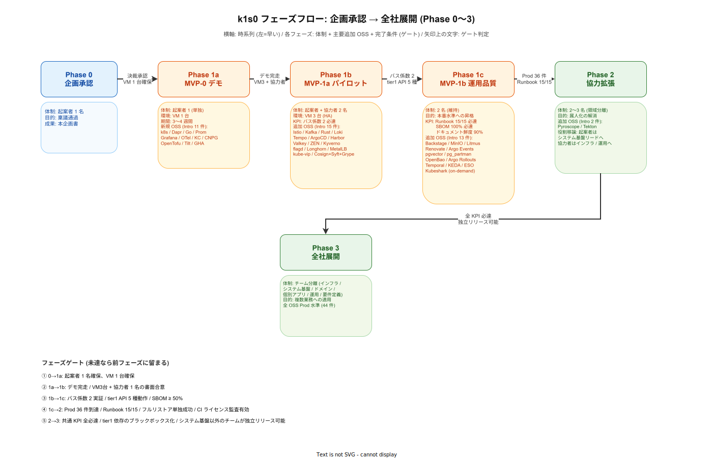

# フェーズ計画

## 目的

k1s0 の段階的な導入計画を整理する。MVP (Phase 1) の詳細は [`01_MVPスコープ.md`](./01_MVPスコープ.md)、体制は [`02_体制と役割.md`](./02_体制と役割.md) を参照。

---

## 1. 全体フェーズ俯瞰

フェーズ遷移は「何を作るか」だけでなく「次のフェーズに進むための判定条件 (ゲート)」が重要になる。以下の図は Phase 0 から Phase 3 までの進行を、各フェーズの体制・主要追加 OSS・ゲート条件とセットで示す。ゲートを通過できないフェーズは前フェーズに留まり、決裁者の明示的な例外承認がない限り次へ進まない。

OSS の導入時期は [`../04_技術選定/19_フェーズ別採用タイムライン.md`](../04_技術選定/19_フェーズ別採用タイムライン.md)、体制の詳細は [`02_体制と役割.md`](./02_体制と役割.md) を参照。本章では「いつ何をするか」の時系列、「04 章」では「どの OSS が Intro/Prod になるか」、「02 章」では「誰が何を担当するか」を扱う。

| フェーズ | 位置付け | 主な成果物 |
|---|---|---|
| **Phase 0** | 事前資料 / 企画承認 (**現在ここ**) | 企画書 / 技術選定 / 競合分析 / MVP スコープ定義 |
| **Phase 1a (MVP-0)** | デモ構成、起案者単独、VM 1 台 | kubeadm + Dapr + Kustomize + Helm + tier1 最小 API + Keycloak SSO + 配信ポータル + サンプルアプリ |
| **Phase 1b (MVP-1a)** | パイロット運用開始、2 名体制、VM 3 台 | kubeadm HA (kubespray) + kube-vip + MetalLB + Argo CD + GHA + Prometheus / Grafana + OTel Collector (Agent) + OpenTofu + Tilt + Longhorn + PgBouncer + Renovate + **Headlamp** + Kubeshark |
| **Phase 1c (MVP-1b)** | 運用品質の確保、2 名体制、VM 3 台 (同一) | Harbor / Trivy + Loki + Sealed Secrets + Kyverno + MinIO + **OpenBao** (KV Engine) + **ESO** + バックアップ訓練 + Runbook |
| **Phase 2** | 基盤拡張、2〜3 名体制 | Istio + Kafka + Apicurio Registry + Grafana Tempo / **Grafana Pyroscope** / OTel Gateway + Backstage + tier1 Rust / ZEN Engine + OpenFeature / flagd (Feature Flag) + Litmus (Chaos Engineering) + **Temporal** (ワークフローエンジン) + **KEDA** (イベント駆動オートスケーラー) + tier2 サンプル |
| **Phase 3** | エンドユーザー体験の拡充 | ネイティブ配信 (MSIX) + 端末設定コピー + マルチクラスタ + OpenBao PKI Engine |
| **Phase 4** | 業務運用フェーズ | 申請ワークフロー / レガシー .NET Framework 共存 / 業務担当による JDM 編集 |
| **Phase 5** | 全社ロールアウト | 本番展開 / レガシーラップ配信 / 業務ルール宣言化 |

---

## 2. フェーズ別の詳細

### Phase 0: 企画承認 (現在)

- 本企画書および配下ドキュメントの整備
- 決裁者への説明と承認取得
- パイロット業務の選定開始

### Phase 1a (MVP-0): デモ構成

**目的**: 起案者単独・VM 1 台で「動くもの」を構築し、決裁者にデモする。デモ結果を根拠に MVP-1a 用 VM 3 台の確保と協力者 1 名のアサインを獲得する。

**期間目安**: 3〜4 週間

- kubeadm (1 ノード, single control-plane) + Dapr Control Plane
- **Kustomize + Helm** (自製マニフェストは Kustomize、サードパーティ OSS は Helm Chart でインストール)
- tier1 Go サービス (`k1s0.Log` のみ)
- 雛形生成 CLI (最小テンプレート)
- Keycloak (単一インスタンス) + PostgreSQL (単一、HA なし)
- アプリ配信ポータル (SSO + アプリ一覧 + Web アプリ起動リンク)
- サンプル Web アプリ (パイロット候補業務の簡易版)

**ハードウェア**: VM 1 台 (4 vCPU / 8 GB / 100 GB SSD)。既存の開発用 VM で稟議不要。

### Phase 1b (MVP-1a): パイロット運用開始

**目的**: 2 名体制で kubeadm HA クラスタを構築し、パイロット業務 1 本を稼働させる。最小限の可観測性と GitOps を導入し、バス係数 2 を実証する。

- kubeadm 3 ノード HA (stacked etcd, kubespray) + OpenTofu (環境再現)
- **kube-vip** (Control Plane VIP。kubespray `kube_vip_enabled: true` で自動構成)
- **MetalLB** (L2 モード。Service type=LoadBalancer に VIP を払い出し、オンプレミスで外部アクセスを実現)
- Dapr Control Plane + tier1 Go (`k1s0.Log` + `k1s0.Telemetry`、他はスタブ)
- Keycloak HA + CloudNativePG (プライマリ + レプリカ 1)
- Argo CD + GHA self-hosted runner
- Prometheus + Grafana (ノードヘルス + tier1 API ヘルス)
- **OTel Collector** (Agent モード / DaemonSet。OTLP 受信 → Prometheus 転送。テレメトリパイプラインの経路を早期確立)
- cert-manager + 内部 CA (Envoy Gateway / Keycloak / Argo CD の TLS 証明書自動管理)
- **Tilt (ローカル開発環境)** — 雛形生成 CLI に Tiltfile 生成を追加。協力者の開発効率を確保しバス係数 2 を加速
- **Longhorn** (分散ストレージ、レプリカ数 2)
- **CloudNativePG Pooler** (PgBouncer による接続プーリング)
- **Renovate** (GHA self-hosted runner 上で依存パッケージ自動更新 PR 生成、週次実行)
- **Testcontainers** (GHA runner Pod に DinD sidecar を追加。tier1 Go サービスの PostgreSQL 統合テストを CI で自動実行)
- **Headlamp** (Kubernetes Web UI。Keycloak OIDC 連携で SSO ログイン。運用者向け読み取り専用ビュー)
- **Kubeshark** (eBPF ベース API トラフィックビューア。オンデマンドデプロイ。起案者・協力者の PC に CLI インストール)
- アプリ配信ポータル拡張 (監査ログ記録追加)
- リファレンス実装 1 本

**ハードウェア**: VM 3 台 (4 vCPU / 16 GB / 200 GB SSD)。メモリ概算 約 18.6 GB (合計 48 GB に対して余裕 約 29.6 GB)。

**最重要完了条件**: 起案者以外の協力者が独立して環境を再構築できること (バス係数 2 の実証)。

### Phase 1c (MVP-1b): 運用品質の確保

**目的**: 新機能を追加せず、運用に耐える状態に引き上げる。障害対応・バックアップ・復旧が起案者なしで完結する状態を作る。

- Harbor + Trivy (push 時自動スキャン、Critical 拒否)
- Loki (ログ集約)
- Sealed Secrets (Secret 暗号化 Git 管理)
- Kyverno (PSS Restricted 相当 + イメージソース制限 + ラベル強制)
- **MinIO** (S3 互換オブジェクトストレージ。Harbor バックエンド / CloudNativePG バックアップ先 / OpenTofu State 保存先)
- **OpenBao** (HA 3 Pod Raft。KV Engine で Keycloak / PostgreSQL / Argo CD の静的 Secret を一元管理。SealedSecrets と並行運用)
- **External Secrets Operator** (OpenBao → k8s Secret の自動同期。ExternalSecret CRD で宣言的管理。refreshInterval: 5m)
- CI/CD パイプライン完成 (PR → Lint / UT / Build → FS Scan → Harbor push → GitOps → Argo CD)
- バックアップ手順 + フルリストア訓練 (協力者が単独で実施)
- 運用 Runbook + アラート設定

**ハードウェア**: MVP-1a と同一。追加コンポーネントのメモリ増加分 約 7.15 GB (合計 約 25.75 GB)。

**完了判定**: 協力者が起案者不在で障害シミュレーション → Runbook 参照 → 対処を完結できること。

### Phase 2: 基盤拡張

**目的**: サービスメッシュ・非同期メッセージング・分散トレーシング・開発者ポータルを導入し、tier2 開発を開始する。ノードのスケールアップを実施する。

- Istio + Envoy Gateway (mTLS + API Gateway)
- Kafka (Strimzi KRaft 3 broker)
- **Apicurio Registry** — Kafka イベントスキーマの中央管理・互換性検証。CI にスキーマ互換性チェックを追加
- Grafana Tempo (分散トレーシング。OTel Collector は MVP-1a で Agent モード導入済み、Phase 2 で Gateway モードを追加し OTLP exporter (Tempo 向け) / PII マスキングを構成。バックエンドは MinIO)
- **Grafana Pyroscope** (Continuous Profiling。monolithic モード。MinIO バックエンド。Tempo の Traces-to-Profiles 連携で SLO 違反の根本原因をコードレベルで特定。可観測性スタックを LGTM → LGTMP に完成)
- Valkey (キャッシュ / KV)
- Backstage (Software Catalog + TechDocs + SSO + Software Templates)
- tier1 API 拡張 (`k1s0.State` / `k1s0.PubSub` / `k1s0.Workflow` / `k1s0.Secrets` / `k1s0.Decision` / `k1s0.Feature`)
- **Temporal Server** (all-in-one モード + Web UI。PostgreSQL バックエンド。Helm Chart でインストール。`k1s0.Workflow` の Saga / 長期実行バックエンド)
- **tier1 Rust サービス + ZEN Engine 本格稼働** (初期 JDM 3〜5 件)
- **OpenFeature + flagd** — tier1 公開 API `k1s0.Feature` として Feature Flag を提供。段階的ロールアウト / レガシー共存の制御弁
- **Litmus** — Chaos Engineering。PostgreSQL フェイルオーバー / Valkey 障害 / Dapr Sidecar 障害の自動検証。週次 CronChaosEngine で定期実行
- **KEDA** — イベント駆動オートスケーラー (CNCF Graduated)。Kafka Consumer Lag / Temporal Task Queue バックログ / Prometheus メトリクスに基づく tier2 / tier3 の Pod 自動スケーリング。Scale-to-Zero 対応
- **Argo Events** — GitHub Webhook / Harbor Webhook / Kafka EventSource。Argo CD 即時同期・Harbor スキャン結果通知・個人情報削除フロー自動化
- **OpenBao 拡張** — Dapr Secret Store バックエンドを k8s Secrets → OpenBao に移行。Database Engine で PostgreSQL 動的認証情報を生成。Transit Engine で `k1s0.Pii` の暗号化を委譲
- **tier1 レート制限** — Go ファサードにサービス単位のレート制限 (L2) + Envoy Gateway のユーザー単位レート制限 (L1) + バックエンド保護 (L3)
- tier2 サンプルサービス (業務ドメインロジックの最小例)
- アプリ配信ポータル: 端末台帳 / 権限ポリシー / 部門フィルタ / 利用統計 / お知らせ
- Cosign 署名 + Kyverno 署名検証ポリシー追加
- Argo Rollouts (カナリア / Blue-Green)
- MinIO HA 化 (Erasure Coding)
- cert-manager の外部 CA 連携検討 (企業 CA との統合)
- Keycloak AD 連携の検討開始

**ハードウェア**: VM 3〜5 台 (8 vCPU / 16 GB / 500 GB SSD)。

### Phase 3

- tier3 サンプルアプリ
- ネイティブインストーラ配信 (MSIX)
- 自動更新 / レビュー / 評価機能
- **端末設定コピー** (旧端末 → 新端末の一括復元)
- マルチクラスタ (staging / prod 分離)
- OpenBao PKI Engine (中間 CA + cert-manager 連携)。Auto-unseal の検討。SealedSecrets の用途を bootstrap 設定のみに縮小
- ZEN Engine を権限ポリシー / 申請ワークフローで本格利用
- Backstage に JDM Editor プラグイン追加
- k8s クラスタのスケール最適化 (必要に応じて)

### Phase 4

- 申請ワークフロー / 稟議承認の電子化
- 評価ランキング / レコメンド
- 同僚 / 部署テンプレートからのコピー
- **レガシー .NET Framework 共存** (サイドカー方式 / API Gateway 経由)
- **業務担当が JDM Editor で直接編集** (情シス稟議ルールの画面編集)

### Phase 5

- 本番展開 / 全社ロールアウト
- レガシー .NET Framework アプリのラップ配信 (ClickOnce / MSIX / 配信エージェント)
- tier2 業務サービスで ZEN Engine 本格採用 (経費・勤怠等の自動判定)
- 業務ロジックの大半が宣言的に外出しされる

---

## 3. フェーズ移行の判断基準

各フェーズから次フェーズへの移行は、**技術的成熟** と **組織合意** の両方が揃った時点で行う。加えて、移行を「見送る・撤退する」判断基準も並行して評価する。

### 3.1 継続判断基準 (次フェーズへ進む)

| 遷移 | 技術的判断基準 | 組織的判断基準 |
|---|---|---|
| Phase 0 → 1a | MVP-0 スコープが定義済み | 企画承認 (デモ用 VM 1 台の確保) |
| Phase 1a → 1b | 決裁者にデモを実施し「動くもの」を確認 | MVP-1a 用 VM 3 台の確保 + 協力者 1 名のアサイン |
| Phase 1b → 1c | パイロット業務が kubeadm HA 上で稼働 / バス係数 2 の実証 | パイロット業務のユーザーがアプリを利用開始 |
| Phase 1c → 2 | 障害復旧が起案者なしで完結 / CI/CD パイプライン疎通 | 2〜3 名の協力体制組成 |
| Phase 2 → 3 | tier1 公開 API の主要 building block が安定 / tier2 サンプルの運用実績 | Phase 3 スコープの合意 |
| Phase 3 → 4 | アプリ配信ポータルがエンドユーザーに受容 | 業務担当が JDM 編集に関心を示す |
| Phase 4 → 5 | 申請ワークフローが 1 業務で稼働 | 全社ロールアウトの稟議承認 |

### 3.2 撤退判定基準 (当該 Phase の終了時点で必ず評価)

以下のいずれかに該当する場合、撤退シナリオを並行検討する。撤退手順とコストは [`../01_背景と目的/04_撤退戦略.md`](../01_背景と目的/04_撤退戦略.md) を参照。

| Phase 終了時点 | 撤退検討トリガー | 撤退コスト目安 |
|---|---|---|
| Phase 1a 終了 | デモが決裁者に受容されず、協力者のアサインが得られない | 15 万円 (4 人日) |
| Phase 1b 終了 | バス係数 2 の実証失敗 (協力者が独立して環境再構築できない) / パイロット業務のユーザー受容失敗 | 120 万円 (25 人日) |
| Phase 1c 終了 | 運用引継ぎ失敗 (起案者不在で障害対応不可) / Runbook が実用レベルに到達しない | 230 万円 (43 人日) |
| Phase 2 終了 | tier2 サービスの採用が進まない (稼働業務が 1 本も追加されない) / 開発者ポータル利用率が目標の 20% 未満 | 520 万円 (90 人日) |
| Phase 3 以降 | 経営判断 (会社統合・予算削減・方針転換) | 業務数に比例 (1,200〜2,240 万円) |

撤退判定は「継続 or 中止」の二択ではなく、**「継続 / 縮小継続 / Buy 移行 / 完全撤退」の 4 択** として経営層と議論する。縮小継続 (Phase 1c で止めて業務拡大せず保守のみ) や Buy 移行 ([`../01_背景と目的/04_撤退戦略.md`](../01_背景と目的/04_撤退戦略.md) 第 5 章) も重要な選択肢となる。

---

## 関連ドキュメント

- [`01_MVPスコープ.md`](./01_MVPスコープ.md) — Phase 1 の詳細スコープ
- [`02_体制と役割.md`](./02_体制と役割.md) — 各チームの管轄と役割
- [`../01_背景と目的/02_解決する価値.md`](../01_背景と目的/02_解決する価値.md) — 5 つの勝ち筋
- [`../02_アーキテクチャ/02_可用性と信頼性/04_マルチクラスタ戦略.md`](../02_アーキテクチャ/02_可用性と信頼性/04_マルチクラスタ戦略.md) — Phase 3 以降のマルチクラスタ設計
- [`../02_アーキテクチャ/02_可用性と信頼性/05_SLOとエラーバジェット.md`](../02_アーキテクチャ/02_可用性と信頼性/05_SLOとエラーバジェット.md) — SLO 定義とエラーバジェット運用
- [`../03_tier1設計/05_ワークフロー振り分け基準.md`](../03_tier1設計/05_ワークフロー振り分け基準.md) — Temporal / Dapr Workflow の振り分け基準
- [`../04_技術選定/06_イベントスキーマレジストリ.md`](../04_技術選定/06_イベントスキーマレジストリ.md) — Apicurio Registry の段階導入
- [`../05_CICDと配信/04_ローカル開発環境.md`](../05_CICDと配信/04_ローカル開発環境.md) — Tilt の段階導入
- [`../05_CICDと配信/00_CICDパイプライン.md`](../05_CICDと配信/00_CICDパイプライン.md) — CI/CD のフェーズ分離
- [`../05_CICDと配信/02_アプリ配信ポータル.md`](../05_CICDと配信/02_アプリ配信ポータル.md) — 配信ポータルのフェーズ分離
- [`../04_技術選��/03_ルールエンジン.md`](../04_技術選定/03_ルールエンジン.md) — ZEN Engine の段階導入
- [`../04_技術選定/12_マニフェストとワークフロー.md`](../04_技術選定/12_マニフェストとワークフロー.md) — Kustomize + Helm / Temporal の��階導入
- [`../04_技術選定/14_オートスケーラー.md`](../04_技術選定/14_オートスケーラー.md) — KEDA の段階導入
- [`../04_技術選定/16_プロファイリング.md`](../04_技術選定/16_プロファイリング.md) — Grafana Pyroscope の段階導入
- [`../08_定量試算/02_開発工数試算.md`](../08_定量試算/02_開発工数試算.md) — 本フェーズ計画の人月・期間の数的裏付け
- [`../08_定量試算/03_運用工数試算.md`](../08_定量試算/03_運用工数試算.md) — Phase 2 以降の運用工数詳細
- [`../08_定量試算/01_TCO5年試算.md`](../08_定量試算/01_TCO5年試算.md) — フェーズ計画を積算した 5 年 TCO
- [`../01_背景と目的/04_撤退戦略.md`](../01_背景と目的/04_撤退戦略.md) — 各 Phase 時点での撤退コスト・ロールバックパス
