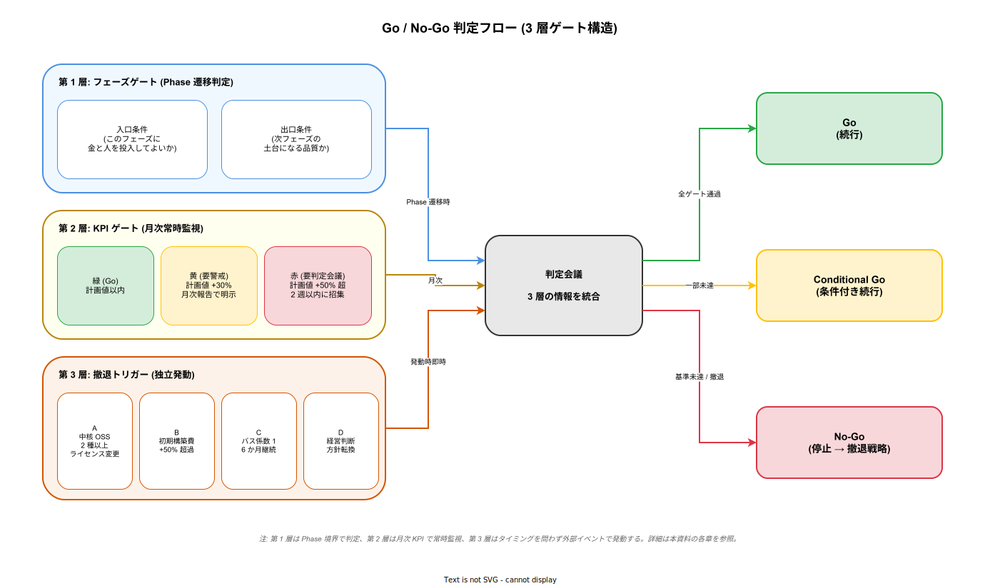

# KPI と承認基準

## 目的

本資料は、k1s0 プロジェクトの投資判断・進行判断・撤退判断に使う「観測可能な基準値」を一枚に集約する。[`01_TCO5年試算.md`](./01_TCO5年試算.md) が「5 年後にいくらかかるか」を答えるのに対し、本資料は「どの数値を超えたら承認を取り直すか」「どの状態になったら止めるか」を先回りで決める。数字で撤退条件を宣言することで、Phase 進行中に「惰性で続いてしまう」リスクを構造的に抑える。

本資料は [`../07_ロードマップと体制/00_フェーズ計画.md`](../07_ロードマップと体制/00_フェーズ計画.md) のフェーズ定義と、[`../01_背景と目的/04_撤退戦略.md`](../01_背景と目的/04_撤退戦略.md) の撤退手順を前提にする。前者が「次に何をやるか」、後者が「どう畳むか」を扱うのに対し、本資料は「続けるか畳むかをいつ・誰が・何を見て決めるか」を扱う。

決裁者・PMO・推進リードが Phase 終了時の判定会議で本資料を開き、各 KPI の実績値を並べることで Go / Conditional Go / No-Go を判定する運用を想定する。数値基準は企画時点の推定であり、実績で更新する前提で維持する。

---

## 1. 判断ゲートの 3 層構造

k1s0 の進行判断は 3 層のゲートを重ねて構成する。第 1 層は各 Phase の「入口・出口」で通過条件を判定するフェーズゲート、第 2 層は Phase 進行中も常時監視する KPI ゲート、第 3 層はどのタイミングでも発動する撤退トリガーである。3 層構造にする理由は、「Phase 完了時しか判断しない」と Phase 途中で手遅れになる懸念を先回りで潰すため。

第 1 層だけでは、半年〜 1 年のスパンで状況が悪化しても次の判定会議まで放置される。第 2 層を挟むと、月次で KPI が閾値を割った時点で早期警告が出せる。第 3 層は「OSS の突然の有償化」「経営判断による方針転換」など Phase ゲートとは独立した外部イベントに対応するための安全弁である。

この 3 層をそれぞれ第 2〜4 章で展開する。

---

## 2. フェーズゲート（第 1 層）

### 2.1 ゲートの基本設計

各 Phase は「前提条件（入口）」と「完了条件（出口）」の 2 点で挟む。入口条件は「このフェーズに金と人を投入してよいか」を判定し、出口条件は「このフェーズで作った成果物が次のフェーズの土台になる品質か」を判定する。

入口で Conditional Go を出すと、追加の情報収集や Pre-work 完了を条件に次 Phase に進める。出口で Conditional Go を出すと、未完項目のキャッチアップ計画を合意した上で次 Phase を並走させる。No-Go は Phase を停止し、[`../01_背景と目的/04_撤退戦略.md`](../01_背景と目的/04_撤退戦略.md) の撤退手順に入る。

### 2.2 Phase 別の入口・出口条件

| Phase | 入口条件 (これがないと始めない) | 出口条件 (これがないと次へ進まない) | 判定者 |
|---|---|---|---|
| **Phase 0 → 1a** | 企画書承認 / 撤退戦略合意 / Phase 1a 用 VM 1 台の確保 / 起案者の稼働枠 30% 確保 | 決裁者へのデモ成功（サンプル業務が Keycloak SSO で配信ポータルから起動） / 次 Phase 用 VM 3 台と協力者 1 名の内示獲得 | 情シス部長 |
| **Phase 1a → 1b** | VM 3 台確保済み / 協力者 1 名の稼働枠 50% 確保 / MVP-0 デモ済み | kubeadm HA 3 ノードが kubespray で再現可能 / 協力者単独で環境再構築成功（バス係数 2 実証）/ パイロット業務 1 本が稼働 | 情シス部長 + アーキテクト |
| **Phase 1b → 1c** | パイロット業務の運用責任者 1 名合意 / 追加 OSS ライセンス棚卸し完了 | Harbor / Trivy / Loki / OpenBao / ESO が本番運用品質で稼働 / バックアップ復旧訓練 1 回成功 / Runbook レビュー完了 | 情シス部長 + 運用責任者 |
| **Phase 1c → 2** | 年間運用 FTE 3 名の恒久アサイン承認 / Phase 2 追加投資予算承認 | Phase 1a〜1c 初期構築費 1,850 万円以内で完了 / 年間運用人月が計画 ± 20% 以内 | CTO / 情シス担当役員 |
| **Phase 2 → 3** | tier2 サンプルのパイロット完了 / Istio / Kafka の運用 SLO 達成 | Istio / Kafka / Backstage / Temporal / KEDA が 3 か月連続で SLO 達成 / tier1 Rust 領域への移行完了 | CTO |
| **Phase 3 → 4** | ネイティブ配信（MSIX）運用ポリシー合意 / マルチクラスタ予算承認 | マルチクラスタで 3 か月連続 SLO 達成 / MSIX 配信がエンドユーザー 10 名以上で安定稼働 | CTO + 事業責任者 |
| **Phase 4 → 5** | 業務担当による JDM 編集運用の合意 / レガシー .NET Framework 共存稼働 | 業務担当が JDM を稟議なしで編集できる運用が 6 か月継続 / 全社ロールアウト計画承認 | 経営層 |

各セルの条件は、企画承認時点での想定値である。Phase 進行中に前提が変わった場合は、該当セルを更新した上で判定会議に諮る。ゲート通過を決めるのは判定者であり、数値そのものではない点に注意する（数値は判断材料、最終責任は人が負う）。

---

## 3. KPI ゲート（第 2 層）

### 3.1 常時監視する 5 系統の KPI

Phase 進行中に月次で観測する KPI を、コスト / 工数 / 運用 / 採用 / OSS リスクの 5 系統に分ける。それぞれで「緑（健全）/ 黄（要警戒）/ 赤（要判定会議）」の 3 段階閾値を持たせる。黄に入ったら PMO が月次報告で明示し、赤に入ったら翌月内に臨時判定会議を招集する。

閾値を 3 段階にするのは、「計画通り vs 計画外」の 2 値判定では「計画外だが致命的ではない」状態に対応できず、結果として警告が出されないまま悪化する傾向があるため。黄段階で早期に議論を開始することで、赤に入る前に修正できる余地を残す。

### 3.2 KPI と閾値

| KPI | 緑（Go） | 黄（要警戒） | 赤（要判定会議） | 出典・根拠 |
|---|---|---|---|---|
| **初期構築費 (Phase 0〜1c 累計)** | 1,850 万円以内 | 1,850〜2,400 万円 (+30%) | 2,400 万円超 | [`02_開発工数試算.md`](./02_開発工数試算.md) 第 6.3 節 |
| **Phase 0〜1c 期間** | 12 か月以内 | 12〜18 か月 (+50%) | 18 か月超 | [`../07_ロードマップと体制/01_MVPスコープ.md`](../07_ロードマップと体制/01_MVPスコープ.md) |
| **年間運用 FTE (Phase 2 以降)** | 小 3 / 中 5 / 大 10（規模別計画値）以内 | 計画値 +30% 以内 | 計画値 +50% 超 | [`01_TCO5年試算.md`](./01_TCO5年試算.md) 第 2.2 節 |
| **tier1 API SLO（可用性）** | 99.9% 以上 | 99.5〜99.9% | 99.5% 未満 | [`../02_アーキテクチャ/02_可用性と信頼性/05_SLOとエラーバジェット.md`](../02_アーキテクチャ/02_可用性と信頼性/05_SLOとエラーバジェット.md) |
| **バス係数** | 2 名以上 | 2 名（1 名が休職中など不安定） | 1 名（起案者単独） | [`../07_ロードマップと体制/02_体制と役割.md`](../07_ロードマップと体制/02_体制と役割.md) |
| **パイロット業務稼働数** | 計画値通り | 計画値 -25% 以内 | 計画値 -50% 超 | [`../07_ロードマップと体制/01_MVPスコープ.md`](../07_ロードマップと体制/01_MVPスコープ.md) |
| **採用 OSS の継続性** | CNCF Graduated / 財団ガバナンス維持 | Incubating / 主要メンテナ離脱の噂 | Sandbox 降格 / ライセンス変更アナウンス | [`../04_技術選定/17_OSS長期戦略.md`](../04_技術選定/17_OSS長期戦略.md) |
| **商用案との TCO 差分** | 次点商用案より 15% 以上優位 | 5〜15% 優位 | 5% 未満または商用が優位 | [`01_TCO5年試算.md`](./01_TCO5年試算.md) 第 1 節 |

### 3.3 黄・赤段階の運用

黄段階では PMO が月次報告書で該当 KPI をハイライトし、次月の対策を明示する。赤段階では該当 KPI の責任者（アーキテクト・情シス部長・運用責任者のいずれか）が臨時判定会議を招集し、3 つの選択肢（継続 / Phase 縮小 / 撤退）から決定を下す。

赤に 2 系統以上同時に落ちた場合は、自動的に CTO 級の判定会議を招集する。単独 KPI の悪化は局所的な問題で済むことが多いが、2 系統同時悪化は構造的な問題（人員不足が OSS 採用遅れを呼ぶ、など）の兆候である可能性が高いため、切り分けを上位で行う。

---

## 4. 撤退トリガー（第 3 層）

### 4.1 即時撤退検討を発動する 4 条件

フェーズゲートや KPI とは独立に、以下のイベントが発生した時点で撤退判定会議を 2 週間以内に招集する。いずれも Phase 進行と並行してモニタリングし、発生時には即時エスカレーションする。

**トリガー A: 基盤 OSS 複数同時のライセンス変更**  
中核 OSS（[`../04_技術選定/01_実行基盤中核OSS.md`](../04_技術選定/01_実行基盤中核OSS.md) の 7 種: k8s / Istio / Envoy Gateway / Kafka / Dapr / Go / Rust）のうち、2 種以上が 6 か月以内に非 OSI 承認ライセンスへ移行した場合。個別 1 種の有償化は [`../04_技術選定/17_OSS長期戦略.md`](../04_技術選定/17_OSS長期戦略.md) の差し替え戦略で吸収するが、複数同時は吸収コストが TCO 優位を崩す可能性が高い。

**トリガー B: 初期構築費の 50% 超過**  
Phase 0〜1c 累計で 1,850 万円の 1.5 倍（2,775 万円）を超えた時点。KPI ゲートの「赤」閾値（+30%）からさらに悪化した状態で、この時点で止めないと次点商用案（Humanitec + オンプレ K8s）の TCO 優位（20% 差）を飲み込む。

**トリガー C: バス係数 1 の 6 か月継続**  
MVP-1a 完了後もバス係数が 1 のまま 6 か月継続した場合。属人化が構造的に解消されない状態は、[`../01_背景と目的/00_背景と課題.md`](../01_背景と目的/00_背景と課題.md) で定義した「痛み」の再現そのものであり、プラットフォームの存在意義が失われる。

**トリガー D: 経営判断による方針転換**  
経営層交代・M&A・規制変更などで「内製禁止」「全面商用移行」「クラウド強制」のいずれかが方針決定された場合。技術的な議論ではなく経営意思決定の問題であり、判定会議は「どう畳むか」の議論に即座に移る。

### 4.2 撤退時の損害最小化

撤退が決定した場合は [`../01_背景と目的/04_撤退戦略.md`](../01_背景と目的/04_撤退戦略.md) の Phase 別手順に従う。同資料は Phase 1a〜1c の段階では撤退コストが 300〜2,000 万円（使用済み VM の転用・Keycloak の継続利用等で回収可能）、Phase 2 以降は 5,000 万円超になる構造を示している。本章のトリガーが「早期発動」を優先するのは、この撤退コスト曲線が Phase 2 以降で急上昇するためである。

---

## 5. 承認ライン（誰が何を承認するか）

### 5.1 決裁階層と責任範囲

k1s0 の承認は 3 階層に分かれる。日常的な運用変更は推進リードが自律的に意思決定し、Phase 遷移と大きな予算変更は CTO / 情シス担当役員、方針レベルの転換は経営層が決定する。階層を明確に分けるのは、すべての判断が経営層に上がる運用になると意思決定が停滞し、Phase 進行そのものが破綻するため。

| 決裁者 | 承認範囲 | 典型的な判断 |
|---|---|---|
| **推進リード（起案者 / アーキテクト）** | 運用変更・OSS バージョン更新・ドキュメント改訂 | Renovate PR のマージ / Runbook 更新 / 月次 KPI 報告 |
| **情シス部長** | Phase 0〜1c の進行・VM 調達・協力者アサイン | Phase 1a〜1c のゲート通過判定 / MVP 用 VM 増設 |
| **CTO / 情シス担当役員** | Phase 1c〜5 の進行・年間運用 FTE 確保・Phase 2 以降の投資 | Phase 2 以降のゲート通過 / 運用 FTE 3〜10 名の承認 |
| **経営層（CEO / CFO 含む）** | 企画承認・方針転換・撤退判断 | Phase 0 企画承認 / 撤退トリガー D 発動時の意思決定 |

### 5.2 判定会議の定例化

Phase 遷移判定会議は Phase 終了予定の 2 週間前に招集し、KPI 実績値・ゲート条件充足状況・撤退トリガー発動有無の 3 点を確認する。臨時判定会議（KPI 赤 2 系統 / 撤退トリガー発動）は発生から 2 週間以内に開催する。いずれも議事録は [`../07_ロードマップと体制/`](../07_ロードマップと体制/) 配下に蓄積し、次 Phase の判断材料にする。

---

## 6. 本資料のメンテナンス方針

本資料の数値基準は企画時点の推定値である。Phase 1a 完了時、Phase 1c 完了時、Phase 2 完了時の 3 回を節目として、実績値を基に閾値を再設定する。特に「初期構築費」「年間運用 FTE」「商用案との TCO 差分」は、市場価格と自社実績の両方に依存するため、陳腐化しやすい。

再設定にあたっては、[`00_試算前提.md`](./00_試算前提.md) の人月単価・インフラ単価の出典を最新版に更新した上で、本資料の閾値を機械的に再計算する。閾値の手動調整は原則行わず、前提の更新が閾値の更新に直結する構造を維持することで、「都合のよい閾値」への恣意的な変更を防ぐ。
