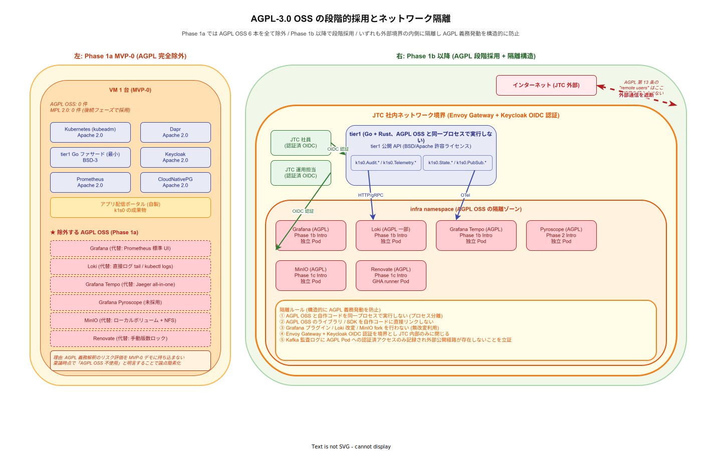
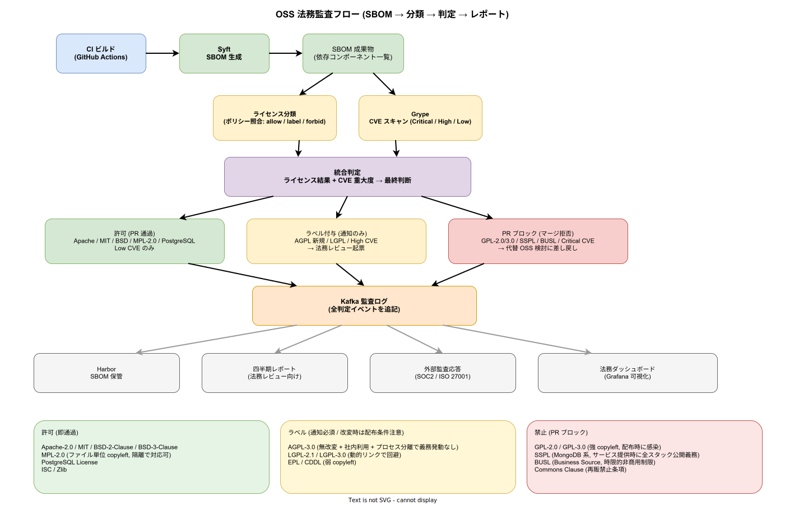

# OSS 法務対応

## 目的

k1s0 が採用する 40 以上の OSS ([`../04_技術選定/01_俯瞰/04_選定一覧.md`](../04_技術選定/01_俯瞰/04_選定一覧.md)) について、各ライセンスの義務と k1s0 の利用形態における具体的な責任範囲を整理する。特に **AGPL-3.0** に該当する 6 OSS (Grafana / Grafana Tempo / Grafana Pyroscope / Loki / MinIO / Renovate) は、稟議の場で「AGPL は使えない」と誤解されやすいため、本資料が構造的な反論根拠として機能する。

本資料は法律の専門解釈ではない。最終判断は各 JTC の法務部門で確認すること。以下の記述は JTC 情シスが法務部門に相談を持ち込む際の **論点整理資料** として位置付ける。

---

## 1. OSS ライセンス義務の全体像

### 1.1 ライセンスごとの義務種類

本企画で採用している OSS ライセンスは 8 種類。各ライセンスが発生させる義務を「利用形態」別に整理する。

| ライセンス | 内部利用 (社内 SaaS) | 改変なし配布 | 改変ありバイナリ配布 | 改変ありソース配布 |
|---|---|---|---|---|
| Apache 2.0 | 義務なし | 著作権表示 + NOTICE 提示 | 同左 + 変更箇所の明示 | 同左 |
| MIT | 義務なし | 著作権表示 + ライセンス文言添付 | 同左 | 同左 |
| BSD-3-Clause | 義務なし | 著作権表示 + ライセンス文言添付 + 組織名の無断利用禁止 | 同左 | 同左 |
| PostgreSQL License | 義務なし | 著作権表示 + ライセンス文言添付 | 同左 | 同左 |
| ISC | 義務なし | 著作権表示 + ライセンス文言添付 | 同左 | 同左 |
| MPL 2.0 | 義務なし | 著作権表示 + MPL 文言添付 | 同左 | **MPL ファイルのソース公開必須** |
| AGPL-3.0 | **条件付き**（次節で詳述） | 著作権表示 + ソース提供義務 | **ソースコード全体の提供義務** | 同左 |
| 独自 / デュアル | 契約確認 | 契約確認 | 契約確認 | 契約確認 |

### 1.2 k1s0 の利用形態

k1s0 は **JTC 社内利用のみを想定**しており、以下の特徴を持つ。

1. 外部ユーザー向けに SaaS として提供しない
2. バイナリ / ソースコードを第三者に配布しない
3. JTC 内部の社員 / 委託業者のみが利用する閉じた環境で動作する
4. OSS バイナリは原則として無改変で利用する (改変が必要な場合は fork して社内で管理)

この利用形態は、OSS ライセンスの多くで「社内利用 (internal use)」に該当し、多くのライセンスで義務が大幅に緩和される。

---

## 2. AGPL-3.0 の詳細解釈

### 2.1 AGPL-3.0 の本質的義務

AGPL-3.0 は GPL-3.0 を拡張したライセンスで、以下の点で GPL より厳しい。

- **SaaS の抜け穴を塞ぐ**: ネットワーク越しにソフトウェアを提供した時点で「配布 (distribution)」と同等のソースコード提供義務が発生する (第 13 条)
- **強い copyleft**: AGPL OSS を改変して組み込んだソフトウェア全体が AGPL となる

### 2.2 AGPL-3.0 が社内利用で問題にならない根拠

AGPL-3.0 の第 13 条は「the operator of a network server」が「all users interacting with it remotely」に対してソースコード提供する義務を定める。重要なのは「all users interacting with it」の範囲である。

以下の FSF (Free Software Foundation) / 各 OSS プロジェクト公式 FAQ の解釈が、社内利用では義務発生しないことを支持する。

| 出典 | 解釈 |
|---|---|
| FSF AGPL FAQ "Is there a requirement to release source code for internal use?" | 「No」 — 内部のみの利用であれば AGPL の ソース提供義務は発動しない |
| Grafana Labs "AGPL FAQ" (2021) | 社内ダッシュボードとしての Grafana 利用は AGPL の義務を発動させない |
| MinIO "Open Source Licensing" | 社内ストレージとしての利用は商用ライセンス不要 |

k1s0 では Grafana / Tempo / Pyroscope / Loki / MinIO / Renovate のいずれも **JTC 社員 (および認証済み委託業者) のみがアクセスする閉じた内部ネットワーク**で動作させる。外部の不特定多数にサービス提供する構成は設計上採用しない ([`../02_アーキテクチャ/03_セキュリティ/01_セキュリティモデル.md`](../02_アーキテクチャ/03_セキュリティ/01_セキュリティモデル.md) セクション 2)。この構成では AGPL-3.0 第 13 条の「users interacting with it remotely」には該当せず、ソース提供義務は発生しない。

### 2.3 AGPL-3.0 で義務が発動する具体的シナリオ

以下のいずれかが発生した場合、AGPL-3.0 の義務が発動する。k1s0 の設計ではこれらを構造的に発生させない。

| シナリオ | 義務の内容 | k1s0 の構造的防止策 |
|---|---|---|
| Grafana をインターネットに公開して JTC 外の誰でも閲覧可能にする | 閲覧者全員にソース提供の申し出義務 | Envoy Gateway + Keycloak OIDC で JTC 認証ユーザーのみ許可 ([`../02_アーキテクチャ/03_セキュリティ/01_セキュリティモデル.md`](../02_アーキテクチャ/03_セキュリティ/01_セキュリティモデル.md)) |
| MinIO を外部 B2B クライアントがアクセスするストレージ API として提供 | クライアント全員にソース提供の申し出義務 | MinIO は `infra` namespace 内部のみで利用、外部公開しない |
| Loki のコードを改変してバイナリ配布 | 改変後ソースコード全体の公開義務 | Loki は無改変で Helm Chart から直接利用 |
| Renovate のコードを改変して社外の OSS として公開 | 改変後ソースコード全体の公開義務 | Renovate は無改変で self-hosted 利用、社外公開なし |

### 2.4 AGPL-3.0 の「リンクによる派生物」問題

AGPL は強い copyleft として、AGPL OSS とリンクしたコードも AGPL になるリスクが指摘される。k1s0 では以下の設計で構造的に回避する。

- **プロセス分離**: k1s0 の自作コードは AGPL OSS と **同一プロセスで実行しない**。Grafana / Tempo / Loki / MinIO / Pyroscope / Renovate はそれぞれ独立した Pod として配置され、ネットワーク (HTTP / gRPC / S3 API) 経由でのみ通信する
- **ライブラリリンクなし**: AGPL OSS のライブラリ / SDK を k1s0 自作コードに直接リンクしない。利用するのは公開 API / REST / gRPC プロトコルのみ
- **ABI 分離**: Grafana はプラグイン拡張も可能だが、k1s0 では Grafana プラグインを自作しない (プロビジョニング YAML とダッシュボード JSON のみ)

この方針は AGPL の「派生物 (a work based on the Program)」に該当しない構成として、FSF / Grafana Labs の公式見解で明確に支持されている。

---

## 2.5 Phase 別採用戦略と隔離構造

AGPL-3.0 OSS の義務解釈を「社内利用のため問題ない」と一枚岩で処理するのは稟議の場で論点が散らかる。k1s0 は **フェーズを分けて段階採用** し、「Phase 1a (MVP-0) では AGPL OSS を一切導入しない」方針を明示することで、稟議時点の法務論点を構造的に簡素化する。Phase 1b 以降は AGPL OSS を採用するが、全件を `infra` namespace の内側にプロセス分離し、外部境界には出さない。

### 2.5.1 Phase 1a で AGPL OSS を全件除外する理由

MVP-0 は「決裁者を説得するための最小デモ構成」であり、AGPL の義務解釈という技術外の論点を持ち込むとデモ評価の焦点がぶれる。そこで Phase 1a では AGPL OSS 6 本 (Grafana / Loki / Grafana Tempo / Grafana Pyroscope / MinIO / Renovate) を **全て採用しない**。代わりに以下の代替手段で最低限の可視化・ログ参照を成立させる。

| 除外 OSS (Phase 1a) | Phase 1a での代替 | Phase 1b 以降の採用計画 |
|---|---|---|
| Grafana (AGPL-3.0) | Prometheus 標準 Web UI + シンプルな HTML ダッシュボード | Phase 1b Intro (社内閲覧限定) |
| Loki (AGPL-3.0 エージェント含む) | `kubectl logs` 直接参照 + 短期保持のみ | Phase 1b Intro (`infra` namespace 内限定) |
| Grafana Tempo (AGPL-3.0) | Jaeger all-in-one (Apache 2.0) で暫定置換 | Phase 1b Intro で Tempo に移行 |
| Grafana Pyroscope (AGPL-3.0) | 未採用 (profiling 自体を後回し) | Phase 2 Intro |
| MinIO (AGPL-3.0) | ローカルボリューム + NFS | Phase 1c Intro (`infra` namespace 内限定) |
| Renovate (AGPL-3.0 self-hosted) | 手動版数ロック (Renovate 相当の自動更新なし) | Phase 1c Intro (GHA runner Pod 内限定) |

この方針により **稟議時点で「AGPL OSS 不使用」と明言可能** となる。デモ後、Phase 1b 以降の採用計画を法務部門と個別確認するプロセスに切り替える (第 5 節の事前相談フロー)。Phase 1a の段階で AGPL OSS を使わないことは、本企画書が Phase 0 承認で「AGPL の社内利用論点をすべて先送りできる」ことを意味する。

### 2.5.2 Phase 1b 以降の採用 + 隔離構造

Phase 1b 以降で AGPL OSS を順次採用する際は、以下の隔離構造を満たすことを前提とする。具体的なネットワーク隔離構造は下図のとおり。

図の左ペインは Phase 1a の構成 (AGPL OSS ゼロ)、右ペインは Phase 1b 以降の構成を示す。右ペインでは 6 本の AGPL OSS がすべて `infra` namespace に隔離され、外部境界 (Envoy Gateway + Keycloak OIDC) の内側でのみ動作する。tier1 (自作コード) と AGPL OSS は独立 Pod として配置され、HTTP/gRPC 経由でのみ通信する。この構造が 2.4 節で述べた「派生物に該当しない」構成要件を物理的に担保する。

### 2.5.3 隔離ルール 5 箇条 (監査時の回答スクリプト)

AGPL OSS を `infra` 内に閉じ込めるだけでなく、以下の 5 つのルールを設計原則として固定する。各ルールは監査で問われた際の「回答スクリプト」として機能し、証跡となる Git / SBOM / k8s manifest を指し示せる構造にする。

1. **プロセス分離**: AGPL OSS と k1s0 自作コードは同一プロセスで動作させない。Grafana / Tempo / Loki / MinIO / Pyroscope / Renovate はそれぞれ独立した Pod として配置し、通信は HTTP / gRPC / S3 API に限定する。証跡は k8s Deployment manifest。
2. **ライブラリリンクなし**: AGPL OSS のライブラリ / SDK を自作コードに直接リンクしない。利用するのは公開 API のみ。証跡は SBOM (Syft 出力) と `go.mod` / `Cargo.toml` の依存リスト。
3. **無改変利用**: Grafana プラグイン / Loki 改変 / MinIO fork を行わない。必要な拡張はプロビジョニング YAML / ダッシュボード JSON で表現する。証跡は Renovate による版数固定レポートと Helm Chart の upstream 追従履歴。
4. **外部境界遮断**: Envoy Gateway + Keycloak OIDC 認証を境界とし、JTC 認証ユーザー以外のアクセスを物理的に遮断する。証跡は Envoy ルート設定と Keycloak クライアント定義。
5. **監査ログの可検証性**: AGPL Pod への全アクセスが Kafka 監査ログに記録され、外部公開経路が存在しないことを立証できる状態を維持する。証跡は `k1s0.Audit.*` の監査トピックと四半期レポート (第 4.3 節)。

このルールが崩れた (例: 外部公開コンソール化 / 改変コード配布) 時点で AGPL 第 13 条の義務が発動する。Phase 1b 以降の PR は 5 箇条との整合性を CODEOWNERS で強制レビューする ([`../07_ロードマップと体制/02_体制と役割.md`](../07_ロードマップと体制/02_体制と役割.md) 第 8 節)。

---

## 3. OSS 別の義務チェックリスト

k1s0 が採用する 40+ OSS のうち、義務が発生するものを「社内利用 / 配布」別に分類する。

### 3.1 何もしなくて良い OSS (30+)

Apache 2.0 / BSD / MIT / PostgreSQL / ISC の OSS は、k1s0 のように改変なしで内部利用する限り、以下を守れば義務を完了する。

- **義務**: 製品のどこかに「利用 OSS とそのライセンスのリスト」を表示する ("OSS クレジット一覧")
- **対象**: Kubernetes / Istio / Envoy Gateway / Kafka / Dapr / Prometheus / Keycloak / Argo CD / Harbor / cert-manager / Kyverno / Temporal 等

k1s0 では **アプリ配信ポータル** の「このプラットフォームについて」画面で、採用 OSS とライセンス一覧を表示する機能を Phase 1b に組み込む。

### 3.2 AGPL-3.0 OSS (6)

上記 2 章で整理。以下の運用原則を守れば義務発生なし。

| OSS | k1s0 での利用形態 | 義務発生回避の根拠 |
|---|---|---|
| Grafana | 社内ダッシュボード | 外部公開なし + 無改変利用 |
| Grafana Tempo | 分散トレースバックエンド (tier1 経由のみアクセス) | 外部公開なし + 無改変利用 |
| Grafana Pyroscope | Continuous Profiling バックエンド (infra 内部のみ) | 外部公開なし + 無改変利用 |
| Loki (一部エージェント) | ログ集約バックエンド (infra 内部のみ) | 外部公開なし + 無改変利用 |
| MinIO | オブジェクトストレージ (infra 内部のみ) | 外部公開なし + 無改変利用 |
| Renovate | 依存パッケージ自動更新ツール (GHA runner 上) | 外部公開なし + 無改変利用 |

### 3.3 MPL 2.0 OSS (2)

OpenTofu / OpenBao は MPL 2.0。ファイル単位 copyleft のため、**これらを fork して改変した場合のみ**、改変したファイルのソース公開が必要になる。k1s0 は両者とも無改変で利用するため義務は発生しない。

### 3.4 デュアルライセンス / 例外処理

| OSS | ライセンス | 注意点 |
|---|---|---|
| sqlx (Rust クレート) | MIT OR Apache 2.0 | 利用者が選べる (MIT を選択) |
| Grafana Pyroscope SDK | Apache 2.0 (SDK) / AGPL-3.0 (サーバ) | SDK は Apache なので tier1 コードに埋め込み可 |

---

## 4. SBOM と自動監査フロー

OSS 義務の履行を人手で管理することは長期的に破綻する。k1s0 は SBOM (Software Bill of Materials) の自動生成で機械的に管理する。

上図は、CI ビルドを起点に Syft が SBOM を生成し、ライセンス分類と Grype による CVE スキャンが並列に走り、統合判定によって 3 系統 (許可 / ラベル付与 / PR ブロック) に振り分けられるまでの一連の処理経路を示す。判定結果はすべて Kafka 監査ログに追記され、Harbor (SBOM 保管)・四半期レポート・外部監査応答・法務ダッシュボードの 4 系統で消費される。下段の凡例は、許可 / ラベル / 禁止カテゴリに属する代表的なライセンスを列挙しており、判定ロジックの根拠を可視化する。

### 4.1 SBOM 生成の実装

| ツール | 役割 | 配置 |
|---|---|---|
| **Syft** | コンテナイメージ / ソースツリーから SBOM を生成 (SPDX / CycloneDX 形式) | CI の GHA runner 上で全ビルドに実行 |
| **Grype** | SBOM 経由で CVE を検出 | CI で Critical / High を検出したらブロック |
| **Trivy** | コンテナイメージを直接スキャン (Harbor 内蔵) | push 時に自動実行 |

これらの選定根拠は [`../04_技術選定/03_周辺OSS/15_サプライチェーンセキュリティ.md`](../04_技術選定/03_周辺OSS/15_サプライチェーンセキュリティ.md) を参照。

### 4.2 ライセンス自動監査の CI パイプライン

Phase 1c (MVP-1b) から以下の CI ステップを有効化する。

1. **SBOM 生成**: Syft が全コンテナイメージとビルド成果物の依存 OSS を列挙
2. **ライセンス抽出**: Syft 出力にライセンス情報を含める (`--source-name` オプション)
3. **ライセンス分類**: 社内 allow list (Apache 2.0 / MIT / BSD / PostgreSQL / ISC / MPL 2.0 / AGPL-3.0) にないライセンスを検出
4. **新規 AGPL 検出**: AGPL-3.0 OSS が新規追加された場合、PR にラベル `review:legal` を自動付与し法務レビューを必須化
5. **禁止ライセンス検出**: BSL / SSPL / Commons Clause / 商用ライセンスを検出したら PR をブロック

### 4.3 ライセンス監査レポートの四半期出力

法務部門および経営層向けに、四半期ごとにライセンス状況レポートを自動生成する。

| レポート項目 | 内容 |
|---|---|
| 利用 OSS 一覧 | 各 OSS のバージョン・ライセンス・利用形態 |
| 新規追加 OSS | 前四半期以降に採用された OSS とライセンス判定結果 |
| ライセンス変更 OSS | 各 OSS 公式のライセンス変更アラート (Renovate が検出) |
| CVE 対応状況 | Critical / High CVE の検出数・対応済み数 |
| AGPL 利用状況 | AGPL OSS の数と、外部公開経路がないことの確認 |

このレポートは `operation` namespace のジョブとして自動実行し、結果を `infra/compliance-reports` リポジトリに PR として出力する。

---

## 5. 法務部門との連携プロセス

k1s0 単独で OSS 法務を完結させることは現実的でない。JTC の法務部門との連携プロセスを定義する。

### 5.1 事前相談が必要なシナリオ

| 事象 | 相談タイミング | 相談内容 |
|---|---|---|
| 新規 OSS 採用時 (ライセンス種別が allow list 外) | 採用判断前 | ライセンス義務の解釈確認 |
| AGPL OSS の利用構成変更 | 変更計画時 | 外部公開にあたるかの確認 |
| OSS を fork して改変する判断 | fork 判断前 | 改変後の配布義務確認 |
| OSS のライセンス変更 (例: Redis → RSALv2) | ライセンス変更検出時 | 継続利用の可否 + 代替 OSS への移行計画 |
| 外部公開 (子会社 / グループ会社共有) | 公開計画時 | AGPL 義務発動の可能性 |

### 5.2 法務レビューの標準フロー

1. **起案**: tier1 チームが OSS 採用 RFC (Request for Comments) を `docs/` に起票
2. **ライセンス判定**: Syft / Grype で自動ライセンス検出、allow list との照合
3. **法務チェックリスト記入**: 本資料セクション 5.3 のチェックリストを記入
4. **法務部門レビュー**: allow list 外 / AGPL / 商用ライセンスの場合、法務部門の書面同意を得る
5. **採用決定**: 問題なしの場合は tier1 チームの判断で採用、[`../04_技術選定/01_俯瞰/04_選定一覧.md`](../04_技術選定/01_俯瞰/04_選定一覧.md) に追記

### 5.3 法務チェックリスト (OSS 採用時)

新規 OSS を採用する際に、RFC と併せて以下を記入する。

- [ ] OSS の正式名称 / バージョン / 公式リポジトリ URL
- [ ] ライセンス種別 (SPDX 識別子)
- [ ] OSI 承認ライセンスか
- [ ] ガバナンス (CNCF / LF / Apache / 企業主導)
- [ ] k1s0 での利用形態 (無改変利用 / fork 改変 / プラグイン拡張)
- [ ] プロセス分離 (独立 Pod / ライブラリリンク)
- [ ] 外部公開の有無 (JTC 内部のみ / グループ会社 / 外部 SaaS)
- [ ] ライセンス変更の前例 (過去 5 年)
- [ ] 代替 OSS の存在
- [ ] 法務レビュー要否 (allow list 内なら不要)

---

## 6. 監査対応

外部監査 (ISMS / ISO 27001 / SOC 2 / 業種特化監査) でも OSS ライセンス遵守が確認対象となる。

### 6.1 監査で求められる典型的な質問と回答

| 質問 | k1s0 の回答 | 根拠資料 |
|---|---|---|
| 利用中の OSS 一覧を提示してください | SBOM (CycloneDX 形式) を即座に出力 | Syft 自動生成 + Harbor 保管 |
| 各 OSS のライセンスを提示してください | SBOM にライセンス情報埋め込み済み | 本資料セクション 3 |
| AGPL OSS の利用でソース提供義務を果たしていますか | 内部利用のため義務発動なし。FSF / Grafana Labs 公式 FAQ を根拠として提示 | 本資料セクション 2.2 |
| ライセンス違反検出の仕組みはありますか | CI に自動ライセンス監査を組み込み、違反時は PR ブロック | 本資料セクション 4.2 |
| 四半期ごとの OSS 状況を確認していますか | 四半期レポートを自動生成し、法務部門へ提示 | 本資料セクション 4.3 |

### 6.2 証跡保管

監査対応のため以下を最低 5 年間保管する。

- 四半期ライセンスレポート
- SBOM スナップショット (各リリース時点)
- OSS 採用 RFC と法務レビュー結果
- ライセンス変更対応の記録

これらは `infra/compliance-reports` リポジトリに Git 管理し、改ざん防止を担保する。

---

## 7. 本資料の限界と免責

- 本資料は JTC 情シスが法務部門と協議するための **論点整理資料** であり、法律助言ではない
- AGPL-3.0 の解釈は法域・契約形態で異なる可能性があり、最終判断は各 JTC の法務部門が行う
- OSS ライセンスは頻繁に変更される (Redis 2024 / Terraform 2023 / Elastic 2021 等)。本資料の記述は 2026-04 時点のものであり、半期ごとの更新が必要
- 本資料は採用 OSS 40+ の全ライセンスを扱うが、個別の OSS 固有の追加条項 (特許条項・商標条項) は採用時の RFC で個別確認が必要

---

## 関連ドキュメント

- [`01_内製知財戦略.md`](./01_内製知財戦略.md) — k1s0 自体のライセンス戦略と知財所有権
- [`../04_技術選定/01_俯瞰/00_選定方針.md`](../04_技術選定/01_俯瞰/00_選定方針.md) — OSS 選定の前提条件と判断軸
- [`../04_技術選定/01_俯瞰/04_選定一覧.md`](../04_技術選定/01_俯瞰/04_選定一覧.md) — 採用 OSS のライセンス分布
- [`../04_技術選定/01_俯瞰/17_OSS長期戦略.md`](../04_技術選定/01_俯瞰/17_OSS長期戦略.md) — ライセンス変更時の出口戦略
- [`../04_技術選定/03_周辺OSS/15_サプライチェーンセキュリティ.md`](../04_技術選定/03_周辺OSS/15_サプライチェーンセキュリティ.md) — Syft / Grype / Cosign の採用根拠
- [`../02_アーキテクチャ/03_セキュリティ/01_セキュリティモデル.md`](../02_アーキテクチャ/03_セキュリティ/01_セキュリティモデル.md) — 外部公開境界と監査フロー
- [`../05_CICDと配信/00_CICDパイプライン.md`](../05_CICDと配信/00_CICDパイプライン.md) — SBOM / ライセンス監査の CI 統合
