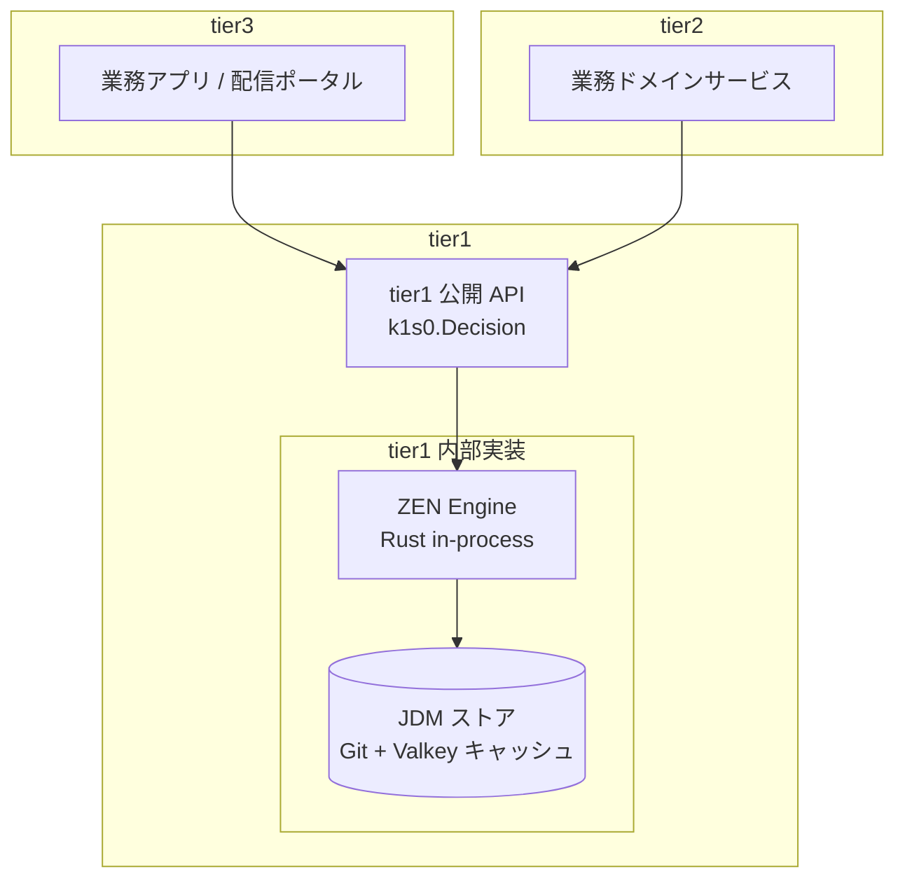

# ルールエンジン (BRE) として ZEN Engine を採用

## 目的

k1s0 における **ビジネスルール / 決定ロジックの宣言的記述** の手段として、GoRules 社が公開する OSS ルールエンジン **ZEN Engine** を採用する。本資料はその採用根拠・役割定義・統合方針・段階導入計画を整理する。

## 採用決定の位置付け

- 採用対象: **ZEN Engine** (`/gorules/zen`, MIT License)
- 採用区分: **k1s0 の正式採用技術**。候補・要検討ではなく確定スタックの一部として扱う
- 判断時期: 2026-04-12

---

## 1. 解決したい課題

JTC 情シス部門で k1s0 を運用する際、以下のような **「条件分岐の塊」** が必ず発生する。これらを各サービスにハードコードすると、ルール変更のたびにコード改修・PR・ビルド・デプロイが必要となり、稟議文化と相まって変更リードタイムが極端に長くなる。

| 領域 | 典型的な決定ロジック | 変更頻度 |
|---|---|---|
| 権限ポリシー | アプリ X は部署 Y で役職 Z 以上が利用可 | 月 |
| 申請ワークフロー | 金額 > 100万 かつ 部門外 → 部長承認、それ未満 → 課長承認 | 半期 |
| 配信ポータル可視化 | アプリ表示順位を所属・利用履歴・お気に入りで決定 | 月 |
| 監査アラート | 同一ユーザーが 5 分内に 10 件以上の機密参照 → 警告 | 不定期 |
| 業務ルール (将来の tier2 サンプル) | 経費精算の自動承認しきい値、勤怠の例外判定 | 業務都合 |

これらは **「コードに書くべきではない」が「ドキュメントに書いて運用するには曖昧すぎる」** 中間領域にあり、決定表 (Decision Table) で表現するのが最も自然である。

---

## 2. ZEN Engine とは

| 項目 | 内容 |
|---|---|
| 種別 | Open Source Business Rules Engine (BRE) |
| 提供元 | GoRules (商用 BRMS の評価エンジン部分を OSS 公開) |
| ライセンス | **MIT** |
| 実装言語 | **Rust** |
| バインディング | NodeJS / Python / Go (公式) |
| モデル形式 | **JDM (JSON Decision Model)** — DMN の思想を JSON ベースで簡素化 |
| 主要ノード種別 | Input / Output / Decision Table / Switch / Function (QuickJS) / Expression / Decision (ネスト) |
| 評価エンジン | Rust 製の単一バイナリ、サンドボックス化された QuickJS による Function ノード実行 |
| 決定表のヒットポリシー | `first` / `collect` |

JDM は **DMN を実装しやすい範囲に絞り、JSON で完結する単純化された表現** を提供する。Camunda DMN や Drools のような完全な DMN/DRL 実装より軽量で、エディタも GoRules が公式提供している。

---

## 3. k1s0 における採用理由

### (1) tier1 の Rust 採用根拠を補強する

tier1 内部実装は **Go (Daprファサード) + Rust (自作領域)** のハイブリッド構成を採る (`tier1_内部言語ハイブリッド方針.md`)。ZEN Engine は **Rust 自作領域の中核ユースケース** として位置付けられる。

ZEN Engine が Rust 側に置かれる理由:

- 単一決定の評価レイテンシが極めて低い (Rust + 事前パース済み JDM)
- メモリ安全性により長時間稼働で退行しない
- ZEN Engine が Rust ネイティブのため **tier1 Rust サービスに in-process 埋め込み**できる (Go 経由だと FFI / IPC が必要で性能・安全性ともに劣化)
- Dapr に依存しない自作領域なので Daprファサード (Go) との役割分担が綺麗

→ tier1 内部での Rust 採用根拠を「思想」から「ユースケース」に変える代表例になる。

### (2) 「JTC 情シスでも運用できる」というコア主張を強化する

決定表は **エンジニア以外が編集可能** な数少ない技術資産である。GoRules が提供する JDM エディタ (Web ベース) を Backstage プラグインまたは独立アプリとして提供すれば、以下が成立する:

- 情シス担当が稟議承認ルールを画面操作で更新できる
- 業務担当が経費しきい値などを自分で調整できる
- エンジニアの介在なしにルール変更が可能になる

これは企画書の "5 つの勝ち筋" の **「JTC 情シスが運用できる」** に最も寄与するピースとなる。

### (3) Dapr Workflow との明確な役割分担

| 領域 | 担当 | 例 |
|---|---|---|
| **オーケストレーション** (状態遷移・タイマー・永続化・補償) | Dapr Workflow | 申請 → 上長承認 → 経理確認 → 完了の長時間ワークフロー |
| **単発の決定評価** (条件分岐・スコアリング・分類) | **ZEN Engine** | 「この申請に必要な承認者は誰か」を 1 回の評価で返す |

両者は競合せず、Workflow の各ステップから ZEN Engine を呼び出す構成が自然。Dapr Workflow が苦手とする「複雑な if/else を YAML/コードで書きたくない」要求を ZEN Engine が引き取る。

### (4) ライセンスとガバナンスの整合

- MIT で完全無償。商用版との機能差なし (GoRules の商用製品 BRMS は **管理 UI とコラボレーション機能** が中心で、評価エンジン自体は OSS 版と同一)
- ベンダーロックイン懸念を抑えるため、**JDM ファイル (JSON) を一次資産** として Git 管理する。エンジン差し替え時は JDM → 別形式への変換ツールを書けばよい
- 稟議で「無償か」と問われた際、Apache 2.0 / MIT のクリアなライセンスで応答できる

### (5) OPA との棲み分け

`競合調査.md` で言及される OPA (Open Policy Agent) は CNCF Graduated でセキュリティ / 認可ポリシー領域の標準。ZEN Engine と機能領域が一見重なるが、**役割は明確に分離する**:

| 観点 | OPA | ZEN Engine |
|---|---|---|
| 主用途 | **認可 / アクセス制御** (k8s admission, API authz) | **業務ルール / 決定評価** |
| 言語 | Rego (宣言型) | JDM (決定表 + 式) |
| 編集者 | エンジニア / セキュリティ担当 | **業務担当 / 情シス担当** も可 |
| エコシステム整合 | k8s / Istio / Envoy 直結 | tier1 内部の業務ロジック呼び出し |
| k1s0 での想定統合先 | Envoy Gateway / Istio AuthorizationPolicy / Kyverno 補完 | tier1 公開 API `k1s0.Decision.Evaluate()` |

→ **両方採用する**。OPA はインフラ寄りの認可、ZEN Engine は業務寄りの決定。重複は最小化する。

---

## 4. アーキテクチャ上の位置付け

### 配置レイヤ

- ZEN Engine は **tier1 の内部実装 (Rust 自作領域)** として配置する。tier2 / tier3 から見えるのは tier1 公開 API のみ。
- Dapr と同じく「tier1 が抱える実装手段の一つ」という位置付け。
- Daprファサード (Go サービス) からは独立した **Rust サービス** として動作し、tier1 内部は Go ↔ Rust 間を Protobuf gRPC で通信する。



### tier1 公開 API の形

tier2 / tier3 開発者が触れるのは次の薄いラッパーのみ。ZEN Engine / JDM の語彙は表に出さない。

```csharp
// tier3 / tier2 のコード — ZEN Engine を意識しない
var result = await k1s0.Decision.EvaluateAsync(
    decisionId: "approval.expense",
    input: new { amount = 120_000, department = "営業1課", applicant = userId }
);

if (result.Get<bool>("autoApproved")) { ... }
```

- `decisionId` は JDM ファイルの論理名に対応。物理パス / バージョンは tier1 が解決
- 入出力は型なし dictionary。型安全ラッパーは Phase 3 以降で雛形生成 CLI が提供
- バージョン固定 / カナリア評価 / シャドー評価などの高度機能はすべて tier1 側で吸収

### JDM 資産の管理

| 項目 | 方針 |
|---|---|
| 保管場所 | `src/tier1/decisions/` 配下に JDM ファイル群 (`*.json`) |
| バージョン管理 | Git。PR レビューで業務担当 + 情シス担当が承認 |
| デプロイ | tier1 サービスが起動時に Git から fetch、Valkey にキャッシュ |
| 編集 UI | Phase 3 で GoRules JDM Editor を Backstage プラグインとして導入 |
| テスト | JDM 1 つにつき YAML テストケース必須 (CI で実行) |
| ロールバック | Git revert + tier1 サービスへの reload シグナル |

---

## 5. 段階導入計画

> **MVP には組み込まない**。`概念アーキテクチャ図.md` の MVP スコープ縮小方針 (1 桁スコープ削減) と整合させる。tier1 公開 API のスタブだけ用意し、実装は段階的に進める。

| フェーズ | 範囲 | 成果物 |
|---|---|---|
| **Phase 1 (MVP)** | tier1 公開 API のインタフェース定義のみ。実装は未稼働 (常に「承認」を返すスタブ) | `k1s0.Decision.EvaluateAsync()` の API 契約 + 1 件の JDM サンプル |
| **Phase 2** | tier1 Rust サービスに ZEN Engine を埋め込む。ファイル実体ベースで稼働開始 | tier1 内部に決定エンジンサービス、`approval.expense` 等の初期 JDM 3〜5 件 |
| **Phase 3** | アプリ配信ポータルの **権限ポリシー** と **申請ワークフロー** で本格利用。Backstage に JDM Editor プラグインを追加 | エンドユーザー画面の権限判定が JDM で表現される |
| **Phase 4** | 業務担当が JDM Editor で直接編集。PR ベースのレビューフローを確立 | 情シス担当が稟議ルールを画面操作で更新できる |
| **Phase 5** | tier2 業務サービスで本格採用 (経費・勤怠等の自動判定) | 業務ロジックの大半が宣言的に外出しされる |

### MVP に "API スタブだけ" 入れる理由

- tier1 公開 API の **形を Phase 1 で決め切る** ことで、Phase 2 以降の実装差し込みがインタフェース変更なしで進む
- tier2 / tier3 サンプルが Phase 2 で生えてきた時に「Decision API がない」と慌てない
- 実装コストはほぼゼロ (ハードコード返却のスタブ)

---

## 6. リスクと対処

| リスク | 影響 | 対処 |
|---|---|---|
| GoRules 社の方向転換 / OSS 維持の停滞 | エンジン更新が止まる | JDM ファイル (JSON) を一次資産として Git 管理し、評価エンジン差し替え時の移行可能性を確保。tier1 内部のラッパー層で抽象化 |
| コミュニティが商用 BRE (Drools / Camunda) より小さい | 日本語情報不足、トラブル時の自力解決 | 公式ドキュメント (英語) を一次情報とし、tier1 チームで運用ノウハウを内製。Phase 2 までは利用範囲を絞ってリスクを限定 |
| Function ノードでの JavaScript 実行による予期せぬ副作用 | サンドボックス逸脱・パフォーマンス低下 | tier1 ガバナンスとして **Function ノード使用を原則禁止**、決定表と Expression ノードに限定。例外は tier1 チームレビュー必須 |
| JDM の表現力不足で複雑業務に対応できない | 結局コードで書き直す羽目に | Phase 2 開始時に「3 件の代表ユースケースで JDM が成立するか」を検証する PoC を必ず行う。失敗時は OPA 拡張または Drools 併用に切替 |
| 業務担当が JDM Editor を使いこなせない | 結局エンジニアが書き続ける | Phase 4 で導入する前に情シス担当向けの編集ガイドを `operation/` 配下に整備。最初は **読めるが書けない** 段階で十分価値がある |
| ルール変更の監査トレーサビリティ | 誰が何を変えたか不明 | JDM 変更は **必ず Git PR 経由**、tier1 監査ログに評価結果を記録。直接 API での更新を禁止 |
| ZEN Engine のバージョン破壊的変更 | tier1 サービスのリビルドが必要 | tier1 が ZEN Engine をバージョン固定。アップデートは tier1 チームの計画的タスクとして扱う |

---

## 7. 採用しない選択肢の検討

| 代替 | 評価 | 不採用の理由 |
|---|---|---|
| **何も使わない (各サービスでハードコード)** | × | 変更リードタイムが稟議文化と相まって長期化。k1s0 のコア主張に反する |
| **OPA (Rego) で全部書く** | △ | 認可領域では強いが、業務担当が読み書きできる形式ではない。Rego は宣言型でも学習コスト高 |
| **Drools** | △ | JVM 依存で k1s0 の Rust / Go 中心構成と食い合わせが悪い。JTC で Java 技術者を抱えていれば再考の余地あり |
| **Camunda DMN** | △ | DMN 標準準拠で表現力は高いが Camunda 8 以降は商用寄り。Zeebe との結合が強く tier1 単体採用が難しい |
| **自前で決定表評価器を Rust で書く** | × | 車輪の再発明。MVP スコープ縮小方針に反する |

→ **JTC 情シスが直接編集できる** という観点で評価できる候補が ZEN Engine 以外に少なく、かつ tier1 Rust 実装と最も整合する点で確定とした。

---

## 8. 企画書での位置付け

- 技術スタック表 (`企画書.md` 6 章) に「ルールエンジン」行を追加して **ZEN Engine** と記載する
- "5 つの勝ち筋" のうち **「JTC 情シスでも運用できる」** に直接寄与するピースとして言及する
- 決裁者から「BRE は本当に必要か」と問われた際の回答案:
  1. 稟議承認ルールや権限ポリシーは現状 **エンジニアの実装待ち** が業務改善の律速要因になっている
  2. ZEN Engine の決定表は **エンジニア以外が読み書きできる** 数少ない技術形式である
  3. ライセンスは MIT で無償、Rust 製で tier1 と整合、商用ロックインなし
  4. MVP では API スタブのみ。本格利用は Phase 3 で価値が出てから
  5. 失敗しても JDM ファイル (JSON) は別エンジンに移行可能、退路は確保済み

---

## 9. 関連資料

- `概念アーキテクチャ図.md` — tier1 内部実装に ZEN Engine が含まれることを反映
- `技術選定_周辺OSS.md` — カテゴリ F (ルールエンジン) として簡略版を併記
- `tier1_vs_Dapr詳細比較.md` — Dapr Workflow と ZEN Engine の役割分担
- `tier1_内部言語ハイブリッド方針.md` — ZEN Engine が Rust 自作領域に閉じる構成根拠
- `tier1_API設計原則.md` — `k1s0.Decision` API も Opinionated 設計の対象
- `アプリ配信ポータル構想.md` — Phase 3 で権限ポリシーが ZEN Engine 評価に置き換わる
- `競合調査.md` — OPA との棲み分け
