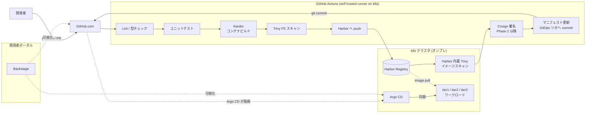
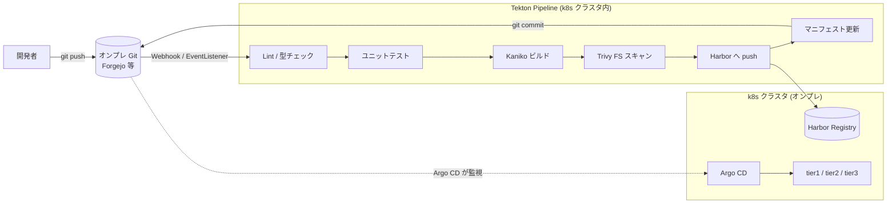
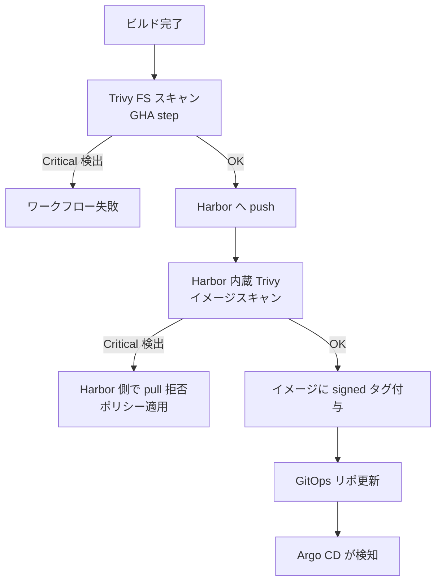

# CI / CD パイプライン構成

## 目的

`技術選定_周辺OSS.md` で採用決定した GitHub Actions / Harbor / Trivy / Argo CD を、
**どう組み合わせて 1 本のパイプラインにするか** を整理する。
各 OSS の個別選定理由は `技術選定_周辺OSS.md` を参照。

## 設計原則

1. **GHA を基本 CI エンジンとする** — PR / テスト / ビルド / スキャン / デプロイ連携まで GHA のワークフロー 1 本で完結
2. **Tekton は GHA が使えない環境向けのフォールバック** — MVP では構築しない。別拠点 / 顧客環境で GHA 不可の場合に同等の Pipeline を提供
3. **開発者は CI 設定を手書きしない** — 雛形生成 CLI が GHA ワークフロー (と将来的な Tekton Pipeline) をセットで生成
4. **デプロイはすべて GitOps** — CI は Git にマニフェストを commit するだけ。実デプロイは Argo CD が担う
5. **Harbor / Trivy でイメージの門番を担う** — CVE Critical 以上が検出されたイメージは push 拒否
6. **Backstage からすべての状態が見える** — GHA / Argo CD のプラグインで統合表示

---

## 1. 全体フロー (基本: GHA パス)

**ポイント**:

- GHA の self-hosted runner は **k8s 上の Pod** として稼働 (`actions-runner-controller`)
- 1 本のワークフロー内でビルド / スキャン / push / GitOps 更新までを step として実行
- マニフェスト更新は同一リポジトリ内の `deploy/` ディレクトリ、または別リポジトリ (GitOps リポ) のどちらも可能。MVP では単一リポジトリで開始
- Argo CD は GitOps リポの変更を検知して同期。開発者は Argo CD を直接操作しない

## 1.1 代替フロー (Tekton パス / GHA 不可環境)

GHA が利用できない環境 (GitHub.com 到達不可、完全エアギャップ、ポリシー上の禁止等) では、
**同じステージを Tekton Pipeline で再現**する。MVP では構築しないが、設計の退路として残す。

**代替フローの前提**:

- ソースコード管理は GitHub.com ではなく、オンプレ Git (Forgejo / Gitea 等) を利用
- トリガは Tekton Triggers の `EventListener` が Git Webhook を受ける
- ステージの定義は GHA ワークフローと **同じロジックを Tekton Task として並行管理**
- MVP では利用しないため、Pipeline / Task の実装は Phase 2 以降

---

## 2. ステージ別の実行方式

### 2.1 GHA ワークフローのステージ構成 (基本)

GHA self-hosted runner 上で以下のステージを **1 本のワークフローの step** として順次実行する。

| ステージ | 使用ツール | 備考 |
|---|---|---|
| PR トリガ | GHA `on: pull_request` | GitHub Checks / PR コメント統合 |
| Lint / フォーマット | clippy / rustfmt / eslint / prettier | 失敗時に PR をブロック |
| ユニットテスト | `cargo test` / `dotnet test` / `go test` | テスト結果を GitHub Checks に出力 |
| 型チェック | `tsc` / `cargo check` | PR ブロック条件 |
| コンテナビルド | Kaniko (in Pod) | Docker デーモン不要、self-hosted runner Pod 内で実行 |
| ソースコード脆弱性スキャン | Trivy FS | ビルド前後の早期検知 |
| Harbor への push | `crane` / `skopeo` | クラスタ内通信で高速 |
| イメージ脆弱性スキャン | Harbor 内蔵 Trivy | push 後に Harbor 側で自動実行 |
| イメージ署名 (Phase 2 以降) | Cosign | サプライチェーンセキュリティ |
| マニフェスト更新 | `yq` + `git commit` | GitOps リポへの image tag 書き換え |
| リリースタグ付け | `actions/github-script` | GitHub Releases との統合 |
| チェンジログ生成 | `git-cliff` / `release-please` | コミット履歴からの自動生成 |

### 2.2 self-hosted runner の構成

- `actions-runner-controller` で runner Pod を k8s 上に宣言的に管理
- runner Pod は **Kaniko / Trivy / crane / argocd CLI を同梱したカスタムイメージ**を使用
- runner Pod は Harbor / Argo CD / GitOps リポに **クラスタ内通信** で到達
- Phase 1 では最小 2 Pod 構成、負荷に応じてスケール

### 2.3 Tekton 代替フローのステージ構成 (Phase 2 以降)

GHA が使えない環境向け。構成は同じステージを Tekton Task として実装する。

| ステージ | 対応 Tekton Task | 備考 |
|---|---|---|
| Lint / テスト / 型チェック | カスタム Task | 言語別の Task を catalog で提供 |
| Kaniko ビルド | `kaniko` Task (Tekton Catalog) | 公式 catalog から流用 |
| Trivy FS スキャン | `trivy-scanner` Task | 公式 catalog から流用 |
| Harbor push | `crane` Task | 公式 catalog から流用 |
| マニフェスト更新 | カスタム Task (`yq` + `git`) | GitOps リポ書き換え |

> **GHA と Tekton の Task / step は 1 対 1 で対応させる**。雛形生成 CLI が両方を同時に生成するため、開発者が片方だけを保守することがないようにする。

### 2.4 Argo CD が担うステージ

| ステージ | 動作 | 備考 |
|---|---|---|
| Git リポ監視 | 3 分間隔でポーリング (既定) | Webhook で即時化も可能 |
| マニフェスト差分検知 | Argo CD Controller | 自動同期 / 手動同期を環境ごとに設定 |
| k8s リソース適用 | `kubectl apply` 相当 | ApplicationSet で tier 単位に分割 |
| ヘルスチェック | Argo CD Health Assessment | カスタムヘルスチェックも追加可能 |
| ロールバック | Git revert → Argo CD 同期 | 運用は Git 主導で統一 |

---

## 3. イメージ品質ゲート

**ポリシー**:

- **Trivy FS (ビルド前)** — `HIGH` 以上を検出したら警告、`CRITICAL` でパイプライン失敗
- **Harbor 内蔵 Trivy (push 後)** — `CRITICAL` を含むイメージは `pull` を拒否 (Harbor のプロジェクトポリシー)
- **開発時の例外** — `dev` ブランチからのイメージは警告のみとし、`main` ブランチからのイメージのみ品質ゲートを厳格適用
- **Phase 2 以降** — Cosign 署名を追加し、未署名イメージの deploy も k8s Admission Webhook (Kyverno) で拒否

---

## 4. 認証の一元化 (Keycloak OIDC)

| コンポーネント | OIDC クライアント種別 | 用途 |
|---|---|---|
| GitHub.com | (対象外) | GitHub 側の認証は GitHub アカウントのまま |
| self-hosted runner | (対象外) | runner は GitHub からトークン受領 |
| Harbor | Confidential | Web UI / Registry 操作 |
| Argo CD | Confidential | Web UI / CLI (SSO) |
| Backstage | Confidential | 開発者ポータル |
| Tekton Dashboard (Phase 2 以降) | Confidential | 代替フロー採用時のみ |

**ポイント**: GitHub.com を除くすべての Web UI を **Keycloak ローカル DB のユーザー** で SSO する。
MVP ではユーザー数十名を想定し、AD 連携は Phase 2 以降で追加する。

---

## 5. Backstage との統合

Backstage Software Catalog の各コンポーネントに、以下のアノテーションを付与して可視化する。

| アノテーション | 対象 | 表示内容 |
|---|---|---|
| `github.com/project-slug` | 全コンポーネント | GitHub リポジトリ情報 / PR 状態 / Actions ワークフロー実行状況 |
| `backstage.io/techdocs-ref` | 全コンポーネント | TechDocs (サービス設計書) |
| `argocd/app-name` | tier1 / tier2 / tier3 | Argo CD Application 同期状態 |
| `harbor/project-name` | tier1 / tier2 / tier3 | Harbor 内の該当プロジェクト |
| `tektoncd.dev/pipeline` (Phase 2 以降) | 代替フロー採用時 | Tekton Pipeline 実行状態 |

これにより開発者は **Backstage の 1 画面から PR / Pipeline / デプロイ / レジストリ状態** をまとめて確認できる。

---

## 6. 雛形生成 CLI が生成するファイル

開発者が tier2 / tier3 サービスを新規に立ち上げるとき、
雛形生成 CLI (tier1 提供) は以下を同時に生成する。
**開発者がこれらを手書きすることは想定しない**。

| 生成ファイル | 内容 |
|---|---|
| `.github/workflows/ci.yml` | GHA の PR 時ビルド / テスト / Lint 定義 |
| `.github/workflows/release.yml` | main ブランチ push 時のビルド / スキャン / push / GitOps 更新 |
| `deploy/base/*.yaml` | k8s マニフェスト (Deployment / Service / Dapr Component) |
| `deploy/overlays/*/kustomization.yaml` | 環境別 overlay (dev / staging / prod) |
| `argocd/application.yaml` | Argo CD Application 定義 |
| `catalog-info.yaml` | Backstage Software Catalog エントリ |
| `tekton/pipeline.yaml` (Phase 2 以降) | GHA 不可環境向けの同等 Pipeline 定義 |
| `tekton/task-*.yaml` (Phase 2 以降) | 共通 Task の参照 (catalog から) |

CI / CD の進化 (新しいスキャンステップ追加等) は **雛形更新 + 既存サービスへの一括反映** で行い、個別チームに手作業で追従させない。
Tekton 代替フローを導入した時点以降は、同じ変更を GHA ワークフローと Tekton Pipeline の両方に同時反映する。

---

## 7. MVP スコープと Phase 分離

### Phase 1 (MVP)

- GHA self-hosted runner セットアップ (`actions-runner-controller`)
- runner イメージに Kaniko / Trivy / crane / argocd CLI を同梱
- Harbor + 内蔵 Trivy 起動、プロジェクト作成 (`tier1` / `tier2` / `tier3` / `infra`)
- Argo CD インストール + tier1 向け ApplicationSet
- Keycloak OIDC で Argo CD / Harbor / Backstage を SSO 統合
- 1 本のサンプルサービス (tier1 リファレンス実装) で GHA フロー疎通
- **Tekton はインストールしない**

### Phase 2

- Cosign 署名と Kyverno の未署名ブロック
- Argo Rollouts によるカナリア / Blue-Green
- Trivy DB のオフラインミラー運用 (JTC 環境向け)
- Backstage Software Templates から雛形生成 CLI を呼び出し
- **Tekton 代替フローの検討開始** — 別拠点 / 顧客環境で GHA 不可のケースが出た時点で着手

### Phase 3 以降

- マルチクラスタ (staging / prod 分離)
- External Secrets Operator + Keycloak バックアップ
- Argo Image Updater による自動タグ更新の検討
- Tekton Chains によるサプライチェーン証跡 (代替フロー採用時)

---

## 8. 運用上の未決事項

以下は本資料では扱わず、別途決定する。

- **GitOps リポジトリを単一リポ / 別リポどちらにするか** — MVP は単一、Phase 2 で再検討
- **Secret 管理方式** — SealedSecrets vs External Secrets Operator の選定
- **環境別 overlay 設計** — kustomize / helm のどちらを主軸にするか
- **Trivy DB の更新経路** — インターネット接続制限環境での定期同期手順
- **Harbor のストレージバックエンド** — Longhorn / Rook-Ceph / S3 互換 (MinIO) のどれか

これらは Phase 1 着手前に ADR として個別に決定する。

---

## 関連資料

- `技術選定_周辺OSS.md` — 各 OSS の個別選定根拠
- `技術選定比較表.md` — 実行基盤中核の選定 (k8s / Istio / Kafka / Dapr 等)
- `開発者ポータル_Backstage活用.md` — Backstage の採用範囲と棲み分け
- `tier1_API設計原則.md` — 雛形生成 CLI と tier1 公開 API の設計原則
