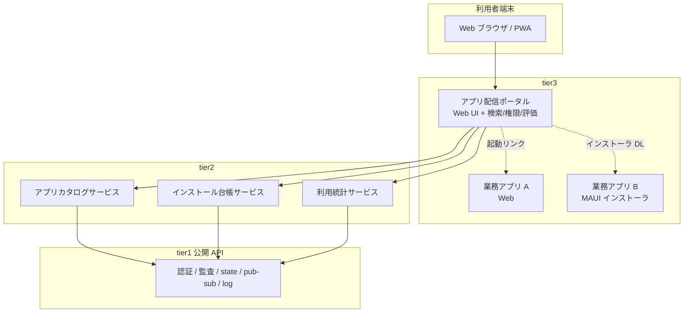
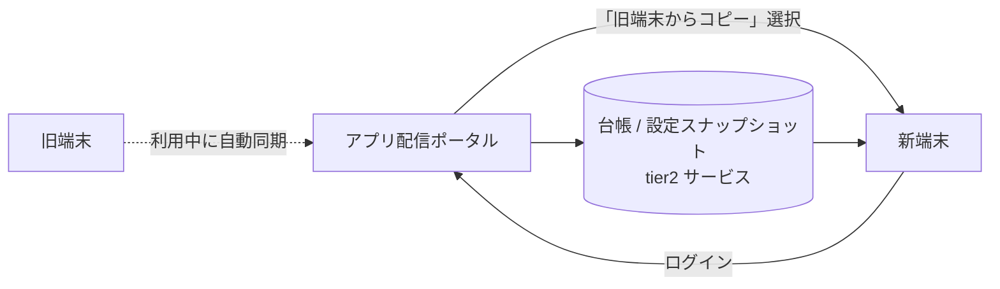

# アプリ配信ポータル構想

## 目的
tier3 アプリケーションを **エンドユーザー自身がスマホアプリ感覚でインストール / 利用開始できる仕組み** を k1s0 上に用意する。
従来 JTC で行われていた「情シスが各端末を訪問して exe を手動インストールする」運用を撤廃することを目標とする。

---

## 1. 解決したい課題

### 従来の配信モデル

```
[情シス] ──── 各ユーザーの端末を訪問 ────→ exe 手動インストール
                                          ・台帳手書き管理
                                          ・更新時はまた訪問
                                          ・退職者の権限剥奪は手動
```

| 課題 | 影響 |
|---|---|
| 情シスの工数が膨大 | 100 端末への配布で 1 人月単位の作業 |
| バージョン乖離が起きる | 端末ごとに古い版が残り、サポートが破綻 |
| 利用者把握が台帳依存 | 誰がどのアプリを使っているか不正確 |
| 退職・異動時の権限剥奪が遅延 | セキュリティ事故の温床 |
| 新規アプリの導入リードタイムが長い | 業務改善のスピードが情シス工数に律速される |
| ユーザーが「使える機能を知らない」 | 業務改善の余地が共有されない |

### 目指す配信モデル

```
[ユーザー] ──ブラウザ──→ [k1s0 アプリ配信ポータル]
                              │
                              ├─ アプリ一覧 (スマホストア風 UI)
                              ├─ 自分の権限で使えるものだけ表示
                              ├─ 「インストール / 起動」ボタン
                              ├─ 説明 / スクリーンショット / 評価
                              └─ 自動更新 / 利用統計 / 監査ログ
```

利用者は **「自分が使える業務システムを自分で見つけて起動できる」** 状態になる。
情シスは個別端末作業から解放され、**ポータルへの掲載審査** と **権限ポリシー定義** に集中できる。

---

## 2. 配信形態の選択肢

tier3 アプリは性質によって 3 通りの配信形態を取りうる。**ポータルはこの 3 形態を統一的に扱う**。

| 形態 | 実体 | インストール方式 | 例 |
|---|---|---|---|
| **(A) Web アプリ (推奨デフォルト)** | tier3 サーバーが提供する Web UI (React / Blazor 等) | インストール不要。URL を開く / PWA 化してホーム追加 | 業務照会画面、ダッシュボード |
| **(B) ネイティブクライアント (MAUI / WinUI / Electron)** | 端末側に実行ファイルが必要なアプリ | ポータルから署名済みインストーラを取得 → クリックインストール | 高頻度入力、オフライン業務、ハードウェア連携 |
| **(C) 既存 .NET Framework アプリのラップ** | レガシー exe をそのまま生かす | ClickOnce / MSIX / 配信エージェント経由で配布 | レガシー資産との共存期 |

### 推奨: PWA 優先 + 必要に応じてネイティブ

- **第一選択は (A) Web アプリ + PWA**。インストール作業ゼロで配信できる。
- ハードウェア連携や厳密なオフライン業務が必要な場合のみ (B)。
- (C) は移行期の互換手段として置く。新規開発で (C) を選ばせない。

---

## 3. ポータル自体の構成 (tier3 として実装する)

ポータル自体も「tier3 アプリの 1 つ」として k1s0 上に乗る。
特権的な配信機構を別建てしない (= 基盤の対称性を保つ)。



### ポータルの主要機能

| 機能 | 内容 | 実装担当 tier |
|---|---|---|
| アプリカタログ | 一覧・検索・カテゴリ・スクリーンショット・説明 | tier2 (カタログサービス) + tier3 (UI) |
| 権限フィルタ | ログインユーザーの所属・役職に応じて表示を絞る | tier1 (認証) + tier2 (権限ポリシー) |
| インストール / 起動 | Web は URL リダイレクト、ネイティブは署名済みパッケージ DL | tier3 (UI) + tier2 (台帳) |
| 自動更新 | PWA は Service Worker、ネイティブは MSIX / ClickOnce | tier3 (アプリ側) |
| **端末設定コピー** | **別の端末 (旧端末や同僚端末) のアプリ一覧 / 設定を新端末へ一括復元** | tier2 (台帳 / 設定同期) + tier3 (UI) |
| レビュー / 評価 | ユーザーが ★ や改善要望を投稿 | tier2 + tier3 |
| 利用統計 | 誰がどのアプリをいつ起動したか | tier1 (監査ログ) + tier2 (集計) |
| 申請ワークフロー | 権限がないアプリへの利用申請 → 上長承認 | tier1 (Workflow / Dapr Workflow) |
| お知らせ / リリースノート | アプリ更新や障害情報の告知 | tier2 + tier3 |

---

## 4. 端末設定コピー機能 (端末更新時の利用)

### 解決する課題

JTC では数年に 1 度の **PC リプレース (端末更新)** が情シスの最大級の負荷となる。

| 従来の痛み | 影響 |
|---|---|
| 旧端末で何をインストールしていたか分からない | 棚卸しに 1 端末あたり数時間 |
| 各アプリの設定 (接続先 / お気に入り / レイアウト等) が消失 | ユーザーから「前と違う」クレーム多発 |
| 情シスが 1 端末ずつ手作業で復元 | 大規模リプレースで数人月単位の工数 |
| 設定移行漏れで業務停止 | 復旧待ちでユーザーがアイドル |
| 異動者・後任者に同じ設定を渡したい時の手段がない | 口頭引き継ぎに依存 |

### 仕組み

ポータルは **「ユーザー × 端末 × アプリ × 設定スナップショット」** を tier2 台帳サービスに保持する。
新端末からポータルにログインした時点で「コピー元」を選んで一括復元できる。



### 復元される情報

| カテゴリ | 内容 | 復元手段 |
|---|---|---|
| **インストール済みアプリ一覧** | (A) PWA はホーム追加、(B) ネイティブはインストーラ自動 DL | ポータルが再インストールを順次キック |
| **アプリ毎の設定** | 接続先環境 (本番 / 検証)、画面レイアウト、お気に入り、フィルタ条件 | tier1 公開 API の `Settings` (後述) 経由で復元 |
| **権限 / ロール** | 既存の認証基盤と同期しているため自動引き継ぎ | tier1 認証 |
| **業務データ** | サーバー側に保持されているため端末非依存 | 復元不要 |
| **ローカルキャッシュ** | 通常は再ダウンロード | 復元しない (鮮度優先) |

### tier1 への追加 API 案

各 tier3 アプリが「自分の設定を端末横断で同期する」には、tier1 公開ライブラリに **設定同期 API** を 1 本生やす。Dapr の State / Configuration building block を内部で使う:

```csharp
// tier3 アプリのコード (Dapr を意識しない)
// 設定保存
await k1s0.Settings.SaveAsync("dashboard.layout", layout);
// 設定取得 (新端末でも同じ値が返る)
var layout = await k1s0.Settings.GetAsync<DashboardLayout>("dashboard.layout");
```

- **キーは アプリ ID + ユーザー ID + 設定キー** で名前空間を切る
- 端末固有値 (ローカルパス等) は保存しない方針を SDK 側でガイド (analyzer で警告)
- バージョン互換性 (旧版のアプリで保存した設定を新版が読む) は各アプリチームの責務

### コピーのモード

ユーザーが選べるコピー元は 3 通り。状況に応じて使い分ける。

| モード | 用途 | 注意点 |
|---|---|---|
| **(1) 自分の旧端末から** | PC リプレース時の標準フロー | 旧端末がポータルに登録済みであることが前提 |
| **(2) 同じ部署の同僚から (テンプレート化)** | 新入社員 / 異動者の初期セットアップ | 同僚の同意 + 上長承認を申請ワークフローで取得 |
| **(3) 部署標準テンプレートから** | 部署単位で「最低限これだけ入れる」を情シスが定義 | 情シスがテンプレートをメンテナンスする |

### セキュリティ / 監査

端末設定コピーは **権限の引き継ぎではなく利便性の引き継ぎ** に限定する。具体的には:

- コピー操作は全て tier1 監査ログに記録 (誰が誰の設定をいつコピーしたか)
- 申請制アプリ (権限が必要なもの) は **インストールはコピーされても、利用権限は新端末側で再評価**される
- 機密データを含む設定 (パスワード等) は **コピー対象外**。API 設計時に「秘匿フラグ」を付けて分離
- 退職者の設定は一定期間で自動消去

### MVP では含めない判断

設定コピーは **Phase 2 以降** とする。MVP では「ログインしたユーザーがどのアプリを使えるかが分かる」だけで十分価値がある。設定同期のスキーマ設計は tier3 アプリが増えてから決める方が現実的。

---

## 4. 認証 / 権限管理

### 認証

- 既存の社内 ID 基盤 (AD / Entra ID / LDAP / SAML / OIDC) と SSO 連携
- ポータル固有の ID は持たない (情シスの ID 管理工数を増やさない)
- tier1 の認証ライブラリがこれを吸収する

### 権限ポリシー

**「ユーザー自身がインストールできる」と「無秩序にインストールできる」は別**。
JTC では業務アプリへのアクセスに統制が必須。以下の階層で制御する:

| 階層 | 制御内容 | 例 |
|---|---|---|
| **公開アプリ** | 全社員が即利用可 | 社内連絡、勤怠 |
| **部門限定アプリ** | 所属部門で自動許可 | 経理部の経費精算 |
| **申請制アプリ** | 上長承認後に利用可 | 人事系、機密データ参照 |
| **管理者限定** | 情シス / 特定権限者のみ | システム管理ツール |

→ **ユーザーから見ると「アプリストアでインストールボタンを押すだけ」**だが、裏側で権限チェック / 申請ワークフローが走る。ユーザー体験はあくまでスマホアプリ感覚を保つ。

---

## 5. JTC 情シス特有の制約への対応

| 制約 | 対応 |
|---|---|
| 閉域ネットワーク (インターネット非接続) | ポータルは社内 k8s 上で完結。外部 CDN / ストア API に依存しない |
| 端末の管理者権限が一般ユーザーにない | (B) ネイティブは MSIX (ユーザー権限インストール対応) または ClickOnce を採用。管理者権限を要求する形態は避ける |
| 既存 .NET Framework 資産との共存 | (C) ラップ配信を移行期に許容。ポータル UI からは新旧の差を見せない |
| 稟議文化 | 申請制アプリは Workflow で稟議承認フローを実装。紙の稟議を電子化して情シスへの申請が消える |
| 監査要求 (ISMS / J-SOX) | 全インストール / 起動を tier1 監査ログに記録。退職者の利用履歴を即日凍結可能 |
| 端末 OS の混在 (Windows 10/11 / Mac / iPad) | PWA 優先方針により OS 依存を最小化 |

---

## 6. 既存類似製品との比較

| 製品 | 立ち位置 | k1s0 ポータルとの違い |
|---|---|---|
| **Microsoft Intune Company Portal** | 端末管理 + アプリ配布 (商用 SaaS) | クラウド前提でオンプレ JTC では稟議が通りにくい。Microsoft ロックイン |
| **Microsoft Store for Business** | 提供終了 (2023) | 既に選択肢から外れる |
| **Apple Business Manager** | iOS / Mac 限定 | OS 依存。Windows 主体の JTC では使えない |
| **Backstage の Software Catalog** | 開発者向けカタログ | エンドユーザー向け配信 UI ではない |
| **自社 Web ポータル (内製の各社事例)** | 各社独自実装 | k1s0 が共通フレームワークとして提供することで再発明を防ぐ |

→ **JTC 情シス向けの「オンプレ完結 / OSS / OS 中立」な配信ポータルは事実上空白地帯**。k1s0 の差別化要素になる。

---

## 7. MVP スコープ (暫定案)

> ポータル機能はフェーズ分けして導入する。MVP では (A) Web アプリの配信に絞る。

| フェーズ | 含める機能 |
|---|---|
| **Phase 1 (MVP)** | アプリカタログ表示 / 認証連携 / Web アプリへの起動リンク / 監査ログ記録 |
| **Phase 2** | 権限ポリシー / 部門フィルタ / 利用統計 / お知らせ / **端末台帳 (どのユーザーがどのアプリを入れているかの記録)** |
| **Phase 3** | ネイティブインストーラ配信 (MSIX) / 自動更新 / レビュー機能 / **端末設定コピー (旧端末→新端末の一括復元)** |
| **Phase 4** | 申請ワークフロー / 稟議承認 / 評価ランキング / レコメンド / **同僚 / 部署テンプレートからのコピー** |
| **Phase 5** | レガシー .NET Framework アプリのラップ配信 (移行期支援) |

---

## 8. 企画書での訴求ポイント

ペルソナ別に何を訴えるか:

- **守護者タイプ (田辺)**: 既存 .NET Framework アプリも (C) でラップ配信できる → 「捨てなくていい」
- **挑戦者タイプ (森田)**: 新規アプリを書いて即ポータル掲載できる → 「学習成果が即ユーザーに届く」
- **決裁者タイプ (西尾)**: 情シスの端末訪問工数がゼロになる / 退職者の権限剥奪が即時 / **PC リプレース時の設定移行コストが激減** → **コスト削減 + セキュリティ強化を同時に語れる**
- **運用担当 (石田)**: 端末ごとのバージョン乖離が消える / **端末更新時の設定復元が自動化される** → 夜間問い合わせと PC リプレース夜間対応の根本原因が消える
- **要件定義担当 (青木)**: 業務改善案を即配信できる → リードタイム短縮の一翼
- **エンドユーザー (新規ペルソナ候補)**: スマホ感覚で業務システムを使える → IT リテラシーの低い現場にも届く

---

## 9. 関連資料
- `概念アーキテクチャ図.md` — k1s0 全体構成の中での位置付け
- `ペルソナ.md` — エンドユーザー視点のペルソナ追加候補
- `tier1_API設計原則.md` — ポータルも tier1 公開 API 越しに認証 / 監査を行う
- `競合調査.md` — Intune / Backstage 等との比較
