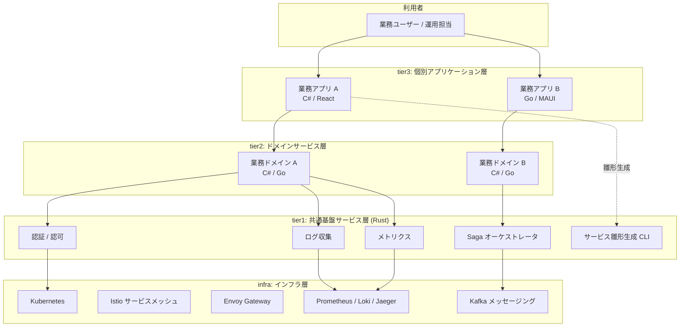
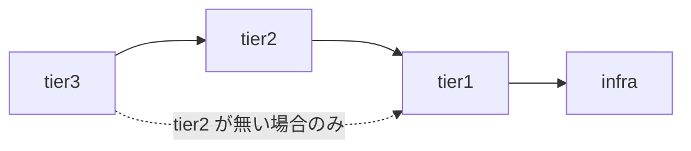
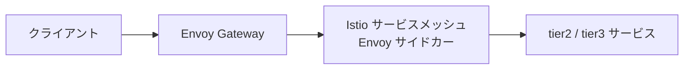
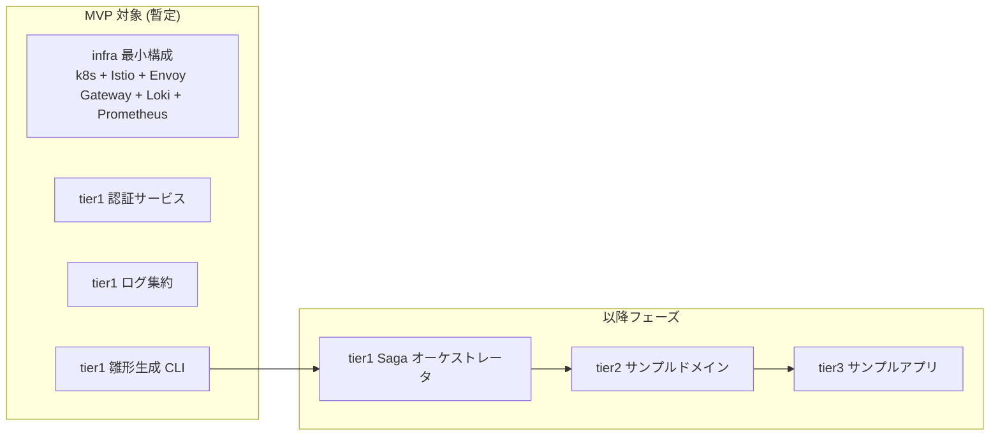

# 概念アーキテクチャ図

## 目的
k1s0 の全体像を 1 枚の図で把握できるようにする。企画書の導入部に流用する。
本資料は概念レベルに留め、物理ノード配置・ストレージ構成・ネットワーク詳細は別資料とする。

---

## 1. レイヤ構成

k1s0 は 4 つの実行レイヤ (infra / tier1 / tier2 / tier3) と、それらを横断する運用レイヤ (operation) から成る。
実行レイヤは下から infra → tier1 → tier2 → tier3 の階層関係を持つ。



※ 図中の矢印は代表的な依存関係のみを示す。infra 層への直接依存は tier1 のみに許可され、tier2 / tier3 は tier1 経由で infra 機能を利用する。

---

## 2. レイヤの責務

### infra 層
- 物理的な実行基盤。k8s クラスタとその周辺コンポーネント。
- 担当: インフラチーム
- 管轄ディレクトリ: `infra/`

### tier1 層 (共通基盤サービス / Rust)
- システム全体で共通利用する機能をサービスまたはライブラリとして提供する。
- 例: 認証、ログ、メトリクス、Saga 調停、雛形生成ツール
- 担当: システム基盤チーム
- 管轄ディレクトリ: `src/tier1/`
- 実装言語: Rust 固定

### tier2 層 (ドメインサービス)
- 業務ドメインロジックを実装するサービス。
- 担当: ドメイン開発チーム
- 管轄ディレクトリ: `src/tier2/`
- 実装言語: C# / Go 等 自由

### tier3 層 (個別アプリケーション)
- エンドユーザー向けの UI / API を持つアプリケーション。
- 担当: 個別アプリケーション開発チーム
- 管轄ディレクトリ: `src/tier3/`
- 実装言語: サーバー = C# / Go、クライアント = MAUI / React (TSX)

### operation 層 (運用 / 横断)
- 実行レイヤではなく、全レイヤに横断的に作用する運用プロセス層。
- 運用手順・監視設定・オンコール対応・リリース管理。
- 担当: 運用チーム
- 管轄ディレクトリ: `operation/`

---

## 3. 依存ルール

tier 間の依存は 1 方向のみ。下位から上位への依存は禁止する。



- tier3 は原則 tier2 を経由して tier1 を利用する。
- tier2 が存在しない場合に限り tier3 は tier1 を直接利用可。
- **infra 層への直接依存は tier1 のみに許可する**。tier2 / tier3 は tier1 が提供するサービス / ライブラリ経由で infra 機能 (認証・ログ・メトリクス・メッセージング等) を利用する。
- これにより tier1 が infra の抽象化層として機能し、将来的な infra 置換 (例: Kafka → NATS、Loki → Tempo 等) の影響を tier1 内に閉じ込められる。

---

## 4. 通信経路

### 外部 → サービス



### サービス間通信
- **同期**: Istio 経由で gRPC / HTTP。mTLS は Istio が担保。
- **非同期**: Apache Kafka によるイベント配信 / イベントソーシング。tier1 が提供する共通クライアントライブラリ経由で利用する。
- **分散トランザクション**: tier1 の Saga オーケストレータが調停。

### 可観測性
- **トレース**: 全サービスが OpenTelemetry で計装 → Jaeger
- **ログ**: 標準出力 → Fluent Bit → Loki
- **メトリクス**: Prometheus が各サービスをスクレイプ
- **可視化**: Grafana で統合表示

---

## 5. 配置形態

```mermaid
flowchart TB
    subgraph OnPrem["オンプレミス OR クラウド VM"]
        subgraph K8s["Kubernetes クラスタ"]
            subgraph NS1["namespace: infra"]
                C1[Envoy Gateway]
                C2[Istio Control Plane]
                C3[Prometheus / Loki / Jaeger / Grafana]
                C4[Kafka (Strimzi)]
            end
            subgraph NS2["namespace: tier1"]
                C5[認証 / ログ / Saga 等]
            end
            subgraph NS3["namespace: tier2"]
                C6[ドメインサービス群]
            end
            subgraph NS4["namespace: tier3"]
                C7[業務アプリ群]
            end
        end
    end
```

- クラウドマネージドサービス (EKS / AKS / GKE) は使用しない。
- セルフマネージドな k8s (kubeadm / k3s / RKE2 等) を想定する。

---

## 6. MVP スコープ (初期リリース) ※暫定案

> **注**: 本セクションは提案レベルの暫定案であり、企画書確定時に改めて合意する必要がある。



- MVP では infra の最小構成と tier1 の 3 機能に絞ることを提案する。
- tier2 / tier3 はサンプル実装を段階的に追加する。
- 課題メモの「infra → tier1 → tier2 → tier3 の順で開発する」方針に沿った順序で段階化する。

---

## 7. 補足

- 本図は概念レベル。物理構成は別資料 (未作成) で扱う。
- .NET Framework 資産との共存は tier3 の拡張ポイントとして扱い、既存アプリはサイドカー方式または API Gateway 経由で k1s0 と連携する想定。
