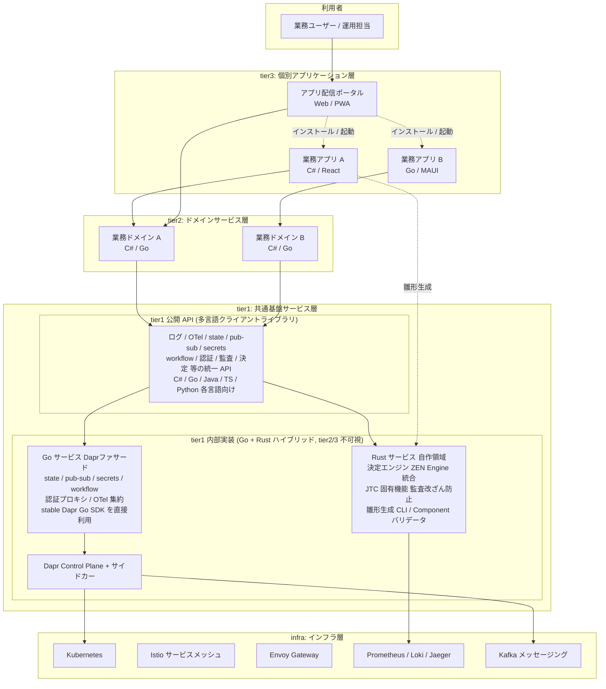
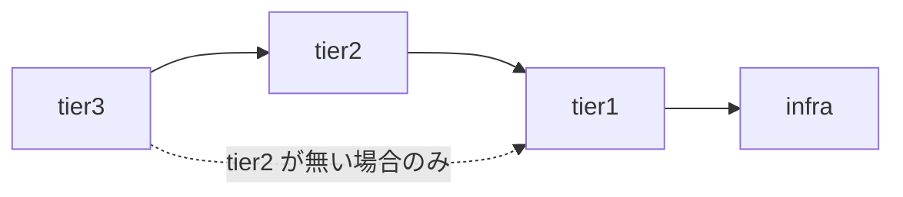
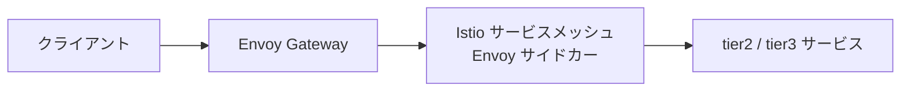
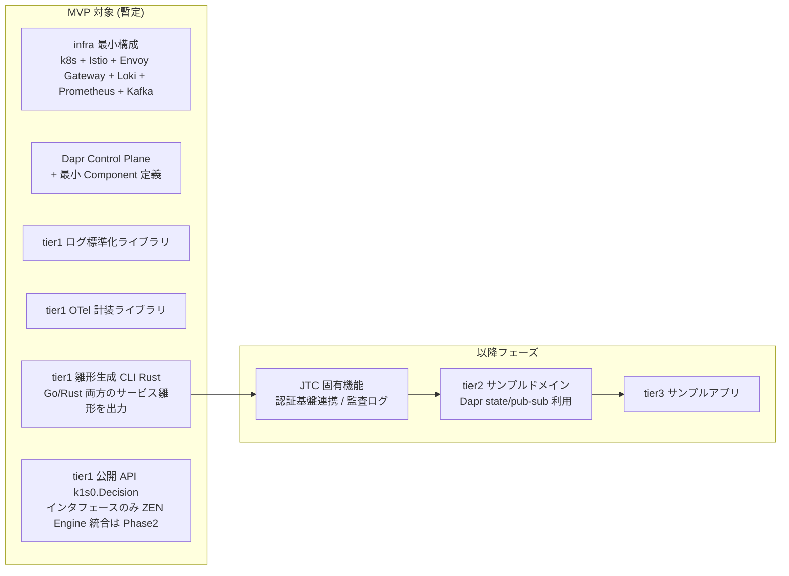

# 概念アーキテクチャ図

## 目的
k1s0 の全体像を 1 枚の図で把握できるようにする。企画書の導入部に流用する。
本資料は概念レベルに留め、物理ノード配置・ストレージ構成・ネットワーク詳細は別資料とする。

---

## 1. レイヤ構成

k1s0 は 4 つの実行レイヤ (infra / tier1 / tier2 / tier3) と、それらを横断する運用レイヤ (operation) から成る。
実行レイヤは下から infra → tier1 → tier2 → tier3 の階層関係を持つ。



※ 図中の矢印は代表的な依存関係のみを示す。infra 層への直接依存は tier1 のみに許可され、tier2 / tier3 は tier1 経由で infra 機能を利用する。

---

## 2. レイヤの責務

### infra 層
- 物理的な実行基盤。k8s クラスタとその周辺コンポーネント。
- 担当: インフラチーム
- 管轄ディレクトリ: `infra/`

### tier1 層 (共通基盤サービス)
- システム全体で共通利用する機能をサービスまたはライブラリとして提供する。
- tier1 は以下の 3 要素で構成される。
  - **tier1 公開 API (多言語クライアントライブラリ)** — tier2 / tier3 が利用する唯一の接点。各言語 (C# / Go / Java / TS / Python) 向けに提供。
  - **tier1 内部実装 (不可視, Go + Rust ハイブリッド)** — 「Dapr」と「Go ファサードサービス」と「Rust 自作サービス」の並立で構成される。tier2 / tier3 からは隠蔽される。
  - **雛形生成 CLI** — サービス雛形を生成し、Dapr annotation や tier1 ライブラリ依存を自動で組み込む。Go / Rust 両方のサービス雛形を出力する責務を持つ。
- **重要原則**: **tier2 / tier3 は Dapr を直接意識しない**。Dapr SDK の import / `dapr.io/*` annotation / Component YAML / Dapr のエラーメッセージのいずれも tier2 / tier3 コードに現れない。これらは tier1 公開 API / 雛形生成 CLI / tier1 チームが吸収する。
- **内部言語の使い分け**: tier1 内部サービスは用途で言語を選ぶ。
  - **Go**: Daprファサード系 (state / pub-sub / secrets / workflow / bindings) / 認証プロキシ / OTel 集約。Dapr Go SDK が stable のため間接化が不要。
  - **Rust**: 決定エンジン (ZEN Engine 統合) / JTC 固有機能 (crypto / 監査改ざん防止 / 個人情報マスキング) / 雛形生成 CLI / Dapr Component バリデータ。本当に Rust の優位性が出る用途に限定。
  - **言語境界**: tier1 内部のサービス間通信は **Protobuf gRPC を必須化**。`.proto` を `src/tier1/contracts/` に集中管理。
  - 詳細は `tier1_内部言語ハイブリッド方針.md` を参照。
- **利用判断**: tier1 公開 API の設計時に「機能が Dapr で賄えるなら Go ファサード経由、不足するなら Rust 自作サービスを呼ぶ」という判断を tier1 側で行う。tier2 / tier3 開発者はこの判断に関与しない。
- 担当: システム基盤チーム
- 管轄ディレクトリ: `src/tier1/`
- 実装言語:
  - 公開 API: 各対象言語 (C# / Go / Java / TS / Python 等)。薄いラッパー。
  - 内部実装: **Go (Daprファサード) + Rust (自作領域) のハイブリッド**。

### tier2 層 (ドメインサービス)
- 業務ドメインロジックを実装するサービス。
- 担当: ドメイン開発チーム
- 管轄ディレクトリ: `src/tier2/`
- 実装言語: C# / Go 等 自由

### tier3 層 (個別アプリケーション)
- エンドユーザー向けの UI / API を持つアプリケーション。
- 担当: 個別アプリケーション開発チーム
- 管轄ディレクトリ: `src/tier3/`
- 実装言語: サーバー = C# / Go、クライアント = MAUI / React (TSX)
- **配信形態**: Web (PWA) を第一選択とし、ハードウェア連携等の必要時のみ MAUI / WinUI ネイティブ。レガシー .NET Framework exe は移行期に限り ClickOnce / MSIX でラップ配信する。
- **エンドユーザーへの提供**: tier3 アプリは **アプリ配信ポータル** (これも tier3 として実装) を介してエンドユーザー自身が「スマホアプリ感覚で」インストール / 起動する。情シスによる端末手動インストールは廃止する。詳細は `アプリ配信ポータル構想.md` を参照。

### operation 層 (運用 / 横断)
- 実行レイヤではなく、全レイヤに横断的に作用する運用プロセス層。
- 運用手順・監視設定・オンコール対応・リリース管理。
- **開発者ポータル**: **Backstage** (CNCF Incubating, OSS) を採用し、サービスカタログ / TechDocs / Software Templates / 観測ダッシュボード統合を提供する。雛形生成 CLI と統合して新規サービス作成を Backstage UI から実行できるようにする。アプリ配信ポータル (エンドユーザー向け) とは対象ユーザーが異なるため別物として運用する。詳細は `開発者ポータル_Backstage活用.md` を参照。
- 担当: 運用チーム + システム基盤チーム (Backstage 構築)
- 管轄ディレクトリ: `operation/`

---

## 3. 依存ルール

tier 間の依存は 1 方向のみ。下位から上位への依存は禁止する。



- tier3 は原則 tier2 を経由して tier1 を利用する。
- tier2 が存在しない場合に限り tier3 は tier1 を直接利用可。
- **infra 層への直接依存は tier1 のみに許可する**。tier2 / tier3 は tier1 経由でのみ infra 機能を利用する。
- **tier2 / tier3 は tier1 公開 API (多言語クライアントライブラリ) のみを利用する**。Dapr SDK / Dapr API / infra コンポーネント (Kafka クライアント等) を直接 import / 呼び出してはならない。
- これにより:
  - tier1 が infra と Dapr の抽象化層として機能する
  - 将来的な infra 置換 (Kafka → NATS, Loki → Tempo 等) や Dapr のバージョン更新・互換性破壊の影響を **tier1 内に閉じ込められる**
  - tier2 / tier3 のコードは「Dapr を知らない」まま長期保守できる

---

## 4. 通信経路

### 外部 → サービス



### サービス間通信
- **同期**: Istio 経由で gRPC / HTTP。mTLS は Istio が担保。
- **非同期**: Apache Kafka によるイベント配信 / イベントソーシング。tier1 が提供する共通クライアントライブラリ経由で利用する。
- **分散トランザクション**: tier1 の Saga オーケストレータが調停。

### 可観測性
- **トレース**: 全サービスが OpenTelemetry で計装 → Jaeger
- **ログ**: 標準出力 → Fluent Bit → Loki
- **メトリクス**: Prometheus が各サービスをスクレイプ
- **可視化**: Grafana で統合表示

---

## 5. 配置形態

```mermaid
flowchart TB
    subgraph OnPrem["オンプレミス OR クラウド VM"]
        subgraph K8s["Kubernetes クラスタ"]
            subgraph NS1["namespace: infra"]
                C1[Envoy Gateway]
                C2[Istio Control Plane]
                C3[Prometheus / Loki / Jaeger / Grafana]
                C4[Kafka (Strimzi)]
            end
            subgraph NS2["namespace: tier1"]
                C5a[Dapr Control Plane<br/>operator / sidecar-injector / sentry]
                C5b[tier1 Go サービス群<br/>Daprファサード / 認証プロキシ / OTel 集約<br/>stable Dapr Go SDK 利用]
                C5c[tier1 Rust サービス群<br/>決定エンジン ZEN Engine 統合<br/>JTC 固有機能 / 雛形 CLI / バリデータ]
            end
            subgraph NS3["namespace: tier2"]
                C6[ドメインサービス Pod<br/>app container + Dapr sidecar<br/>※ sidecar は tier1 責任で自動注入]
            end
            subgraph NS4["namespace: tier3"]
                C7[業務アプリ Pod<br/>app container + Dapr sidecar<br/>※ sidecar は tier1 責任で自動注入]
            end
            subgraph NS5["namespace: operation"]
                C8[Backstage Pod<br/>開発者ポータル<br/>サービスカタログ / TechDocs<br/>Software Templates]
            end
        end
    end
```

- クラウドマネージドサービス (EKS / AKS / GKE) は使用しない。
- セルフマネージドな k8s (kubeadm / k3s / RKE2 等) を想定する。

---

## 6. MVP スコープ (初期リリース) ※暫定案

> **注**: 本セクションは提案レベルの暫定案であり、企画書確定時に改めて合意する必要がある。



- MVP では infra の最小構成 + Dapr 導入 + tier1 の 3 要素 (ログ / OTel / 雛形生成) に絞る。
- Dapr により従来想定していた自前実装 (認証 / state / pub-sub / Saga オーケストレータ) の多くが不要になり、MVP スコープが縮小する。
- tier2 / tier3 はサンプル実装を段階的に追加する。
- 課題メモの「infra → tier1 → tier2 → tier3 の順で開発する」方針に沿った順序で段階化する。

---

## 7. 補足

- 本図は概念レベル。物理構成は別資料 (未作成) で扱う。
- .NET Framework 資産との共存は tier3 の拡張ポイントとして扱い、既存アプリはサイドカー方式または API Gateway 経由で k1s0 と連携する想定。
