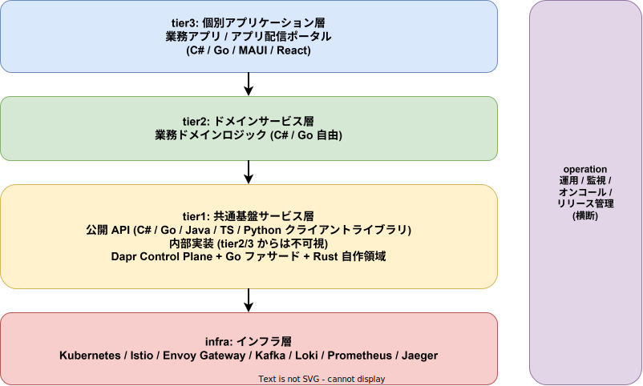

<!-- _class: title -->

# k1s0

## JTC 情報システム部門のための
## マイクロサービス基盤プラットフォーム

<br>

**起案者**: (起案者名)
**起案日**: 2026-04-12
**版**: ドラフト v0.1

---

# エグゼクティブサマリ

- **何を**: JTC 情シスでも導入できる **OSS 積み上げ型マイクロサービス基盤** を内製する
- **なぜ**: 古い単一技術のモノリス集合体が「崩れかけのジェンガ」状態。新技術導入のハードルが高すぎる
- **どう違う**: 商用 IDP / k8s ディストリビューションと違い **無償・オンプレ完結・レガシー共存・言語自由**
- **誰が得する**: 情シス (運用工数削減) / 開発者 (横断的関心事から解放) / 経営 (TCO 削減 + ベンダーロックイン回避) / エンドユーザー (アプリストア感覚で業務システム利用)
- **お願いしたいこと**: MVP フェーズの **承認 + 試行運用環境の確保**

---

# 1. 現状の課題

## 技術的負債のスパイラル

古い技術で作りこむ → 新技術への移行が困難 → 新技術を提案しても「よくわからないからダメ」 → 学習する若手が報われない → 古参が古い技術にしがみつく → さらに新技術への移行が困難に (ループ)

**結果**: 単一技術ごとのモノレポの集合が「崩れかけのジェンガ」に

詳細: [`01_背景と目的/00_背景と課題.md`](./01_背景と目的/00_背景と課題.md)

---

# 1. 現状の課題 (続き)

## 4 つの痛み

| 痛み | 影響 |
|---|---|
| レガシー .NET Framework 資産が動き続けている | 捨てるに捨てられず、新規開発の足を引っ張る |
| 横断的関心事 (認証 / ログ / 監視) のコピペ実装 | 業務ロジックに集中できない |
| 端末への手動アプリインストール | PC リプレース時に情シスが数人月単位で消耗 |
| 商用基盤の高額ライセンス / ベンダーロックイン | 稟議が通らない / 撤退コストが膨大 |

---

# 2. 想定ペルソナ

| 名前 | 立場 | 態度 | 得られる価値 |
|---|---|---|---|
| 田辺 (52) | 守護派ベテラン | **抵抗** | 既存資産を捨てず共存可 |
| 森田 (32) | 新技術志向の中堅 | **強く推進** | 学習が業務成果に直結 |
| 西尾 (48) | 情シス課長 (決裁者) | **中立 (条件付)** | コスト削減 + ロックイン回避 |
| 石田 (38) | 運用リーダー | 中立 | 監視統一 / 夜間対応軽減 |
| 長谷川 (29) | ドメイン開発者 | 推進 | 業務ロジックに集中可 |
| 青木 (41) | 要件定義担当 | 潜在的推進 | リードタイム短縮 |

> 守護者を排除せず、挑戦者を報い、決裁者には数値で説明する **両立構造** が必要

詳細: [`01_背景と目的/01_ペルソナ.md`](./01_背景と目的/01_ペルソナ.md)

---

# 3. k1s0 の提案

> **「OSS 積み上げで、JTC 情シスでも運用できる、レガシーと共存できる、ベンダーに縛られない開発プラットフォーム」**

## 5 つの勝ち筋

1. **無償で始められる** — 稟議のハードルなし
2. **レガシー (.NET Framework) と共存** — 捨てなくていい
3. **オンプレ / VM で完結** — クラウド依存なし
4. **言語を尊重** — tier2 / tier3 は C# / Go / MAUI / React 自由
5. **金銭的メリットで参加を促す** — 移行を強制せず、運用コスト削減を提示

詳細: [`01_背景と目的/02_解決する価値.md`](./01_背景と目的/02_解決する価値.md)

---

# 4. アーキテクチャ概観



**依存ルール**: 上から下への 1 方向。infra への直接依存は **tier1 のみ** に許可

詳細: [`02_アーキテクチャ/`](./02_アーキテクチャ/)

---

# 5. tier 構成と責務

| tier | 担当チーム | 役割 | 言語 |
|---|---|---|---|
| **infra** | インフラチーム | k8s / メッシュ / 観測基盤 / メッセージング | (OSS) |
| **tier1** | システム基盤チーム | 共通機能 (認証 / ログ / state / pub-sub / workflow / 監査 / 決定) を統一 API として提供 | Go (Daprファサード) + Rust (自作領域) + 各言語クライアントライブラリ |
| **tier2** | ドメイン開発チーム | 業務ドメインロジック | C# / Go 自由 |
| **tier3** | アプリ開発チーム | UI / API / 配信ポータル | C# / Go / MAUI / React |
| **operation** | 運用チーム | 運用手順 / 監視 / オンコール / リリース | (横断) |

詳細: [`02_アーキテクチャ/01_レイヤ構成と責務.md`](./02_アーキテクチャ/01_レイヤ構成と責務.md)

---

# 6. 技術スタック (主要選定)

| 領域 | 採用 | 理由 |
|---|---|---|
| コンテナオーケストレーション | **Kubernetes** | 業界標準。OSS で代替なし |
| サービスメッシュ | **Istio** | mTLS / トラフィック制御の決定版 |
| API Gateway | **Envoy Gateway** | k8s Gateway API 準拠。Istio と Envoy 統一 |
| メッセージング | **Apache Kafka** (Strimzi) | イベントソーシング前提 |
| 観測性 | **OpenTelemetry + Grafana Tempo + Pyroscope + Loki + Prometheus + Grafana** | ベンダー中立。LGTMP スタック統一 |
| building blocks | **Dapr** (CNCF Graduated) | tier1 内部実装に組込 |
| tier1 内部実装 (Daprファサード) | **Go** | Dapr Go SDK が stable / k8s エコシステムと整合 |
| tier1 内部実装 (自作領域) | **Rust** | メモリ安全 / 長期保守性 / ZEN Engine 統合 |
| 開発者ポータル | **Backstage** (CNCF Incubating) | サービスカタログ / TechDocs / 雛形生成 UI |
| IaC | **OpenTofu** (CNCF Sandbox / MPL 2.0) | VM / ネットワーク / k8s クラスタ構築を宣言化 |
| RDBMS | **CloudNativePG + PostgreSQL** (Apache 2.0) | Keycloak / Backstage / 業務サービスの共有 DB。k8s ネイティブ HA |
| ルールエンジン (BRE) | **ZEN Engine** (Rust 製 / MIT) | 決定表で稟議 / 権限ポリシー / 業務ルールを宣言化 |
| オブジェクトストレージ | **MinIO** (AGPL-3.0) | S3 互換。Harbor / バックアップ / OpenTofu State の統一保存先 |
| Feature Flag | **OpenFeature + flagd** (CNCF Incubating) | 段階的ロールアウト / レガシー共存の制御弁 |
| Chaos Engineering | **Litmus** (CNCF Incubating) | 縮退動作の自動検証。設計を仕様に変える |
| 分散ストレージ | **Longhorn** (CNCF Incubating) | k8s 環境でのブロックストレージ。ノード障害時のデータ保護 |
| 接続プーリング | **PgBouncer** (CloudNativePG Pooler) | PostgreSQL 接続枯渇防止 |
| 依存パッケージ自動更新 | **Renovate** | CVE 48h 対応の自動化。更新 PR 自動生成 |
| イベント駆動自動化 | **Argo Events** (Argoproj / Apache 2.0) | Webhook / Kafka イベントによる運用自動化 |
| シークレット管理 | **OpenBao** (MPL 2.0、Vault の LF fork) | 動的シークレット / 自動ローテーション / Transit 暗号化 / PKI。Dapr Secret Store バックエンド |
| 統合テスト基盤 | **Testcontainers** (Apache 2.0) | テストコード内で実 DB / MQ コンテナを起動・検証・破棄 |

詳細: [`04_技術選定/`](./04_技術選定/)

---

# 7. tier1 の核心: Dapr 隠蔽

## 課題
- Dapr は強力だが、tier2 / tier3 で直接使うと **Dapr に縛られる**
- バージョン更新 / 破壊的変更 / 将来差し替え時の影響が広範に

## 解決策
**tier1 公開 API (多言語ライブラリ) で Dapr を完全に隠蔽 / 内部は Go ファサードが stable Dapr Go SDK を直接利用**

```csharp
// tier2/tier3 のコード — Dapr を一切意識しない
await k1s0.Log.Info("注文を受領", new { orderId });
await k1s0.State.SaveAsync("orders", orderId, order);
await k1s0.PubSub.PublishAsync("order-events", "created", order);
await k1s0.Audit.RecordAsync("ORDER_CREATED", userId, orderId);
```

→ Dapr のバージョン更新 / 差し替えの影響を **tier1 内に閉じ込められる**

詳細: [`03_tier1設計/01_Dapr隠蔽方針.md`](./03_tier1設計/01_Dapr隠蔽方針.md)

---

# 7. tier1 の核心: バラつきを防ぐ多層防御

> **「規律はドキュメントではなくツールで強制する」**

| 段 | 施策 |
|---|---|
| ① | **雛形生成 CLI** — ゼロから書かせない |
| ② | **Opinionated API** — やり方を 1 通りに絞る |
| ③ | **CI ガード** — 禁止 import を機械的に検出 (Dapr SDK 直接利用 / Kafka クライアント直接利用 等) |
| ④ | **リファレンス実装** — 模範サービスを 1 本提供 |
| ⑤ | **PR チェックリスト** — 人によるレビューの最終防波堤 |
| ⑥ | (将来) **内製 analyzer** — 細かい逸脱の矯正 |

詳細: [`03_tier1設計/03_API設計原則.md`](./03_tier1設計/03_API設計原則.md)

---

# 8. アプリ配信ポータル

## 従来の痛み

情シスが各端末を訪問して exe を手動インストール → 台帳手書き / バージョン乖離 / 退職者の権限剥奪が遅延 / PC リプレース時に数人月の工数

## k1s0 のアプローチ

ユーザーがブラウザからアプリ配信ポータルにアクセス → スマホストア風 UI で、自分の権限で使えるものだけ表示 → PWA / MSIX で「インストール」 → 全操作を tier1 監査ログに記録

詳細: [`05_CICDと配信/02_アプリ配信ポータル.md`](./05_CICDと配信/02_アプリ配信ポータル.md)

---

# 9. 開発者ポータル: Backstage 採用

## 課題
- サービスが増えると「どこに何があるか」が分からなくなる
- 開発者が新規サービスを始める時のセットアップ手順が属人化
- ドキュメントが各リポジトリに散らばり、最新版が分からない

## 解決: Backstage (CNCF Incubating, OSS) を採用

| 機能 | 用途 |
|---|---|
| **Software Catalog** | tier1 / tier2 / tier3 全サービスの一覧 / 依存関係 / オーナー |
| **TechDocs** | サービス README / 設計書を Markdown で集中公開 |
| **Software Templates** | 雛形生成 CLI を Backstage UI から起動して新規サービス作成 |
| **観測プラグイン** | Grafana Tempo / Grafana / Kubernetes / GitHub Actions を統合表示 |

詳細: [`05_CICDと配信/01_開発者ポータル_Backstage.md`](./05_CICDと配信/01_開発者ポータル_Backstage.md)

---

# 9. 2 つのポータルの棲み分け

| 軸 | アプリ配信ポータル (k1s0 自製) | Backstage (OSS) |
|---|---|---|
| 対象ユーザー | **業務担当 / エンドユーザー** | **開発者 / 運用者 / SRE** |
| 主目的 | 業務アプリの利用開始 | サービスの発見・把握・運用 |
| 表示内容 | 業務アプリ一覧 / 説明 / レビュー | サービスカタログ / 依存関係 / API |
| 端末設定コピー | あり | なし |
| 配置 | tier3 名前空間 | operation 名前空間 |
| 実装責任 | tier3 開発チーム | 運用 + システム基盤チーム |

> **両者は競合しない**。社内では「業務アプリストア」と「開発者ポータル」と呼称して混同を防ぐ

---

# 10. アプリ配信ポータル: 端末設定コピー

## 解決する課題
PC リプレース時、旧端末の **アプリ一覧 + 設定** を新端末へ復元するのに情シスが消耗

## 仕組み
- tier1 公開 API `k1s0.Settings` で各アプリが設定を端末横断で同期
- 新端末ログイン時に **「旧端末からコピー」** を 1 クリックで実行
- コピー元: ① 自分の旧端末 / ② 同僚 (テンプレート化) / ③ 部署標準テンプレート

## 制約
- **権限の引き継ぎではなく利便性の引き継ぎ** — 申請制アプリの権限は新端末で再評価
- **機密設定 (パスワード等) はコピー対象外**
- 全コピー操作を tier1 監査ログに記録

---

# 11. セキュリティと非機能要件

## セキュリティモデル

| 層 | 対策 |
|---|---|
| 認証 | Keycloak OIDC で全コンポーネントを SSO 統一 |
| 通信暗号化 | Istio mTLS (サービス間) + TLS (外部) |
| ネットワーク分離 | k8s NetworkPolicy で tier 間の不正通信を拒否 |
| 認可 | Keycloak RBAC + k8s RBAC + Istio AuthorizationPolicy |
| サプライチェーン | Trivy スキャン (Phase 1) → Cosign 署名 + Kyverno (Phase 2) |
| 監査 | tier1 `k1s0.Audit` で全操作を記録、改ざん防止 (ハッシュチェーン) |

## 非機能要件 (MVP 目標)

| 分類 | 目標値 |
|---|---|
| tier1 API レイテンシ (p99) | 全 API < 500 ms |
| 可用性 | 99% (業務時間帯) |
| バックアップ RPO | PostgreSQL: 数秒、etcd: 24 時間 |
| バックアップ RTO | PostgreSQL: 15 分、クラスタ全壊: 4 時間 |
| CVE 対応 (Critical) | 48 時間以内 |

詳細: [`02_アーキテクチャ/04_セキュリティモデル.md`](./02_アーキテクチャ/04_セキュリティモデル.md) / [`02_アーキテクチャ/07_非機能要件.md`](./02_アーキテクチャ/07_非機能要件.md)

---

# 12. 競合との差別化

| 軸 | 商用 IDP / k8s 商用 | k1s0 |
|---|---|---|
| コスト | サブスクリプション (高額) | OSS 積み上げで無償 |
| ベンダー依存 | あり (OpenShift / Tanzu / Gloo / Mia 等) | **回避を設計原則** |
| 対象ユーザー層 | Web 系テック企業 / 大規模 SaaS | **JTC 情シス部門** |
| レガシー共存 | 通常考慮されない | **第一級で扱う** |
| 実行環境 | クラウドマネージド前提 | **オンプレ / VM 第一級** |
| 言語の自由度 | プラットフォーム指定 | **既存資産の言語を尊重** |
| エンドユーザー配信 | Intune 等の SaaS | **オンプレ完結ポータル** |
| 基盤言語 | Go / TS / Java 中心 | **Rust で長期保守性最優先** |

詳細: [`06_競合と差別化/`](./06_競合と差別化/)

---

# 13. TCO ざっくり比較 (5 年スパン, 概念)

| 項目 | 商用 k8s 商品 | 商用 IDP | **k1s0** |
|---|---|---|---|
| ライセンス費 | 高 | 中〜高 | **-** |
| 初期構築費 | 設定のみ | 設定のみ | 開発コスト (高) |
| 運用保守費 | ベンダー保守 | ベンダー保守 | 自社運用 |
| 人材育成費 | 研修あり | 研修あり | **ノウハウ内製化** |
| 撤退 / ロックイン解消費 | **非常に高** | 高 | **-** |
| **5 年 TCO 傾向** | **高** | **中〜高** | **中** (初期高、運用段階で下がる) |

> **示唆**: 初期開発コストは k1s0 の方が高いが、**ライセンス費と撤退コスト** を含めると 5 年で優位
> 企画書確定前に実数値を試算する必要あり

詳細: [`06_競合と差別化/03_TCOとBuildVsBuy.md`](./06_競合と差別化/03_TCOとBuildVsBuy.md)

---

# 14. リスクと対処 (Build vs Buy)

## Build (k1s0 内製) のリスク

| リスク | 対処 |
|---|---|
| 個人開発起点ゆえの属人化 | **ドキュメント充実 + コード公開** でバス係数低減 |
| 開発が頓挫する | MVP スコープ最小化 / 早期に価値提供 |
| 新技術追従の工数 | OSS 採用に絞り、コミュニティ更新に追従するだけ |
| セキュリティ脆弱性対応 | CVE 監視 + tier1 修正体制を事前設計 |

## Buy (商用購入) のリスク (回避できる)

- ライセンス費の予算圧迫 / **構造的なベンダーロックイン** (契約後の解消困難)
- ベンダー都合の値上げ (例: VMware Broadcom 事例)
- 自社要件 (.NET Framework 共存) が製品側で非対応

---

# 15. ロードマップ (フェーズ案)

| フェーズ | 位置付け | 主な成果物 |
|---|---|---|
| **Phase 0** | 事前資料 / 企画承認 (**今ここ**) | 企画書 / 技術選定 / 競合分析 |
| **Phase 1a (MVP-0)** | デモ構成、起案者単独、**VM 1 台** | kubeadm + Dapr + Keycloak SSO + 配信ポータル |
| **Phase 1b (MVP-1)** | パイロット運用、**2 名体制**、VM 3 台 | infra フルスタック + Backstage + Argo CD + OpenTofu |
| **Phase 2** | 機能拡張、2〜3 名の協力体制 | tier1 拡張 + tier2 サンプル + 端末台帳 + Backstage プラグイン |
| **Phase 3** | エンドユーザー体験の拡充 | tier3 サンプル + ネイティブ配信 + 端末設定コピー |
| **Phase 4** | 業務運用フェーズ | 申請ワークフロー / レガシー .NET Framework 共存 |
| **Phase 5** | 全社ロールアウト | 本番展開 / マルチクラスタ |

> **MVP を 2 段階に分割**: MVP-0 で「動くもの」を 2 週間でデモし、協力者を獲得してから MVP-1 に進む。バス係数 1 のリスクを構造的に解消する

詳細: [`07_ロードマップと体制/00_フェーズ計画.md`](./07_ロードマップと体制/00_フェーズ計画.md)

---

# 16. 体制 (想定)

| チーム | 管轄 | 主担当範囲 |
|---|---|---|
| インフラチーム | `infra/` | k8s / Istio / Kafka / Observability |
| システム基盤チーム | `src/tier1/` | tier1 公開 API / Dapr 内部実装 / Go ファサード / Rust 自作領域 / 雛形生成 CLI |
| ドメイン開発チーム | `src/tier2/` | 業務ドメインロジック |
| 個別アプリ開発チーム | `src/tier3/` | 業務アプリ / 配信ポータル |
| 要件定義チーム | (横断) | 業務要件 / 優先度 |
| 運用チーム | `operation/` | 監視 / オンコール / リリース管理 |

> **MVP-0 は起案者単独・VM 1 台で 2 週間。デモ後に協力者を獲得し、MVP-1 は 2 名体制で進める**。Phase 2 以降は 2〜3 名に拡張

詳細: [`07_ロードマップと体制/02_体制と役割.md`](./07_ロードマップと体制/02_体制と役割.md)

---

# 17. お願いしたいこと

## 即時 (Phase 0 → Phase 1a: MVP-0 開始)

1. **MVP-0 (デモ構成) の承認**
2. **デモ用 VM 1 台の確保** (4 vCPU / 8 GB / 100 GB SSD) — 既存の開発用 VM でも可。**新規稟議は不要な範囲**

### MVP-0 で実演する内容

起案者が **2 週間以内** に VM 1 台上で「SSO ログイン → 配信ポータル → サンプルアプリ起動」を実演する。オンプレ完結・クラウド依存ゼロを実証する。

## 短期 (MVP-0 デモ後 → Phase 1b: MVP-1 開始)

3. **パイロット運用環境の確保** — VM × 3 台 (推奨: 16 vCPU / 32 GB / 500 GB SSD)
4. **協力者 1 名のアサイン** — 起案者と知識を分散し、**バス係数を 2 にする**
5. **対象パイロット業務の選定** — まず 1 つの小規模業務で実証

> **なぜ 2 段階か**: 20+ コンポーネントを 1 人で構築・運用するリスクを避ける。MVP-0 で「動くもの」を見せて協力者を獲得し、MVP-1 は 2 名体制で進める。詳細は [`07_ロードマップと体制/01_MVPスコープ.md`](./07_ロードマップと体制/01_MVPスコープ.md) を参照

## 中期

6. Phase 2 以降の **協力チームの拡張** (2〜3 名)
7. ライセンス / 知財の整理 (起案者帰属 → 所属企業への無償提供)

---

# 18. 補足: 既存資産との関係

- 既存 .NET Framework アプリは **tier3 の拡張ポイント** として共存
- 共存方式: **サイドカー方式** または **API Gateway 経由**
- 強制移行はしない。**「作り直してでも参加したくなる」金銭的メリット** で誘導
- レガシー所有者には:
  - 運用コスト削減 (監視統一 / 障害対応時間短縮)
  - デプロイ速度向上 (リードタイム短縮)
  - エンドユーザー満足度向上 (アプリ配信ポータル)

---

# 19. 関連資料

本スライドの詳細は配下ドキュメントを参照。

| 資料 | 内容 |
|---|---|
| [`01_背景と目的/`](./01_背景と目的/) | 課題 / ペルソナ / k1s0 が提供する価値 |
| [`02_アーキテクチャ/`](./02_アーキテクチャ/) | レイヤ構成 / 依存ルール / 配置形態 / セキュリティモデル / 障害復旧 / 自己監視 / 非機能要件 |
| [`03_tier1設計/`](./03_tier1設計/) | Dapr 隠蔽 / Go+Rust ハイブリッド / API 設計原則 / API バージョニング |
| [`04_技術選定/`](./04_技術選定/) | 中核 OSS / 周辺 OSS / ZEN Engine の選定根拠 |
| [`05_CICDと配信/`](./05_CICDと配信/) | CI/CD パイプライン / テスト戦略 / Backstage / アプリ配信ポータル |
| [`06_競合と差別化/`](./06_競合と差別化/) | 競合マップ / 差別化ポイント / TCO / Build vs Buy |
| [`07_ロードマップと体制/`](./07_ロードマップと体制/) | フェーズ計画 / MVP スコープ / 体制と役割 |
| [`08_定量試算/`](./08_定量試算/) | 5 年 TCO 実数試算 (1,000 / 3,000 / 10,000 名規模) / 開発工数 / 運用工数 |

---

<!-- _class: title -->

# ご審議のほど
# よろしくお願いいたします

<br>

**Q & A**

連絡先: (起案者連絡先)
