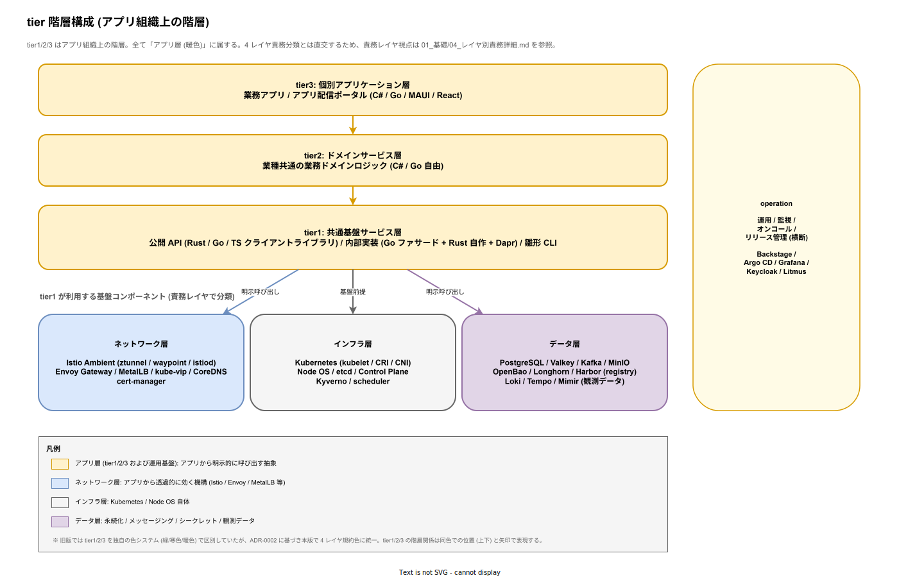

<!-- _class: title -->

# k1s0

## JTC 情報システム部門のための
## マイクロサービス基盤プラットフォーム

<br>

**起案者**: (起案者名)
**起案日**: 2026-04-12
**版**: ドラフト v0.1

---

# エグゼクティブサマリ

- **何を**: JTC 情シスでも導入できる **OSS 積み上げ型マイクロサービス基盤** を内製する
- **なぜ**: 古い単一技術のモノリス集合体が「崩れかけのジェンガ」状態。新技術導入のハードルが高すぎる
- **どう違う**: 商用 IDP / k8s ディストリビューションと違い **無償・オンプレ完結・レガシー共存・言語自由**
- **誰が得する**: 情シス (運用工数削減) / 開発者 (横断的関心事から解放) / 経営 (TCO 削減 + ベンダーロックイン回避) / エンドユーザー (アプリストア感覚で業務システム利用)
- **お願いしたいこと**: MVP フェーズの **承認 + 試行運用環境の確保**

---

# 1. 現状の課題

## 技術的負債のスパイラル

古い技術で作りこむ → 新技術への移行が困難 → 新技術を提案しても「よくわからないからダメ」 → 学習する若手が報われない → 古参が古い技術にしがみつく → さらに新技術への移行が困難に (ループ)

**結果**: 単一技術ごとのモノレポの集合が「崩れかけのジェンガ」に

詳細: [`01_背景と目的/00_背景と課題.md`](./01_背景と目的/00_背景と課題.md)

---

# 1. 現状の課題 (続き)

## 4 つの痛み

| 痛み | 影響 |
|---|---|
| レガシー .NET Framework 資産が動き続けている | 捨てるに捨てられず、新規開発の足を引っ張る |
| 横断的関心事 (認証 / ログ / 監視) のコピペ実装 | 業務ロジックに集中できない |
| 端末への手動アプリインストール | PC リプレース時に情シスが数人月単位で消耗 |
| 商用基盤の高額ライセンス / ベンダーロックイン | 稟議が通らない / 撤退コストが膨大 |

---

# 2. 想定ペルソナ

| 名前 | 立場 | 態度 | 得られる価値 |
|---|---|---|---|
| 田辺 (52) | 守護派ベテラン | **抵抗** | 既存資産を捨てず共存可 |
| 森田 (32) | 新技術志向の中堅 | **強く推進** | 学習が業務成果に直結 |
| 西尾 (48) | 情シス課長 (決裁者) | **中立 (条件付)** | コスト削減 + ロックイン回避 |
| 石田 (38) | 運用リーダー | 中立 | 監視統一 / 夜間対応軽減 |
| 長谷川 (29) | ドメイン開発者 | 推進 | 業務ロジックに集中可 |
| 青木 (41) | 要件定義担当 | 潜在的推進 | リードタイム短縮 |

> 守護者を排除せず、挑戦者を報い、決裁者には数値で説明する **両立構造** が必要

詳細: [`01_背景と目的/01_ペルソナ.md`](./01_背景と目的/01_ペルソナ.md)

---

# 3. k1s0 の提案

> **「OSS 積み上げで、JTC 情シスでも運用できる、レガシーと共存できる、ベンダーに縛られない開発プラットフォーム」**

## 5 つの勝ち筋

1. **無償で始められる** — 稟議のハードルなし
2. **レガシー (.NET Framework) と共存** — 捨てなくていい
3. **オンプレ / VM で完結** — クラウド依存なし
4. **言語を尊重** — tier2 / tier3 は C# / Go / MAUI / React 自由
5. **金銭的メリットで参加を促す** — 移行を強制せず、運用コスト削減を提示

詳細: [`01_背景と目的/02_解決する価値.md`](./01_背景と目的/02_解決する価値.md)

---

# 4. アーキテクチャ概観



**依存ルール**: 上から下への 1 方向。infra への直接依存は **tier1 のみ** に許可

詳細: [`01_アーキテクチャ/`](../02_構想設計/01_アーキテクチャ/)

---

# 5. tier 構成と責務

| tier | 担当チーム | 役割 | 言語 |
|---|---|---|---|
| **infra** | インフラチーム | k8s / メッシュ / 観測基盤 / メッセージング | (OSS) |
| **tier1** | システム基盤チーム | 共通機能 (認証 / ログ / state / pub-sub / workflow / 監査 / 決定) を統一 API として提供 | Go (Daprファサード) + Rust (自作領域) + 各言語クライアントライブラリ |
| **tier2** | ドメイン開発チーム | 業務ドメインロジック | C# / Go 自由 |
| **tier3** | アプリ開発チーム | UI / API / 配信ポータル | C# / Go / MAUI / React |
| **operation** | 運用チーム | 運用手順 / 監視 / オンコール / リリース | (横断) |

詳細: [`01_アーキテクチャ/01_基礎/01_レイヤ構成と責務.md`](../02_構想設計/01_アーキテクチャ/01_基礎/01_レイヤ構成と責務.md)

---

# 6. 技術スタック (主要選定)

| 領域 | 採用 | 理由 |
|---|---|---|
| コンテナオーケストレーション | **Kubernetes** | 業界標準。OSS で代替なし |
| サービスメッシュ | **Istio (Ambient Mesh モード)** | Dapr サイドカーとの二重注入を構造的に回避。ztunnel が L4 (HBONE mTLS) を、waypoint proxy が L7 を担当 |
| API Gateway | **Envoy Gateway** | k8s Gateway API 準拠。Istio と Envoy 統一 |
| メッセージング | **Apache Kafka** (Strimzi) | イベントソーシング前提 |
| 観測性 | **OpenTelemetry + Grafana Tempo + Pyroscope + Loki + Prometheus + Grafana** | ベンダー中立。LGTMP スタック統一 |
| building blocks | **Dapr** (CNCF Graduated) | tier1 内部実装に組込 |
| tier1 内部実装 (Daprファサード) | **Go** | Dapr Go SDK が stable / k8s エコシステムと整合 |
| tier1 内部実装 (自作領域) | **Rust** | メモリ安全 / 長期保守性 / ZEN Engine 統合 |
| 開発者ポータル | **Backstage** (CNCF Incubating) | サービスカタログ / TechDocs / 雛形生成 UI |
| IaC | **OpenTofu** (CNCF Sandbox / MPL 2.0) | VM / ネットワーク / k8s クラスタ構築を宣言化 |
| RDBMS | **CloudNativePG + PostgreSQL** (Apache 2.0) | Keycloak / Backstage / 業務サービスの共有 DB。k8s ネイティブ HA |
| ルールエンジン (BRE) | **ZEN Engine** (Rust 製 / MIT) | 決定表で稟議 / 権限ポリシー / 業務ルールを宣言化 |
| オブジェクトストレージ | **MinIO** (AGPL-3.0) | S3 互換。Harbor / バックアップ / OpenTofu State の統一保存先 |
| Feature Flag | **OpenFeature + flagd** (CNCF Incubating) | 段階的ロールアウト / レガシー共存の制御弁 |
| Chaos Engineering | **Litmus** (CNCF Incubating) | 縮退動作の自動検証。設計を仕様に変える |
| 分散ストレージ | **Longhorn** (CNCF Incubating) | k8s 環境でのブロックストレージ。ノード障害時のデータ保護 |
| 接続プーリング | **PgBouncer** (CloudNativePG Pooler) | PostgreSQL 接続枯渇防止 |
| 依存パッケージ自動更新 | **Renovate** | CVE 48h 対応の自動化。更新 PR 自動生成 |
| イベント駆動自動化 | **Argo Events** (Argoproj / Apache 2.0) | Webhook / Kafka イベントによる運用自動化 |
| シークレット管理 | **OpenBao** (MPL 2.0、Vault の LF fork) | 動的シークレット / 自動ローテーション / Transit 暗号化 / PKI。Dapr Secret Store バックエンド |
| 統合テスト基盤 | **Testcontainers** (Apache 2.0) | テストコード内で実 DB / MQ コンテナを起動・検証・破棄 |

詳細: [`03_技術選定/`](../02_構想設計/03_技術選定/)

---

# 7. tier1 の核心: Dapr 隠蔽

## 課題
- Dapr は強力だが、tier2 / tier3 で直接使うと **Dapr に縛られる**
- バージョン更新 / 破壊的変更 / 将来差し替え時の影響が広範に

## 解決策
**tier1 公開 API (多言語ライブラリ) で Dapr を完全に隠蔽 / 内部は Go ファサードが stable Dapr Go SDK を直接利用**

```csharp
// tier2/tier3 のコード — Dapr を一切意識しない
await k1s0.Log.Info("注文を受領", new { orderId });
await k1s0.State.SaveAsync("orders", orderId, order);
await k1s0.PubSub.PublishAsync("order-events", "created", order);
await k1s0.Audit.RecordAsync("ORDER_CREATED", userId, orderId);
```

→ Dapr のバージョン更新 / 差し替えの影響を **tier1 内に閉じ込められる**

詳細: [`02_tier1設計/01_設計の核/01_Dapr隠蔽方針.md`](../02_構想設計/02_tier1設計/01_設計の核/01_Dapr隠蔽方針.md)

---

# 7. tier1 の核心: バラつきを防ぐ多層防御

> **「機械で遮断できる逸脱はツールで、残余は人のレビューで」**

静的言語 (Go / Rust / C#) の禁止 import は ①〜④ で機械的に検出できるが、動的言語 (TypeScript / Python) の動的ロード・リフレクション経由の Dapr SDK 呼び出しや、Opinionated API の意図に反する「型は合うが設計思想を外した」使い方は CI 単独では検出しきれない。残余は ⑤ の PR レビューで捕捉し、頻出パターンを ⑥ の内製 analyzer に吸い上げる多段構造で、完全自動化ではなく段階的な捕捉率向上を狙う。

| 段 | 施策 |
|---|---|
| ① | **雛形生成 CLI** — ゼロから書かせない |
| ② | **Opinionated API** — やり方を 1 通りに絞る |
| ③ | **CI ガード** — 静的言語の禁止 import を機械検出 (Dapr SDK / Kafka クライアント直接利用 等) |
| ④ | **リファレンス実装** — 模範サービスを 1 本提供 |
| ⑤ | **PR チェックリスト** — 動的言語・設計思想逸脱を人のレビューで補完 |
| ⑥ | **内製 analyzer** — Phase 2 で初版 (0.5 人月想定)、以降は頻出逸脱を吸い上げて成長 |

詳細: [`02_tier1設計/02_API契約/03_API設計原則.md`](../02_構想設計/02_tier1設計/02_API契約/03_API設計原則.md)

---

# 8. アプリ配信ポータル

## 従来の痛み

情シスが各端末を訪問して exe を手動インストール → 台帳手書き / バージョン乖離 / 退職者の権限剥奪が遅延 / PC リプレース時に数人月の工数

## k1s0 のアプローチ

ユーザーがブラウザからアプリ配信ポータルにアクセス → スマホストア風 UI で、自分の権限で使えるものだけ表示 → PWA / MSIX で「インストール」 → 全操作を tier1 監査ログに記録

詳細: [`04_CICDと配信/02_アプリ配信ポータル.md`](../02_構想設計/04_CICDと配信/02_アプリ配信ポータル.md)

---

# 9. 開発者ポータル: Backstage 採用

## 課題
- サービスが増えると「どこに何があるか」が分からなくなる
- 開発者が新規サービスを始める時のセットアップ手順が属人化
- ドキュメントが各リポジトリに散らばり、最新版が分からない

## 解決: Backstage (CNCF Incubating, OSS) を採用

| 機能 | 用途 |
|---|---|
| **Software Catalog** | tier1 / tier2 / tier3 全サービスの一覧 / 依存関係 / オーナー |
| **TechDocs** | サービス README / 設計書を Markdown で集中公開 |
| **Software Templates** | 雛形生成 CLI を Backstage UI から起動して新規サービス作成 |
| **観測プラグイン** | Grafana Tempo / Grafana / Kubernetes / GitHub Actions を統合表示 |

詳細: [`04_CICDと配信/01_開発者ポータル_Backstage.md`](../02_構想設計/04_CICDと配信/01_開発者ポータル_Backstage.md)

---

# 9. 2 つのポータルの棲み分け

| 軸 | アプリ配信ポータル (k1s0 自製) | Backstage (OSS) |
|---|---|---|
| 対象ユーザー | **業務担当 / エンドユーザー** | **開発者 / 運用者 / SRE** |
| 主目的 | 業務アプリの利用開始 | サービスの発見・把握・運用 |
| 表示内容 | 業務アプリ一覧 / 説明 / レビュー | サービスカタログ / 依存関係 / API |
| 端末設定コピー | あり | なし |
| 配置 | tier3 名前空間 | operation 名前空間 |
| 実装責任 | tier3 開発チーム | 運用 + システム基盤チーム |

> **両者は競合しない**。社内では「業務アプリストア」と「開発者ポータル」と呼称して混同を防ぐ

---

# 10. アプリ配信ポータル: 端末設定コピー

## 解決する課題
PC リプレース時、旧端末の **アプリ一覧 + 設定** を新端末へ復元するのに情シスが消耗

## 仕組み
- tier1 公開 API `k1s0.Settings` で各アプリが設定を端末横断で同期
- 新端末ログイン時に **「旧端末からコピー」** を 1 クリックで実行
- コピー元: ① 自分の旧端末 / ② 同僚 (テンプレート化) / ③ 部署標準テンプレート

## コピー可否の設計原則

**権限の引き継ぎではなく利便性の引き継ぎ** — 申請制アプリの権限は新端末で再評価。コピー対象は tier1 `k1s0.Settings` スキーマで **`copyable: true` を明示したフィールドのみ** (デフォルト拒否)。各アプリはリリース前に whitelist を情シスと共同レビューし、変更は PR 審査する。除外対象を明文化:

- **認証値**: パスワード / OAuth トークン / API キー / セッション・デバイストークン
- **個人・端末固有値**: 端末 ID / MAC アドレス / ライセンスキー / 生体認証ハッシュ
- **一時キャッシュ**: 検索履歴の一部 / ワンショット UI 状態

全コピー操作を tier1 監査ログに「誰が・いつ・どのフィールドを・どの端末間で」記録する。詳細設計は Phase 3 着手前に確定。

---

# 11. セキュリティと非機能要件

## セキュリティモデル

| 層 | 対策 |
|---|---|
| 認証 | Keycloak OIDC で全コンポーネントを SSO 統一 |
| 通信暗号化 | Istio Ambient ztunnel HBONE (サービス間 mTLS) + TLS (外部) |
| ネットワーク分離 | k8s NetworkPolicy で tier 間の不正通信を拒否 |
| 認可 | Keycloak RBAC + k8s RBAC + Istio AuthorizationPolicy (L7 は waypoint proxy 経由) |
| サプライチェーン | Trivy スキャン (Phase 1) → Cosign 署名 + Kyverno (Phase 2) |
| 監査 | tier1 `k1s0.Audit` で全操作を記録、改ざん防止 (ハッシュチェーン) |

## 非機能要件 (MVP 暫定目標値)

以下は稟議時点の暫定目標値。tier1 API p99 < 500 ms は **業務ロジック 200 ms + Dapr サイドカー 80 ms + OTel インストルメンテーション 20 ms + ハッシュチェーン監査 50 ms + ネットワーク・DB 150 ms** の机上積算で、実装前の予測値。MVP-1a で Grafana Pyroscope + eBPF により各コンポーネントのオーバーヘッドを分解実測して数値を再確定する。未達時は ① 目標値を市場比較で再設定 / ② ハッシュチェーン監査の非同期化 / ③ 業務 API 別 SLO 設定 を段階的に選択する。可用性 99% と RTO は MVP-1b の復旧演習で検証する。

| 分類 | 暫定目標値 | 再確定タイミング |
|---|---|---|
| tier1 API レイテンシ (p99) | 全 API < 500 ms | MVP-1a eBPF 実測後 |
| 可用性 | 99% (業務時間帯) | MVP-1b パイロット 1Q 運用後 |
| バックアップ RPO | PostgreSQL: 数秒、etcd: 24 時間 | 復旧演習後 |
| バックアップ RTO | PostgreSQL: 15 分、クラスタ全壊: 4 時間 | 復旧演習後 |
| CVE 対応 (Critical) | 48 時間以内 | Renovate 実運用 1Q 後 |

詳細: [`01_アーキテクチャ/03_セキュリティ/01_セキュリティモデル.md`](../02_構想設計/01_アーキテクチャ/03_セキュリティ/01_セキュリティモデル.md) / [`01_アーキテクチャ/04_非機能とデータ/01_非機能要件.md`](../02_構想設計/01_アーキテクチャ/04_非機能とデータ/01_非機能要件.md)

---

# 12. 競合との差別化 (定量)

## 中規模 (3,000 名) 5 年での年額・応答・撤退コスト

以下の数値は中規模 (3,000 名) クラスタ (80 コア / 5 ノード) を前提とする。Severity 1 応答時間は **営業時間帯 (9-18 時) の初回応答到達時間** を基準とする (24/7 オンコール SLA は各社の上位契約でのみ提供される)。稼働率 SLA は **オンプレ運用時の保証有無** を示し、クラウド版限定 SLA は「なし」と表記する。

| 項目 | k1s0 | OpenShift | Tanzu | Humanitec | Mia-Platform |
|---|---|---|---|---|---|
| 年額ライセンス | **0 円** (OSS のみ) | 2,400 万 (80 コア × 2,000 USD × 150 円) | 960 万 (80 CPU × 800 USD × 150 円) | 900 万 (60,000 USD × 150 円、10 ユーザー固定) | 1,440〜2,700 万 (個別見積、2025 年国内実例) |
| 5 年累計ライセンス | **0 円** | 1.20 億 | 4,800 万 | 4,500 万 | 0.72〜1.35 億 |
| Severity 1 応答 (営業時間) | オンコール 30 分 (社内 SRE 体制) | Premium 1 時間 (Red Hat 公式 SLA) | 1 時間 (VMware 公式 SLA) | 4 時間 (Standard プラン、公式 SLA) | 2 時間 (個別契約、典型値) |
| オンプレ稼働率 SLA | 目標のみ (社内 SLO 運用で 99.5% 目標) | **なし** (SLA はマネージド版限定、オンプレは顧客責任) | **なし** (同上) | SaaS 中心 (オンプレ版は個別契約) | 個別契約 (99.5〜99.9%、要別途料金) |
| 3 年目撤退コスト | **0 円** (OSS 資産そのまま保持可) | 3,600〜4,800 万 (設定移行 + 再訓練 + 並行稼働 3 か月) | 2,000〜3,400 万 (TAP 独自仕様の剥離 + 再構築) | 1,500〜2,300 万 (IDP 置換 + 設定再構築) | 2,500〜4,700 万 (独自仕様の剥離、契約残価あり) |

> **示唆**: 商用 IDP はオンプレ運用でも稼働率 SLA 対象外となり、自社運用という条件は同じ。それでいてライセンス + 撤退コストで 5 年最低 6,000 万円、最大 1.68 億円の支出が発生する

## 定性差分

| 軸 | 商用 IDP / k8s 商用 | k1s0 |
|---|---|---|
| 対象ユーザー層 | Web 系テック企業 / 大規模 SaaS | **JTC 情シス部門** |
| レガシー共存 | 通常考慮されない | **第一級で扱う** |
| 実行環境 | クラウドマネージド前提 | **オンプレ / VM 第一級** |
| 言語の自由度 | プラットフォーム指定 | **既存資産の言語を尊重** |
| エンドユーザー配信 | Intune 等の SaaS | **オンプレ完結ポータル** |
| 基盤言語 | Go / TS / Java 中心 | **Rust で長期保守性最優先** |

詳細: [`02_競合と差別化/01_主要製品別評価.md`](./02_競合と差別化/01_主要製品別評価.md) 第 12 章 (年額・SLA・撤退コストの定量根拠)

---

# 13. TCO 実数比較 (中規模 3,000 名, 5 年)

| 項目 | k1s0 | OpenShift | Tanzu | Humanitec |
|---|---|---|---|---|
| 5 年 TCO (全規模) | **3.68 億** | 5.32 億 | 4.60 億 | 4.43 億 |
| k1s0 との差分 | ─ | +1.64 億 | +0.92 億 | +0.75 億 |
| 差分比率 | ─ | k1s0 が **31% 安** | k1s0 が **20% 安** | k1s0 が **17% 安** |

## OSS 無償の罠は成立しない

「OSS は無償でも運用で商用より高くつく」という懸念は、中規模で以下のとおり反証される。

| 項目 | k1s0 年額 | OpenShift 年額 |
|---|---|---|
| 運用人件費 (18.6/15.5 人月 × 115 万) | 2,139 万 | 1,782 万 |
| 学習コスト (5 年均し) | 210 万 | 219 万 |
| ライセンス費 | **0 円** | 2,400 万 |
| Premium サポート差額 | 0 円 | 200 万 |
| **年額合計** | **2,349 万** | **4,601 万** |

詳細: [`04_定量試算/01_TCO5年試算.md`](./04_定量試算/01_TCO5年試算.md) / [`04_定量試算/04_OSS無償の罠を潰す.md`](./04_定量試算/04_OSS無償の罠を潰す.md)

---

# 13.5 ワークフロー 2 基盤の棲み分け

## なぜ 2 つ必要か

k1s0 は Phase 2 で **Dapr Workflow**（Dapr 同梱、tier1 Go ファサード経由）と **Temporal**（別サーバ、tier1 Go ファサード経由）の 2 つのワークフロー基盤を併用する。「なぜ 2 つ要るか」は稟議で必ず刺される。結論は「**短期・簡易フロー用 (Dapr Workflow) と長期・複雑フロー用 (Temporal) で棲み分け、tier2/3 からは同一 `k1s0.Workflow` API で抽象化**」する。

## 棲み分け基準

| 軸 | Dapr Workflow | Temporal |
|---|---|---|
| 想定実行時間 | 秒〜数分 (例: 注文 Saga / 在庫引当) | 数時間〜数週間 (例: 稟議承認 / 個人情報削除 / 新人オンボーディング) |
| 想定ステップ数 | 10 以下 | 数十〜数百 |
| リトライ / タイマー | 単純な指数バックオフ | 複雑なスケジュール・人的承認待ち・SLA タイマー |
| 可視化 / 監査 UI | 最小 (ログ + Tempo Trace) | Temporal Web UI で 1 ワークフローを時系列で可視化 |
| バックエンド | Dapr State Store (Postgres) | Temporal 専用 Postgres |
| オペレータ学習コスト | 低 (Dapr 知識のみ) | 中 (Temporal Server 運用の学習が必要) |

tier2/3 からは `k1s0.Workflow.StartAsync(workflowType, input)` のみを叩く。tier1 Go ファサードが workflowType の属性 (YAML 設定) を見て Dapr Workflow と Temporal に自動振り分けする。振り分け基準の詳細は [`02_tier1設計/04_診断と補償/05_ワークフロー振り分け基準.md`](../02_構想設計/02_tier1設計/04_診断と補償/05_ワークフロー振り分け基準.md) を参照。

## 併用コストの定量根拠と感度分析

「2 基盤併用は運用工数を二重化する」という懸念への回答。2 基盤併用固有工数は **中央値 0.5 人月/年 (≒ 58 万円/年)** で、内訳は振り分け設定保守 0.2 + 障害時切り分け Runbook・演習 0.2 + tier2/3 開発者教育 0.1。

**上振れ感度**: 境界ケース (10 ステップ・数分ちょうど等) の振り分け判断が増え、両基盤間の障害切り分けが頻発する最悪シナリオでは **1.0 人月/年まで倍増する想定** (振り分け +0.2 / 切り分け +0.2 / 教育 +0.1)。それでも全運用工数 20.4 人月への感度は +2.5% で、併用が統合より安いという結論は覆らない。実測で 1.0 人月を超えた段階で統合案の再検討をトリガする監視 KPI を運用側で設定する。

Dapr Workflow 単独では 3 か月の稟議承認フロー・GDPR 30 日猶予の時限実行が表現できず、Temporal 単独では短期 Saga に過剰な学習コストを強いる。詳細は [`04_定量試算/03_運用工数試算.md`](./04_定量試算/03_運用工数試算.md) 第 2.7.1〜2.7.3 節を参照。アプリ配信ポータル + Backstage の 2 ポータル併用も同様に 0.3 人月/年 の固有工数が計上されている (第 2.9.3 節)。

> **要点**: tier2/3 からは 1 つの API に見え、切替時のコードは無修正。Dapr Workflow は Phase 2 初日から、Temporal は Phase 2 後半で段階的導入。併用固有工数の上振れ (WF 1.0 + ポータル 0.3 = 1.3 人月/年) を織り込んでも 20.4 人月の 6% 以内で、統合案のカスタマイズ工数より安い

---

# 14. リスクと対処 (Build vs Buy)

## Build (k1s0 内製) のリスク

| リスク | 対処 |
|---|---|
| 個人開発起点ゆえの属人化 | **ドキュメント充実 + コード公開** でバス係数低減 |
| 開発が頓挫する | MVP スコープ最小化 / 早期に価値提供 |
| 新技術追従の工数 | OSS 採用に絞り、コミュニティ更新に追従するだけ |
| セキュリティ脆弱性対応 | CVE 監視 + tier1 修正体制を事前設計 |

## Buy (商用購入) のリスク (回避できる)

- ライセンス費の予算圧迫 / **構造的なベンダーロックイン** (契約後の解消困難)
- ベンダー都合の値上げ (例: VMware Broadcom 事例)
- 自社要件 (.NET Framework 共存) が製品側で非対応

---

# 15. ロードマップ (フェーズ案)

| フェーズ | 位置付け | 主な成果物 |
|---|---|---|
| **Phase 0** | 事前資料 / 企画承認 (**今ここ**) | 企画書 / 技術選定 / 競合分析 |
| **Phase 1a (MVP-0)** | デモ構成、起案者単独、**VM 1 台** | kubeadm + Dapr + Keycloak SSO + 配信ポータル |
| **Phase 1b (MVP-1)** | パイロット運用、**2 名体制**、VM 3 台 | infra フルスタック + Backstage + Argo CD + OpenTofu |
| **Phase 2** | 機能拡張、2〜3 名の協力体制 | tier1 拡張 + tier2 サンプル + 端末台帳 + Backstage プラグイン |
| **Phase 3** | エンドユーザー体験の拡充 | tier3 サンプル + ネイティブ配信 + 端末設定コピー |
| **Phase 4** | 業務運用フェーズ | 申請ワークフロー / レガシー .NET Framework 共存 |
| **Phase 5** | 全社ロールアウト | 本番展開 / マルチクラスタ |

> **MVP を 2 段階に分割**: MVP-0 で「動くもの」を 2 週間でデモし、協力者を獲得してから MVP-1 に進む。バス係数 1 のリスクを構造的に解消する

詳細: [`03_ロードマップと体制/00_フェーズ計画.md`](./03_ロードマップと体制/00_フェーズ計画.md)

---

# 16. 体制 (想定)

| チーム | 管轄 | 主担当範囲 |
|---|---|---|
| インフラチーム | `infra/` | k8s / Istio / Kafka / Observability |
| システム基盤チーム | `src/tier1/` | tier1 公開 API / Dapr 内部実装 / Go ファサード / Rust 自作領域 / 雛形生成 CLI |
| ドメイン開発チーム | `src/tier2/` | 業務ドメインロジック |
| 個別アプリ開発チーム | `src/tier3/` | 業務アプリ / 配信ポータル |
| 要件定義チーム | (横断) | 業務要件 / 優先度 |
| 運用チーム | `operation/` | 監視 / オンコール / リリース管理 |

> **MVP-0 は起案者単独・VM 1 台で 2 週間。デモ後に協力者を獲得し、MVP-1 は 2 名体制で進める**。Phase 2 以降は 2〜3 名に拡張

詳細: [`03_ロードマップと体制/02_体制と役割.md`](./03_ロードマップと体制/02_体制と役割.md)

---

# 16.5 Rust 人材確保の複線戦略

「Rust 開発者を確保できるか」は稟議で必ず刺される論点。主戦略は**社内 Go 経験者の 6 か月育成**、補完は中途採用と SES の 2 経路。Rust 実務経験者は国内 5,000 名未満と希少 (LAPRAS / Findy / Forkwell の登録数から推定) だが、学習中層は 20,000 名、Go 実務経験者は 50,000 名と育成母集団は厚い。

## 3 経路並走で Phase 2 欠員確率 < 1%

| 経路 | 主担当 | 期待稼働時期 | 歩留まり | 単価 |
|---|---|---|---|---|
| A. 社内 Go 経験者の 6 か月育成 (2 名並行) | 既存社員 | Phase 2 開始時 | 70% | 社員単価 100〜115 万 (TCO に織込済) |
| B. Rust 実務経験者の中途採用 | 新規中途 | Phase 1c〜2 (採用 6〜12 か月) | 30% | 社員単価 120〜150 万 |
| C. SES / 業務委託 (Rust 経験者) | 外部 | 発動後 1〜2 か月 | 95% | 180〜220 万/月 (社員の 1.5〜2 倍) |

経路 A + B + C 並走で Phase 2 で Rust 担当 1 名以上確保できる確率は **> 99%**。2 名欠員の最悪ケースでも SES 2 名 6 か月投入で **追加 780 万円** (TCO 感度分析 +20% の内側) で吸収可能。

詳細な採用タイムライン・フォールバックシナリオ・採用監視 KPI は [`03_ロードマップと体制/02_体制と役割.md`](./03_ロードマップと体制/02_体制と役割.md) 第 9.5〜9.8 節を参照

---

# 17. お願いしたいこと

## 即時 (Phase 0 → Phase 1a: MVP-0 開始)

1. **MVP-0 (デモ構成) の承認**
2. **デモ用 VM 1 台の確保** (4 vCPU / 8 GB / 100 GB SSD) — 既存の開発用 VM でも可。**新規稟議は不要な範囲**

### MVP-0 で実演する内容

起案者が **2 週間以内** に VM 1 台上で「SSO ログイン → 配信ポータル → サンプルアプリ起動」を実演する。オンプレ完結・クラウド依存ゼロを実証する。

## 短期 (MVP-0 デモ後 → Phase 1b: MVP-1 開始)

3. **パイロット運用環境の確保** — VM × 3 台 (推奨: 16 vCPU / 32 GB / 500 GB SSD)
4. **協力者 1 名のアサイン** — 起案者と知識を分散し、**バス係数を 2 にする**
5. **対象パイロット業務の選定** — まず 1 つの小規模業務で実証

> **なぜ 2 段階か**: 20+ コンポーネントを 1 人で構築・運用するリスクを避ける。MVP-0 で「動くもの」を見せて協力者を獲得し、MVP-1 は 2 名体制で進める。詳細は [`03_ロードマップと体制/01_MVPスコープ.md`](./03_ロードマップと体制/01_MVPスコープ.md) を参照

## 中期

6. Phase 2 以降の **協力チームの拡張** (2〜3 名)
7. ライセンス / 知財の整理 (起案者帰属 + 所属企業への無償・非独占・取消不能の社内利用許諾)

---

# 18. 補足: 既存資産との関係

- 既存 .NET Framework アプリは **tier3 の拡張ポイント** として共存
- 共存方式: **サイドカー方式** または **API Gateway 経由**
- 強制移行はしない。**「作り直してでも参加したくなる」金銭的メリット** で誘導
- レガシー所有者には:
  - 運用コスト削減 (監視統一 / 障害対応時間短縮)
  - デプロイ速度向上 (リードタイム短縮)
  - エンドユーザー満足度向上 (アプリ配信ポータル)

---

# 19. 法務・コンプライアンスの即答ブロック

## 稟議で刺される 4 論点に即答

| 論点 | 即答 |
|---|---|
| AGPL OSS の社内利用 | Phase 1a では **AGPL OSS ゼロ**。Phase 1b 以降で採用する 6 本は `infra` 内部のみで動作し、FSF / Grafana Labs 公式 FAQ により義務発動なし |
| 個人情報保護法 / マイナンバー / 電帳法 | k1s0 は業務データを保持しない。必要な技術要件 (監査ログ / 暗号化 / RBAC / ハッシュチェーン) は tier1 公開 API で基盤提供 |
| 知財帰属 | **k1s0 共通基盤資産は起案者帰属**。所属企業には **無償・非独占・取消不能の社内利用許諾** を付与し、運用・改修・委託開発を可能にする。JTC 固有の業務データ / 本番秘密情報 / 個別業務ルールは社内管理 |
| 5 年後の監査応答 | SBOM / CVE / ライセンス判定 / 四半期レポートを CI 自動生成、`infra/compliance-reports` で 5 年保管 |

詳細: [`05_法務サマリ/`](./05_法務サマリ/) / [`../02_構想設計/05_法務とコンプライアンス/`](../02_構想設計/05_法務とコンプライアンス/)

---

# 20. 関連資料

本スライドの詳細は配下ドキュメントを参照。

| 資料 | 内容 |
|---|---|
| [`01_背景と目的/`](./01_背景と目的/) | 課題 / ペルソナ / k1s0 が提供する価値 |
| [`01_アーキテクチャ/`](../02_構想設計/01_アーキテクチャ/) | レイヤ構成 / 依存ルール / 配置形態 / セキュリティモデル / 障害復旧 / 自己監視 / 非機能要件 |
| [`02_tier1設計/`](../02_構想設計/02_tier1設計/) | Dapr 隠蔽 / Go+Rust ハイブリッド / API 設計原則 / API バージョニング |
| [`03_技術選定/`](../02_構想設計/03_技術選定/) | 中核 OSS / 周辺 OSS / ZEN Engine の選定根拠 |
| [`04_CICDと配信/`](../02_構想設計/04_CICDと配信/) | CI/CD パイプライン / テスト戦略 / Backstage / アプリ配信ポータル |
| [`02_競合と差別化/`](./02_競合と差別化/) | 競合マップ / 差別化ポイント / TCO / Build vs Buy |
| [`03_ロードマップと体制/`](./03_ロードマップと体制/) | フェーズ計画 / MVP スコープ / 体制と役割 |
| [`04_定量試算/`](./04_定量試算/) | 5 年 TCO 実数試算 (1,000 / 3,000 / 10,000 名規模) / 開発工数 / 運用工数 |

---

<!-- _class: title -->

# ご審議のほど
# よろしくお願いいたします

<br>

**Q & A**

連絡先: (起案者連絡先)
