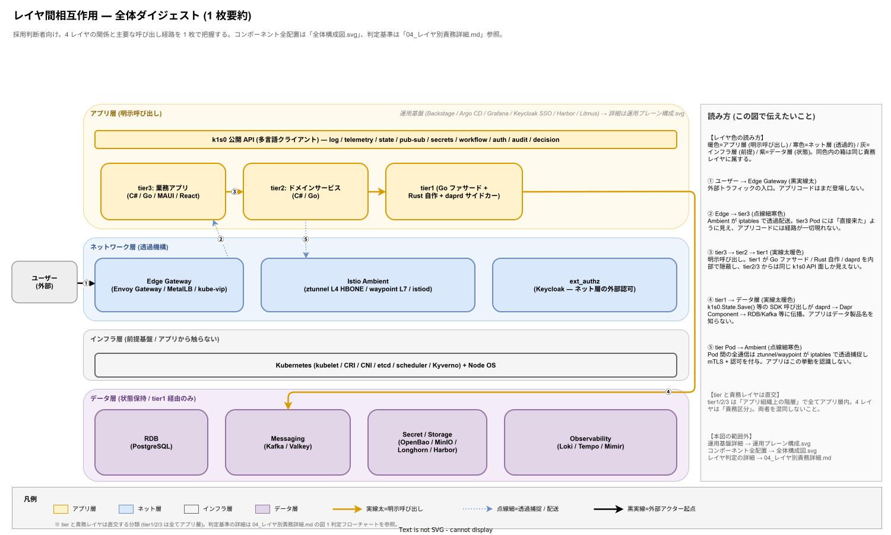

# k1s0 全体構成図 (インフラ + アーキテクチャ)

## 目的

k1s0 が作り出すプラットフォームの全体像を **1 枚の図** で把握できるようにする。本図は責務レイヤ (アプリ層 / ネットワーク層 / インフラ層 / データ層) を 4 つの水平スイムレーンとして配置し、その中に tier1〜tier3 を入れ子で積み上げる構造をとる。運用プレーン (Backstage / Argo CD / Grafana UI / Keycloak SSO / Harbor / Litmus) は別図 (運用プレーン構成.svg) に分離し、本図内ではスタブ表示のみに留める (本図では全レイヤの俯瞰を最優先するため)。

本図はコンポーネント配置に加えて、**Trust Zone 帯・namespace 境界・非同期 Saga フロー・レイヤ横断矢印 (Observability / Secret-Cert / GitOps)・Admission フック順序**を同一シート上に重畳し、「どのコンポーネントがどのレイヤ / テナント境界 / 信頼境界に属し、どの経路で連携するか」を 1 枚で読み切れる設計としている。

本図の記法は [docs/00_format/drawio_layer_convention.md](../00_format/drawio_layer_convention.md) の記法規約に準拠する (ADR-0002)。**色 = レイヤ** の対応が凡例なしでも通じるように設計されており、特に **Dapr サイドカー (アプリ層 / 暖色) と Istio Ambient Mesh (ネットワーク層 / 寒色) の責務レイヤ差が視覚的に自明**となるよう 4 色系で区別している。

詳細な分割図 (レイヤ構成のみ / 依存ルールのみ / 配置形態のみ) は [`01_アーキテクチャ/`](../02_構想設計/01_アーキテクチャ/) に既に存在するため、本資料はそれらを **横断的に俯瞰する 1 枚** として位置付ける。

本資料は読み手の目的に応じて 2 段構えで図を提示する。まず採用判断者が 30 秒で全体像を掴むための **全体ダイジェスト** (レイヤ間の主要相互作用に絞った 1 枚要約) を提示し、その後に全コンポーネントを配置した **全体俯瞰図** を示す。ダイジェストで責務レイヤの構造を先に理解してから、詳細図で個別コンポーネントを照合する流れを意図している。

---

## 全体ダイジェスト (1 枚要約)

本図は採用判断者を主読者とし、**4 レイヤの関係と主要な呼び出し経路 5 本**のみを 1 枚に絞った要約図である。採用検討の場で「なぜアプリ層 (Dapr) とネットワーク層 (Istio Ambient) を両方採用するのか」という典型的な問いに 30 秒で回答できるよう、色で責務レイヤを、線種で呼び出し性質 (明示呼び出し vs 透過機構) を、番号で主要経路を識別できるようにしている。

右側のサイドバーに「読み方」を配置し、各矢印 ①〜⑤ の意味と「tier 階層と責務レイヤは直交する分類である」という要点を短文で示している。コンポーネントの完全な配置は次節の全体俯瞰図で、レイヤ判定の詳細根拠は [`04_レイヤ別責務詳細.md`](../02_構想設計/01_アーキテクチャ/01_基礎/04_レイヤ別責務詳細.md) でそれぞれ扱う。

---

## 全体俯瞰図 (コンポーネント全配置)

---

## 図の読み方

図は **4 つの水平スイムレーン** でクラスタ内部を責務レイヤ別に分離して表現する。レイヤは上から **アプリ層 (暖色) / ネットワーク層 (寒色) / インフラ層 (中性灰) / データ層 (紫)** の順で並ぶ。色と配置の両方でレイヤを判別できるため、「Dapr サイドカー (アプリ層) と Istio Ambient (ネットワーク層) は同じ Pod 近傍に在るが責務レイヤが異なる」という区別が、凡例を読まずとも視覚的に伝わる (ADR-0002 で義務化した図解規約に準拠)。

レーン内の配置は、従来の `tier3 → tier2 → tier1` の 1 方向依存を維持している。tier 積み上げは「アプリ層レーン」の内部で縦方向に展開され、tier1 の最下段から下のレイヤ (ネットワーク層 / インフラ層 / データ層) への呼び出しが、レーン跨ぎの垂直矢印として可視化される。運用プレーン (operation) はアプリ層レーンの右端にスタブとして示し、詳細は別図に分離する (本図は「どのコンポーネントがどのレイヤに属するか」の俯瞰に集中するため)。

### 1. アプリ層レーン (暖色) — tier3 / tier2 / tier1 / Dapr サイドカー

アプリが**明示的に呼び出す**抽象だけがここに入る。tier3 業務アプリ・tier2 ドメインサービス・tier1 共通基盤・各 Pod に自動注入される **daprd サイドカー** はすべてアプリ層に属する。daprd は「アプリが `k1s0.State.Save()` のような SDK を呼び出した結果、HTTP/gRPC 経由で実体が呼ばれる」という明示的な呼び出し関係を持つため、視覚的にもアプリと同系統の暖色で表現する。

tier1 の `k1s0 公開 API` 帯が tier2/tier3 から見える唯一の接点であり、その下の内部実装 (Go / Rust / Dapr サイドカー経由の Components 呼び出し) は完全に隠蔽される。雛形 CLI `k1s0-init` がこの隠蔽を Admission 時に強制する。

tier1 セクションは 1 枚構成の中で最も情報密度の高い領域として、以下の **6 行構造**で内部を開示している。tier2/3 からは Row 1 の公開 API 帯しか見えず、Row 2 〜 6 は「抽象レベルは同じアプリ層だが、tier2/3 には不可視」という論理境界を表現するため、上から下へ段階的に情報を展開する。

1. **Row 1 公開 API (11 API × 実装バッジ × 宛先データ層)** — `k1s0.Log` / `Telemetry` / `State` / `PubSub` / `Secrets` / `Workflow` / `Auth` / `Audit` / `Decision` / `Settings` / `Feature` の 11 API を 4×3 グリッドで列挙する。各 API セルに実装バッジ (`[Go]` = Dapr stable SDK ファサード / `[Rust]` = 自作領域) と宛先データ層 (例: `State → state.valkey → Valkey Cluster (6 shard)` / `Audit → PostgreSQL WORM append-only`) を併記する。採用側組織の固有の監査 / ZEN 決定 / PII マスキングが `[Rust]` 自作である理由は、改ざん防止要件と高安全性要求が外部 SDK では充足しないためである。
2. **Row 2 ミドルウェアスタック (横串 6 層)** — 全公開 API 共通の横串として、① Auth MW (JWT 検証 → `ctx.principal`) / ② Tenant 伝播 MW (`ctx.tenant_id` 伝搬と row-level filter) / ③ OTel Trace MW (W3C `traceparent` 伝搬) / ④ Audit Merkle MW (write 系を PG WORM に append) / ⑤ PII Mask MW (レスポンスから個人情報を除去) / ⑥ Error Map MW (`error_taxonomy.md` 統一エラー) を並べる。リクエストは上から下へ通過し、各層で拡張される。
3. **Row 3 内部 Pod インベントリ (6 Pod)** — `StateFacade` (Go / HPA 3–10 / stateless) / `SecretFacade` (Go / Leader-Elected, active 1 / standby 2) / `AuditWorker` (Rust / StatefulSet / PVC per replica) / `DecisionEngine` (Rust / HPA 2–8 / in-mem ZEN cache) / `PIIMasker` (Rust / HPA 2–6 / sidecar-free) / `TemporalWorker` (Go / 3 replica / Saga 実行専用)。スケール方式と配置制約 (topology spread / pod anti-affinity / taint-toleration) を併記し、「tier1 は単純な 2 Pod 構成ではなく、失敗ドメインとスケール特性の異なる複数コンポーネントで構成される」という事実を可視化する。各 Pod の存在根拠（どの FR を集約するか・どの NFR が運用形態を決めるか・参照 ADR）は構想設計 [`../02_構想設計/02_tier1設計/01_設計の核/03_内部コンポーネント分割.md`](../02_構想設計/02_tier1設計/01_設計の核/03_内部コンポーネント分割.md) で COMP-T1-STATE / COMP-T1-SECRET / COMP-T1-AUDIT / COMP-T1-DECISION / COMP-T1-PII / COMP-T1-WORKFLOW として ID 付与され、双方向トレースは要件定義 [`../03_要件定義/80_トレーサビリティ/03_構想設計マトリクス.md`](../03_要件定義/80_トレーサビリティ/03_構想設計マトリクス.md) の「tier1 内部コンポーネント (COMP-T1-\*)」節と [`../03_要件定義/20_機能要件/10_tier1_API要件/00_tier1_API共通規約.md`](../03_要件定義/20_機能要件/10_tier1_API要件/00_tier1_API共通規約.md) の「公開 API と内部コンポーネントの収容マトリクス」で担保される（採用検討で「なぜ 6 Pod に分けるのか」を問われた場合の説明導線）。
4. **Row 4 内部 gRPC 通信 (protobuf / tier2-3 非公開)** — tier1 内部の Pod 間通信はすべて protobuf gRPC (`k1s0.internal.v1.*`) で行われ、ztunnel mTLS と retry+deadline が標準装備される。代表的な呼び出し経路 (`StateFacade → AuditService.AppendHash` / `TemporalWorker → DecisionService.Evaluate` / `TemporalWorker → StateService.Batch` / `StateFacade → PIIMaskService.Mask`) を 1 本のバーで列挙し、「内部通信も同じアプリ層内だが tier2/3 には公開しない」という境界を視覚化する。
5. **Row 5 内部ストレージ / Dapr Components 発行** — tier1 が所有する専用ストレージ (Temporal PostgreSQL / 監査 Merkle WORM PG / Feature Valkey) と、tier1 が発行・維持する Dapr Components YAML 一式 (`state.valkey` / `pubsub.kafka` / `secret.openbao` / `binding.postgres` / `config.valkey` / `middleware.oauth2`) を並置する。tier2/3 は Component YAML を書かず、雛形 CLI が自動注入する annotation のみで daprd と接続する。
6. **Row 6 失敗ドメイン境界 + CI / Admission ガード** — Pod 群を Stateful ドメイン (SecretFacade / AuditWorker / TemporalWorker — PVC / Leader / 順序保証・再起動順序が必須) と Stateless ドメイン (StateFacade / DecisionEngine / PIIMasker — HPA / 任意スケール・即 reschedule) の 2 つに破線で分割し、運用方針の違いを明示する。さらに tier1 が発行する 3 種のガード機構 — 雛形 CLI `k1s0-init` / CI 禁止 import リンタ (`dapr.io/sdk/*` 直接 import を検出して PR fail) / `k1s0-admission-validator` (Kyverno ValidatingPolicy で daprd 以外のサイドカー・`hostNetwork`・非承認 image registry を block) — を帯で示し、「tier2/3 が tier1 隠蔽を破れないことは機械的に強制される」という事実を図の中に埋め込む。

運用プレーン (Backstage / Argo CD / Renovate / GHA / Keycloak SSO / Harbor UI / Grafana UI / Litmus) は責務上アプリ層だが、本図ではスタブ表示に留めて別図 (運用プレーン構成.svg) に分離した。運用プレーンを本図に詳細展開すると「アプリから明示的に呼ぶ / 自動同期で動く / 人間が UI で操作する」の 3 種の性質が同じ暖色で並び、本図の主目的である「4 レイヤの責務区別」の視覚的明瞭さを損なうためである。Keycloak / Harbor / Grafana はネットワーク層 (ext_authz) やデータ層 (イメージ / メトリクス永続化) にも責務を持つため、それらの文脈では該当レーンにも再出現する (同一コンポーネント名で複数レーンに現れることは規約で明示的に許容)。

### 2. ネットワーク層レーン (寒色) — Edge + Istio Ambient Mesh + 認可・証明書管理

アプリから**透過的に効く**ネットワーク機構がここに入る。Edge 側には社内 DNS / MetalLB / Envoy Gateway / ext_authz → Keycloak / cert-manager が並び、外部からの HTTPS トラフィックを受けて TLS 終端・OIDC 認可・TLS 証明書の自動発行を透過的に処理する。

クラスタ内部では **Istio Ambient Mesh** が L4/L7 を担う。L4 は Node 単位に配置される **ztunnel DaemonSet** が HBONE (`:15008`) で mTLS を提供し、アプリが意識しないうちに Pod 間トラフィックを iptables/eBPF で捕捉して暗号化する。L7 処理 (AuthorizationPolicy / リトライ / 負荷分散) が必要な namespace にだけ **waypoint proxy** を namespace/service 単位で配置する。Dapr Control Plane (`dapr-operator` / `dapr-sentry` / `dapr-placement` / `dapr-sidecar-injector`) もこのレーンに同居する (daprd サイドカー本体はアプリ層 Pod 内に在る)。

**ADR-0001 で採択した Ambient Mesh は、従来の Istio Sidecar モードが Dapr サイドカーと Pod 内で二重注入になる構造的衝突を、サイドカー不注入で根本回避する。** 図上で Dapr (アプリ層・暖色) と Istio (ネットワーク層・寒色) が異なる色とレーンに配置されるのは、この決定の視覚的表現でもある。

### 3. インフラ層レーン (中性灰) — Kubernetes / Node 実行基盤

Kubernetes 自身の機構がここに入る。**Kyverno** は Admission で Pod のセキュリティ基準 (`PSS Restricted` / `dapr.io/app-id` 必須 / Harbor 以外の image pull 拒否) を強制する。**CNI** (Cilium or Calico) は Pod ネットワーク 10.244.0.0/16 と NetworkPolicy を担い、その上で Ambient ztunnel が透過捕捉を重ねる二層構造になっている。**kube-scheduler** / **kubelet** / **containerd** / **etcd** が Control Plane と Worker ノードに分散配置される。

インフラ層は「業務ロジックからは意識されないが、すべてのレイヤが立脚する基盤」である。物理配置 (Control Plane x3 + Worker x3 + Storage x3) の詳細は下段「物理ノード構成」に別図として展開している。

### 4. データ層レーン (紫) — 状態保持コンポーネント

業務データの保持を担うコンポーネントを集約する。**CloudNativePG + PostgreSQL 17** が 1 Primary + 2 Replica の同期レプリケーション構成で主要データベース (顧客 / 注文 / 在庫 / 監査) を保持する。**Valkey** が Dapr state store とセッションキャッシュ、**Kafka** (Strimzi Operator 管理の 3-broker) が Saga イベントとメッセージング、**MinIO** が S3 互換オブジェクトストア、**OpenBao** が動的シークレット・PKI・Transit 暗号化、**Harbor** がコンテナレジストリ、**Longhorn** が上記すべての PV の分散ブロックストレージ基盤を担う。

データ層への直接アクセスは **tier1 ファサード経由のみ**許可されており、tier2/tier3 は `k1s0.State.Save()` / `k1s0.PubSub.Publish()` / `k1s0.Secrets.Get()` 等の API のみを使用する。この制約は雛形 CLI と CI ガードで機械的に強制される。

### 5. 同期サンプルフローと物理配置

レーン構造の下段に「注文確定」の同期サンプルフローを 8 ステップで横並びに展開し、各ステップがどのレイヤを通過するかを**ステップごとに色分け**して示している (橙○番号はレイヤ構造を邪魔しないよう淡色で配置し、参照用の副情報として機能させる)。フローの 8 ステップがアプリ層・ネットワーク層・データ層をどのように通過するかが、本図の主目的であるレイヤ構造の視認を阻害しない範囲で追跡できる。

さらに下段の「物理ノード構成」は、k8s の論理レイヤとは直交する**物理 VM への同居配置**を示す。例えば Worker ノードには `[インフラ] kubelet` `[ネットワーク] ztunnel` `[アプリ] daprd サイドカーと tier1/2/3 Pod` が同居するが、これらは責務レイヤとしては別物であり、本図の上段レーン構造で識別する。

### 6. 非同期サンプルフロー (OrderSaga / Kafka)

同期フローの直下に、OrderSaga の**非同期経路**を紫破線で追加している。tier1 Temporal Worker が `k1s0.PubSub.Publish()` で `order.created` topic に発行した後、在庫 / 与信 / 決済 / 通知の 4 subscriber が並列に起動し、各々の完了 signal を Temporal Workflow が集約する。成功 path (緑) と失敗 path (赤 / 補償トランザクション) を分岐として示し、Saga の成功/失敗両経路が 1 枚で追跡できる。非同期イベントは紫破線、成功/失敗の分岐は緑/赤の色で、同期フロー (橙実線) と線種で区別できる。

### 7. レイヤ横断の可視化矢印 (Observability / Secret & Cert / GitOps)

レイヤ境界をまたぐ**横断経路**を 3 種類の線で重畳している。**青点線**は OTel Collector DaemonSet (インフラ層に新設表示) を経由した計装データの収集経路を示し、アプリ + daprd + Node exporter のメトリクス / ログ / トレース / プロファイルがデータ層 LGTM+P ストアに集約される流れを可視化する。**灰点線**は OpenBao (データ層) と cert-manager (ネットワーク層) を起点とするシークレット・証明書配布経路で、Dapr secret store Component への供給と Certificate CR の更新を一枚で示す。**緑破線**は Argo CD の GitOps sync 経路である。これらは既存の矢印 (橙同期フロー / 紫非同期) と線種・色で明確に区別される。

### 8. Trust Zone と namespace 境界

クラスタ枠の上部に **Trust Zone バー** を水平帯として配置し、Untrusted (社外 / 端末) / DMZ (Edge Gateway / VIP / cert-manager) / Internal (Pod network / Service Mesh / Control Plane) / Data (永続ストア / Secret / Registry) の 4 層境界を色付きの帯で一覧表示する。この帯は Kyverno NetworkPolicy と Istio AuthorizationPolicy による Deny-by-default を前提とし、Data Zone への tier2/3 直接アクセスが tier1 ファサード経由に矯正される前提を明示する。

さらに主要 namespace (`istio-system` / `dapr-system` / `cnpg-system`) を**破線の四角形**で囲って明示した。Istio と Dapr は同じレーン内で責務が異なるため、namespace 単位のまとまりを視覚的に区別することで、「どの Pod がどの管理境界に属するか」が色・レーン・破線枠の 3 軸で判別できるようにしている。

### 9. Admission フック順序

図の最下部に **Pod 作成時の admission シーケンス** を 8 ステップで配置する。GitOps 起点 (git push → Argo CD sync) から始まり、kube-apiserver → Kyverno Mutating → Dapr sidecar-injector → Kyverno Validating → etcd 永続化 + scheduler → kubelet + containerd → Pod Running (daprd + ztunnel 透過捕捉) までを一列で追う。**Istio Ambient (ztunnel) は Pod 内サイドカー注入を行わないため、この admission chain には現れない** — これが Ambient 採用 (ADR-0001) の重要な帰結であり、Dapr との二重注入問題の根本回避策であることが 1 枚の図で読み取れる。Dapr 注入ステップ (④) と Pod Running ステップ (⑧) のみ暖色で、他のインフラ層ステップと視覚的に区別している。

---

## テナント分離とデータレジデンシー (構想設計への導線)

本図は「どの OSS がどの位置に配置されるか」を 1 枚で示すことに集中する。同居運用・グループ企業展開・海外展開で必ず問われる **テナント分離の 4 層構造** と **リージョン戦略** は、構想設計層で独立章として扱う。本節は採用検討の場での論点即引き用の導線として 2 文ずつ要約する。

- **テナント分離**: 名前空間 / ネットワーク / 認可 / データの 4 層すべてで同時に分離を担保する多層防御。運用中の越境は Kyverno・Istio AuthorizationPolicy・`k1s0.Audit` の必須検証・Litmus Chaos で機械的に検知する。詳細は [`02_構想設計/01_アーキテクチャ/03_セキュリティ/03_マルチテナント分離.md`](../02_構想設計/01_アーキテクチャ/03_セキュリティ/03_マルチテナント分離.md)。
- **リージョンとデータレジデンシー**: 単一クラスタ・AZ 分離・マルチクラスタ・マルチリージョンの構成パターンを採用側の規模要件に応じて選択する。個人情報は `pii-jp/` バケット固定、監査ログは `audit-jp/` WORM + 5 年保管で国外書込みを Kyverno で拒否する。詳細は [`02_構想設計/01_アーキテクチャ/02_可用性と信頼性/07_リージョン戦略とデータレジデンシー.md`](../02_構想設計/01_アーキテクチャ/02_可用性と信頼性/07_リージョン戦略とデータレジデンシー.md)。

---

## 設計信念との対応

> **tier1 は tier2 を楽にするために、tier2 は tier3 を楽にするために存在する。そうすることで開発効率が向上する。**

この信念は本図にも色濃く現れている。

| 層 | 想定開発者レベル | 図上の表現 |
|---|---|---|
| `tier1` | アーキテクト級 | 公開 API / Dapr CP / Go / Rust / 雛形 CLI が並ぶ最も情報密度の高い帯 |
| `tier2` | ドメイン上級 | サービス Pod と仕様定義の 2 ブロックのみ。ドメインに集中できる |
| `tier3` | 初級〜中級 | 業務アプリ / 配信ポータル / レガシーラップの 3 ブロックのみ。Dapr / OSS を一切意識しない |

下位 tier ほど複雑性を引き受け、上位 tier ほど参入コストが下がる。これは偶然ではなく設計上の意図であり、組織全体の開発スループットを最大化するための構造である。

---

## 関連ドキュメント

- [`01_アーキテクチャ/01_基礎/00_概念アーキテクチャ.md`](../02_構想設計/01_アーキテクチャ/01_基礎/00_概念アーキテクチャ.md) — 全体俯瞰 (本図の元になった概念図)
- [`01_アーキテクチャ/01_基礎/01_レイヤ構成と責務.md`](../02_構想設計/01_アーキテクチャ/01_基礎/01_レイヤ構成と責務.md) — 各レイヤの責務と管轄チーム
- [`01_アーキテクチャ/01_基礎/02_依存ルールと通信経路.md`](../02_構想設計/01_アーキテクチャ/01_基礎/02_依存ルールと通信経路.md) — 1 方向依存の制約と通信フロー
- [`01_アーキテクチャ/01_基礎/03_配置形態.md`](../02_構想設計/01_アーキテクチャ/01_基礎/03_配置形態.md) — namespace 配置とネットワーク境界
- [`01_アーキテクチャ/04_非機能とデータ/02_データアーキテクチャ.md`](../02_構想設計/01_アーキテクチャ/04_非機能とデータ/02_データアーキテクチャ.md) — データストア構成とオーナーシップ
- [`02_tier1設計/`](../02_構想設計/02_tier1設計/) — tier1 内部の Dapr 隠蔽 / Go+Rust ハイブリッド設計
- [`03_技術選定/`](../02_構想設計/03_技術選定/) — 採用 OSS と選定根拠
- [`01_アーキテクチャ/02_可用性と信頼性/04_マルチクラスタ戦略.md`](../02_構想設計/01_アーキテクチャ/02_可用性と信頼性/04_マルチクラスタ戦略.md) — マルチクラスタ構成
- [`01_アーキテクチャ/02_可用性と信頼性/07_リージョン戦略とデータレジデンシー.md`](../02_構想設計/01_アーキテクチャ/02_可用性と信頼性/07_リージョン戦略とデータレジデンシー.md) — リージョン拡張 / データ所在地 / GDPR 対応
- [`01_アーキテクチャ/03_セキュリティ/03_マルチテナント分離.md`](../02_構想設計/01_アーキテクチャ/03_セキュリティ/03_マルチテナント分離.md) — 4 層分離モデル / 越境検知 / グループ企業展開
- [`20_品質特性/05_tenant_isolation/`](../03_要件定義/30_非機能要件/) — マルチテナント分離の要件定義（namespace / データ / ネットワーク / 受入基準）
- [`30_セキュリティ_データ/07_data_residency/`](../03_要件定義/30_非機能要件/) — データレジデンシー要件（所在地要件 / 越境移転要件）
