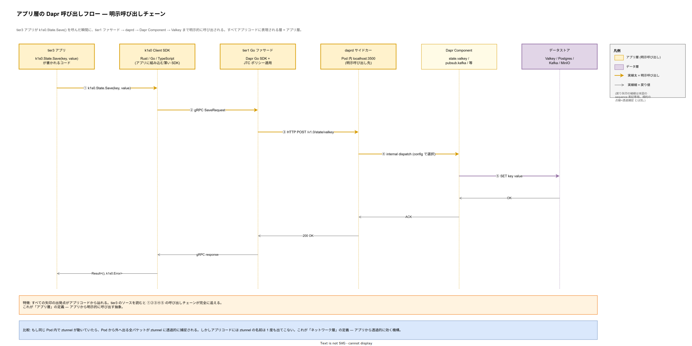
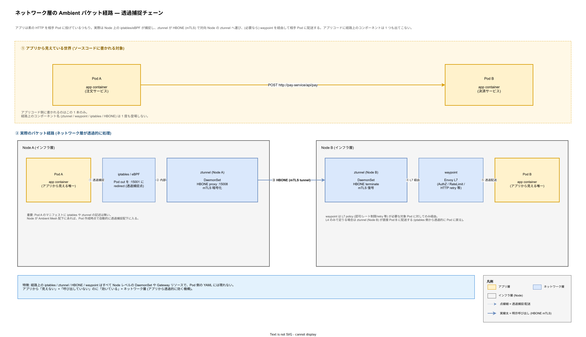
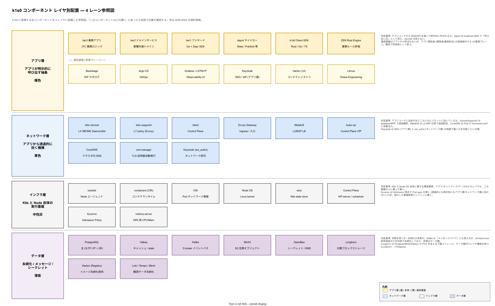

# レイヤ別責務詳細 ― 4 レイヤ分類と境界の読み解き

## 目的

本章は、k1s0 のコンポーネントを **アプリ層 / ネットワーク層 / インフラ層 / データ層** の 4 レイヤに分類したうえで、それぞれの境界を読み手が誤認しないための詳細図解を提供する。

[`01_レイヤ構成と責務.md`](./01_レイヤ構成と責務.md) は **tier1 / tier2 / tier3** という「アプリ組織上の階層」を扱う。対してこちらは「責務レイヤ」を扱う。両者は直交する分類であり、例えば tier1 ファサードと daprd サイドカーはどちらも**アプリ層**に属する一方、ztunnel はアプリ層ではなく**ネットワーク層**に属する。

本分類は [ADR-0002](../../adr/ADR-0002-diagram-layer-convention.md) で採択され、drawio 全図の表記規約 ([`docs/00_format/drawio_layer_convention.md`](../../../00_format/drawio_layer_convention.md)) として運用される。

---

## なぜこの分類が必要か

ADR-0001 (Istio Ambient Mesh 採用) の議論中、初期版の全体構成図では Dapr サイドカーと Istio サイドカーを「Pod 内の青/赤箱」として同列に描画していた。読み手 (起票者自身を含む) はこの視覚的同一性から「両者は同じ責務を持つコンポーネント」と誤解し、「どちらを優先するのか」という本来成立しないはずの問いが発生した。

実際には両者は責務レイヤが明確に異なる。

- **Dapr (daprd サイドカー)** = アプリ層。アプリが `k1s0.State.Save()` のような SDK 呼び出しで**明示的に呼び出す**抽象。呼び出し対象がソースコードに書かれる。
- **Istio (Envoy / ztunnel)** = ネットワーク層。iptables / eBPF を介してアプリに**透過的に効く**機構。アプリコードには名前が 1 度も登場しない。

この差異は採用検討資料の根幹 (「なぜ両方必要なのか」) を判断する一次情報である。視覚言語の混乱は事業判断の誤りに直結する。

---

## 図 1: 境界の見分け方

「このコンポーネントはどの層か?」に答えるための判定ツールを 1 枚にまとめた図。Q&A テーブル・シナリオ・判定フローチャートの 3 視点で境界を示す。

### 読み方

上段の Q&A テーブルは「ソースコード呼び出しの有無」「止めたら何が壊れるか」「誰が操作するか」の 6 軸で Dapr と Istio を対比する。1 軸 1 行を読むだけで境界の本質がわかる。

中段の「注文確定フロー」は、1 つの業務操作 (POST /checkout) が走るとき Dapr と Istio がそれぞれ何を担当するかを 4 ステップで並置した。アプリコード側は Dapr のみを呼んでおり、Istio の名前は登場しない。

下段の判定フローチャートは「アプリコードに直接書かれているか? → Yes なら アプリ層」「Pod 間通信品質に効くか? → Yes なら ネットワーク層」「状態を持つか? → Yes なら データ層 / No なら インフラ層」の 3 問を順に答えて分類に至る。迷ったらこのフローを辿る。

---

## 図 2: アプリ層の Dapr 呼び出しフロー

アプリ層の本質は「アプリから明示的に呼び出す」である。tier3 アプリが `k1s0.State.Save()` を呼んだ瞬間に、k1s0 SDK → tier1 Go ファサード → daprd → Dapr Component → Valkey まで一直線に呼び出しが伝播する様を sequence 図で示す。

### 読み方

矢印 ①〜⑤ はすべて明示的な呼び出しであり、tier3 のソースを読むだけで完全に追跡できる。呼び出し先は暖色 (アプリ層) で塗られ、最後の Valkey のみ紫 (データ層) で塗られる。戻り矢印は細実線で表現する (本図は sequence 図なので、規約上の「点線細=透過捕捉」とは別の記法を使っている点に注意)。

この図の重要な含意は、**アプリ層には「隠れたコンポーネント」が存在しない**ことである。daprd は Pod 内に同居するが、アプリから見ると `localhost:3500` という呼び出し先アドレスであり、他のネットワーク通信と変わらない。

---

## 図 3: ネットワーク層の Ambient パケット経路

ネットワーク層の本質は「アプリから透過的に効く」である。上段は「アプリから見えている世界」(1 本の HTTP 呼び出し)、下段は「実際のパケット経路」(iptables → ztunnel → HBONE → ztunnel → waypoint → Pod B の 5 ホップ) を並置した。

### 読み方

上段と下段を見比べると「アプリは 1 本の矢印を書いているが、実際は 5 ホップ経由している」ことがわかる。アプリ Pod (暖色) は上下で同じだが、下段の中間に並ぶ iptables / ztunnel / waypoint はすべて寒色 (ネットワーク層) で塗られ、アプリコードに名前が登場しない。

点線細矢印 (①⑤) は「透過捕捉・透過配送」を示す。規約上、この線種は「アプリが呼んでいるのではなく、Node レベルの機構が経路を奪い取っている」ことを明示するために予約されている。実線太矢印 (③) は HBONE の mTLS トンネルで、これは ztunnel 同士が互いを明示的に呼び合う唯一の経路である。

waypoint は L7 policy (認可 / レート制限 / HTTP retry 等) が設定された対象 Pod に対してのみ経由する。L4 レベルだけで足りる通信では ztunnel が直接相手 Pod に配送する。

---

## 図 4: レイヤ別構成図 (コンポーネント参照)

k1s0 に登場する全コンポーネントを 4 レイヤに配置した参照図。「このコンポーネントはどの層か?」と迷ったら本図で位置を確認する。

### 読み方

各レーンの左端にレイヤ名・定義・色コード、中央にコンポーネント badge、右端に判定基準 (「なぜここに分類したか」) が配置される。アプリ層レーンは 2 行構成で、1 行目が本体 (tier3 / tier2 / tier1 / daprd / k1s0 SDK / ZEN)、2 行目が運用基盤 (Backstage / Argo CD / Grafana / Keycloak / Harbor UI / Litmus) を示す。運用基盤は薄暖色で本体と区別される。

**Keycloak の扱いに注意**。SSO 機能 (アプリ層) と ext_authz 統合 (ネットワーク層) の両面で働くため、本図ではアプリ層本体とネットワーク層の両方に登場する。複数レイヤにまたがる責務を持つコンポーネントは、各レイヤで別個に描くのが規約の方針である (ADR-0002 参照)。

**Kafka の扱いに注意**。表面的には「メッセージパイプ」でネットワーク層に見えがちだが、at-least-once 配信保証のため内部で永続化しており、本質はデータ層に属する。Kafka broker を止めると過去のメッセージが消えるか否か (= 状態を持つか) が判定の決め手となる。

---

## 4 レイヤと tier 階層の対応

既存の tier1 / tier2 / tier3 階層は「アプリ組織上の責務区分」であり、本章で扱う 4 レイヤとは直交する分類である。対応関係を整理すると以下になる。

- **tier3 業務アプリ / tier2 ドメインサービス / tier1 ファサード**: すべてアプリ層
- **daprd サイドカー**: アプリ層 (tier1 ファサードが呼び出す先)
- **k1s0 Client SDK**: アプリ層 (tier2 / tier3 に組み込まれる)
- **Istio Ambient / Envoy Gateway / MetalLB / CoreDNS**: ネットワーク層 (どの tier からも明示的に呼ばれない)
- **PostgreSQL / Valkey / Kafka / MinIO / OpenBao / Longhorn**: データ層 (tier1 ファサード経由でのみアクセスされる)
- **Kubernetes Control Plane / kubelet / CNI / etcd / Node OS / Kyverno**: インフラ層 (tier から触らない基盤)

したがって、tier の議論 (`01_レイヤ構成と責務.md`) では「アプリ側の責務をどう分割するか」を扱い、本章では「k1s0 全体を責務レイヤで俯瞰するときの視覚言語」を扱う。両者は補完関係にある。

---

## 参考資料

- [ADR-0002 図解レイヤ記法規約](../../adr/ADR-0002-diagram-layer-convention.md)
- [drawio レイヤ記法規約](../../../00_format/drawio_layer_convention.md)
- [01_レイヤ構成と責務.md](./01_レイヤ構成と責務.md) — tier1/2/3 アプリ階層
- [`02_依存ルールと通信経路.md`](./02_依存ルールと通信経路.md) — tier 間の依存と通信
- 企画書 全体構成図: [`docs/01_企画/全体構成図.md`](../../../01_企画/全体構成図.md) — 4 レーン swim lane の全体俯瞰
