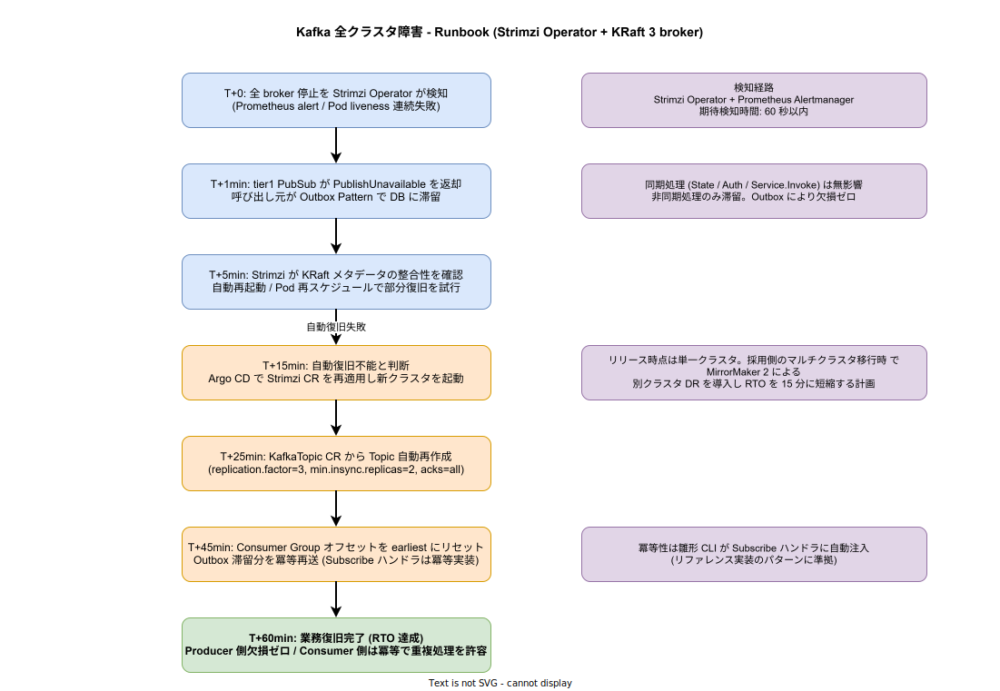

# Kafka クラスタ全壊シナリオ

## 想定する事象

3 broker KRaft 構成の Kafka クラスタが、ノード障害・ストレージ破損・Operator のバグ等により短時間で全停止する。Strimzi Operator の自動再起動でも復旧不能で、broker メタデータが整合性を失った状態を本章の対象とする。1 broker 障害は Strimzi の `replication.factor=3` で自動的に縮退運転に入るため、本章の対象外である ([`../../02_可用性と信頼性/01_障害復旧とバックアップ.md`](../../02_可用性と信頼性/01_障害復旧とバックアップ.md) 4.1 参照)。

この事象が採用検討で繰り返し問われる理由は、k1s0 が **イベントソーシング前提のアーキテクチャ** を採用しているからである。Saga パターンによる長期トランザクションも、tier2 サービス間の非同期連携も、`k1s0.PubSub` API の裏側で全て Kafka に依存する。Kafka が完全に倒れた瞬間に「全イベントが失われ、Saga が中断し、復旧後に手動の整合性回復作業が必要」となるなら、採用検討は通らない。本章はそうではないことを示す。

## 業務影響の範囲

Kafka クラスタが完全停止しても、**同期処理は無影響** である。これは k1s0 の意図的な設計判断による。具体的には以下が独立して動く。

- `k1s0.State.*` (Valkey 直結、Kafka 非経由)
- `k1s0.Auth.*` (Keycloak + JWKS キャッシュ、Kafka 非経由)
- `k1s0.Service.Invoke` (Istio mTLS による同期 RPC、Kafka 非経由)
- `k1s0.Settings.*` / `k1s0.Secrets.*` / `k1s0.Decision.*` / `k1s0.Audit.*` (それぞれ独立データストア)

影響を受けるのは `k1s0.PubSub.Publish` / `k1s0.PubSub.Subscribe` と、それに依存する `k1s0.Workflow.*` (Temporal 経由の Saga 実行) のみである。Saga が走らないということは長期トランザクションが進まないが、Temporal Server は PostgreSQL に状態を永続化しているため、**Kafka 復旧後にリプレイ機構で中断箇所から自動再開** できる。

## フェイルセーフ機構

### Outbox Pattern による Producer 側欠損ゼロ

`k1s0.PubSub.Publish` が `K1s0PubSubUnavailableException` を返した時点で、呼び出し元のクライアントライブラリは「同一トランザクション内の DB レコードに `outbox` テーブルへ event を書き込む」パターンを取る。これは `08_グレースフルデグラデーション.md` 2.3 の「呼び出し元の責務 (B) ローカルキューに退避して後でリトライ」を制度化したものである。

雛形 CLI が tier2 / tier3 のサービススケルトンを生成する際に、Outbox テーブル定義 (PostgreSQL の `outbox(id, event_type, payload, created_at, sent_at)` ) と、定期的に未送信レコードを Kafka に再送するワーカーを自動で含める。採用後の運用拡大時 で [Debezium](../../../03_技術選定/03_周辺OSS/02_周辺OSS.md) の Outbox Event Router パターンの導入を検討するが、リリース時点では「アプリ内ワーカーで定期的に sent_at NULL のレコードを再送」する単純実装で十分である。

これにより、**Kafka 全停止中も Producer 側のイベント欠損はゼロ** になる。滞留容量は `outbox` テーブルのディスク容量に依存し、CloudNativePG の PV (Longhorn 3 ノードレプリケーション) が許す限り溜め続けられる。リリース時点構成 (PV 100GB / サービス) では、平均 1KB のイベントを 1 億件保持できる計算になり、60 分の RTO に対して 1000 倍以上の余裕がある。

### Consumer 側の冪等性強制

Kafka 復旧後に Consumer が Outbox 滞留分を読み戻した際、ネットワーク再送等で **同じイベントが複数回配信される可能性** がある。これは Kafka 自体の at-least-once 保証によるものであり、k1s0 固有の制約ではない。

雛形 CLI が Subscribe ハンドラを生成する際に、以下のボイラープレートを自動で含める。

- `event_id` (UUID v4) を payload に必須化
- ハンドラ実行前に `processed_events` テーブルで `event_id` 既処理チェック
- 処理完了後に `processed_events` に同一トランザクションで挿入

このパターンを「リファレンス実装」として `02_tier1設計/03_開発者体験/14_tier3開発者体験設計.md` に明記し、tier2/tier3 開発者が PR 提出時に CI でチェックされる。冪等性を実装しなければ CI を通過できない仕組みである。

### Strimzi Operator による自動復旧の限界

Strimzi Operator は単一 broker 障害に対して自動再起動・自動再スケジュールで復旧する。しかし全 broker 同時障害かつ KRaft メタデータ破損のケースでは、Operator は「整合性チェック → 再起動 → 整合性チェック失敗 → 諦め」を 3 回繰り返した後にエラーアラートを上げる。この時点でオペレーターが介入し、新クラスタ起動の判断を下す必要がある。

「自動復旧の限界をどこに引くか」は Operator の `spec.kafka.config.controller.quorum.election.timeout.ms` 等で調整可能だが、リリース時点ではデフォルト設定を維持し、採用後の運用拡大時に Litmus 試験結果に基づきチューニングする。

## 復旧 Runbook

復旧手順は以下のとおり。図中の各ステップに対応する。

1. **T+0 検知**: Strimzi Operator が `KafkaConnectionLost` メトリクスを Prometheus に発行。Alertmanager が Critical アラートをオンコールに通知 (期待検知時間 60 秒以内)
2. **T+1min 縮退発動**: tier1 PubSub サービスが `PublishUnavailable` を返却し、呼び出し元のクライアントライブラリが Outbox に切り替わる。同時に `k1s0_api_unavailable{api="PubSub"} == 1` がメトリクスに反映される
3. **T+5min Operator 自動復旧試行**: Strimzi Operator が KRaft メタデータの整合性を確認し、Pod 再起動を試行する。この時点で復旧する場合は RTO 5 分で完了
4. **T+15min 手動介入決定**: 自動復旧不能と判断したオペレーターが、Argo CD で Strimzi `Kafka` CR を再適用し、新クラスタを起動する。CR は Git 管理されているため、`kubectl delete kafka.kafka.strimzi.io/k1s0-cluster && kubectl apply -f kafka-cluster.yaml` 相当を Argo CD が実行する
5. **T+25min Topic 自動再作成**: `KafkaTopic` CR (Git 管理) から全 Topic が自動再作成される。`replication.factor=3, min.insync.replicas=2, acks=all` 設定が再適用される
6. **T+45min Consumer リセット**: Consumer Group のオフセットを `earliest` にリセットする (`kafka-consumer-groups.sh --reset-offsets --to-earliest`)。Outbox 滞留分が冪等再送される。Subscribe ハンドラの冪等性により、復旧前に処理済みのイベントは無視される
7. **T+60min 復旧完了**: Producer 側欠損ゼロ、Consumer 側は冪等で重複処理を許容した状態で業務復旧完了

各ステップの正確なコマンドと kubectl 出力例は リリース時点 完了時に TechDocs として整備し、起案者以外でも実行できるようにする。

## RTO / RPO の根拠

| 指標 | 値 | 根拠 |
|---|---|---|
| **RTO** | 60 分 | Strimzi の自動復旧失敗判定 (5 分) + 手動介入による CR 再適用 (15 分) + Topic 再作成 (10 分) + Consumer リセット (20 分) + 動作確認 (10 分) の積算。採用側のマルチクラスタ移行時 で MirrorMaker 2 による別クラスタフェイルオーバー導入で 15 分に短縮予定 |
| **RPO (Producer 側)** | 0 (欠損ゼロ) | Outbox Pattern により、Kafka 障害中も DB トランザクション内でイベントが永続化される。Outbox テーブル容量が枯渇するまで欠損なし |
| **RPO (Consumer 側)** | 数秒 (Kafka 内部レプリケーション遅延分) | Strimzi の `replication.factor=3` により、broker 1 台障害時は他 broker のレプリカから無欠損で読める。3 broker 同時障害でも、最後の `acks=all` 完了済みオフセットまでは復旧後に読み戻せる |

## 検証方針

### Litmus による継続検証

採用後の運用拡大時、以下の Litmus ChaosExperiment を週次の CronChaosEngine で自動実行する。

| 試験名 | 内容 | 期待される動作 |
|---|---|---|
| `kafka-broker-pod-kill` | ランダムな 1 broker を Pod 削除 | Strimzi Operator が 5 分以内に自動復旧。業務影響なし |
| `kafka-cluster-network-loss` | 全 Kafka Pod のネットワークを 5 分間遮断 | Producer が Outbox に退避。Consumer がリトライ。復旧後に滞留分を冪等再送 |
| `kafka-cluster-pod-delete-all` | 全 Kafka Pod を同時削除 (KRaft メタデータは保持) | Strimzi が 10 分以内に自動再起動。業務影響なし |
| `kafka-cluster-pv-corrupt` (採用側のマルチクラスタ移行時) | Kafka の PV を破壊し、Operator の自動復旧失敗を再現 | 本章 Runbook の手動介入手順が機能することを検証。RTO 60 分以内 |

最後の `pv-corrupt` 試験は本章の Runbook そのものを検証するため、採用側のマルチクラスタ移行時 で本番に近い検証環境で実施する。

### 復旧訓練

採用後の運用拡大時 から四半期に 1 回、検証環境で本章 Runbook の全手順を実施し、所要時間と詰まりポイントを TechDocs に記録する。訓練結果に基づき Runbook を更新する。

## 関連ドキュメント

- [`00_概要.md`](./00_概要.md) — 壊滅的障害シナリオ全体の俯瞰
- [`../../02_可用性と信頼性/01_障害復旧とバックアップ.md`](../../02_可用性と信頼性/01_障害復旧とバックアップ.md) — Kafka のバックアップ戦略 (2.3 節)
- [`../../02_可用性と信頼性/03_グレースフルデグラデーション.md`](../../02_可用性と信頼性/03_グレースフルデグラデーション.md) — `k1s0.PubSub.*` の縮退動作 (2.3 節)
- [`../../04_非機能とデータ/02_データアーキテクチャ.md`](../../04_非機能とデータ/02_データアーキテクチャ.md) — Outbox Pattern とイベントソーシングの位置づけ
- [`../../../03_技術選定/02_中核OSS/01_実行基盤中核OSS.md`](../../../03_技術選定/02_中核OSS/01_実行基盤中核OSS.md) — Strimzi / KRaft 採用根拠
- [`../../../03_技術選定/03_周辺OSS/06_イベントスキーマレジストリ.md`](../../../03_技術選定/03_周辺OSS/06_イベントスキーマレジストリ.md) — イベントスキーマ管理
- [`../../../02_tier1設計/04_診断と補償/10_Saga補償パターン支援.md`](../../../02_tier1設計/04_診断と補償/10_Saga補償パターン支援.md) — Kafka 障害時の Saga 補償動作
