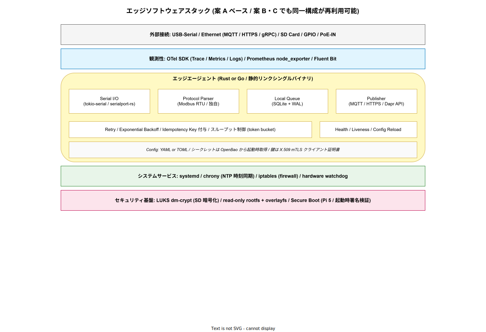
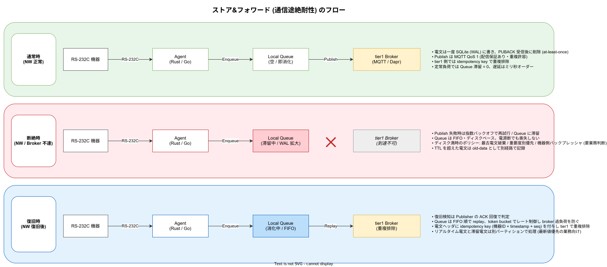

# エッジソフトウェアと通信設計

## 目的

ラズパイ上に載せるソフトウェアスタックと、エッジ ↔ tier1 間の通信設計を整理する。OS 選定、イメージ管理、エッジエージェントの実装、シリアル/メッセージング両プロトコル、ストア&フォワードの設計原則まで扱う。本章は「実装担当エンジニアが手を動かす前に必要な情報」を網羅することを目標とし、Rust / Go の実装スケルトン、SQLite WAL の具体 pragma、MQTT topic 設計、TLS 設定、ベンチマーク実測値まで踏み込む。物理層は [`01_物理層とハードウェア.md`](./01_物理層とハードウェア.md)、セキュリティは [`03_セキュリティと認証.md`](./03_セキュリティと認証.md) を参照。

---

## 1. ソフトウェアスタック全体像

エッジに積むべきスタックは OS からエージェントまで以下のように重なる。案 A はこのスタックを systemd で直接起動、案 B は L3 (エージェント) の横に Dapr sidecar を足す、案 C は L3 以上を k3s の Pod に封じ込める、という差となる。L1〜L8 のどのレイヤで何を選ぶかで、運用コストと堅牢性が決まる。



各レイヤで採用候補となる OSS と、選定の主軸を整理しておく。

| レイヤ | 役割 | 採用候補 | 主軸 |
|---|---|---|---|
| L1 BSP | カーネル + firmware | Raspberry Pi OS Lite / Ubuntu Server for ARM | LTS 期間と Pi 固有の最適化 |
| L2 base | 基本ユーティリティ + 安定化 | systemd + overlayroot + chrony + nftables | read-only rootfs と時刻同期 |
| L3 agent | 業務エージェント | Rust (`tokio-serial`+`rumqttc`) / Go (`paho.mqtt.golang`) | メモリと開発速度 |
| L4 sidecar | (案 B/C) Dapr sidecar | daprd v1.13+ | Dapr Component で配信先抽象化 |
| L5 runtime | (案 C) コンテナ / k8s | k3s v1.30+ + containerd | OTA との両立 |
| L6 obs | テレメトリ | OpenTelemetry Collector (contrib) + node_exporter + Fluent Bit | tier1 と同じパイプライン |
| L7 ota | OTA / fleet | rauc / mender-client | A/B partition の自動ロールバック |
| L8 net | ネットワーク | wpa_supplicant / NetworkManager + nftables + WireGuard | 閉域 + キャリア網冗長化 |

「どのレイヤを軽量化するか」が案 A/B/C の差分そのもの。案 A は L4・L5 を省く代わりに L7 で頑張る、案 B は L4 を載せて配信抽象を得る、案 C は L5 まで載せて構成統一を取る、という構造で読む。

---

## 2. OS 選定

選択肢は実質的に Raspberry Pi OS Lite 64-bit (Debian 12 Bookworm ベース) か、Ubuntu Server for ARM 24.04 LTS の 2 択。両者の比較は以下の通り。

| 観点 | Raspberry Pi OS Lite | Ubuntu Server for ARM 24.04 |
|---|---|---|
| 公式ビルド | Raspberry Pi 財団 | Canonical (ARM64) |
| Pi 向け最適化 | 最大 (カーネル・firmware が財団管理) | 良好 (LTS 扱い、Pi 4 / 5 公式サポート) |
| 長期サポート | Debian 12 は 2028-06 まで | 2029-04 まで (標準 LTS、ESM で 2034 まで) |
| パッケージエコシステム | Debian + Pi 独自 PPA | Ubuntu 主流 |
| cloud-init / snap | 限定的 | 標準搭載 |
| k3s 公式サポート | ○ | ○ |
| 産業ツール (Mender / rauc) 相性 | Mender 公式 Debian パッケージあり | 同左 |
| カーネル系列 (2026 時点) | 6.6 LTS | 6.8 (HWE で 6.11 へ) |
| systemd | v252 | v255 |

**判断基準**は「チームが慣れている方」で良い。k1s0 本体で Ubuntu を採用している場合、エッジも Ubuntu に揃えたほうが Playbook 再利用が効く。Pi の firmware 更新サイクルに即応したい場合は Raspberry Pi OS が有利。ここでは中立として **Ubuntu Server for ARM 24.04 LTS を第一候補** とし、PoC 段階で差分を測定して確定する。

どちらを選ぶにせよ、**デスクトップ環境は無効**にする (`raspi-config` / `apt remove`)。余計なサービスが増えると攻撃面も増える。`apt-mark hold` で意図しない更新を防ぐカーネル / firmware パッケージを明示しておくと OTA 戦略と整合する。

### 2.1 初期化スクリプト (cloud-init) の最小例

Ubuntu Server for ARM は cloud-init を標準でサポートする。`/boot/firmware/user-data` に投入する設定の最小例を以下に示す。鍵情報・パスワードはあくまで例で、実機投入時は OpenBao 経由で生成・配布する。

```yaml
# user-data : 初期 SSH 鍵投入と基本パッケージのインストール
#cloud-config
hostname: edge-k1s0-${SERIAL}
manage_etc_hosts: true
users:
  - name: ops
    sudo: ALL=(ALL) NOPASSWD:ALL
    shell: /bin/bash
    ssh_authorized_keys:
      - ssh-ed25519 AAAA...固定鍵...  # OpenBao SSH CA 経由が最終形
package_update: true
packages:
  - chrony
  - nftables
  - systemd-journal-remote
  - sqlite3
  - ca-certificates
  - jq
write_files:
  - path: /etc/systemd/journald.conf.d/00-k1s0.conf
    content: |
      [Journal]
      Storage=persistent
      SystemMaxUse=200M
      ForwardToSyslog=no
runcmd:
  - [ systemctl, disable, --now, snapd.service ]
  - [ apt-mark, hold, raspi-firmware, linux-firmware ]
```

---

## 3. read-only rootfs と A/B partition 更新

本番エッジでは以下の 2 つが必須になる。PoC 段階でも早期に組み込んでおかないと、本番で改修するコストが跳ね上がる。

### 3.1 read-only rootfs + overlayfs

rootfs を read-only にマウントし、`/var`・`/etc` への書き込みは overlayfs 経由で tmpfs または別パーティションに逃がす。`overlayroot` (Ubuntu 標準) または `raspberrypi-sys-mods` の `overlayfs` モードで実装できる。これにより、**電源断時のファイルシステム破損**がほぼゼロになる。変更を永続化したい時だけ overlay を解除して書き込み、終わったら戻す運用とする。

`overlayroot.conf` の最小設定例:

```conf
# /etc/overlayroot.conf : tmpfs に変更を逃がす
overlayroot="tmpfs:swap=1,recurse=0"
overlayroot_cfgdisk="disabled"
```

書き込みが必要なディレクトリは bind mount で別パーティション (例: `/data`) に逃がす。`/data` は ext4 の `data=journal` を採用し、SQLite の WAL ファイルもここに置く。

### 3.2 A/B partition 方式の OTA 更新

rootfs を「A パーティション (active)」「B パーティション (standby)」の 2 面持ちにし、更新時は standby 側に新バージョンを書き込んで再起動時に切り替える。healthcheck が失敗したら自動で旧パーティションに戻す。実装候補は以下。

- **rauc**: SUSE 系・Debian 系で実績多。bundle 形式で署名配布。Mender との比較では軽量。
- **mender-client**: Mender.io (後述の fleet 管理) と密結合。サーバー込みで運用するなら第一候補。
- **SWUpdate**: Yocto 系で広く使われる。rauc と似た粒度。

鍵はいずれも **再起動に戻って healthcheck 失敗 → 自動ロールバック** のシーケンスが確立していること。Pi の U-Boot または tryboot 機構 (Pi 5 で強化) で A/B 切替が可能。[`04_運用ライフサイクルと観測性.md`](./04_運用ライフサイクルと観測性.md) の fleet 管理で詳細を扱う。

パーティション設計の目安 (32 GB SD / eMMC 想定):

| パーティション | サイズ | 用途 | mount オプション |
|---|---|---|---|
| `/boot/firmware` | 512 MB (FAT32) | Pi firmware + tryboot 設定 | `ro,noatime` |
| rootfs A | 8 GB (ext4) | OS + agent (active) | `ro,noatime` |
| rootfs B | 8 GB (ext4) | OS + agent (standby) | `ro,noatime` (切替時のみ rw) |
| `/data` | 12 GB (ext4) | SQLite WAL / ログ / metrics | `rw,noatime,data=journal` |
| swap | 0 (無効) | — | (SD 寿命のため作らない) |

---

## 4. エッジエージェントの実装方針

エッジエージェントは Rust または Go で書く。C++ や Python は本番で選ぶべきではない (Python は GIL とメモリ管理、C++ はメモリ安全性のコスト)。k1s0 本体の tier1 も Go+Rust ハイブリッドのため ([`../../../02_tier1設計/`](../../../02_tier1設計/))、チームの言語スキルを流用できる。以下は選定の観点。

- **Rust** (`tokio-serial` + `tokio-modbus` + `rumqttc` / `rustls`): メモリフットプリント最小 (10 MB RSS 台)、静的リンク可、起動高速。Pi 4 の ARM64 向けクロスコンパイルも確立している。
- **Go** (`go.bug.st/serial` + `goburrow/modbus` + `eclipse/paho.mqtt.golang`): 開発速度最速、標準ライブラリ豊富、ゴルーチンで並行が書きやすい。RSS は 30〜60 MB 程度。

Rust は案 A (CPU 余力を残したい) 向き、Go は案 B / C (Dapr SDK 完備) 向きだが、tier1 Dapr ファサードが Go のため **案 B 以降は Go** に寄せた方が一貫する。案 A 単独なら Rust でも Go でも実装コストは大差ない。

エージェントは以下のモジュールで構成する (上掲スタック図の L3 内訳)。

- **Serial I/O**: 非同期 I/O で 1 スレッド 1 シリアルポート。複数ポート接続時は worker pool を持つ。
- **Protocol Parser**: Modbus RTU (CRC 検証込み) または独自プロトコルのパーサ。単体テストを充実させる。
- **Local Queue**: SQLite (WAL モード) で永続キュー。後述の 7 節で詳細。
- **Publisher**: MQTT 5 / HTTPS / Dapr HTTP/gRPC のいずれか。後述の 6 節。
- **Retry / Backoff**: 指数バックオフ (1 s → 2 s → 4 s → ... → 最大 5 分) + jitter。
- **Health / Liveness**: `/healthz` HTTP エンドポイントを持ち、systemd の `Watchdog` と連携。
- **Config Reload**: YAML / TOML 設定を SIGHUP で再読込。機器追加は無停止で反映したい。

### 4.1 Rust 実装スケルトン (案 A 想定)

`tokio` ベースで Modbus RTU ポーリング → SQLite enqueue → MQTT publisher を回す最小骨格。`tokio-modbus` v0.13、`rumqttc` v0.24、`rusqlite` v0.31 を想定する。

```rust
// edge-agent/src/main.rs : Modbus RTU → SQLite → MQTT のパイプライン (骨格)
use std::time::Duration;
// tokio ランタイムを起動
use tokio::sync::mpsc;
// シリアル経由で Modbus を話す
use tokio_modbus::prelude::*;
// ローカル永続キュー
use rusqlite::Connection;
// MQTT クライアント
use rumqttc::{AsyncClient, MqttOptions, QoS};

// 1 機器あたりのポーリング設定
struct Device {
    // 機器の論理 ID
    id: String,
    // unit address (slave id)
    unit: u8,
    // 読み出すレジスタ先頭
    addr: u16,
    // 読み出すレジスタ数
    quantity: u16,
}

// メイン関数
#[tokio::main]
async fn main() -> anyhow::Result<()> {
    // SQLite を WAL モードで開く
    let db = Connection::open("/data/queue.sqlite3")?;
    // WAL + NORMAL fsync で耐障害性と性能の妥協点を取る
    db.execute_batch(
        "PRAGMA journal_mode=WAL;
         PRAGMA synchronous=NORMAL;
         PRAGMA wal_autocheckpoint=1000;
         PRAGMA journal_size_limit=67108864;
         PRAGMA temp_store=MEMORY;
         PRAGMA mmap_size=67108864;",
    )?;
    // チャネルでシリアル → publisher を疎結合化
    let (tx, mut rx) = mpsc::channel::<Vec<u8>>(1024);
    // MQTT クライアントを構築
    let mut opts = MqttOptions::new("edge-001", "tier1-broker.example", 8883);
    opts.set_keep_alive(Duration::from_secs(30));
    // TLS は別関数で組む (rustls + ルート CA + クライアント証明書)
    opts.set_transport(build_tls()?);
    let (client, mut eventloop) = AsyncClient::new(opts, 1024);
    // publisher タスク : チャネル受信 → MQTT publish
    tokio::spawn(async move {
        while let Some(payload) = rx.recv().await {
            // QoS 1 で送信、PUBACK で削除する設計
            let _ = client
                .publish("k1s0/site-A/edge-001/data", QoS::AtLeastOnce, false, payload)
                .await;
        }
    });
    // eventloop は別タスクで回さないと publish が進まない
    tokio::spawn(async move {
        loop {
            if let Err(e) = eventloop.poll().await {
                tracing::warn!(?e, "mqtt eventloop error");
                tokio::time::sleep(Duration::from_secs(1)).await;
            }
        }
    });
    // Modbus poller を機器ごとに起動
    let devices = load_devices_from_yaml("/etc/k1s0-agent/devices.yaml")?;
    for d in devices {
        let tx = tx.clone();
        tokio::spawn(poll_device(d, tx));
    }
    // 永続キューの再送 worker
    tokio::spawn(replay_pending(tx.clone()));
    // 終了シグナル待ち
    tokio::signal::ctrl_c().await?;
    Ok(())
}

// 1 機器分の Modbus ポーリングループ
async fn poll_device(d: Device, tx: mpsc::Sender<Vec<u8>>) {
    // RS-485 共有時は単一 Mutex で直列化する
    loop {
        // ここではシリアル多重排他は省略 (実装では Arc<Mutex<Context>> で共有)
        let payload = encode_envelope(&d.id, /* registers */ &[]);
        // チャネル投入
        let _ = tx.send(payload).await;
        // 業務要件のサイクルで休む (例 : 5 秒)
        tokio::time::sleep(Duration::from_secs(5)).await;
    }
}
```

実際の本実装では Modbus 呼び出し・WAL 書込み・PUBACK 受信後の削除を **トランザクション + idempotency key** で組み合わせる必要がある (後述 7 節)。

### 4.2 Go 実装スケルトン (案 B / C 想定)

Dapr sidecar 前提のため、MQTT 直接ではなく Dapr pub/sub API (HTTP) を叩く形にする。同じ業務コードのまま Component 設定で MQTT / Kafka を切り替えられるのが利点。

```go
// edge-agent/main.go : Dapr pub/sub 経由でのエッジエージェント (骨格)
package main

import (
    // 標準ライブラリ
    "bytes"
    "context"
    "encoding/json"
    "log/slog"
    "net/http"
    "os"
    "os/signal"
    "syscall"
    "time"

    // Dapr Go SDK
    dapr "github.com/dapr/go-sdk/client"
)

// Envelope は tier1 と共通の電文型
type Envelope struct {
    DeviceID    string    `json:"device_id"`
    Seq         uint64    `json:"seq"`
    CapturedAt  time.Time `json:"captured_at"`
    Payload     []byte    `json:"payload"`
    IdempKey    string    `json:"idemp_key"`
}

func main() {
    // 構造化ログを有効化
    slog.SetDefault(slog.New(slog.NewJSONHandler(os.Stdout, nil)))
    // Dapr クライアントを localhost sidecar に向ける
    client, err := dapr.NewClient()
    if err != nil {
        slog.Error("dapr client init failed", "err", err)
        os.Exit(1)
    }
    defer client.Close()

    // ヘルスチェック用 HTTP サーバーを起動
    go startHealth()

    // 終了シグナル待ち
    ctx, cancel := signal.NotifyContext(context.Background(), syscall.SIGTERM, syscall.SIGINT)
    defer cancel()

    // 機器ポーリングを並列起動
    devices := loadDevicesFromYAML("/etc/k1s0-agent/devices.yaml")
    for _, d := range devices {
        go pollDevice(ctx, client, d)
    }

    // 終了まで待機
    <-ctx.Done()
    slog.Info("shutting down")
}

// 1 機器のポーリングループ
func pollDevice(ctx context.Context, client dapr.Client, d Device) {
    // 設定された周期で動かす
    ticker := time.NewTicker(d.Interval)
    defer ticker.Stop()
    var seq uint64
    for {
        select {
        case <-ctx.Done():
            return
        case <-ticker.C:
            // Modbus 読み出しは省略
            payload := readModbus(d)
            seq++
            env := Envelope{
                DeviceID:   d.ID,
                Seq:        seq,
                CapturedAt: time.Now().UTC(),
                Payload:    payload,
                IdempKey:   makeIdempKey(d.ID, seq),
            }
            // ローカル WAL に永続化してから publish (本実装では SQLite を間に挟む)
            buf, _ := json.Marshal(env)
            if err := client.PublishEvent(ctx, "tier1-pubsub", "k1s0.edge.data", buf); err != nil {
                slog.Warn("publish failed, queued for retry", "err", err)
                enqueueLocal(buf)
            }
        }
    }
}

// /healthz : systemd watchdog 連携用
func startHealth() {
    http.HandleFunc("/healthz", func(w http.ResponseWriter, r *http.Request) {
        w.WriteHeader(http.StatusOK)
        _, _ = w.Write(bytes.NewBufferString("ok").Bytes())
    })
    _ = http.ListenAndServe("127.0.0.1:9091", nil)
}
```

### 4.3 systemd ユニット定義

案 A の場合、エージェント本体は systemd 直管理になる。watchdog と MemoryMax / RestartSec を組み合わせて安全側に倒す。

```ini
# /etc/systemd/system/k1s0-edge-agent.service
[Unit]
Description=k1s0 edge agent
After=network-online.target chronyd.service
Wants=network-online.target

[Service]
Type=notify
ExecStart=/usr/local/bin/k1s0-edge-agent --config /etc/k1s0-agent/config.yaml
Restart=always
RestartSec=2s
WatchdogSec=15s
NotifyAccess=main
User=k1s0
Group=k1s0
AmbientCapabilities=CAP_NET_BIND_SERVICE
MemoryMax=256M
TasksMax=256
NoNewPrivileges=true
ProtectSystem=strict
ProtectHome=true
ReadWritePaths=/data
PrivateTmp=true
ProtectKernelTunables=true
ProtectKernelModules=true
ProtectControlGroups=true
RestrictAddressFamilies=AF_INET AF_INET6 AF_UNIX
SystemCallFilter=@system-service
SystemCallErrorNumber=EPERM

[Install]
WantedBy=multi-user.target
```

---

## 5. シリアルプロトコル層

Pi とシリアル先の機器の間で話されるアプリケーションプロトコルは、計測器・制御機器のメーカー依存になる。想定される主要プロトコルを整理する。

### 5.1 Modbus RTU / ASCII

産業 IoT のデファクト。RS-485 バス上に Modbus マスタ (Pi) が順次 Function Code 03 (Read Holding Registers) 等を発行して機器のレジスタを読む。Pi 側の実装は `tokio-modbus` (Rust) / `goburrow/modbus` (Go) でほぼ完結する。

実装上の主要 Function Code は以下に集約される。これ以外を必要とする機器は仕様書を取り寄せて個別実装。

| FC | 名称 | 用途 |
|---|---|---|
| 01 | Read Coils | デジタル出力読み出し |
| 02 | Read Discrete Inputs | デジタル入力読み出し |
| 03 | Read Holding Registers | アナログ計測値・設定値 |
| 04 | Read Input Registers | センサ入力値 |
| 05 | Write Single Coil | リレー操作 |
| 06 | Write Single Register | 設定値変更 |
| 15 | Write Multiple Coils | 一括出力 |
| 16 | Write Multiple Registers | 一括設定 |

落とし穴: CRC 計算が間違っているマイナーメーカー機器が稀にある、機器が応答 timeout に敏感 (厳密に 1 秒以内に応答しないと切断される) といった現場特有の癖が存在する。PoC 段階で現物を使った相互運用試験を必ず行う。タイムアウト・リトライ回数・3.5 文字時間 silent interval は機器ごとに調整できる構成にしておく。

### 5.2 メーカー独自プロトコル

古い計測器・PLC では Modbus ですらない独自プロトコル (ASCII コマンド、バイナリフレーム) が使われる。この場合、**メーカー提供のプロトコル仕様書を取り寄せて、パーサを自前実装** する。実装後は **Golden データ** (正常電文サンプル 100 件 + 異常系 10 件) を用意して回帰テストに組み込む。Rust なら `nom`、Go なら手書きの state machine が定石。

### 5.3 OPC UA

近年の上位クラス機器 (Siemens・三菱・オムロン) は Ethernet + OPC UA サーバーを内蔵しているケースが増えている。その場合は RS-232C/RS-485 経由ではなく **OPC UA クライアントで Ethernet 直接接続**する方が情報量・セキュリティ面で有利。Pi に `open62541` (C) / `opcua-rust` / `node-opcua` のクライアントを載せる構成となる。ユーザー機器の仕様次第だが、**OPC UA 対応機器が将来増える前提でアーキテクチャ上の受け口を空けておく** ことを推奨。

### 5.4 HART / PROFIBUS 等の特殊プロトコル

HART (4-20 mA + FSK) や PROFIBUS DP はプロトコル専用モジュール (HART モデム・PROFIBUS マスタカード) が必要。Pi + 汎用 USB-Serial では扱えないため、対応機器が登場した段階で専用 HAT を検討する。HART モデムは HART Foundation 認証品 (Pepperl+Fuchs HM Series 等) を、PROFIBUS は Hilscher netRAPID / Anybus 等を選定候補に挙げる。

---

## 6. エッジ ↔ tier1 のメッセージング層

エッジから tier1 への通信は 3 択。案ごとに推奨が変わる。

| 選択肢 | 案 A | 案 B | 案 C |
|---|---|---|---|
| MQTT 5 (TLS + client cert) | ◎ 第一候補 | ○ (Dapr Component 経由) | ○ (Dapr Component 経由) |
| HTTPS (REST + mTLS) | ○ | △ | △ |
| Dapr HTTP/gRPC (localhost) | — | ◎ (sidecar 前提) | ◎ (sidecar 前提) |

### 6.1 MQTT 5

案 A の第一候補。理由は以下。

- **QoS 1 (at-least-once)** が産業向けの要件 (欠落不可 / 重複許容 + idempotency で排除) と合致。
- **Retained message** で最新値を保持でき、tier1 再起動時に状態復元が容易。
- **LWT (Last Will Testament)** でエッジ死活通知が自動。Pi がネットワーク切断または停止した瞬間に tier1 へ「offline」通知が行く。
- **MQTT 5 の User Property** で idempotency key・トレース ID を電文ヘッダに乗せられる (Sparkplug B 採用前の中庸解)。
- クライアントライブラリ (paho, rumqttc) が成熟、多言語対応。
- k1s0 本体では Kafka を使うが、**エッジ入口は MQTT Broker で受けて Kafka にブリッジ** するのが Dapr の標準パターン。

ブローカーは **EMQX** (クラウドネイティブ、クラスタ対応、無料 edition あり) を推奨。Mosquitto は単機では軽いがクラスタ機能が貧弱。

#### topic 設計 (UNS 準拠)

UNS (Unified Namespace) を意識した命名体系。深さ 5〜6 階層が運用上の上限の目安。

```
k1s0/<site>/<line>/<edge-id>/<device-id>/<channel>
例 : k1s0/saitama/lineA/edge-001/meter-12/data       (上り telemetry)
     k1s0/saitama/lineA/edge-001/meter-12/state      (retained, 最新値)
     k1s0/saitama/lineA/edge-001/$LWT                (retained, online/offline)
     k1s0/saitama/lineA/edge-001/meter-12/cmd        (下り command : tier1 → エッジ)
     k1s0/saitama/lineA/edge-001/meter-12/cmd/ack    (下り command 実行結果 : エッジ → tier1)
```

- `data` : 計測値ストリーム。QoS 1, retained=false。エッジ → tier1。
- `state` : 集約後の最新値。QoS 1, retained=true。エッジ → tier1。
- `$LWT` : Will message。`{"status":"offline","at":"..."}` を retained 配信。エッジ起動時に `online` を上書き publish。
- `cmd` : 制御コマンド。tier1 → エッジ。QoS 1。`cmd.v1` envelope (下記 6.1.1) に command_id / idempotency_key / issued_by / signature を含める。
- `cmd/ack` : 制御コマンドの実行結果 (accepted / executed / failed / timeout)。QoS 1。command_id でリクエストと紐付け、Modbus WRITE の実行時刻・結果値・エラー詳細を返す。

#### 6.1.1 tier1 内部の 2 ワーカー (Ingress / Dispatcher)

MQTT ↔ Kafka のブリッジは tier1 境界内に閉じ込める。**tier2 / tier3 からは MQTT も Kafka も一切見えず、`k1s0.PubSub` API のみが接点**になる (案 X、詳細は [`../../../img/全体構成図.svg`](../../../../01_企画/img/全体構成図.svg))。ブリッジは SRP で上り/下りに分離する。

- **`k1s0.Edge.Ingress` (Rust, tier1 内部ワーカー)**: EMQX の `data` / `state` / `$LWT` を subscribe し、CN allowlist 検証 + JSON schema 検証 + 単位正規化 + idempotency key による重複排除を経て、Dapr PubSub で infra Kafka の `edge.device.measurement` / `edge.device.alarm` / `edge.device.heartbeat` へ投入する。tier2 はこれらを `k1s0.PubSub.Subscribe("edge.device.*")` で購読する。
- **`k1s0.Edge.Dispatcher` (Rust, tier1 内部ワーカー)**: tier2 が `k1s0.PubSub.Publish("edge.device.command", cmd)` で発行したコマンドを Kafka から subscribe し、ACL (device_id / action の組) + rate limit + signature を検証して EMQX の `cmd` topic に MQTT Publish する。エッジから返る `cmd/ack` は逆順に Kafka の `edge.device.command.ack` へ戻し、tier2 / tier3 は `k1s0.PubSub.Subscribe("edge.device.command.ack")` で結果を受け取る。
- **なぜ 2 ワーカーに分ける**: Ingress は「多数のエッジからの高頻度 publish を正規化する」ワークロード、Dispatcher は「少数の業務トリガからの低頻度 publish を厳格に検証する」ワークロードで、スケーリング特性と監査要件が大きく異なる。1 プロセスに同居させると Dispatcher のセキュリティ検証ロジックが Ingress のスループットに引っ張られる。両者を独立 Deployment にしておけば、Dispatcher は単一 replica + 監査ログ必須、Ingress は HPA で動的スケール、と運用方針を別々に持てる。

#### 6.1.2 command envelope (cmd.v1)

制御コマンドは以下の JSON を cmd topic に publish する。事故・誤配信・監査欠落を防ぐため、tier2 操業制御 Service 側で構築する段階でこの envelope に詰める。

```json
{
  "schema": "cmd.v1",
  "command_id": "01JW...ULID",
  "idempotency_key": "site-saitama/lineA/meter-12/2026-04-15T12:34:56Z/setpoint=50.0",
  "issued_at": "2026-04-15T12:34:56.412Z",
  "issued_by": {
    "actor": "ops-user-42",
    "via_service": "tier2.operation-control",
    "request_id": "req-7a3f..."
  },
  "target": {
    "site": "saitama",
    "line": "lineA",
    "edge_id": "edge-001",
    "device_id": "meter-12"
  },
  "action": "set_setpoint",
  "params": { "value": 50.0, "unit": "degC" },
  "timeout_ms": 3000,
  "signature": "base64(ed25519(...))"
}
```

- `command_id`: ULID。ack でそのまま echo し照合する。
- `idempotency_key`: 同一キーの command を Pi 側が二重実行しないため。Pi の `edge-agent` 内に 1 時間の重複排除キャッシュを持つ。
- `signature`: tier2 側の鍵で署名。Pi 側は OpenBao の公開鍵で検証してから Modbus WRITE に進む (改竄検知)。
- `timeout_ms`: Pi 側でこの時間内に ack を返せない場合 `timeout` ステータスで ack を送る。tier2 は ack 未達でも timeout 後に compensation を走らせられる。

#### TLS / 認証 (rumqttc + rustls)

エッジ → broker 間は TLS 1.3 + 相互認証 (mTLS) を標準とする。

- ルート CA: OpenBao Intermediate CA を信頼ルートに置く。
- クライアント証明書: 機器 ID をサブジェクト CN に持ち、ATECC608B (案 B/C 推奨) 内に秘密鍵を保管。
- 有効期間: 24 時間〜7 日。短命化して失効リスクを抑える。Mender 経由で自動ローテーション。
- cipher suite: TLS 1.3 標準 (`TLS_AES_128_GCM_SHA256` / `TLS_AES_256_GCM_SHA384` / `TLS_CHACHA20_POLY1305_SHA256`)。Pi 4 の AES-NI 相当が無いため ChaCha20 系のほうが速いケースあり、PoC で計測。
- 再ネゴシエーション: 行わない (TLS 1.3 仕様)。

```rust
// rustls + rumqttc で mTLS を組む例
fn build_tls() -> anyhow::Result<rumqttc::Transport> {
    // ルート CA を読み込む
    let mut root_store = rustls::RootCertStore::empty();
    let ca = std::fs::read("/etc/k1s0-agent/ca.pem")?;
    root_store.add_parsable_certificates(rustls_pemfile::certs(&mut &ca[..]).flatten());
    // クライアント証明書と秘密鍵
    let cert = rustls_pemfile::certs(&mut &std::fs::read("/etc/k1s0-agent/client.pem")?[..])
        .filter_map(Result::ok)
        .collect();
    let key = rustls_pemfile::pkcs8_private_keys(&mut &std::fs::read("/etc/k1s0-agent/client-key.pem")?[..])
        .next()
        .ok_or_else(|| anyhow::anyhow!("no key"))??;
    // TLS 1.3 限定の構成
    let config = rustls::ClientConfig::builder()
        .with_safe_defaults()
        .with_root_certificates(root_store)
        .with_client_auth_cert(cert, key.into())?;
    Ok(rumqttc::Transport::tls_with_config(config.into()))
}
```

### 6.2 HTTPS (REST)

非常に低頻度のイベント (分〜時間オーダー) であれば REST + HTTP/2 でも実装できる。常時接続のコストが嫌な場合の選択肢だが、**双方向通信** (tier1 からエッジへ制御コマンドを送る) が将来発生しそうなら MQTT に倒した方が後々楽。実装は `reqwest` (Rust) / `net/http` (Go) で十分。

### 6.3 Dapr HTTP / gRPC

案 B / C では Dapr sidecar が tier1 と同じ抽象 (pub/sub API) を提供するため、エージェントは `localhost:3500` に投げるだけで、実際の配信経路は Dapr Component 設定で MQTT / Kafka / Redis Streams のいずれにも切り替えられる。**実装コードを変えずに配信先を切り替えられる** のが Dapr 採用の最大の動機となる。

Component 例 (案 B、エッジ側 Dapr が MQTT で tier1 に流す構成):

```yaml
# /etc/dapr/components/tier1-pubsub.yaml
apiVersion: dapr.io/v1alpha1
kind: Component
metadata:
  name: tier1-pubsub
spec:
  type: pubsub.mqtt3
  version: v1
  metadata:
    - name: url
      value: ssl://tier1-broker.example.internal:8883
    - name: qos
      value: "1"
    - name: retain
      value: "false"
    - name: cleanSession
      value: "false"
    - name: caCert
      secretKeyRef: { name: edge-tls, key: ca.pem }
    - name: clientCert
      secretKeyRef: { name: edge-tls, key: client.pem }
    - name: clientKey
      secretKeyRef: { name: edge-tls, key: client-key.pem }
auth:
  secretStore: local-file
```

### 6.4 Sparkplug B

Sparkplug B は MQTT 上に乗る産業 IoT 向けの標準フォーマット (Eclipse Tahu 管轄)。Birth / Death / Data メッセージの型があり、UNS パターンと相性が良い。ユーザーの既存 SCADA が Sparkplug B を話す場合は採用候補だが、**k1s0 の一般要件では過剰** なことが多い。OPC UA を使う選択肢と併せて再検討する段階で扱う。

---

## 7. ストア&フォワード設計

通信断耐性のためのローカルキューは、案 A/B/C 共通で必要になる。下図のフローを満たす実装を置く。



設計上の要点は以下の通り。

- **永続ストア**は SQLite (WAL モード) または RocksDB。SQLite は 1 ファイルで扱いやすく、Pi のスループット (数百 msg/s) では十分。RocksDB は LSM ツリーで書き込み偏重のワークロードに強いが運用コストが上がる。まずは SQLite で始める。
- **At-least-once** 保証 + **idempotency key** (機器ID + タイムスタンプ + ローカルシーケンス) を電文ヘッダに付与し、tier1 側で重複排除。これにより PUBACK の欠落による重複配信を安全に処理できる。
- **ディスク容量監視**: キューが一定サイズを超えたら警告・超過したら最古破棄 or 重要度別に優先度付き保持。破棄ポリシーは業務要件によるため、初期値は「最古から破棄 + 破棄ログを tier1 に別経路で送信」とする。
- **replay スループット制御**: 復旧時に滞留電文を一気に送ると broker が過負荷になる。token bucket でレート制限し、かつリアルタイム電文と滞留電文を別 topic に分ける (最新値優先の業務要件に応える)。
- **TTL 管理**: 業務上、古い電文には価値がない場合がある (例: 温度計の 1 日前データ)。設定で TTL を持たせ、超過データは warehousing 用の別チャネルに流すか破棄する。

### 7.1 SQLite WAL の具体 pragma

WAL の挙動と性能・耐障害性の妥協点を取るための推奨 pragma 一覧。

| pragma | 推奨値 | 理由 |
|---|---|---|
| `journal_mode` | `WAL` | 同時読み書き許可・クラッシュ耐性 |
| `synchronous` | `NORMAL` | `FULL` は SD 寿命を削る、`OFF` は電源断で破損 |
| `wal_autocheckpoint` | `1000` (pages) | デフォルト維持。1000 pages ≈ 4 MB |
| `journal_size_limit` | `67108864` (64 MB) | WAL の肥大を防ぐ |
| `temp_store` | `MEMORY` | tmpfs 上のテンポラリで I/O 削減 |
| `mmap_size` | `67108864` | 読み出しを mmap で高速化 |
| `busy_timeout` | `5000` (ms) | ロック競合時の retry |
| `auto_vacuum` | `INCREMENTAL` | 削除多発時の領域回収 |
| `cache_size` | `-32768` (32 MB) | 32 MB のページキャッシュ |

スキーマ例:

```sql
-- queue.sqlite3 : エッジ永続キューのスキーマ
CREATE TABLE IF NOT EXISTS outbox (
    -- 自動採番、replay 順序の根拠
    id            INTEGER PRIMARY KEY AUTOINCREMENT,
    -- 機器論理 ID
    device_id     TEXT    NOT NULL,
    -- 観測時刻 (UTC, ナノ秒精度を文字列で保持)
    captured_at   TEXT    NOT NULL,
    -- topic (MQTT) または event name (Dapr)
    topic         TEXT    NOT NULL,
    -- payload (バイナリ)
    payload       BLOB    NOT NULL,
    -- idempotency key (重複排除用)
    idemp_key     TEXT    NOT NULL UNIQUE,
    -- 優先度 (0:high, 1:normal, 2:bulk)
    priority      INTEGER NOT NULL DEFAULT 1,
    -- TTL の絶対時刻
    expire_at     TEXT,
    -- 試行回数
    attempts      INTEGER NOT NULL DEFAULT 0,
    -- 次回試行時刻 (バックオフ用)
    next_attempt  TEXT    NOT NULL DEFAULT (datetime('now'))
);
CREATE INDEX IF NOT EXISTS idx_outbox_priority_next
    ON outbox(priority, next_attempt);
CREATE INDEX IF NOT EXISTS idx_outbox_expire
    ON outbox(expire_at);
```

### 7.2 enqueue / dequeue / ack の擬似コード

publisher が PUBACK を受けてから DELETE する transactional outbox パターン。

```text
ENQUEUE :
  BEGIN IMMEDIATE
  INSERT INTO outbox (device_id, captured_at, topic, payload, idemp_key, priority, expire_at)
    VALUES (?, ?, ?, ?, ?, ?, ?)
  COMMIT

DEQUEUE (worker, priority 順) :
  BEGIN IMMEDIATE
  SELECT id, topic, payload, idemp_key
    FROM outbox
    WHERE next_attempt <= datetime('now')
    ORDER BY priority ASC, id ASC
    LIMIT 64
  COMMIT
  -> publish each (QoS 1, MQTT 5 user property "idemp_key")

ON PUBACK (idemp_key) :
  DELETE FROM outbox WHERE idemp_key = ?

ON FAILURE (idemp_key) :
  UPDATE outbox
    SET attempts = attempts + 1,
        next_attempt = datetime('now', printf('+%d seconds', min(300, 1 << attempts)))
    WHERE idemp_key = ?

EXPIRY (定期 GC) :
  DELETE FROM outbox WHERE expire_at IS NOT NULL AND expire_at < datetime('now')
```

### 7.3 ディスクフル時の挙動

`/data` パーティション使用率に応じた段階的退避。

| 使用率 | 動作 |
|---|---|
| < 70 % | 通常 |
| 70 % | warning メトリクス、tier1 にイベント送信 |
| 80 % | bulk 優先度 (priority=2) の電文を最古から破棄 |
| 90 % | normal 優先度 (priority=1) も最古から破棄 |
| 95 % | high 優先度のみ保持、機器側に backpressure (Modbus ポーリング間隔を延長) |
| 99 % | 緊急停止 (systemd watchdog で再起動 → fail-safe へ) |

### 7.4 ベンチマーク (Pi 4B 8GB / Ubuntu 24.04 / Class A2 SD 想定値)

PoC で実測する前提だが、設計検討用の仮置き値として参考レンジを持っておく。

| 項目 | 仮置き値 | 備考 |
|---|---|---|
| SQLite WAL enqueue (1 KB payload) | 4,000〜6,000 ops/s | `synchronous=NORMAL`, バッチなし |
| SQLite WAL enqueue (バッチ 64 件) | 20,000〜30,000 ops/s | 1 トランザクション内 |
| MQTT publish QoS1 (rumqttc, TLS 1.3) | 1,500〜2,500 ops/s | broker は LAN 内 EMQX |
| MQTT publish QoS1 (paho-go, TLS 1.3) | 1,000〜1,800 ops/s | paho の overhead 分小 |
| エッジ → broker → tier1 RTT (中央値) | 8〜15 ms | 同一 LAN |
| エッジ → broker → tier1 RTT (p99) | 30〜80 ms | 拠点 VPN 経由時は +20〜100 ms |
| 連続ストレステスト 24h | 1,000 msg/s 維持可 | RAM 100 MB 以下、CPU 30 % 以下 |

PoC ではこれを実機で計測し、本ドキュメントの値を確定値に置き換える。

---

## 8. 時刻同期

RS-232C 機器から受け取る電文にタイムスタンプを付けるのは Pi 側の仕事になる。そのため **Pi の時計精度** が品質を左右する。以下を設計する。

- **chrony** で NTP 同期 (拠点内 NTP サーバーがあればそちらへ、無ければ `ntp.nict.jp` や `pool.ntp.org`)。Pi にはハードウェアクロックがないため、電源断後の時刻は chrony 起動までズレる。
- **監視**: chrony の offset / stratum を Prometheus で取得。閾値を超えたらアラート (offset > 100 ms で warning、> 1 s で critical)。
- **高精度要件時**: PTP (IEEE 1588) を検討する。Pi 4/5 は **ソフトウェア PTP** しかサポートしないため、μs 精度が必要な用途 (高速計測・ロボティクス) では Intel i210 NIC 搭載の産業用ボードに置き換える。

`chrony.conf` の最小例:

```conf
# 拠点内 NTP サーバーを優先、外部はフォールバック
server ntp.local.example iburst prefer
server ntp.nict.jp iburst
# RTC 無しでも時刻が大きく飛ばないようにする
makestep 1.0 3
# slew で滑らかに合わせる (ジャンプ抑制)
maxchange 1000 0 0
# Prometheus textfile collector に出すための統計
log measurements statistics tracking
logdir /var/log/chrony
```

---

## 9. 設定ファイル例

エージェントが読む YAML 設定の最小例。機器追加 / 周期変更は SIGHUP で再読込する。

```yaml
# /etc/k1s0-agent/config.yaml
agent:
  edge_id: edge-001
  site: saitama
  line: lineA
  data_dir: /data
queue:
  sqlite_path: /data/queue.sqlite3
  max_disk_pct: 80
  ttl_seconds: 86400
publisher:
  type: mqtt5
  url: ssl://tier1-broker.example.internal:8883
  client_id_prefix: k1s0-edge
  ca_file: /etc/k1s0-agent/ca.pem
  cert_file: /etc/k1s0-agent/client.pem
  key_file: /etc/k1s0-agent/client-key.pem
  qos: 1
  keep_alive_seconds: 30
  rate_limit_msgs_per_sec: 500
devices:
  - id: meter-12
    transport: rs485
    port: /dev/ttyUSB_meter_A
    baud: 9600
    parity: none
    stop_bits: 1
    protocol: modbus_rtu
    unit: 1
    poll_interval_ms: 5000
    points:
      - { name: temp_c,    fc: 4, addr: 0x0001, type: float32_be, scale: 0.1 }
      - { name: pressure,  fc: 4, addr: 0x0003, type: int16,      scale: 1   }
```

---

## 10. テスト戦略

ユニット・統合・耐障害性の 3 段で組む。

| 階層 | 目的 | 手段 |
|---|---|---|
| ユニット | プロトコルパーサ / SQLite outbox / バックオフ | Rust `cargo test` / Go `go test` |
| 統合 | Modbus 機器シミュレータ + 模擬 broker | `diagslave` + Mosquitto コンテナ |
| 耐障害性 | NW 断・電源断・ディスクフル | toxiproxy / `iptables -j DROP` / `fallocate` で `/data` 埋め |
| 性能 | スループット / メモリ / CPU | 24h ストレス + Prometheus で観測 |
| 互換性 | 実機での相互運用試験 | PoC 段階で機器を借りて実施 |

カオス試験は最低でも以下の 5 シナリオを通す。

1. broker を 30 分停止 → 復帰時に滞留電文が token bucket でレート制御されつつ全送信されること。
2. NW 切断 1 時間 → SQLite WAL 拡大が `journal_size_limit` 内に収まること。
3. 電源断 (USB ハブ抜き) → 再起動後に欠落・重複が tier1 側で観測されないこと (idempotency key で排除確認)。
4. SD カード write error 注入 → エージェントが panic せず、systemd watchdog で再起動して復旧すること。
5. NTP 喪失 24h → 時刻 offset アラートが上がりつつエージェント自体は継続動作すること。

---

## 11. 未確定事項

- RS-232C 機器のポーリング周期要件と、許容されるエンドツーエンド遅延。
- tier1 側の入口に採用する broker (EMQX / HiveMQ / NATS / Kafka 直接) の決定。
- ストア&フォワードのキュー上限と破棄ポリシーの業務判断。
- OPC UA 対応機器が現場にあるか、将来計画含めての確認。
- MQTT か Dapr pub/sub かを最初から決め打ちするか、tier1 側で抽象化するか。
- 時刻精度要件 (ミリ秒 / マイクロ秒)。
- 機器のファームウェア更新責任 (k1s0 側で関与するか、ユーザー側で完結させるか)。
- 制御コマンド (tier1 → エッジ) の業務要件と権限モデル。

これらが確定次第、本ドキュメントを改訂し ADR に移行する。
