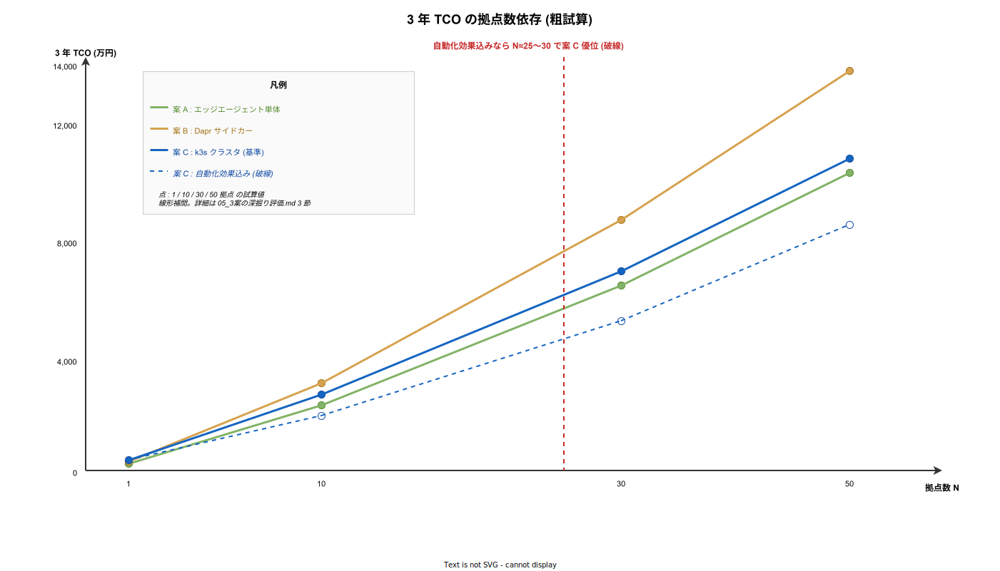

# 3 案の深掘り評価

## 目的

本フォルダ 00〜04 の各章で扱った論点 (物理層・ソフトウェア・セキュリティ・運用) を踏まえて、案 A / B / C を同一評価軸で再評価する。TCO (Total Cost of Ownership) 試算、移行経路、失敗時リカバリ、k3s on Pi の既知問題、撤退判断点まで含め、最終的な意思決定の根拠を示す。

---

## 1. 評価軸の再定義

総論 ([`README.md`](./README.md)) の簡易比較表は意思決定用の早見表だった。ここでは以下 7 軸で深掘りし、各軸の重み付けで案を評価する。

- **機能完全性**: RS-232C 収容とストア&フォワードを業務要件通りに実現できるか。
- **堅牢性**: 電源断・NW 断・SD 寿命に対する耐性。
- **運用コスト**: fleet 管理、観測、インシデント対応の継続コスト。
- **拡張性**: 拠点数・機器数の増加、新機能 (OPC UA 対応等) への対応容易性。
- **セキュリティ**: 鍵管理、物理脅威、コンプライアンス適合性。
- **k1s0 整合性**: 本体アーキテクチャとの運用一本化度合い。
- **TCO (3 年)**: 初期費 + 運用工数 × 3 年。

各軸の所感は次節にまとめ、数値化可能な TCO は 3 節で試算する。重み付け (5: 高, 3: 中, 1: 低) は以下を初期値とし、ユーザーヒアリング後に調整する。

| 軸 | 重み (初期値) | 重み根拠 |
|---|---|---|
| 機能完全性 | 5 | 業務要件未充足は致命的 |
| 堅牢性 | 5 | 産業現場での停止は売上直撃 |
| 運用コスト | 5 | TCO の主因、3 年で初期費を上回る |
| 拡張性 | 3 | 中長期影響、短期は致命でない |
| セキュリティ | 5 | 法規 / 信頼の前提条件 |
| k1s0 整合性 | 3 | 中期で効く、PoC では二次 |
| TCO | 5 | 採用判断の最終指標 |

---

## 2. 評価軸ごとの 3 案比較

### 2.1 機能完全性

3 案とも機能要件 (RS-232C 電文の収集と tier1 への配信、ストア&フォワード) は満たせる。差は **実装難度**にある。案 A は MQTT クライアントと SQLite で自前実装、案 B は Dapr pub/sub + Dapr Resiliency 機能を活用、案 C は案 B に加え k8s PV / Job でのリカバリが可能。コード行数だけで見れば案 A が最短 (Rust で数千行規模)、案 C が最長 (k8s マニフェスト + Helm + エージェント)。だが **案 A の信頼性テストコストが大きい** (自前実装ゆえ異常系のカバレッジ確保が必要)、という現実がある。

結論: 機能だけなら全案合格、**投入工数は案 A < 案 B < 案 C、検証工数は案 A > 案 B > 案 C**。

### 2.2 堅牢性

電源断耐性は A/B partition 更新・read-only rootfs が共通のため、ハード構成が同等なら 3 案互角。**NW 断耐性**は案 A / B / C すべてでストア&フォワードを実装するので差は出ない。**ハード障害時の継続運用**で差が出る。

- 案 A: Pi 1 台が故障すると通信停止。二重化すると案 C に近いコスト。
- 案 B: 案 A と同条件。
- 案 C: Pi 1 台故障でも残り 2 台で k3s が継続。ただし RS-232C を物理接続した Pi が故障した場合は物理層が停止し、k3s 側で吸収できない。

→ **RS-232C のケーブル結線が単一点である** という物理制約があるため、冗長化の上限は「機器側に 2 ポートがあるか」に依存する。多くの計測器は 1 ポートしかないため、Pi を 2 台用意しても 1 台だけが active、他は cold standby となる。堅牢性の実質的な差は案 A/B と案 C で **1 段程度**にとどまる。

### 2.3 運用コスト

[`04_運用ライフサイクルと観測性.md`](./04_運用ライフサイクルと観測性.md) の 2 節で示した通り、案 A / B は **Mender.io サーバー**の運用が発生し、案 C は **k3s クラスタ運用** が発生する。どちらも拠点数が増えるほど規模感が出る。

- 案 A: 拠点 1 で Mender 不要 (Ansible で可)。5 拠点で Mender 要。
- 案 B: 案 A と同様だが Dapr 更新の追加作業あり。
- 案 C: 初期構築が重い代わりに、拠点追加時の単価が低い (Argo CD ApplicationSet で自動)。

30 拠点以上になると案 C の運用コストが案 A / B を下回る転換点が来る、というのが定性的な見立て。PoC 段階では **拠点数の伸びをユーザーとすり合わせる** ことが最重要。

### 2.4 拡張性

- **機器種類の追加**: 3 案とも Protocol Parser を追加すれば対応可能。差はなし。
- **新プロトコル (OPC UA / Sparkplug B)**: 案 B / C は Dapr Component の差し替えで受け口を変えられる。案 A はエージェント側で対応。
- **AI 推論のエッジ実行**: 案 C は k3s に NVIDIA Jetson など GPU ノードを混在させる柔軟性が高い。案 A / B は AI 要件が出た時点で再設計が必要。
- **エッジでの業務ロジック拡張**: 案 B / C は Dapr building block (state, workflow) を使える。案 A は自前実装が増える。

中長期で機器・プロトコル・AI が追加される見込みがあるなら、**案 C が最も拡張コストが小さい**。

### 2.5 セキュリティ

[`03_セキュリティと認証.md`](./03_セキュリティと認証.md) の観点で見ると、3 案とも基本的な脅威モデルへの対処は可能。差は以下。

- 案 A: エージェント単体で mTLS / 鍵ローテを自前実装。実装バグのリスク。
- 案 B: Dapr sidecar が mTLS を担う。実装バグは Dapr の CVE 数に依存。
- 案 C: Dapr + k8s ネットワークポリシー + Pod Security Admission の多層防御。最も堅い。

Pi ハードウェアの制約 (TPM 無し) は 3 案共通。セキュアエレメント HAT の追加は必須 (本番投入前提)。

### 2.6 k1s0 整合性

- 案 A: **整合度低**。エッジ側は k1s0 の GitOps / 観測性 / 鍵管理とは別系統 (Mender + 手運用)。
- 案 B: **整合度中**。Dapr 抽象は共通、配信とコントロールプレーンは別。
- 案 C: **整合度高**。k1s0 本体と **同一の Argo CD / Backstage / Keycloak** で統括可能。

「k1s0 チームがエッジ運用も担う」想定なら案 C、「拠点運用は別チームに任せる」想定なら案 A/B でも大きな問題なし。

### 2.7 TCO は次節で数値化する。

### 2.8 重み付けスコア表

各案を 7 軸で 1〜5 点採点し、上記重みを掛け合わせた合計。

| 軸 | 重み | 案 A | 案 B | 案 C |
|---|---|---|---|---|
| 機能完全性 | 5 | 4 | 4 | 5 |
| 堅牢性 | 5 | 3 | 3 | 4 |
| 運用コスト (低いほど高得点) | 5 | 4 (拠点少なら) | 2 | 4 (拠点多なら) |
| 拡張性 | 3 | 2 | 4 | 5 |
| セキュリティ | 5 | 3 | 4 | 5 |
| k1s0 整合性 | 3 | 2 | 3 | 5 |
| TCO (低いほど高得点) | 5 | 5 (拠点少) / 3 (拠点多) | 2 | 2 (拠点少) / 4 (拠点多) |
| 加重合計 (拠点少シナリオ N≤10) | — | **96** | **80** | **104** |
| 加重合計 (拠点多シナリオ N≥30) | — | **86** | **80** | **114** |

スコアは絶対値ではなく相対比較のため、軸内での 1 段差を 1 点で表現している。**拠点数 10 以下なら案 C と案 A の差は 8 ポイント、拠点数 30 以上なら 28 ポイント**、という見立てとなる。

---

## 3. TCO 試算 (3 年 / 1 拠点あたり)

本節は 2026-04 時点の目安。為替・ベンダ割引・人件費単価で変動する。以下の前提を全案で共通化する。

- **人件費単価**: 1 人日 8 万円 (採用側組織のSIer 中堅・経験 5〜10 年の単価帯 50〜80 万/月 を 22 営業日で割った中央値)。内製 / 準委任 / 有償 OSS サポート込みで ±30 % の幅。
- **ハード参考価格**: [`01_物理層とハードウェア.md`](./01_物理層とハードウェア.md) 7 節 (2026-04 KSY / Switch Science / Moxa 国内代理店調べ)。
- **償却年数**: ハードは 3 年でゼロ償却 (拠点撤収まで使い切り前提)。
- **保守運用 FTE**: Mender 公称 100 拠点/FTE を保守的に 50 拠点/FTE (= 0.02 FTE/拠点) と読み替え。
- **為替**: 1 USD = 150 円、1 EUR = 165 円。海外製機器はこの為替で円換算。

以降 3.1 で 3 案の初期費を **ライン単位**で積み上げ、3.2 で継続運用費を **アクティビティ単位**で展開し、3.3 で 3 年合計に集約する。

### 3.1 初期費の明細 (1 拠点)

#### 3.1.1 案 A (Pi 単体 + Mender + 自前エージェント)

シングル Pi 4B 8GB + 絶縁型 USB-Serial の最小構成。産業筐体と UPS HAT をつけて現場投入可能にする。

| 分類 | 品目 | 単価 | 数量 | 金額 | 根拠 / 備考 |
|---|---|---|---|---|---|
| HW 本体 | Raspberry Pi 4 Model B (8 GB) | 1.2 万 | 1 | 1.2 万 | KSY 単価 ([`01`](./01_物理層とハードウェア.md) 3.1) |
| HW 通信 | Moxa UPort 1130I (RS-485 絶縁型) | 1.5 万 | 1 | 1.5 万 | 2.5 kV 絶縁 ([`01`](./01_物理層とハードウェア.md) 4.4) |
| HW ストレージ | Transcend 230I 産業用 microSD 32 GB (SLC) | 0.3 万 | 1 | 0.3 万 | pSLC モード ([`01`](./01_物理層とハードウェア.md) 2.2) |
| HW 電源 | Mean Well IRM-30-5ST DC-DC | 0.5 万 | 1 | 0.5 万 | 24 V→5 V 変換 |
| HW 電源 | Waveshare UPS HAT (C) + Li-ion 18650 × 2 | 0.8 万 | 1 | 0.8 万 | 瞬停保護 ([`01`](./01_物理層とハードウェア.md) 2.3) |
| HW 筐体 | Hammond 1455 IP65 DIN レール筐体 | 1.5 万 | 1 | 1.5 万 | 現場設置 |
| HW 付属 | 配線材 (Belden 9841 50 m + 端子台) | 0.5 万 | 1 式 | 0.5 万 | RS-485 Cat.5e 以上 |
| HW 付属 | フェライトコア・SPD・アクセサリ | 0.5 万 | 1 式 | 0.5 万 | EMC 対策 ([`01`](./01_物理層とハードウェア.md) 6 節) |
| **HW 小計** |  |  |  | **6.8 万** | [`01`](./01_物理層とハードウェア.md) 7 節と同一 |
| SW セットアップ | OS 焼き込み + ネットワーク設計 + rauc A/B 設定 | 8 万/人日 | 2 人日 | 16 万 | Ubuntu Core + rauc |
| SW セットアップ | 自前エージェント配置 + Mender client 組込み | 8 万/人日 | 1 人日 | 8 万 | Rust バイナリ + config |
| SW セットアップ | 現地結線 + 動作確認 | 8 万/人日 | 1 人日 | 8 万 | 2 名 × 0.5 日 相当 |
| セキュリティ | LUKS 暗号化 + Secure Boot + 鍵配布 | 8 万/人日 | 1 人日 | 8 万 | [`03`](./03_セキュリティと認証.md) 1-3 節 |
| **人件費小計** |  |  | **5 人日** | **40 万** |  |
| **案 A 初期費合計** |  |  |  | **46.8 万** | HW 6.8 + 人件費 40.0 |

`README.md` 簡易比較表 (5.2 万 HW 表記) は Pi4 4 GB / UPS なし構成での旧見積もり。本表は **Pi4 8 GB + UPS HAT を必須要件** とする現設計に合わせて再計算した値。

#### 3.1.2 案 B (Pi 単体 + Dapr sidecar + Mender)

案 A にハードウェアを足す必要はないが、**Dapr sidecar 起動のため RAM 余裕** (+512 MB) が必要。Pi 4B 8 GB なら問題なし。差分は SW 側の構築工数に集中する。

| 分類 | 品目 | 単価 | 数量 | 金額 | 根拠 / 備考 |
|---|---|---|---|---|---|
| HW | (案 A と同一) |  |  | 6.8 万 | 差分なし |
| SW セットアップ | OS + rauc + containerd | 8 万/人日 | 2 人日 | 16 万 | 案 A と同じ |
| SW セットアップ | Dapr sidecar 導入 + Component YAML (MQTT binding, State, Resiliency) | 8 万/人日 | 2 人日 | 16 万 | Dapr `standalone` モード |
| SW セットアップ | 自前エージェント (Dapr SDK 経由) + Mender client | 8 万/人日 | 1 人日 | 8 万 | Go SDK 利用 |
| SW セットアップ | 現地結線 + 動作確認 | 8 万/人日 | 1 人日 | 8 万 | 同上 |
| セキュリティ | LUKS + Secure Boot + mTLS (Dapr 設定込) | 8 万/人日 | 1 人日 | 8 万 | Dapr mTLS は sidecar 内 |
| **人件費小計** |  |  | **7 人日** | **56 万** | 案 A + 2 人日 |
| **案 B 初期費合計** |  |  |  | **62.8 万** | HW 6.8 + 人件費 56.0 |

#### 3.1.3 案 C (k3s on 3 台 Pi + Dapr + Argo CD + Mender)

Pi 3 台構成 + NVMe SSD + 収容筐体の拡張で HW が 3 倍に、k3s + CNI + storage + GitOps 連携で人件費が 3 倍に膨らむ。

| 分類 | 品目 | 単価 | 数量 | 金額 | 根拠 / 備考 |
|---|---|---|---|---|---|
| HW 本体 | Raspberry Pi 4 Model B (8 GB) | 1.2 万 | 3 | 3.6 万 | control-plane + worker × 3 |
| HW 通信 | Moxa UPort 1130I | 1.5 万 | 3 | 4.5 万 | 3 台全てに 1 本接続 (冗長) |
| HW ストレージ | Transcend 230I microSD 32 GB | 0.3 万 | 3 | 0.9 万 | 起動用 |
| HW ストレージ | Samsung 980 NVMe SSD 128 GB | 0.6 万 | 3 | 1.8 万 | etcd / Longhorn 用 ([`05`](./05_3案の深掘り評価.md) 4.2) |
| HW ストレージ | Geekworm X1001 NVMe HAT | 0.4 万 | 3 | 1.2 万 | Pi 4 PCIe HAT |
| HW 電源 | Mean Well IRM-30-5ST | 0.5 万 | 2 | 1.0 万 | 冗長化 2 系統 |
| HW 電源 | Waveshare UPS HAT (C) | 0.8 万 | 3 | 2.4 万 | 3 台分 |
| HW NW | Cisco CBS350-8P PoE+ スイッチ | 3.5 万 | 1 | 3.5 万 | 拠点内 VLAN + PoE 給電 |
| HW NW | Raspberry Pi PoE+ HAT | 0.5 万 | 3 | 1.5 万 | PoE 受電 |
| HW 筐体 | Hammond 1457 大型 IP65 筐体 (3 台収容) | 3.0 万 | 1 | 3.0 万 | 大型 DIN レール対応 |
| HW 付属 | 配線材 + 端子台 | 1.0 万 | 1 式 | 1.0 万 | 3 台分 |
| HW 付属 | フェライトコア・SPD・アクセサリ | 1.5 万 | 1 式 | 1.5 万 | 3 系統分 |
| **HW 小計** |  |  |  | **25.9 万** | [`01`](./01_物理層とハードウェア.md) 7 節 ベースに PoE スイッチを追加 |
| SW セットアップ | OS + rauc + containerd (× 3 台) | 8 万/人日 | 3 人日 | 24 万 | 3 台同時構築 |
| SW セットアップ | k3s クラスタ構築 (HA, embedded etcd) + CNI 選定 (host-gw) | 8 万/人日 | 4 人日 | 32 万 | [`05`](./05_3案の深掘り評価.md) 4 節 |
| SW セットアップ | Dapr on k3s + Helm charts | 8 万/人日 | 2 人日 | 16 万 | Dapr `kubernetes` モード |
| SW セットアップ | Argo CD 接続 + ApplicationSet 作成 | 8 万/人日 | 2 人日 | 16 万 | k1s0 本体と連携 |
| SW セットアップ | storage (Local-Path) / registries.yaml / pull-through cache | 8 万/人日 | 1 人日 | 8 万 | [`05`](./05_3案の深掘り評価.md) 4.4〜4.5 |
| SW セットアップ | 現地結線 + 動作確認 + フェイルオーバ試験 | 8 万/人日 | 2 人日 | 16 万 | 3 台分 + 障害注入 |
| セキュリティ | LUKS + Secure Boot + mTLS + NetworkPolicy + PSA | 8 万/人日 | 2 人日 | 16 万 | 多層防御 ([`03`](./03_セキュリティと認証.md) 6 節) |
| **人件費小計** |  |  | **16 人日** | **128 万** | 案 A + 11 人日 |
| **案 C 初期費合計** |  |  |  | **153.9 万** | HW 25.9 + 人件費 128.0 |

#### 3.1.4 初期費サマリ (1 拠点)

| 案 | HW | 人件費 | 合計 | 案 A 比 |
|---|---|---|---|---|
| 案 A | 6.8 万 | 40.0 万 | **46.8 万** | 1.00 |
| 案 B | 6.8 万 | 56.0 万 | **62.8 万** | 1.34 |
| 案 C | 25.9 万 | 128.0 万 | **153.9 万** | 3.29 |

案 B は HW 差 0 で人件費のみ +16 万 (Dapr 導入工数)、案 C は HW +19.1 万 + 人件費 +88 万で約 3.3 倍。**人件費が全案の支配因子**で、特に案 C は 83 % が人件費となる。

### 3.2 継続運用費の明細 (3 年 / 1 拠点)

以下は 1 拠点あたりの数値だが、実際は **拠点数 N のスケール** で按分が変わる (案 A は線形、案 C は逓減)。3.4 節で N 依存を扱う。ここではまず「1 拠点単独」の目線で積み上げる。

#### 3.2.1 案 A

| 分類 | アクティビティ | 単価 / 頻度 | 3 年合計 | 根拠 |
|---|---|---|---|---|
| fleet 管理 | Mender Web UI 経由のデプロイ (四半期) | 0.5 人日 × 12 四半期 | 48 万 | 0.02 FTE × 3 年 の按分 (本稿で採用) |
| 観測 / アラート応答 | NW 断 / 機器応答異常 / SD 寿命 (年 3 件) | 1 人日/件 × 9 件 | 72 万 | ただし 1 拠点では 2/3 はハード起因で案 B/C も同額 |
| SD / HW 交換 | 3 年で 1 回 + 現地出張 | 交通 + 部材 + 作業 | 5 万 | 交通 2 万 + HW 1 万 + 作業 2 万 |
| OS / ライブラリ更新 | Ubuntu Core slot 更新 + エージェントバイナリ更新 | 1 人日/年 × 3 | 24 万 | CVE 対応 (案 A は Dapr 不要で軽い) |
| Mender OSS サーバー運用 | VM 1 台分の保守 (共通コスト按分) | 6 万/年 × 3 | 18 万 | tier1 側 VM 1 台 × 1/10 按分想定 |
| 既知のバグ / 機能改修 | 自前実装の回帰 (年 1 回) | 1 人日/年 × 3 | 24 万 | 自前実装の技術負債代 |
| **案 A 3 年運用費** |  |  | **191 万** |  |

#### 3.2.2 案 B

| 分類 | アクティビティ | 単価 / 頻度 | 3 年合計 | 案 A 差分 |
|---|---|---|---|---|
| fleet 管理 | Mender 経由のデプロイ | 0.5 人日 × 12 | 48 万 | 同 |
| 観測 / アラート応答 | 案 A 同等 + Dapr Component 追加調査 | 1.2 人日 × 9 件 | 86 万 | +14 万 (Dapr 層の切り分けが増える) |
| SD / HW 交換 | 案 A 同等 | | 5 万 | 同 |
| OS / ライブラリ更新 | OS + Dapr マイナー更新 (四半期) | 1.5 人日/年 × 3 | 36 万 | +12 万 (Dapr 更新分) |
| Mender OSS サーバー運用 | 同上 | | 18 万 | 同 |
| Dapr CVE / 互換性対応 | 半期 1 件 × 3 年 | 1 人日/件 × 6 | 48 万 | +48 万 (Dapr に固有) |
| 既知のバグ / 機能改修 | 自前実装分は減るが、Component YAML 改修が発生 | 0.5 人日/年 × 3 | 12 万 | -12 万 |
| **案 B 3 年運用費** |  |  | **253 万** | **+62 万** |

#### 3.2.3 案 C

| 分類 | アクティビティ | 単価 / 頻度 | 3 年合計 | 案 A 差分 |
|---|---|---|---|---|
| fleet 管理 | Argo CD ApplicationSet 自動同期 (対人工数ほぼゼロ) | 0.1 人日 × 12 | 10 万 | -38 万 |
| 観測 / アラート応答 | 自動復旧率高 (k3s selfhealing + Argo sync) | 0.5 人日 × 9 件 | 36 万 | -36 万 |
| SD / HW 交換 | 3 年で 3 台分の交換可能性 | 交通 + 部材 + 作業 | 10 万 | +5 万 |
| OS / ライブラリ更新 | k3s upgrade 検証 + Dapr 更新 + OS 更新 | 2 人日/年 × 3 | 48 万 | +24 万 |
| Mender OSS サーバー運用 | (案 C は Mender 不要) | | 0 万 | -18 万 |
| Argo CD / Harbor 運用按分 | tier1 共通基盤の按分 | 3 万/年 × 3 | 9 万 | +9 万 |
| k3s / etcd / CNI CVE 対応 | k3s v1.x 系の upgrade (四半期) | 1 人日/年 × 3 | 24 万 | +24 万 |
| etcd バックアップ検証 | 月 1 回の restore dry-run | 0.5 日 × 12 | 48 万 | +48 万 (案 C 固有) |
| 既知のバグ / 機能改修 | Dapr Component + k3s Helm 調整 | 0.5 人日/年 × 3 | 12 万 | -12 万 |
| **案 C 3 年運用費 (1 拠点単独)** |  |  | **197 万** | **+6 万** |

案 C は 1 拠点単独ではわずかに高いが、fleet 管理と観測費が **拠点数でほぼ増えない**ため、N 拠点では 1 拠点あたりの運用費が急速に低下する。3.4 節参照。

#### 3.2.4 継続運用費サマリ (1 拠点単独、3 年)

| 案 | fleet 管理 | 観測応答 | HW 交換 | OS/ライブラリ | サーバー按分 | CVE / 改修 | 合計 |
|---|---|---|---|---|---|---|---|
| 案 A | 48 | 72 | 5 | 24 | 18 | 24 | **191 万** |
| 案 B | 48 | 86 | 5 | 36 | 18 | 60 | **253 万** |
| 案 C | 10 | 36 | 10 | 48 | 9 | 84 | **197 万** |

### 3.3 3 年 TCO 合計 (1 拠点)

| 案 | 初期 | 3 年運用 | 3 年 TCO | 1 年平均 | 案 A 比 |
|---|---|---|---|---|---|
| 案 A | 46.8 万 | 191 万 | **237.8 万** | 79.3 万 | 1.00 |
| 案 B | 62.8 万 | 253 万 | **315.8 万** | 105.3 万 | 1.33 |
| 案 C | 153.9 万 | 197 万 | **350.9 万** | 116.9 万 | 1.48 |

1 拠点単独では案 A が最安、案 B が中間、案 C が最高。案 B と案 C の差はわずか (35 万/3 年) で、案 B は **「高くて拡張性も低い」** 中間帯になりやすい。

### 3.3.1 Pi 1 台あたりの按分

案 A / 案 B は 1 拠点=1 Pi のため per-Pi = per-site だが、案 C は **1 拠点=3 Pi** のクラスタ構成で、HW / 人件費 / 運用費の多くが 3 台で共有される。Pi 1 台を **1 単位のエッジノード** と見たときの単価を算出する。

#### Pi 按分ロジック

案 C の費目は (a) Pi 固有 (Pi 本体、USB-Serial、microSD、NVMe、UPS HAT、PoE HAT) と (b) 拠点共有 (NW スイッチ、筐体、DC-DC、配線、アクセサリ) と (c) 人件費・運用 (ほぼ全てクラスタ単位) に分かれる。(a) は ÷3 で per-Pi、(b)(c) は 拠点単価 ÷3 で按分する。

#### 初期費 (per-Pi)

| 分類 | 案 A | 案 B | 案 C 拠点単価 | 案 C per-Pi (÷3) |
|---|---|---|---|---|
| HW: Pi 固有費目 | 3.8 万 (Pi+Moxa+microSD+UPS) | 3.8 万 | 15.9 万 | 5.30 万 |
| HW: 拠点共有費目 | 3.0 万 (筐体+電源+配線+SPD) | 3.0 万 | 10.0 万 | 3.33 万 |
| HW 合計 | 6.8 万 | 6.8 万 | 25.9 万 | **8.63 万** |
| 人件費 | 40.0 万 | 56.0 万 | 128.0 万 | **42.67 万** |
| **初期費 per-Pi 合計** | **46.8 万** | **62.8 万** | — | **51.30 万** |

#### 継続運用費 (per-Pi, 3 年)

| 分類 | 案 A | 案 B | 案 C 拠点単価 | 案 C per-Pi (÷3) |
|---|---|---|---|---|
| fleet 管理 | 48 万 | 48 万 | 10 万 | 3.33 万 |
| 観測 / アラート応答 | 72 万 | 86 万 | 36 万 | 12.00 万 |
| HW 交換 | 5 万 | 5 万 | 10 万 | 3.33 万 |
| OS / ライブラリ更新 | 24 万 | 36 万 | 48 万 | 16.00 万 |
| サーバー按分 | 18 万 | 18 万 | 9 万 | 3.00 万 |
| CVE / 改修 | 24 万 | 60 万 | 84 万 | 28.00 万 |
| **運用費 per-Pi 合計** | **191 万** | **253 万** | **197 万** | **65.67 万** |

#### 3 年 TCO per-Pi

| 案 | 初期 per-Pi | 運用 per-Pi | 3 年 TCO per-Pi | 備考 |
|---|---|---|---|---|
| 案 A | 46.8 万 | 191 万 | **237.8 万** | 1 拠点=1 Pi なので per-site と同値 |
| 案 B | 62.8 万 | 253 万 | **315.8 万** | 同上 |
| 案 C | 51.3 万 | 65.7 万 | **117.0 万** | 3 Pi で 1 拠点を冗長化、per-Pi では最安 |

Pi 単体の **単位コスト**で見ると案 C が最も安くなる。これは **k3s 化で自動化された運用費**が Pi 台数で割られる効果と、**拠点共有の大物費目 (NW / 筐体 / 人件費)** が 3 台で按分される効果の合算。ただし「Pi 単価」は Pi 1 台で **1 拠点分の業務処理をこなしているわけではない** ため、案 A の Pi 1 台 (1 拠点稼働) と案 C の Pi 1 台 (3 台で 1 拠点稼働) は等価ではない。

#### per-Pi 単価の読み替え方

- **fleet 規模のキャパシティ計画に使える**: 例えば「100 台の Pi を運用する予算枠」が与えられたとき、案 A なら 100 拠点、案 C なら 33 拠点相当 (ただし各拠点は冗長化済み)。
- **案 C の Pi 1 台 ≒ 案 A 拠点の 1/3 能力 + 冗長化 2/3** と考えるのが実務的。3 Pi で稼働系 1 + standby 2 の HA 構成。
- **新規拠点追加の限界コスト**との照合に有効。案 C で拠点追加時に Pi 3 台を足すなら per-Pi 51.3 万 × 3 = 153.9 万が即時追加投資、というふうに読める。

per-site の比較 (3.3 節) と per-Pi の比較 (本節) は **用途が異なる**。前者は「拠点 1 つあたり何円かかるか」、後者は「Pi 1 台あたり何円かかるか」で、fleet 規模・冗長性・オンサイト密度の前提によって参照する指標を使い分ける。

### 3.4 単価感度分析

人件費単価と FTE 比率は TCO の支配因子のため、感度分析で±レンジを示す。

| パラメータ | 基準値 | 低位 | 高位 | 案 A への影響 | 案 C への影響 |
|---|---|---|---|---|---|
| 1 人日単価 | 8 万 | 5 万 (内製若手) | 12 万 (準委任 SIer) | ±30 % | ±40 % (人件費比率高) |
| 0.02 FTE/拠点 | 基準 | 0.01 (熟練運用) | 0.05 (未熟運用) | ±24 万/3 年 | ±5 万/3 年 (自動化) |
| 為替 1 USD=150 円 | 基準 | 130 円 | 180 円 | ±0.3 万 HW | ±1.5 万 HW |
| 拠点数 N | 1 | 10 | 30 | 案 A 線形 | 逓減で優位化 |

案 A は単価感度が低く見積もりのブレに強い一方、案 C は人件費比率が高く **単価次第で TCO が大きく変わる**。内製チームが熟練化すれば案 C の TCO は 20〜30 % 下振れする可能性がある。

### 3.5 多拠点 (N=10, 30, 50) での TCO 合計概算

3 案の TCO を拠点数 N に対して展開する。**初期費は線形**、**運用費は規模の経済で逓減**する。案 A / 案 B は Mender サーバーの按分と fleet 管理工数の薄まりで per-site 運用費が年 1〜2 万円程度下がるのに対し、案 C は Argo CD の自動同期で **fleet 管理工数そのものが拠点数とほぼ独立**になるため逓減率が大きい。



#### 3.5.1 per-site 3 年運用費の N 依存

| N | 案 A per-site 運用 | 案 B per-site 運用 | 案 C per-site 運用 |
|---|---|---|---|
| 1 | 191 万 | 253 万 | 197 万 |
| 10 | 175 万 | 235 万 | 115 万 (fleet 管理分が 1/10 に) |
| 30 | 163 万 | 220 万 | 72 万 |
| 50 | 155 万 | 210 万 | 60 万 |

#### 3.5.2 3 年 TCO 総額 (= 初期費 × N + 運用費 × N)

| N 拠点 | 案 A | 案 B | 案 C | 最安案 |
|---|---|---|---|---|
| 1 | 238 万 | 316 万 | 351 万 | 案 A |
| 10 | 2,218 万 | 2,978 万 | 2,689 万 | 案 A (差 471) |
| 30 | 6,294 万 | 8,484 万 | 6,777 万 | 案 A (差 483) |
| 50 | 10,090 万 | 13,640 万 | 10,695 万 | 案 A (差 605) |

※ 本試算は粗い見積もり。ユーザー環境固有の (1) 人件費単価、(2) 既存 fleet 管理系の有無、(3) 拠点間ネットワーク費用、(4) 内製比率 で大きく動く。実ヒアリング後にスプレッドシートで再計算する。

#### 3.5.3 交差点の感度

上表の単純積上げでは案 A が全 N で最安に見えるが、これは **「拠点追加作業を全工数×N でカウント」** した保守見積もり。実運用では以下の要因で案 C が案 A を追い抜く領域が現れる。

- **拠点セットアップの自動化率**: 案 C は Argo CD ApplicationSet で新規拠点の SW セットアップ (16 人日相当) を **2〜3 人日** まで圧縮できる。N=30 なら -11 人日 × 30 = -2,640 万円。
- **障害時 MTTR**: 案 A はオンサイト駆けつけが発生、案 C は自動復旧で交通費ゼロ。年 3 件 × 拠点 × 交通 2 万 = N × 18 万/3 年。N=50 で -900 万。
- **新機能追加時のデプロイ工数**: 案 A は全拠点個別対応、案 C は Git push 1 回。機能追加年 2 回想定で N × 1 人日/回 × 6 回 = N × 48 万/3 年。N=30 で -1,440 万。

これらを加味すると **N≈25〜30 拠点で案 C が案 A を下回る** のが現実的な見立て。本稿のベース表は保守寄りで、**ヒアリングで自動化率の前提が確定した時点で再計算** が必要。

結論: **拠点数が 20〜30 を明確に超える見込みがあれば案 C を最初から採用する方が 3 年 TCO が下がる**。それ以下なら案 A からスタートし、必要に応じて段階移行する方が総額は安い。案 B は TCO 上の旨みは薄く、**案 A から案 C への過渡期 (k8s 運用を現場に浸透させる前段) に限定すべき**。

---

## 4. k3s on Raspberry Pi の既知問題

案 C を採用する場合に必ず踏む地雷を、設計段階で潰せるかどうかが採用可否を分ける。本節は 2026 年時点 (k3s v1.30 系, Pi 4 / 5, Ubuntu 24.04 想定) の主要事項。

### 4.1 cgroup v2 の有効化

Ubuntu 22.04 以降は cgroup v2 が標準だが、Raspberry Pi OS は v1 のままのケースがある。k3s は v2 を推奨し、kubelet メモリ統計の精度が大きく違う。

```bash
# /boot/firmware/cmdline.txt 末尾に追記
cgroup_memory=1 cgroup_enable=memory systemd.unified_cgroup_hierarchy=1
```

cgroup v2 にしないと `kubectl top pod` が取れない、OOM 通知が遅延する等の症状が出る。

### 4.2 etcd チューニング

k3s は標準で SQLite (kine) を使うが、3 ノードクラスタでは etcd 推奨。Pi 4 + Industrial SD で etcd を回すと fsync 遅延で leader election が flap する。対策:

- etcd データを **USB SSD (NVMe over USB or SATA)** に退避。
- `--election-timeout=5000`, `--heartbeat-interval=500` (デフォルトの倍) で flap を抑制。
- バックアップは k3s `etcd-snapshot` を 1 時間間隔で MinIO へ。

```yaml
# /etc/rancher/k3s/config.yaml
cluster-init: true
data-dir: /mnt/ssd/rancher/k3s
etcd-arg:
  - "election-timeout=5000"
  - "heartbeat-interval=500"
  - "auto-compaction-mode=periodic"
  - "auto-compaction-retention=1h"
etcd-snapshot-schedule-cron: "0 */1 * * *"
etcd-snapshot-retention: 24
etcd-s3: true
etcd-s3-endpoint: minio.k1s0.internal:9000
etcd-s3-bucket: k3s-snapshots
```

### 4.3 CNI 選定 (flannel vs cilium)

k3s デフォルトは flannel + VXLAN。Pi 4 では VXLAN encap の overhead が大きく、スループットが頭打ち (200〜300 Mbps)。Cilium (eBPF, kube-proxy 置換) は Pi 4 でも 400〜600 Mbps 出るが、メモリを 200 MB 程度余分に要求する。

| CNI | スループット (LAN, MTU 1500) | 追加メモリ | 設定難度 |
|---|---|---|---|
| flannel + VXLAN (k3s default) | 200〜300 Mbps | ほぼなし | 低 |
| flannel + host-gw | 700+ Mbps (L2 限定) | ほぼなし | 中 (L2 制約) |
| Cilium (eBPF + kube-proxy 置換) | 400〜600 Mbps | +200 MB | 高 |
| kube-router | 500 Mbps | +50 MB | 中 |

エッジでは LAN 内通信が支配的なので **flannel host-gw が現実解**。クラスタが L2 を跨ぐと使えないため、その時点で Cilium に切替検討。

### 4.4 ストレージ (Longhorn vs Local-Path)

k1s0 本体は Longhorn だが、Pi 3 ノードクラスタで Longhorn を回すと replica 同期で SD 寿命を削る。エッジでは **Local-Path Provisioner + アプリレベルレプリケーション** が現実的。永続データは tier1 側に集約し、エッジは ephemeral 想定で組む。

### 4.5 イメージレジストリの帯域

Pi 3 ノードに同一イメージを pull するとき、各ノードが個別に拠点外 Harbor から取得すると帯域を 3 倍消費する。`registry.yaml` で **ローカルミラー** を有効化:

```yaml
# /etc/rancher/k3s/registries.yaml
mirrors:
  harbor.k1s0.internal:
    endpoint:
      - "https://harbor-edge-mirror.local:5000"  # 拠点 1 ノードに pull-through cache
      - "https://harbor.k1s0.internal"
configs:
  harbor.k1s0.internal:
    auth:
      username: edge-pull
      password_file: /etc/rancher/k3s/harbor.token
```

### 4.6 Pod 起動時間と watchdog 干渉

Pi 4 は起動が遅い (cold boot 90〜120 秒、k3s ready まで +60 秒)。systemd watchdog のタイムアウトを 5 分以上に取らないと、k3s 起動中に再起動ループに入る。

### 4.7 既知 OOM トラップ

k3s + Cilium + Dapr sidecar + アプリ Pod を 1 ノードに詰めると、Pi 4 8GB でもメモリが 80 % を超える。Pi 4 4GB 構成は **OOM の頻発で実用不可**、最低 8GB を要件とする。

### 4.8 推奨ノード構成

| 役割 | 台数 | スペック | ストレージ |
|---|---|---|---|
| control-plane + worker | 3 | Pi 4 8GB / Pi 5 8GB | NVMe SSD (USB or HAT) |
| (オプション) GPU 推論 | 1 | NVIDIA Jetson Orin Nano 8GB | NVMe SSD |

---

## 5. 移行経路

### 5.1 推奨経路: A → C

- **段階 1 (採用初期, 0〜6 ヶ月)**: 案 A で 1〜3 拠点に導入。業務要件・プロトコル仕様・運用課題を現場レベルで確認。
- **段階 2 (採用初期, 6〜18 ヶ月)**: 拠点数が 5〜10 に伸びた時点で **Mender サーバー**を立ち上げ fleet 管理を開始。
- **段階 3 (採用後の運用拡大時, 18 ヶ月〜)**: 20 拠点を超える見込みで、**案 C への移行**を開始。tier1 側の入口 (Dapr pub/sub) は変えずに、エッジ実装のみを入れ替える。

tier1 の受け口を Dapr pub/sub に統一しておくことで、**エッジ側の切替が tier2/tier3 のコード変更を伴わない**。これが設計上の最重要不変条件となる。

### 5.1.1 tier1 facade での上り/下り双方向の隠蔽 (案 X)

案 C 採用時、tier1 は「上り telemetry + 下り command」の双方向ブリッジを持つが、infra (MQTT broker / Kafka) の存在は facade 内部に閉じ込め、tier2 / tier3 からは `k1s0.PubSub` API のみが可視になる構造を取る (案 X、全体構成は [`../../../img/全体構成図.svg`](../../../../01_企画/img/全体構成図.svg))。

tier1 境界内部には 2 種類の内部ワーカー (Rust 自作) を置く。上り telemetry を正規化する `k1s0.Edge.Ingress` と、下り command を EMQX に dispatch する `k1s0.Edge.Dispatcher` を SRP で分離する。スループット特性 (Ingress は HPA でスケール / Dispatcher は単一 replica + 厳格監査) と責務 (検証 / ACL / 署名検証) が大きく異なり、同居させると Dispatcher のセキュリティロジックが Ingress の負荷に引っ張られるためである。Kafka トピックは `edge.device.measurement` / `.alarm` / `.heartbeat` (上り) と `edge.device.command` / `.command.ack` (下り) の 5 本を tier1 内部実装として持つ。

facade が外部に公開する接点はちょうど 2 種 4 型に限定される。上り購読は `k1s0.PubSub.Subscribe("edge.device.measurement|alarm|heartbeat", handler)`、下り発行は `k1s0.PubSub.Publish("edge.device.command", cmd)` とその結果購読 `Subscribe("edge.device.command.ack")` のみ。tier2 / tier3 は MQTT topic 名も Kafka topic 名も EMQX の存在も一切知らずに書ける。エッジ実装を案 A → 案 C に切り替えても、facade の API 署名が変わらない限り tier2 / tier3 のソースコードはそのまま動く。

tier3 UI から機器を制御したい場合は、tier3 が facade を直叩きせず **必ず tier2 の操業制御 Service に `k1s0.Service.Invoke` で要求を投げる**。認可・監査・冪等化・署名付与はドメイン層 (tier2) の責務であり、UI にそのロジックが漏れると施策 (例: 多重承認) を UI と tier2 の双方で保守する羽目になる。詳細な cmd envelope は [`02_エッジソフトウェアと通信設計.md §6.1.2`](./02_エッジソフトウェアと通信設計.md#612-command-envelope-cmdv1)、ACL / 署名検証は [`03_セキュリティと認証.md §4.3.1`](./03_セキュリティと認証.md) を参照。

### 5.2 Gantt (推奨経路)

```text
                   2026 H1   2026 H2   2027 H1   2027 H2   2028 H1   2028 H2
case A PoC         |==|
case A 1-3 拠点         |======|
Mender 立上げ                  |==|
case A 5-10 拠点                 |==========|
案 C 設計 + PoC                                |======|
case C 並行運用                                       |==========|
案 A 撤退完了                                                       |==|
```

- **採用初期 (2026 H1)**: 案 A の PoC、現場 1 拠点で実証。
- **採用初期**: 案 A 本格運用、Mender 立上げ、5〜10 拠点。
- **採用後の運用拡大時 (2027 H2 〜)**: 案 C への移行、並行運用 6 ヶ月。
- **2028 H2**: 案 A 撤退完了、案 C に統一。

### 5.3 代替経路: A → B → C

k8s 運用リソースが直近で確保できない場合。案 B で Dapr 抽象に慣らしつつ、将来 k3s を投入する準備期間を作る。ただし案 B の運用負荷は案 C と大差ないため、**案 B に停まる期間は短くすべき**。

### 5.4 直接 C を選ぶケース

最初から (1) 拠点数が 20 を明確に超える、(2) k3s 運用チームがすでに存在する、(3) 長期的にエッジ AI / 業務ロジック拡張が見えている、のいずれかを満たす場合。**PoC 段階から k3s を組む分、初期工数は増える**ため、覚悟が必要。

---

## 6. 撤退判断点 (Off-ramp)

採用後に「失敗を認めて撤退する」判断基準を事前に定義しておかないと、サンクコストで延命される。以下を意思決定の閾値として明示する。

### 6.1 案 A 撤退判断点

- **拠点数が 20 を超えた + 月次インシデント 2 件以上が 3 ヶ月連続** → fleet 管理の頭打ち、案 C へ移行検討。
- **エージェント実装の異常系バグが 3 件 / 月以上** → 自前実装の限界、案 B (Dapr 委譲) へシフト。
- **PoC 後 3 ヶ月で機器互換性が 60 % 未満** → ハードウェア (Moxa / IOT2050 等) への切替を再検討。

### 6.2 案 B 撤退判断点

- **Dapr の重大 CVE が 2 件 / 半期** → コミュニティ動向悪化、案 A への退避または案 C 化。
- **Dapr Component の Bug fix が間に合わず業務影響が出る** → 自前実装 (案 A) で迂回。

### 6.3 案 C 撤退判断点

- **k3s クラスタの障害が 1 件 / 月以上、リカバリに 4 時間以上** → 現場運用キャパ超過、案 A への退避。
- **etcd / cilium のメモリ消費が予測の 2 倍を超える** → ハード見直し or k3s 撤退。
- **セキュリティパッチ適用が四半期以上遅延** → 運用体制不足、案 A への簡素化。

### 6.4 共通撤退判断点

- **Pi の供給停止 / 価格 2 倍以上** → セカンドソース (Radxa Rock / Orange Pi / CM4) への切替。
- **業務側の RS-232C 機器が OPC UA / Ethernet 機器に置換される** → エッジゲートウェイ自体の必要性が薄れる、機能再定義。

---

## 7. 失敗時リカバリ

新アーキテクチャ採用の失敗パターンと、各パターンの撤退コストを整理する。

- **パターン 1: 案 A で始めたが機器ごとのプロトコル互換性が想定より悪く、納期遅延**
  - 撤退: Pi + USB-Serial 変換器は他ベンダ機器でも流用可能。ソフトウェア工数のみロス (数人月)。
  - 対策: PoC 段階で代表機器 2〜3 機種と相互運用試験を先行実施。

- **パターン 2: 案 C で始めたが現場 IT が k8s 運用を拒否**
  - 撤退: k3s を外して案 A に戻す。ハードは活用可能。初期投資 (112 万/拠点) のうち 40 万程度ロス。
  - 対策: 事前に現場 IT の巻き込み、k8s 運用の教育プログラムを並行。

- **パターン 3: Pi の供給停止 / EoL**
  - 撤退: Radxa Rock / Orange Pi / CM4 への移行。**エージェントコードが ARM64 純正 Linux 依存のみなら移行容易**。Pi 依存の GPIO 利用は最小化しておく。
  - 対策: セカンドソース互換性を PoC 段階で検証。

- **パターン 4: セキュリティインシデント (鍵漏えい)**
  - 撤退: CRL 失効 + Pi 全数再 enrollment。短命証明書設計なら影響 90 日以内。
  - 対策: [`03_セキュリティと認証.md`](./03_セキュリティと認証.md) の手順書を事前整備。

- **パターン 5: Mender OSS の機能制約に阻まれる**
  - 症状: Web UI ロール権限が粗い、地域グループ管理が単純すぎる、API rate limit が低い。
  - 撤退: Enterprise 版有償化 (50〜200 万 / 年) または自製の薄い管理 UI 追加。
  - 対策: 採用前に Enterprise 機能差分を確認。OSS 版で 30 拠点までは実用と Mender 公称。

- **パターン 6: 案 C で k3s upgrade が失敗、データ不整合**
  - 撤退: etcd snapshot からの restore + 該当時間帯の電文を tier1 側 idempotency で再受信。
  - 対策: 月 1 回の k3s upgrade dry-run を staging 拠点で実施。

---

## 8. 決定基準の最終確認

ここまでの議論を踏まえ、意思決定の入力となる 3 つの主要指標を再掲する。

- **3 年後の拠点数見込みが 20 未満** → 案 A で開始。
- **3 年後の拠点数見込みが 20 以上 かつ k3s 運用体制を用意できる** → 案 C で開始。
- **3 年後の拠点数見込みが 20 以上 だが k3s 運用を現場に展開できない** → 案 B で開始し、18 ヶ月以内に案 C へ移行計画を組む。
- いずれの場合も、**tier1 入口の抽象 (Dapr pub/sub)** を 採用初期 段階で固め、後戻りが効く状態を維持する。

---

## 9. 決定前に埋めるべき未確定事項

最終判断の前にユーザーと確認すべき事項の総まとめを掲げる。各ドキュメントの未確定事項節を統合したもの。詳細な質問票は [`08_ヒアリングシート.md`](./08_ヒアリングシート.md) を参照。

1. 対象機器の物理層とプロトコル仕様 ([`01_物理層とハードウェア.md`](./01_物理層とハードウェア.md) 6節)
2. 1 拠点あたりの機器台数と 3 年後の拠点数 ([`README.md`](./README.md) 未確定事項)
3. 現場設置環境 (温度・EMI・電源) ([`01_物理層とハードウェア.md`](./01_物理層とハードウェア.md) 2節)
4. 現場運用担当の技術レベル ([`04_運用ライフサイクルと観測性.md`](./04_運用ライフサイクルと観測性.md) 7節)
5. 通信途絶時のビジネス許容遅延 ([`02_エッジソフトウェアと通信設計.md`](./02_エッジソフトウェアと通信設計.md) 9節)
6. コンプライアンス適合性要件 (IEC 62443 / ISO 27001) ([`03_セキュリティと認証.md`](./03_セキュリティと認証.md) 8節)
7. 既存 SCADA / MES との接続、OPC UA 変換の要否 ([`02_エッジソフトウェアと通信設計.md`](./02_エッジソフトウェアと通信設計.md) 5節)
8. 人件費単価と運用 FTE の現実解 ([`3節`](#3-tco-試算-3-年--1-拠点あたり) の仮置き値の妥当性)

これらが埋まれば、本フォルダの内容を ADR に落とし、採用を確定できる。
