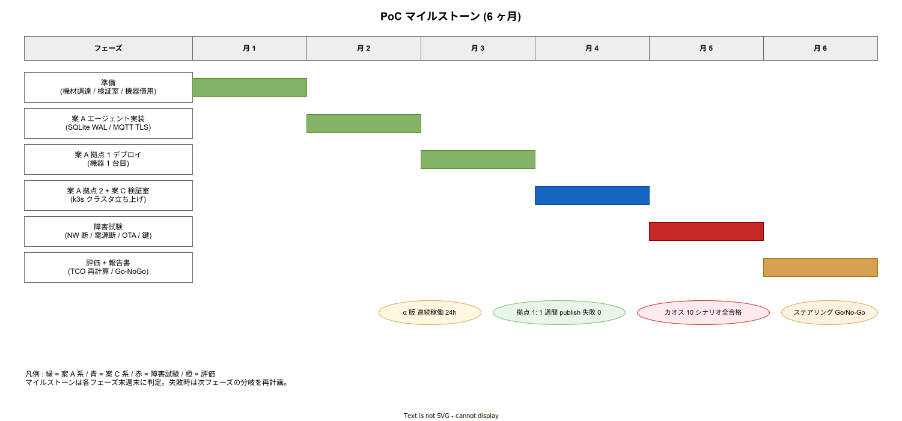

# PoC 計画

## 目的

本フォルダの 00〜05 で整理した 3 案を実機で検証し、本番採用の Go/No-Go を判定するための PoC (Proof of Concept) 計画を定める。本ドキュメントは PoC のスコープ・期間・予算・成功条件・成果物を明記し、担当チームがそのまま実行に移せる粒度を持つ。

PoC の目的は以下に集約される。

1. RS-232C / RS-485 機器に対するエージェントの **互換性** を実機で確認する。
2. ストア&フォワード・OTA・観測パイプラインが **設計どおり機能する** ことを実証する。
3. **TCO 仮置き値の妥当性** を、現場作業時間・運用工数・帯域消費の実測で裏取りする。
4. 案 A → 案 C の **移行経路の障壁** を早期に発見する。

PoC のゴールは「案を完成させる」ことではなく「**本番展開して許容できないリスクが残っていないかを確認する**」こと。失敗は許容するが、失敗を発見せずに本番展開することは許容しない。

---

## 1. PoC スコープ

### 1.1 含む

- 案 A (エッジエージェント単体) を **2 拠点**で実証。
- 案 C (k3s クラスタ) を **検証室で 1 セット**実証。
- 機器 **3 機種以上** との相互運用試験 (Modbus RTU 1 機種以上、独自プロトコル 1 機種以上を含む、うち **1 機種以上はアクチュエータ (Modbus WRITE 対応)**)。
- ストア&フォワードの **24 時間 NW 断試験**。
- OTA の **canary → fleet** ロールアウト試験。
- セキュリティの **mTLS + 短命証明書ローテ** 実機検証。
- 観測パイプラインの **実拠点 → tier1** 経路実証。
- **下り command 経路の双方向実証**: tier2 模擬クライアントから `k1s0.PubSub.Publish("edge.device.command", cmd)` → tier1 Edge.Dispatcher → EMQX → Pi → Modbus WRITE → `command.ack` までの一連動作を連続 7 日試験。cmd envelope の ed25519 署名検証・idempotency_key による二重実行防止・timeout 時の ack 返却の 3 項目を含む ([`02_エッジソフトウェアと通信設計.md §6.1`](./02_エッジソフトウェアと通信設計.md) / [`03_セキュリティと認証.md §4.3.1`](./03_セキュリティと認証.md))。

### 1.2 含まない

- 案 B (Dapr サイドカー) は単独 PoC を実施せず、案 A の延長で Dapr Component を追加投入する補助試験のみ。
- 産業用代替ボード (Moxa / IOT2050 等) の評価。Pi 互換性の確認のみで、別ボード PoC は別段階。
- 30 拠点規模のスケール試験。机上 + 数値モデル ([`07_定量モデル.md`](./07_定量モデル.md)) で代替。
- AI 推論のエッジ実行。採用後の運用拡大時の検証範囲。
- 他社 SCADA / MES との完全統合。プロトコル変換のみ実証。

### 1.3 在庫前提

PoC 開始時点で揃っているべき物品。発注リードタイムは [`01_物理層とハードウェア.md`](./01_物理層とハードウェア.md) を参照。

| 物品 | 数量 | 用途 |
|---|---|---|
| Pi 4B 8GB | 6 台 | 案 A × 2 拠点 + 案 C × 3 ノード + 予備 1 |
| USB-RS485 変換 (FTDI) | 4 個 | 各拠点 + 検証室 |
| USB-RS232 変換 (FTDI) | 4 個 | 同上 |
| 産業 microSD 64GB | 8 枚 | 機材 + 予備 |
| UPS HAT (PiJuice 等) | 6 個 | 全 Pi 分 |
| ATECC608B HAT | 6 個 | セキュリティ実証 |
| 機器シミュレータ (`diagslave` 起動 PC) | 1 台 | 検証室 |
| 実機機器 (借用) | 3 機種以上 | ユーザー側手配 |

---

## 2. 期間と段階

PoC 全体期間は **6 ヶ月 (2026 H1)**。月次マイルストーンを以下に置く。



| 月 | 段階 | 主要アクティビティ | 完了基準 |
|---|---|---|---|
| 1 | 準備 | 機材調達、検証室セットアップ、機器 1 台目借用 | 案 A エージェントが localhost broker に publish できる |
| 2 | 案 A 実装 | エージェント α 版実装、SQLite WAL、MQTT TLS | エージェント が 24h 連続稼働 |
| 3 | 案 A 拠点 1 | 拠点 1 にデプロイ、機器 1 台目接続 | 1 週間連続で publish 失敗 0 |
| 4 | 案 A 拠点 2 + 案 C 検証室 | 拠点 2 デプロイ + 検証室 k3s 立上げ | 案 C で同等機能再現 |
| 5 | 障害試験 | 通信断 / 電源断 / OTA / 鍵ローテ | 全シナリオ合格 |
| 6 | 評価 + 報告書 | TCO 実測値で再計算、Go/No-Go 判定 | ステアリング承認 |

各月のレビューは月末週、ステアリング (役員・ユーザー側責任者参加) は隔月とする。

### 2.1 マイルストーン依存関係

```text
M1 機材調達 → M2 案 A α 実装 → M3 拠点 1 デプロイ
                                 ↓
                                 → M4 拠点 2 + 案 C 検証室
                                                ↓
                                                → M5 障害試験 → M6 報告
```

M3 で「機器互換性 NG」が判明した場合、M4 以降をスキップしハードウェア変更検討に切替える分岐を持つ。

---

## 3. 成功条件 (Go/No-Go 基準)

PoC 完了時点で以下の **必須項目すべてを満たし、努力項目を 70 % 以上満たす** ことを Go の最低条件とする。

### 3.1 必須項目 (1 つでも未達なら No-Go)

| # | 項目 | 判定 |
|---|---|---|
| MUST-1 | 機器 3 機種以上で、3 営業日以上の連続データ取得が成功 | 通算欠落率 < 0.1 % |
| MUST-2 | 24h NW 断後の自動復旧で電文欠落 0 | tier1 受信ログとエッジ送信ログの完全一致 |
| MUST-3 | OTA で canary → fleet の自動ロールバックが機能 | 故意失敗 bundle で 5 分以内に旧版に戻る |
| MUST-4 | mTLS 短命証明書 (24h) の自動ローテが連続 7 日成功 | 切れによる publish 失敗 0 |
| MUST-5 | 観測パイプラインで Prometheus / Loki / Tempo 全系統に到達 | 各系統で実データ確認 |
| MUST-6 | 全データが tier1 で **idempotency key により重複排除** される | 1000 件投入 → tier1 で 1000 件確認 |
| MUST-7 | 下り command が tier2 発行 → Pi 実行 → ack 返却で完結する | 100 件投入 → 100 件 ack 受信 / 改竄した偽 command 10 件は `signature_mismatch` で全件拒否 |
| MUST-8 | command の二重実行が Pi 側 idempotency で抑止される | 同一 `idempotency_key` 10 回再送 → Modbus WRITE は 1 回のみ / ack は 10 回とも正常 |

### 3.2 努力項目 (70 % 以上で Go)

| # | 項目 | 判定 |
|---|---|---|
| SHOULD-1 | publish RTT p95 が SLO 内 (LAN 200 ms / VPN 1.5 s) | Prometheus 計測値 |
| SHOULD-1a | command RTT p95 (tier2 発行 → Pi ack 受信) が LAN 500 ms / VPN 2.5 s 以内 | Prometheus 計測値 |
| SHOULD-2 | エージェント RAM 使用量 < 256 MB | 7 日連続観測で max < 256 MB |
| SHOULD-3 | 案 C で k3s クラスタが 7 日連続稼働、leader election 0 回 | etcd ログ |
| SHOULD-4 | tamper 検知 → 鍵自動失効まで 60 秒以内 | 模擬筐体開封試験 |
| SHOULD-5 | OTA bundle サイズ < 100 MB | mender artifact サイズ |
| SHOULD-6 | TCO 仮置き値 (3.1 節 [`05`](./05_3案の深掘り評価.md)) と実測差分 ±20 % 以内 | 実測工数記録 |
| SHOULD-7 | カオステスト 10 シナリオ全合格 | [`04`](./04_運用ライフサイクルと観測性.md) 11 節 |
| SHOULD-8 | ユーザー側現場担当が単独で機器追加できる | OJT 合意 |
| SHOULD-9 | OPC UA 機器 1 台で接続実証 (任意) | プロトコル拡張余地確認 |
| SHOULD-10 | Pi セカンドソース (Radxa Rock) で同等動作 | 互換性確認 |

### 3.3 Go の場合の次工程

PoC 完了 → 8〜12 週で本番初年度 (5〜10 拠点) のロールアウト計画を策定し、リリース時点 として 採用初期と並走する。

### 3.4 No-Go の場合の判断分岐

- **機器互換性 NG**: 産業用代替ボードの再 PoC、または k1s0 非採用判断 (PC 維持) を申請。
- **TCO 大幅超過 (+50 % 以上)**: 案見直し (案 A → 案 C 直送、もしくは外部 IoT プラットフォーム購入比較)。
- **セキュリティ要件未達**: コンプライアンス側との再協議、運用補償統制で穴埋め可否確認。

---

## 4. 予算

PoC 全体 6 ヶ月の所要予算。

### 4.1 ハードウェア

| 項目 | 単価 | 数量 | 小計 |
|---|---|---|---|
| Pi 4B 8GB + ケース + 電源 | 1.2 万 | 6 | 7.2 万 |
| USB-Serial 変換 (各種) | 0.5 万 | 8 | 4.0 万 |
| 産業 microSD 64GB | 0.4 万 | 8 | 3.2 万 |
| UPS HAT | 1.0 万 | 6 | 6.0 万 |
| ATECC608B HAT | 0.4 万 | 6 | 2.4 万 |
| 検証室ネットワーク機器 (L2 SW + 簡易 FW) | — | 1式 | 8.0 万 |
| ケーブル / 結線材 / 工具 | — | 1式 | 4.0 万 |
| ハードウェア小計 | — | — | **34.8 万** |

### 4.2 ソフトウェア / クラウド / OSS サポート

| 項目 | 期間 | 小計 |
|---|---|---|
| Mender OSS 自前ホスト用クラウド VM (PoC 期間) | 6 ヶ月 | 6.0 万 |
| MinIO / Loki / Prometheus 用 PoC ストレージ | 6 ヶ月 | 4.0 万 |
| Cosign / Sigstore (OSS、無償) | — | 0.0 万 |
| OpenBao OSS (無償) | — | 0.0 万 |
| 小計 | — | **10.0 万** |

### 4.3 人件費

| ロール | 人日 | 単価 | 小計 |
|---|---|---|---|
| 設計 (アーキテクト) | 20 人日 | 12 万 | 240 万 |
| 実装 (Rust / Go エンジニア) | 60 人日 | 8 万 | 480 万 |
| インフラ (k3s / Mender) | 30 人日 | 8 万 | 240 万 |
| セキュリティ (mTLS / OpenBao 連携) | 15 人日 | 10 万 | 150 万 |
| 現場対応 / 結線 / OJT | 20 人日 | 6 万 | 120 万 |
| プロジェクト管理 | 12 人日 (週 0.5 人日 × 24 週) | 8 万 | 96 万 |
| 人件費小計 | 157 人日 | — | **1,326 万** |

### 4.4 合計

| 区分 | 金額 |
|---|---|
| ハードウェア | 34.8 万 |
| ソフトウェア / インフラ | 10.0 万 |
| 人件費 | 1,326 万 |
| 予備費 (10 %) | 137 万 |
| **PoC 総額** | **約 1,508 万** |

うち 90 % 弱が人件費。**ハードコストではなく工数で勝負が決まる** のが本 PoC の特性。コスト圧縮の余地は (1) 案 C の検証室セットアップを後ろ倒し、(2) 障害試験を staging 環境に集約、(3) PM を兼務、で 200〜300 万削減可。

---

## 5. 体制

### 5.1 ロール定義

| ロール | 主担当業務 | 必要スキル |
|---|---|---|
| アーキテクト | 全体設計、ADR 起草、ステアリング報告 | k1s0 全体観、IoT 経験 |
| エッジリード (Rust/Go) | エージェント実装、SQLite outbox | tokio / paho、SQL |
| インフラリード (k3s/Mender) | 案 C 構築、Mender セットアップ | k8s、Linux SRE |
| セキュリティリード | mTLS、OpenBao、IEC 62443 適合 | PKI、OpenBao、暗号 |
| 現場担当 (パートナー社) | 結線、OJT、障害対応 | 産業現場経験 |
| プロジェクトマネージャ | 進捗管理、リスク管理 | アジャイル、SIer 経験 |

### 5.2 RACI

| アクティビティ | アーキ | エッジ | インフラ | セキュ | 現場 | PM |
|---|---|---|---|---|---|---|
| 設計レビュー | A,R | C | C | C | I | I |
| エージェント実装 | C | A,R | I | C | I | I |
| 案 C 構築 | C | I | A,R | C | I | I |
| mTLS / 鍵管理 | C | C | I | A,R | I | I |
| 拠点デプロイ | C | C | C | I | A,R | I |
| 障害試験 | C | R | R | R | C | A |
| ステアリング報告 | A,R | I | I | I | I | C |

(A: 説明責任、R: 責任実行、C: 協議、I: 報告)

### 5.3 体制図とコミュニケーションの場

- ステアリング: 隔月、役員 + ユーザー責任者 + アーキテクト。
- 進捗ミーティング: 週 1 回、全員。
- 技術勉強会: 月 1 回、現場担当向け OJT。
- 障害時: Slack `#k1s0-edge-poc` で即時連絡、重大時は電話。

---

## 6. リスクと対策

| リスク | 確率 | 影響 | 対策 |
|---|---|---|---|
| 機器の借用が遅れ、M3 開始が遅延 | 中 | 大 | M1 開始時点で借用契約締結、シミュレータで先行開発 |
| Pi 5 への切替が必要 (Secure Boot 要件) | 低 | 中 | 在庫リードタイム確認、必要に応じ M4 で切替 |
| Mender OSS の機能不足発覚 | 中 | 中 | M3 で Enterprise 機能差分を確認、必要なら ROI 再計算 |
| 拠点 NW 帯域が想定下回る | 中 | 中 | M3 で実測、サンプリング率調整で吸収 |
| 鍵管理の運用設計が複雑化 | 中 | 中 | OpenBao テンプレートを早期に固める、3 節 SHOULD-4 で検証 |
| 現場担当の技術ハードルが高い | 中 | 大 | OJT を M3 から開始、ランブック 20 件を先行整備 |
| ユーザー側責任者の判断遅延 | 中 | 大 | ステアリング前に技術合意を済ませる |
| 案 C の k3s 障害頻発 | 中 | 大 | 4 節 [`05`](./05_3案の深掘り評価.md) の既知問題対策を事前適用 |

---

## 7. 成果物

PoC 完了時点で以下を提出する。

| 成果物 | 形式 | 提出先 |
|---|---|---|
| エッジエージェント α 版 | リポジトリ + バイナリ | 内部 GitHub |
| Mender bundle 配布手順 | TechDoc | Backstage |
| k3s クラスタ構築手順 | TechDoc | Backstage |
| ランブック 20 件 | TechDoc | Backstage |
| 障害試験報告書 (10 シナリオ) | PDF + 動画 | ステアリング |
| TCO 実測値レポート | スプレッドシート | ステアリング |
| Go/No-Go 提案書 | PDF | ステアリング |
| 本フォルダ内ドキュメントの最終更新 | Markdown | 本リポジトリ |
| ADR 起草 (採用案、配置形態、OTA 系) | Markdown (`docs/00_ADR/`) | 本リポジトリ |

---

## 8. 関連ドキュメント

- [`README.md`](./README.md) — 全体俯瞰
- [`01_物理層とハードウェア.md`](./01_物理層とハードウェア.md) — 機材選定
- [`02_エッジソフトウェアと通信設計.md`](./02_エッジソフトウェアと通信設計.md) — 実装スケルトン
- [`03_セキュリティと認証.md`](./03_セキュリティと認証.md) — mTLS / OpenBao 設計
- [`04_運用ライフサイクルと観測性.md`](./04_運用ライフサイクルと観測性.md) — Mender / SLO / カオス
- [`05_3案の深掘り評価.md`](./05_3案の深掘り評価.md) — TCO の元データ
- [`07_定量モデル.md`](./07_定量モデル.md) — Modbus サイクル / 帯域試算
- [`08_ヒアリングシート.md`](./08_ヒアリングシート.md) — ユーザー確認事項
