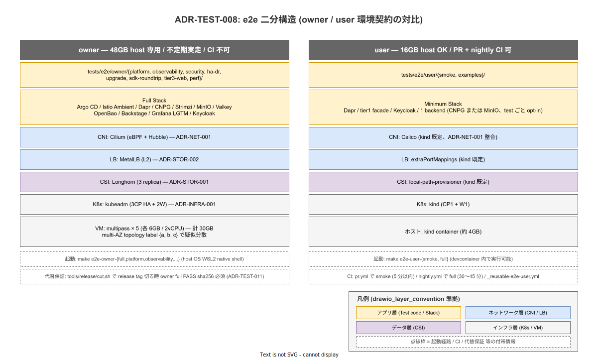

# ADR-TEST-008: e2e テストを owner / user の 2 系統に物理分離し、環境契約で各系統の責務を固定する

- ステータス: Proposed
- 起票日: 2026-05-03
- 決定日: -
- 起票者: kiso ryuhei
- 関係者: 起案者 / 採用検討組織 / 利用者（採用初期）

## コンテキスト

前 ADR-TEST-002（撤回済）は「k1s0 OSS としての完成度検証」と「利用者の自アプリ動作確認」を 1 つの e2e suite に統合する設計だったが、両者は要求する fidelity と host リソースが質的に異なるため、共通 suite では破綻する。本 ADR では 2 系統に物理分離し、各系統の環境契約と CI 経路を正典化する。

実環境の制約として、k1s0 の e2e テスター（実行者）は質的に分離可能な 2 種類が存在する:

- **オーナー（k1s0 開発者）**: 実行端末は WSL2 + 48GB RAM。k1s0 が OSS として完璧に動くか（CNCF Conformance / 4 言語 SDK の cross-product / 観測性 5 検証 / HA / DR / upgrade drill / security policy 強制）を確認する。本番設計（kubeadm + Cilium + Longhorn + MetalLB）の再現が必要。
- **利用者（k1s0 でアプリを開発する開発者）**: 実行端末は WSL2 + 16GB RAM。自分の tier2/tier3 が k1s0 SDK 越しに正しく tier1 を呼べるかを確認する。本番再現は不要だが、k1s0 install と SDK 動作の最小保証が必要。

両者を共通 e2e suite で扱うと以下が破綻する:

- 16GB host で multipass + kubeadm + Cilium + Longhorn + MetalLB + フルスタックは起動不可（VM 5 × 6GB = 30GB の時点で host RAM を超過）
- 48GB host で kind + minimum stack だけを走らせると、Cilium eBPF / Longhorn replication / MetalLB / multi-AZ 制約が一切検証範囲から漏れ、ADR-INFRA-001 / ADR-NET-001 / ADR-STOR-001 / 002 の本番設計が空洞化
- 共通テスト code path に「16GB の場合は skip」「48GB の場合は強化」のような skip タグを散布すると、テスト網羅性が host 環境に依存する形で隠蔽され、採用検討者が「k1s0 が何を保証しているか」を直読できなくなる

加えて、e2e suite を CI で機械検証する経路も両者で異なる:

- owner full は multipass を要するが、GitHub Actions runner は nested virtualization が利用できず multipass を起動不可（既存 `docs/40_運用ライフサイクル/portability-results.md` で検証済の制約）。CI 不可
- user smoke / full は kind なので Actions runner で動く。CI 可

設計上の制約と前提:

- WSL2 RAM: owner 48GB / 利用者 16GB（host CPU は採用組織の購入で大きく変動するため固定しない）
- multipass は WSL2 内 devcontainer では nested virt 不可、host OS の WSL2 native shell で実行
- 4 言語 SDK（Go / Rust / .NET / TypeScript）の cross-product（4 言語 × 12 RPC = 48 ケース）は owner 側でのみ網羅検証
- ADR-TEST-001（Test Pyramid）の最上位 E2E 層（5%）の中身が本 ADR の射程
- ADR-TEST-003（CNCF Conformance / Sonobuoy）は L5 として並立、本 ADR は L4 を扱う
- ADR-INFRA-001（kubeadm + Cluster API）/ ADR-NET-001（CNI 選定）/ ADR-STOR-001（Longhorn）/ ADR-STOR-002（MetalLB）の本番設計が owner 環境に投影される
- ADR-POL-002（local-stack を構成 SoT に統一）の射程を本 ADR で e2e 領域に拡張する

選定では以下を満たす必要がある:

- **オーナーの OSS 完成度検証要求**: 本番再現スタックで 4 言語 SDK / 観測性 / security / HA / DR / upgrade を網羅
- **利用者の 16GB 制約**: kind + minimum stack で k1s0 install + 自アプリの round-trip が動く
- **CI 機械検証**: 利用者向けは PR / nightly で自動実行、オーナー向けは別経路で代替保証
- **採用検討者の透明性**: オーナーが何を検証し、利用者が何を検証するかを公開ドキュメントから直読できる
- **個人 OSS の運用工数**: 起案者 1 人で両系統を維持できる射程

## 決定

**e2e テストを `tests/e2e/owner/`（オーナー専用、本番再現フルスタック）と `tests/e2e/user/`（利用者向け、kind + minimum stack）に物理分離し、各系統の環境契約を本 ADR で正典化する。** 両系統は別 Go module（`go.mod` 分離）として管理し、起動経路は `tools/e2e/owner/up.sh` と `tools/e2e/user/up.sh` の専用スクリプトに完全分離する。CI 経路は owner = CI 不可、user = PR / nightly で機械検証で構造的に分ける。`tools/local-stack/up.sh --role` の cone profile 引数（docs-writer / tier1-go-dev 等の 10 役、ADR-DIR-003）と e2e cluster orchestration は概念が異なるため、別エントリで物理分離する。

owner / user の環境契約は、host RAM（48GB / 16GB）を起点に K8s 実装・CNI・CSI・LB・Stack 規模・テストディレクトリ・CI 経路の全層で対称な対比構造を取る。下図に各層の対比と起動経路 / 代替保証の関係を集約する。



### 1. ディレクトリ配置

```text
tests/e2e/
├── owner/                              # 48GB host 専用
│   ├── platform/                       # tier1 12 service 機能検証
│   ├── observability/                  # 5 検証（trace 貫通 / cardinality / log↔trace / SLO alert / dashboard goldenfile）
│   ├── security/                       # Kyverno deny / NetworkPolicy / SPIRE / Istio mTLS STRICT
│   ├── ha-dr/                          # 3CP HA 切替 / etcd snapshot 復旧 / CNPG barman-cloud 復旧
│   ├── upgrade/                        # kubeadm N→N+1 drill
│   ├── sdk-roundtrip/                  # 4 言語 × 12 RPC = 48 cross-product
│   ├── tier3-web/                      # chromedp で headless Chrome 駆動
│   ├── perf/                           # k6 spawn を Go test がラップ
│   └── go.mod
└── user/                               # 16GB host OK
    ├── smoke/                          # k1s0 install が正常か（最初に走らせる）
    ├── examples/                       # examples/tier2-* / tier3-* の動作確認
    └── go.mod
```

`go.mod` を 2 module に分離する理由は 3 点ある。第一に、owner suite が依存する重量ライブラリ（chromedp / k6 wrapper / multipass orchestrator）を user suite に持ち込まないことで、利用者の clone 量と build 時間を絞る。第二に、利用者が sparse checkout で `tests/e2e/user/` のみを取得する経路を成立させ、ADR-DIR-003（sparse-checkout cone mode）の射程と整合させる。第三に、両 module の依存 version 競合（例: testcontainers の major 差）を独立に許容することで、片方の進化が他方を阻害しない構造にする。

### 2. owner 環境契約（48GB host 専用）

`tools/e2e/owner/up.sh`（新設）で本番再現スタックを起動する。各要素は本番設計の ADR を直接投影する。フルスタックの helm values / manifests は `tools/local-stack/install/<component>/` を install helper として再利用し（ADR-POL-002 の cluster 構成 SoT を尊重）、orchestration（multipass 起動 / kubeadm / 起動順序）は本 owner 専用 script に閉じる。

| 要素 | 採用 | 出典 ADR |
|---|---|---|
| VM | multipass × 5（control-plane 3 HA + worker 2、各 6GB RAM / 2 vCPU） | ADR-INFRA-001（3CP HA + Cluster API） |
| K8s | kubeadm（pkgs.k8s.io 公式 repo） | ADR-INFRA-001 |
| CNI | Cilium（eBPF + Hubble） | ADR-NET-001（production = Cilium） |
| CSI | Longhorn（3 replica） | ADR-STOR-001 |
| LB | MetalLB（L2 モード） | ADR-STOR-002 |
| AZ topology | node label `topology.kubernetes.io/zone={a,b,c}`（疑似 multi-AZ） | （独自、本 ADR で確定） |
| フルスタック | Argo CD / Istio Ambient / Dapr / CNPG / Strimzi / MinIO / Valkey / OpenBao / Backstage / Grafana LGTM / Keycloak | ADR-POL-002 SoT |

実行は **host OS の WSL2 native shell** から行う（devcontainer 内では multipass 起動不可）。リソース内訳は VM 5 × 6GB = 30GB、フルスタック稼働時 12GB、host OS + dev tools 6GB の合計約 48GB で、48GB host の上限ぎりぎりとなる。HA 検証時の Pod 一時増加で OOM が発生するリスクがあるため、実走時の dmesg 監視を Runbook で必須化する。

### 3. user 環境契約（16GB host OK）

`tools/e2e/user/up.sh`（新設）で k1s0 install の最小成立形を起動する。kind 既存設計（ADR-NET-001 の「kind multi-node = Calico」）と整合させる。minimum stack の helm values / manifests は owner と同じく `tools/local-stack/install/<component>/` を再利用し、orchestration（kind 起動 / 任意 stack の opt-in 制御）は本 user 専用 script に閉じる。

| 要素 | 採用 | 根拠 |
|---|---|---|
| K8s | kind（control-plane 1 + worker 1、kind デフォルト） | 16GB 制約に収まる最小構成 |
| CNI | Calico | ADR-NET-001（kind multi-node = Calico） |
| CSI | local-path-provisioner（kind デフォルト） | 16GB 制約 |
| LB | extraPortMappings（kind デフォルト） | 16GB 制約 |
| 必須 stack | Dapr + tier1 facade + Keycloak + 1 つの backend（CNPG または MinIO、test 内容に応じて） | k1s0 install の最小成立形 |
| 任意 stack | 上記以外は test ごとに opt-in | 16GB 制約 |

リソース内訳は kind cluster 4GB、必須 stack 2GB、利用者の自アプリ dev 4GB、host OS + dev tools 6GB の合計約 16GB。任意 stack（Grafana LGTM / Backstage 等）は test ごとに opt-in で起動するが、複数同時起動で 16GB を超える可能性があり、test 設計時に同時起動数を制約する。

### 4. 起動経路（Makefile target）

owner / user の起動を Makefile target で正規化し、起動経路を機械化する。

```text
make e2e-owner-full         # multipass + kubeadm + フル → tests/e2e/owner/... 全件
make e2e-owner-platform     # tests/e2e/owner/platform/ のみ
make e2e-owner-observability
make e2e-owner-ha-dr
make e2e-owner-upgrade
make e2e-owner-sdk-roundtrip
make e2e-owner-tier3-web
make e2e-owner-perf
make e2e-user-smoke         # kind + minimum stack → tests/e2e/user/smoke/
make e2e-user-full          # kind + tests/e2e/user/ 全件
```

owner 系 target は `tools/e2e/owner/up.sh` を呼び、user 系 target は `tools/e2e/user/up.sh` を呼ぶ。owner / user は別 script に物理分離されており、相互影響なく独立進化できる構造。owner / user 共通の helper（kubectl wait / artifact 集約 / sha256 計算等）は `tools/e2e/lib/` に括り出し、両 script から source して再利用する。

`tools/qualify/portability/run.sh` の multipass ロジックは `tools/e2e/owner/up.sh` に統合して二重管理を避ける。portability 検証は owner suite の subset として再定義し、`docs/40_運用ライフサイクル/portability-results.md` に本 ADR との relate-back を追記する。

`tools/local-stack/up.sh --role` の引数空間は cone profile（docs-writer / tier1-go-dev 等の 10 役、ADR-DIR-003）専用に維持し、e2e cluster orchestration は混入させない。これにより「sparse-checkout 役割」と「e2e 環境種別」という別概念が同じ argument 空間に同居しない設計を担保する。

### 5. CI 戦略

CI 経路は owner / user で明確に分ける。owner は CI 不可（multipass 不可）であり、user のみが CI で機械検証される。

| Workflow | 起動 | 内容 |
|---|---|---|
| `pr.yml` | PR 毎 | path-filter で `tests/e2e/user/smoke/` のみ kind 実行（5 分以内） |
| `_reusable-e2e-user.yml`（新設） | nightly cron + workflow_dispatch | `tests/e2e/user/` 全件、kind + Dapr + tier1 facade |
| `nightly.yml`（再構築） | 03:00 JST cron | `_reusable-e2e-user.yml` を呼ぶ + 既存 `_reusable-conformance.yml` 連動枠 |
| owner full | localhost 専用 | CI 不可、Runbook 手動実行、結果を `owner-e2e-results.md` に記録 |

owner full を CI で走らせないことの代替保証は別 ADR（ADR-TEST-011）で扱う。release tag を切る時に `tools/release/cut.sh` で owner full PASS 証跡を必須化することで、release tag という決定的瞬間に owner full の鮮度を物理的に紐付ける。

### 6. 起動頻度

owner full は **不定期実走** とする。Runbook で例示する起動契機は (a) release tag を切る前、(b) k8s minor version upgrade 前、(c) 4 言語 SDK の major 改訂後、(d) tier1 12 service の互換破壊変更後の 4 つで、cron 起動はせず、起案者の判断で実走する。不定期にする理由は個人 OSS の運用工数に整合させるためで、cron 起動だと 1 回 1 時間 45 分の所要時間が起案者の judgment なしに発生し、無駄走行が累積する。

user full は nightly cron で全件、user smoke は PR 毎に path-filter 経由で実行する。CI 機械検証の射程はこの 2 経路に限定する。

### 7. テスト言語

両系統とも基本は **Go test** で統一する。例外は tier3-web のみで、owner / user で二重提供する:

- `tests/e2e/owner/tier3-web/`: Go test + chromedp（headless Chrome 駆動、owner が OSS としての tier3 web 動作を本番再現で検証）
- `src/sdk/typescript/test-fixtures/` 経由の利用者側検証: TypeScript + Vitest + Playwright（利用者が自アプリ repo で書く、本 ADR の射程外、ADR-TEST-010 で扱う）

二重提供の理由は、tier3-web 開発者は通常 Playwright / Cypress を使うため利用者向けには TS で fixtures を提供する一方、owner 自身の tier3-web 動作確認は他の owner suite と同じ Go test に揃える方が test orchestration（前後の tier1 / tier2 状態確認）が一貫するためである。同じ flow を 2 言語で書く工数は発生するが、それぞれの利用者層に最適な test framework を提供する価値で正当化する。

## 検討した選択肢

### 選択肢 A: owner / user 二分 + 環境契約（採用）

- 概要: `tests/e2e/owner/` と `tests/e2e/user/` を物理分離し、別 module / 別起動経路 / 別 CI 経路で運用
- メリット:
  - owner / user の責務が物理的に分離され、採用検討者がディレクトリ構造から「何をオーナーが検証し、何を利用者が検証するか」を直読できる
  - 16GB 制約と 48GB 制約が起動経路（`--role` 引数）として固定され、host 環境制約がテスト code path に漏れない
  - CI 機械検証が user 側で成立し、owner 側は不定期実走で本番再現性を担保（責務分担が明示される）
  - 4 言語 SDK の cross-product を owner 側に集約することで、利用者側の clone 範囲（sparse checkout）を絞れる
  - ADR-INFRA-001 / ADR-NET-001 / ADR-STOR-001 / 002 の本番設計が owner 環境に直接投影される
- デメリット:
  - 共通テスト項目（tier1 facade の round-trip 等）を 2 module で重複実装する余地（mitigation: ADR-TEST-010 で `src/sdk/<lang>/test-fixtures/` を共通 helper として提供）
  - owner / user の責務境界が曖昧な test（例: SDK retry 動作）でどちらに置くかの判断が継続発生（mitigation: 採用初期で `02_test_layer_responsibility.md` 改訂時に判定基準を明文化）

### 選択肢 B: 単一 e2e suite + 環境制約タグで切替

- 概要: `tests/e2e/` 1 module に統合し、`@owner-only` `@user-ok` のような build tag で host 環境別に skip
- メリット:
  - module 数が 1 つで保守がシンプル
  - 共通テスト項目の重複ゼロ
- デメリット:
  - **テスト網羅性が host 環境依存で隠蔽される**: 採用検討者が「16GB host で実行した結果が PASS」と「48GB host で実行した結果が PASS」を区別できず、何を保証しているかの透明性が崩壊
  - 16GB host で `@owner-only` test が大量に skip されると CI で機械検証できる範囲が見えにくくなり、リリース品質の判定基準がぶれる
  - go.mod が 1 つだと chromedp / multipass orchestrator のような重量依存を全 contributor が clone する射程に含む
  - sparse checkout で「user だけ clone したい」が成立しない（ADR-DIR-003 の射程と矛盾）

### 選択肢 C: owner suite を別 repo に隔離

- 概要: owner suite を `k1s0-owner-e2e` のような別 repo に切り出し、本 repo には user suite のみ残す
- メリット:
  - 利用者が本 repo を clone する時の射程が小さくなる
  - owner suite の依存（multipass orchestrator / chromedp / k6）が本 repo の go.mod に紛れ込まない
- デメリット:
  - **OSS 完成度検証の透明性が下がる**: 採用検討者が k1s0 repo を見ても、オーナーが何を検証しているか直接読めない（別 repo を辿る必要）
  - ADR / 設計書が本 repo にあるのに、検証 code は別 repo にある状態で SoT が割れる
  - 別 repo の release / version 同期が継続コストとして発生（test-fixtures の SDK 同期、ADR-TEST-010 と矛盾）
  - 起案者 1 人運用で repo を 2 つ維持する負荷増

### 選択肢 D: owner 視点を捨て、user suite のみ提供（前 ADR-TEST-002 の射程継続）

- 概要: owner 側の本番再現検証を諦め、kind + フルスタックの user suite のみを提供
- メリット:
  - 16GB / 48GB の差を考慮しなくてよい
  - CI 機械検証の射程が単一で、運用がシンプル
- デメリット:
  - **本番再現検証が一切できない**: Cilium eBPF / Longhorn replication / MetalLB / multi-AZ 制約が一切検証範囲から漏れ、本番リリース後に発見される
  - 4 言語 SDK の cross-product を kind 単一 cluster で網羅すると CI 時間予算（nightly 30 分）を超過
  - HA / DR / upgrade drill が物理的に検証不可（kind は単一 host 内）
  - ADR-OBS-001 / 002 / 003（Grafana LGTM / OTel / インシデント分類）の決定が本番再現スタックなしでは実証できず、決定が空洞化

## 決定理由

選択肢 A（owner / user 二分 + 環境契約）を採用する根拠は以下。

- **テスト網羅性の透明性**: ディレクトリ構造（`owner/` / `user/`）が責務分界そのものを表現し、採用検討者が k1s0 repo を読むだけで「何を保証しているか」を直読できる。選択肢 B（タグ切替）はこの透明性を host 環境依存で破壊し、選択肢 C（別 repo）は owner 側の SoT を本 repo から切り離す
- **環境制約の構造的吸収**: owner 48GB / 利用者 16GB の物理制約を `tools/local-stack/up.sh --role` 引数で吸収する設計は、後付けの skip タグや条件分岐より cleaner。host 環境別のテスト網羅性が機械的に確定し、何を保証しているかの判定基準が ADR レベルで固定される
- **CI 機械検証の射程確定**: user 側は CI で nightly 全件 PASS が機械検証され、owner 側は別経路で代替保証（ADR-TEST-011 で扱う release tag ゲート）。両経路の役割分担が ADR レベルで固定されることで、リリース品質の判定基準がぶれない
- **個人 OSS の運用工数整合**: 起案者 1 人で 2 module を維持する負荷は、選択肢 C（2 repo 維持）より低く、選択肢 B（共通 module だが skip タグ網羅）の網羅性確認工数より低い。owner full の不定期実走は起案者の判断で頻度を制御でき、cron 起動の機械工数が発生しない
- **利用者 DX 整合**: 選択肢 C（別 repo）だと利用者が「test fixtures を取りに別 repo を覗く」必要があるが、選択肢 A は `src/sdk/<lang>/test-fixtures/` を本 repo の SDK package と同梱する設計（ADR-TEST-010）と直接接続する
- **退路の確保**: 選択肢 A は将来 user suite を拡張する時（例: 利用者の自アプリ scaffold で生成される e2e template の整備）に独立して進化でき、owner suite の射程拡大（例: chaos drill / scale test 追加）も独立して進化できる。両系統の独立性が将来の拡張余地を保つ

## 影響

### ポジティブな影響

- e2e の責務（owner = OSS 完成度検証、user = 自アプリ動作確認）がディレクトリ構造で表現され、採用検討者向けの透明性が確立する
- 16GB / 48GB の host 制約を起動経路（`--role` 引数）で吸収し、host 環境別のテスト網羅性が機械的に確定する
- user 側は CI 機械検証で品質保証され、owner 側は不定期実走 + release tag ゲートで代替保証されることで、両経路の責務が ADR レベルで固定される
- ADR-INFRA-001 / ADR-NET-001 / ADR-STOR-001 / ADR-STOR-002 の本番設計が owner 環境で機械検証され、決定の空洞化が防がれる
- `tools/local-stack/up.sh` が `--role` 引数で SoT として 2 系統を吸収することで、ADR-POL-002（local-stack を構成 SoT に統一）が e2e 領域でも履行される
- 4 言語 SDK の cross-product 検証が owner 側に集約され、利用者側の clone 範囲（sparse checkout）が絞れる
- `tools/qualify/portability/run.sh` が `tools/e2e/owner/up.sh` の subset として再定義されることで、portability 検証と owner full の二重管理が解消される

### ネガティブな影響 / リスク

- 共通テスト項目（tier1 facade の round-trip 等）が owner / user 両 module で重複実装される余地（mitigation: ADR-TEST-010 で `src/sdk/<lang>/test-fixtures/` 共通 helper を提供）
- owner full は CI で機械検証されないため、owner の不定期実走に依存する（mitigation: ADR-TEST-011 の release tag ゲートで release 前に必ず PASS 証跡を要求）
- owner full の所要時間（multipass 5 VM 起動 30 分 + 全件実行 60 分 + cleanup 15 分 = 約 1 時間 45 分）が起案者の運用工数として継続発生（不定期実走で頻度を抑える方針）
- owner full のリソースピーク（48GB ぎりぎり）で OOM が発生するリスク。HA / DR drill 中の Pod 一時増加で 48GB を超過する可能性があり、実走時に dmesg 監視を Runbook で必須化
- multipass + kubeadm 構築の 30 分起動コストが、tier3-web の 1 件だけ走らせたい時にも発生（mitigation: cluster は `make e2e-owner-full` 直前に 1 度起動し、部分実行 target は既存 cluster を再利用する経路を Makefile / Runbook で整備）
- 二重提供（tier3-web の Go / TS 二系統）で同じ flow を 2 言語で書く工数が発生（mitigation: `src/sdk/typescript/test-fixtures/` の Playwright fixtures は ADR-TEST-010 で SDK と同梱、利用者向けの提供価値で正当化）
- owner / user の責務境界が曖昧な test の判断が継続発生（mitigation: `02_test_layer_responsibility.md` の改訂で判定基準を明文化）

### 移行・対応事項

- `tools/e2e/owner/up.sh` / `tools/e2e/user/up.sh` を新設し、それぞれ multipass + kubeadm + Cilium + Longhorn + MetalLB + フルスタック起動 / kind + minimum stack 起動を実装。共通 helper は `tools/e2e/lib/`（artifact 集約 / sha256 計算 / kubectl wait 等）に括る。フルスタック / minimum stack の helm values / manifests は `tools/local-stack/install/` 配下を install helper として再利用（cluster 構成 SoT、ADR-POL-002 を尊重）
- `tests/e2e/owner/` と `tests/e2e/user/` のディレクトリ + go.mod を新設し、本 ADR で定義した 9 サブディレクトリ（owner: platform / observability / security / ha-dr / upgrade / sdk-roundtrip / tier3-web / perf、user: smoke / examples）に skeleton を配置
- `Makefile` に `e2e-owner-*` / `e2e-user-*` target を追加（10 target）し、`.PHONY` に登録
- `.github/workflows/_reusable-e2e-user.yml` を新設し、`workflow_call` で `tests/e2e/user/` を走らせる構造で実装
- `.github/workflows/nightly.yml` を新設（旧 nightly.yml は削除済）し、`_reusable-e2e-user.yml` + 既存 `_reusable-conformance.yml` 連動枠を持つ構造で実装
- `.github/workflows/pr.yml` に `tests/e2e/user/smoke/` の path-filter 起動枠を追加
- `tools/qualify/portability/run.sh` の multipass ロジックを `tools/e2e/owner/up.sh` に統合、portability は owner suite の subset として再定義し、`docs/40_運用ライフサイクル/portability-results.md` に relate-back を追記
- `docs/05_実装/30_CI_CD設計/30_quality_gate/02_test_layer_responsibility.md` を改訂し、L4 列の placeholder を本 ADR の決定で埋める（owner = フル本番再現、user = kind minimum）
- `ops/runbooks/RB-TEST-OWNER-E2E-FULL.md` を 8 セクション形式（ADR-OPS-001）で新設し、owner full の起動契機 / 実走手順 / リソース監視 / artifact 保管 / トラブル対応を記載
- `ops/runbooks/RB-TEST-USER-SMOKE.md` を新設し、利用者向けに kind + minimum stack の起動手順を記載、本 repo の README から導線を引く
- `docs/40_運用ライフサイクル/owner-e2e-results.md` / `user-e2e-results.md` を新設し、live document として実走結果を時系列で記録
- `docs/03_要件定義/00_要件定義方針/08_ADR索引.md` の `ADR-TEST-002（撤回 / 再策定予定）` entry を本 ADR を cite する形に更新
- `docs/05_実装/30_CI_CD設計/90_対応IMP-CI索引/01_対応IMP-CI索引.md` に本 ADR の対応 IMP-CI を追記（tools/e2e/{owner,user}/up.sh / make target / reusable workflow）
- 本 ADR を表現する drawio 図（owner / user 環境契約の対比）を `img/e2e_owner_user_bisection.drawio` + `img/e2e_owner_user_bisection.svg` として作成し、本 ADR に埋め込む（本 ADR commit と同 commit で実施、`drawio-authoring` + `figure-layer-convention` Skill 準拠）

## 参考資料

- ADR-TEST-001（Test Pyramid + testcontainers でテスト戦略を正典化）— 本 ADR が L4 を担う
- ADR-TEST-003（CNCF Conformance / Sonobuoy 月次）— L5 並立、owner suite 内で連携
- ADR-TEST-009（観測性 E2E 5 検証 owner only、別 commit で起票予定）— 本 ADR が前提
- ADR-TEST-010（test-fixtures 4 言語 SDK 同梱、別 commit で起票予定）— 本 ADR の利用者 DX を補完
- ADR-TEST-011（release tag ゲート代替保証、別 commit で起票予定）— 本 ADR の owner CI 不可を補完
- ADR-INFRA-001（kubeadm + Cluster API）— owner 環境の本番再現基盤
- ADR-NET-001（CNI 選定: production = Cilium / kind = Calico）— owner = Cilium / user = Calico の根拠
- ADR-STOR-001（Longhorn）— owner 環境の CSI
- ADR-STOR-002（MetalLB）— owner 環境の LB
- ADR-POL-002（local-stack を構成 SoT に統一）— `tools/local-stack/install/` の helm values / manifests を e2e 側 (`tools/e2e/{owner,user}/up.sh`) が install helper として再利用、cluster 構成 SoT は維持しつつ orchestration は分離
- ADR-OPS-001（Runbook 標準化）— RB-TEST-OWNER-E2E-FULL / RB-TEST-USER-SMOKE の形式根拠
- ADR-CNCF-001（vanilla K8s + CNCF Conformance）— owner 環境の K8s 構成根拠
- ADR-DIR-003（sparse-checkout cone mode）— go.mod 分離による sparse checkout 整合
- `docs/05_実装/30_CI_CD設計/30_quality_gate/02_test_layer_responsibility.md` — L4 / L5 責務分界
- `docs/40_運用ライフサイクル/portability-results.md` — multipass + kubeadm の host 制約検証
- 関連 ADR（採用検討中）: ADR-TEST-004（Chaos Engineering）/ ADR-TEST-005（Upgrade / DR drill）/ ADR-TEST-007（テスト属性タグ + 実行フェーズ分離）
