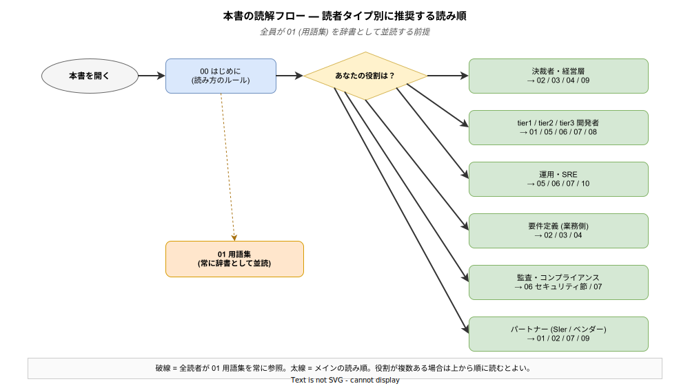

# 00. はじめに

本章では、k1s0 要件定義書全体の **目的・対象読者・記載方針・版管理ルール** を示す。要件そのものは第 4 章以降に記載するため、本章は「本書をどう読み、どう扱うか」を定義するメタ情報である。

要件定義書は「作る人」だけのための資料ではない。承認する経営層、審査する監査担当、後から参画する開発者、パートナー企業のエンジニア — それぞれの立場が異なる関心で本書を読む。そのため本書は「どの章から読めばよいか」「専門用語はどこで解説されているか」「要件の追跡はどうするか」という読解の作法を先に明示しておく必要がある。以下の読解フロー図は、自分の役割に応じてどの章を優先して読むかの目安となる。

全員に共通する前提は **01 用語集を辞書として並読すること** である。本書では専門用語を初出時に一言添えるが、完全な説明は用語集側に集約してあり、途中で不明な語に出会ったら用語集を引き直す読み方を推奨する。

---

## 1. 本書の目的

### 1.1 何のために書くのか

本要件定義書は、マイクロサービス基盤プラットフォーム **k1s0** (けいいちぜろ) の開発・運用に関わる全関係者が **同じ認識を持てるようにするため** に作成する。

具体的には以下の 3 つを目的とする。

1. **合意形成** — 経営層・情シス部門・開発者・運用担当・要件定義担当が「このプラットフォームに何を期待してよいか」を共通理解する。
2. **受け入れ基準の明示** — MVP (Minimum Viable Product: 実用最小限の製品) リリース時に「何が達成できていれば合格か」を前もって合意しておく。
3. **部外者への説明資料** — パートナー企業・監査担当・後から参画するメンバーが、プロジェクトの文脈をゼロから理解できるようにする。

### 1.2 企画書との役割分担

企画書 ([`../01_企画/企画書.md`](../01_企画/企画書.md)) は **なぜ作るのか (Why)** を 10 分で訴求するための経営層向け資料である。本要件定義書は **何を作るのか (What)** を実装・テスト可能な粒度で定義する技術文書である。

| 観点 | 企画書 | 要件定義書 (本書) |
|---|---|---|
| 主読者 | 決裁者・経営層 | 開発者・運用担当・要件定義担当・パートナー |
| 粒度 | サマリレベル (スライド 1 枚で 1 論点) | 検証可能な粒度 (要件 1 つにつき 1 ID) |
| 目的 | 承認を得る | 作るべきものを確定する |
| 版管理 | 承認時点で凍結 | Phase ごとに更新 |

---

## 2. 対象読者

本書は以下の読者を想定して書かれている。**専門知識がない読者も置き去りにしない** ため、専門用語は [`01_用語集.md`](./01_用語集.md) で解説する。

| 読者 | 主に読むべき章 | 読み方のヒント |
|---|---|---|
| **情シス部門の管理職・決裁者** | 02 / 03 / 04 / 09 | 業務上の期待値とスコープを理解する。技術詳細は飛ばしてよい |
| **情シス部門の実務担当** | 全章 | 実装・運用の当事者。制約と前提は必読 |
| **開発者 (tier1 / tier2 / tier3)** | 01 / 05 / 06 / 07 / 08 | 機能要件と非機能要件が直接実装に影響する |
| **運用担当・SRE** | 05 / 06 / 07 / 10 | 非機能要件とリスクが運用設計の入力となる |
| **要件定義担当 (業務部門)** | 02 / 03 / 04 | 業務要件をプラットフォームがどう支援するかを把握する |
| **パートナー企業 (SIer / ベンダー)** | 01 / 02 / 07 / 09 | 前提知識なしでも読めるよう、用語集を辞書として使う |
| **監査担当** | 06 (セキュリティ節) / 07 | コンプライアンス観点の要件と制約を確認する |

---

## 3. 記載方針

### 3.1 平易な言葉で書く

本書は「部外者でもわかりやすい」ことを最優先する。以下のルールを徹底する。

- 専門用語は初出時に **一言で説明** し、`(略称: 正式名称、一言の説明)` の形で示す。例: `k8s (Kubernetes、コンテナオーケストレーションのデファクトスタンダード)`。
- 略称のみでは通じないと判断したら **用語集にリンクする** 。例: `OIDC ([用語集](./01_用語集.md#OIDC))`。
- 英語の原文を無理に訳さない。`マイクロサービス` `コンテナ` `API` などカタカナ・英語が標準化されている語はそのまま使う。
- 比喩や具体例を積極的に用いる。例: 「Kubernetes はアプリの群れを自動で世話する羊飼いのようなソフトウェア」。

### 3.2 要件は検証可能な形で書く

各要件は以下の 4 属性を必ず持つ。

| 属性 | 説明 |
|---|---|
| **ID** | `BR-001` のような一意の識別子。後工程 (設計・テスト) から参照される |
| **要件文** | 「〜できること」「〜であること」の形で記述。曖昧な形容詞 (適切に / 十分に) は使わない |
| **優先度** | MUST / SHOULD / COULD / WON'T |
| **根拠・補足** | なぜその要件が必要か、または関連する企画資料へのリンク |

### 3.3 曖昧表現を避ける

| 禁止表現 | 推奨表現 |
|---|---|
| 「高速に応答する」 | 「p99 レイテンシが 500 ms 以内」 |
| 「大量のデータを扱える」 | 「同時接続 500、メッセージ 10,000 件/秒」 |
| 「セキュアである」 | 「Keycloak OIDC による SSO を利用する」 |
| 「使いやすい UI」 | 「新規ユーザーが初回ログインから 3 クリック以内で目的のアプリを起動できる」 |

### 3.4 図表の扱い

プロジェクト規約 (`CLAUDE.md`) に従い、図表は drawio で作成する。本書では可能な限り **表 (Markdown テーブル)** で表現し、構造図が必要な場合のみ drawio + SVG 埋め込みを用いる。

- ASCII アートによる図表は禁止。
- 図を掲載する場合は、md と同階層の `img/` に `.drawio` と `.svg` を両方格納し、md からは svg を埋め込む。

---

## 4. 要件 ID の扱い

### 4.1 ID の永続性

一度割り当てた ID は **原則として変更しない**。要件が削除された場合も ID を欠番とし、再利用しない。これは以下の理由による。

- 設計書・テスト仕様書・レビュー記録など、後工程の文書が ID で要件を参照するため。
- 要件追跡マトリクス (RTM: Requirements Traceability Matrix) で実装状況を管理するため。

### 4.2 ID のプレフィックス

| プレフィックス | 種別 | 格納ファイル |
|---|---|---|
| `BR-xxx` | Business Requirement (業務要件) | `04_業務要件.md` |
| `FR-xxx` | Functional Requirement (機能要件) | `05_機能要件.md` |
| `NFR-xxx` | Non-Functional Requirement (非機能要件) | `06_非機能要件.md` |
| `CON-xxx` | Constraint (制約条件) | `07_制約条件.md` |
| `ASM-xxx` | Assumption (前提条件) | `08_前提条件.md` |
| `RISK-xxx` | Risk (リスク) | `10_リスクと対応.md` |

### 4.3 番号採番ルール

- 3 桁ゼロパディング (`BR-001` ～ `BR-999`)
- 原則として記載順に昇順採番するが、カテゴリ別にまとまるよう大まかな 10 番刻みのグルーピングを行う (例: `FR-010 ～ FR-019` は認証関連、`FR-020 ～ FR-029` はログ関連など)
- 採番の空きは将来追加のためのバッファとして残してよい

---

## 5. 優先度 (MoSCoW)

本書では MoSCoW 分析 (Must / Should / Could / Won't have) の 4 段階を用いる。

| 優先度 | 意味 | MVP (Phase 1) 扱い | 未達時の影響 |
|---|---|---|---|
| **MUST** | 必達要件 | 必ず達成 | 未達の場合、MVP リリース不可 |
| **SHOULD** | 強く推奨 | 極力対応 | 未達の場合、代替策を合意のうえで先送り可 |
| **COULD** | 対応できれば望ましい | Phase 2 以降で検討 | MVP の成否には影響しない |
| **WON'T** | 今回は対応しない | スコープ外 | (対応しないことが合意事項) |

### 5.1 優先度判定の指針

以下のフローで優先度を決める。

1. **これがなければ k1s0 が k1s0 として成立しない** → MUST
2. **これがなくても MVP は動くが、そのまま本番運用には出せない** → SHOULD
3. **これがなくても本番運用は可能だが、あったほうが便利** → COULD
4. **今回のスコープでは明示的に対応しない (他製品に任せる / 将来的に検討)** → WON'T

---

## 6. Phase 移行ゲート

本要件定義書では Phase 0 から Phase 5 までの段階的デリバリを前提としている（Phase 定義の詳細は [`09_スコープ.md`](./09_スコープ.md) を参照）。各 Phase の完了時に「次の Phase に進んでよいか」を判定するゲートプロセスを定義する。ゲートが形骸化すると、MUST 要件が未達のまま次 Phase に進み、負債が累積する。逆にゲートが過度に官僚的だと Phase 1a → 1b のような短期サイクルが回らなくなる。以下のプロセスは「最小限だが飛ばせない」ラインを定めるものである。

### 6.1 ゲート判定者

| Phase 移行 | 判定者 | 根拠 |
|---|---|---|
| Phase 0 → Phase 1a | 起案者 + 情シス管理職 | 企画承認 (稟議) が Phase 0 の定義。管理職の承認なしに VM 調達・工数投入は不可 |
| Phase 1a → Phase 1b | 起案者 (セルフジャッジ) | 1 名体制の Phase 1a では起案者自身が唯一の判定者。ただし判定記録は残す |
| Phase 1b → Phase 2 | 起案者 + 情シス管理職 + パイロット部署代表 | Phase 1b は「業務部門が触れる」状態。パイロット部署のフィードバックがゲート入力になる |
| Phase 2 → Phase 3 | 経営層 (CIO / 情シス部長) + 監査担当 | 全社展開の承認には経営判断とセキュリティ監査の通過が必要 |
| Phase 3 以降 | 経営層 + 外部監査 (必要に応じて) | Phase 4 以降の外部公開・エコシステム形成には法務・コンプライアンス確認を含む |

### 6.2 ゲート通過基準

ゲート通過には以下の 3 条件を全て満たすことを必要とする。

- **MUST 要件の全達成**: 該当 Phase の MUST 要件が全て受け入れ基準を満たしていること。1 つでも未達があれば Phase 移行は不可。未達要件がある場合は、対応完了まで現 Phase に留まるか、要件自体を SHOULD に降格する変更管理を経る (降格には判定者の合意が必要)。
- **SHOULD 要件の棚卸し**: 該当 Phase の SHOULD 要件について、達成状況と未達要件の代替策・繰り越し計画を文書化していること。SHOULD は未達でも Phase 移行可能だが、「未達を認識していない」状態は不可。
- **リスク台帳の更新**: 新たに顕在化したリスク、または対応済みのリスクを [`10_リスクと対応.md`](./10_リスクと対応.md) に反映し、次 Phase のリスク対応計画が存在すること。

### 6.3 ゲート記録

Phase 移行の判定結果は以下の情報を含む記録として残す。記録は Git リポジトリ内 `docs/02_要件定義/gate/` に `gate_phase{N}_to_{N+1}.md` のファイル名で保管する。

- 判定日時・判定者
- MUST 要件の達成状況一覧 (要件 ID + 達成 / 未達)
- SHOULD 要件の棚卸し結果 (達成 / 未達 + 繰り越し先 Phase)
- 検出されたリスクと次 Phase での対応方針
- 判定結果 (Go / No-Go) と理由

Phase 1a → 1b のように起案者セルフジャッジの場合でも記録は省略しない。1 名体制だからこそ、後から参画するメンバーが「なぜこの時点で Phase 移行を判断したか」を追跡できる証跡が必要になる。

---

## 7. 版管理

### 7.1 版番号ルール

| 変更種別 | 版番号の変化 | 例 |
|---|---|---|
| 軽微な修正 (誤字・文言調整) | パッチ版を上げる | v1.0 → v1.0.1 |
| 要件の追加・変更 (非互換なし) | マイナー版を上げる | v1.0 → v1.1 |
| 要件の削除・大幅見直し (非互換あり) | メジャー版を上げる | v1.0 → v2.0 |

### 7.2 ドラフト期間

- `v0.x` はドラフト。Phase 0 (企画承認) 完了前の版。
- `v1.0` は Phase 0 承認後の確定版。Phase 1 (MVP-0) 着手時に正式発行する。

### 7.3 更新履歴

本要件定義書の更新履歴は [`README.md`](./README.md) の「版管理」節に追記する。大きな変更があった場合は、変更点サマリを冒頭に掲示する。

---

## 8. 本書に書かないこと

以下の情報は本要件定義書の対象外とする。別資料を参照のこと。

| 情報 | 格納先 |
|---|---|
| 課題の詳細な背景 / ペルソナ分析 | [`../01_企画/01_背景と目的/`](../01_企画/01_背景と目的/) |
| アーキテクチャの詳細 (レイヤ構成・依存ルール) | [`../01_企画/02_アーキテクチャ/`](../01_企画/02_アーキテクチャ/) |
| 技術選定の根拠 | [`../01_企画/04_技術選定/`](../01_企画/04_技術選定/) |
| 確定済みの技術決定 (ADR) | [`../02_infra/00_ADR/`](../02_infra/00_ADR/) |
| 基本設計 (要件を満たす構成の設計) | (今後作成) |
| 詳細設計 (クラス設計・スキーマ設計) | (今後作成) |
| 実装ソースコード | `src/` 配下 |

---

## 9. 本書の改訂ポリシー

要件定義は「一度書いたら終わり」ではない。Phase の進行や環境変化に応じて以下のタイミングで見直す。

| タイミング | 実施内容 |
|---|---|
| Phase 完了時 | 次 Phase の要件 (特に NFR の目標値) を更新 |
| インシデント発生時 | 再発防止要件を追加 |
| 技術選定変更時 | 影響する FR / NFR を修正し、関連 ADR へのリンクを更新 |
| ステークホルダー変更時 | 03_ステークホルダー.md を更新 |
| 四半期ごと (任意) | 全章をざっと見直し、陳腐化した記述を除去 |

---

## 10. 問い合わせ窓口

本書の記述について疑義が生じた場合は、以下の窓口へ相談する。

| 相談内容 | 窓口 |
|---|---|
| 要件そのものの解釈 | 起案者 (本書冒頭記載) |
| 技術選定との整合性 | システム基盤チーム (tier1 担当) |
| 業務要件との整合性 | 要件定義チーム |
| 運用上の実現可能性 | 運用チーム |

---

## 関連ドキュメント

- [`README.md`](./README.md) — 要件定義書のインデックス
- [`01_用語集.md`](./01_用語集.md) — 専門用語の解説
- [`../01_企画/企画書.md`](../01_企画/企画書.md) — k1s0 企画書
