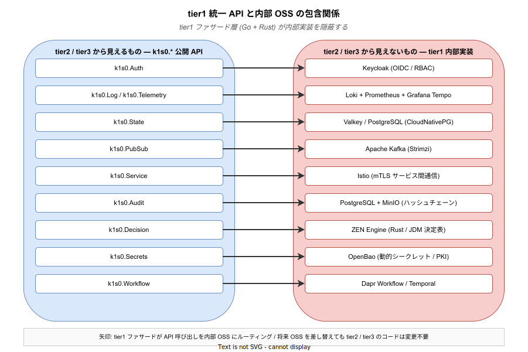

# 01. 用語集

## この章の読み方

本章は、k1s0 要件定義書を読み進めるうえで遭遇する **専門用語を、部外者でも理解できる平易な言葉で解説する辞書** である。

### 通読は不要

本章を最初から最後まで読む必要はない。要件定義書本文 (02 章以降) を読み進めるなかで、知らない用語や曖昧な用語に出会った際に、本章を開いて該当エントリを参照してほしい。各章の本文から `([用語集](./01_用語集.md#xxx))` 形式でリンクが張られている。

### 用語の選定基準

本章に収録した用語は、以下の基準を満たすものである。

- 本要件定義書 (または関連する企画ドキュメント) に登場する
- 専門知識のない読者には直感的に理解しにくい
- 誤解されると要件の解釈が歪む可能性がある

たとえば「OSS」「API」「コンテナ」のような広く浸透した語は、本書の中で使っても混乱は起きないので、一部だけ解説を収録している。一方「Dapr」「mTLS」「ZEN Engine」のような専門性の高い語は、本章を参照しないと正しく読めない。

### 記述方針

- 一つの用語につき、原則として **1〜3 行の短い説明** を付けている。詳細な定義ではなく「読者が要件定義書を読むためにひとまず必要な理解」を優先する。
- **カタカナや英語の原文** は、それが業界で標準化されている場合はそのまま使う (例: マイクロサービス / API / コンテナ)。無理に日本語訳しない。
- 関連する用語は **カテゴリごと (A〜K)** にまとめている。用語同士の関係を把握したい場合は、カテゴリ単位で通読するとよい。

---

## 用語カテゴリの全体像

本章の用語は以下の 10 カテゴリ (A〜J) に分類している。要件定義書本文のどの章を読むかに応じて、関係するカテゴリも変わる。末尾の K 節はカテゴリではなく、学習経路の提案である。

| カテゴリ | 主な用語 | 主に関係する章 |
|---|---|---|
| A. プラットフォーム全体 | k1s0 / JTC / IDP / tier / 横断的関心事 / MVP | 02 / 04 / 09 |
| B. コンテナと Kubernetes | コンテナ / Kubernetes / Pod / HPA / KEDA | 05 / 06 |
| C. サービスメッシュ・通信 | Istio / Envoy / mTLS / OIDC / Keycloak / JWT / RBAC | 05 / 06 |
| D. Dapr と tier1 | Dapr / Dapr 隠蔽 / ファサード / State Store / Pub-Sub / ワークフロー / ZEN Engine | 02 / 05 |
| E. 観測性 | Observability / ログ / メトリクス / トレース / LGTMP / SLO | 05 / 06 |
| F. データ・ストレージ | RDBMS / PostgreSQL / KVS / Valkey / Longhorn / MinIO | 05 / 06 |
| G. CI/CD・配信 | GitHub Actions / Argo CD / Backstage / Harbor / Renovate / PWA / MSIX | 05 / 07 |
| H. セキュリティ | CVE / SBOM / OpenBao / ハッシュチェーン / サプライチェーン | 06 / 07 |
| I. 開発プロセス | ADR / RTM / MoSCoW / バス係数 / Postmortem / Runbook / 挑戦者タイプ / 守護者タイプ | 00 / 03 / 10 |
| J. 企業システム | オンプレミス / 閉域ネットワーク / マイクロサービス / レガシー / TCO / ロックイン | 04 / 07 |

---

## 全体地図: tier1 統一 API と内部 OSS の関係

個別の用語に入る前に、本プロジェクトで最も重要な構造を 1 枚の図で示す。

### この図の意図

図の **左側 (青)** は、tier2 / tier3 の開発者が日常的に触れる `k1s0.*` 公開 API である。左側の用語 (Auth / Log / State / PubSub / Audit / Decision / Secrets / Workflow) は、**業務アプリを作る開発者にとっての入り口** である。

図の **右側 (赤)** は、tier1 が内部で利用する OSS である。右側の用語 (Keycloak / Kafka / Valkey / Istio / ZEN Engine / OpenBao など) は、**基盤チームが面倒を見る領域** であり、tier2 / tier3 からは見えない。

図の **矢印** は、左の API 呼び出しが tier1 ファサード層 (Go + Rust) で変換され、右の OSS へとルーティングされることを示す。将来、右側の OSS が別の技術に差し替わっても、左側の API 呼び出しは変更不要である。

この **「見えるもの」と「見えないもの」の分離** が k1s0 の核心的な設計であり、本用語集でも左側 (A, D カテゴリ) と右側 (B, C, E, F, G, H カテゴリ) が区別されて登場する。

---

## A. プラットフォーム全体に関する用語

このカテゴリは、k1s0 プロジェクト全体を俯瞰するための骨格語である。02 章 (プロジェクト概要) や 09 章 (スコープ) を読む際に必須の語が並ぶ。

### k1s0 (けいいちぜろ)

本プロジェクトで開発するマイクロサービス基盤プラットフォーム本体の名称。JTC 情報システム部門向けに、オンプレミス環境で完結する OSS 積み上げ型の開発・実行・配信基盤を提供する。名前の由来は、Kubernetes の略称 k8s と 1 人から始める意思表示 (1-zero) の掛け合わせ。

### JTC (Japanese Traditional Company)

「日本の伝統的大企業」を指す俗称。本書ではとくに **情報システム部門を抱える中堅〜大企業** を想定する。以下のような特徴を持つ。

- オンプレミス / VMware / 閉域ネットワークが主流
- 高額な年次ライセンスは稟議のハードルが高い
- レガシー資産 (.NET Framework など) を捨てられない
- 情シス子会社 / ベンダー委託が混在

### 情シス / 情報システム部門

企業内のシステム企画・導入・運用を担当する部門。k1s0 の主要顧客。

### IDP (Internal Developer Platform)

社内開発者向けのプラットフォーム製品群を指す業界用語。Backstage (OSS) / Port (商用) / Humanitec (商用) などが存在する。k1s0 はオンプレで動く OSS 積み上げ型 IDP と位置付けられる。

### tier (階層)

k1s0 のアーキテクチャで使われる層の呼称。infra → tier1 → tier2 → tier3 の順に下から上へ積み上がる。tier という概念を導入する意図は、**「統一すべき層」と「自由にしてよい層」を明確に分離する** ことにある。

| 層 | 役割 | 言語の自由度 |
|---|---|---|
| infra | Kubernetes・メッシュ・メッセージングなどの基盤 OSS | OSS の選定に従う |
| tier1 | 横断的関心事を統一 API として提供する基盤 (k1s0 の核心) | Go + Rust のみ |
| tier2 | 業務ドメインのロジックを実装するサービス群 | C# / Go 自由 |
| tier3 | エンドユーザー向けの UI / API | C# / Go / TS / MAUI 自由 |
| operation | 運用・監視・リリース | 横断 |

### 横断的関心事 (Cross-Cutting Concerns)

認証・ログ・監視・監査・メッセージング・状態管理など、**どの業務アプリにも共通して必要になる非機能的な機能** のこと。従来はプロジェクトごとに独自実装され、コピペとバグが量産される原因となっていた。k1s0 ではこれらを tier1 に集約する。

### MVP (Minimum Viable Product)

「実用最小限の製品」。リリース判断に足る最小機能セットを短期間で作り、フィードバックを得るための開発手法。k1s0 では MVP を 2 段階 (MVP-0 / MVP-1) に分ける。これは、起案者 1 名で全機能を作るバス係数 1 リスクを、プロセス設計で解消する工夫である。

---

## B. コンテナと Kubernetes 関連

このカテゴリは、k1s0 の **実行基盤 (infra 層)** を理解するための用語である。要件定義書本文 (05 章 / 06 章) で頻出する。

### コンテナ (Container)

アプリと動作に必要なライブラリ・設定を一つのパッケージにまとめて、どの環境でも同じように動かせるようにした実行単位。代表例は Docker コンテナ。

比喩で言うと「**持ち運び可能な引越しダンボール**」。中身 (アプリ + 依存) を完結させてあるため、どのサーバに置いても同じように動く。

### Kubernetes (k8s)

コンテナを大量に扱うための **オーケストレーション (群管理)** ソフトウェア。アプリの起動・停止・負荷分散・障害復旧を自動化する。「コンテナの羊飼い」に例えられる。CNCF (下記参照) のプロジェクトであり、業界のデファクトスタンダード。

### Pod

Kubernetes における最小の実行単位。1 つ以上のコンテナをまとめたもの。複数のコンテナが同じ Pod に同居する場合、それらはネットワークとボリュームを共有する。

### kubeadm

Kubernetes クラスタを構築するための公式ツール。オンプレ環境で自前のクラスタを立てるのに使う。k1s0 では Phase 1 で kubeadm を採用し、商用 k8s ディストリビューション (OpenShift / Tanzu 等) は採用しない。

### HPA (Horizontal Pod Autoscaler)

Kubernetes 標準の水平スケーリング機能。CPU 使用率などに応じて Pod 数を自動で増減する。tier1 のような常時稼働サービスに適する。

### KEDA (Kubernetes Event-Driven Autoscaling)

Kubernetes 上のイベント駆動スケーリング OSS。Kafka のメッセージ蓄積量や HTTP RPS などのイベントをトリガーに Pod 数を自動調整する。CNCF Graduated プロジェクト。tier2 / tier3 のバースト的な負荷への追従に使う。

### CNCF (Cloud Native Computing Foundation)

Kubernetes をはじめとするクラウドネイティブ OSS を管理する中立的財団。プロジェクトの成熟度に応じて **Sandbox → Incubating → Graduated** の 3 段階に分類される。k1s0 では、ベンダーロックイン回避のため CNCF 管理 OSS を優先採用する。

### NetworkPolicy

Kubernetes の機能の 1 つで、Pod 間の通信を許可 / 拒否するルールを定義する。tier 間の不正通信を防ぐ安全弁。

### GitOps

Git リポジトリを「システムのあるべき姿」の正として、自動的に環境へ反映する運用手法。**Git にマージしたものが、そのまま本番に反映される** という一方向フローを徹底する。k1s0 では Argo CD を用いる。

### Argo CD

GitOps を実現する OSS。Git リポジトリの変更を検知し、Kubernetes クラスタに自動同期する。

### Helm / Kustomize

Kubernetes マニフェスト (設定ファイル) のテンプレート化・カスタマイズツール。k1s0 では両者を使い分ける (詳細は [`../02_infra/00_ADR/ADR-0003-kustomize-helm-strategy.md`](../02_infra/00_ADR/ADR-0003-kustomize-helm-strategy.md))。

---

## C. サービスメッシュ・通信関連

このカテゴリは、**マイクロサービス間の通信をどう安全・確実にするか** に関する用語である。05 章 (機能要件) と 06 章 (非機能要件、特にセキュリティ節) で頻出する。

### サービスメッシュ (Service Mesh)

マイクロサービス間の通信を、各サービスに手を入れずに暗号化・監視・制御するためのレイヤ。アプリのコードを変更せずに、**通信の安全性と可視性を一括で導入できる** のが最大の利点。サイドカー方式が一般的。

### サイドカー (Sidecar)

アプリ本体の横に併走させる補助用コンテナ。アプリに代わって通信・ログ・認証などを処理する。Istio では Envoy プロキシがサイドカーとして動く。

### Istio

代表的なサービスメッシュ OSS。mTLS による通信暗号化・トラフィック制御 (リトライ / サーキットブレーカー) ・観測性を提供する。

### Envoy / Envoy Gateway

高性能な L7 プロキシ OSS (Envoy) と、それを Kubernetes Gateway API 準拠で使うための製品 (Envoy Gateway)。Istio のサイドカーとしても Envoy が使われている。

### mTLS (Mutual TLS)

相互 TLS 認証。クライアントとサーバの双方が証明書を提示することで、なりすましを防ぐ通信方式。k1s0 では Istio が全サービス間通信に自動で適用する。

### OIDC (OpenID Connect)

OAuth 2.0 を拡張した認証プロトコル。ユーザの ID 情報をトークン (JWT) として受け渡す標準。k1s0 では Keycloak を ID プロバイダとして採用する。

### Keycloak

OSS の Identity Provider (ID プロバイダ)。OIDC / OAuth 2.0 / SAML に対応し、SSO を実現する。

### SSO (Single Sign-On)

一度ログインすれば、関連する複数のサービスに再ログインなしでアクセスできる仕組み。k1s0 では Backstage / Grafana / Argo CD / 配信ポータル / Harbor / 業務アプリが Keycloak SSO で統一される。

### JWT (JSON Web Token)

トークンの標準フォーマット。ユーザ情報や権限をコンパクトに署名付きで表現する。

### RBAC (Role-Based Access Control)

役割ベースのアクセス制御。「管理者」「開発者」などの役割を定義し、役割に権限を紐付ける。k1s0 では Keycloak RBAC + k8s RBAC + Istio AuthorizationPolicy の 3 層で認可を構成する。

---

## D. Dapr と tier1 関連

このカテゴリは、**k1s0 の心臓部である tier1** を理解するための用語である。Dapr 隠蔽の設計意図を掴むと、プロジェクト全体の骨格が見えやすくなる。

### Dapr (Distributed Application Runtime)

マイクロサービスでよく必要になる機能 (State Store / Pub-Sub / Service Invocation / Workflow など) をサイドカーとして提供する OSS。CNCF Graduated。k1s0 では tier1 内部で利用し、tier2 / tier3 からは直接触らせない (Dapr 隠蔽方針)。

### Dapr 隠蔽

tier2 / tier3 が Dapr の API を直接使わないよう、tier1 が独自の統一 API で包むこと。将来 Dapr を別の技術に差し替えても tier2 / tier3 に影響が及ばないようにする、設計上の重要な判断。詳細は [`../01_企画/03_tier1設計/01_Dapr隠蔽方針.md`](../01_企画/03_tier1設計/01_Dapr隠蔽方針.md) を参照。

### ファサード (Facade)

複雑な内部処理を、単純な統一 API で包む設計パターン。k1s0 の tier1 Go 実装は Dapr のファサードとして機能する。**ホテルのフロントデスク** に例えられる。客 (tier2/tier3) はフロントに依頼するだけでよく、裏のスタッフ配置や部屋割り (Dapr や Kafka) を意識する必要がない。

### Building Blocks (Dapr の構成要素)

Dapr が提供する標準機能群 (State / Pub-Sub / Bindings / Actors / Workflow / Secrets / Configuration など)。

### State Store

KVS (Key-Value Store) 型のデータ永続化抽象。Dapr では Valkey / PostgreSQL / MongoDB など多数のバックエンドをサポート。

### Pub-Sub (Publisher-Subscriber)

イベントを発行 (Publish) し、関心のあるサービスが購読 (Subscribe) する非同期通信パターン。k1s0 では Kafka をバックエンドとして採用。

### Kafka (Apache Kafka)

分散メッセージブローカー。大量のイベントを高スループットで処理する OSS のデファクトスタンダード。Strimzi オペレータで k8s 上に構築する。

### ワークフロー (Workflow)

複数のステップを順序・並列・条件分岐で組み合わせ、途中失敗しても再開できる処理の枠組み。k1s0 では **短期 (秒〜分) は Dapr Workflow、長期 (数日〜数か月) は Temporal** で使い分ける。

### Temporal

ワークフローを確実に実行するためのプラットフォーム OSS。人間の承認が絡む長期ワークフロー (数日 - 数か月) に適している。

### ZEN Engine

Rust 製のビジネスルールエンジン (BRE: Business Rule Engine)。決定表 (Decision Table) で業務ルールを宣言的に表現できる。tier1 に組み込む。

### BRE (Business Rule Engine)

業務ルールを if-else のハードコードではなく、決定表やルール定義ファイルとして外出しするためのエンジン。ルール変更を開発者でなく業務側が行えるようにする。たとえば「10,000 円以上の稟議は課長承認が必要」のようなルールを、プログラムを変更せず表を書き換えるだけで変更できる。

---

## E. 観測性 (Observability) 関連

このカテゴリは、**システムが動いている状態を外から観察・推測する** ための用語である。マイクロサービス環境では、問題発生時に「どこで何が起きたか」を追跡する能力が必須であり、本カテゴリの用語は 05 章 (FR-020 以降の観測性機能) と 06 章 (NFR-040 運用性) に関わる。

### 観測性 / Observability

システム内部の状態を、外部から収集した情報 (ログ / メトリクス / トレース) で推測できる性質。**モニタリング (監視)** が「既知の異常を検知する」ことなのに対し、**観測性** は「未知の問題の原因を追跡できる」ことを意味する。

### ログ (Log)

システムが時系列で出力する文字列データ。Loki (下記) に集約される。「何が起きたかを時系列で記録した日誌」に相当する。

### メトリクス (Metrics)

数値の時系列データ (CPU 使用率・リクエスト数・エラー率など)。Prometheus (下記) が収集する。「計器の指針を継続的に記録したもの」に相当する。

### トレース (Trace)

1 つのリクエストが複数サービスを経由する際の経路と所要時間の記録。分散トレーシングとも呼ぶ。「1 通の郵便物がどの郵便局をいつ通ったかを追跡したもの」に相当する。

### OpenTelemetry (OTel)

ログ / メトリクス / トレースを統一的に扱うための業界標準 OSS。CNCF Incubating。k1s0 ではすべての送信側 (tier1 / tier2 / tier3) が OpenTelemetry に準拠する。

### Prometheus

メトリクス収集・保存の OSS デファクトスタンダード。CNCF Graduated。

### Grafana

メトリクス・ログ・トレースを統合的に可視化するダッシュボード OSS。

### Grafana Tempo / Loki / Pyroscope

Grafana Labs 製の OSS 観測製品。
- Tempo: 分散トレーシング保存
- Loki: ログ保存 (Prometheus ライクに low-cost)
- Pyroscope: 継続的プロファイリング (CPU / メモリ使用の詳細)

### LGTMP スタック

**L**oki / **G**rafana / **T**empo / **M**imir / **P**rometheus を組み合わせた観測スタックの総称。k1s0 では観測基盤をこのスタックで統一する。

### SLO / SLI / エラーバジェット

- **SLI (Service Level Indicator)**: 実測値 (例: 可用性 99.8%)
- **SLO (Service Level Objective)**: 目標値 (例: 可用性 99.5% 以上)
- **エラーバジェット**: SLO で許容される違反時間 (例: 月間 3.6 時間のダウンタイム枠)

エラーバジェットの概念は重要で、「100% を目指さない・99.5% を目指す」という割り切りを組織的に合意するための仕組みである。

---

## F. データ・ストレージ関連

このカテゴリは、**永続化が必要なデータをどこに置くか** に関する用語である。

### RDBMS (Relational Database Management System)

表形式でデータを管理する古典的データベース。k1s0 では PostgreSQL を採用。

### PostgreSQL (Postgres)

OSS の高機能 RDBMS。Keycloak / Backstage / 業務サービスで共有する。

### CloudNativePG

Kubernetes 上で PostgreSQL をクラウドネイティブに運用するためのオペレータ OSS。HA (高可用性) / バックアップ / 接続プーリングなどを自動化する。

### KVS (Key-Value Store)

キーと値を対応付けて保存する単純なデータストア。高速だが SQL のような複雑な検索はできない。

### Valkey

Redis 7.2 の OSS フォーク。キャッシュ / セッション / リアルタイム処理向けの KVS。Redis のライセンス変更 (SSPL) を受け、Linux Foundation 管理で 2024 年に立ち上げられた。

### Longhorn

Kubernetes 上でブロックストレージを提供する OSS。ノード障害時もデータを保護する。CNCF Incubating。

### MinIO

S3 互換のオブジェクトストレージ OSS。Harbor のイメージ / OpenTofu State / バックアップの統一保存先。

### オブジェクトストレージ

ファイルよりも大きな単位 (オブジェクト) でデータを保存するストレージ方式。AWS S3 / Azure Blob / MinIO が代表例。「無限に深い倉庫に箱単位で物を入れていく」イメージ。

---

## G. CI/CD・配信関連

このカテゴリは、**コードを書いてから本番環境に届くまで** の自動化の用語である。

### CI/CD (Continuous Integration / Continuous Delivery)

コードの統合・ビルド・テスト・配信を自動化する仕組み。k1s0 では GitHub Actions + Argo CD を採用。

### GitHub Actions (GHA)

GitHub 提供の CI/CD サービス。

### Backstage

Spotify が開発した OSS の開発者ポータル。サービスカタログ / TechDocs / Software Templates を統合提供。CNCF Incubating。

### Software Catalog

Backstage の機能。社内の全サービスの一覧・依存関係・オーナー情報を集中管理する。

### TechDocs

Backstage の機能。各サービスの README / 設計書を Markdown で集中公開する仕組み。

### Software Templates

Backstage の機能。雛形から新規サービスを数クリックで生成できる。

### Harbor

コンテナイメージを保存するレジストリの OSS。署名 / 脆弱性スキャン / レプリケーションに対応。CNCF Graduated。

### Renovate

OSS 依存パッケージの更新 PR を自動生成するツール。CVE (脆弱性) 対応の迅速化に用いる。

### Cosign / Kyverno

- **Cosign**: コンテナイメージに署名を付与する OSS (sigstore プロジェクト)
- **Kyverno**: Kubernetes のポリシーエンジン。署名のないイメージの実行を拒否する等のガードを実装

### OpenTofu

Terraform の OSS フォーク (MPL-2.0)。IaC (Infrastructure as Code) を宣言的に実行する。HashiCorp の Terraform が BSL ライセンス化したことを受けて 2023 年にフォークされた。

### IaC (Infrastructure as Code)

インフラ (VM / ネットワーク / k8s クラスタ) をコードで記述し、コマンド一発で再現可能にする手法。

### Flagd / OpenFeature

Feature Flag を統一 API で扱うための OSS。段階的ロールアウトや A/B テストを有効化する。

### アプリ配信ポータル

k1s0 独自の業務アプリストア。エンドユーザがブラウザからアプリを検索・起動できる。PWA / MSIX のインストール・アンインストールを一元管理。

### PWA (Progressive Web App)

Web アプリをネイティブアプリのようにインストール・オフライン利用できる技術。

### MSIX

Windows 向けのアプリパッケージ形式。MSI / exe の後継。

---

## H. セキュリティ関連

このカテゴリは、**脆弱性・機密情報・監査ログ** に関する用語である。

### CVE (Common Vulnerabilities and Exposures)

公開されている脆弱性情報の識別子。`CVE-2024-XXXXX` の形式。

### SBOM (Software Bill of Materials)

ソフトウェア部品表。どの OSS がどのバージョンで使われているかを機械可読に記録。サプライチェーン攻撃に備えて、使用 OSS の棚卸しを可能にする。

### Secret (シークレット)

パスワード・API キー・証明書など、漏洩すると被害が生じる情報。OpenBao (下記) で一元管理する。

### OpenBao

HashiCorp Vault の LF (Linux Foundation) フォーク OSS。動的シークレット / 自動ローテーション / Transit 暗号化 / PKI に対応。

### ハッシュチェーン

監査ログなどの改ざん防止のため、前のレコードのハッシュを次のレコードに含める連鎖構造。1 レコード改ざんされると後続全てのハッシュが不整合になり、改ざんを検出できる。ブロックチェーンの基礎技術でもある。

### サプライチェーンセキュリティ

OSS 依存 → イメージビルド → 配置 の各段階で、悪意ある改変を検出・防止する対策の総称。k1s0 では Trivy / Cosign / Kyverno / Harbor を組み合わせる。

### Trivy

コンテナイメージや依存パッケージの脆弱性スキャナ OSS。

---

## I. 開発プロセス関連

このカテゴリは、**要件・設計・実装・運用を進めるうえでのプロセス用語** である。

### ADR (Architecture Decision Record)

設計上の重要判断を、意思決定時の文脈・選択肢・理由とともに文書化したもの。本プロジェクトでは `docs/02_infra/00_ADR/` に格納する。

### RTM (Requirements Traceability Matrix)

要件 → 設計 → 実装 → テストの対応関係を表にまとめたもの。要件漏れや未テストの検知に使う。

### MoSCoW 分析

要件の優先順位付け手法。**M**ust / **S**hould / **C**ould / **W**on't の 4 段階。本要件定義書で採用。

### バス係数 (Bus Factor / Truck Factor)

「そのプロジェクトが停止する人数」。バス係数 1 とは「1 人抜けたら終わる」状態。本書では意図的に 2 以上を目指す。

### Chaos Engineering

本番相当の環境で意図的に障害を注入し、システムの回復力を検証する手法。k1s0 では Litmus OSS を使う。

### Postmortem (ポストモーテム)

インシデント発生後に、原因・対応・再発防止を文書化する活動。個人を責めず構造要因に目を向ける文化 (Blameless Postmortem) を推奨。

### Runbook

アラートに対して「どう対応すればよいか」を記したマニュアル。運用担当者が参照する。k1s0 では Backstage の TechDocs 上に集約する。

### 挑戦者タイプ (ペルソナ)

本プロジェクトで定義したペルソナの一類型。新技術を積極的に学び、組織の技術的停滞を打破したいと考える若手〜中堅 (30 代前後) の人物像。k1s0 の tier1 開発や技術基盤構築の推進力として期待される。詳細は [`03_ステークホルダー.md`](./03_ステークホルダー.md) を参照。

### 守護者タイプ (ペルソナ)

本プロジェクトで定義したペルソナの一類型。10〜20 年にわたって既存システムを安定運用してきたベテランで、新技術導入に慎重な姿勢を取る人物像。過去に新技術導入の失敗を経験していることが多い。反対勢力ではなく「既存を壊さない保証がなければ賛同しない」という合理的な立場であり、BR-005 (レガシー共存) がこの層との合意形成に不可欠。詳細は [`03_ステークホルダー.md`](./03_ステークホルダー.md) を参照。

---

## J. 企業システム用語

このカテゴリは、**JTC 情シス部門ならではの環境・慣習用語** である。07 章 (制約条件) を理解するために重要。

### オンプレミス (On-premises)

自社でサーバを保有し、社内ネットワーク内で運用する方式。対義語はクラウド。k1s0 はこの方式を前提とする。

### 閉域ネットワーク

インターネットから隔離された社内専用ネットワーク。JTC では業務システムがここに配置されることが多い。

### マイクロサービス (Microservices)

大きな 1 つのアプリ (モノリス) を、独立して開発・デプロイ可能な小さなサービス群に分割するアーキテクチャ。

### モノリス (Monolithic Architecture)

1 つの巨大なアプリにすべての機能を詰め込む従来型の構成。変更の影響範囲が大きくなる欠点がある。k1s0 は tier 構造により部分的にモノリス回避を目指す。

### レガシー (Legacy)

長期間運用されて新技術への追従が難しくなったシステム。k1s0 では .NET Framework 資産の共存を第一級に扱う。

### TCO (Total Cost of Ownership)

所有総コスト。導入費だけでなく、運用・保守・撤退までの総費用を指す。経営層への訴求には、初期費用ではなく TCO で語ることが効果的。

### ベンダーロックイン (Vendor Lock-in)

特定ベンダー製品に依存しすぎて、撤退や乗り換えが困難になる状態。k1s0 はこれを回避することを設計原則とする。具体例: VMware Broadcom 買収後の値上げ、HashiCorp Terraform の BSL ライセンス化など。

---

## K. 用語の相互参照と学習経路の提案

ここまで 10 カテゴリに分けて用語を解説したが、**用語同士の関係性** を把握すると記憶に残りやすい。以下は学習経路の提案である。

### K.1 「tier1 統一 API を理解する」経路

1. **A** k1s0 / tier / 横断的関心事 — 全体像を把握
2. **D** Dapr / ファサード / Dapr 隠蔽 — 設計の核心を理解
3. **C** Keycloak / OIDC / mTLS — 認証・通信の基盤
4. **E** Observability / LGTMP / Tempo — 観測基盤

### K.2 「セキュリティと運用性を理解する」経路

1. **I** Runbook / Postmortem — 運用の基本単位
2. **H** CVE / Secret / ハッシュチェーン — 脅威と対策
3. **C** RBAC / JWT — 認可の仕組み
4. **E** SLO / エラーバジェット — 品質の数値化

### K.3 「CI/CD と配信を理解する」経路

1. **G** GitHub Actions / Argo CD / GitOps — 自動化の流れ
2. **G** Harbor / Trivy — イメージ管理
3. **G** Renovate / Cosign / Kyverno — サプライチェーン防御
4. **G** Backstage / アプリ配信ポータル — 利用者接点

### K.4 「JTC 制約を理解する」経路

1. **J** オンプレミス / 閉域ネットワーク — 環境制約
2. **J** レガシー / ベンダーロックイン — 歴史的負債
3. **J** TCO — 経営判断の軸

---

## 関連ドキュメント

- [`README.md`](./README.md) — 要件定義書のインデックス
- [`00_はじめに.md`](./00_はじめに.md) — 本書の目的と記載方針
- [`02_プロジェクト概要.md`](./02_プロジェクト概要.md) — k1s0 全体像 (本章の用語が登場する最初の章)
- [`../01_企画/04_技術選定/`](../01_企画/04_技術選定/) — 各 OSS の選定根拠
- [`../01_企画/03_tier1設計/`](../01_企画/03_tier1設計/) — tier1 設計の詳細
